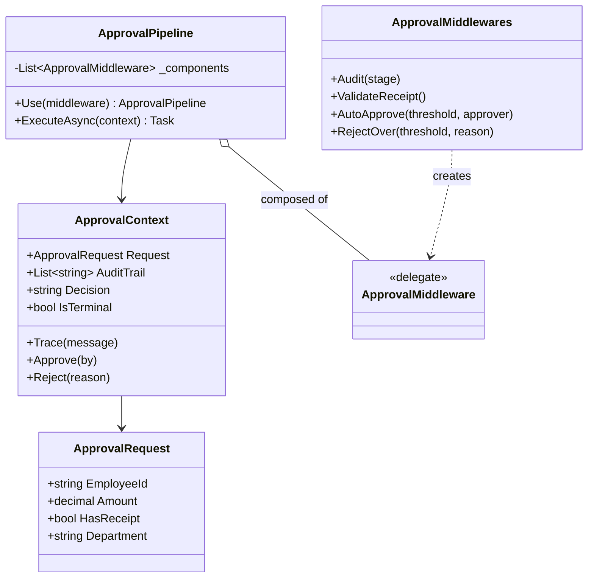
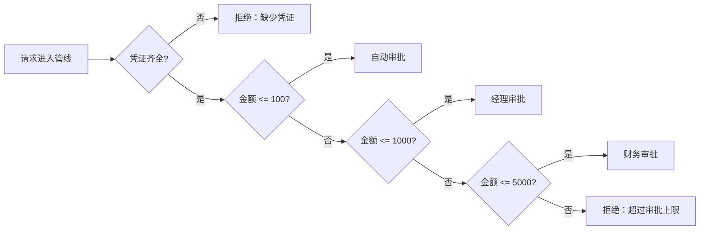

---
date: "2026-04-17"
title: "设计模式教科书｜Chain of Responsibility：请求沿链传递"
description: "Chain of Responsibility 解决的是一个请求要经过多道判断、多个处理器，并且不一定由同一个对象完成的问题。它把审批、拦截、过滤和转交串成一条可组合的链，让顺序、短路和职责边界都能被显式表达。"
slug: "patterns-08-chain-of-responsibility"
weight: 908
tags:
  - 设计模式
  - Chain of Responsibility
  - 软件工程
series: "设计模式教科书"
---

> 一句话定义：Chain of Responsibility 把“谁来接手这个请求”变成一条可组合、可短路、可替换的处理链。

## 历史背景

Chain of Responsibility 并不是为了“把 if/else 变得更高级”才出现的。它真正解决的是早期面向对象系统里常见的一个痛点：请求来了以后，谁来处理、处理到哪一层、是否继续往下传，这些决策会随着业务增长迅速失控。GoF 在 1994 年把这种“请求沿着一串对象传递”的做法整理成模式。更早的事件过滤器、UI 消息分发、网络拦截器，其实都已经在使用类似的结构。

到了现代，这个模式的舞台变得更大了。ASP.NET Core 的 middleware、OkHttp 的 interceptor、认证链、风控链、审批链，本质上都在做同一件事：先判断，再决定是否继续，再在必要时把请求交给下一个节点。C# 的 `delegate`、`async/await` 和局部函数，还把它从“很多小类”压缩成了“轻量管线”。模式没变，写法变轻了。

## 一、先看问题

报销审批最容易把责任链的价值暴露出来。  
一张单子进来，系统要先看凭证，再看金额，再看审批额度，再决定是通过还是驳回。  
如果没有责任链，最常见的写法就是把所有规则堆进一个服务方法里。

```csharp
using System;

public sealed class ReimbursementService
{
    public string Approve(string employeeId, decimal amount, bool hasReceipt, string department)
    {
        if (!hasReceipt)
        {
            return "拒绝：缺少凭证";
        }

        if (amount <= 100m)
        {
            return "批准：自动审批";
        }

        if (amount <= 1000m && department != "Finance")
        {
            return "批准：经理审批";
        }

        if (amount <= 5000m)
        {
            return "批准：财务审批";
        }

        return "拒绝：超过审批上限";
    }
}
```

这段代码能跑，但它把三件本来应该分开的事情揉成一团了。

- 业务规则和分发规则绑在一起，读代码的人必须从上到下扫完。
- 一旦新增“法务审批”或“地区特批”，主方法就要改。
- 某些步骤要短路，某些步骤要继续传递，行为越来越难推理。
- 测试也开始变脆：你不是在测一个步骤，而是在测一长串条件的排列组合。

更糟的是，顺序本身已经变成业务规则，却没有人把它当成设计的一部分。  
这时，责任链不是“换一种写法”，而是把“转交权”从主方法里拿出来。

## 二、模式的解法

责任链的核心不是链条本身，而是每个节点只做一件事：  
要么接手请求，要么把请求继续传给下一个节点。

现代 C# 里，不一定非要把每个节点都写成一个类。  
如果节点是无状态的，`delegate` 管线比一堆小对象更轻。  
如果节点需要依赖注入、生命周期或复杂状态，再退回类链也不迟。

下面这份代码演示一个纯 C# 的审批管线。它支持短路、审计日志和可重组顺序。

```csharp
using System;
using System.Collections.Generic;
using System.Threading.Tasks;

public sealed record ApprovalRequest(
    string EmployeeId,
    decimal Amount,
    bool HasReceipt,
    string Department);

public sealed class ApprovalContext
{
    public ApprovalContext(ApprovalRequest request)
    {
        Request = request ?? throw new ArgumentNullException(nameof(request));
    }

    public ApprovalRequest Request { get; }
    public List<string> AuditTrail { get; } = new();
    public string Decision { get; private set; } = "Pending";
    public bool IsTerminal { get; private set; }

    public void Trace(string message) => AuditTrail.Add(message);

    public void Approve(string by)
    {
        EnsureWritable();
        Decision = $"批准：{by}";
        IsTerminal = true;
        AuditTrail.Add(Decision);
    }

    public void Reject(string reason)
    {
        EnsureWritable();
        Decision = $"拒绝：{reason}";
        IsTerminal = true;
        AuditTrail.Add(Decision);
    }

    private void EnsureWritable()
    {
        if (IsTerminal)
        {
            throw new InvalidOperationException("审批结果已经落定，不能重复写入。");
        }
    }
}

public delegate Task ApprovalMiddleware(ApprovalContext context, Func<Task> next);

public sealed class ApprovalPipeline
{
    private readonly List<ApprovalMiddleware> _components = new();

    public ApprovalPipeline Use(ApprovalMiddleware middleware)
    {
        _components.Add(middleware ?? throw new ArgumentNullException(nameof(middleware)));
        return this;
    }

    public async Task ExecuteAsync(ApprovalContext context)
    {
        if (context is null) throw new ArgumentNullException(nameof(context));

        var index = 0;
        Func<Task> next = null!;

        next = async () =>
        {
            if (context.IsTerminal || index >= _components.Count)
            {
                return;
            }

            var current = _components[index++];
            await current(context, next);
        };

        await next();

        if (!context.IsTerminal)
        {
            context.Reject("没有处理器接手请求");
        }
    }
}

public static class ApprovalMiddlewares
{
    public static ApprovalMiddleware Audit(string stage) => async (context, next) =>
    {
        context.Trace($"{stage}: before");
        await next();
        context.Trace($"{stage}: after");
    };

    public static ApprovalMiddleware ValidateReceipt() => (context, next) =>
    {
        if (!context.Request.HasReceipt)
        {
            context.Reject("缺少凭证");
            return Task.CompletedTask;
        }

        context.Trace("凭证齐全");
        return next();
    };

    public static ApprovalMiddleware AutoApprove(decimal threshold, string approver) => (context, next) =>
    {
        if (context.Request.Amount <= threshold)
        {
            context.Approve(approver);
            return Task.CompletedTask;
        }

        return next();
    };

    public static ApprovalMiddleware RejectOver(decimal threshold, string reason) => (context, next) =>
    {
        if (context.Request.Amount > threshold)
        {
            context.Reject(reason);
            return Task.CompletedTask;
        }

        return next();
    };
}

public static class Program
{
    public static async Task Main()
    {
        var pipeline = new ApprovalPipeline()
            .Use(ApprovalMiddlewares.Audit("审批链"))
            .Use(ApprovalMiddlewares.ValidateReceipt())
            .Use(ApprovalMiddlewares.AutoApprove(100m, "自动审批"))
            .Use(ApprovalMiddlewares.AutoApprove(1000m, "经理审批"))
            .Use(ApprovalMiddlewares.AutoApprove(5000m, "财务审批"))
            .Use(ApprovalMiddlewares.RejectOver(5000m, "超过审批上限"));

        var context = new ApprovalContext(new ApprovalRequest(
            employeeId: "E-1001",
            amount: 860m,
            hasReceipt: true,
            department: "Ops"));

        await pipeline.ExecuteAsync(context);

        Console.WriteLine(context.Decision);
        foreach (var line in context.AuditTrail)
        {
            Console.WriteLine(line);
        }
    }
}
```

这份实现把“谁处理请求”拆成了独立的 middleware。  
`ValidateReceipt` 只负责凭证。  
`AutoApprove` 只负责额度。  
`RejectOver` 只负责最后兜底。  
`Audit` 则展示了典型中间件的前后置逻辑：进入时记录一次，离开时再记录一次。

如果你把这一层换成对象链，结构不会变，只是调用形态从 `delegate` 变成了 `SetNext`。  
这也是 Chain of Responsibility 的一个关键事实：**它是一种控制流组织方式，不是一种固定语法。**

## 三、结构图



这张图有两个重点。  
第一，`ApprovalPipeline` 是组装器，不是业务规则本体。  
第二，`ApprovalContext` 承载了“请求在链上流动时的共同状态”。如果状态没有边界，链条就会退化成一团共享变量。

## 四、时序图



这个流程图刻意把“短路”画出来了。  
责任链不是所有节点都必须执行。  
它的价值恰恰在于：越早找到合适的接手者，越早结束；越不适合接手，就越快继续往后传。

## 五、变体与兄弟模式

Chain of Responsibility 在现代工程里通常有三种脸。

- **纯责任链**：一个节点要么接手，要么转交，最像审批链和过滤链。
- **中间件链**：节点可以在调用前后做额外工作，典型如 ASP.NET Core middleware。
- **拦截器链**：节点围绕原始动作加壳，典型如 OkHttp interceptor。

它最容易和三个模式混。

- **Observer**：Observer 是广播，Chain 是转交。前者面向“很多人都该知道”，后者面向“沿着路径找一个人接手”。
- **Pipeline**：Pipeline 更像分段加工，通常每一段都会执行；Chain 更像门禁，常常在中途短路。
- **Mediator**：Mediator 解决的是对象之间的横向通信，Chain 解决的是请求沿纵向路径的归属问题。

如果你把三者都看成“解耦”，就会把它们用错。  
真正的区别不在于“有没有链”，而在于**控制权到底在谁手里**。

## 六、对比其他模式

| 维度 | Chain of Responsibility | Observer | Pipeline |
|---|---|---|---|
| 控制方式 | 沿链逐个转交 | 事件广播给多个订阅者 | 数据或上下文依次流经多个阶段 |
| 结果数量 | 通常一个节点最终接手 | 可能多个订阅者都执行 | 通常每个阶段都执行 |
| 短路 | 很常见 | 不典型 | 可能有，但不是重点 |
| 语义核心 | 谁来接手 | 谁来响应 | 如何分阶段加工 |
| 典型场景 | 审批、拦截、过滤、风控 | 状态通知、UI 事件、领域事件 | 文本处理、HTTP middleware、编译 pass |

Chain 和 Observer 的分界很清楚。  
Observer 关心“消息发出去以后谁来听”。  
Chain 关心“这个请求到底谁来处理”。  
**判定标准只有一个：如果你允许请求在中途停下并由某一层最终接手，就用 Chain；如果每一层都应该执行并且只做阶段加工，就用 Pipeline；如果同一事件要同时通知多个订阅者，就用 Observer。**

Chain 和 Pipeline 的差异更细。  
Pipeline 强调阶段性加工，像生产线。  
Chain 强调接手权和短路，像门禁。  
同样是“往后传”，一个偏变换，一个偏归属。

## 七、批判性讨论

Chain 最常见的批评是：它很容易把控制流藏起来。  
调用方只看到 `ExecuteAsync`，看不见哪一个节点截断了请求。  
如果没有良好的命名和追踪日志，链就会变成黑箱。

另一个问题是顺序依赖。  
一旦“先校验、再审批、再兜底”成了业务规则，顺序就必须写进设计文档和测试里。  
否则换个顺序，系统行为就会悄悄变掉。

现代语言特性确实让责任链变轻了。  
如果节点只是一个简单判断，没必要为它单独建类。  
`delegate`、局部函数、pattern matching、`switch` 表达式，很多时候已经足够。  
这不是模式失效，而是模式从“类级组织”退化成了“函数级组合”。

真正不该用 Chain 的地方也很明确。

- 所有步骤都必须执行，而且每一步都修改同一份结果时，Pipeline 更合适。
- 需要把请求同时送给多个对象时，Observer 更合适。
- 规则只是少量枚举值映射时，表驱动比链更直白。

责任链不是“把复杂逻辑拆散”就万事大吉。  
它只适合“谁接手”比“怎么处理”更重要的场景。

## 八、跨学科视角

责任链在 Web 框架里最容易被认出来。  
ASP.NET Core middleware 就是它的现代版本：每个组件都能决定是否把请求交给下一个组件，还能在 `next` 前后做事情。  
OkHttp 的 interceptor 也是同一类东西，只是应用在 HTTP 请求/响应链路上。

从函数式角度看，责任链接近“带短路的函数组合”。  
你把一个请求和一个后继函数传给当前处理器，当前处理器要么返回结果，要么把控制权交回去。  
这和纯函数链式组合相比，差别在于它允许中途终止，也允许在前后插入副作用。

从分布式系统看，责任链像网关和 admission controller。  
请求先过认证，再过限流，再过风控，再进核心服务。  
每一层都可以拒绝，也可以放行。  
这种“逐层筛选”的思想，比设计模式本身还要古老。

## 九、真实案例

两个最典型的真实实现，几乎就是责任链教科书。

- [ASP.NET Core Middleware](https://learn.microsoft.com/en-us/aspnet/core/fundamentals/middleware?view=aspnetcore-10.0) 明确写着每个组件都可以把请求传给下一个组件，或者短路管线。对应源码可以看 [RequestDelegate.cs](https://github.com/dotnet/aspnetcore/blob/main/src/Http/Http.Abstractions/src/RequestDelegate.cs) 和 [StaticFileMiddleware.cs](https://github.com/dotnet/aspnetcore/blob/main/src/Middleware/StaticFiles/src/StaticFileMiddleware.cs)。
- [Interceptors - OkHttp](https://square.github.io/okhttp/features/interceptors/) 直接把链的行为写进文档：拦截器可以监控、修改、重试，必要时短路。对应源码可以看 [Interceptor.kt](https://github.com/square/okhttp/blob/master/okhttp/src/commonJvmAndroid/kotlin/okhttp3/Interceptor.kt) 和 [RealInterceptorChain.kt](https://github.com/square/okhttp/blob/master/okhttp/src/commonJvmAndroid/kotlin/okhttp3/internal/http/RealInterceptorChain.kt)。

这两个实现的共同点很重要。  
它们都不把控制流硬编码进业务对象，而是把“谁来继续”交给链上的每一环。  
这就是责任链从审批系统扩展到框架级基础设施的原因。

## 十、常见坑

第一个坑是链太长。  
一条链如果长到十几层，任何人都要花很久才能找到是谁截断了请求。  
这时问题通常不是“要不要再加一层”，而是“是不是该把规则表化、配置化，或者收敛成更清晰的阶段”。

第二个坑是每个节点都背太多状态。  
责任链最怕节点拿着一大坨共享上下文，既读又写。  
一旦这样，链上的每个节点都能偷偷改后面节点的判断基础，调试会很痛苦。

第三个坑是把广播场景硬塞进 Chain。  
如果你要让多个系统同时收到同一个事件，那是 Observer。  
如果你非要用 Chain，只会得到一条“谁接手谁忽略”的伪通知链。

第四个坑是 next 调用语义不清。  
有些中间件会在前后都调用 `next`，有些只会调用一次，有些直接短路。  
这些语义必须被文档化，否则重构时很容易把链的行为改坏。

## 十一、性能考量

责任链的性能模型很直接。

- 最坏情况：一次请求走完整条链，代价是 `O(n)` 次判断和 `O(n)` 次调用。
- 最好情况：第一个节点就短路，代价接近 `O(1)`。
- 空间开销：如果链在启动时组装一次，运行时就是固定的 `O(n)` 节点存量；如果每次请求都新建链，分配成本会立刻放大。

在热点路径上，真正要盯的是常数项，不是抽象名词。  
如果每个节点都只做一次简单判断，链的成本通常远低于 IO、数据库和序列化。  
但如果每个节点都临时分配对象、拼字符串、打日志，链就会从“控制流组织”退化成“额外开销制造机”。

现代 C# 里，delegate 版责任链通常比大而全的对象链更轻。  
如果节点没有独立生命周期，也不需要容器管理，函数组合几乎总是更划算。  
只有当节点本身需要注入依赖、做缓存或承担复杂状态时，才值得把它提升成类。

## 十二、何时用 / 何时不用

适合用：

- 请求可能被多个候选处理器尝试，但通常只需要一个最终节点接手。
- 你想把审批、拦截、校验、风控拆成可组合的步骤。
- 链路顺序本身就是业务规则，而且必须显式表达。

不适合用：

- 所有步骤都必须执行，且每一步都产出新的中间结果。
- 你只是想把一串 if/else 改写成另一串看起来更“架构化”的 if/else。
- 你需要把同一事件同时广播给多个对象。

一句话判断：  
**如果你在问“谁来接手这个请求”，用 Chain；如果你在问“这个请求要怎么加工”，优先看 Pipeline；如果你在问“谁都该知道这件事”，看 Observer。**

## 十三、相关模式

- [Observer](./patterns-07-observer.md)：Observer 是广播，Chain 是转交。
- [Command](./patterns-06-command.md)：Command 把动作对象化，Chain 把接手权对象化。
- [Facade](./patterns-05-facade.md)：Facade 收口入口，Chain 编排处理顺序。
- [Pipeline](./patterns-24-pipeline.md)：Pipeline 强调分阶段加工，Chain 强调找到合适接手者。

## 十四、在实际工程里怎么用

在实际工程里，Chain 经常披着别的名字出现。

- Web 中间件：认证、授权、压缩、日志、异常处理，几乎都是责任链的变体。未来应用线可展开到 [Web 中间件责任链](../../engine-toolchain/build-system/middleware-chain.md)。
- 业务审批：报销、退款、风控、内容审核，通常先筛条件，再决定是否转交给更高层级。未来应用线可展开到 [审批链设计](../../engine-toolchain/build-system/approval-chain.md)。
- 网络客户端：拦截器、重试器、缓存器、签名器，通常是一条可短路的请求链。未来应用线可展开到 [HTTP 拦截链](../../engine-toolchain/build-system/http-interceptor-chain.md)。

责任链之所以能活到今天，不是因为它“经典”，而是因为现代系统仍然需要一种明确的方式来回答：  
请求来了以后，谁先看，谁后看，谁能停，谁必须放行。

## 小结

- Chain of Responsibility 的本质，是把“谁来接手”从主方法里拆出来，交给一串可组合的处理器。
- 它最适合审批、拦截、过滤、风控这类“逐层筛选、可能短路”的问题。
- 它和 Observer、Pipeline 长得像，但控制权完全不同，不能混用。

一句话总括：Chain of Responsibility 的价值，不是让代码看起来更像架构，而是让请求的归属、顺序和短路都变成显式设计。

