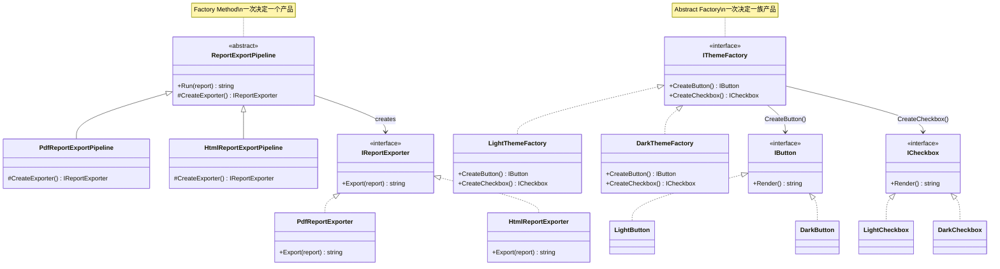

> 一句话定义：Factory Method 决定“创建谁”，Abstract Factory 决定“这一族对象怎么成套创建”。

## 历史背景

Factory 家族也是 GoF 1994 年收编进来的。那个年代的 OOP 项目最常见的坏味道就是：业务代码里到处是 `new`、`switch` 和 `if/else`，创建逻辑和使用逻辑缠成一团。对象一多，代码就会先坏在“选择谁来创建”，而不是坏在对象本身。

今天的语言和框架让它轻量了很多。C# 有 lambda、`switch` 表达式、DI 容器、源码生成和 `ActivatorUtilities.CreateFactory` 这类预编译工厂，很多简单场景已经不需要完整工厂层级。但只要产品类型会变、产品族要保持一致，Factory 仍然是最稳的分界线。
这也是现代实现更轻的原因。C# 的 `switch` 表达式、lambda、记录类型、`Func<T>` 和 DI 容器，已经把很多“小工厂”压缩成一两个函数或一个委托。可一旦产品类型会变、产品族要保持一致，工厂边界仍然很有价值。它守的是“创建边界”，不是机械地把 `new` 挪到别处。

## 一、先看问题

只要系统里出现“根据条件创建不同对象”，业务层就很容易被 `switch` 污染。开始只是一个格式分支，后来就会扩展成平台、主题、供应商、协议版本一起变，最后创建逻辑和业务逻辑混在一起。

下面这个坏例子能跑，但它把创建决策直接塞进了使用方。每加一种格式或主题，调用方都要改。

```csharp
using System;
using System.Collections.Generic;
using System.Linq;

public sealed class Report
{
    public string Title { get; }
    public IReadOnlyList<string> Lines { get; }

    public Report(string title, IEnumerable<string> lines)
    {
        Title = title;
        Lines = lines.ToList();
    }
}

public static class BadReportService
{
    public static string Export(Report report, string format)
    {
        if (format == "pdf")
            return $"[PDF]{report.Title}\n" + string.Join("\n", report.Lines);

        if (format == "html")
            return $"<h1>{report.Title}</h1><p>{string.Join("</p><p>", report.Lines)}</p>";

        throw new NotSupportedException($"未知格式：{format}");
    }
}

public sealed class BadSettingsDialog
{
    public string Render(string theme, string control)
    {
        if (theme == "light" && control == "button") return "[Light Button]";
        if (theme == "light" && control == "checkbox") return "[Light Checkbox]";
        if (theme == "dark" && control == "button") return "[Dark Button]";
        if (theme == "dark" && control == "checkbox") return "[Dark Checkbox]";

        throw new NotSupportedException($"不支持的组合：{theme}/{control}");
    }
}
```

这类代码的问题很具体。第一，调用方知道得太多。第二，新增产品要改旧代码。第三，如果是“产品族”而不是单个产品，组合会指数级变复杂。你以为在写创建代码，实际在往业务层埋爆炸半径。

Factory 家族要解决的，就是把“创建决定”从使用方手里拿走。调用方只表达需求，具体实例化谁，由工厂决定。

## 二、模式的解法

Factory Method 解决的是“单个产品由谁创建”。它把创建动作延后到工厂方法里，调用方只依赖抽象产品，不依赖具体类。

Abstract Factory 解决的是“相关产品怎么成套创建”。它不是只返回一个对象，而是返回一组风格、平台或语义都匹配的对象。

下面这份代码把两者放在同一个文件里，边界会更清楚。

```csharp
using System;
using System.Collections.Generic;
using System.Linq;

public sealed class Report
{
    public string Title { get; }
    public IReadOnlyList<string> Lines { get; }

    public Report(string title, IEnumerable<string> lines)
    {
        Title = title;
        Lines = lines.ToList();
    }
}

public interface IReportExporter
{
    string Export(Report report);
}

public sealed class PdfReportExporter : IReportExporter
{
    public string Export(Report report)
        => $"[PDF]\n标题：{report.Title}\n内容：{string.Join(" | ", report.Lines)}";
}

public sealed class HtmlReportExporter : IReportExporter
{
    public string Export(Report report)
        => $"<h1>{report.Title}</h1>\n<p>{string.Join("</p><p>", report.Lines)}</p>";
}

public abstract class ReportExportPipeline
{
    public string Run(Report report)
    {
        IReportExporter exporter = CreateExporter();
        return exporter.Export(report);
    }

    protected abstract IReportExporter CreateExporter();
}

public sealed class PdfReportExportPipeline : ReportExportPipeline
{
    protected override IReportExporter CreateExporter() => new PdfReportExporter();
}

public sealed class HtmlReportExportPipeline : ReportExportPipeline
{
    protected override IReportExporter CreateExporter() => new HtmlReportExporter();
}

public interface IButton
{
    string Render();
}

public interface ICheckbox
{
    string Render();
}

public interface IThemeFactory
{
    IButton CreateButton();
    ICheckbox CreateCheckbox();
}

public sealed class LightButton : IButton
{
    public string Render() => "[Light Button]";
}

public sealed class LightCheckbox : ICheckbox
{
    public string Render() => "[Light Checkbox]";
}

public sealed class DarkButton : IButton
{
    public string Render() => "[Dark Button]";
}

public sealed class DarkCheckbox : ICheckbox
{
    public string Render() => "[Dark Checkbox]";
}

public sealed class LightThemeFactory : IThemeFactory
{
    public IButton CreateButton() => new LightButton();
    public ICheckbox CreateCheckbox() => new LightCheckbox();
}

public sealed class DarkThemeFactory : IThemeFactory
{
    public IButton CreateButton() => new DarkButton();
    public ICheckbox CreateCheckbox() => new DarkCheckbox();
}

public sealed class SettingsDialog
{
    private readonly IThemeFactory _factory;

    public SettingsDialog(IThemeFactory factory)
    {
        _factory = factory;
    }

    public void Show()
    {
        IButton button = _factory.CreateButton();
        ICheckbox checkbox = _factory.CreateCheckbox();
        Console.WriteLine(button.Render());
        Console.WriteLine(checkbox.Render());
    }
}

public static class Program
{
    public static void Main()
    {
        var report = new Report(
            "Monthly Revenue",
            new[] { "January: 120000", "February: 135000", "March: 142000" });

        Console.WriteLine(new PdfReportExportPipeline().Run(report));
        Console.WriteLine();
        Console.WriteLine(new HtmlReportExportPipeline().Run(report));
        Console.WriteLine();

        new SettingsDialog(new LightThemeFactory()).Show();
        Console.WriteLine();
        new SettingsDialog(new DarkThemeFactory()).Show();
    }
}
```

Factory Method 的核心是 `CreateExporter()`。`ReportExportPipeline` 不关心具体导出器是 PDF 还是 HTML，它只负责把“导出”这件事跑完。真正的差异被延后到子类里。
这里要补一句现代 C# 的现实。很多时候，真正值得保留的不是“工厂类”，而是“工厂边界”。如果创建决策只是一个短小的函数，直接写 `Func<T>`、本地函数或静态工厂就够了；如果创建路径需要和 DI、配置、作用域、预编译激活配合，那你需要的是可测试、可替换、可缓存的创建边界，而不是为了形式多写一个类型。

`ActivatorUtilities.CreateFactory` 很适合说明这一点。它不会只是机械地把 `new` 包起来，而是先把构造函数选择和参数映射固化成一个 `ObjectFactory`，后续激活就复用这个委托。也就是说，工厂守的是“创建如何发生”的边界；DI 容器守的是“依赖如何被解析”的边界；预编译激活守的是“反射成本不要每次都付”的边界。三者能配合，但不能互相替代。

Abstract Factory 的核心是 `IThemeFactory`。它不是只创建按钮，而是同时创建按钮和复选框，保证两者来自同一个主题族。客户端拿到的是一组彼此匹配的产品，而不是一堆看似能用、其实风格和语义冲突的实例。

## 三、结构图



这张图里最关键的分界线只有一条：Factory Method 处理单个产品位，Abstract Factory 处理产品族。

## 四、时序图

```mermaid
flowchart LR
    A[调用方表达需求] --> B{创建单个产品?}
    B -->|是| C[Factory Method]
    C --> D[子类重写 CreateExporter()]
    D --> E[返回具体导出器]
    E --> F[执行导出]

    B -->|否，创建一族产品| G[Abstract Factory]
    G --> H[选择主题工厂]
    H --> I[CreateButton()]
    H --> J[CreateCheckbox()]
    I --> K[组装界面]
    J --> K

    note right of G: 关键不是“能创建”
    note right of G: 而是“成套且匹配”
```

流程图想表达的是：Factory 不是“少写一个 `new`”这么简单，而是把创建决策从调用链里抽走。业务层只说“我要一份报表导出器”或“我要一套深色主题控件”，至于具体落在哪个实现上，已经不再由业务层负责。

## 五、变体与兄弟模式

Factory 这一族模式有几个常见变体。第一种是简单工厂或静态工厂，内部用 `switch` 选择实现，适合产品集合固定但还想收口创建的场景。第二种是注册表工厂，用字典、配置或容器把“名称 -> 创建器”映射起来，适合插件化系统。第三种是工厂委托，现代 C# 里常见到 `Func<T>` 直接当工厂。

它最容易和三个模式混淆。**Builder** 关注“怎么一步步拼装复杂对象”，Factory 关注“先选谁来创建”。**Template Method** 常把工厂方法嵌在流程里，但它管的是流程骨架。**Prototype** 则是先有原型，再克隆出实例，关注点不一样。
从这个角度看，Factory Method 和 Abstract Factory 的区别，不只是“一个创建单个对象，一个创建一族对象”。更准确地说，Factory Method 把变化点放在“选择哪种实现”上，Abstract Factory 把变化点放在“这组实现是否匹配”上。前者关心决策点，后者关心一致性。

这也解释了为什么很多框架代码会把工厂和容器结合起来。DI 容器负责找到可用的实现，工厂负责把这些实现组织成更高层的创建语义。容器很擅长解析依赖，但它并不自动知道你的业务要不要缓存、要不要预热、要不要按产品族组合对象；这些仍然属于工厂边界。

## 六、对比其他模式

| 维度 | Factory Method | Abstract Factory | Builder |
|---|---|---|---|
| 目标 | 决定单个产品由谁创建 | 一次创建一组彼此匹配的产品 | 按步骤组装一个复杂对象 |
| 变化点 | 具体产品类型 | 产品族和产品组合 | 构造步骤、顺序、默认值 |
| 调用结果 | 一个对象实例 | 一组协同对象实例 | 一个完整对象 |
| 更适合 | 导出器、解析器、处理器 | 主题控件、平台驱动、数据库驱动族 | 请求构造器、复杂配置、装配计划 |

Factory Method 和 Builder 最容易被混在一起，是因为它们都在“延后决定”。但延后的内容不一样。Factory Method 延后的是“创建谁”，Builder 延后的是“怎么拼装”。如果对象很复杂、字段很多、顺序还敏感，用 Builder；如果对象并不复杂，只是具体类型要按条件切换，用 Factory Method。

## 七、批判性讨论

Factory 的常见批评是：很多代码把“一个 `switch`”硬包装成“一个抽象层”。如果产品集合闭合、变化少、调用点又少，直接写 `switch` 反而比造工厂更清楚。模式不是身份勋章，是真有变化再用。

另一个批评是 Abstract Factory 容易让产品族过于僵硬。只要族内某个产品开始不兼容，你就会被迫在接口里继续加方法，最后工厂族和产品族一起膨胀。这个模式适合“必须成套”的场景，不适合“偶尔混搭”的场景。

现代语言特性也在改变它。C# 的 `switch` 表达式、lambda、记录类型和 DI 容器，让很多简单工厂变得很轻。相反，真正值得保留的是“把创建边界说清楚”。如果创建决策本身没有抽象价值，那就别强行上 Factory。

## 八、跨学科视角

Factory 这件事和编译器、DI、源码生成很近。编译器会把语法树节点的创建收口到特定工厂里，源码生成器会在编译期把“怎么创建”提前固化，DI 容器则把对象激活流程变成工厂委托。

它的核心思想其实很朴素：**把“选哪一种实现”从“怎么用它”里分离出去**。在系统设计里，这就是把“创建规则”提升成一等概念。你越早把这个边界立住，业务层越不容易被具体类名污染。

## 九、真实案例

- [.NET Runtime 的 `ActivatorUtilities.CreateFactory`](https://github.com/dotnet/runtime/blob/main/src/libraries/Microsoft.Extensions.DependencyInjection.Abstractions/src/ActivatorUtilities.cs)：它会把构造函数选择和激活逻辑预编译成 `ObjectFactory`，减少重复反射创建成本。
- [.NET ASP.NET Core 的 `RequestDelegateFactory`](https://github.com/dotnet/aspnetcore/blob/main/src/Http/Http.Extensions/src/RequestDelegateFactory.cs)：它把方法信息转换成可执行的 `RequestDelegate`，典型的“把创建逻辑收进工厂”的做法。

这两个案例都说明，Factory 不只是在业务代码里 `new` 一个对象。它更像一个“创建编排器”，把 activation、参数绑定和类型选择统一收口。
再往现代框架里看，`RequestDelegateFactory` 也是同样的思路：它把方法签名、参数绑定和请求入口编译成一个可执行委托，避免每次请求都重复解释同一套元数据。这里的工厂不是“把 `new` 放进一个方法”，而是把“创建可执行入口”这件事收口并缓存。它守住的是创建边界，而不是字面上的对象分配。

这和 API 风格也有关。一个好的工厂，通常会把“我要什么”说得比“怎么创建”更清楚。调用方不需要知道构造函数有几个参数，也不需要知道哪个环境变量影响了最终实现；它只需要说“给我一个适合这个场景的产品”。当这个边界说清楚以后，测试更好写，替换更容易，未来引入新产品类型也更少伤及业务层。

## 十、常见坑

第一个坑是工厂只包了一层 `new`，没有隔离任何变化。那只是换了写法，不是解耦。

第二个坑是 Abstract Factory 的产品族不纯。按钮来自浅色主题，复选框来自深色主题，界面就会变成拼贴画。这个模式承诺的是“同族一致性”，不是“能创建对象”。

第三个坑是工厂里塞进业务审批、IO 或缓存。工厂负责创建，不负责业务规则。再往里塞，它就会变成第二个服务层。

## 十一、性能考量

Factory 的成本通常很低，主要是多一层调用。真正值得关注的是创建频率。如果创建路径只发生在启动、配置切换或页面切换，工厂成本几乎可以忽略；如果它出现在热路径里，反复通过反射找构造函数，那成本就会被放大。

`ActivatorUtilities.CreateFactory` 这种做法的意义就在这里：**把一次性的解析成本前移，然后把重复创建变成可复用委托**。这比每次都反射找构造函数更稳。复杂度上，它把“创建路径”从每次都走一遍的 O(n) 查找，压成“初始化一次、后续复用”的 O(1) 激活。
如果把时间维度再往前推一点，Factory 还有一个很现实的价值：它把“初始化成本”和“运行成本”分开了。很多现代系统会把复杂激活过程放在启动期、编译期或配置切换期，后续运行时只拿一个已经准备好的工厂或委托。这样做的核心不是性能玄学，而是把创建成本从热路径里挪走，让后面的业务代码只处理真正的业务逻辑。

## 十二、何时用 / 何时不用

适合用在这些场景：

- 具体类型会按平台、格式、主题、供应商切换。
- 调用方只需要抽象产品，不应该知道具体类名。
- 你需要把一组相关对象的创建规则统一收口。

不适合用在这些场景：

- 具体类型永远不会变，直接构造最清楚。
- 创建逻辑极其简单，只是一个参数不同。
- 你只是为了“看起来更架构”，而不是为了解决真实变化。

一句话判断：**变化点在“创建哪一种类型”时，用 Factory；变化点在“怎样一步步构造”时，用 Builder。**

## 十三、相关模式

- [Builder](./patterns-04-builder.md)：Builder 解决分步构造，Factory 解决具体类型选择。
- [Template Method](./patterns-02-template-method.md)：Factory Method 常常嵌在模板流程里，作为其中一个可变步骤。
- [Adapter](./patterns-10-adapter.md)：Adapter 负责接口翻译，Factory 负责对象创建，二者常一起出现在集成层。

## 十四、在实际工程里怎么用

这个模式在工程里最常见的地方，不是“学模式”的地方，而是“接变化”的地方。

- 构建系统：按平台、包体类型、发布渠道创建不同的构建任务和产物族。未来可扩展到 [构建系统里的 Factory Method 文章（应用线占位）](../../engine-toolchain/build-system/factory-method.md) 和 [构建系统里的 Abstract Factory 文章（应用线占位）](../../engine-toolchain/build-system/abstract-factory.md)。
- UI / 渲染：按主题、皮肤、平台创建一整套控件或渲染部件。未来可扩展到 [主题化 UI 的工厂族文章（应用线占位）](../../engine-toolchain/ui/theme-abstract-factory.md)。
- 后端 / 集成：按第三方供应商、协议版本、地区法规创建不同的适配对象族。

这里的重点不是“工厂很优雅”，而是“把创建变化放到边界层，业务逻辑才不会被具体实现拖着跑”。

## 小结

- Factory Method 解决单个产品的选择问题，Abstract Factory 解决产品族的一致性问题。
- 它们都在把创建逻辑从业务层挪出去，但粒度不同，边界也不同。
- 和 Builder 相比，Factory 先决定“谁来创建”，Builder 先决定“怎么构造”。

一句话总括：Factory 模式不是为了多绕一层，而是为了让“创建”从业务代码里退场。

再补一句：工厂守的是创建边界，不是把 
ew 改写成更长的调用链。
