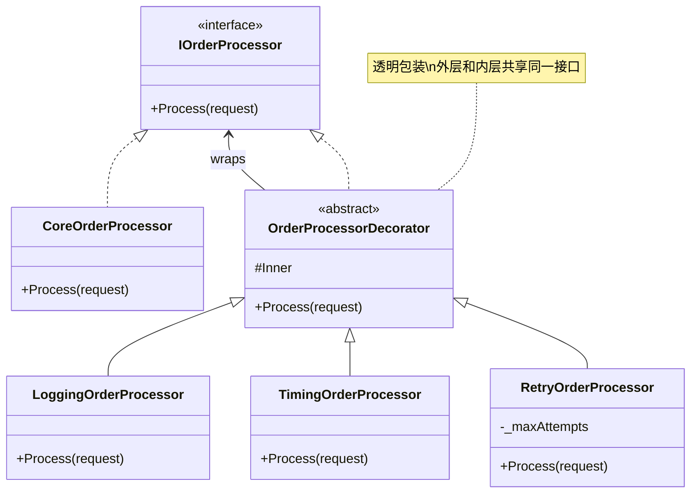
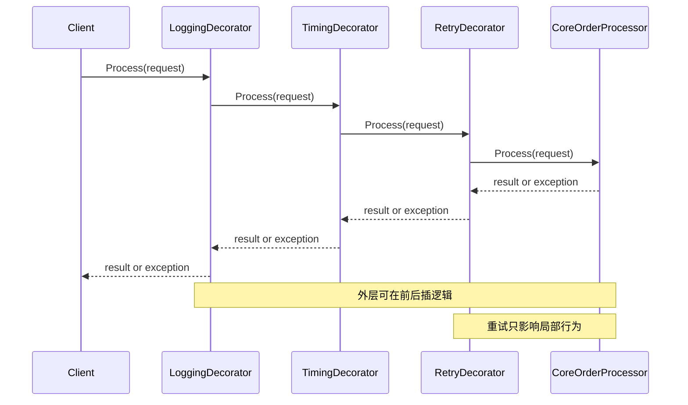

> 一句话定义：Decorator 通过保持同一接口，在对象外面一层层包上额外职责。

## 历史背景

Decorator 的思想比 GoF 1994 还早。Unix 管道、I/O 包装、Java 流和各种中间件链条都在做同一件事：**不改核心对象，只在外面叠加能力**。GoF 做的事，是把这种“包装式增强”正式命名并抽象出来。

它今天依然有用，但实现方式变轻了。过去你得为每一层包装都写一个类；现在 C# 的委托、局部函数、扩展方法和 ASP.NET Core middleware 让很多装饰层更像函数组合。换句话说，Decorator 没过时，只是“类层层包裹”不再是唯一写法。
更现实一点说，Decorator 其实在很多系统里已经变成“默认思维”。日志、缓存、重试、压缩、加密、埋点，这些都很自然地被包装成一层层能力。GoF 只是把这件事抽象成一种命名；今天的语言和框架则把它变成了常见写法。

## 一、先看问题

很多系统的职责增强不是一个维度，而是一串横切关注点：日志、重试、统计、审计、限流、缓存、压缩、加密。最糟糕的做法，就是把这些开关塞回核心类里。

下面这个坏例子能跑，但它把“行为叠加”写成了“布尔旗帜地狱”。一旦开关多了，分支就会爆炸。

```csharp
using System;

public sealed record OrderRequest(string CustomerId, decimal Amount);

public sealed class BadOrderProcessor
{
    public void Process(OrderRequest request, bool enableLogging, bool enableMetrics, bool enableRetry)
    {
        if (enableLogging)
            Console.WriteLine($"开始处理：{request.CustomerId}");

        int attempt = 0;
        while (true)
        {
            try
            {
                attempt++;
                if (enableMetrics)
                    Console.WriteLine("记录指标：开始");

                Console.WriteLine($"扣款 {request.Amount}");
                if (request.Amount > 1000)
                    throw new InvalidOperationException("模拟支付失败");

                if (enableMetrics)
                    Console.WriteLine("记录指标：成功");
                break;
            }
            catch when (enableRetry && attempt < 3)
            {
                Console.WriteLine($"重试中：{attempt}");
            }
        }

        if (enableLogging)
            Console.WriteLine($"处理结束：{request.CustomerId}");
    }
}
```

另一种坏法是继承爆炸。`LoggingOrderProcessor`、`MetricsOrderProcessor`、`RetryOrderProcessor`、`LoggingMetricsOrderProcessor`、`LoggingRetryOrderProcessor`……最后类名比逻辑还长。问题不是“不能做”，而是**你在用继承模拟组合**。

Decorator 解决的就是这个问题：把每个增强点变成独立对象，在运行时按需要叠起来。

## 二、模式的解法

Decorator 的关键是保持同一接口。外层装饰器实现和内层组件相同的接口，于是调用方看不出自己拿到的是核心对象，还是包了一层又一层的增强对象。

下面这份代码可以直接运行。它用 `IOrderProcessor` 做核心接口，用 `Logging`、`Timing` 和 `Retry` 三层装饰器叠出完整链条。

```csharp
using System;
using System.Diagnostics;

public sealed record OrderRequest(string CustomerId, decimal Amount);

public interface IOrderProcessor
{
    void Process(OrderRequest request);
}

public sealed class CoreOrderProcessor : IOrderProcessor
{
    public void Process(OrderRequest request)
    {
        Console.WriteLine($"核心处理：扣款 {request.Amount}");

        if (request.Amount > 1000)
            throw new InvalidOperationException("金额过大，模拟外部网关失败");

        Console.WriteLine("核心处理完成");
    }
}

public abstract class OrderProcessorDecorator : IOrderProcessor
{
    protected readonly IOrderProcessor Inner;

    protected OrderProcessorDecorator(IOrderProcessor inner)
    {
        Inner = inner ?? throw new ArgumentNullException(nameof(inner));
    }

    public virtual void Process(OrderRequest request) => Inner.Process(request);
}

public sealed class LoggingOrderProcessor : OrderProcessorDecorator
{
    public LoggingOrderProcessor(IOrderProcessor inner) : base(inner) { }

    public override void Process(OrderRequest request)
    {
        Console.WriteLine($"[LOG] 开始：{request.CustomerId}");
        try
        {
            base.Process(request);
            Console.WriteLine($"[LOG] 成功：{request.CustomerId}");
        }
        catch (Exception ex)
        {
            Console.WriteLine($"[LOG] 失败：{ex.Message}");
            throw;
        }
    }
}

public sealed class TimingOrderProcessor : OrderProcessorDecorator
{
    public TimingOrderProcessor(IOrderProcessor inner) : base(inner) { }

    public override void Process(OrderRequest request)
    {
        var stopwatch = Stopwatch.StartNew();
        try
        {
            base.Process(request);
        }
        finally
        {
            stopwatch.Stop();
            Console.WriteLine($"[TIME] {stopwatch.ElapsedMilliseconds} ms");
        }
    }
}

public sealed class RetryOrderProcessor : OrderProcessorDecorator
{
    private readonly int _maxAttempts;

    public RetryOrderProcessor(IOrderProcessor inner, int maxAttempts = 3) : base(inner)
    {
        _maxAttempts = Math.Max(1, maxAttempts);
    }

    public override void Process(OrderRequest request)
    {
        Exception? lastError = null;

        for (int attempt = 1; attempt <= _maxAttempts; attempt++)
        {
            try
            {
                Console.WriteLine($"[RETRY] 第 {attempt} 次");
                base.Process(request);
                return;
            }
            catch (Exception ex) when (attempt < _maxAttempts)
            {
                lastError = ex;
            }
        }

        throw lastError ?? new InvalidOperationException("重试失败但没有捕获到异常");
    }
}

public static class Program
{
    public static void Main()
    {
        IOrderProcessor processor = new LoggingOrderProcessor(
            new TimingOrderProcessor(
                new RetryOrderProcessor(
                    new CoreOrderProcessor(),
                    maxAttempts: 2)));

        processor.Process(new OrderRequest("CUST-1001", 99.0m));
        Console.WriteLine();
        try
        {
            processor.Process(new OrderRequest("CUST-2002", 1200.0m));
        }
        catch (Exception ex)
        {
            Console.WriteLine($"最终失败：{ex.Message}");
        }
    }
}
```

这里的关键不是“又写了几个类”，而是**每一层只做一件事**。核心处理只管业务；日志只管记录；计时只管测时；重试只管重试。调用方看到的还是 `IOrderProcessor`，但是运行时行为已经被动态叠加了。

## 三、结构图



Decorator 的核心视觉特征是“同一接口，多层包装”。如果你画出来的图看不到这一点，通常就已经偏离模式了。

## 四、时序图



这张图说明了 Decorator 的运行时本质：调用沿着外层一层层向内传递，返回值或异常再一层层向外返回。装饰器不是替换核心对象，而是在核心对象外面叠加职责。

## 五、变体与兄弟模式

Decorator 有几个常见变体。第一种是**透明装饰**，外层不改变接口语义，只增加行为。第二种是**策略型装饰**，外层包装的不只是日志，还可以是缓存、重试、熔断。第三种是**函数式装饰**，用委托把“前置/后置逻辑”拼起来，C# 里很常见。

它最容易和两个兄弟混淆。**Composite** 也是统一接口，但它表达的是树形包含关系，不是职责叠加。**Proxy** 也会包一层，但它主要控制访问、延迟加载或代理远程对象，不是为了叠加新职责。
这里有个经常被忽略的边界：Decorator 和 Pipeline / Chain of Responsibility 长得像，但目标不同。Pipeline/Chain 关心的是“请求怎么沿着一串处理器往下走，谁处理、谁短路、谁停止传递”；Decorator 关心的是“同一个对象的语义怎么被外层叠加”。Pipeline 传递控制流，Decorator 叠加职责。前者更像流程编排，后者更像能力包装。

所以，如果你的设计需要的是“第一关不过就不往下走”“这一步决定后面还要不要继续”，那是 Chain 或 Pipeline；如果你的设计需要的是“无论怎样都得把请求交给核心对象，只是在外面多做点事”，那才是 Decorator。这个区别一旦混掉，代码就会写成半个中间件、半个包装器，最后谁也说不清它究竟是干什么的。

## 六、对比其他模式

| 对比项 | Decorator | Composite | Proxy |
|---|---|---|---|
| 核心目标 | 动态叠加职责 | 统一树形结构中的叶子和容器 | 控制访问或延迟真实对象 |
| 结构特点 | 一层包一层 | 父子树状 | 代理对象包真实对象 |
| 行为焦点 | 增强 | 组合 | 访问控制 |
| 典型风险 | 包装链太长 | 把装饰当树用 | 把代理写成装饰器 |

Decorator 和 Proxy 的界线要说清楚。Decorator 关心“给对象多加一层能力”，Proxy 关心“我是否要把真实对象挡在后面”。如果你只是想给对象加日志、计时、重试，那是 Decorator；如果你在做懒加载、远程代理、权限拦截，更像 Proxy。

## 七、批判性讨论

Decorator 最常见的批评是“太碎”。如果你把每个横切关注点都拆成一层，链条会变长，排错会变难，调用栈会变深。对新同事来说，看到一串包装对象往往比看到一个大类更难理解。
再补一句批判。Decorator 之所以容易被滥用，是因为它的“可组合性”太迷人了。你可以轻松往里叠十层，但这不代表你应该这么做。真正成熟的做法是：优先把最稳定、最常见的横切关注点抽成少数几层，然后在外围用更轻的函数组合、中间件或配置化开关承接变化。Decorator 不是把所有变化都对象化，它只是把“可独立组合的职责”对象化。

第二个批评是顺序敏感。`Logging -> Timing -> Retry` 和 `Retry -> Logging -> Timing` 不是一回事。外层和内层的排列会影响异常是否被记录、计时是否包含重试、日志是否重复。Decorator 很自由，但自由意味着顺序必须被显式管理。

现代 C# 里，很多简单装饰已经不需要类层级。委托组合、扩展方法、管道式中间件都可以替代一部分 Decorator。凡是只包一两层的轻量增强，优先考虑更简单的写法；只有当包装点要被复用、组合、测试时，Decorator 才值得上场。

## 八、跨学科视角

Decorator 和函数式编程的关系最直接。把它抽象成函数，你会得到 `f(g(h(x)))` 这种组合。每一层都接收相同输入、返回相同形态输出，只是给流程插了一段额外逻辑。ASP.NET Core middleware 就是这种思想的工业化版本。

它和 I/O 也很像。压缩、加密、缓冲，本质上都是给同一个流叠加不同的处理层。Decorator 所表达的不是“继承”，而是**把行为拆成可组合的包装层**。

## 九、真实案例

- [.NET Runtime 的 `BufferedStream`](https://github.com/dotnet/runtime/blob/main/src/libraries/System.Private.CoreLib/src/System/IO/BufferedStream.cs)：它给底层流加缓冲能力，是最经典的流式 Decorator 之一。
- [.NET Runtime 的 `CryptoStream`](https://github.com/dotnet/runtime/blob/main/src/libraries/System.Security.Cryptography/src/System/Security/Cryptography/CryptoStream.cs)：它在流外面包一层加密/解密转换。
- [.NET Runtime 的 `GZipStream`](https://github.com/dotnet/runtime/blob/main/src/libraries/System.IO.Compression/src/System/IO/Compression/GZipStream.cs)：它在流上叠加压缩语义。
- [ASP.NET Core 的 `UseMiddlewareExtensions`](https://github.com/dotnet/aspnetcore/blob/main/src/Http/Http.Abstractions/src/Extensions/UseMiddlewareExtensions.cs)：中间件管道本质上就是一串可组合的包装层。

这些案例都说明，Decorator 不是“课堂里才有的套娃”。它在流、压缩、加密、HTTP 管道里早就是一等公民。
`UseMiddlewareExtensions` 是一个特别好的对照，因为它把“职责叠加”做成了管道式调用。中间件确实像 Decorator，但它还有“控制流向下传递”的约束；Decorator 本身并不要求外层决定是否继续，它只是把同一接口包一层。这个差异是理解 ASP.NET Core 管道的关键：你不是在单纯包对象，你是在构造一个可中断、可组合的请求链。

## 十、常见坑

第一个坑是装饰器只转发，不加任何价值。那不是 Decorator，而是多余的代理层。

第二个坑是顺序混乱。日志放在最外层还是最内层，重试应该包住谁，计时要不要把重试算进去，这些都必须明确，不然同一条链会产生不同语义。

第三个坑是把 Decorator 当 Composite。Composite 是树，Decorator 是线。树能表达包含关系，线只能表达叠加关系。

第四个坑是包装太多。五六层以后，调用栈会变难读，性能也会开始有感知。如果只是为了几个开关，委托或中间件通常更轻。

## 十一、性能考量

Decorator 的成本是可量化的。每多一层，通常就多一个对象和一次方法分派。n 层装饰意味着一次调用要经过 `n + 1` 次转发；如果包装层都保留状态，内存开销也是 O(n)。

这就是为什么 Decorator 适合“少量但可组合”的横切职责，不适合把一堆相互独立但永远不变的逻辑全塞进来。对 I/O 类场景，像 `BufferedStream` 这种包装层可以换来更少的系统调用；对纯业务调用，包装层过多就会把收益吃掉。
如果只看方法签名，Pipeline 和 Decorator 都是“前一层调用下一层”。但前者的语义是“工作流中的下一步”，后者的语义是“同一对象的附加能力”。这一点在复杂系统里很重要：Pipeline 允许某一层不把调用继续传下去，Decorator 通常不这么干；Decorator 也不关心“下一层是不是新对象”，它只关心“同一个接口能不能保持稳定”。

## 十二、何时用 / 何时不用

适合用在这些场景：

- 你要给对象叠加可选能力，而且这些能力可以组合。
- 你不想改原始类，也不想用继承爆炸。
- 你需要按运行时顺序决定增强链。

不适合用在这些场景：

- 你只是想做访问控制、懒加载或远程代理，那更像 Proxy。
- 你需要树形结构，那是 Composite 的问题。
- 你只需要一两个静态增强，用委托或扩展方法更直接。

一句话判断：**Decorator 适合“在同一接口上叠职责”，不适合“顺手包一层就算设计模式”。**

## 十三、相关模式

- [Composite](./patterns-16-composite.md)：Composite 表达树，Decorator 表达链。
- [Proxy](./patterns-18-proxy.md)：Proxy 控访问，Decorator 加职责。
- [Strategy](./patterns-03-strategy.md)：Strategy 选择算法，Decorator 叠加行为。

## 十四、在实际工程里怎么用

Decorator 在工程里最常见的落点是“横切关注点”。日志、统计、重试、限流、加密、压缩，这些逻辑都天然适合包装层。你在流处理、HTTP 管道、消息处理链里几乎一定会看到它。

应用线占位可以直接沿着这些场景展开：

- [中间件式 Decorator（应用线占位）](../../engine-toolchain/web/middleware-decorator.md)
- [流包装与责任叠加（应用线占位）](../../engine-toolchain/build-system/stream-decorator.md)

## 小结

- Decorator 的本质不是“再包一层”，而是在保持接口不变的前提下动态叠加职责。
- 它很适合横切关注点，也很适合流和中间件这种线性组合。
- 它和 Proxy、Composite 很像，但目标完全不同；混淆后，代码会立刻变脏。

一句话总括：Decorator 让你不用改核心类，也能按需叠加行为。

再压一句：Decorator 叠职责，Pipeline 传控制流；看起来像，语义不一样。
