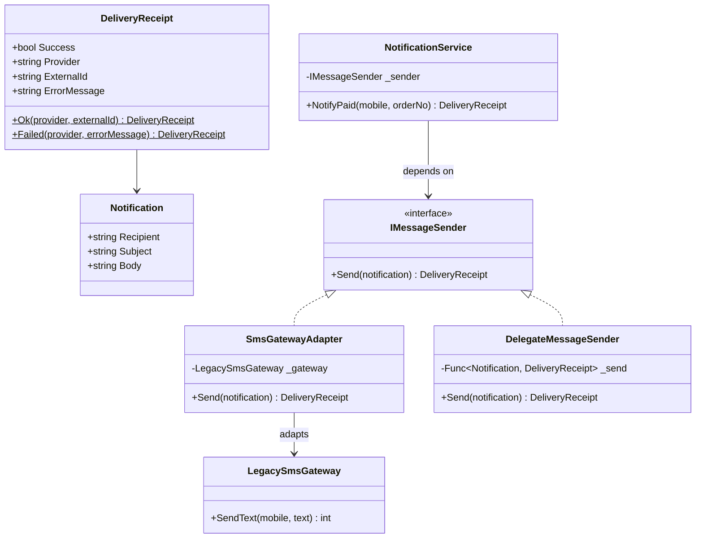
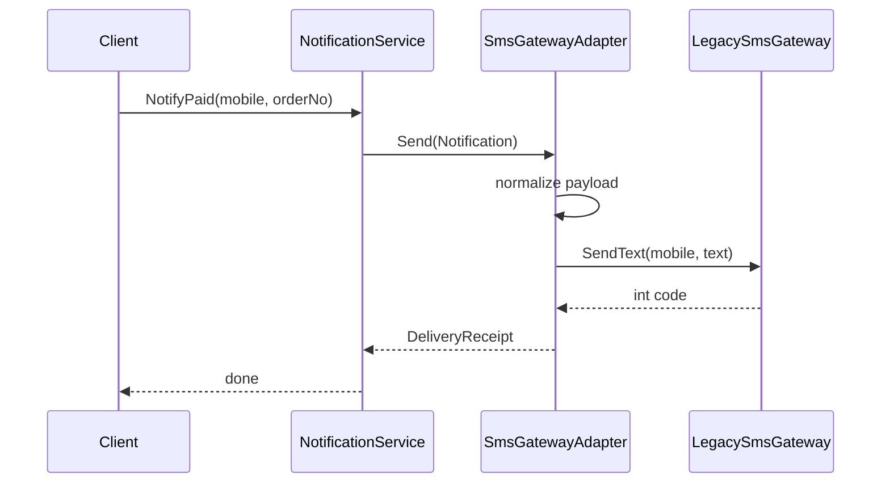

---
date: "2026-04-17"
title: "设计模式教科书｜Adapter：把不兼容的接口翻译成同一种语言"
description: "Adapter 解决的不是功能有没有，而是接口对不对得上。它把旧系统、第三方 SDK、遗留协议或不同签名的函数包装成目标接口，让业务代码只面对统一抽象，不被外部差异拖住。"
slug: "patterns-11-adapter"
weight: 911
tags:
  - 设计模式
  - Adapter
  - 软件工程
series: "设计模式教科书"
---

> 一句话定义：Adapter 不是增加能力，而是把一个现成接口翻译成另一个系统能直接使用的接口。

## 历史背景

Adapter 的出发点很朴素：现实世界里的系统从来不是一起出生的。老代码、第三方 SDK、不同团队的协议、不同年代的库函数，接口形状总会不一样。GoF 在 1994 年把这种“把一个对象包装成另一个接口”的做法整理成模式。它的历史其实比书更早，GUI 控件适配、串口驱动包装、遗留系统外壳，都是同一类思路。

到了现代，Adapter 的写法变轻了，但需求并没有消失。C# 的委托、lambda、扩展方法、record、source generator，都能把一些原本需要类的适配压缩掉。可一旦你要跨供应商、跨协议、跨生命周期，或者要把语义差异关在边界上，Adapter 仍然是最稳的工具。它不是旧时代的遗物，而是边界工程的常备件。

## 一、先看问题

真正让代码变脏的，常常不是核心业务，而是“接外部系统”的那层。

订单系统想发通知，业务侧只想面对一个统一接口：`IMessageSender`。  
结果短信供应商叫 `SendTextMessage`，邮件供应商叫 `DeliverEmail`，Webhook 供应商要 JSON，老网关还用错误码。  
如果业务层直接碰这些差异，系统很快就会被供应商 API 反向塑形。

先看一段坏代码。它能跑，但业务层已经被旧 SDK 绑住了。

```csharp
using System;

public sealed class LegacySmsGateway
{
    public int SendText(string mobile, string text)
    {
        Console.WriteLine($"[LegacySms] to {mobile}: {text}");
        return mobile.StartsWith("1", StringComparison.Ordinal) ? 0 : 12;
    }
}

public sealed class OrderService
{
    private readonly LegacySmsGateway _gateway = new();

    public string NotifyPaid(string mobile, string orderNo)
    {
        var code = _gateway.SendText(mobile, $"订单 {orderNo} 已支付");

        if (code != 0)
        {
            return $"短信发送失败，错误码 {code}";
        }

        return "发送成功";
    }
}
```

这段代码的问题不在于“不能用”，而在于它让边界失守了。

- 业务层知道了第三方类名、方法名和错误码语义。
- 更换供应商时，订单服务必须跟着改。
- 只要再接一个新渠道，业务层就会继续长出新的分支。
- 测试时你不得不模拟第三方 SDK 的细节，而不是测试业务意图。

Adapter 要做的事很明确：**把不兼容的接口翻译掉，把业务层从外部差异里解放出来。**

## 二、模式的解法

Adapter 的核心不是“包一层”，而是“翻译”。  
目标接口留给业务层，适配器负责把参数、返回值、错误语义和命名习惯都转换过去。  
如果只是函数签名不同，一个委托包装就够了；如果要处理状态、生命周期、缓存和错误映射，就写成对象适配器。

下面这份代码可以直接运行。  
它同时展示了对象适配器和委托适配器两种现代写法。

```csharp
using System;

public sealed record Notification(string Recipient, string Subject, string Body);

public sealed record DeliveryReceipt(
    bool Success,
    string Provider,
    string ExternalId,
    string? ErrorMessage)
{
    public static DeliveryReceipt Ok(string provider, string externalId) =>
        new(true, provider, externalId, null);

    public static DeliveryReceipt Failed(string provider, string errorMessage) =>
        new(false, provider, string.Empty, errorMessage);
}

public interface IMessageSender
{
    DeliveryReceipt Send(Notification notification);
}

public sealed class LegacySmsGateway
{
    public int SendText(string mobile, string text)
    {
        Console.WriteLine($"[LegacySms] to {mobile}: {text}");
        return mobile.StartsWith("1", StringComparison.Ordinal) ? 0 : 12;
    }
}

public sealed class SmsGatewayAdapter : IMessageSender
{
    private readonly LegacySmsGateway _gateway;

    public SmsGatewayAdapter(LegacySmsGateway gateway)
    {
        _gateway = gateway ?? throw new ArgumentNullException(nameof(gateway));
    }

    public DeliveryReceipt Send(Notification notification)
    {
        if (string.IsNullOrWhiteSpace(notification.Recipient))
        {
            throw new ArgumentException("收件人不能为空。", nameof(notification));
        }

        var payload = $"{notification.Subject}：{notification.Body}";
        var code = _gateway.SendText(notification.Recipient, payload);

        return code == 0
            ? DeliveryReceipt.Ok(nameof(LegacySmsGateway), $"sms-{notification.Recipient}")
            : DeliveryReceipt.Failed(nameof(LegacySmsGateway), $"短信网关返回错误码 {code}");
    }
}

public sealed class DelegateMessageSender : IMessageSender
{
    private readonly Func<Notification, DeliveryReceipt> _send;

    public DelegateMessageSender(Func<Notification, DeliveryReceipt> send)
    {
        _send = send ?? throw new ArgumentNullException(nameof(send));
    }

    public DeliveryReceipt Send(Notification notification) => _send(notification);
}

public sealed class NotificationService
{
    private readonly IMessageSender _sender;

    public NotificationService(IMessageSender sender)
    {
        _sender = sender ?? throw new ArgumentNullException(nameof(sender));
    }

    public DeliveryReceipt NotifyPaid(string mobile, string orderNo)
    {
        var notification = new Notification(mobile, "订单已支付", $"订单 {orderNo} 已进入发货流程");
        return _sender.Send(notification);
    }
}

public static class Program
{
    public static void Main()
    {
        IMessageSender objectAdapter = new SmsGatewayAdapter(new LegacySmsGateway());
        var orderService = new NotificationService(objectAdapter);
        var first = orderService.NotifyPaid("13800000000", "A-1001");
        Console.WriteLine($"{first.Success} / {first.Provider} / {first.ErrorMessage ?? first.ExternalId}");

        IMessageSender delegateAdapter = new DelegateMessageSender(notification =>
        {
            Console.WriteLine($"[Webhook] {notification.Subject} -> {notification.Recipient}");
            return DeliveryReceipt.Ok("webhook", Guid.NewGuid().ToString("N"));
        });

        var webhookService = new NotificationService(delegateAdapter);
        var second = webhookService.NotifyPaid("ops@example.com", "A-1002");
        Console.WriteLine($"{second.Success} / {second.Provider} / {second.ExternalId}");
    }
}
```

这份实现里，`NotificationService` 完全不知道旧短信网关的存在。  
它只依赖 `IMessageSender`。  
适配器把“手机号 + 文本 + 错误码”的世界，翻成了“通知 + 交付结果 + 统一异常语义”的世界。

现代 C# 里，`DelegateMessageSender` 很值得记住。  
如果适配只是翻函数签名，别上来就建十几个类。  
用一个委托包装就够了。  
只有当适配层需要状态、缓存、重试、错误分类时，才值得把它提升成对象适配器。

## 三、结构图



图里最重要的事是：业务层从来不直接见到 `LegacySmsGateway`。  
适配器只负责翻译，不负责决定业务策略。  
一旦它开始做风控、编排、重试，它就不再是薄适配层，而是一个新的业务边界。

## 四、时序图



这个流程里，调用链的语义边界发生了变化。  
业务层看到的是“发通知”。  
适配器内部才知道第三方接口是怎么命名、怎么编码、怎么报错的。  
这正是 Adapter 最值钱的地方。

## 五、变体与兄弟模式

Adapter 最常见的变体有三种。

- **对象适配器**：通过组合持有被适配对象，最常见，也最适合 C#。
- **类适配器**：通过继承改写接口，在单继承语言里不够灵活。
- **双向适配器**：同一层既能向前翻译，也能向后翻译，迁移老系统时会用到，但边界要收紧。

它最容易和三个模式混。

- **Facade**：Facade 是收口复杂子系统，不是对不兼容接口做翻译。
- **Bridge**：Bridge 是设计时拆分抽象与实现，Adapter 是系统已经存在以后补翻译层。
- **Decorator**：Decorator 保持接口不变，只是动态叠加职责；Adapter 关注的是接口对齐，不是增添功能。

如果你写出来的是“把所有外部 API 都包成更好看的名字”，那不一定是 Adapter。  
只有当“原接口不能直接用”时，适配才成立。

## 六、对比其他模式

| 维度 | Adapter | Facade | Bridge |
|---|---|---|---|
| 目标 | 把不兼容接口翻译对齐 | 把复杂子系统收成单一入口 | 设计阶段分离抽象与实现 |
| 关注点 | 接口兼容 | 使用简化 | 架构解耦 |
| 是否翻译语义 | 是 | 否 | 否 |
| 出现时机 | 接口已经不兼容 | 子系统太复杂 | 需要提前避免组合爆炸 |
| 典型场景 | 第三方 SDK、遗留协议、迁移外壳 | 支付流程入口、渲染入口、部署入口 | 跨平台渲染、主题化控件、驱动抽象 |

Adapter 和 Facade 最容易混，因为它们都“包了一层”。  
区别很直接：Facade 让调用方少看见细节，Adapter 让调用方能继续用自己的接口。  
前者是“减法”，后者是“翻译”。

Adapter 和 Bridge 也很容易混。  
Bridge 是先把抽象与实现拆开，预留未来扩展。  
Adapter 是后来发现两个世界对不上，临时在边界上补一座桥。  
一个是设计时决策，一个是运行时补丁。

## 七、批判性讨论

Adapter 很容易被滥用成“遗留系统的永动机”。  
如果你把旧接口原封不动地适配成新接口，只是把脏东西藏深了一层，系统并没有真正变干净。  
适配应该帮助迁移，而不是帮助你永远不迁移。

另一个问题是语义差异被伪装成接口差异。  
例如对方返回 `0` 不代表“最终送达”，只代表“已入队”。  
如果你把它翻成“成功”，调用方就会在错误语义上做决策。  
Adapter 只能翻译接口，不能替你篡改事实。

现代 C# 确实让很多 Adapter 变得更轻。  
如果只是一个函数签名不兼容，`Func<TIn, TOut>`、局部函数、扩展方法往往就够了。  
如果只是命名不同，改调用点比再包一层更直白。  
类适配器、层层接口和抽象工厂，不该成为默认选择。

真正值得保留的，是那些边界明确、语义稳定、能帮你控制变化方向的适配层。  
它们是工程的缓冲垫，不是装饰品。

## 八、跨学科视角

从类型理论看，Adapter 做的是接口之间的结构映射。  
它不改变系统目标，只改变外壳的表达形式。  
如果说 `Strategy` 更像把行为当一等公民，那么 Adapter 更像把“另一个世界的类型”翻译成当前世界能接受的形状。

从网络协议看，Adapter 就是协议翻译器。  
HTTP 网关、JSON 到 protobuf 的转换层、旧消息到新消息的桥接器，都是同一类事情。  
你不是在“增加功能”，而是在“把两种说法统一成一种说法”。

从编译器看，Adapter 像 AST 的 lowering。  
高层语法不适合直接执行，就先翻成中间表示，再进入后续阶段。  
转换前后语义必须一致，映射边界必须清楚，这一点和接口适配几乎完全一样。

## 九、真实案例

两个最典型的真实实现，几乎就是 Adapter 的标准答案。

- Gson 的 [TypeAdapter.java](https://github.com/google/gson/blob/main/gson/src/main/java/com/google/gson/TypeAdapter.java) 和 [TypeAdapterFactory.java](https://github.com/google/gson/blob/main/gson/src/main/java/com/google/gson/TypeAdapterFactory.java) 定义了翻译边界，真正把字段反射、读写流程落到实现层的，是 [ReflectiveTypeAdapterFactory.java](https://github.com/google/gson/blob/main/gson/src/main/java/com/google/gson/internal/bind/ReflectiveTypeAdapterFactory.java)；自定义包装适配还可以看 [TreeTypeAdapter.java](https://github.com/google/gson/blob/main/gson/src/main/java/com/google/gson/internal/bind/TreeTypeAdapter.java)。Gson 设计文档也明确讨论了这种定制化翻译层。  
- Retrofit 的 [CallAdapter API](https://square.github.io/retrofit/2.x/retrofit/retrofit2/CallAdapter.html) 明说自己是把 `Call<R>` 适配成 `T`；真正把它接进动态代理和服务方法解析流程的源码，可以看 [HttpServiceMethod.java](https://github.com/square/retrofit/blob/trunk/retrofit/src/main/java/retrofit2/HttpServiceMethod.java) 和 [OkHttpCall.java](https://github.com/square/retrofit/blob/trunk/retrofit/src/main/java/retrofit2/OkHttpCall.java)。

这两个例子之所以重要，是因为它们都不是玩具。  
一个站在 JSON 与对象模型之间，一个站在 HTTP 调用与业务返回类型之间。  
它们都在替系统的边界承担翻译责任。

## 十、常见坑

第一个坑是把 Adapter 写成业务壳。  
如果适配器里开始做审批、拼优惠、算价格，那你不是在翻译接口，而是在偷偷写新业务。  
适配层应该薄，越薄越好。

第二个坑是忽略语义差异。  
方法名不同只是表面问题，真正危险的是“返回值看似成功，实际只是排队”“错误码看似失败，实际只是可重试”。  
翻译接口之前，先翻译语义。

第三个坑是层层适配。  
旧系统一层、新网关一层、业务封装一层，最后变成俄罗斯套娃。  
调用侧虽然统一了，但排障和性能都开始变差。

第四个坑是把 Facade 当 Adapter。  
Facade 只负责收口复杂入口，不负责把两个世界的接口语义对齐。  
如果调用方还要自己拼 payload、自己处理错误码，那这个“Facade”并没有完成适配。

## 十一、性能考量

Adapter 的性能成本通常很低。  
一层对象适配器，额外开销主要是一层方法调用和少量字段访问。  
一层委托适配器，开销通常更低，甚至只是一层委托调用。

真正要盯的是翻译过程中的附加成本。

- 每次都拼大量字符串，会把微小的调用成本放大成 GC 压力。
- 每次都创建临时 DTO，会让高频路径多出分配。
- 每次都做复杂校验或重试，适配器就开始替业务层背锅。

从复杂度上看，Adapter 的接口翻译通常是 `O(1)`。  
只有当你在适配层额外做了查表、重试、批处理或协议解析时，复杂度才会上升。  
所以它的性能原则很简单：**翻译可以重，适配器不要胖。**

## 十二、何时用 / 何时不用

适合用：

- 你必须接入一个现成但不兼容的接口。
- 你正在做遗留系统迁移，不想让新代码继续依赖旧接口。
- 你需要在业务层和外部供应商之间放一个明确边界。

不适合用：

- 接口其实已经兼容，只是命名看起来别扭。
- 你只是想“看起来更解耦”，但没有真实翻译需求。
- 语义差异大到单纯翻译会掩盖问题。

一句话判断：  
**当问题是“接不上”，用 Adapter；当问题是“太复杂”，优先看 Facade；当问题是“抽象和实现要分家”，看 Bridge。**

## 十三、相关模式

- [Facade](./patterns-05-facade.md)：Facade 收口入口，Adapter 翻译接口。
- [Bridge](./patterns-19-bridge.md)：Bridge 是设计时拆分，Adapter 是事后补翻译。
- [Strategy](./patterns-03-strategy.md)：如果你只是在替换行为，可能不需要 Adapter。
- [Factory Method 与 Abstract Factory](./patterns-09-factory.md)：工厂负责创建适配器实例，Adapter 负责把实例接到目标接口上。

## 十四、在实际工程里怎么用

Adapter 在工程里几乎无处不在，只是经常不被显式命名。

- 第三方 SDK 接入：支付、短信、邮件、IM、埋点、地图、登录，这些系统几乎都需要一层适配。未来应用线可展开到 [第三方 SDK 适配层](../../engine-toolchain/integration/sdk-adapter.md)。
- 遗留协议迁移：旧接口、旧消息格式、旧数据库访问方式，都可以先适配到新接口，再逐步替换实现。未来应用线可展开到 [遗留协议翻译层](../../engine-toolchain/backend/protocol-adapter.md)。
- 平台边界：不同平台的文件、网络、窗口、输入 API 语义不同，适配层能把它们统一成业务代码可读的抽象。未来应用线可展开到 [平台接口适配](../../engine-toolchain/platform/platform-adapter.md)。

这里最重要的不是“把旧东西包起来”，而是“让业务层继续面对统一接口”。  
适配层存在的意义，就是让变化停在边界上，而不是沿着依赖链往里渗。

## 小结

- Adapter 解决的是接口不兼容，不是功能缺失。
- 它把翻译责任从业务层移到边界层，让内部代码保持统一语言。
- 它和 Facade、Bridge 都像“包了一层”，但目标、时机和职责完全不同。

一句话总括：Adapter 的价值不是多写一层包装，而是让系统在接入外部世界时，仍然保有内部的一致语言。

