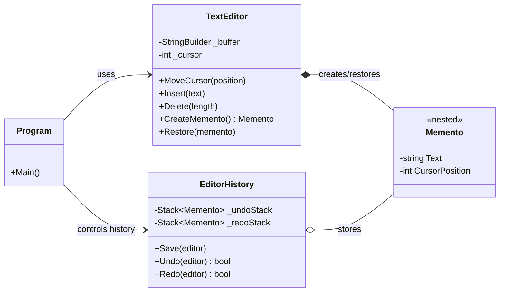
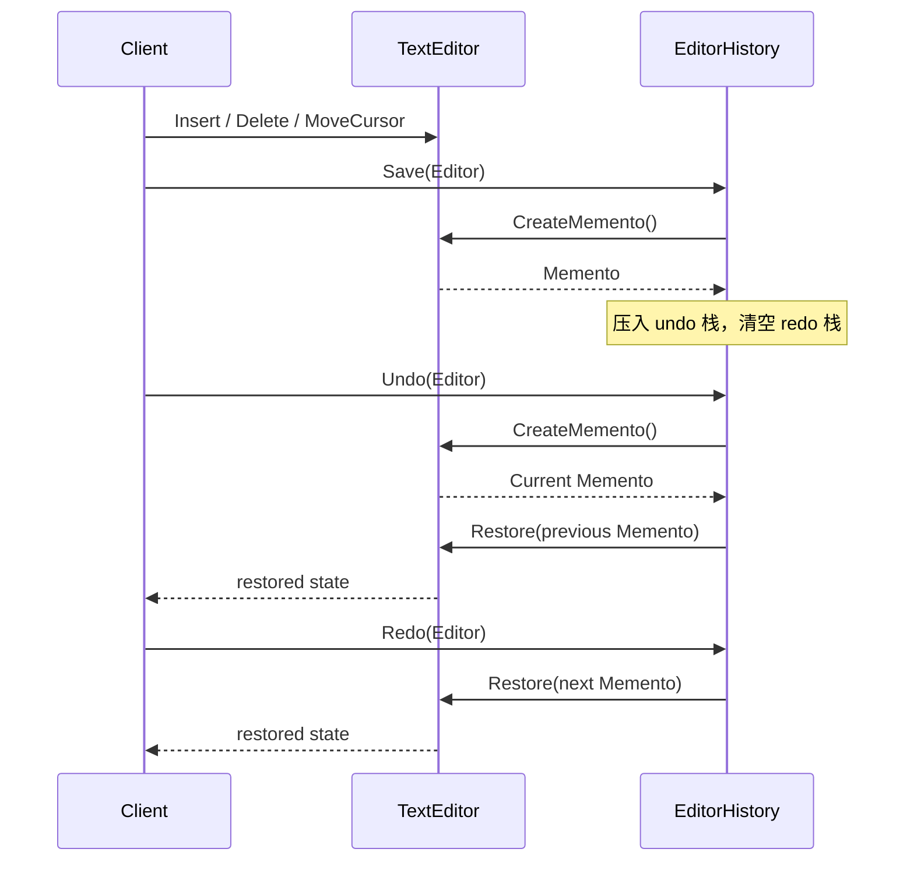

---
date: "2026-04-17"
title: "设计模式教科书｜Memento：把状态带回过去，但不把实现细节泄出去"
description: "Memento 用来保存和恢复对象的瞬时状态，适合本地撤销与重做，却不适合把大对象历史、跨进程一致性和业务事件全都塞进一条回退链。"
slug: "patterns-12-memento"
weight: 912
tags:
  - "设计模式"
  - "Memento"
  - "软件工程"
series: "设计模式教科书"
---

> 一句话定义：Memento 不是“保存一份备份”，而是让一个对象在不暴露内部细节的前提下，能够回到某个可恢复的过去状态。

## 历史背景

Memento 出现在 GoF 语境里时，桌面软件已经把“撤销/重做”变成基础能力。文字处理器、绘图工具、IDE、建模软件都在做同一件事：用户改错了，就要能回到刚才那一步。

问题不在“能不能记住旧值”，而在“谁有资格记住旧值”。如果让外部对象直接读写内部字段，撤销逻辑就会把领域对象搅成一团。对象本身最清楚状态边界，却又不该把细节公开给调用者。Memento 正是在这个矛盾上长出来的。

它的思想很朴素：把某一时刻的状态打包成一个不可见的快照，由外部的管理者保存，再由原对象自己恢复。Caretaker 只管收和放，不理解内容。Originator 只管产出和回滚，不让历史穿透封装。

这个模式在 90 年代特别实用，因为 GUI 应用已经复杂到需要多级撤销，但语言层面还没有今天这么多轻量工具。现代语言多了不可变类型、record、模式匹配和序列化框架，Memento 的实现可以更轻，但它解决的边界问题没有消失。

## 一、先看问题

先看一个典型的文档编辑器。用户输入、删除、选中替换、光标跳转都发生在同一个文档对象上。只要没有撤销链，任何误操作都会立刻变成永久状态。

下面这段代码能跑，但它只会向前走，不会回头。

```csharp
using System;
using System.Text;

public sealed class PlainTextEditor
{
    private readonly StringBuilder _buffer = new();
    private int _cursor;

    public void Insert(string text)
    {
        if (string.IsNullOrEmpty(text))
        {
            return;
        }

        _buffer.Insert(_cursor, text);
        _cursor += text.Length;
    }

    public void Delete(int length)
    {
        if (length <= 0 || _cursor == 0)
        {
            return;
        }

        var deleteLength = Math.Min(length, _cursor);
        _buffer.Remove(_cursor - deleteLength, deleteLength);
        _cursor -= deleteLength;
    }

    public override string ToString() => _buffer.ToString();
}
```

问题不是“功能少”。问题是它没有历史边界。删错一段，只能靠人肉重敲。换成业务系统也是同样的结果：订单对象、配置对象、表单草稿、规则引擎上下文，只要把状态直接覆盖掉，回退就会变成补丁地狱。

更糟的是，很多团队会把“历史”直接塞进对象内部，例如给编辑器加一个 `List<string>`，每次都存完整字符串，再在业务对象里写 `Undo()` 和 `Redo()`。表面上有历史了，实际上把保存策略、恢复策略、UI 交互和业务状态绑在一起了。对象一旦变大，撤销一旦变多，历史就会把它自己拖垮。

## 二、模式的解法

Memento 的核心不是“复制对象”，而是“只保存原对象认为有必要恢复的内部状态”。Caretaker 不该知道这个状态长什么样，也不该决定怎么恢复。它只负责按时间顺序压栈、出栈、清空分支。

这份代码展示了一个可运行的文档编辑器。Memento 由编辑器自己创建，历史管理器只保存快照，不读取细节。

```csharp
using System;
using System.Collections.Generic;
using System.Text;

public sealed class TextEditor
{
    private readonly StringBuilder _buffer;
    private int _cursor;

    public TextEditor(string initialText = "")
    {
        _buffer = new StringBuilder(initialText ?? string.Empty);
        _cursor = _buffer.Length;
    }

    public void MoveCursor(int position)
    {
        if (position < 0 || position > _buffer.Length)
        {
            throw new ArgumentOutOfRangeException(nameof(position));
        }

        _cursor = position;
    }

    public void Insert(string text)
    {
        if (string.IsNullOrEmpty(text))
        {
            return;
        }

        _buffer.Insert(_cursor, text);
        _cursor += text.Length;
    }

    public void Delete(int length)
    {
        if (length <= 0)
        {
            return;
        }

        var deleteLength = Math.Min(length, _cursor);
        if (deleteLength == 0)
        {
            return;
        }

        _buffer.Remove(_cursor - deleteLength, deleteLength);
        _cursor -= deleteLength;
    }

    public Memento CreateMemento()
        => new(_buffer.ToString(), _cursor);

    public void Restore(Memento memento)
    {
        if (memento is null)
        {
            throw new ArgumentNullException(nameof(memento));
        }

        _buffer.Clear();
        _buffer.Append(memento.Text);
        _cursor = memento.CursorPosition;
    }

    public override string ToString()
        => $"{_buffer} (cursor={_cursor})";

    public sealed class Memento
    {
        internal Memento(string text, int cursorPosition)
        {
            Text = text;
            CursorPosition = cursorPosition;
        }

        internal string Text { get; }
        internal int CursorPosition { get; }
    }
}

public sealed class EditorHistory
{
    private readonly Stack<TextEditor.Memento> _undoStack = new();
    private readonly Stack<TextEditor.Memento> _redoStack = new();

    public void Save(TextEditor editor)
    {
        if (editor is null)
        {
            throw new ArgumentNullException(nameof(editor));
        }

        _undoStack.Push(editor.CreateMemento());
        _redoStack.Clear();
    }

    public bool CanUndo => _undoStack.Count > 0;
    public bool CanRedo => _redoStack.Count > 0;

    public bool Undo(TextEditor editor)
    {
        if (editor is null)
        {
            throw new ArgumentNullException(nameof(editor));
        }

        if (_undoStack.Count == 0)
        {
            return false;
        }

        _redoStack.Push(editor.CreateMemento());
        editor.Restore(_undoStack.Pop());
        return true;
    }

    public bool Redo(TextEditor editor)
    {
        if (editor is null)
        {
            throw new ArgumentNullException(nameof(editor));
        }

        if (_redoStack.Count == 0)
        {
            return false;
        }

        _undoStack.Push(editor.CreateMemento());
        editor.Restore(_redoStack.Pop());
        return true;
    }
}

public static class Program
{
    public static void Main()
    {
        var editor = new TextEditor("Hello");
        var history = new EditorHistory();

        history.Save(editor);
        editor.MoveCursor(5);
        editor.Insert(", world");
        history.Save(editor);

        editor.Delete(6);
        history.Save(editor);

        Console.WriteLine(editor);

        history.Undo(editor);
        Console.WriteLine("Undo -> " + editor);

        history.Undo(editor);
        Console.WriteLine("Undo -> " + editor);

        history.Redo(editor);
        Console.WriteLine("Redo -> " + editor);
    }
}
```

这段代码里，`TextEditor` 负责解释“状态是什么”，`EditorHistory` 负责解释“历史怎么走”，`Memento` 负责解释“恢复时需要什么”。三者职责不同，边界也不同。

如果把快照做成公开 DTO，调用方就会忍不住手工改字段。那就不是 Memento，而是把对象状态搬到外面裸奔。

## 三、结构图



这个图里最关键的箭头不是“谁依赖谁”，而是“谁知道多少”。Caretaker 知道有快照，但不知道快照的结构。Originator 知道快照结构，但不暴露给外部。

## 四、时序图



Undo/Redo 的关键是分叉处理。只要用户在撤销后又做了新修改，redo 栈就必须清空。很多工具的历史损坏，都是因为这一步没做对。

## 五、变体与兄弟模式

Memento 最常见的变体有三种。

第一种是“完整快照”。每次都存整份状态，恢复最快，代价也最直接。编辑器、表单草稿、图形工具最常见这一类。

第二种是“差量快照”。不存全量，只存从上一版到当前版的变化。它更省内存，但恢复要把多个差量叠起来，逻辑也更复杂。

第三种是“命令日志 + 快照锚点”。系统按时间记录命令，中间隔一段时间落一个快照。回放时从最近的快照继续执行命令。这一类更接近事件日志，也更接近数据库的恢复机制。

和它最容易混淆的兄弟有三个。

`Command` 记录的是“做了什么动作”，Memento 记录的是“某一刻的状态”。前者适合重放和撤销，后者适合直接回到过去。

`Prototype` 解决的是“复制出一个新对象”，不是“把同一个对象恢复到过去”。两者都像复制，但前者生成分身，后者恢复本体。

`Snapshot` 常被当成 Memento 的同义词，但它只是结果形态。Memento 关注的是职责边界：谁能创建、谁能保存、谁能恢复。

## 六、对比其他模式

| 模式 | 核心目标 | 保存内容 | 恢复方式 | 典型代价 |
| --- | --- | --- | --- | --- |
| Memento | 回到某个历史状态 | 对象内部状态快照 | 直接替换状态 | 内存占用随快照线性增长 |
| Command | 记录一次动作 | 行为参数和接收者 | 反向命令或重放 | 撤销逻辑要单独设计 |
| Event Sourcing | 保存完整业务历史 | 业务事件流 | 重放事件 + 投影 | 读模型重建成本高 |
| Prototype | 复制出新实例 | 当前对象全部或部分状态 | 克隆新对象 | 深拷贝可能很贵 |

Memento 和 Command 的差别最容易看错。命令可以告诉系统“把这个订单取消”，但不能天然告诉系统“取消前订单内部每个字段长什么样”。Memento 正好补这个空。

Memento 和 Event Sourcing 的差别更大。Event Sourcing 关注业务事实的不可变记录，Memento 关注对象恢复。一个面对领域，一个面对对象。一个适合系统级审计，一个适合本地撤销和草稿恢复。

## 七、批判性讨论

Memento 很好用，但它也很容易把团队带进误区。

第一个误区是把它当成“万能回滚”。对象历史不是数据库事务。事务回滚解决的是提交前的一致性，Memento 解决的是用户视角的局部撤销。把二者混成一个系统，往往会在边界条件上撞墙。

第二个误区是把“大对象的每一步”都存成完整快照。对象一旦达到几百 KB，几百次操作就会把内存吃穿。很多项目一开始觉得“先做再说”，等历史链条长了，才发现 GC 压力和序列化成本已经开始拖慢整个交互线程。

第三个误区是把快照跨进程传输。当 Memento 被拿去做分布式同步时，原本只需要恢复本地状态的问题，立刻变成版本兼容、序列化演进、冲突解决和补偿机制问题。那已经不是 Memento 的职责边界了。

还有一种常见错法是让 Caretaker 读懂 Memento。这样做会让快照演变成“可以随意修改的状态包”。一旦外部能改快照，封装就断了，恢复也不再可信。

现代语言让 Memento 的实现更轻了，但没有把它变成廉价模式。`record`、`with`、不可变集合能减少样板代码，却不能消灭“历史越长，成本越高”这件事。

## 八、跨学科视角

Memento 和数据库的联系最直白。MVCC、undo log、WAL、快照隔离，本质上都在回答同一个问题：当前状态可以恢复到哪个时间点，以及恢复要付出多少代价。

数据库里最常见的权衡就是“写时贵，读时快”或“写时轻，读时重”。Memento 也一样。完整快照让恢复简单，但每次保存都更重。差量记录让写入轻一点，但恢复链条更长。

它还和事件溯源有清晰边界。事件溯源记录的是“系统发生了什么”，Memento 记录的是“对象在某刻是什么样”。前者是事实序列，后者是状态截面。一个适合审计和回放，一个适合本地撤销和回退。

在分布式系统里，这个边界更重要。跨服务撤销往往不是“回到过去”，而是“做补偿”。补偿动作是另一个业务问题，不是把某个对象快照恢复回来就能完事。

## 九、真实案例

**案例 1：Monaco Editor 的编辑模型和撤销栈**

Monaco Editor 的 README 说明它的 model 会跟踪编辑历史，模型是内容和历史的中心对象。
官方仓库：<https://github.com/microsoft/monaco-editor>
相关问题：<https://github.com/microsoft/monaco-editor/issues/686>

这类编辑器的历史机制非常像 Memento：模型保存一组可恢复状态，编辑器视图只是使用者。问题也很现实，社区曾明确讨论过如何获取和恢复 Undo/Redo stack，这正说明“历史”不是 UI 附属物，而是模型能力的一部分。

**案例 2：Visual Studio Code 的撤销/重做历史**

VS Code 社区长期讨论“重启后能否保留撤销历史”。这不是一个小需求，而是对历史边界的重新定义。
官方仓库：<https://github.com/microsoft/vscode>
相关问题：<https://github.com/microsoft/vscode/issues/43555>

这条讨论很有代表性。它暴露出一个事实：撤销链如果只活在当前进程里，用户就会把它当成“临时能力”；一旦用户期待跨会话恢复，系统就要处理序列化、版本兼容和历史裁剪。

**案例 3：Azure Architecture Center 的 Event Sourcing**

Azure 的 Event Sourcing 文档明确把“快照”当作长事件流的性能优化手段，并提醒事件溯源不是大多数系统都值得上的复杂度。
官方文档：<https://learn.microsoft.com/en-us/azure/architecture/patterns/event-sourcing>

这不是 Memento 的实现例子，而是它的边界参照。它说明：当你已经在做业务事实存储和事件重放时，Memento 只是局部状态回退的工具，不应被硬塞进分布式历史系统里。

## 十、常见坑

- 把 Memento 做成可写 DTO。这样外部能随意改历史，封装直接失守。
- 每一次键入都存一份全量快照。短时间内看不出问题，历史一长就会把内存和 GC 压力推高。
- 撤销后没有清空 redo 栈。用户一旦分叉编辑，历史就会出现“半真半假”的状态。
- 把恢复逻辑写在 Caretaker 里。Caretaker 应该只负责历史管理，不应该理解对象内部结构。
- 想用 Memento 解决跨服务回滚。跨服务问题需要补偿、事务边界和幂等设计，不是单对象快照能兜住的。

## 十一、性能考量

Memento 的性能账很简单，也很残酷。

如果每个快照大小是 `S`，历史深度是 `N`，那么完整快照的空间复杂度就是 `O(N × S)`。恢复时间通常是 `O(S)`，因为你要把状态写回对象。

这在小对象上几乎无感。比如一个 20 KB 的表单草稿，存 50 个版本也就 1 MB 左右，代价很合理。可如果对象变成 500 KB 的图形文档，存 200 个版本就是 100 MB，交互线程很快就会开始抖。

所以很多编辑器会做三件事：压缩旧快照、合并相邻操作、在若干步之后只留锚点快照。这个策略和数据库的 checkpoint 很像，都是拿空间换恢复成本的控制权。

如果你真的需要长期历史，差量记录通常比全量快照更稳。它不一定更简单，但它能把大对象的历史成本从“按对象大小线性增长”改成“按变化规模增长”。

## 十二、何时用 / 何时不用

适合用 Memento 的场景很明确。

适合用：本地编辑器、表单草稿、图形工具、IDE 视图状态、规则配置器、轻量工作流设计器。它们的共同点是状态集中、恢复目标明确、撤销只影响当前对象或当前会话。

不适合用：大对象树、跨服务事务、分布式订单链路、长时间保留的业务审计、需要对外暴露变更语义的系统。它们需要的是事件、补偿、审计和投影，不是单点快照。

还有一种不适合是“状态本来就很便宜重建”。如果对象可以从少量输入快速重算出来，硬做快照只会把系统变胖。

## 十三、相关模式

- [Command](./patterns-06-command.md)：命令记动作，Memento 记状态，撤销常常需要两者配合。
- [Observer](./patterns-07-observer.md)：状态变化通知可以触发快照保存，但不要把通知系统和历史系统绑成一个类。
- [Factory Method 与 Abstract Factory](./patterns-09-factory.md)：工厂创建对象，Memento 恢复对象，职责完全不同。
- [Prototype](./patterns-20-prototype.md)：克隆是创建新实例，Memento 是回到旧实例。
- [State](./patterns-48-state.md)：状态模式管理行为分支，Memento 管理历史截面，别混在一起。

## 十四、在实际工程里怎么用

在工程里，Memento 最先出现在“用户会后悔”的地方。

编辑器、表单设计器、图表编辑器、流程编排器、报表拖拽器，这些系统都需要局部撤销。它们通常不会把整个业务对象暴露给 UI，而是把快照收进历史层，再通过统一入口恢复。

如果你的产品未来会接入 Unity、Web、桌面客户端或服务端工作台，这种模式也能保持一致：表现层负责交互，历史层负责快照，领域层负责自身恢复。不要把“撤销”写成某个 UI 控件的私有技巧。

应用线后续可在这里补一篇更贴近具体产品的文章：

- [Memento 应用线占位：编辑器撤销栈与草稿恢复](./pattern-12-memento-application.md)

## 小结

Memento 解决的不是“把对象复制出来”，而是“在不泄露内部实现的前提下回到过去”。

它的价值有三点：一是把撤销边界收回到对象自己手里；二是把历史管理从业务逻辑里拆出去；三是把局部回退和系统级事件溯源区分开。

一句话收尾：Memento 适合回头看，不适合替系统扛全部历史。
