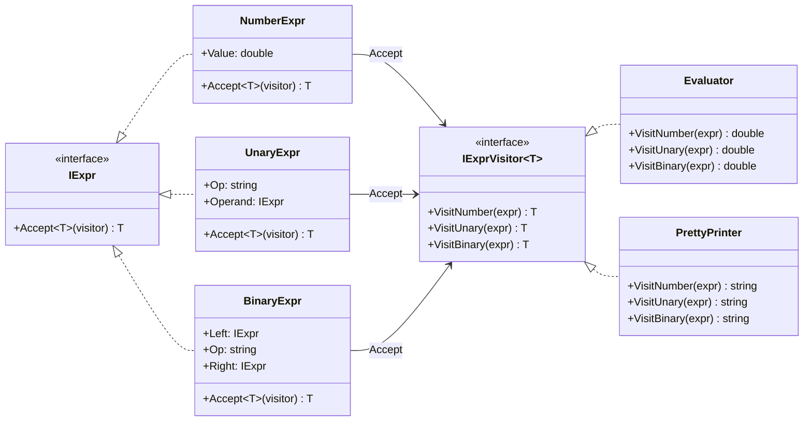
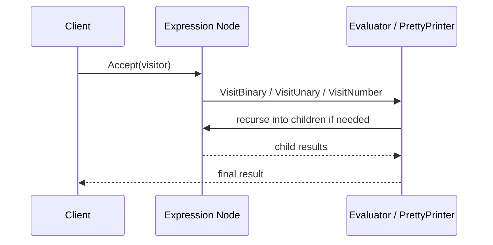

---
date: "2026-04-17"
title: "设计模式教科书｜Visitor：把新操作从稳定结构里拆出去"
description: "Visitor 适合在稳定对象结构上叠加多种操作，尤其像编译器 AST 这种树形模型；但在有 sealed ADT 和模式匹配的语言里，它常常只是更啰嗦的折中。"
slug: "patterns-13-visitor"
weight: 913
tags:
  - "设计模式"
  - "Visitor"
  - "软件工程"
series: "设计模式教科书"
---

> 一句话定义：Visitor 的本质，是把“对一组稳定结构做多种操作”这件事，从结构本身搬到外部对象里，同时保留按具体类型分派的能力。

## 历史背景

Visitor 的背景，比很多人以为的更“编译器化”。在 GoF 总结之前，编译器、语法树遍历器、文档处理器就已经在做类似的事：先有一棵稳定的节点树，再不断叠加新的分析、打印、生成、校验和转换操作。

它之所以被整理成模式，是因为纯 OOP 的继承树一旦稳定，操作就会不断膨胀。你给每个节点都写 `Evaluate`、`Print`、`Serialize`、`TypeCheck`、`CollectSymbols`，类很快就会像仓库一样塞满方法。Visitor 给出的答案是：节点负责“接受访问”，操作负责“自己实现逻辑”。

这个模式在 90 年代很自然，因为那时大多数主流语言还没有今天这么强的模式匹配、代数数据类型和高阶函数组合能力。今天再看 Visitor，它的思想并没有过时，但它的“唯一正确写法”已经过时了。

现代语言如果能用 sealed hierarchy、record 和 pattern matching 直接对闭合集合做分派，Visitor 就不必再硬上。可一旦对象结构是开放的、插件化的、跨团队扩展的，Visitor 仍然有它的位置。

## 一、先看问题

先看一个常见场景：我们有一棵表达式树。最开始只是求值，后来要打印，再后来要统计节点数、导出调试文本、做安全检查。每加一个操作，所有节点都要跟着改。

下面这段代码能跑，但它把“结构”和“操作”绑死在一起了。

```csharp
using System;

public abstract class Expr
{
    public abstract double Evaluate();
    public abstract string Print();
    public abstract int CountNodes();
}

public sealed class NumberExpr : Expr
{
    public NumberExpr(double value) => Value = value;
    public double Value { get; }

    public override double Evaluate() => Value;
    public override string Print() => Value.ToString("0.##");
    public override int CountNodes() => 1;
}

public sealed class BinaryExpr : Expr
{
    public BinaryExpr(Expr left, string op, Expr right)
    {
        Left = left ?? throw new ArgumentNullException(nameof(left));
        Right = right ?? throw new ArgumentNullException(nameof(right));
        Op = op ?? throw new ArgumentNullException(nameof(op));
    }

    public Expr Left { get; }
    public string Op { get; }
    public Expr Right { get; }

    public override double Evaluate() => Op switch
    {
        "+" => Left.Evaluate() + Right.Evaluate(),
        "-" => Left.Evaluate() - Right.Evaluate(),
        "*" => Left.Evaluate() * Right.Evaluate(),
        "/" => Left.Evaluate() / Right.Evaluate(),
        _ => throw new NotSupportedException($"Unsupported operator: {Op}")
    };

    public override string Print() => $"({Left.Print()} {Op} {Right.Print()})";
    public override int CountNodes() => 1 + Left.CountNodes() + Right.CountNodes();
}
```

看起来不算糟，但它有三个问题。

第一，类职责开始膨胀。`Expr` 不再只是树节点，而是所有操作的容器。

第二，新操作会把所有节点重新打开一次。再加一个 `EmitDebugView()`，所有子类都要跟着改。

第三，这种写法把“谁决定有哪些操作”留给了节点层。节点一旦来自别的团队、别的包，或者别的插件，扩展成本会迅速升高。

在 AST 场景里，这个问题更尖锐。编译器往往拥有几十上百种节点类型，但真正变化最快的是分析和转换逻辑。让每个节点都背上所有操作，最后只会把类型树变成方法垃圾场。

## 二、模式的解法

Visitor 的核心思路是反过来：节点类型保持稳定，每个节点只负责把自己交给访问者，真正的操作逻辑交给 Visitor 实现。

这份代码实现了一个简单的表达式 AST。它有求值 visitor，也有格式化 visitor。树不需要知道自己到底会被拿去干什么。

```csharp
using System;
using System.Globalization;

public interface IExpr
{
    T Accept<T>(IExprVisitor<T> visitor);
}

public interface IExprVisitor<T>
{
    T VisitNumber(NumberExpr expr);
    T VisitUnary(UnaryExpr expr);
    T VisitBinary(BinaryExpr expr);
}

public sealed record NumberExpr(double Value) : IExpr
{
    public T Accept<T>(IExprVisitor<T> visitor) => visitor.VisitNumber(this);
}

public sealed record UnaryExpr(string Op, IExpr Operand) : IExpr
{
    public UnaryExpr(string op, IExpr operand) : this(op, operand ?? throw new ArgumentNullException(nameof(operand)))
    {
    }

    public T Accept<T>(IExprVisitor<T> visitor) => visitor.VisitUnary(this);
}

public sealed record BinaryExpr(IExpr Left, string Op, IExpr Right) : IExpr
{
    public BinaryExpr(IExpr left, string op, IExpr right)
        : this(left ?? throw new ArgumentNullException(nameof(left)),
               op ?? throw new ArgumentNullException(nameof(op)),
               right ?? throw new ArgumentNullException(nameof(right)))
    {
    }

    public T Accept<T>(IExprVisitor<T> visitor) => visitor.VisitBinary(this);
}

public sealed class Evaluator : IExprVisitor<double>
{
    public double VisitNumber(NumberExpr expr) => expr.Value;

    public double VisitUnary(UnaryExpr expr)
    {
        var operand = expr.Operand.Accept(this);
        return expr.Op switch
        {
            "-" => -operand,
            "+" => operand,
            _ => throw new NotSupportedException($"Unsupported unary operator: {expr.Op}")
        };
    }

    public double VisitBinary(BinaryExpr expr)
    {
        var left = expr.Left.Accept(this);
        var right = expr.Right.Accept(this);

        return expr.Op switch
        {
            "+" => left + right,
            "-" => left - right,
            "*" => left * right,
            "/" => right == 0 ? throw new DivideByZeroException() : left / right,
            _ => throw new NotSupportedException($"Unsupported binary operator: {expr.Op}")
        };
    }
}

public sealed class PrettyPrinter : IExprVisitor<string>
{
    public string VisitNumber(NumberExpr expr)
        => expr.Value.ToString("0.##", CultureInfo.InvariantCulture);

    public string VisitUnary(UnaryExpr expr)
        => $"({expr.Op}{expr.Operand.Accept(this)})";

    public string VisitBinary(BinaryExpr expr)
        => $"({expr.Left.Accept(this)} {expr.Op} {expr.Right.Accept(this)})";
}

public static class Program
{
    public static void Main()
    {
        IExpr expression = new BinaryExpr(
            new BinaryExpr(new NumberExpr(1), "+", new NumberExpr(2)),
            "*",
            new UnaryExpr("-", new NumberExpr(3)));

        var evaluator = new Evaluator();
        var printer = new PrettyPrinter();

        Console.WriteLine(printer.VisitBinary((BinaryExpr)expression));
        Console.WriteLine(evaluator.VisitBinary((BinaryExpr)expression));

        Console.WriteLine("Tree as visitor:");
        Console.WriteLine(expression.Accept(printer));
        Console.WriteLine(expression.Accept(evaluator));
    }
}
```

这份代码有一个看似重复、其实非常关键的设计点：`Accept` 只做一次分派，真正的逻辑都在 visitor 里。这样一来，节点层保持清晰，操作层可以按需扩展。

Visitor 的价值不在“把代码拆散”。它的价值在于把变化方向转到更适合变化的一侧。节点稳定时，操作会不断长；操作稳定时，节点可以变。Visitor 解决的是前者。

## 三、结构图



Visitor 的结构图有个特征：节点层和操作层是正交的。节点层只列举“是什么”，操作层只回答“怎么做”。这和把所有逻辑都塞进节点里完全不同。

## 四、时序图



Visitor 的运行时轨迹很像“节点主动把控制权交给操作对象”，然后操作对象再按节点类型递归下去。这里的双分派不是装饰，它是 Visitor 存活的前提。

## 五、变体与兄弟模式

Visitor 有几个常见变体。

最传统的是“经典 Visitor”：每个节点一个 `Accept`，每个操作一个 Visitor。它最直观，也最容易和 GoF 原型对应。

另一种是“泛型 Visitor”。它把返回值类型参数化，像上面的 `IExprVisitor<T>`。这样可以同时支持求值、打印、转换、收集信息，不必靠 `object` 兜底。

还有一种是“acyclic visitor”。当节点类型很多、依赖关系复杂时，允许访问者只实现自己关心的子集，避免强制实现一堆空方法。这在大型插件系统里更实用，但也更复杂。

和它最容易混淆的兄弟有三个。

`Interpreter` 也处理 AST，但它把解释语义直接放在树上；Visitor 则把语义放在树外。Interpreter 更像“节点自己会说话”，Visitor 更像“让外部专家来读树”。

`Composite` 解决的是树形结构的统一接口，关注的是“部分和整体如何被同样对待”。Visitor 关注的是“对这棵树做什么操作”。两者都在树上跑，但问题完全不同。

`Strategy` 也把行为外置，但它面向的是单个算法替换；Visitor 面向的是一整棵结构上的多种操作。Strategy 是一对一替换，Visitor 是一对多遍历。

## 六、对比其他模式

| 模式 | 适用结构 | 变化主要落点 | 优势 | 代价 |
| --- | --- | --- | --- | --- |
| Visitor | 稳定对象结构、开放操作集合 | 新操作多 | 结构不动，操作可扩展 | 新节点要改所有 visitor |
| Pattern Matching | 封闭 ADT / sealed hierarchy | 新操作多 | 代码更短，可读性高 | 对开放结构不友好 |
| Interpreter | AST + 语义执行 | 语义执行 | 贴近语言解释器 | 节点上容易堆逻辑 |
| Composite | 树形部分-整体 | 统一树接口 | 结构表达力强 | 不是为多操作而生 |

Visitor 和 Pattern Matching 的区别，决定了它今天还值不值。若结构封闭，模式匹配通常更短、更清楚，也更符合现代语言风格。若结构开放，Visitor 还能把新操作放在外部，而不是逼着你重写整个 switch。

Visitor 和 Interpreter 的边界也要钉住。Interpreter 常见于语言执行器，节点本身承载语义；Visitor 更像通用遍历器，语义可以是打印、检查、统计、转换，不一定是执行。

## 七、批判性讨论

Visitor 的批评非常合理，甚至在今天更尖锐。

第一，它会把接口写得很吵。每新增一个节点，所有 Visitor 都要补方法。节点少的时候还好，节点一多就会把改动扩散成海啸。

第二，它对“闭合世界”没优势。只要语言已经有 sealed class、record、switch expression 和模式匹配，很多 Visitor 代码都能被更短的分派表达式替代。对新人来说，`switch` 往往比双分派更容易读。

第三，它把控制流拆得太远。一个节点上的 `Accept`，一半逻辑在节点类里，一半逻辑在 visitor 里。调试时如果你不熟悉双分派，很容易跟丢调用链。

但批评不等于淘汰。Visitor 在开放对象结构里仍然有价值，尤其是插件化 AST、分析器框架、编译器前端、静态检查器、树形模型导出器。这些系统不想把每个节点都改成“知道所有操作”的巨型类，也不想每加一项分析就把节点层一起改掉。

现代语言让 Visitor 更轻，也让它更挑场景。它不再是默认答案，只是当“结构开放、操作多、节点多且稳定”这三个条件同时成立时，依然是很稳的答案。

## 八、跨学科视角

Visitor 和类型理论的关系非常直接。

如果一个类型是封闭的 sum type，那么 pattern matching 本质上就是对它做 case analysis。Visitor 在 OOP 里做的，近似于把这个 case analysis 手工编码成双分派。换句话说，它是在没有 ADT 的时代，模拟“对不同构造子做不同处理”的能力。

在编译器里，这层关系更明显。AST 本质上就是一棵节点类型很多、树形遍历很多的结构。解析、类型检查、重写、代码生成、格式化，都在同一棵树上跑不同操作。Visitor 正是编译器界最早、最稳定的外部操作编码方式之一。

如果把 Visitor 当成函数式语言里的 `fold`，它也说得通。节点是数据，visitor 是折叠逻辑。区别只是 OOP 用对象和虚调用来表达，FP 更喜欢用纯函数和模式匹配来表达。

## 九、真实案例

**案例 1：Roslyn 的 CSharpSyntaxWalker**

Roslyn 官方文档把 `CSharpSyntaxWalker` 直接定义成遍历语法树的 visitor。文档页还明确指出它是 `CSharpSyntaxVisitor` 的具体实现。
官方文档：<https://learn.microsoft.com/en-us/dotnet/api/microsoft.codeanalysis.csharp.csharpsyntaxwalker?view=roslyn-dotnet-4.13.0>
源码入口：`CSharpSyntaxWalker.cs`，仓库：<https://github.com/dotnet/roslyn>

这就是 Visitor 在编译器生态里的典型姿态：节点层是语法树，操作层是 walker / visitor。它不会把“每一种分析”都塞回节点里，而是把 traversal 和 analysis 分开。

**案例 2：Clang 的 RecursiveASTVisitor**

Clang 的官方文档直接说明 `RecursiveASTVisitor` 会递归遍历整个 AST。源文件路径也非常明确：`clang/include/clang/AST/RecursiveASTVisitor.h`。
官方源码页：<https://clang.llvm.org/doxygen/RecursiveASTVisitor_8h_source.html>
仓库：<https://github.com/llvm/llvm-project>

Clang 的这套设计说明了一个现实：在编译器这种高密度树结构里，Visitor 不是装饰品，而是基础设施。它让工具链可以复用一棵 AST，同时挂上大量不同分析。

**案例 3：Babel 的 @babel/traverse**

Babel 官方文档把 traverse 直接描述成遍历并修改 AST 的工具，visitor 对象是插件 API 的核心。
官方文档：<https://babeljs.io/docs/babel-traverse>

Babel 证明了 Visitor 在 JavaScript 生态也很强。只要你面对的是“语法树 + 插件式变换”，Visitor 就会很自然地出现。它并不属于某一种语言，而属于“树形程序变换”这个问题域。

## 十、常见坑

- 把 visitor 变成巨型 if/else。这样只是换了写法，没有换思路。
- 给每个节点都加太多 `Accept` 的变体。一个 `Accept` 就够了，别把接口设计成重载迷宫。
- 让 visitor 持有可变全局状态，还在多线程里复用。这样很容易把遍历结果写乱。
- 用 Visitor 处理封闭且很小的类型集合。此时模式匹配通常更短，也更清楚。
- 把业务领域对象强行改成 Visitor 风格，只为了“看起来像设计模式”。这会让模型失去自然表达。

## 十一、性能考量

Visitor 的性能通常不是瓶颈，但它有自己的成本。

对一棵有 `n` 个节点的树，Visitor 的遍历复杂度是 `O(n)`。每个节点至少一次虚调用，递归 visitor 还会带来额外的调用栈深度。对编译器、解析器、树转换器来说，这个成本通常可接受，因为主耗时往往在解析、绑定、优化和 I/O。

真正要注意的是对象分配和状态传递。很多实现会在每次访问里 new 一个临时对象，或者把递归中间结果包装成一堆小结构。这样做的代价往往比虚调用高得多。

在封闭类型上，现代编译器的模式匹配有时能生成更直接的分支代码。也就是说，Visitor 不一定比 `switch` 快。它的优势更多是结构组织和扩展方向，而不是原始吞吐量。

如果你要遍历一百万个 AST 节点，Visitor 当然能做，但你要先问自己：真正的成本是不是树遍历，而是别的阶段。多数时候，答案不是 Visitor 本身。

## 十二、何时用 / 何时不用

适合用 Visitor 的场景很清楚。

适合用：编译器 AST、静态分析器、树形导出器、规则引擎、文档转换器、插件化语法树。它们有一个共同点：结构比较稳定，操作不断增长，且对象树可能由外部扩展。

不适合用：封闭的小型对象集合、业务实体只有少量操作、语言自带强模式匹配、节点会频繁增删改的领域模型。那时候 Visitor 只会增加认知成本。

还有一种不适合，是把 Visitor 当作“优雅的 switch 替代品”。如果你只是做一次性判断，没必要把整个类型层都改写成双分派。

## 十三、相关模式

- [Command](./patterns-06-command.md)：命令把动作对象化，Visitor 把操作对象化，但两者关注点不同。
- [Composite](./patterns-16-composite.md)：都处理树，但 Composite 解决结构统一，Visitor 解决外部操作。
- [Strategy](./patterns-03-strategy.md)：Strategy 替换算法，Visitor 替换遍历中的操作逻辑。
- [Chain of Responsibility](./patterns-08-chain-of-responsibility.md)：有时会和 visitor 混淆，但链是把请求逐步传下去，visitor 是对整棵结构做分类分派。
- [Interpreter](./patterns-38-bytecode.md)：后续可补语义执行的对照篇；Visitor 更偏遍历，Interpreter 更偏求值。

## 十四、在实际工程里怎么用

在工程里，Visitor 最常出现在“树太多、操作也太多”的地方。

如果你在做代码分析、配置树转换、文档结构导出、规则验证器、DSL 解释器，Visitor 依然是很实用的骨架。它能把节点定义和操作实现分开，方便不同团队分别演进。

如果未来你的系统会落到 Unity、构建管线、后端规则引擎或编译器工具链，Visitor 也会自然出现。它不是某一门语言的专利，而是树形程序处理的一种组织方式。

应用线后续可在这里补一篇更贴近具体产品的文章：

- [Visitor 应用线占位：AST 遍历与规则检查](./pattern-13-visitor-application.md)

## 小结

Visitor 的价值有三点：一是把多种操作从稳定结构里拆出去；二是保留对具体节点类型的分派能力；三是在编译器和 AST 生态里提供可复用的遍历骨架。

它的局限也很明确：在封闭类型和强模式匹配语言里，它常常显得啰嗦；在开放对象结构里，它仍然是稳的。

一句话收尾：Visitor 不是最短的写法，但在“结构稳定、操作繁多、节点开放”的世界里，它仍然很能打。
