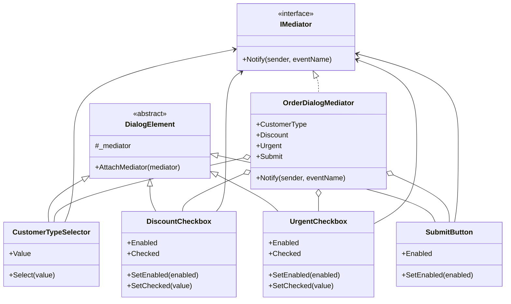
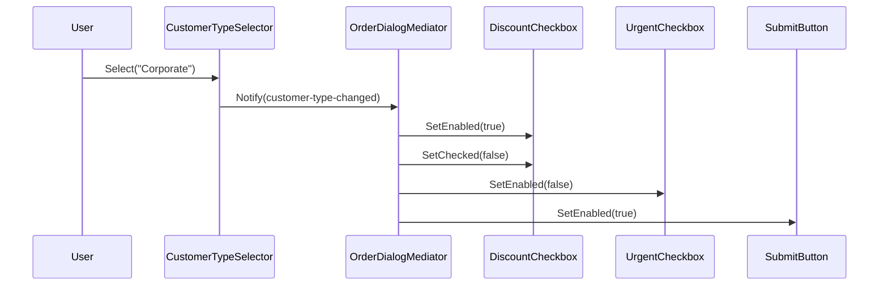

---
date: "2026-04-17"
title: "设计模式教科书｜Mediator：协调对象协作，而不是收口入口"
description: "Mediator 解决的是对象之间的协作失控问题。它把多方互相依赖、互相通知、互相制约的关系收拢到一个中介对象里，让交互规则集中、顺序可控、状态联动可见。"
slug: "patterns-14-mediator"
weight: 914
tags:
  - 设计模式
  - Mediator
  - 软件工程
series: "设计模式教科书"
---

> 一句话定义：Mediator 负责管理一组对象彼此之间怎么协作，而不是给外部提供一个更好用的入口。

## 历史背景

Mediator 也是 GoF 1994 年整理出来的模式，但它解决的问题比“把类包起来”更具体：当对象之间的联系开始呈网状增长时，任何一处变化都会沿着依赖边扩散。早期 GUI 系统里，按钮、输入框、列表和对话框彼此监听，稍微加一个校验规则，控制流就会散成一地。中介者模式就是把这种横向耦合收进一个协作中心。

它的历史比书更早。桌面应用里的对话框协调器、窗口管理器、表单联动控制器，本质上都在做同一件事：把“对象 A 和对象 B 怎么说话”变成“它们都听一个协调者怎么安排”。到了现代，MediatR、工作流编排器、消息路由器、UI 事件聚合器继续沿用这个思路。现代语言里的委托、事件、`async/await` 让实现更轻，但核心没变：**把协作规则集中起来，而不是把入口简化一下就算完事**。

## 一、先看问题

系统里只要出现几个“彼此影响”的控件，网状耦合就会很快冒出来。  
一个字段变了，另一个控件要禁用；一个复选框勾上，按钮要亮；一个下拉框切换，列表和提示文案都要改。  
如果不用 Mediator，最容易写成“每个对象都知道别人的存在”。

坏代码长这样：

```csharp
using System;

public sealed class CustomerForm
{
    public string CustomerType { get; private set; } = "Guest";
    public bool IsCorporate => CustomerType == "Corporate";

    public void SelectCustomerType(string value)
    {
        CustomerType = value;
        Console.WriteLine($"客户类型变成 {value}");
    }
}

public sealed class DiscountCheckbox
{
    public bool Enabled { get; private set; }
    public bool Checked { get; private set; }

    public void SetEnabled(bool enabled) => Enabled = enabled;
    public void SetChecked(bool value) => Checked = value;
}

public sealed class SubmitButton
{
    public bool Enabled { get; private set; }
    public void SetEnabled(bool enabled) => Enabled = enabled;
}

public sealed class NaiveDialog
{
    private readonly CustomerForm _customerForm = new();
    private readonly DiscountCheckbox _discount = new();
    private readonly SubmitButton _submit = new();

    public void OnCustomerTypeChanged(string type)
    {
        _customerForm.SelectCustomerType(type);

        if (type == "Corporate")
        {
            _discount.SetEnabled(true);
            _discount.SetChecked(false);
            _submit.SetEnabled(true);
        }
        else
        {
            _discount.SetEnabled(false);
            _discount.SetChecked(false);
            _submit.SetEnabled(true);
        }
    }
}
```

这段代码能跑，但一旦规则变多，问题就会同时落在三处。

- 对象彼此知道太多。`NaiveDialog` 把控件之间的联动写死了。
- 新增一个控件，必须回头改旧流程。
- 一个联动规则改动，会牵动一堆分支。
- “谁能改谁”这件事没有统一出口，调试时很难看清状态变化的顺序。

这不是“类太多”的问题，而是协作关系失控了。  
Mediator 做的，就是把这些横向关系搬到一个地方。

## 二、模式的解法

Mediator 的关键，不是“所有对象都交给一个人管”，而是“对象之间不直接找彼此，改成只向中介者报告变化”。  
中介者掌握协作规则，控件只负责自己的状态和事件。

下面这份纯 C# 代码把一个订单配置面板写成中介者。  
客户类型、折扣、加急、提交按钮都保持独立，但它们的联动由 `OrderDialogMediator` 统一处理。

```csharp
using System;

public interface IMediator
{
    void Notify(object sender, string eventName);
}

public abstract class DialogElement
{
    private IMediator? _mediator;

    protected IMediator Mediator => _mediator ?? throw new InvalidOperationException("Mediator has not been attached.");

    public void AttachMediator(IMediator mediator)
    {
        _mediator = mediator ?? throw new ArgumentNullException(nameof(mediator));
    }
}

public sealed class CustomerTypeSelector : DialogElement
{
    public string Value { get; private set; } = "Guest";

    public void Select(string value)
    {
        if (string.IsNullOrWhiteSpace(value))
            throw new ArgumentException("客户类型不能为空。", nameof(value));

        Value = value;
        Mediator.Notify(this, "customer-type-changed");
    }
}

public sealed class DiscountCheckbox : DialogElement
{
    public bool Enabled { get; private set; }
    public bool Checked { get; private set; }

    public void SetEnabled(bool enabled) => Enabled = enabled;

    public void SetChecked(bool value)
    {
        if (!Enabled && value)
            throw new InvalidOperationException("折扣项未启用，不能勾选。");

        Checked = value;
        Mediator.Notify(this, "discount-changed");
    }
}

public sealed class UrgentCheckbox : DialogElement
{
    public bool Enabled { get; private set; }
    public bool Checked { get; private set; }

    public void SetEnabled(bool enabled) => Enabled = enabled;

    public void SetChecked(bool value)
    {
        if (!Enabled && value)
            throw new InvalidOperationException("加急项未启用，不能勾选。");

        Checked = value;
        Mediator.Notify(this, "urgent-changed");
    }
}

public sealed class SubmitButton : DialogElement
{
    public bool Enabled { get; private set; }
    public void SetEnabled(bool enabled) => Enabled = enabled;
}

public sealed class OrderDialogMediator : IMediator
{
    public OrderDialogMediator(
        CustomerTypeSelector customerType,
        DiscountCheckbox discount,
        UrgentCheckbox urgent,
        SubmitButton submit)
    {
        CustomerType = customerType ?? throw new ArgumentNullException(nameof(customerType));
        Discount = discount ?? throw new ArgumentNullException(nameof(discount));
        Urgent = urgent ?? throw new ArgumentNullException(nameof(urgent));
        Submit = submit ?? throw new ArgumentNullException(nameof(submit));
    }

    public CustomerTypeSelector CustomerType { get; }
    public DiscountCheckbox Discount { get; }
    public UrgentCheckbox Urgent { get; }
    public SubmitButton Submit { get; }

    public void Notify(object sender, string eventName)
    {
        if (eventName == "customer-type-changed")
        {
            var isCorporate = CustomerType.Value == "Corporate";
            Discount.SetEnabled(isCorporate);
            Discount.SetChecked(false);
            Urgent.SetEnabled(!isCorporate);
            if (Urgent.Checked && isCorporate)
            {
                Urgent.SetChecked(false);
            }

            Submit.SetEnabled(true);
            return;
        }

        if (eventName == "discount-changed" || eventName == "urgent-changed")
        {
            Submit.SetEnabled(CustomerType.Value != "Blocked");
            return;
        }
    }
}

public static class Program
{
    public static void Main()
    {
        var customerType = new CustomerTypeSelector();
        var discount = new DiscountCheckbox();
        var urgent = new UrgentCheckbox();
        var submit = new SubmitButton();

        var mediator = new OrderDialogMediator(customerType, discount, urgent, submit);
        customerType.AttachMediator(mediator);
        discount.AttachMediator(mediator);
        urgent.AttachMediator(mediator);
        submit.AttachMediator(mediator);

        customerType.Select("Corporate");
        Console.WriteLine($"折扣启用：{discount.Enabled}");
        Console.WriteLine($"加急启用：{urgent.Enabled}");
        Console.WriteLine($"提交启用：{submit.Enabled}");
    }
}
```

这段代码故意保留了一个“先创建对象，再注入中介者”的写法，目的是把关系分离讲清楚。  
如果你换成真实工程，通常会通过构造函数工厂、DI 容器，或者窗体初始化器来解决注入顺序。  
重点不是注入技巧，而是**控件不再互相找对象**。

Mediator 处理的是协作关系，不是对外入口。  
调用方仍然可以直接操作控件，也可以直接提交表单。  
但控件之间的联动逻辑不再散落在每个对象身上，而是集中在 `OrderDialogMediator` 里。

## 三、结构图



这张图的重点只有一个：  
对象之间不再形成网状连接，而是统一指向中介者。  
这会把 `n(n-1)/2` 条潜在关联，压成 `n` 条到中介者的关联。

## 四、时序图



时序图里最关键的动作不是“调用了多少次”，而是“谁决定这些调用应该发生”。  
Mediator 决定协作顺序，控件只执行自己的局部动作。  
这和 Facade 完全不是一回事。

## 五、变体与兄弟模式

Mediator 有几种常见变体。

- **事件中介者**：对象只发事件，不关心谁订阅了它。
- **对话框中介者**：把 UI 控件联动、校验、按钮启用逻辑集中起来。
- **消息路由中介者**：把消息按规则分发给不同处理器。
- **协作编排器**：把一组对象的协作步骤组织成固定流程。

它最容易和三个模式混淆。

- **Facade**：Facade 收口入口，Mediator 管协作关系。
- **Observer**：Observer 广播事件，Mediator 决定事件发给谁、怎么联动。
- **Chain of Responsibility**：Chain 是沿链寻找接手者，Mediator 是对象之间的协作协调点。

一句话分清：  
Facade 让外部少记几个入口；Mediator 让内部少记几条交叉引用。

## 六、对比其他模式

| 维度 | Mediator | Facade | Observer |
|---|---|---|---|
| 核心目标 | 协调对象之间的协作 | 简化复杂子系统入口 | 通知多个订阅者 |
| 关注对象 | 系统内部同级对象 | 外部调用方 | 订阅方集合 |
| 控制方向 | 横向协作 | 纵向入口 | 单向广播 |
| 谁掌握规则 | 中介者 | 门面 | 发布者 + 订阅者 |
| 常见场景 | UI 联动、聊天室、工作流 | 订单入口、SDK 包装、构建入口 | 状态变化、领域事件、审计通知 |

Mediator 和 Facade 的边界必须钉牢。  
**如果目标是让外部少碰见复杂入口，选 Facade；如果目标是让内部对象别互相直接打交道，选 Mediator。**  
这条线很好记，也最容易在代码里写错。

Mediator 和 Observer 的边界也要说清。  
Observer 解决“谁该知道”，Mediator 解决“谁该怎么协作”。  
前者像广播，后者像调度。

## 七、批判性讨论

Mediator 的代价很明显：它会把协作规则集中到一个地方。  
如果这个地方写得不好，就会变成“上帝对象”。  
对象关系确实少了，但规则也可能被塞得太满，最后所有条件都往一个类里堆。

另一个问题是可见性下降。  
对象之间不再直接互相调用，排障时你会更依赖日志和事件追踪。  
如果中介者没有清晰的事件命名，后面的人很难知道某个状态为什么被改掉。

现代语言已经能把很多轻协作场景写得更轻。  
如果只是两个对象之间的一次回调，没必要上一个完整中介者。  
`Action<T>`、局部函数、事件和小型状态机，常常就够了。  
Mediator 真正值钱的场景，是“多个对象、多个联动、多个状态约束”同时存在。

它也不适合拿来做所有业务入口。  
那样会把“中介者”误用成“应用服务”，最后语义和职责都开始漂移。

## 八、跨学科视角

Mediator 和 UI 框架的对话框协调器很像。  
桌面应用里，按钮、输入框、列表、下拉框都要围绕同一个表单状态联动，这就是典型的协作调度问题。  
你不是在简化入口，而是在组织局部状态的相互约束。

从消息系统看，它也接近调度器和路由器。  
消息到了中间层，中间层根据状态、上下文和规则决定谁先看、谁后看、谁要被抑制。  
这和分布式编排里的 saga coordinator 很接近，只是规模更小。

从函数式角度看，Mediator 像把一组互相引用的闭包收拢成一个显式环境。  
从“对象互相知道彼此”变成“对象只知道环境”。  
这在理解依赖方向时很有帮助。

## 九、真实案例

两个真实案例都很典型。

- [MediatR](https://github.com/LuckyPennySoftware/MediatR) 是 .NET 里最常见的中介者实现之一。它把请求、通知、管线行为、异常处理拆成统一的协调入口。更具体的源码可以直接看 [`src/MediatR/IMediator.cs`](https://github.com/LuckyPennySoftware/MediatR/blob/main/src/MediatR/IMediator.cs)、[`src/MediatR/Mediator.cs`](https://github.com/LuckyPennySoftware/MediatR/blob/main/src/MediatR/Mediator.cs)、[`src/MediatR/IPipelineBehavior.cs`](https://github.com/LuckyPennySoftware/MediatR/blob/main/src/MediatR/IPipelineBehavior.cs)。官方 README 也说明了它的 in-process messaging 定位。  
- Qt 的协作式 UI 也很有代表性。`qtbase` 仓库里的 [src/widgets/kernel/qapplication.cpp](https://github.com/qt/qtbase/blob/dev/src/widgets/kernel/qapplication.cpp) 负责应用级事件分发与窗口协调，而 [src/widgets/dialogs/qwizard.cpp](https://github.com/qt/qtbase/blob/dev/src/widgets/dialogs/qwizard.cpp) 则展示了多页面对话框如何围绕同一个协调点推进。它们不是把入口简化一下，而是在 UI 对象之间组织协作关系。

这两个案例的共性很清楚。  
MediatR 把请求与处理器之间的协作规则集中到协调层。  
Qt 把控件与窗口之间的联动集中到事件/对话框协调点。  
它们都在回答同一个问题：**当对象需要互相配合时，谁来决定配合规则？**

## 十、常见坑

第一个坑是把 Mediator 写成万能中转站。  
一旦所有业务逻辑都往中介者里塞，它就会变成一个难拆的大类。  
这时候不是模式错了，而是边界没收住。

第二个坑是把中介者写成只会转发的“空壳”。  
如果它只是把消息原样从 A 转到 B，却没有任何协作规则，那它更像简单代理，不是 Mediator。

第三个坑是把 Facade 当成 Mediator。  
Facade 的任务是对外收口；Mediator 的任务是管对象之间的横向关系。  
如果你在门面里处理“控件 A 改了，控件 B 该怎么变”，那已经越界了。

第四个坑是忽略可测试性。  
协作规则集中后，测试必须直接针对中介者写。  
如果没有构造清晰的状态输入和输出，后面每次改联动都会很痛。

## 十一、性能考量

Mediator 的运行时开销通常不高。  
它把原来散落的调用收成一次事件分发，单次通知大致还是 `O(k)`，`k` 是受影响对象数量。  
它真正优化的，不是 CPU 指令，而是对象关系的复杂度。

更值得注意的是关系数量。  
如果 `n` 个对象彼此两两直接沟通，关系上界是 `n(n-1)/2`。  
改成中介者后，边的数量下降为 `n` 条到中介者，再加少量内部状态联动。  
这会显著降低理解和维护成本。

如果中介者内部又做了大量字符串拼接、日志格式化、反射分发，它才会开始变重。  
所以原则很简单：**协调规则可以集中，重计算不要塞进协调层。**

## 十二、何时用 / 何时不用

适合用：

- 一组对象需要围绕共同状态联动。
- 对象之间的直接引用已经开始形成网状关系。
- 协作规则比单个对象本身更重要。

不适合用：

- 只有两个对象的一次简单回调。
- 入口简化才是目标，而不是协作编排。
- 中介者会吸收太多业务细节，失去边界。

一句话判断：**如果你想减少对象之间的横向耦合，用 Mediator；如果你只是想给外部一个更好记的入口，用 Facade。**

## 十三、相关模式

- [Facade](./patterns-05-facade.md)：Facade 收口入口，Mediator 收口协作。
- [Observer](./patterns-07-observer.md)：Observer 广播变化，Mediator 编排变化后谁该怎么动。
- [Chain of Responsibility](./patterns-08-chain-of-responsibility.md)：Chain 在链上寻找接手者，Mediator 在中间协调对象关系。

后续互链预留：

- [Iterator](./patterns-15-iterator.md)：当协作结果要按顺序遍历时，Iterator 负责访问过程。
- [Composite](./patterns-16-composite.md)：当协作对象本身是树时，Composite 和 Mediator 常一起出现。

## 十四、在实际工程里怎么用

工程里最常见的落点有三个。

- UI 系统：表单联动、弹窗按钮启用、向导式页面流转，通常都要一个协调点。未来应用线可展开到 [UI 协调中介者占位](../../engine-toolchain/ui/dialog-mediator.md)。
- 后端应用：请求进来后，多个处理器按状态联动，适合用请求中介者或管线协调器。未来应用线可展开到 [请求编排占位](../../engine-toolchain/backend/request-mediator.md)。
- 消息调度：聊天室、通知中心、工单流转、协作式编辑器里，调度层通常都扮演中介者。未来应用线可展开到 [消息调度占位](../../engine-toolchain/messaging/message-mediator.md)。

Mediator 的真正作用，不是让调用变少，而是让协作规则变得集中、稳定、可解释。  
当对象开始彼此打断、彼此监听、彼此制约时，中介者就该站出来。

## 小结

- Mediator 把对象间的横向协作集中到一个协调点，避免关系网失控。
- 它和 Facade 看起来都像“中间层”，但一个管协作，一个管入口。
- 它最适合 UI 联动、工作流、消息调度这类需要明确协作规则的场景。

一句话总括：Mediator 的价值，不是把系统变简单，而是把对象协作变成可以被看见、被修改、被测试的规则。

