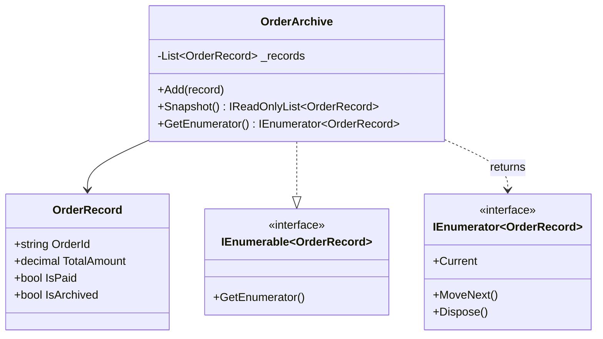
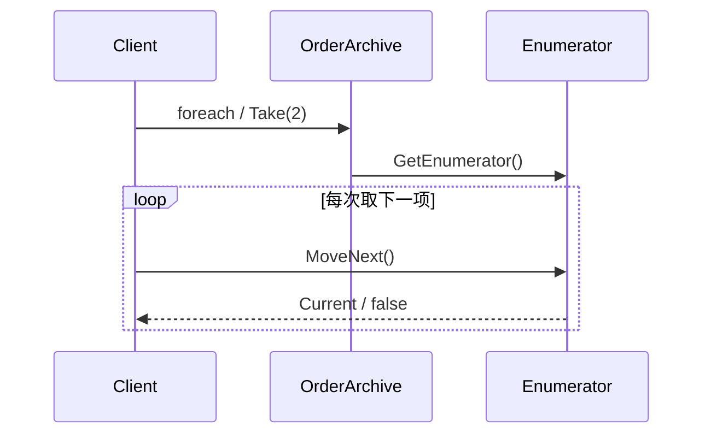

---
date: "2026-04-17"
title: "设计模式教科书｜Iterator：把遍历变成统一游标"
description: "Iterator 解决的是“怎么访问一串元素”这个问题，而不是“数据放在哪儿”这个问题。它把遍历规则和集合存储分开，让消费方只管按顺序取值，不必知道内部结构如何变化。"
slug: "patterns-15-iterator"
weight: 915
tags:
  - 设计模式
  - Iterator
  - 软件工程
series: "设计模式教科书"
---

> 一句话定义：Iterator 让访问序列这件事变成一个统一游标，消费方只管向前取值，不必知道数据从哪里来。

## 历史背景

Iterator 的起点很早。数据库游标、文件流、C++ STL 迭代器、Java 的 `Iterator` 接口，都在解决同一件事：把“顺序访问”从集合内部的存储结构里分离出来。GoF 在 1994 年把这种做法总结成模式时，重点不是集合，而是**遍历控制权**。你不再要求调用方知道数组、链表、树还是流，只要求它按照统一协议往前走。

C# 把这个思路进一步推到了日常语法里。`IEnumerable<T>`、`IEnumerator<T>` 和 `yield return` 让迭代器既能写成显式对象，也能写成编译器生成的状态机。现代语言特性让 Iterator 变轻了，但没有让它失去必要性。相反，流式查询、分页读取、事件序列、日志分析、数据管道，都比以前更依赖惰性遍历。

## 一、先看问题

很多系统一开始都会把集合直接暴露出去。  
短期看很省事，长期看很危险。  
调用方拿到集合后，既能遍历，也能删改，还能记住内部实现细节。

坏代码长这样：

```csharp
using System;
using System.Collections.Generic;
using System.Linq;

public sealed record OrderRecord(string OrderId, decimal TotalAmount, bool IsPaid, bool IsArchived);

public sealed class BadOrderArchive
{
    private readonly List<OrderRecord> _records = new();

    public List<OrderRecord> Records => _records;

    public void Add(OrderRecord record) => _records.Add(record);
}

public static class Program
{
    public static void Main()
    {
        var archive = new BadOrderArchive();
        archive.Add(new OrderRecord("ORD-1", 120m, true, false));
        archive.Add(new OrderRecord("ORD-2", 30m, true, false));
        archive.Add(new OrderRecord("ORD-3", 80m, false, false));

        var records = archive.Records;
        records.RemoveAt(1);
        records.Add(new OrderRecord("ORD-999", 999m, true, false));

        foreach (var record in records)
        {
            Console.WriteLine(record.OrderId);
        }
    }
}
```

这段代码的问题不是“能不能跑”。  
问题是调用方已经拿到了存储结构本身。  
它想要的是“按顺序看数据”，最后却拿到了“可以随便改仓库”的钥匙。

如果再往前走一步，很多团队会改成快照遍历：先复制一份，再让外部遍历。  
这比直接暴露集合安全，但也会带来另一种成本。  
数据量一大，复制本身就开始占时间和内存；如果快照和源数据脱节，调用方看到的还是旧世界。

Iterator 解决的就是这个问题：**把遍历变成一个单独的抽象，把访问权从存储权里拆出来。**

## 二、模式的解法

Iterator 的核心，不是“把集合包装一下”，而是“把访问过程变成一个稳定协议”。  
调用方通过统一接口往前取值，至于内部是数组、列表、过滤视图、分页结果还是数据库游标，外面不用管。

C# 里最自然的表达就是 `IEnumerable<T>` 和 `yield return`。  
`yield` 不是魔法，而是编译器帮你生成了一个迭代器状态机。  
它让“下一项是什么”在消费时才发生，而不是一开始就把全部结果一次性做完。

下面这份代码展示了一个带过滤规则的订单归档迭代器。  
它同时保留了快照方法，方便你对比“固定拷贝”和“惰性遍历”的差异。

```csharp
using System;
using System.Collections;
using System.Collections.Generic;
using System.Linq;

public sealed record OrderRecord(string OrderId, decimal TotalAmount, bool IsPaid, bool IsArchived);

public sealed class OrderArchive : IEnumerable<OrderRecord>
{
    private readonly List<OrderRecord> _records = new();

    public void Add(OrderRecord record)
    {
        if (string.IsNullOrWhiteSpace(record.OrderId))
            throw new ArgumentException("订单号不能为空。", nameof(record));

        _records.Add(record);
    }

    public IReadOnlyList<OrderRecord> Snapshot() => _records.ToArray();

    public IEnumerator<OrderRecord> GetEnumerator()
    {
        for (var i = 0; i < _records.Count; i++)
        {
            var record = _records[i];
            Console.WriteLine($"扫描 {record.OrderId}");

            if (record.IsArchived)
            {
                yield break;
            }

            if (!record.IsPaid)
            {
                continue;
            }

            yield return record;
        }
    }

    IEnumerator IEnumerable.GetEnumerator() => GetEnumerator();
}

public static class Program
{
    public static void Main()
    {
        var archive = new OrderArchive();
        archive.Add(new OrderRecord("ORD-1", 120m, true, false));
        archive.Add(new OrderRecord("ORD-2", 30m, true, false));
        archive.Add(new OrderRecord("ORD-3", 80m, false, false));
        archive.Add(new OrderRecord("ORD-4", 200m, true, true));
        archive.Add(new OrderRecord("ORD-5", 500m, true, false));

        Console.WriteLine("第一次遍历：");
        foreach (var record in archive)
        {
            Console.WriteLine($"命中 {record.OrderId} / {record.TotalAmount}");
        }

        Console.WriteLine("前两个命中：");
        foreach (var record in archive.Take(2))
        {
            Console.WriteLine($"Take {record.OrderId}");
        }

        Console.WriteLine("快照大小：" + archive.Snapshot().Count);
    }
}
```

这段代码有三个关键点。

第一，`OrderArchive` 对外暴露的是“怎么遍历”，不是“内部怎么存”。  
第二，`yield return` 让每个元素在被消费时才出现，懒加载自然成立。  
第三，`yield break` 可以在遇到中止条件时直接结束遍历，这比先造完整列表再截断更直接。

Iterator 的本质，是把“顺序访问”这件事从集合类型里抽离出来。  
调用方只管拿一个游标，按统一协议走就行。

## 三、结构图



这张图最重要的是关系方向。  
消费者依赖 `IEnumerable<T>`，而不是依赖具体 `List<T>`。  
遍历协议和存储协议从这里开始分家。

## 四、时序图



时序图里最值得看的是 `MoveNext` 和 `Current` 的交替。  
这说明遍历不是一次性拿完，而是按需推进。  
这也是惰性计算最朴素的形态。

## 五、变体与兄弟模式

Iterator 有几种常见变体。

- **外部迭代器**：调用方主动拉取下一项，像 C# 的 `foreach`。
- **内部迭代器**：集合自己驱动回调，调用方只提供处理函数。
- **过滤迭代器**：在遍历过程中顺手做筛选，LINQ 就是典型代表。
- **双向迭代器**：不仅能前进，还能后退，常见于编辑器、文本缓冲区和某些容器。

它最容易和三类东西混淆。

- **Collection**：集合负责持有数据，Iterator 负责访问数据。
- **Enumerator/Generator**：Enumerator 是实现形式，Iterator 是设计意图。
- **Cursor**：游标常常和数据库、文件流绑定，但它和 Iterator 的思想非常接近。

如果你把“能遍历”直接等同成“就是 Iterator”，那就会忽略最重要的一点：**Iterator 关注的是访问协议，不是存储形状。**

## 六、对比其他模式

| 维度 | 直接暴露集合 | Snapshot 遍历 | Iterator |
|---|---|---|---|
| 数据所有权 | 调用方直接拿到内部集合 | 调用方拿到副本 | 调用方只拿遍历协议 |
| 修改风险 | 高 | 低 | 低 |
| 内存成本 | 低 | 高 | 低到中 |
| 首次结果延迟 | 低 | 中 | 低 |
| 适合场景 | 内部封闭、纯本地逻辑 | 需要稳定副本 | 流式读取、过滤、分页、惰性查询 |

Iterator 和 Snapshot 的差异最值得说清楚。  
Snapshot 解决的是“我想要一个不变的拷贝”；Iterator 解决的是“我想按顺序看结果，但不想提前付出全部成本”。  
一个偏静态，一个偏流式。

Iterator 和直接暴露集合更是不同层次。  
直接暴露集合把“存储”和“访问”捆死；Iterator 把它们拆开。  
这会直接改变 API 的演进空间。

## 七、批判性讨论

Iterator 并不总是更好。  
它最大的风险，是把“看起来很轻”误认为“真的很便宜”。

`yield` 生成的迭代器通常会变成一个状态机对象。  
这意味着它不是零成本抽象。  
如果你处在极端热路径上，或者你需要完全避免分配，库作者有时会改写成 `struct` enumerator，甚至手写 `MoveNext`。

另一个问题是重复枚举。  
惰性结果第一次看起来很省，第二次、第三次就可能重新扫描源数据。  
如果源头是数据库、网络或昂贵计算，重复枚举会把成本放大。  
这也是为什么很多 LINQ 查询一旦进入生产路径，都会要求明确“是否物化、何时物化”。

还有一个常见误解：Iterator 不是“万能懒加载”。  
如果你把所有逻辑都丢进迭代器内部，异常会延迟到消费时才出现。  
这对调试并不友好。  
好的 Iterator 要让延迟发生在有价值的地方，而不是把错误也一起延迟。

现代 C# 已经把 Iterator 变得很轻。  
普通业务里，`IEnumerable<T>` 和 `yield` 大多已经足够。  
只有当你要做极限性能优化、跨线程拉流，或者需要异步源时，才会进一步看 `IAsyncEnumerable<T>`、自定义枚举器，甚至更底层的结构体实现。

## 八、跨学科视角

Iterator 和数据库游标非常像。  
你不是一次性把整张表拷到内存里，而是拿一个游标按需往前挪。  
数据库强调的是“结果集访问协议”，Iterator 强调的是“顺序消费协议”。

在编译器和语言实现里，`foreach` 的展开也说明了同一件事。  
高层语法会被降成对 `GetEnumerator`、`MoveNext`、`Current` 的一组固定调用。  
这和 Rust 的 `Iterator::next`、`IntoIterator` 也很接近：语言把“可迭代”做成了一等能力，遍历协议因此成了最基本的抽象。

从函数式角度看，Iterator 是惰性序列的载体。  
`map`、`filter`、`take`、`fold` 这些操作都可以在序列上串起来，结果不必提前物化。  
这也是为什么现代语言的流式 API、响应式 API、数据管道，都会回到 Iterator 这条线。

## 九、真实案例

这几个案例都很稳。

- [.NET runtime](https://github.com/dotnet/runtime) 里的 [List.cs](https://github.com/dotnet/runtime/blob/main/src/libraries/System.Private.CoreLib/src/System/Collections/Generic/List.cs) 展示了经典的枚举器实现，`GetEnumerator` 会快照版本号，`MoveNext` 会检查集合是否被修改；[System.Linq/Enumerable.cs](https://github.com/dotnet/runtime/blob/main/src/libraries/System.Linq/src/System/Linq/Enumerable.cs) 则展示了大量基于迭代器的流式操作。C# 的 [yield statement 文档](https://learn.microsoft.com/en-us/dotnet/csharp/language-reference/statements/yield) 进一步说明了编译器如何把方法改写成迭代状态机。  
- Rust 的官方迭代器文档和源码也很典型。`core::iter` 的 [mod.rs](https://doc.rust-lang.org/src/core/iter/mod.rs.html) 说明了 `IntoIterator` 和 `Iterator` 的关系，而 [iterator.rs](https://doc.rust-lang.org/src/core/iter/traits/iterator.rs.html) 则直接给出 `Iterator` trait 的核心设计。Rust 把“遍历是一个协议”这件事讲得非常彻底。
- Java 生态同样有成熟实现。`java.util.Iterator` 的官方文档和 OpenJDK 源码路径 `src/java.base/share/classes/java/util/Iterator.java` 是最早把统一遍历接口推广到主流平台的例子之一。它和后来的 `Iterable`、`Spliterator` 一起构成了 Java 的遍历协议族。

这三个案例风格不同，但本质一致。  
它们都在把“怎么走下一个元素”从数据结构内部拿出来，放进一个独立协议里。  
这就是 Iterator 最持久的价值。

## 十、常见坑

第一个坑是把 Iterator 当成“只是语法糖”。  
`yield` 当然是语法糖，但它背后是状态机和协议。  
如果你忽略这一点，就会误判性能和异常时机。

第二个坑是重复枚举昂贵源。  
如果一个 `IEnumerable<T>` 后面接的是数据库、HTTP 或复杂计算，反复 `foreach` 就会反复付钱。  
这时要么物化，要么缓存，要么明确一次性消费。

第三个坑是遍历期间修改底层集合。  
像 `List<T>` 这样的实现通常会用版本号保护枚举，修改后继续遍历就会抛异常。  
这不是“库太严格”，而是为了避免你读到一半又看到另一半的新世界。

第四个坑是忘了表达所有权。  
如果接口返回 `IEnumerable<T>`，调用方不一定知道这是流、缓存视图还是临时计算。  
名字和文档必须把“能不能重复遍历、会不会占资源、能不能并发”说清楚。

## 十一、性能考量

Iterator 的性能优势很明确。  
它把“先全量构建再消费”改成了“消费时再生产”，所以首次结果更快，峰值内存更低。  
在需要只看前几个结果的场景里，差异尤其大。

从复杂度上看，单次完整遍历仍然是 `O(n)`。  
区别在于：Snapshot 会额外多出 `O(n)` 内存和复制时间；Iterator 通常只保留一个状态机或枚举器，额外空间接近 `O(1)`。  
这就是它在日志、流式查询、分页和编译管道里经常胜出的原因。

但它也有成本。  
`yield` 生成的迭代器通常会分配一次状态机对象；`List<T>.Enumerator` 这样的 struct 枚举器则更接近零分配。  
所以在库设计里，Iterator 不是“无脑用”，而是“按场景选实现形式”。

## 十二、何时用 / 何时不用

适合用：

- 你想按顺序消费数据，但不想暴露存储结构。
- 数据量大，或者只需要前缀结果。
- 数据源本身是流式、分页式或昂贵计算。

不适合用：

- 调用方必须随机访问、频繁回看、频繁修改。
- 你需要一个稳定快照，且快照代价可接受。
- 你已经知道最终一定要全量物化，而且后续要多次扫描。

一句话判断：**如果问题是“怎么按顺序读”，用 Iterator；如果问题是“我要一份不变副本”，用 Snapshot；如果问题是“我要直接操控内部容器”，那就别装成 Iterator。**

## 十三、相关模式

- [Composite](./patterns-16-composite.md)：当数据本身是树时，Iterator 负责按某种顺序走树。
- [Visitor](./patterns-13-visitor.md)：当你想对遍历到的每个元素施加操作时，Visitor 和 Iterator 经常一起出现。
- [Mediator](./patterns-14-mediator.md)：当多方协作的结果需要按顺序访问时，Iterator 能把结果流标准化。

后续互链预留：

- [Composite](./patterns-16-composite.md)：树结构和迭代顺序通常一起设计。
- [Visitor](./patterns-13-visitor.md)：访问集合后每个元素时，Visitor 很容易和 Iterator 联动。

## 十四、在实际工程里怎么用

工程里最常见的落点有四个。

- 日志与审计：按时间顺序拉取事件流，常常需要 Iterator 这种按需消费方式。未来应用线可展开到 [日志流迭代占位](../../engine-toolchain/build-system/log-stream-iterator.md)。
- 数据导出：CSV、Excel、报表、分页 API，通常都不该一次性把全量数据塞进内存。未来应用线可展开到 [分页导出占位](../../engine-toolchain/backend/paged-export-iterator.md)。
- 资源扫描：构建系统、资产索引、文件搜索、代码分析器都很依赖遍历协议。未来应用线可展开到 [资源扫描占位](../../engine-toolchain/build-system/resource-scan-iterator.md)。
- 流式处理：当你需要把 map/filter/take 串起来时，Iterator 就是底层支架。未来应用线可展开到 [流式管道占位](../../engine-toolchain/backend/stream-pipeline-iterator.md)。

Iterator 的真正价值，不是“写法优雅”，而是把访问协议独立出来，让数据结构可以变，而消费方不必跟着变。

## 小结

- Iterator 把“顺序访问”从集合存储中拆出来，统一成一个访问协议。
- `IEnumerable<T>` 和 `yield` 让它在 C# 里变得很轻，但惰性计算、重复枚举和性能边界仍然要小心。
- 它最适合流式、分页、过滤、只取前缀结果的场景，不适合随意暴露内部容器。

一句话总括：Iterator 的价值，不是让你少写一个循环，而是让“怎么遍历”从数据本身里独立出来，成为可替换的设计。
