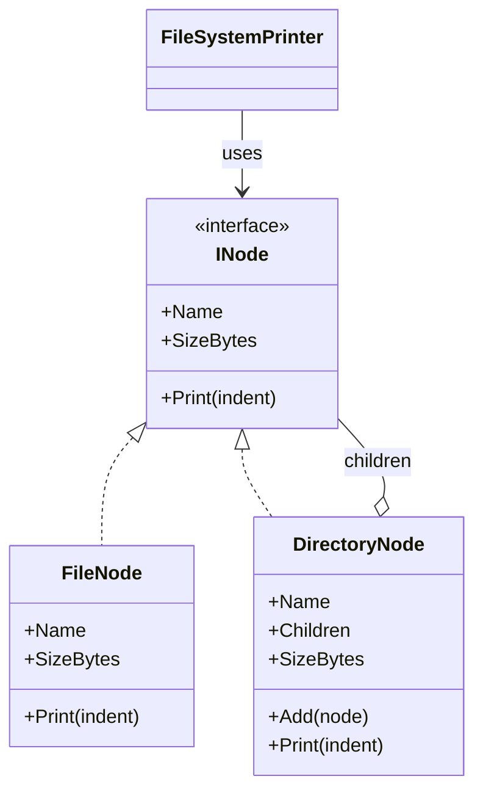
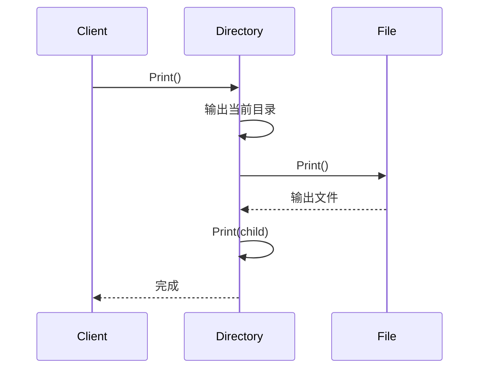

---
date: "2026-04-17"
title: "设计模式教科书｜Composite：树形结构统一接口"
description: "Composite 处理的是树形结构里的统一操作。它把叶子和组合节点放进同一套接口里，让调用方不用区分自己面对的是单个对象还是一棵子树，从而把递归结构、遍历和局部增删都收进一个稳定边界。"
slug: "patterns-16-composite"
weight: 916
tags:
  - 设计模式
  - Composite
  - 软件工程
series: "设计模式教科书"
---

> 一句话定义：Composite 把叶子和组合节点统一成同一种抽象，让调用方可以像处理单个对象一样处理整棵树。

## 历史背景

Composite 的根子其实不是“设计模式”，而是树。文件系统、GUI 控件树、编译器 AST、组织架构图，这些东西天生就是递归结构：一个节点既可能是叶子，也可能包含子节点。GoF 只是把这种长期存在的做法收束成一个模式名字，让“统一接口 + 递归遍历”变成可复用的语言。

它出现的时代，软件正在从平面对象走向层次结构。早期 GUI、文档编辑器和文件管理器都在寻找一种方式：用户点的是菜单项、文件夹、控件、段落，但程序不能把这些对象当成完全不同的宇宙。Composite 给出的答案很直接：把“容器”和“内容”放进同一棵树里，让上层只面对一个抽象。

今天它依然常见，因为树没有过时。现代语言虽然提供了模式匹配、枚举代数类型、迭代器和高阶函数，但只要系统天然是递归的，Composite 仍然是最稳的表达。它不是“让代码看起来像树”，而是“让代码按树的方式工作”。

如果你只是一次性遍历一棵小树，递归函数加模式匹配就够了；只有当树需要长期持有、局部增删、统一行为，并且上层不想区分叶子和组合节点时，Composite 才真正值回票价。

现代语言确实让一些场景可以更轻。比如一组固定层级、一次性遍历的数据，直接用递归函数和模式匹配就够了；如果层级会长期存在、还要支持局部增删、序列化和复用，Composite 的对象图就比临时递归更值钱。它解决的不是语法问题，而是结构长期管理问题。

## 一、先看问题

很多业务一开始都很扁平，后来才发现自己其实在处理树。比如一个文档系统，正文、标题、图片、引用块、列表项都能嵌套；一个文件管理器，目录里可以有文件，也可以有目录；一个编译器，表达式里套表达式，语句里套语句。你如果不把它们统一起来，代码就会不停冒出 `if (isFolder)`、`switch (kind)` 之类的分支。

坏代码通常有两个味道：一个是“到处判断类型”，另一个是“同一套遍历写两次”。它们都能跑，但都很快变脏。

```csharp
using System;
using System.Collections.Generic;
using System.Linq;

public sealed class FileItem
{
    public FileItem(string name, long sizeBytes)
    {
        Name = name;
        SizeBytes = sizeBytes;
    }

    public string Name { get; }
    public long SizeBytes { get; }
}

public sealed class FolderItem
{
    public FolderItem(string name)
    {
        Name = name;
    }

    public string Name { get; }
    public List<object> Children { get; } = new();
}

public static class NaiveFileSystemReport
{
    public static long CountSize(object node)
    {
        if (node is FileItem file)
        {
            return file.SizeBytes;
        }

        if (node is FolderItem folder)
        {
            long total = 0;
            foreach (var child in folder.Children)
            {
                total += CountSize(child);
            }
            return total;
        }

        throw new NotSupportedException($"Unknown node: {node.GetType().Name}");
    }

    public static void Print(object node, string indent = "")
    {
        switch (node)
        {
            case FileItem file:
                Console.WriteLine($"{indent}- {file.Name} ({file.SizeBytes} B)");
                break;
            case FolderItem folder:
                Console.WriteLine($"{indent}+ {folder.Name}");
                foreach (var child in folder.Children)
                {
                    Print(child, indent + "  ");
                }
                break;
            default:
                throw new NotSupportedException();
        }
    }
}
```

这段代码的问题很明确。第一，调用方每次都要知道节点类型。第二，新增一种节点，就要改所有判断分支。第三，递归逻辑散落在各处，树的结构没有变，写法却被拆碎了。

## 二、模式的解法

Composite 的核心，是把“单个元素”和“元素集合”统一成同一种抽象。叶子节点和组合节点都实现 `IFileSystemNode`，上层只依赖抽象接口，不再关心自己面对的是文件还是目录。这样一来，遍历、统计、渲染、导出都可以沿着树递归下去。

下面这份纯 C# 代码把文件系统做成一棵树。它能计算大小、输出层级，也能演示叶子和组合节点如何共享一套调用方式。

```csharp
using System;
using System.Collections.Generic;
using System.Linq;

public interface INode
{
    string Name { get; }
    long SizeBytes { get; }
    void Print(string indent = "");
}

public sealed class FileNode : INode
{
    public FileNode(string name, long sizeBytes)
    {
        if (string.IsNullOrWhiteSpace(name)) throw new ArgumentException("Name is required.", nameof(name));
        if (sizeBytes < 0) throw new ArgumentOutOfRangeException(nameof(sizeBytes));
        Name = name;
        SizeBytes = sizeBytes;
    }

    public string Name { get; }
    public long SizeBytes { get; }

    public void Print(string indent = "")
    {
        Console.WriteLine($"{indent}- {Name} ({SizeBytes} B)");
    }
}

public sealed class DirectoryNode : INode
{
    private readonly List<INode> _children = new();

    public DirectoryNode(string name)
    {
        if (string.IsNullOrWhiteSpace(name)) throw new ArgumentException("Name is required.", nameof(name));
        Name = name;
    }

    public string Name { get; }
    public IReadOnlyList<INode> Children => _children;

    public long SizeBytes
    {
        get
        {
            long total = 0;
            foreach (var child in _children)
            {
                total += child.SizeBytes;
            }

            return total;
        }
    }

    public void Add(INode node)
    {
        _children.Add(node ?? throw new ArgumentNullException(nameof(node)));
    }

    public void Print(string indent = "")
    {
        Console.WriteLine($"{indent}+ {Name} ({SizeBytes} B)");
        foreach (var child in _children)
        {
            child.Print(indent + "  ");
        }
    }
}

public sealed class FileSystemPrinter
{
    public void PrintTree(INode node) => node.Print();
}

public static class Demo
{
    public static void Main()
    {
        var root = new DirectoryNode("root");
        var docs = new DirectoryNode("docs");
        docs.Add(new FileNode("readme.md", 1200));
        docs.Add(new FileNode("plan.md", 3200));

        var assets = new DirectoryNode("assets");
        assets.Add(new FileNode("logo.png", 48_000));
        assets.Add(new FileNode("cover.jpg", 128_000));

        root.Add(docs);
        root.Add(assets);
        root.Add(new FileNode("appsettings.json", 860));

        new FileSystemPrinter().PrintTree(root);
        Console.WriteLine($"Total = {root.SizeBytes} B");
    }
}
```

这份实现里最重要的不是“递归”，而是“统一操作”。客户端只认 `INode`，所以它可以对叶子和组合节点调用同一组方法。目录节点把请求向下转发，叶子节点自己收尾，树的形状就被封装进对象图里了。

## 三、结构图



这张图想强调两件事。第一，客户端只面对抽象接口。第二，组合节点和叶子节点共享接口，但在行为上允许不同。统一接口不是为了抹平差异，而是为了让差异可以被递归地组合起来。

## 四、时序图



Composite 的运行时流程很直白：客户端从根节点开始，组合节点把请求递归转给子节点，叶子节点直接完成操作。它的本质不是“树会自己走”，而是“树的每一层都遵守同一协议”。

## 五、变体与兄弟模式

Composite 常见变体有两种。

- 透明式 Composite：叶子和组合节点暴露尽量一致的接口，客户端最省心，但可能会出现“叶子不该有的 Add/Remove”这种语义污染。
- 安全式 Composite：只有组合节点暴露子节点管理方法，叶子节点接口更干净，但客户端会多一点类型判断。

它最容易和 Decorator 混淆。两者都像“节点套节点”，但 Decorator 是叠加职责，Composite 是组织结构。前者强调功能叠加，后者强调整体-部分关系。

它还和后续的 Scene Graph 很近。Scene Graph 也是树，但它关心的是变换、渲染和空间继承；Composite 更一般，只要你有递归结构就能用。Scene Graph 可以看成 Composite 在图形领域的一种强约束特化。

## 六、对比其他模式

| 对比对象 | Composite | Decorator | Scene Graph |
|---|---|---|---|
| 核心目标 | 统一处理树形结构 | 给对象叠加职责 | 组织空间/变换层次 |
| 结构关系 | 叶子/组合 | 包装/被包装 | 父子节点 |
| 客户端感知 | 把整棵树当对象集合 | 看到增强后的单个对象 | 看到场景层级 |
| 典型场景 | 文件系统、AST、菜单 | 缓存、日志、权限包装 | 引擎节点树、变换继承 |
| 重点代价 | 递归、接口统一 | 包装层数增加 | 变换传播、更新顺序 |

Decorator 和 Composite 的差异不能只看“都嵌套对象”。Decorator 是一层层包住同一个对象，目的是改行为；Composite 是一层层组织不同节点，目的是表示整体-部分关系。Scene Graph 则更进一步，它不是单纯的树，而是带着坐标系、父子变换和渲染顺序的树，语义比 Composite 更强。

Composite 和 Iterator 也容易搭配。Composite 负责把结构组织成树，Iterator 负责定义怎么遍历树。一个管形状，一个管走法。

## 七、批判性讨论

Composite 最常见的批评是：它会强迫你把“单个对象”和“集合对象”塞进同一接口里。这样做虽然统一，但会让某些方法对叶子没有意义。比如文件节点没有 `Add`，目录节点没有固定大小；如果硬追求完全对称，接口就会变胖。

第二个问题是树不一定是树。真实世界里很多数据结构更像图，存在共享子树、回边、引用关系。Composite 默认假设是单父子树，一旦你把图硬套成树，就会碰到重复遍历、循环引用和所有权混乱。

第三个问题是代价会被低估。递归调用本身不是免费的，深树会占用调用栈；如果每次访问都要下钻整棵树，复杂度就是 `O(n)`，而且一个看似简单的 `SizeBytes` 也可能在大树上变成热点。Composite 好用，但不是“无成本”。

这也是为什么这份示例没有做缓存。缓存能提升读多写少的树，但它要求每次子树变化都把脏标记向上冒泡，否则祖先节点会读到旧值。为了让实现先正确、再谈优化，这里选择直接重算；如果后续要加缓存，必须补 parent 链或脏标记传播。

现代语言给了更轻的替代方案。对于简单层级，有时枚举和模式匹配更直接；对于只需要树遍历，不需要对象多态，递归函数加数据类型也能写得很清楚。Composite 不是唯一答案，它的价值在于“你真的需要把树建成对象图并长期操作它”。

## 八、跨学科视角

Composite 和编译器 AST 几乎是同一件事。表达式树里，`BinaryExpr` 是组合节点，`LiteralExpr` 是叶子节点；解释器、类型检查器、优化器都沿着同一棵树递归下去。很多编译器的 Visitor 只是在 Composite 基础上再加一层外部操作。

它也和递归类型很接近。类型论里，树结构常常可以写成“要么是叶子，要么是子树列表”的递归定义。Composite 把这个定义落成对象图，让程序可以在运行时持有这棵递归结构。

文件系统是 Composite 最容易理解的现实类比。目录既是容器也是节点，文件只是一种叶子。你对目录做“统计大小”“打印树”“压缩归档”时，不会想为每一层重新写一套逻辑。Composite 的意义，就是让这个直觉在代码里成立。

## 九、真实案例

Composite 在工业项目里非常常见，尤其在树和层次结构特别重的地方。

- [OpenJDK - `DefaultMutableTreeNode.java`](https://github.com/openjdk/jdk/blob/master/src/java.desktop/share/classes/javax/swing/tree/DefaultMutableTreeNode.java)：Swing 的树节点把父子关系、遍历和层级操作统一在一个节点类型里，典型的 Composite。节点既能代表单个元素，也能挂子节点，所以调用方不需要关心当前节点是叶子还是分支。
- [React - `ReactFiber.js`](https://github.com/facebook/react/blob/main/packages/react-reconciler/src/ReactFiber.js) / [`ReactChildFiber.js`](https://github.com/facebook/react/blob/main/packages/react-reconciler/src/ReactChildFiber.js)：React 的 Fiber 树把组件树拆成可遍历、可调度的节点单元，渲染协调就是沿着这棵树推进。这里的每个 Fiber 都像 Composite 节点，承载自己的状态，也指向子节点。
- [React DOM 文档](https://react.dev/learn/understanding-your-ui-as-a-tree)：React 官方文档直接把 UI 视为树，这和 Composite 的思路完全一致。

这些例子说明，Composite 不是“面向文件系统的模式”，它是所有递归层次结构的通用表达。只要系统里有“整体-部分”的关系，它就有用武之地。

## 十、常见坑

第一个坑是接口设计太透明。叶子和组合节点拥有完全相同的增删接口，看起来统一，实际上会让一些方法在叶子上没有意义。修正方式是接受少量不对称，让接口更诚实。

第二个坑是把树当成图。Composite 默认不处理共享子树和环，如果你的数据天然存在引用和回边，就不要假装它是纯树，否则递归会失控。

第三个坑是把业务规则塞进遍历里。树遍历应该负责走树，业务规则应该留给节点本身或者外部访问者。把两者混在一起，树一复杂，遍历代码就会爆炸。

第四个坑是忽略缓存。像 `SizeBytes` 这种聚合属性，如果每次都深度递归整棵树，大树上会非常贵。需要时可以缓存，但前提是子树变化要能向上失效；如果做不到这一点，就宁可现算，也不要把旧值当真。

## 十一、性能考量

Composite 的时间复杂度很直观。遍历一棵有 `n` 个节点的树，通常就是 `O(n)`。如果树高为 `h`，递归调用栈的空间复杂度是 `O(h)`。树越深，栈越容易成为问题。

直接重算的好处是语义简单：祖先节点永远不会读到旧值。比如目录大小，如果每次都自底向上算，读多写少时成本会更高，但正确性最好；如果你后面真的要做缓存，必须让子树变化沿 parent 链向上标脏，才能把重复求值压下去。

真正要平衡的是“统一接口的便利”和“分层代价”。一个小树可以直接递归，十万节点的深树就应该考虑缓存、迭代遍历或局部增量更新。Composite 不排斥优化，但它默认把结构清晰放在第一位。

## 十二、何时用 / 何时不用

适合用：

- 数据本身就是树形的。
- 你需要对叶子和组合节点做同一类操作。
- 你希望把递归结构封装起来，让调用方只认抽象接口。

不适合用：

- 结构更像图而不是树。
- 叶子和组合节点差异过大，统一接口会显得别扭。
- 你只需要一次性遍历，递归函数比对象图更简单。

## 十三、相关模式

- [Decorator](./patterns-10-decorator.md)：结构相似，目的不同。
- [Iterator](./patterns-15-iterator.md)：负责遍历树，而不是组织树。
- [Observer](./patterns-07-observer.md)：树节点变化后常需要广播。
- [Chain of Responsibility](./patterns-08-chain-of-responsibility.md)：请求沿链传递，和树的递归分发很像。
- [Scene Graph](./patterns-40-scene-graph.md)：Composite 在引擎中的空间化特化，后续章节会展开。
- [Bridge](./patterns-19-bridge.md)：如果你关心的是“抽象怎么和实现分开”，Bridge 比 Composite 更像结构解耦；Composite 则更像树形组织。

## 十四、在实际工程里怎么用

Composite 在工程中的落点非常广。

- 编辑器和文档系统：段落、列表、图片、代码块、章节目录。
- 编译器和解释器：AST、语法树、表达式树、优化树。
- 文件管理和资源系统：目录、包、资源组、层级索引。

后续应用线占位：

- [Scene Graph：场景图与树形层级的引擎化表达](../../engine-toolchain/render/scene-graph-composite.md)
- [AST 与 Visitor 的分工关系](../../engine-toolchain/compiler/ast-composite-visitor.md)

## 小结

Composite 的第一价值，是把叶子和组合节点统一成一个稳定抽象。
Composite 的第二价值，是把递归结构收进对象图，让调用方不再写一堆类型判断。
Composite 的第三价值，是它能自然接到 AST、文件系统和后续 Scene Graph 这类树形系统里。

它的边界也要说清楚。只要节点差异开始大到让统一接口失真，Composite 就不该继续硬撑。比如树的叶子和分支需要完全不同的生命周期，或者你其实处理的是共享图而不是纯树，这时继续强行统一只会让接口越来越别扭。Composite 适合“结构相同、局部差异”的树，不适合“结构相同、语义差异巨大”的伪树。


