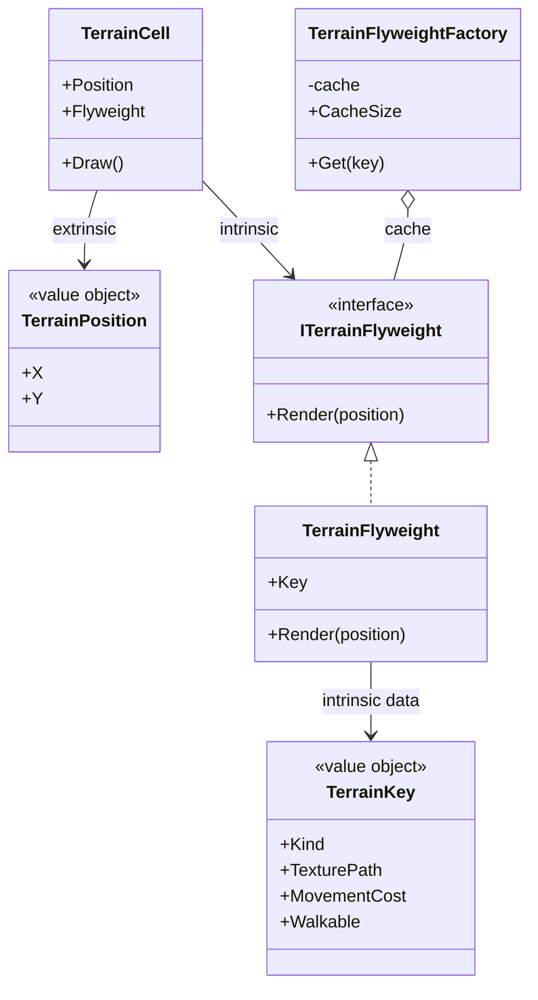
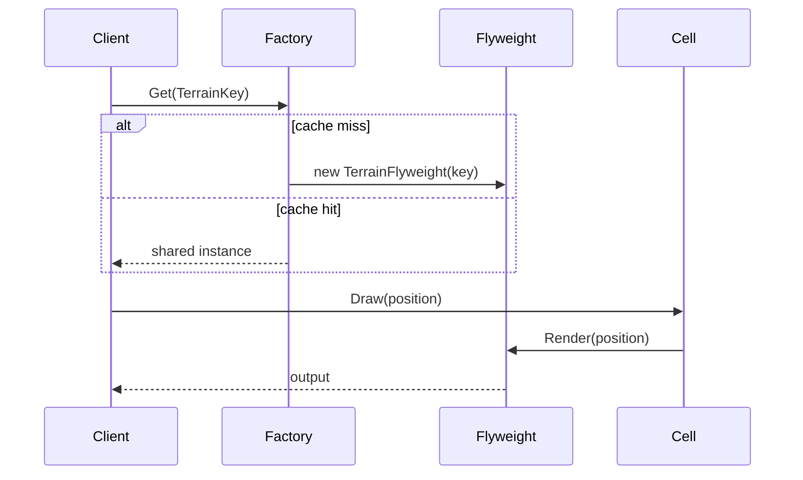

---
date: "2026-04-17"
title: "设计模式教科书｜Flyweight：共享对象省内存"
description: "Flyweight 处理的是大量细粒度对象的重复状态。它把内在状态共享出去，把外在状态留在调用端，从而用少量共享对象承载海量实例，适合字体、棋子、地图格子、资源标识和符号表这类高重复场景。"
slug: "patterns-17-flyweight"
weight: 917
tags:
  - 设计模式
  - Flyweight
  - 软件工程
series: "设计模式教科书"
---

> 一句话定义：Flyweight 通过共享内在状态，把大量重复对象压成少量可复用的共享实例。

## 历史背景

Flyweight 不是“优化技巧”，它是对重复对象爆炸的一次正式回应。早期图形界面、排版系统、地图编辑器、游戏场景和编译器符号表都发现：系统里真正耗内存的，往往不是少数大对象，而是成千上万个小对象里重复得一模一样的那部分状态。字体字形、地形类型、棋子颜色、菜单图标、单词符号，都很适合共享。

GoF 把这种做法命名为 Flyweight，重点不是“缓存”，而是“拆状态”。对象里有些信息是所有实例共用的，比如字符形状、材质定义、地形规则；有些信息是每个实例各自持有的，比如位置、缩放、朝向、文本坐标。把这两类状态分开，系统才有机会把重复对象压扁。

现代语言有字符串驻留、值类型、记录、对象池、不可变对象，这些都让 Flyweight 看上去没那么像“必需品”了。可只要你面对的是大规模重复数据，尤其是地图、字体、粒子、规则表和符号表，Flyweight 仍然是最直接的内存治理手段。它做的不是“少 new 几次”，而是“别把相同东西复制一万遍”。

现代语言的替代方案并没有把 Flyweight 干掉，只是把它的边界画得更清楚。字符串驻留适合名字，值类型适合小而稳定的数据，`record` 适合不可变值对象，Object Pool 适合可变实例复用。Flyweight 站在中间：它共享的是语义上稳定的内在状态，而不是任意可回收对象。

## 一、先看问题

很多系统在小数据量时都没问题，一旦放大到十万、百万级对象，内存和缓存压力就开始暴露。比如一张地图有十万格，每格都要知道自己是什么地形、走路成本是多少、显示什么纹理、是否能通行。看起来每格都很独立，实际上大部分格子共享同一类定义：草地、水面、山地、道路。

坏代码通常很朴素：每个对象都把重复字段存一份。写法直观，代价却是重复堆内存、重复序列化、重复比较。

```csharp
using System;
using System.Collections.Generic;
using System.Linq;

public sealed class NaiveTerrainCell
{
    public NaiveTerrainCell(string kind, string texturePath, int movementCost, bool walkable, int x, int y)
    {
        Kind = kind;
        TexturePath = texturePath;
        MovementCost = movementCost;
        Walkable = walkable;
        X = x;
        Y = y;
    }

    public string Kind { get; }
    public string TexturePath { get; }
    public int MovementCost { get; }
    public bool Walkable { get; }
    public int X { get; }
    public int Y { get; }
}

public static class NaiveMapFactory
{
    public static List<NaiveTerrainCell> CreateMap(int width, int height)
    {
        var cells = new List<NaiveTerrainCell>(width * height);
        var kinds = new[]
        {
            ("Grass", "textures/grass.png", 1, true),
            ("Water", "textures/water.png", 5, false),
            ("Road", "textures/road.png", 1, true),
            ("Mountain", "textures/mountain.png", 4, false)
        };

        var random = new Random(42);
        for (int y = 0; y < height; y++)
        {
            for (int x = 0; x < width; x++)
            {
                var kind = kinds[random.Next(kinds.Length)];
                cells.Add(new NaiveTerrainCell(kind.Item1, kind.Item2, kind.Item3, kind.Item4, x, y));
            }
        }

        return cells;
    }
}
```

这个写法的问题很明显。每个格子都重复保存地形定义，而这些定义大多不会变。地图越大，重复就越浪费。你真正需要存的，其实只是“这个格子在什么位置，用哪种共享定义”。

## 二、模式的解法

Flyweight 的核心，是把对象里的状态拆成两部分：内在状态和外在状态。内在状态可以共享，外在状态由调用方携带。对象本身只保留那些所有实例都一样的部分，变化的部分不再塞进对象里。

下面这份纯 C# 代码把地形定义做成共享 Flyweight，把坐标和朝向留给调用端。它还带了工厂缓存，确保相同定义只创建一次。

```csharp
using System;
using System.Collections.Generic;
using System.Linq;

public readonly record struct TerrainKey(string Kind, string TexturePath, int MovementCost, bool Walkable);
public readonly record struct TerrainPosition(int X, int Y);

public interface ITerrainFlyweight
{
    TerrainKey Key { get; }
    void Render(TerrainPosition position);
}

public sealed class TerrainFlyweight : ITerrainFlyweight
{
    public TerrainFlyweight(TerrainKey key)
    {
        Key = key;
    }

    public TerrainKey Key { get; }

    public void Render(TerrainPosition position)
    {
        Console.WriteLine($"{Key.Kind} at ({position.X},{position.Y}) cost={Key.MovementCost} walkable={Key.Walkable}");
    }
}

public sealed class TerrainFlyweightFactory
{
    private readonly Dictionary<TerrainKey, ITerrainFlyweight> _cache = new();

    public ITerrainFlyweight Get(TerrainKey key)
    {
        if (!_cache.TryGetValue(key, out var flyweight))
        {
            flyweight = new TerrainFlyweight(key);
            _cache[key] = flyweight;
        }

        return flyweight;
    }

    public int CacheSize => _cache.Count;
}

public sealed class TerrainCell
{
    public TerrainCell(TerrainPosition position, ITerrainFlyweight flyweight)
    {
        Position = position;
        Flyweight = flyweight;
    }

    public TerrainPosition Position { get; }
    public ITerrainFlyweight Flyweight { get; }

    public void Draw() => Flyweight.Render(Position);
}

public sealed class TerrainMap
{
    private readonly List<TerrainCell> _cells = new();

    public TerrainMap(TerrainFlyweightFactory factory, int width, int height)
    {
        var keys = new[]
        {
            new TerrainKey("Grass", "textures/grass.png", 1, true),
            new TerrainKey("Water", "textures/water.png", 5, false),
            new TerrainKey("Road", "textures/road.png", 1, true),
            new TerrainKey("Mountain", "textures/mountain.png", 4, false)
        };

        var random = new Random(42);
        for (int y = 0; y < height; y++)
        {
            for (int x = 0; x < width; x++)
            {
                var key = keys[random.Next(keys.Length)];
                _cells.Add(new TerrainCell(new TerrainPosition(x, y), factory.Get(key)));
            }
        }
    }

    public void DrawSample(int count)
    {
        foreach (var cell in _cells.Take(count))
        {
            cell.Draw();
        }
    }
}

public static class Demo
{
    public static void Main()
    {
        var factory = new TerrainFlyweightFactory();
        var map = new TerrainMap(factory, 100, 100);

        Console.WriteLine($"Shared flyweight count = {factory.CacheSize}");
        map.DrawSample(3);
    }
}
```

这份实现的关键点很简单。第一，`TerrainKey` 承载内在状态，`TerrainPosition` 承载外在状态。第二，`TerrainFlyweightFactory` 只缓存少量共享对象。第三，真正的大对象数量没有消失，只是它们不再重复保存相同的定义。

## 三、结构图



这张图要表达的重点是“状态分离”，不是“对象复用”。如果你没有把内在状态和外在状态拆开，缓存就只是缓存，不是 Flyweight。

## 四、时序图



Flyweight 的运行流程里，工厂很关键。没有工厂，调用方就会自己到处 new；有了工厂，重复对象就有了统一出口。调用方拿到的是共享实例，但每次使用时都要把外在状态带上。

## 五、变体与兄弟模式

Flyweight 常见变体有三种。

- 纯共享 Flyweight：对象本身完全不可变，所有变化都来自外部状态。
- 半共享 Flyweight：对象保留少量可变缓存，但核心内在状态仍共享。
- 键值 Flyweight：通过 key 查表，像字符串驻留、符号表、资源 ID 一样工作。

它最容易和 Prototype 混淆。Prototype 通过克隆得到新对象，Flyweight 通过共享得到同一对象。前者解决“快速生成相似对象”，后者解决“避免重复存储相同对象”。

它也容易和 Object Pool 混淆。Object Pool 复用的是可变对象实例，常见于连接、缓冲区、任务节点；Flyweight 共享的是不可变或近似不可变的内在状态。池里的对象会被借出和归还，Flyweight 则通常不会“归还”，因为它从来就不是独占的。

## 六、对比其他模式

| 对比对象 | Flyweight | Prototype | Object Pool |
|---|---|---|---|
| 核心目标 | 共享内在状态，省内存 | 克隆已有对象，省构造成本 | 复用对象实例，省分配成本 |
| 是否共享实例 | 是 | 否 | 否，借用后归还 |
| 状态模型 | 内在/外在分离 | 通常复制完整状态 | 对象通常可变 |
| 典型场景 | 字形、地形、符号、资源表 | 原型复制、模板实例 | 连接池、缓冲区、任务对象 |
| 主要风险 | 状态拆分复杂 | 深拷贝成本、克隆语义 | 池化失控、归还错误 |

Prototype 的关注点是“我想快速得到一个相似的新对象”，所以它会把原型完整复制出来；Flyweight 的关注点是“我不想把一份重复状态存很多遍”，所以它干脆把重复部分共享掉。Object Pool 则更像租借工具，借来的是可变实例，用完得还回去，生命周期管理比 Flyweight 更强。

Flyweight 和缓存也不是一回事。缓存关注“最近访问过什么”，Flyweight 关注“哪些东西本来就应该共享”。缓存可以淘汰，Flyweight 更多是结构性共享。

## 七、批判性讨论

Flyweight 最大的批评是：它经常把代码复杂度换成内存节省。你得维护工厂、key、外在状态、共享约束，还要处理读取路径。如果对象数量不够大，或者重复率不够高，这点节省不值这份复杂度。

第二个问题是状态分离很容易做错。开发者常把本来应该是外在状态的字段塞回 flyweight 里，结果共享对象被污染，线程安全和数据一致性全出问题。Flyweight 的边界一旦画错，后面就会很难收。

第三个问题是生命周期不直观。共享对象的创建、缓存、清理、失效，都会让系统变得更像资源管理器，而不是普通业务对象。你如果只是想“少分配”，Object Pool 可能更直接；你如果只是想“少复制”，Prototype 可能更直接。

现代语言确实让一些老写法淡了。字符串驻留、枚举缓存、值对象、共享字典都能承担一部分 Flyweight 的职责。可当你真正面对海量重复实例时，Flyweight 仍然比“到处复制一份”更诚实，也更节省。

## 八、跨学科视角

Flyweight 和编译器的符号表特别像。编译器会把大量标识符放进符号表，重复的名字只保存一份实体，后续节点只持有引用。AST 里的标识符节点看起来很多，但它们背后的名称、类型信息、作用域入口常常是共享的。

它和字符串驻留也几乎是同一思想。Godot 的 `StringName` 官方文档就直接把它描述为 unique names 的表示方式：同值对象共享，同值比较极快。这里共享的是名字的内在身份，外在使用场景则交给调用方。

它还和文件系统里的 inode 思想很接近。路径是外在的，文件实体是内在的；同一个实体可以被多个路径引用。Flyweight 的核心不是“对象小”，而是“对象身份和使用位置分离”。

## 九、真实案例

Flyweight 在工业系统里非常常见，尤其是名字、资源、字形和共享标识这种高重复场景。

- [OpenJDK - `String.java`](https://github.com/openjdk/jdk/blob/master/src/java.base/share/classes/java/lang/String.java) / [`Integer.java`](https://github.com/openjdk/jdk/blob/master/src/java.base/share/classes/java/lang/Integer.java)：JDK 里有字符串驻留和小整数缓存，很多重复值都通过共享或缓存避免重复分配。这里算 Flyweight，不是因为它们是“缓存”，而是因为重复值的身份被压成少数共享实例，调用方拿到的是引用而不是重复副本。
- [Godot 文档 - `StringName`](https://docs.godotengine.org/en/4.0/classes/class_stringname.html)：Godot 把字符串名做成 unique names，值相同的 `StringName` 共享同一身份，比较也更快。`StringName` 的文档直接强调了 internal interning 和快速比较，这正是 Flyweight 的语义。
- [Godot 源码仓库](https://github.com/godotengine/godot)：引擎里大量资源标识、节点名和路径相关对象都围绕共享身份展开，这类设计非常接近 Flyweight 的思路。对于资源数量巨大的引擎来说，名字驻留和资源句柄共享就是典型的内在状态抽离。

这几个案例说明，Flyweight 的真实落点不是“写一个缓存器”，而是“把重复身份抽出来”。当名字、字形、地形、资源 ID 这些东西能共享时，Flyweight 才会真正发力。

## 十、常见坑

第一个坑是把 Flyweight 写成普通缓存。缓存是按访问行为组织的，Flyweight 是按结构组织的。缓存可以淘汰，Flyweight 的共享规则不能随便变。

第二个坑是外在状态没分离干净。只要有一个本该外置的字段被塞回共享对象，整个共享模型就会开始污染其他实例。

第三个坑是工厂 key 设计太粗或太细。太粗会把不同对象错误合并，太细会让缓存失去意义。Flyweight 的 key 必须刚好覆盖所有内在状态。

第四个坑是忽略线程安全。共享实例一旦被多线程访问，Flyweight 的不可变性就不是建议，而是前提。只要对象会变，就很难安全共享。

## 十一、性能考量

Flyweight 最直接的收益是内存。下面按 64 位环境做一个保守估算，假设一个地形定义对象大约占 56 字节，外在状态位置占 8 字节。

| 方案 | 100,000 个格子 | 估算内存 |
|---|---:|---:|
| 每格都保存完整地形定义 | 100,000 × 56B + 100,000 × 8B | 约 6.1 MB |
| 8 种共享地形定义 + 每格只保留位置 | 8 × 56B + 100,000 × 8B | 约 0.8 MB |
| 节省比例 | - | 约 86% |

这是估算，不是基准测试，但它揭示了 Flyweight 的收益方向。共享状态越大、重复率越高，节省就越明显。

复杂度方面，获取飞享对象通常是 `O(1)` 哈希查找；渲染或使用单个对象仍然是 `O(1)`，整张图的访问还是 `O(n)`。Flyweight 不会改变总遍历次数，但会减少重复存储和重复初始化。

## 十二、何时用 / 何时不用

适合用：

- 对象数量极大，而且重复状态非常多。
- 内在状态可以稳定共享，外在状态可以从调用方提供。
- 内存、序列化体积或缓存压力已经成为瓶颈。

不适合用：

- 对象数量不大，重复率也不高。
- 状态无法清晰拆成内在和外在两部分。
- 你只是想做普通缓存，而不是结构性共享。

## 十三、相关模式

- [Prototype](./patterns-20-prototype.md)：复制相似对象，Flyweight 是共享相似对象。
- [Object Pool](./patterns-47-object-pool.md)：池化可变实例，Flyweight 共享不可变状态。
- [Composite](./patterns-16-composite.md)：树结构中常与 Flyweight 结合来压缩重复子节点。
- [Builder](./patterns-04-builder.md)：Builder 负责造复杂对象，Flyweight 负责压缩重复对象的存储。
- [Prototype](./patterns-20-prototype.md)：如果你需要的是复制而不是共享，Prototype 更直接。

## 十四、在实际工程里怎么用

Flyweight 在工程里的落点通常有四类。

- 文档和排版：字形、字体、样式、符号。
- 游戏和地图：地形格子、贴图标识、单位类型、粒子模板。
- 编译器和分析器：符号表、词法单元、名称驻留。
- 资源系统：纹理 ID、材质 ID、节点名、资源句柄。

后续应用线占位：

- [对象池、字符串驻留与资源表的联合优化](../../engine-toolchain/resource/flyweight-resource-table.md)
- [符号表与 AST 共享节点的编译器实现](../../engine-toolchain/compiler/flyweight-symbol-table.md)

## 小结

Flyweight 的第一价值，是把重复状态抽出来共享，直接压缩内存。
Flyweight 的第二价值，是把内在状态和外在状态分离，让对象边界更清楚。
Flyweight 的第三价值，是它和字符串驻留、符号表、资源句柄这些系统天然同构。

它的工程边界也得说清楚。只要内在状态不稳定，或者外在状态根本无法从调用方提供，Flyweight 就会失效。比如对象本身频繁变化、共享后还要写回内部字段，或者对象数量只有几十个，这时 Flyweight 省下来的内存通常抵不过引入的复杂度。它最适合“大量重复、少量变化、共享规则稳定”的场景。

