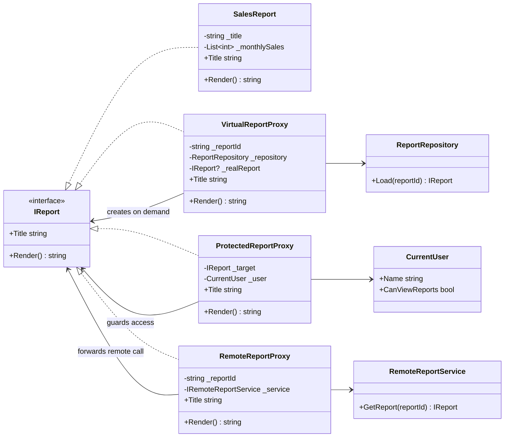
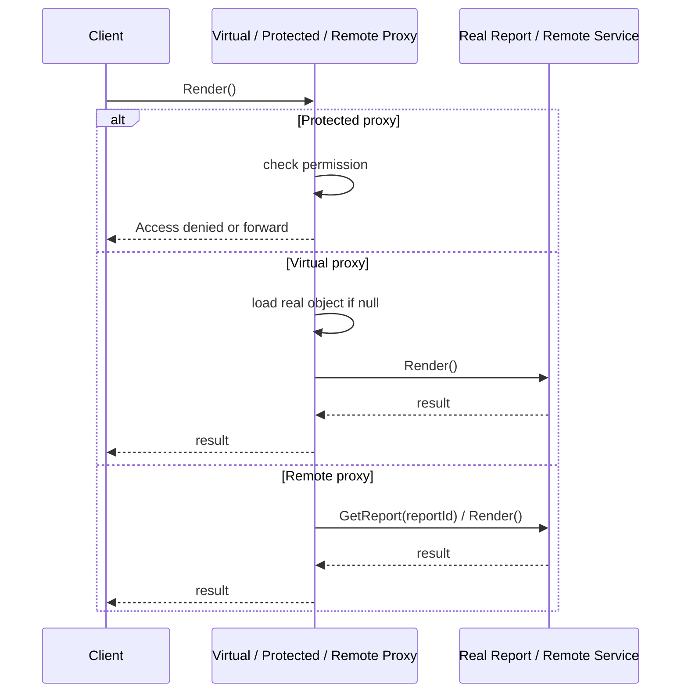

---
date: "2026-04-17"
title: "设计模式教科书｜Proxy：替身站在前面，真正对象躲在后面"
description: "Proxy 用一个外壳控制对真实对象的访问，既能延迟加载，也能做权限控制、远程调用和资源拦截；它解决的是访问边界，不是职责扩展。"
slug: "patterns-18-proxy"
weight: 918
tags:
  - "设计模式"
  - "Proxy"
  - "软件工程"
series: "设计模式教科书"
---

> 一句话定义：Proxy 的本质，是让一个对象在接口不变的前提下，代替另一个对象站在前面，负责控制访问时机、访问条件和访问方式。

## 历史背景

Proxy 的出现，和“对象越来越贵”这件事有关。早期程序里，对象只是内存里的一个结构；后来对象开始代表磁盘资源、网络连接、远程服务、权限边界和大图像缓存。对象一旦变贵，直接 new 出来再立刻访问，就会把启动时间、带宽和安全边界一起拖进来。

GoF 把 Proxy 归进结构型模式，并不是因为它长得像别的包装器，而是因为它在结构上替换了被访问者的位置。它最早的典型场景包括远程代理、虚代理、保护代理和智能引用。今天再看，这四类几乎已经散落在 ORM、RPC、浏览器缓存和资源系统里。

Proxy 很像“替身演员”。观众先看到替身，真正演员在后面。这个替身不一定要演更多戏，但它必须知道什么时候该让路，什么时候该拦住，什么时候该去远处把真东西带回来。

现代语言让代理实现容易了很多。动态代理、装饰器、lambda、`Lazy<T>`、拦截器框架都能帮忙，但它们没有改掉 Proxy 的核心问题：你是在控制访问，不是在叠加新职责。

再往后看，Proxy 的边界越来越清楚了。ORM 时代把它用在懒加载，RPC 时代把它用在远程 stub，浏览器时代把它用在请求拦截。变化的是载体，不变的是问题：真实对象贵、真实访问慢、真实权限不能裸奔。Proxy 负责把这些成本挡在调用点外面，而不是把成本悄悄藏进对象构造里。

## 一、先看问题

先看一个最常见的坏味道：对象太重，却在启动时一次性创建。

```csharp
using System;
using System.IO;
using System.Threading;

public sealed class BigImage
{
    private readonly string _path;
    private byte[] _pixels = Array.Empty<byte>();

    public BigImage(string path)
    {
        _path = path ?? throw new ArgumentNullException(nameof(path));
        LoadFromDisk();
    }

    private void LoadFromDisk()
    {
        if (!File.Exists(_path))
        {
            throw new FileNotFoundException("Image not found.", _path);
        }

        // 模拟大文件解码成本
        Thread.Sleep(1000);
        _pixels = File.ReadAllBytes(_path);
    }

    public void Render()
    {
        Console.WriteLine($"Render {_path}, bytes={_pixels.Length}");
    }
}
```

这段代码的问题很直接：只要构造对象，就立刻付费。用户也许只是想看缩略图、只想检查权限、只想知道文件名，却已经被强制拉进了磁盘读取和解码成本里。

同样的问题也会出现在远程服务里。你想调用一个订单服务，结果本地对象构造时就建立连接、拉配置、做鉴权、重试握手。看起来像“封装得更好”，实际上是把远端成本提前吞进了本地初始化。

还有一种更隐蔽：权限判断散落在业务代码里。每个调用点都写一遍 `if (user.IsAdmin)`，最后访问规则会散到各处，谁也说不清到底谁能看、谁不能看。

Proxy 就是为这些问题准备的。它不是为了“让代码更面向对象”，而是为了把访问控制从业务主体里拿出来。

## 二、模式的解法

Proxy 的思路很简单：客户端继续面对同一个接口，但它先碰到的是代理对象。代理对象可以在合适的时候创建真实对象、检查权限、转发远程调用，或者在资源未加载时返回占位结果。

下面这份代码同时演示虚代理、保护代理、远程代理和懒加载代理。接口不变，变化的是代理如何控制访问。

```csharp
using System;
using System.Collections.Generic;
using System.Threading;

public interface IReport
{
    string Title { get; }
    string Render();
}

public sealed class SalesReport : IReport
{
    private readonly string _title;
    private readonly List<int> _monthlySales;

    public SalesReport(string title, List<int> monthlySales)
    {
        _title = title ?? throw new ArgumentNullException(nameof(title));
        _monthlySales = monthlySales ?? throw new ArgumentNullException(nameof(monthlySales));
    }

    public string Title => _title;

    public string Render()
    {
        var total = 0;
        foreach (var sales in _monthlySales)
        {
            total += sales;
        }

        return $"{_title}: total={total}, months={_monthlySales.Count}";
    }
}

public sealed class ReportRepository
{
    public IReport Load(string reportId)
    {
        if (string.IsNullOrWhiteSpace(reportId))
        {
            throw new ArgumentException("Report id is required.", nameof(reportId));
        }

        // 模拟数据库或远程 IO
        Thread.Sleep(300);
        return new SalesReport($"Report-{reportId}", new List<int> { 12, 24, 18, 33 });
    }
}

public sealed class CurrentUser
{
    public CurrentUser(string name, bool canViewReports)
    {
        Name = name ?? throw new ArgumentNullException(nameof(name));
        CanViewReports = canViewReports;
    }

    public string Name { get; }
    public bool CanViewReports { get; }
}

public sealed class ProtectedReportProxy : IReport
{
    private readonly IReport _target;
    private readonly CurrentUser _user;

    public ProtectedReportProxy(IReport target, CurrentUser user)
    {
        _target = target ?? throw new ArgumentNullException(nameof(target));
        _user = user ?? throw new ArgumentNullException(nameof(user));
    }

    public string Title => _target.Title;

    public string Render()
    {
        if (!_user.CanViewReports)
        {
            return $"Access denied for {_user.Name}.";
        }

        return _target.Render();
    }
}

public sealed class VirtualReportProxy : IReport
{
    private readonly string _reportId;
    private readonly ReportRepository _repository;
    private IReport? _realReport;

    public VirtualReportProxy(string reportId, ReportRepository repository)
    {
        _reportId = reportId ?? throw new ArgumentNullException(nameof(reportId));
        _repository = repository ?? throw new ArgumentNullException(nameof(repository));
    }

    public string Title => _realReport?.Title ?? $"Loading report {_reportId}...";

    public string Render()
    {
        _realReport ??= _repository.Load(_reportId);
        return _realReport.Render();
    }
}

public interface IRemoteReportService
{
    IReport GetReport(string reportId);
}

public sealed class RemoteReportService : IRemoteReportService
{
    public IReport GetReport(string reportId)
    {
        Thread.Sleep(200);
        return new SalesReport($"Remote-{reportId}", new List<int> { 100, 90, 120 });
    }
}

public sealed class RemoteReportProxy : IReport
{
    private readonly string _reportId;
    private readonly IRemoteReportService _service;

    public RemoteReportProxy(string reportId, IRemoteReportService service)
    {
        _reportId = reportId ?? throw new ArgumentNullException(nameof(reportId));
        _service = service ?? throw new ArgumentNullException(nameof(service));
    }

    public string Title => $"Remote proxy for {_reportId}";

    public string Render()
    {
        var remote = _service.GetReport(_reportId);
        return remote.Render();
    }
}

public static class Program
{
    public static void Main()
    {
        IReport local = new SalesReport("Q1", new List<int> { 10, 20, 30 });
        IReport protectedReport = new ProtectedReportProxy(local, new CurrentUser("Alice", canViewReports: true));
        IReport virtualReport = new VirtualReportProxy("2026-04", new ReportRepository());
        IReport remoteReport = new RemoteReportProxy("west-eu", new RemoteReportService());

        Console.WriteLine(protectedReport.Render());
        Console.WriteLine(virtualReport.Title);
        Console.WriteLine(virtualReport.Render());
        Console.WriteLine(remoteReport.Render());
    }
}
```

这段代码把四种代理放在一起看，会更容易抓住共同点。

虚代理负责“先别真创建，等需要时再说”。

保护代理负责“你能不能看，先过权限门”。

远程代理负责“看起来像本地，实际上要去另一台机器拿”。

懒加载代理负责“第一次用到时再把对象拉进来”，它在 ORM 里尤其常见。

Proxy 的共同点不是“包一层”。共同点是：接口不变，访问策略变了。

## 三、结构图



## 四、时序图



Proxy 的运行时重点是“第一次访问时发生什么”。很多时候它不是返回结果的核心逻辑，而是决定结果什么时候、从哪里、以什么代价拿回来。

## 五、变体与兄弟模式

Proxy 最常见的四个变体前面已经提过，但它们的侧重点不同。

虚代理强调延迟创建。

远程代理强调把网络细节藏起来。

保护代理强调权限和审计。

懒加载代理强调把昂贵的读取延迟到第一次真正需要的时候。

Proxy 容易和两个模式混。

和 `Decorator` 混，是因为它们都保持同一接口、都包一层。区别在意图。Decorator 是为了叠加职责，Proxy 是为了控制访问。Decorator 会增加新行为，Proxy 多半不会让结果“更丰富”，只会让访问“更安全或更省”。

和 `Adapter` 混，是因为它们都包一层、都转发调用。区别在接口关系。Adapter 的目标是让两个本来不兼容的接口能合作；Proxy 的目标是让同一个接口在不改变外观的前提下加上访问控制。

如果一句话说完：Decorator 改语义，Adapter 改接口，Proxy 改访问时机和访问条件。

## 六、对比其他模式

| 模式 | 核心目的 | 接口关系 | 是否保留同一语义 | 典型场景 |
| --- | --- | --- | --- | --- |
| Proxy | 控制访问 | 同一接口 | 是 | 懒加载、鉴权、远程调用 |
| Decorator | 叠加职责 | 同一接口 | 语义增强 | 压缩、缓存、日志、加密 |
| Adapter | 接口翻译 | 不兼容接口 | 否 | 旧 API 接入、新旧系统对接 |
| Facade | 简化子系统入口 | 可能不同接口 | 否 | 一站式 API、SDK 门面 |

这张表里最重要的是“语义是否变”。Proxy 通常不应该改变结果，只改变访问过程。Decorator 改的是附加行为，Adapter 改的是对外协议。

再钉死一点：Decorator 会“让同一个对象多做一件事”，比如加日志、加压缩、加缓存命中统计；Proxy 则会“决定这个对象现在能不能被碰、要不要先把真对象拉出来、要不要先走网络”。如果你改的是功能叠加，它更像 Decorator；如果你改的是访问门禁，它才是 Proxy。

## 七、批判性讨论

Proxy 在现代系统里很常见，但它也很容易被滥用。

第一种滥用，是把所有业务逻辑都塞进代理里。代理一旦开始做太多事，接口外观虽然没变，真正职责已经漂移了。结果就是你明明在用 Proxy，实际上却造了一个看不见的 Service Layer。

第二种滥用，是把本来就便宜的对象也代理化。对象创建只要几微秒，你却为了“可扩展”多做一层代理、一次锁、一次缓存检查，反而把简单路径变慢了。

第三种滥用，是把代理混成装饰器。你本来想控制权限，最后却在代理里叠加了埋点、重试、缓存、降级和重命名。看起来很灵活，实际上边界已经乱了。

现代语言和框架也改变了 Proxy 的写法。`Lazy<T>`、拦截器、AOP、动态代理库会让实现更轻，但它们并不替你决定“需不需要代理”。如果对象本来就不是高成本资源，直接用真实对象更清楚。

## 八、跨学科视角

Proxy 和 ORM 的关系最明显。Hibernate 的代理体系就是经典的懒加载代理：实体在真正访问前保持未初始化状态，第一次读属性时再触发加载。

它和 RPC stub 的关系也很直接。gRPC 的 client stub 让调用者像调本地方法一样调远端服务，真正的网络细节被藏在 stub 后面。你拿到的是一个对象，但对象后面是协议、连接、重试、状态码和负载均衡。

浏览器里也有 Proxy。Service Worker 可以拦截请求、返回缓存、控制离线行为。这里的“代理”不在对象层，而在资源请求层，但思路完全一样：请求先经过中间层，再决定是去真实源头、缓存，还是直接拦截。

这说明 Proxy 的抽象不是“面向对象小技巧”，而是“控制访问路径”的通用思维。

## 九、真实案例

**案例 1：Hibernate 的 entity proxy / lazy loading**

Hibernate 官方文档明确描述了 `org.hibernate.proxy` 包：它提供一套用于延迟初始化实体代理的框架。
官方文档：<https://docs.hibernate.org/orm/6.0/javadocs/org/hibernate/proxy/package-summary.html>
补充文档：<https://docs.hibernate.org/orm/7.1/javadocs/org/hibernate/bytecode/spi/ProxyFactoryFactory.html>

这里最像 Proxy 的地方，不是“对象包了一层”，而是“实体还没真正加载，但外观已经可用”。这正是懒加载代理的标准姿势。

**案例 2：gRPC 的 client stub**

gRPC 官方文档把它定义成一个远程调用框架，客户端可以像调用本地对象那样调用远端服务；官方还明确说会自动生成 idiomatic client libraries / stubs。
官方文档：<https://grpc.io/docs/what-is-grpc/>
核心概念：<https://grpc.io/docs/what-is-grpc/core-concepts/>
性能建议：<https://grpc.io/docs/guides/performance/>

stub 的本质就是远程代理。调用方不直接碰连接、序列化和协议栈，而是碰一个本地对象外观。真正的调用细节被封装到代理里。

gRPC 这件事还说明了一个很实在的边界：stub 不是“语法糖版 HTTP 调用”，而是把服务定义、消息序列化、状态码和连接管理收进一个本地外观。官方性能页还特意提醒要复用 stub 和 channel，这恰好说明代理层本身也是有代价的，不能把每次调用都当成普通函数调用来写。

**案例 3：Service Worker**

MDN 明确写到 Service Worker essentially act as proxy servers, sits between web applications, the browser, and the network.
官方文档：<https://developer.mozilla.org/en-US/docs/Web/API/Service_Worker_API>
fetch 事件：<https://developer.mozilla.org/en-US/docs/Web/API/ServiceWorkerGlobalScope/fetch_event>

这里的代理是资源代理。它拦截请求、决定是否返回缓存、是否改写资源、是否离线兜底。它和对象代理不是同一种层次，但思想一致。

## 十、常见坑

- 代理方法里写了太多副作用，结果代理比真实对象还复杂。
- 把远程代理当成本地对象直接高频调用，没意识到每次调用都是网络往返。
- 懒加载没有同步控制，多线程下可能重复初始化真实对象。
- 保护代理只做前端检查，不做后端校验。前端拦不住真正的攻击者。
- 把 Proxy 和 Decorator 混用，最后团队自己都说不清它到底是在控访问还是在加功能。

## 十一、性能考量

Proxy 的性能收益主要体现在“少做无效工作”。如果 100 个对象里只有 10 个真正会被访问，虚代理可以把首次构造成本从 `O(100)` 压到 `O(10)`，剩下 90 个对象的成本被延后或避免。

代价也真实存在。每次访问多一层方法调用、一次判空、一次权限判断，甚至一次锁。这些单次成本大多是 `O(1)`，但它们会在高频路径上累积。

远程代理的成本更明显。它把本地方法调用变成网络调用，延迟从纳秒级跳到毫秒级。此时 Proxy 的价值不是“快”，而是“让你别误以为它快”。

浏览器资源代理也类似。Service Worker 能大幅减少重复下载和离线失败，但如果缓存策略设计差，拦截层本身也可能成为故障源。

## 十二、何时用 / 何时不用

适合用 Proxy 的场景很清楚。

适合用：大资源的懒加载、实体权限控制、RPC 客户端、缓存中间层、浏览器资源拦截、审计代理。它们的共同点是：访问代价高，或访问前必须加一道规则。

不适合用：对象很轻、调用很少、没有访问边界需求、真实对象已经足够安全的地方。Proxy 不会平白增加业务价值。

如果你只是想加日志、计时或埋点，Decorator 往往更合适；如果你只是要把旧接口翻成新接口，Adapter 更合适。

## 十三、相关模式

- [Decorator](./patterns-10-decorator.md)：同接口叠职责，但目的不同。
- [Adapter](./patterns-11-adapter.md)：接口翻译，不是访问控制。
- [Facade](./patterns-05-facade.md)：简化子系统入口，不控制单个对象的访问细节。
- [Memento](./patterns-12-memento.md)：保存和恢复状态，不是控制访问。
- [Bridge](./patterns-19-bridge.md)：解耦两个变化轴，不是延迟访问。

## 十四、在实际工程里怎么用

在工程里，Proxy 常常出现在“对象太贵”或“访问太敏感”的地方。

做 ORM 时，它能延迟装载关联对象；做 RPC 时，它能把远程服务伪装成本地对象；做浏览器资源层时，它能把缓存和离线逻辑塞进请求路径；做权限系统时，它能把谁能看、谁不能看统一收口。

如果你的应用未来会接 Unity 游戏、编辑器、桌面客户端、微服务后端或 Web 资源层，Proxy 的思路都能直接搬过去。它的价值不是某个框架，而是先把“访问”当成独立问题。

工程上更稳的边界是：只在访问成本高、访问规则硬、或者必须隐藏真实对象生命周期时再上 Proxy。若对象本身轻、调用路径短、权限也已经在上层收口，就别为了“可扩展”再套一层壳。Proxy 不是默认层，Proxy 是访问门禁。

应用线后续可在这里补一篇更贴近具体产品的文章：

- [Proxy 应用线占位：ORM 懒加载与资源代理](./pattern-18-proxy-application.md)

## 小结

Proxy 的三点价值很清楚：一是把昂贵对象的创建推迟到真正需要时；二是把权限、远程和缓存这些访问规则收口；三是让调用方继续以同一接口工作。

它最该避免的误用也很清楚：别把它当装饰器，别把它当适配器，别把简单对象也代理化。

一句话收尾：Proxy 不是让对象变强，而是让访问变得可控。


