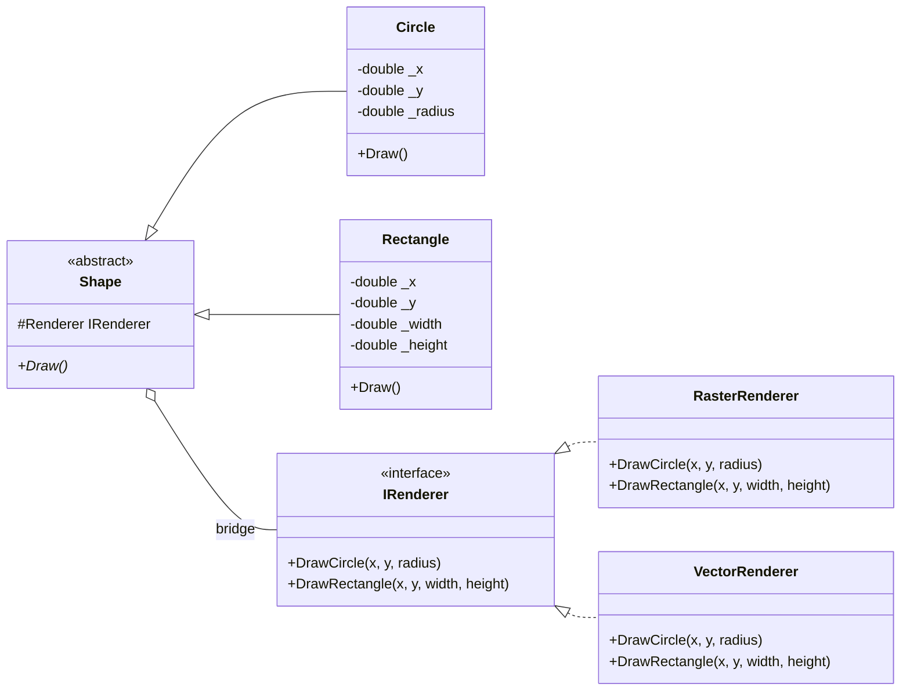
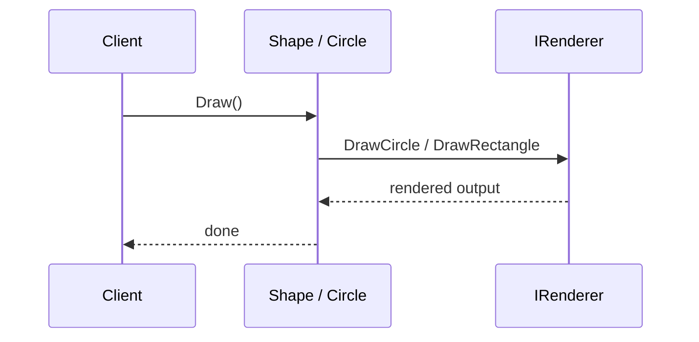

---
date: "2026-04-17"
title: "设计模式教科书｜Bridge：把抽象和实现拆成两条变化轴"
description: "Bridge 解决的不是接口分层，而是两个独立变化维度的正交组合；它让抽象层和实现层各自演化，避免继承树把平台、后端和形状全部拧成一团。"
slug: "patterns-19-bridge"
weight: 919
tags:
  - "设计模式"
  - "Bridge"
  - "软件工程"
series: "设计模式教科书"
---

> 一句话定义：Bridge 的本质，是把“抽象怎么被使用”和“具体怎么被实现”拆成两条独立变化轴，让它们可以分别扩展、分别替换、彼此不爆炸。

## 历史背景

Bridge 的历史背景，来自 GUI 工具包和图形系统早期那种很现实的痛点：一边是按钮、窗口、图形、菜单这些抽象概念，另一边是 Windows、X11、Mac、OpenGL、软件渲染这些实现细节。你如果把它们用继承硬连，类数会成倍爆炸。

GoF 把 Bridge 单独拎出来，本质上是在说：有些变化不是一条线，而是两条线。抽象层会变，实现层也会变，而且它们的变化节奏不同。把两条线叠成一棵树，树会很快失控。

这就是为什么 Bridge 常出现在图形 API、GUI toolkit、驱动层、跨平台渲染后端和设备无关层里。它不是“高层调用低层”的泛泛分层，而是“高层和底层都在变，但不能互相绑死”。

现代语言让这个模式更容易写，但没有改变它的核心经济学。只要你面对的是多平台、多后端、多渲染路径、多设备能力，Bridge 依旧比“继承加 if else”更耐用。

更关键的是，今天很多语言已经能用 sealed hierarchy、模式匹配和组合把一部分场景写得更短，这反而把 Bridge 的边界照得更清楚：如果变化轴只有一个，或者后端永远不会超过一两个，硬上 Bridge 只会制造间接层。Bridge 不是默认分层，它是为了防止两条独立变化线缠死。

## 一、先看问题

先看最直观的坏法：把形状和渲染平台交叉继承。

```csharp
using System;

public abstract class WindowsShape
{
    public abstract void Draw();
}

public sealed class WindowsCircle : WindowsShape
{
    public override void Draw() => Console.WriteLine("Draw circle with Windows GDI");
}

public sealed class WindowsRectangle : WindowsShape
{
    public override void Draw() => Console.WriteLine("Draw rectangle with Windows GDI");
}

public abstract class LinuxShape
{
    public abstract void Draw();
}

public sealed class LinuxCircle : LinuxShape
{
    public override void Draw() => Console.WriteLine("Draw circle with X11");
}

public sealed class LinuxRectangle : LinuxShape
{
    public override void Draw() => Console.WriteLine("Draw rectangle with X11");
}
```

这个写法看起来只是“重复了一点”，实际上它是在把两个变化轴硬绑成一个维度。只要你新增一个图形类型，或者新增一个平台，类数就会再乘一次。

如果有 4 个图形和 3 个后端，最朴素的继承方案要写 12 个类。再加上动画版、打印版、离屏版，数量会继续涨。不是每个团队都能接受这种扩张方式。

Bridge 的目标，就是把“图形是什么”和“怎么画出来”拆开。图形负责表达抽象，后端负责表达实现。两边都可以独立变化，不必每次都同步修改所有组合。

## 二、模式的解法

Bridge 需要两层对象。

上层是 `Shape` 这样的抽象，它定义“我要被怎么使用”。

下层是 `IRenderer` 这样的实现，它定义“我到底怎么画”。

上层持有下层引用，但不继承下层。它把工作委托给实现层去做。这样一来，抽象和实现各自扩展就不会把类树炸掉。

下面这份代码就是一个可运行的 Bridge。`Circle` 和 `Rectangle` 都依赖同一个 `IRenderer`，但可以在运行时换不同后端。

```csharp
using System;

public interface IRenderer
{
    void DrawCircle(double x, double y, double radius);
    void DrawRectangle(double x, double y, double width, double height);
}

public sealed class RasterRenderer : IRenderer
{
    public void DrawCircle(double x, double y, double radius)
        => Console.WriteLine($"Raster circle at ({x}, {y}) r={radius}");

    public void DrawRectangle(double x, double y, double width, double height)
        => Console.WriteLine($"Raster rectangle at ({x}, {y}) {width}x{height}");
}

public sealed class VectorRenderer : IRenderer
{
    public void DrawCircle(double x, double y, double radius)
        => Console.WriteLine($"Vector circle at ({x}, {y}) r={radius}");

    public void DrawRectangle(double x, double y, double width, double height)
        => Console.WriteLine($"Vector rectangle at ({x}, {y}) {width}x{height}");
}

public abstract class Shape
{
    protected Shape(IRenderer renderer)
    {
        Renderer = renderer ?? throw new ArgumentNullException(nameof(renderer));
    }

    protected IRenderer Renderer { get; }
    public abstract void Draw();
}

public sealed class Circle : Shape
{
    private readonly double _x;
    private readonly double _y;
    private readonly double _radius;

    public Circle(IRenderer renderer, double x, double y, double radius) : base(renderer)
    {
        _x = x;
        _y = y;
        _radius = radius;
    }

    public override void Draw() => Renderer.DrawCircle(_x, _y, _radius);
}

public sealed class Rectangle : Shape
{
    private readonly double _x;
    private readonly double _y;
    private readonly double _width;
    private readonly double _height;

    public Rectangle(IRenderer renderer, double x, double y, double width, double height) : base(renderer)
    {
        _x = x;
        _y = y;
        _width = width;
        _height = height;
    }

    public override void Draw() => Renderer.DrawRectangle(_x, _y, _width, _height);
}

public static class Program
{
    public static void Main()
    {
        IRenderer raster = new RasterRenderer();
        IRenderer vector = new VectorRenderer();

        Shape[] shapes =
        {
            new Circle(raster, 10, 10, 5),
            new Rectangle(vector, 0, 0, 20, 8),
            new Circle(vector, 4, 4, 2)
        };

        foreach (var shape in shapes)
        {
            shape.Draw();
        }
    }
}
```

这份代码里最重要的不是“用了接口”，而是“两个轴都可以单独变”。`Circle` 可以继续长出 `OutlinedCircle`，`IRenderer` 也可以继续长出 `PdfRenderer`、`OpenGlRenderer`、`SoftwareRenderer`。两边互不阻塞。

## 三、结构图



Bridge 图的重点不是层级，而是那条“桥”。它把抽象和实现之间的连接显式化，让两边都能独立演进。

## 四、时序图



如果没有 Bridge，这个时序就会退化成“每个抽象自己知道所有平台细节”。那样一来，抽象层就不再抽象，而是平台条件判断集合。

## 五、变体与兄弟模式

Bridge 的关键变体很简单：抽象层可以有多层，实施层也可以有多层。比如 GUI 里，`Window` 可以桥接 `PlatformWindow`，`Dialog` 可以桥接 `PlatformTheme`；渲染里，`Shape` 可以桥接 `Renderer`，`Document` 可以桥接 `Backend`。

它最容易和 `Adapter` 混。

Adapter 是后补的兼容层。你已经有两个不兼容接口，Adapter 负责翻译。

Bridge 是事先设计的正交解耦。它不是为了兼容旧接口，而是为了让两个变化轴别互相绑死。

换句话说，Adapter 处理“怎么把 A 变成 B”，Bridge 处理“怎么别让 A 和 B 先天绑在一起”。

Bridge 还容易和 Facade 混。Facade 是给子系统收口，Bridge 是让两个抽象维度能分别变化。Facade 的目标是简化入口，Bridge 的目标是拆掉组合爆炸。

## 六、对比其他模式

| 模式 | 关注点 | 解决的问题 | 变化方式 | 典型场景 |
| --- | --- | --- | --- | --- |
| Bridge | 两个变化轴解耦 | 类爆炸、平台耦合 | 抽象和实现分开变 | GUI toolkit、渲染后端、驱动层 |
| Adapter | 接口翻译 | 不兼容接口对接 | 旧接口映射到新接口 | 迁移、集成、兼容层 |
| Facade | 简化入口 | 子系统太复杂 | 收口调用面 | SDK 门面、应用入口 |
| Strategy | 可替换算法 | 同一任务多算法 | 运行时替换算法 | 排序、校验、路由 |

Bridge 和 Adapter 的边界必须钉死。Bridge 是设计时的结构选择；Adapter 往往是接入时的修补动作。Bridge 追求正交扩展，Adapter 追求接口相容。

再补一刀：Bridge 不是“高层比低层更抽象”，而是“高层和低层都各自有演化节奏”。如果你只是把一个实现类塞进另一个类里，这只是组合；只有当抽象侧和实现侧都能独立换人、独立增量、独立测试时，它才真的是 Bridge。

## 七、批判性讨论

Bridge 很强，但它不是零成本。

第一，它增加一层间接。调用路径多了一次委托，阅读路径也多了一层跳转。对性能敏感但变化不多的代码，这层间接未必值得。

第二，它有“过早正交化”的风险。很多项目一开始就把所有东西拆成抽象和实现两层，结果后端还没真正多起来，代码复杂度先上去了。

第三，它容易被误解成“接口 + 实现”的普通分层。这样写出来的代码如果没有两个独立变化轴，就不算 Bridge，只是一个更啰嗦的服务封装。

现代语言让 Bridge 更容易落地，比如 record、接口默认实现、泛型约束、DI 容器。但这些工具不会替你判断变化轴是否真的独立。没有两个变化维度，就不要硬桥。

## 八、跨学科视角

Bridge 在 GUI toolkit 里最典型。窗口、按钮、菜单这些抽象概念，必须落到不同平台的原生窗口和输入系统上。Qt 的 QPA 就是在做这件事：高层 GUI 逻辑通过平台抽象层，落到 `QPlatformWindow`、`QPlatformIntegration`、`QPlatformTheme` 等实现上。

在图形库里，Bridge 也很常见。Skia 明确提供多种 device backend：Raster、OpenGL、PDF、XPS、SVG、Picture。抽象层可以照旧画线、画图、排版，后端可以在 CPU、GPU 和文档格式之间切换。

驱动层里也一样。上层 API 想维持稳定，下层硬件能力却不停变。Bridge 让上层不用知道底层是软件栈、GPU、Vulkan 还是某种平台定制路径。

这和类型系统里的“接口稳定、实现多样”不是同一回事。Bridge 关注的是两条变化线的独立演化，不只是“面向接口编程”。

## 九、真实案例

**案例 1：Qt Platform Abstraction (QPA)**

Qt 官方文档把 QPA 直接定义成 main platform abstraction layer，并列出一堆 `QPlatform*` 类。
官方文档：<https://doc.qt.io/qt-6/qpa.html>
Qt Wiki：<https://wiki.qt.io/Qt_Platform_Abstraction>

QPA 是 Bridge 的教科书级案例。Qt 的高层 GUI 概念和底层平台细节被拆开，平台插件可以独立替换，GUI 抽象也可以继续增长。

**案例 2：Skia 的多后端架构**

Skia 官方文档明确说明它提供跨平台 API，并且有多个 device backend，包括 Raster、OpenGL、PDF、XPS、SVG 和 Picture。
官方文档：<https://skia.org/docs/user/>
API 概览：<https://skia.org/docs/user/api/>
Vulkan 后端：<https://skia.org/docs/user/special/vulkan/>

Skia 是另一个很稳的 Bridge 案例。上层 API 维持一致，下层后端可以按平台和能力切换。它不是“把渲染封装一下”，而是在维护多个实现轴。

Skia 的细节更说明问题：同一套 `SkCanvas` / `SkDocument` / `SkImage` 语义，可以落到 Raster、OpenGL、Vulkan 或 PDF 后端。对上层来说，差别不在“要不要重新学一套 API”，而在“同一套抽象如何落到不同设备和输出媒介”。这就是 Bridge 的力量，也是它的边界。

**案例 3：Skia CPU 后端架构文档**

Skia 的 CPU backend architecture 文档明确说明 CPU backend 负责在不使用 GPU 的情况下渲染图形。
官方源码文档：<https://skia.googlesource.com/skia/%2Bshow/6887dcf153bf/docs/architecture/CPU.md>

这类文档说明了后端实现和上层抽象之间的边界：上层绘制概念不变，底层执行路径可以换。

## 十、常见坑

- 把 Bridge 写成普通分层，没有第二条变化轴。
- 抽象层开始知道太多实现细节，最后桥变成了隧道。
- 实现层过早抽象，结果后端还没变，类就先膨胀了。
- 在变化很少的地方硬上 Bridge，制造不必要的间接层。
- 把 Adapter 当成 Bridge，用接口兼容问题冒充结构解耦问题。

## 十一、性能考量

Bridge 的性能账主要体现在“组合数”和“调用间接”。

如果有 `A` 个抽象变体、`B` 个实现变体，继承式组合往往要 `A × B` 个类。Bridge 把它拆成 `A + B`，外加少量桥接代码。这个差异不是微优化，而是组合爆炸和可维护性之间的差异。

例如 5 种图元、4 种后端。继承交叉方案要 20 个类。Bridge 方案大致是 5 个抽象类/派生类 + 4 个实现类 + 1 个接口，数量直接掉到个位数。

代价是每次调用多一次委托。这个成本通常是 `O(1)`，但在高频渲染路径里还是要评估。Bridge 不是让渲染更快，而是让扩展更可控。

## 十二、何时用 / 何时不用

适合用 Bridge 的场景很明确。

适合用：跨平台 GUI toolkit、渲染后端切换、驱动层抽象、设备无关输出、文档导出器、多协议传输层。它们的共同点是：抽象会变，实现也会变，且两者不应该互相绑死。

不适合用：只有一个后端、没有长期扩展压力、或者变化轴本来就不独立的系统。硬拆只会让代码绕远。

如果你只是要把旧接口适配到新系统，Adapter 更合适。如果你只是想收口复杂子系统，Facade 更合适。

## 十三、相关模式

- [Adapter](./patterns-11-adapter.md)：接口翻译，不是双轴解耦。
- [Facade](./patterns-05-facade.md)：简化入口，不处理实现轴正交化。
- [Proxy](./patterns-18-proxy.md)：控制访问，不拆变化轴。
- [Strategy](./patterns-03-strategy.md)：替换算法，不管理抽象和实现的两条演化线。
- [Composite](./patterns-16-composite.md)：树形结构统一接口，不是平台实现解耦。

## 十四、在实际工程里怎么用

在工程里，Bridge 最常出现在“你已经知道会有多平台、多后端、多设备”的地方。

GUI 框架会用它隔离窗口系统；渲染引擎会用它隔离 CPU/GPU/Vulkan/OpenGL 后端；驱动层会用它隔离硬件能力和上层 API；文档系统会用它隔离输出格式和内容结构。

如果你的产品未来会接 Unity、桌面 GUI、跨平台图形库或设备驱动层，Bridge 的思路都非常有用。它不是为了显得架构更高级，而是为了让平台扩张时不必重写抽象层。

工程上更稳的边界也很明确：先确认两条变化轴真的独立，再拆。若只是单一平台、单一后端，或者实现层不会长期演进，直接做普通组合或策略注入就够了。Bridge 的收益来自“少建交叉组合”，不是来自“多写几层类”。

应用线后续可在这里补一篇更贴近具体产品的文章：

- [Bridge 应用线占位：跨平台渲染后端与 GUI 抽象](./pattern-19-bridge-application.md)

## 小结

Bridge 的三个关键价值很清楚：一是把抽象和实现拆成两条变化轴；二是避免继承树在平台和功能上交叉爆炸；三是让高层抽象和底层实现都能独立进化。

它最重要的边界也很清楚：没有两条稳定变化轴，就不要硬上 Bridge。

一句话收尾：Bridge 不是“接口加实现”，而是“让两个会变的世界彼此不拖累”。


