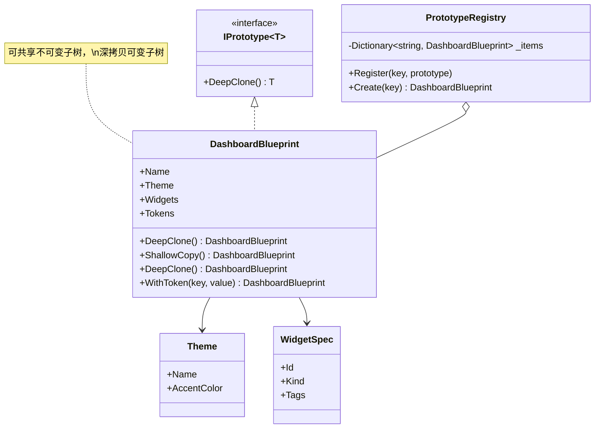
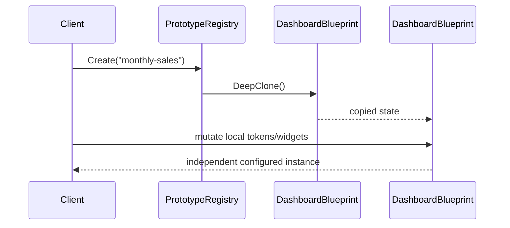

---
date: "2026-04-17"
title: "设计模式教科书｜Prototype：复制已配置实例，而不是简单拷贝对象"
description: "Prototype 解决的不是“创建对象”本身，而是“复制一个已经配好状态的对象”。它把复杂初始化、默认配置、模板参数和局部差异压缩成一次克隆，让新实例在原型基础上快速分叉。"
slug: "patterns-20-prototype"
weight: 920
tags:
  - 设计模式
  - Prototype
  - 软件工程
series: "设计模式教科书"
---

> 一句话定义：Prototype 的核心不是复制对象外壳，而是复制一份已经配置好的实例，再在此基础上做局部变化。

## 历史背景

Prototype 的出发点很现实：很多对象不是“new 出来就能用”，而是先经过一长串配置、绑定、注册、校验、预热，最后才成为可用实例。GoF 在 1994 年把“通过复制现成对象来创建新对象”整理成模式，本质上是承认了一件事：有些创建逻辑比对象本身还重，重到每次都从头构造会很浪费。

这类思路其实更早就存在。图形编辑器里的图层样式、文档模板、GUI 控件的默认状态、游戏里的预设 prefab、数据库里的已配置连接、编译器里的 AST 节点模板，都会先准备一个“已经调好的对象”，然后复制它再改少量字段。现代语言的 `record with`、copy ctor、序列化复制，让这件事更轻，但没有改变它的本质：**原型不是蓝图，原型是一个已经准备好的实例。**

## 一、先看问题

系统里最容易出现 Prototype 的地方，往往不是“创建实体”，而是“复制一个已经配好的工作态”。  
例如：一张报表模板已经配好页眉、页脚、默认字体、默认筛选条件、导出字段顺序，用户只想在这个基础上换客户名和日期范围。  
如果不用 Prototype，最常见的写法就是把所有初始化步骤再跑一遍。

坏代码长这样：

```csharp
using System;
using System.Collections.Generic;
using System.Linq;

public sealed record ReportField(string Key, string Label, bool IsVisible);

public sealed class ReportLayout
{
    public string Title { get; private set; }
    public string ThemeName { get; private set; }
    public List<ReportField> Fields { get; } = new();
    public Dictionary<string, string> Tokens { get; } = new();

    public ReportLayout(string title)
    {
        Title = title;
        ThemeName = "Default";
    }

    public void LoadDefaults()
    {
        ThemeName = "Corporate";
        Fields.Clear();
        Fields.Add(new ReportField("customer", "客户", true));
        Fields.Add(new ReportField("date", "日期", true));
        Fields.Add(new ReportField("amount", "金额", true));
        Tokens["lang"] = "zh-CN";
        Tokens["timezone"] = "Asia/Shanghai";
    }

    public ReportLayout CreateMonthlyCopy(string customerName)
    {
        var layout = new ReportLayout(Title);
        layout.LoadDefaults();
        layout.Tokens["customer"] = customerName;
        return layout;
    }
}
```

这段代码的问题不在“不能工作”，而在于它把创建和配置绑死在了一起。

- 每次复制都要重新跑默认初始化，浪费时间。
- 如果默认配置变了，所有创建路径都得跟着变。
- 调用方看起来是在“复制一个模板”，实际上是在“重新走一遍配置流程”。
- 一旦字段之间存在依赖，重复配置很容易漏一步。

这就是 Prototype 最常见的误区：它不是用来替代所有创建方式的，而是用来复制**已经配置好的实例**。

## 二、模式的解法

Prototype 的价值不在“少写几个 `new`”，而在于把“创建态”和“配置态”合在一起。  
当一个对象的真正价值体现在它已经携带了哪些配置、挂了哪些子对象、绑定了哪些策略时，复制这个对象通常比重新拼装更直接。

下面这份代码把一个仪表板蓝图做成原型。  
它包含 immutable 的主题配置，也包含需要深拷贝的可变集合。  
代码同时展示了浅拷贝、深拷贝和原型注册表。

```csharp
using System;
using System.Collections.Generic;
using System.Linq;

public interface IPrototype<T>
{
    T DeepClone();
}

public sealed record Theme(string Name, string AccentColor);
public sealed record WidgetSpec(string Id, string Kind, List<string> Tags);

public sealed record DashboardBlueprint(
    string Name,
    Theme Theme,
    List<WidgetSpec> Widgets,
    Dictionary<string, string> Tokens) : IPrototype<DashboardBlueprint>
{
    

    public DashboardBlueprint ShallowCopy() => this with { };

    public DashboardBlueprint DeepClone()
    {
        var widgets = Widgets
            .Select(widget => widget with { Tags = new List<string>(widget.Tags) })
            .ToList();

        return new DashboardBlueprint(
            Name,
            Theme, // 主题是不可变记录，可以安全共享
            widgets,
            new Dictionary<string, string>(Tokens));
    }

    public DashboardBlueprint WithToken(string key, string value)
    {
        var copy = DeepClone();
        copy.Tokens[key] = value;
        return copy;
    }
}

public sealed class PrototypeRegistry
{
    private readonly Dictionary<string, DashboardBlueprint> _items = new();

    public void Register(string key, DashboardBlueprint prototype)
    {
        if (string.IsNullOrWhiteSpace(key))
            throw new ArgumentException("键不能为空。", nameof(key));

        _items[key] = prototype ?? throw new ArgumentNullException(nameof(prototype));
    }

    public DashboardBlueprint Create(string key)
    {
        if (!_items.TryGetValue(key, out var prototype))
            throw new KeyNotFoundException($"找不到原型：{key}");

        return prototype.DeepClone();
    }
}

public static class Program
{
    public static void Main()
    {
        var prototype = new DashboardBlueprint(
            Name: "MonthlySales",
            Theme: new Theme("Corporate", "#0057B8"),
            Widgets: new List<WidgetSpec>
            {
                new("chart", "line-chart", new List<string> { "sales", "trend" }),
                new("table", "data-grid", new List<string> { "details" })
            },
            Tokens: new Dictionary<string, string>
            {
                ["lang"] = "zh-CN",
                ["timezone"] = "Asia/Shanghai"
            });

        var registry = new PrototypeRegistry();
        registry.Register("monthly-sales", prototype);

        var cloned = registry.Create("monthly-sales");
        cloned.Tokens["customer"] = "Contoso";
        cloned.Widgets[0].Tags.Add("vip");

        Console.WriteLine(prototype.Tokens.ContainsKey("customer"));
        Console.WriteLine(prototype.Widgets[0].Tags.Count);
        Console.WriteLine(cloned.Tokens["customer"]);
        Console.WriteLine(cloned.Widgets[0].Tags.Count);
    }
}
```

这份实现刻意把几种语义拆开了。

- `Theme` 是不可变记录，直接共享就行，这属于结构共享。
- `Widgets` 里有可变 `List<string>`，必须深拷贝，否则标签会互相污染。
- `ShallowCopy()` 只复制最外层壳，适合纯不可变对象，或者临时演示。
- `DeepClone()` 才是真正安全的“复制配置好的实例”。

Prototype 的重点不是“复制一份对象”，而是“复制一份可继续分叉的配置态”。

## 三、结构图



这张图里最重要的关系，是原型注册表和原型实例之间的关系。  
注册表不是工厂逻辑的替代品，它只是把“已经配好的实例”存起来，再按需克隆。  
真正有价值的是原型本身已经带着配置、默认值和子对象关系。

## 四、时序图



时序图说明了一件事：调用方先拿到的是一个已经配好态的实例副本，而不是一个“空壳对象 + 继续配置”。  
这正是 Prototype 最核心的语义差别。

## 五、变体与兄弟模式

Prototype 常见的变体有四种。

- **浅拷贝**：只复制最外层对象，内部引用共享。
- **深拷贝**：递归复制整个对象图，确保副本可独立修改。
- **结构共享**：不可变子树直接共享，只复制变化的那一段。
- **Copy-on-write**：先共享，第一次写入时才复制，适合读多写少的场景。

它最容易和三个模式混淆。

- **Builder**：Builder 是一步一步造对象；Prototype 是复制现成对象，再做局部修改。
- **Factory / Factory Method**：Factory 决定“怎么创建”，Prototype 决定“拿哪个现成实例来克隆”。
- **Flyweight**：Flyweight 追求共享以省内存；Prototype 追求复制以便分叉，目标正好相反。

一句话记忆：Builder 负责拼装，Factory 负责选择，Prototype 负责分叉，Flyweight 负责共享。

## 六、对比其他模式

| 维度 | Prototype | Builder | Factory | Flyweight |
|---|---|---|---|---|
| 核心动作 | 克隆已配置实例 | 分步构造 | 选择创建逻辑 | 共享可复用状态 |
| 适合对象 | 配置很多、分叉很多的对象 | 构造步骤复杂的对象 | 创建分支多的对象族 | 大量相似、可共享的对象 |
| 主要价值 | 快速复制可用状态 | 避免构造顺序混乱 | 隔离创建决策 | 降低内存占用 |
| 典型风险 | 深浅拷贝混乱 | Builder 过重 | 工厂膨胀 | 共享状态污染 |
| 现代语言替代 | `record with`、copy ctor、序列化克隆 | 对复杂对象仍然有用 | `new` + 模式匹配常可简化 | 不可变对象 + 结构共享 |

Prototype 最需要强调的一点是：它不是简单复制对象壳，而是复制**已经调好参数的实例**。  
如果你只是想省掉一层构造器，Builder 可能更直接。  
如果你只是想在几个产品类型里选一个，Factory 更直白。  
如果你想让大量对象共享同一份内在状态，Flyweight 才是目标。

现代语言里的 `record with`、拷贝构造器、序列化复制，确实覆盖了 Prototype 的一部分问题。  
但它们往往只对“平坦对象”好用。  
一旦对象图里有可变集合、缓存、回调、资源句柄，还是得自己明确深拷贝边界。

## 七、批判性讨论

Prototype 最常见的批评，是它容易让对象的复制语义变得不透明。  
如果一个类型既能浅拷贝、又能深拷贝、又能结构共享，调用方就必须先知道“你到底复制了什么”。  
这会让 API 设计从“创建对象”变成“猜语义”。

第二个问题是克隆可能绕过不变量。  
构造函数通常负责校验、默认值和依赖注入；而克隆如果只做字段复制，就可能把一个本来不该存在的状态悄悄复制出来。  
所以 Prototype 适合复制**已验证对象**，不适合复制**还没完成初始化的半成品**。

第三个问题是深拷贝很贵。  
对象图越大，复制越接近一次完整遍历。  
如果你每次都深拷贝一个大树，再只改一个小字段，成本就会很难看。  
这时结构共享或 copy-on-write 往往更合适。

现代语言特性确实让 Prototype 轻了很多。  
`record with` 对不可变对象特别顺手，copy ctor 也能把复制意图写得很清楚。  
但它们只解决了“浅层分叉”的问题，没有自动帮你处理共享列表、嵌套对象和外部资源。

所以 Prototype 不是过时了，而是变得更挑场景。  
它适合“配置好的实例要大量分叉”的场景，不适合把所有复制都交给通用语法。

## 八、跨学科视角

在图形编辑器里，Prototype 和 prefab 非常接近。  
你先调好一个图层样式、一个控件模板、一个面板配置，再复制它生成多个实例。  
复制的价值不是“再造一个对象”，而是“保留已经调好的状态，再做局部变化”。

在编译器里，AST 节点复制也是同类问题。  
优化 pass 经常需要基于现有子树生成一个变体，而不是从头重新解析。  
如果整棵树都得重建，代价会非常高；如果只改一部分，结构共享和 copy-on-write 就会比全量深拷贝更稳。

在数据库和分布式系统里，快照、版本对象和事务读视图也有同样味道。  
你不是直接改原对象，而是基于某个稳定版本分叉出一个新版本。  
Prototype 的思想，本质上就是“从一个可用版本开始派生”，这和版本控制非常接近。

## 九、真实案例

两个真实案例都非常典型。

- Kubernetes 的 API 类型大量使用自动生成的 `DeepCopy` 方法。你可以直接看 [kubernetes/kubernetes/staging/src/k8s.io/api/node/v1/zz_generated.deepcopy.go](https://github.com/kubernetes/kubernetes/blob/master/staging/src/k8s.io/api/node/v1/zz_generated.deepcopy.go) 以及 [kubernetes/kubernetes/staging/src/k8s.io/apimachinery/pkg/apis/meta/v1/zz_generated.deepcopy.go](https://github.com/kubernetes/kubernetes/blob/master/staging/src/k8s.io/apimachinery/pkg/apis/meta/v1/zz_generated.deepcopy.go)。`kubernetes/apimachinery` 的仓库说明也明确提到它用于 API machinery，而这些 `DeepCopyInto` / `DeepCopyObject` 方法就是典型的“复制配置好的对象图”。  
- Protocol Buffers 里，克隆语义也很清楚。C# 官方文档里的 [Google.Protobuf.IDeepCloneable<T>](https://protobuf.dev/reference/csharp/api-docs/interface/google/protobuf/i-deep-cloneable-t-.html) 明确说明 `DeepClone()` 会创建深拷贝；C++ 官方文档里的 [message.h](https://protobuf.dev/reference/cpp/api-docs/google.protobuf.message/) 则说明 `CopyFrom` / `MergeFrom` 的行为边界。Go 版本的 [`google.golang.org/protobuf/proto`](https://pkg.go.dev/google.golang.org/protobuf/proto) 也把 `CloneOf` 放在核心 API 里，说明“复制消息”是 protobuf 生态里的基础能力，而不是边角功能。

这两个案例分别对应两种典型场景。  
Kubernetes 需要复制对象图，让 API 资源在不同层之间安全传递。  
Protobuf 需要复制消息，让消息对象可以在序列化、变换、合并之间保持独立。  
它们都不是在“新建一个空对象”，而是在“复制一个已经成型的对象状态”。

## 十、常见坑

第一个坑是把浅拷贝当深拷贝。  
外层对象看起来是新的，内部列表却还是同一份。  
你在副本里改一个标签，原型里也跟着变，这种 bug 最隐蔽。

第二个坑是把深拷贝当万能解。  
深拷贝能保证独立，但不一定划算。  
对象图大、复制频繁、只改一个字段时，深拷贝就是在给 CPU 和内存加压。

第三个坑是克隆后忘了重新绑定外部资源。  
比如连接、句柄、缓存、订阅器、事务上下文，这些东西通常不能原样复制。  
克隆只适合复制状态，不适合盲目复制所有引用。

第四个坑是让复制语义不一致。  
同一个类型里，一会儿 `with`，一会儿 copy ctor，一会儿 `DeepClone()`，结果每个方法的深浅边界都不一样。  
这会让维护者不知道该信哪个。

## 十一、性能考量

Prototype 的性能核心，就是把“重复初始化”换成“复制已配置状态”。  
如果原始构造成本很高，而复制成本较低，这个模式就很值。

复杂度上可以这样看：

- 浅拷贝通常是 `O(1)`，但会共享内部引用。
- 深拷贝通常是 `O(n)`，`n` 是对象图中需要复制的节点数。
- 结构共享通常是 `O(k)`，`k` 是发生变化的局部子树大小。
- Copy-on-write 在读多写少时，平均写入前接近 `O(1)`，第一次写入再支付复制成本。

所以 Prototype 不该默认等同于深拷贝。  
如果对象的大部分结构可以共享，结构共享比全量复制更合适。  
如果对象几乎不会变，直接不可变对象加 `with` 更简单。  
如果对象会频繁分叉但只改一小部分，copy-on-write 才更有吸引力。

## 十二、何时用 / 何时不用

适合用：

- 你要复制的是“已经配置好的实例”。
- 创建流程比对象本身复杂，且同类对象要大量分叉。
- 很多子对象可以共享，但少数字段需要独立修改。

不适合用：

- 对象很简单，`new` 就足够。
- 构造过程需要强校验、强约束，克隆容易绕过不变量。
- 你没有明确的深浅拷贝边界。

一句话判断：**如果你想复制的是“可直接使用的配置态”，Prototype 很合适；如果你只是想少写几个构造参数，Builder 或 Factory 往往更清楚。**

## 十三、相关模式

- [Builder](./patterns-04-builder.md)：Builder 负责把对象一步步造出来，Prototype 负责把已经造好的实例复制出去。
- [Factory Method 与 Abstract Factory](./patterns-09-factory.md)：Factory 决定创建哪个类型，Prototype 决定复制哪个现成实例。
- [Flyweight](./patterns-17-flyweight.md)：Flyweight 追求共享内在状态，Prototype 追求复制后分叉。

后续互链预留：

- [Composite](./patterns-16-composite.md)：树形对象的复制经常和 Composite 一起出现。
- [Visitor](./patterns-13-visitor.md)：当你复制树并对节点做变换时，Visitor 往往也会参与。

## 十四、在实际工程里怎么用

工程里最常见的落点有四个。

- 配置模板：表单模板、报表模板、工作流模板、游戏 prefab，都是“先配好，再复制”的典型场景。未来应用线可展开到 [配置模板占位](../../engine-toolchain/build-system/config-template-prototype.md)。
- AST / IR：编译器、脚本引擎、查询规划器常常要复制树，再在局部改写。未来应用线可展开到 [AST 分叉占位](../../engine-toolchain/compiler/ast-prototype.md)。
- 云原生对象：Kubernetes 的资源对象、controller 里的对象快照、版本化配置，都会依赖深拷贝或生成代码。未来应用线可展开到 [K8s 对象复制占位](../../engine-toolchain/backend/k8s-object-clone.md)。
- 消息与协议：protobuf 消息、DTO、事件快照，常常需要一个可独立修改的副本。未来应用线可展开到 [消息克隆占位](../../engine-toolchain/backend/message-prototype.md)。

Prototype 的真正价值，不是“少创建对象”，而是让系统能从一个已验证、已配置的状态快速分叉出新实例。  
当初始化成本高、分叉频繁、局部变更明显时，它就会比从头构造更稳。

## 小结

- Prototype 复制的是“配置好的实例”，不是简单对象壳。
- 它要和深拷贝、浅拷贝、结构共享、Copy-on-write 分开理解，不能一锅煮。
- 它最适合模板实例、配置图、AST、消息对象这类需要快速分叉的场景。

一句话总括：Prototype 的价值，不在于“能不能复制”，而在于“能不能把一个已经调好的状态安全地分叉出去”。


