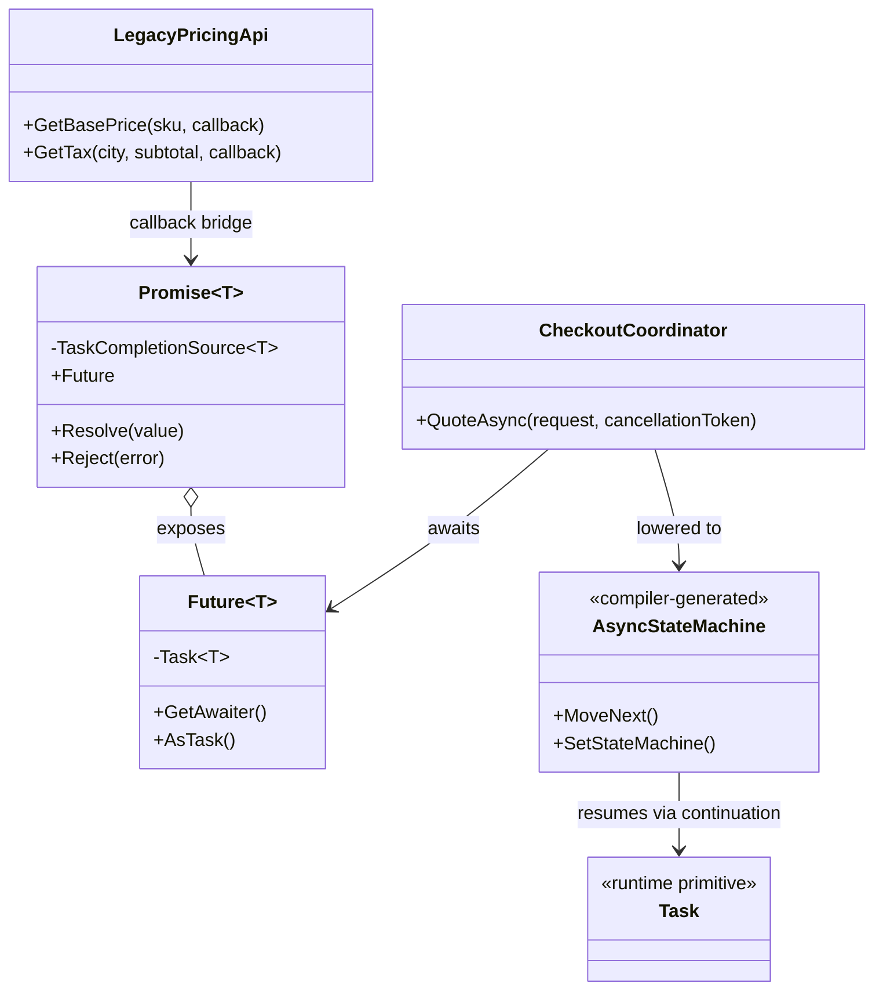
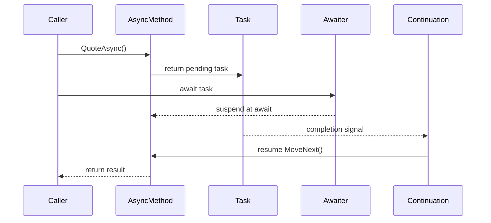

---
date: "2026-04-17"
title: "设计模式教科书｜Promise / Future / async-await"
description: "Promise / Future / async-await 解决的是‘代码想顺着写，运行却要异步交错’这个老问题。它把回调地狱改造成可恢复的状态机，把等待从线程阻塞里拆出来，并让取消、异常、组合和结构化并发有了统一入口。"
slug: "patterns-21-async-await"
weight: 921
tags:
  - 设计模式
  - async-await
  - 软件工程
series: "设计模式教科书"
---

> 一句话定义：Promise / Future / async-await 把“稍后完成的结果”对象化，再把挂起与恢复编译成状态机。

## 历史背景

异步不是新问题，麻烦也不是新麻烦。只要系统要等 I/O、等网络、等磁盘、等用户，就会碰到“我想继续写直线代码，但中间得先让出控制权”的矛盾。早期程序员先用回调解决：注册一个函数，完成时再回来调用。这个方法能工作，但当步骤一多，代码就会向右下角无限缩进，回调地狱很快出现。

Promise 和 Future 的思想更早。它们把“结果还没到，但未来会到”封装成一个可传递的对象。Future 偏读取方，Promise 偏写入方；前者像一个占位的结果句柄，后者像一个完成结果的承诺。Java、JavaScript、Erlang、Scala、C++ 等生态都在不同时间把这条线讲得更清楚，最后汇成了现代异步编程的共同语法。

C# 5 把 async/await 推到主流时，核心不是“新增两个关键字”，而是把异步控制流从回调手里夺回来。编译器把方法改写成状态机，运行时把继续执行的动作当作 continuation 保存起来。写代码的人看到的是顺序；编译器和运行时看到的是状态转移。这个分工，才是 async/await 真正的价值。

## 一、先看问题

最初的异步代码常常像一棵倒着长的树。下载配置，成功后解析，解析完去查库存，库存查完再算税，税算完才返回结果。只要中间任何一步失败，就得一路往外传错误。你写着写着，主流程已经不在一条直线上，而是在一串嵌套回调里绕圈。

下面这段坏代码能跑，但结构已经开始失控。它把“等待结果”写成了“把下一步塞进上一层回调”。

```csharp
using System;
using System.Collections.Generic;
using System.Threading;
using System.Threading.Tasks;

public sealed record Result<T>(bool IsSuccess, T? Value, Exception? Error)
{
    public static Result<T> Success(T value) => new(true, value, null);
    public static Result<T> Failure(Exception error) => new(false, default, error);
}

public sealed record ShippingQuote(decimal BasePrice, decimal Tax, decimal Total);

public sealed class LegacyPricingApi
{
    public void GetBasePrice(string sku, CancellationToken cancellationToken, Action<Result<decimal>> callback)
    {
        ThreadPool.QueueUserWorkItem(_ =>
        {
            try
            {
                SimulateWork(20, cancellationToken);
                callback(Result<decimal>.Success(sku.Length * 12.5m));
            }
            catch (OperationCanceledException ex)
            {
                callback(Result<decimal>.Failure(ex));
            }
            catch (Exception ex)
            {
                callback(Result<decimal>.Failure(ex));
            }
        });
    }

    public void GetTax(string city, decimal subtotal, CancellationToken cancellationToken, Action<Result<decimal>> callback)
    {
        ThreadPool.QueueUserWorkItem(_ =>
        {
            try
            {
                SimulateWork(15, cancellationToken);
                callback(Result<decimal>.Success(subtotal * (city.Contains("CN") ? 0.06m : 0.12m)));
            }
            catch (OperationCanceledException ex)
            {
                callback(Result<decimal>.Failure(ex));
            }
            catch (Exception ex)
            {
                callback(Result<decimal>.Failure(ex));
            }
        });
    }

    private static void SimulateWork(int milliseconds, CancellationToken cancellationToken)
    {
        var end = Environment.TickCount64 + milliseconds;
        while (Environment.TickCount64 < end)
        {
            cancellationToken.ThrowIfCancellationRequested();
            Thread.Sleep(1);
        }
    }
}

public sealed class NaiveCheckoutWorkflow
{
    private readonly LegacyPricingApi _api = new();

    public void QuoteAsync(string sku, string city, Action<Result<ShippingQuote>> callback)
    {
        _api.GetBasePrice(sku, cancellationToken, basePrice =>
        {
            if (!basePrice.IsSuccess)
            {
                callback(Result<ShippingQuote>.Failure(basePrice.Error!));
                return;
            }

            _api.GetTax(city, basePrice.Value!.Value, cancellationToken, tax =>
            {
                if (!tax.IsSuccess)
                {
                    callback(Result<ShippingQuote>.Failure(tax.Error!));
                    return;
                }

                var total = basePrice.Value.Value + tax.Value!.Value;
                callback(Result<ShippingQuote>.Success(new ShippingQuote(basePrice.Value.Value, tax.Value.Value, total)));
            });
        });
    }
}
```

这段代码的问题，不只是难看。它还让异常、取消、组合、并行全都变成了手工编排。只要步骤超过三层，维护者就会开始在缩进里迷路。

## 二、模式的解法

现代异步编程拆成三块：结果载体、完成通道、恢复语法。Future 是“以后会完成的结果”，Promise 是“负责把结果填进去的那一侧”，async/await 则是把恢复语法变得像同步代码。C# 里，`Task<T>` 基本扮演 Future，`TaskCompletionSource<T>` 扮演 Promise，`await` 则把 continuation 的挂起和恢复藏进编译器生成的状态机里。

下面这份纯 C# 代码把这三层放在一起：先用 Promise/Future 包装一个旧式异步 API，再用 async/await 把多个 Future 组合成直线流程。

```csharp
using System;
using System.Runtime.CompilerServices;
using System.Threading;
using System.Threading.Tasks;

public sealed class Promise<T>
{
    private readonly TaskCompletionSource<T> _tcs = new(TaskCreationOptions.RunContinuationsAsynchronously);

    public Future<T> Future => new(_tcs.Task);

    public void Resolve(T value) => _tcs.TrySetResult(value);
    public void Reject(Exception error) => _tcs.TrySetException(error);
}

public sealed class Future<T>
{
    private readonly Task<T> _task;

    public Future(Task<T> task)
    {
        _task = task ?? throw new ArgumentNullException(nameof(task));
    }

    public TaskAwaiter<T> GetAwaiter() => _task.GetAwaiter();
    public Task<T> AsTask() => _task;
}

public sealed record OrderRequest(string Sku, string City, int Quantity);
public sealed record Quote(decimal BasePrice, decimal Tax, decimal Total);

public sealed class PricingGateway
{
    private readonly LegacyPricingApi _api = new();

    public Future<decimal> GetBasePriceAsync(string sku, CancellationToken cancellationToken)
    {
        var promise = new Promise<decimal>();
        _api.GetBasePrice(sku, result =>
        {
            if (result.IsSuccess)
            {
                promise.Resolve(result.Value!.Value);
                return;
            }

            promise.Reject(result.Error!);
        });

        return promise.Future;
    }

    public Future<decimal> GetTaxAsync(string city, decimal subtotal, CancellationToken cancellationToken)
    {
        var promise = new Promise<decimal>();
        _api.GetTax(city, subtotal, result =>
        {
            if (result.IsSuccess)
            {
                promise.Resolve(result.Value!.Value);
                return;
            }

            promise.Reject(result.Error!);
        });

        return promise.Future;
    }
}

public sealed class CheckoutCoordinator
{
    private readonly PricingGateway _gateway = new();

    public async Task<Quote> QuoteAsync(OrderRequest request, CancellationToken cancellationToken)
    {
        cancellationToken.ThrowIfCancellationRequested();

        var basePriceTask = _gateway.GetBasePriceAsync(request.Sku, cancellationToken).AsTask();
        var taxTask = _gateway.GetTaxAsync(request.City, request.Quantity * 100m, cancellationToken).AsTask();

        await Task.WhenAll(basePriceTask, taxTask).ConfigureAwait(false);

        var basePrice = await basePriceTask.ConfigureAwait(false);
        var tax = await taxTask.ConfigureAwait(false);
        return new Quote(basePrice, tax, basePrice + tax);
    }
}

public static class Demo
{
    public static async Task Main()
    {
        var coordinator = new CheckoutCoordinator();
        using var cts = new CancellationTokenSource(TimeSpan.FromSeconds(2));

        var quote = await coordinator.QuoteAsync(new OrderRequest("SKU-001", "CN-Shanghai", 3), cts.Token);
        Console.WriteLine($"Base={quote.BasePrice}, Tax={quote.Tax}, Total={quote.Total}");
    }
}
```

这份实现的重点是分工。Promise 负责完成，Future 负责等待，async/await 负责把等待写得像顺序代码。`Task.WhenAll` 把多个 Future 的 fan-out/fan-in 收拢到一个父操作里，`CancellationToken` 负责把这条调用链收束在父作用域内，因为它已经一路传到旧 API 和底层工作，而不是只在入口处检查一次。这里已经能看出结构化并发的影子：子任务不是野生长出去的，它们属于一个明确的父流程。

## 三、结构图



这张图里最重要的是最后两条边。`await` 不是魔法，也不是线程切换；它只是把“稍后继续”的信息存进状态机，再让 `Task` 或 awaiter 在完成时把 continuation 唤醒。

## 四、时序图



这个流程和普通同步调用有本质区别。同步调用是“我现在就执行完”，而 async/await 是“我先返回一个可等待句柄，后面再恢复”。调用栈在这里没有消失，只是被编译器拆成了可恢复的状态字段。

## 五、变体与兄弟模式

Promise / Future / async-await 常见变体很多。

- Promise/Future：语言或库提供两个句柄，一个负责写入，一个负责读取。
- Task/ValueTask：C# 的主流承载形式。`Task` 更通用，`ValueTask` 更省分配，但使用约束更强。
- callback：最原始的异步表达，简单但很快失控。
- coroutine：把“暂停/恢复”直接暴露出来，偏控制流。
- actor：把异步消息放进邮箱，靠消息驱动状态机，而不是靠直接 await。

它们很容易混淆，但关注点不同。callback 只是延迟回调；Future 是结果句柄；Promise 是完成权；async-await 是语法糖加状态机；actor 关心的是消息顺序和隔离，而不是单次结果等待。

## 六、对比其他模式

| 对比对象 | callback | coroutine | async/await | actor |
|---|---|---|---|---|
| 控制流形状 | 嵌套回调 | 显式挂起/恢复 | 直线写法 + 状态机 | 消息驱动 |
| 结果表达 | 回调参数 | `yield`/resume | `Task` / `await` | 消息/事件 |
| 错误传播 | 手工向外传 | 手工处理 | 结构化异常传播 | 消息失败/重试 |
| 取消 | 常被遗漏 | 由调度器决定 | `CancellationToken` | 邮箱/消息取消 |
| 适合场景 | 简单 I/O | 协作式调度 | 大多数异步 I/O | 高隔离并发 |

再看 `Task` 和线程的区别也很重要。线程是运行资源，Task 是完成契约；线程负责“在哪儿跑”，Task 负责“什么时候完成”。一个 Task 可能在同一线程里继续，也可能在别的线程里恢复。`await` 的价值，不是开线程，而是不阻塞当前线程。

## 七、批判性讨论

async/await 常被误解成“异步就等于更快”。这不对。它解决的是等待时不阻塞，不是把 CPU 计算凭空加速。I/O 绑定任务会受益很大，CPU 绑定任务不一定需要它；把 CPU 活丢进 `Task.Run` 只是把问题移到线程池，不是解决问题。

第二个老问题是死锁。最常见的写法就是在同步上下文里 `.Result` 或 `.Wait()` 一个本该 `await` 的任务。你看起来像是在等待，实际是在堵住恢复通道。UI、ASP.NET 旧时代都踩过这个坑。现代代码里，`await` 应该是默认路径，阻塞等待只是最后的边角工具。

第三个问题是上下文捕获。默认恢复到原上下文很方便，但不是所有库都应该这么做。库代码里不加思考地捕获上下文，会把调用方的调度策略也一起绑进来。`ConfigureAwait(false)` 不是银弹，但它提醒我们：异步的恢复位置也是设计的一部分。

现代语言特性确实让一些旧模式轻了很多。很多以前必须写成一长串 `ContinueWith` 的地方，现在一个 `await` 就够了；而很多以前必须自己写状态字段和 label 的地方，现在编译器替你生成了。可轻，不代表不用想边界。取消、超时、错误、资源释放，还是要你自己定义。

## 八、跨学科视角

async/await 本质上是 continuation-passing style 的语法化。你把“下一步怎么做”交给编译器，编译器把 continuation 变成状态机字段和恢复点。这个思想和函数式编程里把控制流转成函数参数，完全同源。

它和结构化并发也有天然关系。structured concurrency 关心的是任务生命周期要有明确父子关系：父任务取消，子任务也取消；父任务结束前，子任务要么完成，要么被收敛。C# 没有把这件事写成强制语法，但 `CancellationToken`、`Task.WhenAll`、`await using`、`IAsyncDisposable` 已经把这条边界做得很清楚。

它还和 actor 模型互补。async/await 更适合“我想直接等一个结果”，actor 更适合“我只发消息，不等待共享状态”。如果你的系统里需要大量隔离和顺序保证，actor 比裸 Task 更像系统设计；如果你需要顺序地写一段 I/O 流程，async/await 更顺手。

## 九、真实案例

async/await 的工业实现并不神秘，直接看源码就够了。

- [dotnet/runtime - `AsyncTaskMethodBuilderT.cs`](https://github.com/dotnet/runtime/blob/main/src/libraries/System.Private.CoreLib/src/System/Runtime/CompilerServices/AsyncTaskMethodBuilderT.cs)：这是 async 方法常见的 builder 实现之一，负责把状态机和 Task 接起来，处理完成、异常和 continuation。
- [dotnet/runtime - `TaskAwaiter.cs`](https://github.com/dotnet/runtime/blob/main/src/libraries/System.Private.CoreLib/src/System/Runtime/CompilerServices/TaskAwaiter.cs)：awaiter 决定了 `await` 如何挂起和恢复，直接体现了“任务完成后再续上后半段”的机制。
- [dotnet/roslyn - async lowering area](https://github.com/dotnet/roslyn/tree/main/src/Compilers/CSharp/Portable/Lowering/AsyncRewriter)：Roslyn 的 lowering 区域负责把 `async` 方法改写成状态机。你写的是顺序代码，编译器落地的是 `MoveNext` 和字段保存。
- [.NET Blog - How Async/Await Really Works in C#](https://devblogs.microsoft.com/dotnet/how-async-await-really-works/)：这篇官方博客把设计脉络、编译器改写和运行时协作讲得很清楚。

这些案例说明，async/await 不是“语言表面糖衣”，而是编译器、awaiter、builder、Task 共同配合的结果。你看到的是一个关键字，底下其实是一整套 continuation 机制。

## 十、常见坑

第一个坑是把 async 当成并行。`await` 只表示等待，不表示多核并行。要并行，得显式启动多个独立任务，再用 `Task.WhenAll` 收敛。

第二个坑是滥用 `async void`。除了事件处理器，`async void` 让异常和完成时机都变得难管理。它基本不适合业务逻辑。

第三个坑是忘记取消与超时。没有 `CancellationToken` 的异步，很容易变成“请求发出去了，但不再受控”。一旦调用链长起来，你会发现没有父作用域的子任务很难收口。

第四个坑是过度依赖上下文恢复。库里需要审慎决定是否回到原上下文；应用里也不该假定每次恢复都发生在同一线程。线程不是语义边界，任务才是。

## 十一、性能考量

async/await 的主要成本来自状态机和任务分配，而不是关键字本身。只要方法真的发生了挂起，编译器就要保存局部变量、恢复点和 builder；这通常意味着至少一个状态机对象，外加某种形式的任务承载。

复杂度上，单个 async 方法的恢复通常是 `O(1)`，但把很多异步步骤串起来时，fan-out/fan-in 的协调成本是 `O(n)`。如果你把 10 个子任务并行启动，再等待它们全部完成，真正的成本往往是 I/O 和调度，而不是 `await` 语法。

`Task` 不等于线程，这一点也影响性能判断。启动一个 Task 不一定启动一个线程；如果你只是等网络或磁盘，Task 的价值是让线程去做别的事。若是 CPU 密集型计算，盲目 `Task.Run` 只会增加调度开销。

`ValueTask` 适合高频、经常同步完成的热路径，但它换来的不是“必然更快”，而是“减少某些完成路径上的分配”。一旦使用不当，复杂度会增加。性能优化永远要建立在测量之后，而不是凭直觉替换所有 `Task`。

## 十二、何时用 / 何时不用

适合用：

- 主要是在等 I/O、网络、数据库、磁盘或外部服务。
- 你想保留顺序写法，但不想阻塞线程。
- 你需要取消、超时、异常传播和任务组合。

不适合用：

- 纯 CPU 计算，不需要异步等待。
- 一个同步函数就能清楚表达。
- 你需要手写非常细的协作调度，这时 coroutine 或 actor 可能更直接。

## 十三、相关模式

- [Observer](./patterns-07-observer.md)：很多 continuation 本质上就是一次可订阅的完成通知。
- [Chain of Responsibility](./patterns-08-chain-of-responsibility.md)：异步请求经常沿着处理中间件链传递。
- [Actor Model](./patterns-23-actor-model.md)：把异步变成消息驱动的隔离执行。
- [Pipeline / Pipes and Filters](./patterns-24-pipeline.md)：多个异步步骤串联时，流水线比回调更稳。

## 十四、在实际工程里怎么用

async/await 在工程里几乎是默认选项，尤其适合这些地方。

- Web API：调用数据库、外部 HTTP、缓存和队列。
- 桌面 UI：保持界面响应，避免主线程被阻塞。
- 构建和工具链：批量下载、包恢复、并发扫描、导入流程。

后续应用线占位：

- [异步任务编排在构建与资源导入中的应用](../../engine-toolchain/concurrency/async-await-task-orchestration.md)

## 小结

Promise / Future / async-await 的第一价值，是把回调地狱改成可读的顺序流程。
Promise / Future / async-await 的第二价值，是把等待从线程阻塞里拆出来，让取消、异常和组合都能被统一治理。
Promise / Future / async-await 的第三价值，是它把编译器 lowering、Task 机制和 structured concurrency 连接成了一条完整链路。

