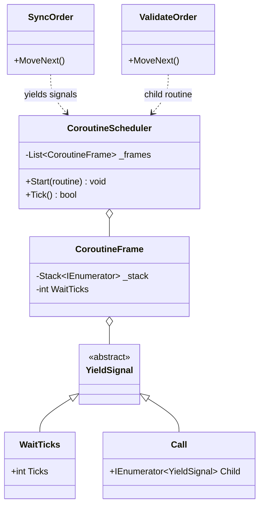
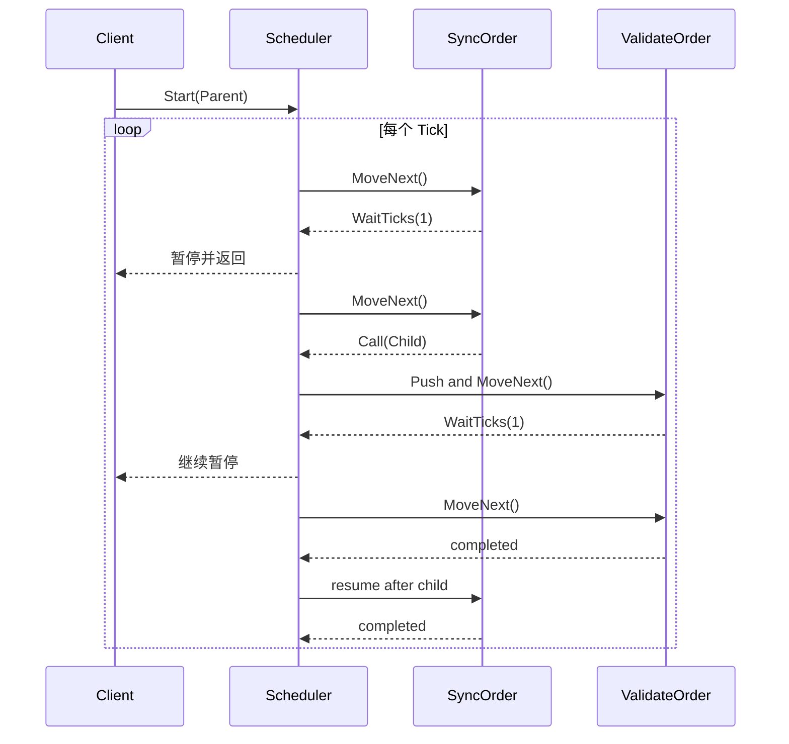

---
date: "2026-04-17"
title: "设计模式教科书｜Coroutine 的本质：把执行权让给调度器，再把现场带回来"
description: "Coroutine 不是魔法，它只是把执行点、局部状态和恢复位置显式保存起来，再由调度器分段推进。本文从 generator、semi-coroutine、full coroutine 到 fibers 讲清它的演化、边界与现代 C# 里的对应写法。"
slug: "patterns-22-coroutine"
weight: 922
tags:
  - "设计模式"
  - "Coroutine"
  - "并发"
  - "软件工程"
series: "设计模式教科书"
---

> 一句话定义：Coroutine 是一种把“未完成的计算”暂停下来、把继续执行的位置保存起来、再在之后某个时刻恢复的控制结构。

## 历史背景
Coroutine 先于现代语言的 `async/await` 成熟。早期它出现在编译器、解释器和脚本 VM 里，用来把长流程拆成可暂停的步骤：读取字符流、驱动协作式任务、写出更像自然顺序的控制流。和线程不同，它不把控制权交给操作系统抢占；和回调不同，它不把后续逻辑拆成一串分散的闭包。

真正关键的变化，是“保存现场”从手写变成了编译器和运行时的共同职责。Generator、semi-coroutine、full coroutine、fiber 这几条线，最后都收敛到一个问题：谁来保存 continuation，谁来恢复它。

如果再往前追，协程思想一直在“表达力”和“代价”之间摆动。手写 continuation 最透明，但最难维护；stackful coroutine 更像自然调用栈，但栈切换和调试成本更高；stackless coroutine 牺牲了任意栈跳转，却换来了更低的保存成本和更容易做静态分析。现代语言大多选了后者，因为它更适合和 GC、异常、类型系统一起工作。

## 一、先看问题
批处理任务最容易把 coroutine 的价值暴露出来。假设一个订单同步器要做三件事：拉列表、逐条校验、遇到限流就暂停一会儿再继续。你当然可以写回调，也可以写一个巨大的 `switch` 状态机，但代码会很快变成“流程图翻译器”，每加一步都在补洞。

下面这段坏代码不是错在逻辑，而是错在控制流已经失控：

```csharp
using System;
using System.Collections.Generic;

public sealed class LegacyOrderSync
{
    private enum Step { Fetch, Validate, Commit, WaitBackoff, Done }

    private readonly Queue<string> _orders = new();
    private Step _step = Step.Fetch;
    private int _backoffTicks;

    public void Tick()
    {
        switch (_step)
        {
            case Step.Fetch:
                Console.WriteLine("fetch orders");
                _orders.Enqueue("A-1001");
                _orders.Enqueue("A-1002");
                _step = Step.Validate;
                break;

            case Step.Validate:
                if (_orders.Count == 0)
                {
                    _step = Step.Done;
                    break;
                }

                var order = _orders.Peek();
                Console.WriteLine($"validate {order}");
                _step = Step.Commit;
                break;

            case Step.Commit:
                Console.WriteLine($"commit {_orders.Dequeue()}");
                _step = Step.WaitBackoff;
                _backoffTicks = 2;
                break;

            case Step.WaitBackoff:
                if (_backoffTicks-- > 0)
                {
                    Console.WriteLine("backoff...");
                    break;
                }
                _step = Step.Validate;
                break;
        }
    }
}
```

问题不在于 `switch` 写得丑，而在于流程知识被散进了状态变量。想插入重试、取消、子流程、超时，你会不断把“顺序思维”改写成“状态补丁”。

Coroutine 要解决的，就是把这份控制流重新写回顺序语义里。

## 二、模式的解法
Coroutine 的核心不是“异步”，而是“可恢复”。它把程序切成多个挂起点：执行到一半时暂停，把局部变量和下一步位置一起保存；调度器再在合适的时候恢复它。

在 C# 里，`yield return` 和 `async/await` 都能表达这个思想，只是面向的对象不同。前者更像“把控制权交给外部枚举器”，后者更像“把恢复点交给 awaiter 和状态机”。

下面给出一个纯 C# 的协作式调度器。它不依赖引擎，也不借助线程；它只保存 continuation，并且允许一个 coroutine `Call` 另一个 coroutine，从而表现出“恢复现场后继续往下走”的本质。

```csharp
using System;
using System.Collections.Generic;
using System.Linq;

public abstract record YieldSignal;
public sealed record WaitTicks(int Ticks) : YieldSignal;
public sealed record Call(IEnumerator<YieldSignal> Child) : YieldSignal;

public sealed class CoroutineScheduler
{
    private sealed class CoroutineFrame
    {
        public required Stack<IEnumerator<YieldSignal>> Stack { get; init; }
        public int WaitTicks { get; set; }
    }

    private readonly List<CoroutineFrame> _frames = new();

    public void Start(IEnumerator<YieldSignal> routine)
    {
        ArgumentNullException.ThrowIfNull(routine);
        _frames.Add(new CoroutineFrame
        {
            Stack = new Stack<IEnumerator<YieldSignal>>(new[] { routine })
        });
    }

    public bool Tick()
    {
        for (int i = _frames.Count - 1; i >= 0; i--)
        {
            var frame = _frames[i];

            if (frame.WaitTicks > 0)
            {
                frame.WaitTicks--;
                continue;
            }

            while (frame.Stack.Count > 0)
            {
                var current = frame.Stack.Peek();

                try
                {
                    if (!current.MoveNext())
                    {
                        current.Dispose();
                        frame.Stack.Pop();
                        continue;
                    }
                }
                catch
                {
                    while (frame.Stack.Count > 0)
                    {
                        frame.Stack.Pop().Dispose();
                    }
                    throw;
                }

                switch (current.Current)
                {
                    case WaitTicks wait when wait.Ticks >= 0:
                        frame.WaitTicks = wait.Ticks;
                        goto NextFrame;

                    case Call call:
                        ArgumentNullException.ThrowIfNull(call.Child);
                        frame.Stack.Push(call.Child);
                        break;

                    case null:
                        break;

                    default:
                        throw new InvalidOperationException($"Unsupported signal: {current.Current.GetType().Name}");
                }
            }

            _frames.RemoveAt(i);

        NextFrame:
            ;
        }

        return _frames.Count > 0;
    }
}

public static class Demo
{
    public static void Main()
    {
        var scheduler = new CoroutineScheduler();
        scheduler.Start(SyncOrder("A-1001"));
        scheduler.Start(SyncOrder("A-1002"));

        while (scheduler.Tick())
        {
            Console.WriteLine("-- scheduler tick --");
        }
    }

    private static IEnumerator<YieldSignal> SyncOrder(string orderId)
    {
        Console.WriteLine($"[{orderId}] fetch");
        yield return new WaitTicks(1);

        yield return new Call(ValidateOrder(orderId));
        yield return new WaitTicks(2);

        Console.WriteLine($"[{orderId}] commit");
    }

    private static IEnumerator<YieldSignal> ValidateOrder(string orderId)
    {
        Console.WriteLine($"[{orderId}] validate");
        yield return new WaitTicks(1);
        Console.WriteLine($"[{orderId}] validated");
    }
}
```

这段代码里，`WaitTicks` 和 `Call` 都是在描述“暂停后该做什么”。`Stack<IEnumerator<YieldSignal>>` 保存的就是 continuation 的栈式版本：子流程结束后，父流程会从挂起点继续向下执行。

## 三、结构图


## 四、时序图


## 五、变体与兄弟模式
Coroutine 不是一个单一实现，而是一族控制流抽象。

- Generator：最窄的形式，只负责“产出下一个值”。
- Semi-coroutine：从子流程回到调用者，再由调用者继续推进，C# 的 `yield return`、Python generator 都在这个区间。
- Full coroutine：两个协程可以直接互相切换，控制权不是只能回到最初的调用者。
- Fiber：带独立栈的 coroutine，接近用户态线程，切换代价更高，但调用栈更自然。

它最容易混淆的兄弟有两个：

- Iterator：看起来也会 `yield`，但 iterator 主要解决“数据序列遍历”，不是“任意控制流恢复”。
- Async/Await：看起来也是暂停与恢复，但它服务于异步 I/O 和任务编排，恢复点绑定的是 awaitable，而不是任意协作式调度器。

## 六、对比其他模式
| 模式 | 关注点 | 谁恢复执行 | 是否保留调用栈语义 | 典型用途 |
|---|---|---|---|---|
| Coroutine | 控制流可暂停、可恢复 | 调度器或对端协程 | 取决于实现，stackless 更常见 | 批处理、脚本、协作式调度 |
| Iterator | 按需产出序列 | 调用方 `MoveNext()` | 否 | 集合遍历、流式处理 |
| Async/Await | 等待异步结果 | awaiter / runtime | 编译器降低后保留“顺序写法” | I/O、RPC、任务编排 |
| State Machine | 显式描述阶段 | 自己的状态转移逻辑 | 否 | 协议、工作流、解析器 |

如果你把 coroutine 误当成 iterator，就会只看到 `yield`，看不到“控制权可以回到谁手里”。如果你把 coroutine 误当成 async/await，就会期待它自动处理线程池、异常传播、上下文切换；这些都不是 coroutine 本身承诺的。

## 七、批判性讨论
Coroutine 的优点很大，但它的批评也很实际。

第一，它不是并行。协作式调度的前提是每个步骤都要主动让出控制权。一个步骤如果跑太久，整个系统还是会卡住。

第二，它容易制造“看起来顺序、实际上分段”的错觉。代码表面上像线性流程，真实的执行点却分散在多个挂起位置。调试时如果不理解 continuation，常常会在“为什么这里还没继续”上浪费时间。

第三，full coroutine 和 fiber 常被包装成“用户态线程”，但这会把成本藏起来。独立栈意味着更高的内存占用和更重的切换成本。很多场景根本不需要这种重量级能力，stackless coroutine 已经足够。

现代语言也在重写这个模式。C# 的 `async/await`、Python 的 `async def`、C# 的 iterator lowering，都说明一件事：用户写 coroutine 风格代码时，不一定要自己管理 continuation，但运行时仍然要管理它。

## 八、跨学科视角
Coroutine 和函数式编程的关系最直接：它接近 continuation-passing style（CPS）。区别只在于，CPS 把“下一步”显式变成参数，Coroutine 把“下一步”隐含在保存的执行现场里。

这也是为什么很多编译器都把 `yield` 和 `await` 降低成状态机。状态机不是对 coroutine 的替代，而是它的机械实现。你把“下一步去哪”编码成状态号，就等于把 continuation 显式化了。

在操作系统里，线程切换要保存寄存器、栈指针和调度信息；Coroutine 只保存它需要的最小执行状态，所以更轻，但也更脆弱。它适合把复杂流程拆小，不适合取代真正的并行执行。

## 九、真实案例
C# 的 iterator lowering 是 coroutine 思想最清楚的官方实现之一。Microsoft 文档说明，`yield return` 会记住当前位置，下次 `MoveNext()` 时从暂停点继续。对应的 Roslyn 实现位于 `https://github.com/dotnet/roslyn/tree/main/src/Compilers/CSharp/Portable/Lowering/IteratorRewriter`。这就是 stackless coroutine 的编译器版本。

Python 的 generator 也是同一类东西。CPython 在 `Objects/genobject.c` 里维护 generator 对象的状态、帧和恢复逻辑。Python 的生成器后来又被扩展成协程语义，说明 coroutine 并不是某种语言专属技巧，而是一种通用控制流结构：保存执行点，再恢复它。

Lua 的官方手册把 coroutine 写得更直接：`coroutine.create`、`coroutine.resume`、`coroutine.yield` 形成一套对称接口，适合把解释器、脚本任务和协作式调度写成分段流程。它和 C# iterator 的差别在于，Lua 允许你更显式地把调度权交给上层，而 C# 更倾向把协程压进编译器降低后的状态机里。

如果想补一个官方文档视角，C# iterators 文档 `https://learn.microsoft.com/en-us/dotnet/csharp/programming-guide/concepts/iterators` 和 `yield` 参考页 `https://learn.microsoft.com/en-us/dotnet/csharp/language-reference/statements/yield` 都明确说明了“当前位置会被记住”这一点。这个行为就是 coroutine 的核心，不需要额外包装成别的术语。

## 十、常见坑
- 把 coroutine 当线程用：它不会自动并行，长步骤照样会阻塞调度器。
- 把 `yield return` 当普通函数调用：一旦挂起，局部变量会被冻结，后续代码不是立刻执行。
- 在协作式调度里混入阻塞 I/O：你会把整个调度器拖死，而不是只拖慢一个任务。
- 忽略异常传播：子协程抛错后如果不统一收口，父流程会以为子流程还在正常运行。
- 把 fiber 当作“更强的 coroutine”盲目引入：它解决的是另一类问题，成本也完全不同。

## 十一、性能考量
Coroutine 的主要开销不在 CPU 指令本身，而在“保存多少现场、恢复多少现场”。

- 调度一轮的复杂度通常是 `O(n)`，`n` 是活跃协程数。
- 每个协程实例至少要保存状态号、局部变量和挂起点信息，内存复杂度是 `O(k)`，`k` 是该协程的活动字段数。
- 如果实现支持嵌套子协程，额外的恢复开销会随嵌套深度增长，近似为 `O(d)`。

和 fibers 比，stackless coroutine 更省栈内存；和线程比，它更少依赖内核切换。代价是它要求你接受“每次只能走到下一个挂起点”的模型。对批处理、脚本执行、I/O 编排，这个代价很划算；对 CPU 密集型并行计算，这个模型就不够用。

## 十二、何时用 / 何时不用
适合用：

- 流程天然分段，而且每段之间需要暂停。
- 调度顺序重要，但并不要求抢占式并发。
- 你想把复杂流程写回接近直线的样子，降低状态变量数量。

不适合用：\n\n- 你真正需要多核并行。\n- 单个步骤可能长时间占用 CPU，却没有明确的让出点。\n- 团队更擅长显式状态机，且代码审查需要把转移关系完全摊开。\n\n如果项目要求可观测性特别强，比如要把每一步都打到审计日志、追踪系统和重试看板里，显式状态机往往更合适。Coroutine 会把“流程看上去很顺”作为主要收益，但这也意味着某些转移点隐藏得更深；当业务最关心的是失败原因和边界态，而不是书写顺滑度，状态机的机械感反而更安全。

## 十三、相关模式
- [async-await](./patterns-21-async-await.md)
- [Observer](./patterns-07-observer.md)
- [Chain of Responsibility](./patterns-08-chain-of-responsibility.md)
- [Actor Model](./patterns-23-actor-model.md)
- [Pipeline](./patterns-24-pipeline.md)

## 十四、在实际工程里怎么用
在工程里，Coroutine 常出现在这些位置：脚本解释器、数据导入器、消息驱动工作流、分段爬虫、增量构建器、测试执行器。它特别适合把“需要暂停的长任务”拆成可恢复的步骤，而不是把整件事塞进一个巨大的方法里。

教科书线讲的是本质；落地时你会把它改成具体框架里的调度器、任务图或脚本 VM。对应的应用线文章可以放在 `../../engine-toolchain/concurrency/coroutine-scheduler.md`。\n\n如果把它放进真实系统，最常见的不是“写出一个神奇的协程框架”，而是把现有的长流程拆成能暂停、能恢复、能取消的步骤，再把这些步骤接到日志、超时和重试策略上。这样做的价值不在语法，而在让流程边界和失败边界同步显形。它把暂停点变成设计的一部分。

## 小结
- Coroutine 的本质是保存 continuation，而不是“看起来像异步”。
- 它擅长把分段流程写成直线语义，代价是必须接受协作式调度。
- 它和 async/await、iterator、state machine 共享同一思想，只是抽象层不同。


