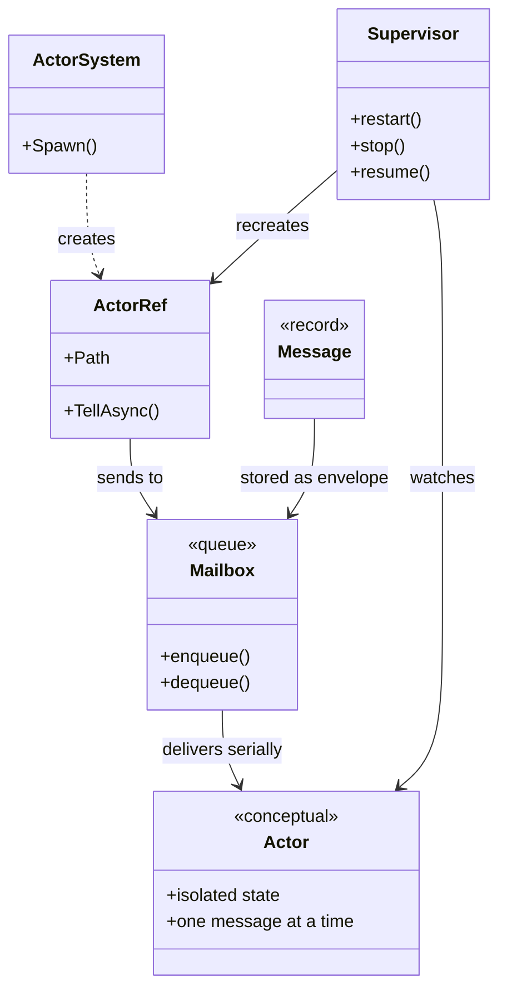

---
date: "2026-04-17"
title: "设计模式教科书｜Actor Model：把并发和分布式交给消息，而不是锁"
description: "Actor Model 把状态封进独立实体，用邮箱和消息串起并发、失败隔离和分布式通信，避免共享内存把系统拖进锁竞争。"
slug: "patterns-23-actor-model"
weight: 923
tags:
  - "设计模式"
  - "Actor Model"
  - "并发"
  - "分布式系统"
series: "设计模式教科书"
---

> 一句话定义：Actor Model 把系统拆成一组彼此隔离的消息接收者，每个接收者只通过邮箱收消息、只改自己的状态、只把结果继续发出去。

## 历史背景

Actor Model 不是从业务框架里长出来的，而是从并发计算的根问题里长出来的。1973 年，Carl Hewitt、Peter Bishop、Richard Steiger 在 IJCAI 提出 ACTOR formalism，目标不是“把线程写得更舒服”，而是换一个更适合并发、分布式和 AI 的计算观。那时的主流模型仍然偏向顺序控制流和全局状态，遇到多参与者协作时，大家只能靠共享内存、显式同步和一堆约束条件把系统硬拼起来。

Hewitt 看到的痛点很直接：一旦多个执行流都能读写同一份状态，系统的难点就从“做业务”变成“保证谁能在什么时候改这块内存”。锁可以修补局部竞争，却不能从根上消灭可见性、时序和失败传播问题。Actor Model 的出发点刚好相反：把可变状态封进单个实体里，让外部只能通过消息影响它。只要外部没有共享可写状态，很多并发问题就不再需要被锁去遮掩。

这也是它和“线程 + 队列”口号的差别。线程只是执行资源，队列只是消息容器；Actor Model 关注的是边界、身份和责任。一个 actor 有邮箱、有私有状态、有自己的行为切换，也有失败后的恢复方式。后来，不管是 Erlang/OTP、Akka、Orleans，还是 Cloudflare Durable Objects，本质上都在重复这三件事：隔离状态、串行处理消息、把故障当成局部事件处理。

今天我们再看它，会发现它并不老。多核、云原生、边缘计算、实时协作、分布式一致性，这些场景都在放大同一类问题：共享状态越多，协调成本越高；协调成本越高，系统越脆。Actor Model 不是万能药，但它把这类问题的讨论方式改了：不要先问“谁拿锁”，先问“谁拥有状态，谁有权改变它”。

## 一、先看问题

先看一个很常见的订单库存协调问题。两个请求同时来到服务里，一个在扣库存，一个在补库存。为了保证余额不被写坏，你很容易写成下面这样：

```csharp
using System;
using System.Collections.Generic;

public sealed class InventoryService
{
    private readonly Dictionary<string, int> _stock = new();
    private readonly object _gate = new();

    public void Seed(string sku, int quantity)
    {
        lock (_gate)
        {
            _stock[sku] = quantity;
        }
    }

    public void Reserve(string sku, int quantity)
    {
        lock (_gate)
        {
            if (!_stock.TryGetValue(sku, out var current))
            {
                throw new InvalidOperationException($"Unknown SKU: {sku}");
            }

            if (quantity <= 0)
            {
                throw new ArgumentOutOfRangeException(nameof(quantity));
            }

            if (current < quantity)
            {
                throw new InvalidOperationException($"Insufficient stock for {sku}");
            }

            _stock[sku] = current - quantity;
        }
    }

    public void Replenish(string sku, int quantity)
    {
        lock (_gate)
        {
            _stock.TryGetValue(sku, out var current);
            _stock[sku] = current + quantity;
        }
    }
}
```

这段代码在单机、低并发、短临界区时没什么大毛病。问题是它把“正确性”完全绑在一把锁上。你开始要扩展时，麻烦就会冒出来：

- 你想在扣库存后发消息、写审计、做风控，锁的持有时间立刻变长。
- 你想把库存拆成多个分片，锁的粒度就会开始失控。
- 你想把服务拆到多个节点，`lock` 根本不会跨进程工作。
- 你想在失败后重试，重试逻辑和并发控制会互相缠在一起。

更糟的是，锁保护的是一段内存访问窗口，不是业务对象本身。谁都能拿到那把锁，谁都能把共享字典改掉。结果就是：

- 状态的所有权不清楚。
- 调用链越来越长。
- 失败会沿着共享状态扩散。
- 你最后只能靠“约定不要乱改”维持系统。

Actor Model 想解决的就是这类结构性问题。它不问你“有没有锁”，而问你“状态是不是只能由一个执行上下文改”。只要答案是肯定的，很多同步原语就可以从业务层消失。

## 二、模式的解法

Actor 的核心不是“把消息丢进队列”，而是把状态、行为和失败边界捆在一起。失败时也不是“旧实例继续跑着，顺手再起一个新实例”，而是先让旧 actor 退出，再由监督者在下一次消息进入时惰性重建一个新实例。

- 状态只属于 actor 自己。
- 外部只能发送消息，不能直接改状态。
- actor 一次只处理一条消息。
- 消息处理失败时，恢复策略由上层监督者决定。
- actor 的地址是稳定的，调用方不必关心它当前在哪台机器上。

下面是一份完整可运行的纯 C# 示例。它实现了一个极简 actor system、一个账户 actor，以及一个监督者。为了让边界更清楚，我没有把它写成“一个单线程循环而已”，而是把邮箱、引用、失败重启和状态快照分开表达。

```csharp
using System;
using System.Threading;
using System.Threading.Channels;
using System.Threading.Tasks;

public interface IActorMessage { }

public sealed record Deposit(long Amount) : IActorMessage;
public sealed record Withdraw(long Amount, TaskCompletionSource<long> Reply) : IActorMessage;
public sealed record GetBalance(TaskCompletionSource<long> Reply) : IActorMessage;
public sealed record Panic(string Reason) : IActorMessage;
public sealed record ActorFailed(string Path, Exception Error, IActorMessage FailedMessage) : IActorMessage;

public sealed class ActorRef
{
    private readonly Func<IActorMessage, ValueTask> _send;

    public string Path { get; }

    internal ActorRef(string path, Func<IActorMessage, ValueTask> send)
    {
        Path = path;
        _send = send;
    }

    public ValueTask TellAsync(IActorMessage message) => _send(message);
}

public sealed class ActorSystem
{
    public ActorRef Spawn<TState>(
        string path,
        TState initialState,
        Func<TState, IActorMessage, ValueTask<TState>> receive,
        Func<TState, Exception, IActorMessage, ValueTask<(bool Handled, TState NextState)>>? onFailure = null,
        Action<string, Exception>? log = null)
    {
        var channel = Channel.CreateUnbounded<IActorMessage>(new UnboundedChannelOptions
        {
            SingleReader = true,
            SingleWriter = false,
            AllowSynchronousContinuations = false
        });

        _ = Task.Run(async () =>
        {
            var state = initialState;

            try
            {
                await foreach (var message in channel.Reader.ReadAllAsync().ConfigureAwait(false))
                {
                    try
                    {
                        state = await receive(state, message).ConfigureAwait(false);
                    }
                    catch (Exception ex)
                    {
                        log?.Invoke(path, ex);

                        if (onFailure is null)
                        {
                            break;
                        }

                        var result = await onFailure(state, ex, message).ConfigureAwait(false);
                        state = result.NextState;

                        if (!result.Handled)
                        {
                            break;
                        }
                    }
                }
            }
            catch (OperationCanceledException)
            {
            }
        });

        return new ActorRef(path, message => channel.Writer.WriteAsync(message));
    }
}

public sealed class AccountSupervisor
{
    private readonly ActorSystem _system = new();
    private readonly object _gate = new();

    private ActorRef? _account;
    private long _snapshotBalance;
    private int _restartCount;

    public AccountSupervisor()
    {
        _account = CreateAccount(_snapshotBalance);
    }

    public ValueTask DepositAsync(long amount)
    {
        lock (_gate)
        {
            EnsureAccount();
            return _account!.TellAsync(new Deposit(amount));
        }
    }

    public Task<long> WithdrawAsync(long amount)
    {
        var reply = new TaskCompletionSource<long>(TaskCreationOptions.RunContinuationsAsynchronously);

        lock (_gate)
        {
            EnsureAccount();
            _account!.TellAsync(new Withdraw(amount, reply));
        }

        return reply.Task;
    }

    public Task<long> GetBalanceAsync()
    {
        var reply = new TaskCompletionSource<long>(TaskCreationOptions.RunContinuationsAsynchronously);

        lock (_gate)
        {
            EnsureAccount();
            _account!.TellAsync(new GetBalance(reply));
        }

        return reply.Task;
    }

    public ValueTask PanicAsync(string reason)
    {
        lock (_gate)
        {
            EnsureAccount();
            return _account!.TellAsync(new Panic(reason));
        }
    }

    private void EnsureAccount()
    {
        if (_account is null)
        {
            _account = CreateAccount(_snapshotBalance);
        }
    }

    private ActorRef CreateAccount(long seedBalance)
    {
        var actorPath = $"bank/account/{_restartCount + 1}";

        return _system.Spawn(
            path: actorPath,
            initialState: seedBalance,
            receive: (balance, message) =>
            {
                switch (message)
                {
                    case Deposit deposit:
                        if (deposit.Amount <= 0) throw new ArgumentOutOfRangeException(nameof(deposit.Amount));
                        balance += deposit.Amount;
                        _snapshotBalance = balance;
                        return ValueTask.FromResult(balance);

                    case Withdraw withdraw:
                        if (withdraw.Amount <= 0) throw new ArgumentOutOfRangeException(nameof(withdraw.Amount));
                        if (balance < withdraw.Amount)
                        {
                            throw new InvalidOperationException($"余额不足：当前={balance}, 需要={withdraw.Amount}");
                        }

                        balance -= withdraw.Amount;
                        _snapshotBalance = balance;
                        withdraw.Reply.TrySetResult(balance);
                        return ValueTask.FromResult(balance);

                    case GetBalance query:
                        query.Reply.TrySetResult(balance);
                        return ValueTask.FromResult(balance);

                    case Panic panic:
                        throw new InvalidOperationException(panic.Reason);

                    default:
                        return ValueTask.FromResult(balance);
                }
            },
            onFailure: (balance, exception, failedMessage) =>
            {
                _restartCount++;
                Console.WriteLine($"[supervisor] restart #{_restartCount} after {failedMessage.GetType().Name}: {exception.Message}");

                lock (_gate)
                {
                    _account = null;
                }

                return ValueTask.FromResult((Handled: false, NextState: balance));
            },
            log: (path, ex) => Console.WriteLine($"[{path}] {ex.GetType().Name}: {ex.Message}")
        );
    }
}

public static class Demo
{
    public static async Task Main()
    {
        var bank = new AccountSupervisor();

        await bank.DepositAsync(100);
        var afterWithdraw = await bank.WithdrawAsync(30);
        Console.WriteLine($"balance after withdraw = {afterWithdraw}");

        await bank.PanicAsync("simulated failure");
        await bank.DepositAsync(20);

        var finalBalance = await bank.GetBalanceAsync();
        Console.WriteLine($"final balance = {finalBalance}");
    }
}
```

这份代码的重点不是“实现了一个迷你框架”，而是把 actor 的三个骨架拆开了：

1. `ActorRef` 只代表地址和发送能力。
2. 邮箱 `Channel<IActorMessage>` 保证消息串行进入处理循环。
3. `AccountSupervisor` 决定失败后如何在下一次消息进入时惰性重建 actor。

这样，状态就不再漂在外面。外部只能通过消息影响它，不能绕开 mailbox 直接改字段。失败也不再是全局灾难，而是一个可恢复的局部事件。

现代 C# 让这件事比 10 年前轻得多。`record` 负责声明消息，`TaskCompletionSource` 负责 request/reply，`Channel<T>` 负责邮箱，`async/await` 负责异步边界。它们都不是 actor model 本身，却把 actor 的表达成本压低了。你现在不需要手写大量样板代码，也能表达出“地址、邮箱、隔离状态、监督”这四个核心元素。

## 三、结构图



这张图要表达的不是“类之间怎么继承”，而是 actor 的责任边界。

- `ActorRef` 是对外暴露的地址。
- `Mailbox` 是消息进入 actor 的唯一入口。
- `Actor` 的状态只在内部被修改。
- `Supervisor` 不参与业务处理，只决定异常后的恢复策略。

很多人第一次画 actor 图时，会把它画成“一个对象旁边放一个队列”。那样容易漏掉最重要的东西：actor 不是队列，也不是线程。队列只是邮筒，线程只是执行资源。actor 真正提供的是“可恢复的独占状态边界”。

## 四、时序图

```mermaid
sequenceDiagram
    participant Client
    participant Ref as ActorRef
    participant Box as Mailbox
    participant Act as Actor Loop
    participant Sup as Supervisor

    Client->>Ref: Withdraw(30)
    Ref->>Box: enqueue message
    Box->>Act: deliver message
    Act->>Act: read isolated state
    Act-->>Client: reply balance

    Client->>Ref: Panic("simulated failure")
    Ref->>Box: enqueue panic
    Box->>Act: deliver panic
    Act->>Act: throw exception
    Act->>Sup: failure notification
    Sup->>Sup: mark old actor stopped
    Sup-->>Client: system continues
```

这条时序线要强调一件事：失败没有直接穿透到所有调用方。

在共享内存模型里，一段错误代码可能把锁卡死，把数据写脏，把其他线程一起拖下去。在 actor 模型里，错误首先落在自己的边界内，然后才由 supervisor 处理。正确的恢复方式不是“把异常吞了”，而是明确区分三种动作：

- Resume：状态还可继续。
- Restart：状态已不可信，先让旧 actor 退出，再在下一次消息进入时惰性重建 actor。
- Stop：这条命线走到头了，彻底退出。

这也是 actor 和普通事件回调最大的不同。Observer 通常只负责通知，不负责恢复；actor 不只接收消息，还承担自己的生死边界。

## 五、变体与兄弟模式

Actor Model 不是只有一个写法。不同生态会把它压成不同形态，但骨架都差不多。

- **Erlang/OTP actor**：以进程为单位，邮箱、`receive`、`gen_server`、`supervisor` 组合成最完整的 actor 风格。
- **Virtual Actor**：像 Orleans 这样，把 actor 变成逻辑上永远存在的实体，创建和销毁对调用方不可见。
- **Remote Actor**：像 Cloudflare Durable Objects，把 actor 和分布式位置绑在一起，让地址指向某个全局唯一的对象。
- **Framework Actor**：像 Akka，把 actor model 和流、集群、持久化、监督树串成一个运行时。

容易混淆的兄弟模式也不少。

- **Observer**：关注“一个主体变化，多方响应”；actor 关注“一个状态拥有者接收消息并自行演化”。
- **Event Queue**：关注“把事件从产生和消费时间上解耦”；actor 关注“谁拥有状态、谁决定变化”。
- **Pipeline**：关注“处理阶段流转”；actor 关注“拥有者与邮箱”。
- **CSP**：关注“进程通过通道通信”；actor 更强调身份、状态和监督。

这几者常常能组合，但不能混为一谈。一个系统可以既用 actor，又在 actor 内部走 pipeline；也可以先用 event queue 解耦时间，再让消费者是 actor。关键是别把“消息”这一个词当成万能标签。消息只是表面，相同的消息机制后面，可能是完全不同的所有权模型。

## 六、对比其他模式

| 维度 | Thread Pool | Event Queue | Observer | CSP | Actor Model |
|---|---|---|---|---|---|
| 核心单元 | 任务 | 事件 | 发布者 / 订阅者 | 进程 / 通道 | 独立实体 / 邮箱 |
| 状态归属 | 通常外置 | 通常外置 | 多在 subject | 每个进程私有 | 每个 actor 私有 |
| 通信方式 | 任务调度 | 异步投递 | 回调 / 事件 | channel 传递 | mailbox message |
| 身份透明 | 没有 | 没有 | 弱 | 弱 | 强 |
| 失败边界 | 线程池外部 | 消费者外部 | 常由发布方承担 | 由进程边界承担 | supervisor 处理 |
| 适合的问题 | CPU 任务并行 | 时间解耦 | 一对多通知 | 进程通信与同步 | 状态隔离和分布式协调 |

更具体一点：

- **线程池**解决的是“怎么复用执行资源”，不是“怎么隔离状态”。
- **事件队列**解决的是“怎么把生产和消费拆开”，不是“谁拥有状态”。
- **Observer**解决的是“怎么把通知关系去耦”，不是“怎么在失败时恢复”。
- **CSP**解决的是“进程如何通过通道协作”，不是“如何给实体一个稳定地址和监督树”。

如果你把 actor 写成“线程池 + 队列”，你会误掉它最关键的两个特征：第一，actor 是状态所有权；第二，actor 是故障恢复边界。没有这两个，剩下的只是一个异步任务系统。

## 七、批判性讨论

Actor Model 很强，但它不是免费午餐。

第一，**它把锁竞争换成了消息排队**。如果你的临界区非常短，数据完全在同一进程内，锁已经足够轻，actor 的邮箱、调度和对象分发反而会增加额外开销。低延迟撮合、极热计数器、纳秒级共享缓存命中路径，这些地方通常不该硬上 actor。

第二，**位置透明会掩盖真实网络成本**。一个 `ActorRef` 看上去像本地引用，但它背后可能是序列化、网络往返、重试和分区故障。API 越统一，越容易让人忘记“远程就是远程”。云原生框架最容易犯的错，就是把本地和远程的代价说得过于接近，最后让调用方在性能上交学费。

第三，**监督不是自动修复**。`let it crash` 不是“随便崩”，而是“崩掉后要有明确的重建策略”。如果你不知道该 resume、restart 还是 stop，那么监督只会把 bug 延后暴露。更糟的是，有些团队会把所有异常都重启掉，结果把数据损坏、协议错误和资源耗尽都伪装成“自愈成功”。

第四，**邮箱必须被控制**。无界邮箱会把背压问题藏起来。短时间内看上去系统很稳，实际上是内存一路涨到 OOM。Actor Model 不是让你无脑堆消息，而是让你显式决定哪些消息可以缓冲、哪些必须拒绝、哪些需要丢弃。

所以 actor 的现代价值，不是“它能替代所有并发方案”，而是“它把一类复杂问题收束到正确的边界里”。当你需要的是强所有权、强隔离、可恢复和可分布式寻址，它很合适；当你要的是极低开销的共享读写，它就太重了。

## 八、跨学科视角

Actor Model 和其他并发模型最大的区别，不是语法，而是抽象层。

从**分布式系统**看，actor 更像一个天然的服务单元。消息就是 RPC 的演化形式，actor 地址就是服务发现后的目标。Cloudflare Durable Objects 直接把这个思想落到了产品里：每个对象有唯一名字、有绑定存储、还能从全局任何地方被定位。它把“协作一致性”放回了对象边界，而不是让你自己拼分布式锁。

从**类型理论**看，actor 的消息协议非常适合用代数数据类型来表达。一个 actor 不是“收任何对象”，而是“收这一组合法消息”。C# 没有原生 ADT，但 `record` + `switch` 已经能逼近这个方向。你把消息空间限定下来，很多非法状态就不会被编译器和代码审查同时遗漏。

从**编程语言设计**看，actor 和 `async/await` 不是一回事。`async/await` 解决的是控制流写法；actor 解决的是所有权和串行语义。前者像把回调改写得更顺手，后者像把对象的身份和责任重新定义。

从**排队论**看，actor 的 mailbox 就是一个受控队列。它的吞吐、延迟和尾延迟都受队列长度影响。你一旦让某个 actor 处理太慢，消息就会在它前面堆起来，形成热点。这个问题不是 actor 独有，但 actor 会把它显性化，让你看见“是谁慢了”，而不是让慢请求在共享锁里互相拖累。

从**CSP**看，channel-first 的思想更强调通信路径，actor-first 的思想更强调实体边界。CSP 里，进程常常通过通道组合；actor 里，通道/邮箱只是实体内部的投递机制。两个模型都在反对共享可变状态，但 actor 更擅长表达“谁拥有状态、谁能重建它”。

## 九、真实案例

### 1. Erlang/OTP

Erlang 是 actor 思想最完整的工业化落点之一。官方文档明确写了两件事：Erlang process 轻量、可快速创建和终止；OTP 里用 supervision tree 把 worker 和 supervisor 组织起来，某个 worker 出错时可以被重启，而不是把整个系统拖垮。

- 进程与发送接收：<https://www.erlang.org/doc/system/ref_man_processes.html>
- OTP 设计原则与 supervision tree：<https://www.erlang.org/doc/system/design_principles.html>

这里的关键不是“有进程”。真正关键的是：进程是状态边界，mailbox 是唯一入口，supervisor 是恢复边界。`gen_server` 这样的 behaviour 进一步把“通用框架 + 业务回调”固定下来。你写业务逻辑，不需要自己重造 mailbox 和循环结构。

### 2. Microsoft Orleans

Orleans 把 actor model 继续往云端推了一步。官方 overview 直接说它基于 actor model，并引入了 virtual actor：actor 在逻辑上永远存在，不需要显式创建和销毁，失败不会抹掉它的地址。

- Orleans overview：<https://learn.microsoft.com/en-us/dotnet/orleans/overview>

这点很重要。传统 actor 还得让你操心 actor 生命周期；virtual actor 直接把“身份”和“驻留位置”分开。调用方只认 grain identity，不认实例是否刚被激活。这特别适合分布式游戏房间、用户会话、订单聚合、协作文档这类场景，因为对象的存在感比实例的生命周期更重要。

### 3. Akka

Akka 的官方 guide 直接把 actor model 放在核心位置，强调它通过 actor abstraction、transparent remote communication 和 supervision 来帮助写并发和分布式系统。GitHub 仓库里还能看到 mailbox 类型、bounded mailbox、unbounded mailbox 这些实现细节，说明 actor model 在它那里不是口号，而是可配置的运行时结构。

- Akka actor model guide：<https://doc.akka.io/libraries/guide/concepts/akka-actor.html>
- Akka core repo：<https://github.com/akka/akka-core>
- `Mailbox.scala` 源码路径：`akka-actor/src/main/scala/akka/dispatch/Mailbox.scala`

Akka 主页还公开给过性能和密度指标。无论数字最终在你的场景里落到多少，它至少说明一件事：actor model 已经不是实验语言里的概念，而是被工业系统反复压测过的工程手段。

### 4. Cloudflare Durable Objects

Cloudflare Durable Objects 很像 actor model 在边缘计算上的一次显式产品化。官方文档说明它把 compute 和 storage 绑在一起，每个对象有唯一名字；`DurableObjectStub` 是一个远程调用客户端；同一个对象的调用保持顺序语义。

- Durable Objects 概览：<https://developers.cloudflare.com/durable-objects/>
- `DurableObjectStub`：<https://developers.cloudflare.com/durable-objects/api/stub/>
- Rules of Durable Objects：<https://developers.cloudflare.com/durable-objects/best-practices/rules-of-durable-objects/>

这里最有意思的是“地址 + 存储 + 顺序”三件事绑到了一起。它解决的不是单纯的并发，而是多个客户端围绕同一个状态源的协调。你把它看成 actor，会更容易理解为什么它适合实时协作、房间计数、会话状态和边缘协调。

## 十、常见坑

- **把 actor 当成无限缓冲的消息桶**。邮箱不设边界，任何流量尖峰都会被存成内存债。改法是给邮箱设上限，定义拒绝、丢弃或降级策略。
- **把共享静态变量留在 actor 外面**。actor 只保护它自己的状态，外面的全局缓存、单例和静态集合照样会把竞争带回来。改法是把所有可变状态重新放回 actor 责任域。
- **让 actor 里跑阻塞 I/O 或重计算**。一条消息占住 actor 太久，后面的消息就都排着。改法是把耗时工作拆到别的 actor、后台任务或专门的 pipeline。
- **默认认为消息有全局顺序**。同一个发件人到同一个收件人，很多运行时可以给你很强的顺序体验，但跨 sender、跨节点、跨重启时不要赌这个顺序。改法是把顺序要求显式编码到协议里。
- **失败后只重启，不恢复状态**。重启只是重来一遍处理循环，不会自动把业务状态恢复正确。改法是把快照、事件日志或外部持久化策略写清楚。

## 十一、性能考量

Actor 的性能不是一个“快或慢”的二选一，而是一组 trade-off。

从复杂度看，消息入队和出队通常是 O(1)，单条消息处理也是 O(1)；但整体延迟会受到 mailbox 长度、序列化开销、调度切换和跨进程/跨节点通信影响。只要消息堆积，尾延迟就会跟着变差。

从内存看，actor 需要保存邮箱、状态和调度元数据。邮箱无界时，内存占用最容易失控。Erlang 官方文档给过一个很有代表性的数量级：默认可同时存活的进程上限是 1,048,576。Akka 项目主页也公开提到过“单机超高消息吞吐”和“每 GB 堆能容纳百万级 actor”这类密度目标。它们都在说明同一件事：actor 的扩展性很强，但前提是你按边界建模，而不是把它当作万能异步容器。

从争用看，actor 在高冲突场景里往往比一把大锁更稳定，因为它把竞争变成排队。多个线程抢同一把锁时，很多时间花在阻塞和唤醒；actor 则让消息按序进入同一个 owner。代价是，单条请求的路径更长，尤其是跨节点时。

所以它更适合“高并发、强隔离、允许异步完成”的问题，而不是“单点热路径、极低延迟、必须原地完成”的问题。你要的是稳定吞吐时，它很好；你要的是极致尾延迟时，它未必划算。

## 十二、何时用 / 何时不用

适合用：

- 你需要明确的状态所有权。
- 你需要把失败限制在局部边界。
- 你要做分布式协调、房间状态、会话状态、订单聚合或协作文档。
- 你希望同一套编程模型能从单机扩展到多节点。
- 你愿意接受异步消息带来的延迟和复杂度。

不适合用：

- 你只是在做局部纯计算，根本不需要持久状态。
- 你在优化极热内存路径，锁已经足够轻。
- 你需要强同步返回、强低延迟、极少排队。
- 你的团队不愿意为消息协议、邮箱边界和监督策略付出设计成本。
- 你准备把所有东西都塞成 actor，结果最后只是把系统换成另一种复杂度。

## 十三、相关模式

- [Observer](./patterns-07-observer.md)
- [Event Queue](./patterns-35-event-queue.md)
- [Pipeline](./patterns-24-pipeline.md)
- [Command](./patterns-06-command.md)
- [State](./patterns-48-state.md)

Observer 解决的是“一个对象变了，谁该知道”；Actor Model 解决的是“谁拥有状态，谁负责处理消息”。

Event Queue 更偏时间解耦，Pipeline 更偏阶段流转。Actor Model 可以和它们叠加，但不要把它们混成一件事。

## 十四、在实际工程里怎么用

在真实工程里，actor 适合放在“状态协调层”，而不是放在所有业务代码最外层。

- **后端订单与库存**：一个订单 actor 管一个订单状态，库存 actor 管一个 SKU 的库存窗口。
- **实时协作**：一个文档 actor 管一个文档房间的编辑状态。
- **聊天和房间系统**：一个房间 actor 管成员、计数和广播逻辑。
- **边缘状态**：一个地理位置或用户会话 actor 管本地一致性。
- **游戏服务器**：一个房间 actor 或匹配 actor 管生命周期和消息顺序。

如果你想把这套思想和 Unity 或其他具体引擎落地，可以在后续应用线里继续展开：

- [Actor Model 应用线占位稿](../pattern-23-actor-model-application.md)
- [事件队列应用线占位稿](../pattern-35-event-queue-application.md)
- [Pipeline 应用线占位稿](../pattern-24-pipeline-application.md)

落地时要记住两条线：

1. actor 是边界，不是装饰。
2. 邮箱、监督和持久化要一起设计，不能只挑其中一个。

如果这两条线没拉好，actor 会被误用成“更高级的回调系统”，最后既不快，也不稳。

## 小结

Actor Model 的第一层价值，是把并发问题从共享内存里拉出来，改成消息和所有权问题。

第二层价值，是把失败从全局灾难变成局部恢复，让监督成为架构的一部分，而不是事后补丁。

第三层价值，是把分布式地址、状态和通信统一到一个抽象里，让系统更容易从单机走向多节点。


