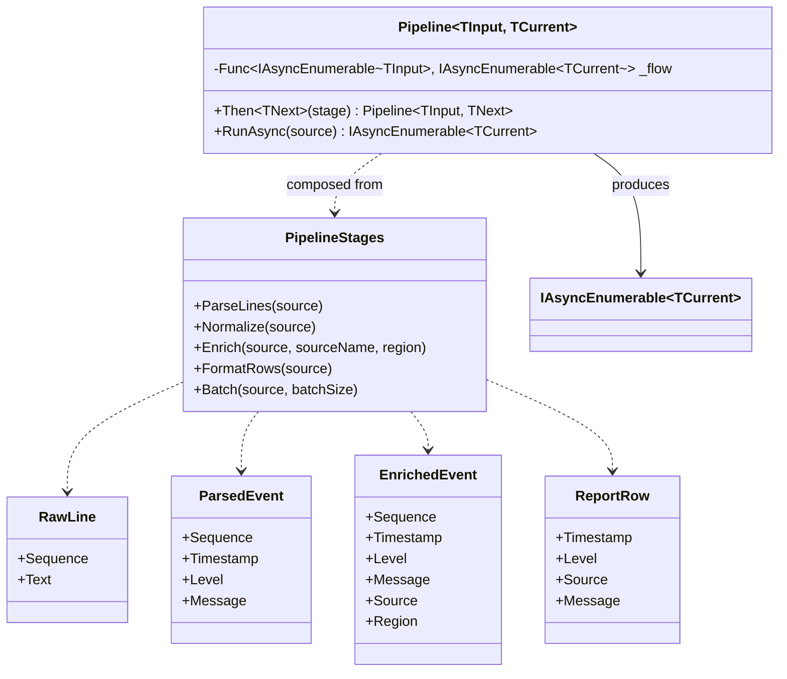
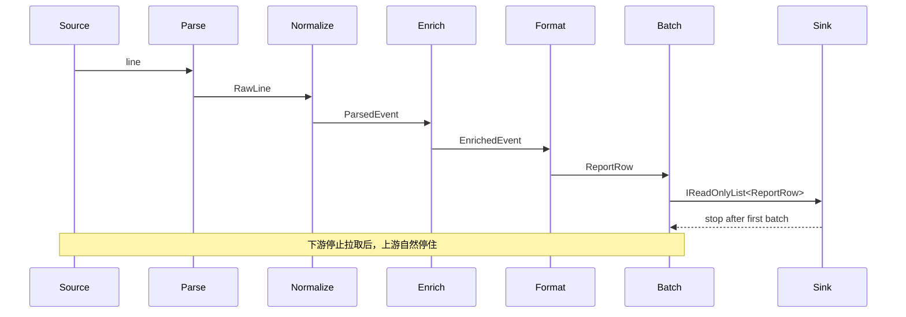

---
date: "2026-04-17"
title: "设计模式教科书｜Pipeline / Pipes and Filters：让数据按阶段流动"
description: "Pipeline / Pipes and Filters 解决的不是“把步骤排成一列”这么简单，而是把数据处理拆成一组契约清晰、边界隔离、可组合的阶段。它适合流式转换、编译 pass、ETL、middleware 和 build graph 的线性或近线性处理。"
slug: "patterns-24-pipeline"
weight: 924
tags:
  - 设计模式
  - Pipeline
  - Pipes and Filters
  - 软件工程
series: "设计模式教科书"
---

> 一句话定义：Pipeline 把输入数据拆成一段段可替换的过滤器，让每一段只关心自己的输入、输出和局部规则。

## 历史背景

Pipeline 不是从设计模式书里长出来的，它先活在操作系统、编译器和批处理系统里。Unix 把标准输入、标准输出和重定向串起来以后，`grep | sort | uniq` 这一类命令就把“数据流经多个工具”变成了日常语法。这个时代的关键发现很简单：**工具不要彼此知道太多，只要统一约定输入和输出就能串起来**。

编译器把这个思想推进了一步。词法分析、语法分析、语义检查、优化、代码生成，本来就是一组顺序变换。它们并不要求所有步骤共享一个大对象，而是要求每一步把自己的结果交给下一步。到了 ETL、日志清洗、消息处理和 web middleware，Pipeline 的价值就更明显了：数据从外部进来，经过一串阶段，最终变成目标形态。它看的不是“谁来接手请求”，而是“这份数据在每一段要变成什么”。

现代构建系统也把这条路走得更远。Make、Ninja、Bazel 这些系统开始把任务组织成图，但它们和 Pipeline 仍然有亲缘关系：线性流负责把单条数据或单个请求变换到底，DAG 负责调度一批有依赖的构建节点。两者的分界很重要。**Pipeline 是数据流，DAG 是任务依赖图。**

## 一、先看问题

很多系统一开始都会把处理逻辑写成一个大方法。  
输入来了以后，解析、校验、清洗、补全、聚合、导出全都塞在一起。  
短期看没问题，长期看就会变成“哪里坏了都要进大方法里找”。

坏代码长这样：

```csharp
using System;
using System.Collections.Generic;
using System.Globalization;
using System.Linq;

public sealed record RawLine(string Text);
public sealed record NormalizedRecord(DateTimeOffset Timestamp, string Level, string Message);
public sealed record EnrichedRecord(DateTimeOffset Timestamp, string Level, string Message, string Source, string Region);
public sealed record ReportRow(string Timestamp, string Level, string Source, string Message);

public sealed class MonolithicLogProcessor
{
    public IReadOnlyList<ReportRow> Process(IEnumerable<string> lines)
    {
        var result = new List<ReportRow>();

        foreach (var line in lines)
        {
            if (string.IsNullOrWhiteSpace(line))
            {
                continue;
            }

            var parts = line.Split('|', 3);
            if (parts.Length != 3)
            {
                throw new FormatException($"无法解析日志行：{line}");
            }

            var timestamp = DateTimeOffset.Parse(parts[0], CultureInfo.InvariantCulture);
            var level = parts[1].Trim().ToUpperInvariant();
            var message = parts[2].Trim();

            if (level == "DEBUG")
            {
                continue;
            }

            var enriched = new EnrichedRecord(timestamp, level, message, "billing-api", "cn-north-1");
            result.Add(new ReportRow(enriched.Timestamp.ToString("O"), enriched.Level, enriched.Source, enriched.Message));
        }

        return result;
    }
}
```

这段代码能跑，但它把四件事缠在了一起。

- 数据格式和业务规则混在一起。
- 任何一步改动，整条逻辑都要重新审。
- 没有阶段边界，测试只能测整个大函数。
- 想做批处理、限流、缓存、异步，都很难插进去。

更麻烦的是，调用方已经看不出“这条处理链到底期待什么输入、产出什么输出”。  
如果一个方法里既有解析、又有清洗、又有补全、又有导出，你很难把它当成可组合的模块。  
这时要改的不是“把代码拆文件”，而是把数据处理变成一条契约清晰的管道。

## 二、模式的解法

Pipeline 的核心不是“线性串起来”，而是“每个阶段都只认自己的输入和输出”。  
阶段之间通过数据契约连接，而不是通过彼此的内部实现连接。  
如果上一段输出的形状变了，下一段只需要重新适配契约，不需要知道上一段内部怎么做。

这份纯 C# 代码演示一个日志处理管线。它用 `IAsyncEnumerable<T>` 表达流式输入，用一组阶段把原始文本变成报表行。`Batch` 阶段负责缓冲，既能提升吞吐量，也能显式展示延迟与背压的关系。

```csharp
using System;
using System.Collections.Generic;
using System.Globalization;
using System.Runtime.CompilerServices;
using System.Threading;
using System.Threading.Tasks;

public sealed record RawLine(int Sequence, string Text);
public sealed record ParsedEvent(int Sequence, DateTimeOffset Timestamp, string Level, string Message);
public sealed record EnrichedEvent(int Sequence, DateTimeOffset Timestamp, string Level, string Message, string Source, string Region);
public sealed record ReportRow(string Timestamp, string Level, string Source, string Message);

public sealed class Pipeline<TInput, TCurrent>
{
    private readonly Func<IAsyncEnumerable<TInput>, IAsyncEnumerable<TCurrent>> _flow;

    public Pipeline(Func<IAsyncEnumerable<TInput>, IAsyncEnumerable<TCurrent>> flow)
    {
        _flow = flow ?? throw new ArgumentNullException(nameof(flow));
    }

    public Pipeline<TInput, TNext> Then<TNext>(Func<IAsyncEnumerable<TCurrent>, IAsyncEnumerable<TNext>> stage)
    {
        if (stage is null) throw new ArgumentNullException(nameof(stage));
        return new Pipeline<TInput, TNext>(source => stage(_flow(source)));
    }

    public IAsyncEnumerable<TCurrent> RunAsync(IAsyncEnumerable<TInput> source) => _flow(source);
}

public static class PipelineStages
{
    public static async IAsyncEnumerable<RawLine> ParseLines(
        IAsyncEnumerable<string> source,
        [EnumeratorCancellation] CancellationToken cancellationToken = default)
    {
        var sequence = 0;

        await foreach (var line in source.WithCancellation(cancellationToken))
        {
            if (string.IsNullOrWhiteSpace(line))
            {
                continue;
            }

            yield return new RawLine(++sequence, line.Trim());
        }
    }

    public static async IAsyncEnumerable<ParsedEvent> Normalize(
        IAsyncEnumerable<RawLine> source,
        [EnumeratorCancellation] CancellationToken cancellationToken = default)
    {
        await foreach (var line in source.WithCancellation(cancellationToken))
        {
            var parts = line.Text.Split('|', 3);
            if (parts.Length != 3)
            {
                throw new FormatException($"无法解析日志行：{line.Text}");
            }

            var timestamp = DateTimeOffset.Parse(parts[0], CultureInfo.InvariantCulture, DateTimeStyles.AssumeUniversal | DateTimeStyles.AdjustToUniversal);
            var level = parts[1].Trim().ToUpperInvariant();
            var message = parts[2].Trim();

            if (level == "DEBUG")
            {
                continue;
            }

            yield return new ParsedEvent(line.Sequence, timestamp, level, message);
        }
    }

    public static async IAsyncEnumerable<EnrichedEvent> Enrich(
        IAsyncEnumerable<ParsedEvent> source,
        string sourceName,
        string region,
        [EnumeratorCancellation] CancellationToken cancellationToken = default)
    {
        await foreach (var item in source.WithCancellation(cancellationToken))
        {
            yield return new EnrichedEvent(item.Sequence, item.Timestamp, item.Level, item.Message, sourceName, region);
        }
    }

    public static async IAsyncEnumerable<ReportRow> FormatRows(
        IAsyncEnumerable<EnrichedEvent> source,
        [EnumeratorCancellation] CancellationToken cancellationToken = default)
    {
        await foreach (var item in source.WithCancellation(cancellationToken))
        {
            yield return new ReportRow(item.Timestamp.ToString("O"), item.Level, item.Source, item.Message);
        }
    }

    public static async IAsyncEnumerable<IReadOnlyList<T>> Batch<T>(
        IAsyncEnumerable<T> source,
        int batchSize,
        [EnumeratorCancellation] CancellationToken cancellationToken = default)
    {
        if (batchSize <= 0)
        {
            throw new ArgumentOutOfRangeException(nameof(batchSize));
        }

        var buffer = new List<T>(batchSize);

        await foreach (var item in source.WithCancellation(cancellationToken))
        {
            buffer.Add(item);
            if (buffer.Count < batchSize)
            {
                continue;
            }

            yield return buffer.ToArray();
            buffer = new List<T>(batchSize);
        }

        if (buffer.Count > 0)
        {
            yield return buffer.ToArray();
        }
    }
}

public static class Program
{
    public static async Task Main()
    {
        var pipeline = new Pipeline<string, string>(source => source)
            .Then(PipelineStages.ParseLines)
            .Then(PipelineStages.Normalize)
            .Then(events => PipelineStages.Enrich(events, "billing-api", "cn-north-1"))
            .Then(PipelineStages.FormatRows)
            .Then(rows => PipelineStages.Batch(rows, 2));

        var source = SourceAsync();
        var batchIndex = 0;

        await foreach (var batch in pipeline.RunAsync(source))
        {
            Console.WriteLine($"Batch #{++batchIndex}, count = {batch.Count}");
            foreach (var row in batch)
            {
                Console.WriteLine($"{row.Timestamp} | {row.Level} | {row.Source} | {row.Message}");
            }

            if (batchIndex == 1)
            {
                break;
            }
        }
    }

    private static async IAsyncEnumerable<string> SourceAsync()
    {
        var lines = new[]
        {
            "2026-04-17T00:00:01Z|info|job started",
            "2026-04-17T00:00:02Z|debug|this line will be filtered",
            "2026-04-17T00:00:03Z|warn|slow query detected",
            "2026-04-17T00:00:04Z|info|job finished"
        };

        foreach (var line in lines)
        {
            await Task.Yield();
            yield return line;
        }
    }
}
```

这段代码强调了几件事。

第一，**数据契约**是管线的骨架。  
`ParseLines` 只认原始文本，`Normalize` 只认解析后的结构，`Enrich` 只认标准化事件，`FormatRows` 只认富化后的事件。  
阶段彼此不碰内部状态，只交换明确的输入输出。

第二，**阶段隔离**让每一步都可替换。  
你可以只替换 `Normalize`，把时间格式换成别的，或者只替换 `Enrich`，从配置中心补字段，而不动其他阶段。  
这就是管线比“一个大方法”更稳的原因。

第三，**背压和缓冲**决定了吞吐量与延迟的平衡。  
`IAsyncEnumerable<T>` 是典型的拉模型：下游不再继续 `await foreach`，上游就不会继续推进。  
`Batch(2)` 用缓冲换吞吐量，把多个小元素拼成一批再送给下游；代价是第一条结果要等满一批，延迟会上升。

Pipeline 不是单纯把步骤排成直线，而是把“谁先产生、谁后消费、什么时候停、要不要缓冲”这些问题写成结构。  
没有这些，只有顺序，没有管线。

## 三、结构图



这张图表达的不是“对象很多”，而是“每个阶段都有明确的输入和输出类型”。  
这就是 Pipeline 与普通调用链最大的区别。

## 四、时序图



这个时序图里最关键的不是“调用顺序”，而是“消费控制生产”。  
当下游不再拉取时，上游就不会继续产生数据，这就是拉模型管线最朴素的背压。

## 五、变体与兄弟模式

Pipeline 的常见变体有四类。

- **线性管线**：阶段按固定顺序串联，最接近 Unix pipes。
- **分批管线**：把元素聚成批次再下送，常见于 ETL、导出和批处理。
- **分支管线**：某个阶段之后分流到多个后续阶段，常见于编译器和分析器。
- **有状态管线**：阶段内部保留窗口、缓存、去重集合或聚合状态，常见于流处理。

它最容易和四个模式混淆。

- **Chain of Responsibility**：Chain 关心谁接手请求，Pipeline 关心数据如何经过阶段变化；Chain 允许短路接手，Pipeline 更强调每段转换的契约。
- **Decorator**：Decorator 保持接口不变，只是给同一个对象加壳；Pipeline 经过每一段后，数据形状可以变，语义也可以变。
- **Mediator**：Mediator 管对象之间怎么协作，Pipeline 管数据如何按阶段流动。
- **Batch job DAG**：DAG 是依赖图，Pipeline 是流动链；DAG 可以分叉、汇合、并行调度，Pipeline 更强调连续变换。

一句话分清：Decorator 是围着一个对象转，Chain 是沿着请求找接手者，Pipeline 是让数据按合同过关，DAG 是让任务按依赖调度。

## 六、对比其他模式

| 维度 | Pipeline | Chain of Responsibility | Decorator | Batch job DAG |
|---|---|---|---|---|
| 核心目标 | 逐阶段变换数据 | 逐层寻找处理者 | 给同一对象加职责 | 按依赖调度任务 |
| 数据契约 | 每段输入输出可不同，但要明确 | 通常请求类型基本一致 | 接口保持一致 | 任务/产物依赖明确 |
| 是否允许短路 | 可能，但不是重点 | 很常见 | 不关心 | 由依赖和失败决定 |
| 是否强调缓冲 | 是 | 不一定 | 不一定 | 常见，但用于调度不是流式消费 |
| 典型场景 | ETL、编译 pass、middleware、流处理 | 审批、认证、拦截 | 日志包装、缓存装饰、权限增强 | 构建系统、任务编排、数据作业调度 |

Pipeline 和 Chain 的边界最容易被说糊。  
如果你想的是“这条数据会经过哪几段变换”，那是 Pipeline。  
如果你想的是“这个请求谁来处理，或者要不要继续往下传”，那是 Chain of Responsibility。

Pipeline 和 Decorator 也不能混。  
Decorator 改的是对象行为，Pipeline 改的是数据形态。  
Decorator 的每一层都要像原对象；Pipeline 的每一层可以生成新的中间表示。

Pipeline 和 batch job DAG 的差异更大。  
DAG 解决的是任务依赖和并行调度，不是单条数据的连续流动。  
一旦出现分支、合并和多个终点，已经更像 DAG，不再是传统意义上的 pipes and filters。

## 七、批判性讨论

Pipeline 的最大风险，是把“顺序”误当成“架构”。  
很多团队只是把原来一个方法拆成多个方法，调用顺序没变，数据契约没变，阶段隔离也没变，却把它叫成 pipeline。  
这不算模式，只算拆文件。

第二个问题是阶段边界很容易失控。  
如果某一段开始偷偷读上游内部字段、写全局状态、顺手发网络请求，管线就会从可组合变成隐式耦合。  
好的管线应该能被替换、被测试、被串接，而不是每段都带着整个系统的副作用。

第三个问题是缓冲会改变语义。  
批量处理提升吞吐量，但会增加首结果延迟；窗口聚合会提升聚合效率，但会引入时间边界；重试会提升成功率，但会增加重复写入风险。  
你不能只看“跑得快”，还得看“结果什么时候出来、能不能重复、失败怎么回滚”。

现代语言和库确实让 Pipeline 更容易写。  
`IAsyncEnumerable<T>`、`await foreach`、LINQ、Channels、Dataflow、反应式库都在降低实现门槛。  
但门槛降低不等于语义自动成立。  
如果没有明确的输入输出合同、缓冲策略和失败边界，所谓 pipeline 很容易退化成一串漂亮但脆弱的函数调用。

## 八、跨学科视角

Unix pipes 是最早的成功样板。  
它们让一个工具的输出直接成为另一个工具的输入，统一了命令行中的流式计算。  
这种“数据自己往前走”的思想，直接影响了后来的 shell、日志工具和流处理框架。

编译器 pass 是更严格的版本。  
LLVM 的新 pass manager 明确把优化流程组织成一个 pipeline，`PassBuilder::buildPerModuleDefaultPipeline()` 就是典型入口。  
每个 pass 只负责特定 IR 层级上的变换，分析结果还能被缓存和失效管理。  
这说明 pipeline 不只是“顺序执行”，还包括阶段粒度、输入产物和失效边界。

ETL 和 middleware 则把 pipeline 搬进了业务系统。  
ETL 关注数据清洗、标准化、补全和导出；middleware 关注请求、响应和中间横切逻辑。  
它们共同证明：只要系统里的工作能被拆成“输入 -> 处理 -> 输出”，pipeline 就有落点。

Build graph 走的是另一条路。  
Make、Ninja、Bazel 不是单纯串联线性步骤，而是把任务组织成依赖图。  
图里的节点可以并行、可以复用、可以跳过，这比 pipeline 更适合构建系统。  
所以“像流水线”不等于“就是流水线”。

## 九、真实案例

几个真实实现都很稳，而且足够典型。

- Unix pipes 的语义可以直接看 [Linux `pipe(7)` manual](https://man7.org/linux/man-pages/man7/pipe.7.html) 和 [GNU Bash manual 的 Pipelines 章节](https://www.gnu.org/software/bash/manual/bash.html#Pipelines)。它们把“一个进程的标准输出接到另一个进程的标准输入”定义成了最小流式管线。  
- ASP.NET Core 的 [Middleware 文档](https://learn.microsoft.com/en-us/aspnet/core/fundamentals/middleware/?view=aspnetcore-10.0) 明确说明每个组件都可以决定是否把请求传给下一个组件，并且可以在前后执行工作。源码里可以看 [RequestDelegate.cs](https://github.com/dotnet/aspnetcore/blob/main/src/Http/Http.Abstractions/src/RequestDelegate.cs) 和 [UseMiddlewareExtensions.cs](https://github.com/dotnet/aspnetcore/blob/main/src/Http/Http.Extensions/src/UseMiddlewareExtensions.cs)。
- LLVM 的 [Using the New Pass Manager](https://llvm.org/docs/NewPassManager.html) 说明了默认优化 pipeline 的构建方式；对应源码可看 [llvm/lib/Passes/PassBuilderPipelines.cpp](https://github.com/llvm/llvm-project/blob/main/llvm/lib/Passes/PassBuilderPipelines.cpp) 和 [llvm/lib/Passes/PassBuilder.cpp](https://github.com/llvm/llvm-project/blob/main/llvm/lib/Passes/PassBuilder.cpp)。
- NGINX 的 [Development guide](https://nginx.org/en/docs/dev/development_guide.html) 和 [How nginx processes a request](https://nginx.org/en/docs/http/request_processing.html) 说明了它如何按阶段处理请求；源码层面可以看 [src/http/ngx_http_core_module.c](https://github.com/nginx/nginx/blob/master/src/http/ngx_http_core_module.c) 以及相关的阶段处理逻辑。
- Kafka Streams 的 [Core Concepts](https://kafka.apache.org/25/streams/core-concepts/) 把 processor topology 讲得很清楚：节点通过 streams 连接，形成一个流处理拓扑；这更接近“带状态的流式 pipeline”，而不是单纯的请求链。

这几个案例从不同领域说明了一件事。  
只要系统处理的是连续流、阶段变换和缓冲控制，Pipeline 就会自然出现。  
形式可能不同，核心合同却很一致：前一段产出，后一段消费。

## 十、常见坑

第一个坑是阶段太胖。  
一个 stage 里既做解析、又做校验、又做补全、又做持久化，最后还要打日志。  
这样虽然也叫 pipeline，但每段都失去了独立性。

第二个坑是契约漂移。  
上一段输出的字段越来越多，下一段又偷偷依赖了这些字段中的一部分，久而久之阶段边界就不清了。  
要避免这种情况，最好把每段的输入输出类型写得尽量明确，别让中间态变成“共享大对象”。

第三个坑是把缓冲当优化万能药。  
缓存和批处理能提高吞吐量，但也会引入延迟、内存占用和失败重放问题。  
如果目标是低延迟响应，过大的批次会让系统变慢而不是变快。

第四个坑是把 pipeline 写成隐式控制流。  
某些阶段偷偷吞异常、重试、跳过数据，调用方却完全不知道。  
真正好的 pipeline，应该能清楚说明：何时停、何时继续、何时重试、何时回滚。

## 十一、性能考量

Pipeline 的性能讨论，不能只看“是不是多了几层函数调用”。  
它真正影响的是三个维度：吞吐量、延迟和内存。

- **吞吐量**：批处理和缓冲可以减少每条记录的调度成本，提高单位时间处理量。
- **延迟**：阶段越多、缓冲越大，第一条结果越晚出来。
- **内存**：每一层缓冲都要占内存，DAG 或分支管线的队列尤其要小心。

从复杂度上看，线性管线的单条数据处理通常还是 `O(n)`，其中 `n` 是阶段数。  
如果引入批次，单条记录的均摊开销可能下降，但首结果延迟会上升。  
如果引入分支和合流，调度复杂度又会进一步增加。

`IAsyncEnumerable<T>` 这种拉模型在很多场景里非常适合。  
它天然形成背压：下游不拉，上游就不推。  
如果你的任务是日志消费、报告生成、逐条变换、分页导出，这种模型通常比先全量物化更稳。

但如果你的任务是高并发、强并行、多个分支共享计算，单纯的线性管线就不够了。  
这时更该看的是分区、并行度、队列深度和状态管理，而不是“再加一个 stage”。

## 十二、何时用 / 何时不用

适合用：

- 输入是连续流，输出也是连续流或按批输出。
- 每一步都能写成稳定的输入/输出契约。
- 你需要在阶段之间插入过滤、批处理、补全、聚合、限流或格式转换。

不适合用：

- 处理本质上是一个单一对象的协作，不是数据流。
- 你需要的是“谁来接手请求”，不是“数据如何变换”。
- 任务之间依赖太复杂，明显需要 DAG 调度而不是线性管线。

一句话判断：**如果你在问“这份数据下一步变成什么”，看 Pipeline；如果你在问“谁来处理这个请求”，看 Chain of Responsibility；如果你在问“怎么给同一个对象加壳”，看 Decorator；如果你在问“任务之间谁依赖谁”，看 DAG。**

## 十三、相关模式

- [Chain of Responsibility](./patterns-08-chain-of-responsibility.md)：Chain 处理“谁接手请求”，Pipeline 处理“数据如何流经阶段”。
- [Decorator](./patterns-10-decorator.md)：Decorator 保持接口不变，Pipeline 允许中间结果换形。
- [Render Pipeline](./patterns-41-render-pipeline.md)：后续渲染管线会在图形管线里复用同样的阶段、缓冲和吞吐/延迟权衡。

## 十四、在实际工程里怎么用

工程里最常见的落点有四类。

- 数据清洗：日志、埋点、审计、报表、导出，都适合拆成 parse / normalize / enrich / export 四段。未来应用线可展开到 [日志管线占位](../../engine-toolchain/backend/log-pipeline.md)。
- Web 请求处理：认证、压缩、缓存、限流、响应包装，常常就是 middleware pipeline。未来应用线可展开到 [HTTP 中间件占位](../../engine-toolchain/backend/http-middleware-pipeline.md)。
- 编译与脚本：词法、语法、语义、优化、生成，天然是 pass pipeline。未来应用线可展开到 [编译 pass 占位](../../engine-toolchain/compiler/pass-pipeline.md)。
- 构建系统：当你处理的是单个 artifact 的连续变换时，可以写成线性管线；当你处理的是一组 artifact 的依赖关系时，就要切到 build graph。未来应用线可展开到 [构建图占位](../../engine-toolchain/build-system/build-graph.md)。

Pipeline 的真正价值，不是“看起来像工程化”，而是把流式处理里最难说清的事情说清楚：输入是什么、输出是什么、每段为什么独立、哪里会缓冲、哪里会变慢、哪里会短路。

## 小结

- Pipeline 的本质不是“按顺序写函数”，而是让数据以明确的契约经过多个隔离阶段。
- 它最适合流式转换、编译 pass、ETL、middleware 和需要缓冲/背压控制的处理链。
- 它和 Chain、Decorator、DAG 都像“串起来”，但目标完全不同，不能混用。

一句话总括：Pipeline 的价值，不是把流程排成线，而是把数据变换、阶段边界和流控策略组织成一个可以扩展的系统。
