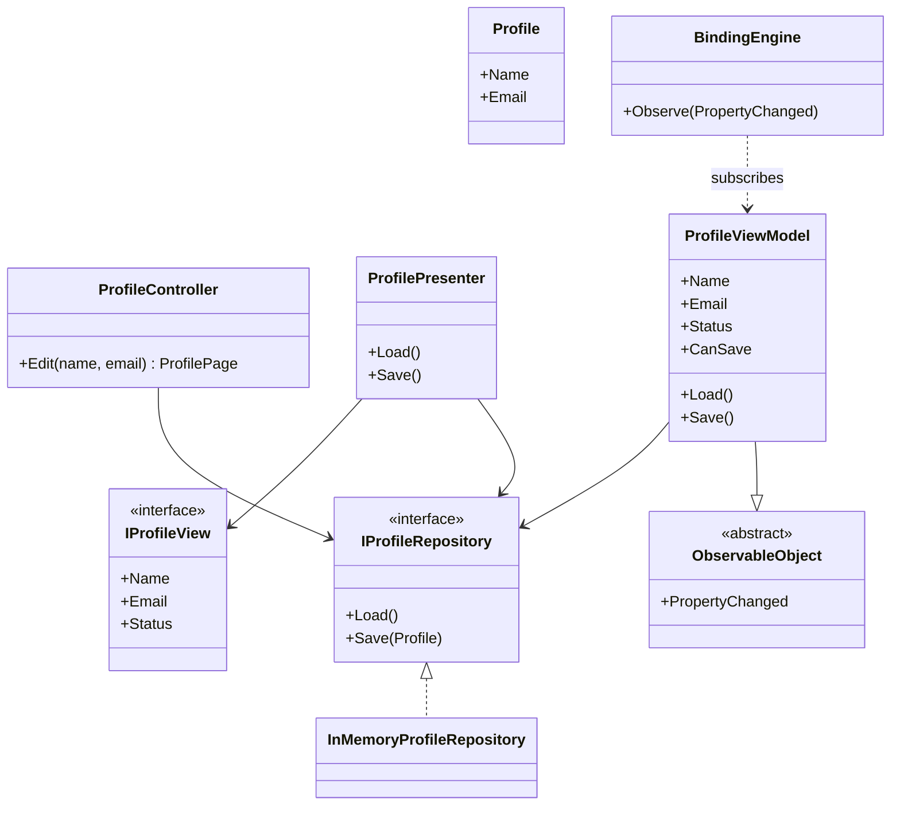
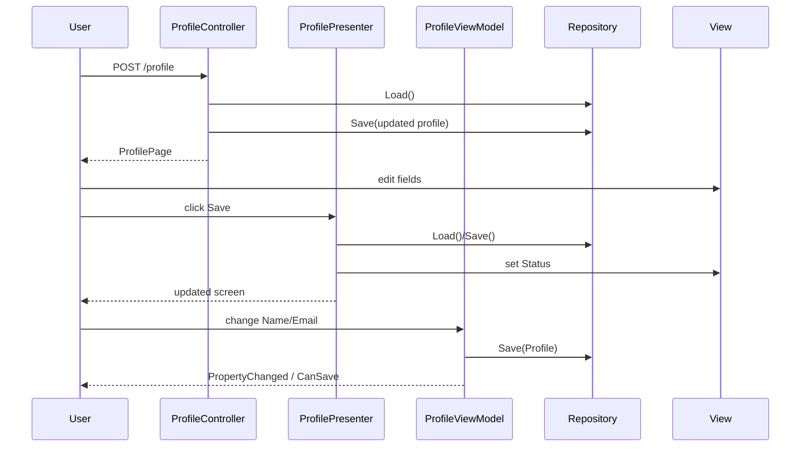

---
date: "2026-04-17"
title: "设计模式教科书｜MVC / MVP / MVVM 对比：别把三种分层当成换个名字"
description: "MVC、MVP 和 MVVM 不是同义词。它们真正分开的，是测试边界、状态归属、数据绑定能力，以及谁来承担 UI 同步的复杂度。本文从 Smalltalk MVC、Passive View、Presentation Model 到现代 React、Elm、Redux、SwiftUI 讲清这条演化线。"
slug: "patterns-25-mvc-mvp-mvvm"
weight: 925
tags:
  - "设计模式"
  - "MVC"
  - "MVP"
  - "MVVM"
  - "软件工程"
series: "设计模式教科书"
---

> 一句话定义：MVC、MVP、MVVM 都是在切分 UI 复杂度，但它们切开的不是“名字”，而是输入从哪来、状态放哪、测试边界画在哪。

## 历史背景
MVC 最早来自 Smalltalk 时代。Trygve Reenskaug 在 1970 年代末提出这套分工，核心不是“把三层摆整齐”，而是让界面、领域和交互各自承担不同责任。后来这个名字被广泛借用，但实现方式已经分叉：有的框架把 Controller 做成请求路由器，有的把 ViewModel 做成绑定容器，有的把 Presenter 变成同步器。

到了 1990 年代，GUI 开始从“绘制控件”走向“管理表单状态”。这时 Passive View、Presentation Model、MVP 这类写法开始流行。它们的共同点很直接：把 UI 测试从真正的控件里拉出来，让逻辑可以在没有窗口系统的情况下跑起来。Martin Fowler 后来把这些差异整理成体系，尤其把 Presentation Model 和 Passive View 讲得很清楚。

MVVM 则是在 WPF 时代真正站稳脚的。它不是为了再发明一层名字，而是因为数据绑定、依赖属性、`INotifyPropertyChanged` 让“把状态放进可绑定对象”变得现实。换句话说，MVC 是交互分工，MVP 是测试驱动的分离，MVVM 是绑定驱动的投影。

## 一、先看问题
先看一个常见的表单编辑页。页面要展示用户资料，要支持输入、校验、保存，还要在保存后刷新状态。很多项目一开始会把这些逻辑全写在视图里：控件事件处理、字段校验、仓储访问、提示文案，一股脑塞进 code-behind 或页面脚本。

这类代码短期能跑，长期就会把 UI 层变成“半个应用”。问题不在于行数多，而在于三件事纠缠在一起：一是界面状态，二是业务状态，三是交互流程。你想改校验规则，得先理解控件事件；你想改布局，可能把保存流程也碰坏了；你想测保存逻辑，只能启动窗口。

下面这段坏代码故意写得直白。它能工作，但已经把所有坏味道都露出来了：

```csharp
using System;

public sealed record Profile(string Name, string Email);

public sealed class LegacyProfileScreen
{
    private readonly ProfileRepository _repository = new(new Profile("Ada", "ada@example.com"));
    private string _nameText = string.Empty;
    private string _emailText = string.Empty;
    private string _statusText = string.Empty;

    public void Load()
    {
        var profile = _repository.Load();
        _nameText = profile.Name;
        _emailText = profile.Email;
        _statusText = "Loaded";
    }

    public void OnSaveClicked()
    {
        if (string.IsNullOrWhiteSpace(_nameText))
        {
            _statusText = "Name is required";
            return;
        }

        if (!_emailText.Contains("@", StringComparison.Ordinal))
        {
            _statusText = "Email is invalid";
            return;
        }

        _repository.Save(new Profile(_nameText.Trim(), _emailText.Trim()));
        _statusText = "Saved";
    }

    public void OnNameChanged(string value) => _nameText = value;
    public void OnEmailChanged(string value) => _emailText = value;

    public override string ToString() => $"Name={_nameText}; Email={_emailText}; Status={_statusText}";
}

public sealed class ProfileRepository
{
    private Profile _profile;

    public ProfileRepository(Profile seed) => _profile = seed;
    public Profile Load() => _profile;
    public void Save(Profile profile) => _profile = profile;
}
```

问题有三个。

第一，状态不清。UI 文本、验证状态、领域数据全挤在一起，后来你根本说不清“谁是事实来源”。

第二，测试边界消失。你要测输入校验，得先伪造控件；你要测保存流程，得把页面事件也带上。

第三，扩展成本很高。再加一个“保存后自动加载头像”或者“草稿恢复”，你就会把同一个类继续撑胖。

MVC、MVP、MVVM 的价值，就是把这团线拆开。

## 二、模式的解法
这三种模式的区别，不在于谁更“高级”，而在于谁拥有什么。

MVC 把用户输入交给 Controller，把展示交给 View，把业务数据留给 Model。它最强调的是职责边界。MVC 里的 Controller 不一定写业务，它更像一个请求协调者：接收输入、调用模型、选择视图、返回结果。

MVP 里的 Presenter 更进一步。它不只协调，还负责把 Model 投影成 View 能直接显示的状态。Passive View 变体甚至要求 View 尽量“笨”，把同步逻辑全部交给 Presenter，这样测试 Presenter 时不需要真正启动 UI。

MVVM 解决的是另一类问题：如果框架有强绑定能力，就别手工把每个控件都同步一遍。ViewModel 持有界面状态和交互命令，View 只负责投影。绑定引擎接管属性变化通知，减少手工胶水。

下面给出一个纯 C# 的参考实现。它不是为了模拟真实 UI 框架，而是为了把三种边界放在同一个例子里：MVC 负责请求/结果，MVP 负责视图同步，MVVM 负责可绑定状态。

```csharp
using System;
using System.Collections.Generic;
using System.ComponentModel;
using System.Runtime.CompilerServices;

public sealed record Profile(string Name, string Email);
public sealed record ProfilePage(string Name, string Email, string Status);

public interface IProfileRepository
{
    Profile Load();
    void Save(Profile profile);
}

public sealed class InMemoryProfileRepository : IProfileRepository
{
    private Profile _profile;

    public InMemoryProfileRepository(Profile seed) => _profile = seed;
    public Profile Load() => _profile;
    public void Save(Profile profile) => _profile = profile;
}

public sealed class ProfileController
{
    private readonly IProfileRepository _repository;

    public ProfileController(IProfileRepository repository) => _repository = repository;

    public ProfilePage Edit(string submittedName, string submittedEmail)
    {
        var current = _repository.Load();
        var name = Normalize(submittedName, current.Name);
        var email = Normalize(submittedEmail, current.Email);

        if (!IsValidEmail(email))
        {
            return new ProfilePage(current.Name, current.Email, "Email is invalid (MVC)");
        }

        var updated = current with { Name = name, Email = email };
        _repository.Save(updated);
        return new ProfilePage(updated.Name, updated.Email, "Saved via MVC");
    }

    private static string Normalize(string? input, string fallback)
        => string.IsNullOrWhiteSpace(input) ? fallback : input.Trim();

    private static bool IsValidEmail(string email)
        => email.Contains("@", StringComparison.Ordinal);
}

public interface IProfileView
{
    string Name { get; set; }
    string Email { get; set; }
    string Status { get; set; }
}

public sealed class ProfilePresenter
{
    private readonly IProfileRepository _repository;
    private readonly IProfileView _view;

    public ProfilePresenter(IProfileRepository repository, IProfileView view)
    {
        _repository = repository;
        _view = view;
    }

    public void Load()
    {
        var profile = _repository.Load();
        _view.Name = profile.Name;
        _view.Email = profile.Email;
        _view.Status = "Loaded via MVP";
    }

    public void Save()
    {
        if (!IsValidEmail(_view.Email))
        {
            _view.Status = "Email is invalid (MVP)";
            return;
        }

        _repository.Save(new Profile(_view.Name.Trim(), _view.Email.Trim()));
        _view.Status = "Saved via MVP";
    }

    private static bool IsValidEmail(string email)
        => email.Contains("@", StringComparison.Ordinal);
}

public sealed class ConsoleProfileView : IProfileView
{
    public string Name { get; set; } = string.Empty;
    public string Email { get; set; } = string.Empty;
    public string Status { get; set; } = string.Empty;

    public override string ToString() => $"Name={Name}; Email={Email}; Status={Status}";
}

public abstract class ObservableObject : INotifyPropertyChanged
{
    public event PropertyChangedEventHandler? PropertyChanged;

    protected bool SetField<T>(ref T field, T value, [CallerMemberName] string? propertyName = null)
    {
        if (EqualityComparer<T>.Default.Equals(field, value))
        {
            return false;
        }

        field = value;
        PropertyChanged?.Invoke(this, new PropertyChangedEventArgs(propertyName));
        return true;
    }

    protected void OnPropertyChanged(string propertyName)
        => PropertyChanged?.Invoke(this, new PropertyChangedEventArgs(propertyName));
}

public sealed class ProfileViewModel : ObservableObject
{
    private readonly IProfileRepository _repository;
    private string _name = string.Empty;
    private string _email = string.Empty;
    private string _status = string.Empty;

    public ProfileViewModel(IProfileRepository repository) => _repository = repository;

    public string Name
    {
        get => _name;
        set
        {
            if (SetField(ref _name, value))
            {
                OnPropertyChanged(nameof(CanSave));
            }
        }
    }

    public string Email
    {
        get => _email;
        set
        {
            if (SetField(ref _email, value))
            {
                OnPropertyChanged(nameof(CanSave));
            }
        }
    }

    public string Status
    {
        get => _status;
        private set => SetField(ref _status, value);
    }

    public bool CanSave => !string.IsNullOrWhiteSpace(Name) && Email.Contains("@", StringComparison.Ordinal);

    public void Load()
    {
        var profile = _repository.Load();
        Name = profile.Name;
        Email = profile.Email;
        Status = "Loaded via MVVM";
    }

    public void Save()
    {
        if (!CanSave)
        {
            Status = "Email is invalid (MVVM)";
            return;
        }

        _repository.Save(new Profile(Name.Trim(), Email.Trim()));
        Status = "Saved via MVVM";
    }
}

public static class Demo
{
    public static void Main()
    {
        var repository = new InMemoryProfileRepository(new Profile("Ada", "ada@example.com"));

        var mvc = new ProfileController(repository);
        var mvcPage = mvc.Edit("Grace Hopper", "grace@example.com");
        Console.WriteLine($"MVC  => {mvcPage}");

        var view = new ConsoleProfileView();
        var presenter = new ProfilePresenter(repository, view);
        presenter.Load();
        Console.WriteLine($"MVP  => {view}");
        view.Name = "Barbara Liskov";
        view.Email = "liskov@example.com";
        presenter.Save();
        Console.WriteLine($"MVP  => {view}");

        var vm = new ProfileViewModel(repository);
        vm.Load();
        Console.WriteLine($"VM   => Name={vm.Name}; Email={vm.Email}; Status={vm.Status}; CanSave={vm.CanSave}");
        vm.Name = "Linus Torvalds";
        vm.Email = "linus@kernel.org";
        vm.Save();
        Console.WriteLine($"VM   => Name={vm.Name}; Email={vm.Email}; Status={vm.Status}; CanSave={vm.CanSave}");
    }
}
```

这段代码刻意把职责拆开。MVC 的入口在 `ProfileController`，MVP 的同步逻辑在 `ProfilePresenter`，MVVM 的状态和命令感放在 `ProfileViewModel`。它们不是三套重复代码，而是三种边界策略。

## 三、结构图


## 四、时序图


## 五、变体与兄弟模式
这条谱系里最容易被混在一起的，不是三个缩写，而是几种变体。

- Smalltalk MVC：更强调观察者式同步，View 和 Model 之间是松耦合的通知关系，Controller 处理输入意图。
- Passive View：把 View 降到几乎没有行为，测试边界最清楚，但同步工作最多。
- Presentation Model：把 UI 状态抽到一个完全独立的对象里，View 只是投影器。
- MVVM：在 Presentation Model 上叠加绑定引擎和命令对象，让框架帮你同步。
- Supervising Controller：介于 Passive View 和 Presentation Model 之间，View 负责一小部分同步，Controller 负责其余。

它们的兄弟模式也很近：

- Observer 决定谁通知谁，MVC/MVVM 决定通知之后谁来同步状态。
- DI 决定依赖怎么拿到，MVC/MVP/MVVM 决定拿到依赖后谁负责 UI 编排。
- Plugin Architecture 常出现在复杂 UI 的扩展点里，但它不定义 UI 状态归属，只定义如何接入功能块。

## 六、对比其他模式
| 维度 | Smalltalk MVC | Passive View / MVP | Presentation Model / MVVM |
|---|---|---|---|
| 测试边界 | Controller 和 Model 易测，View 常偏重集成测 | Presenter 最容易单测，View 可以做假对象 | ViewModel 最容易单测，绑定层通常需要集成测试 |
| 状态归属 | View 与 Model 间通过观察者同步，状态分布更分散 | 大量状态集中到 Presenter，View 尽量被动 | 状态集中到 ViewModel 或 Presentation Model，View 只是投影 |
| 数据绑定 | 传统上不是核心，更多依靠事件和观察者 | 通常手工同步，绑定弱 | 强绑定是核心，特别依赖框架能力 |
| 适合界面 | 交互丰富但结构清晰的经典桌面 UI | 表单多、测试要求高、控件同步繁琐 | XAML、SwiftUI、声明式前端、响应式 UI |
| 常见风险 | 名字被滥用，Controller 变路由器或面包屑 | Presenter 变成“UI 赋值垃圾桶” | ViewModel 膨胀，状态与命令全堆进去 |

把它们当作“命名差异”是误判。真正的分界在三处：谁拥有状态、谁驱动同步、谁是测试重点。

React、Elm、Redux、SwiftUI 之所以常被拿来和 MV* 放在一起，也是因为它们都在解决同一件事：把 UI 变成状态的投影。

- React 走的是组件树和单向数据流。`props` 往下，事件往上。它更像 Presentation Model 的函数式版本，而不是传统 MVC。
- Elm 把 `model -> view -> update` 固定成三段式。`update` 是纯函数，测试边界比多数 MVVM 更硬。
- Redux 把状态放进单一 store，再用 reducer 更新。它不是 UI 架构本身，但它把“状态归属”推得更彻底。
- SwiftUI 用 `@State`、`@Binding`、`Observable` 之类机制把投影和状态绑定得更紧，视觉上很像 MVVM，语义上更偏声明式渲染。

## 七、批判性讨论
MVC 系列最常见的批评是：它太容易被误读。

Smalltalk MVC 里的 Controller、View、Model 关系很讲究，后来在 Web 和桌面框架里却经常被简化成“控制器负责路由，视图负责 HTML，模型负责数据库”。这就让 MVC 失去了原本对界面状态同步的讨论重点，最后变成一张通用架构标签。

Passive View 也不是免费的。它确实让测试边界干净，但代价是同步代码会变多。几十个控件的表单，Presenter 可能会写成一堆 `SetXxx`、`SetYyy`，逻辑不难，但很啰嗦。

MVVM 的批评更现代：绑定太强时，错误会被藏进框架。你看到的是“界面没更新”，而不是“哪一条绑定没生效”。再加上双向绑定和隐式通知，调试时常常要同时理解属性变化、命令可用性和依赖属性链。

还有一个现实问题：不是所有界面都值得上 MVVM。一个只负责展示的页面，强行引入 ViewModel 只会增加层数。模式不是奖章，没必要为“看起来更规范”付结构税。

## 八、跨学科视角
这三种模式背后其实都在做同一件事：把交互拆成“状态”和“更新”。这和函数式编程里的 reducer 很接近。

Elm 和 Redux 把这个思想推得最彻底。`state + message -> new state` 这个模型让 UI 的行为像一个小型状态机，测试时只要喂输入、看输出，就能验证完整行为。MVVM 里的 `ViewModel` 其实也在朝这个方向靠：它接收输入，更新状态，再把状态投影给 View。

从类型理论看，View 更像一个投影函数，ViewModel 更像中间态。它不应当承载领域真相，而应当把领域对象投成当前界面需要的形状。换句话说，ViewModel 是“界面视角的派生数据结构”，不是另一个业务模型。

这也是为什么现代框架更强调单向数据流和不可变状态。它们把“UI 更新”变成一条可追踪的数据路径，而不是到处散落的 setter 调用。

## 九、真实案例
ASP.NET Core MVC 是经典 MVC 的现代落地。官方文档明确说，Controller 接收请求、和 Model 协作、再选择 View 进行渲染。`Views in ASP.NET Core MVC` 文档里也写得很清楚：视图是 HTML/Razor 模板，Controller 通过 `View()` 或 `View(model)` 把模型交出去。源码层面，`Controller.View()` 对应的实现位于 `dotnet/aspnetcore` 里的 `src/Mvc/Mvc.ViewFeatures/src/Controller.cs`。这就是 MVC 的核心职责链。

WPF 则是 MVVM 的土壤。WPF 的 `Data binding overview` 文档说明了 `DataContext`、依赖属性、双向绑定和 `INotifyPropertyChanged` 风格的更新机制。对应源码在 `dotnet/wpf` 仓库里，例如 `src/Microsoft.DotNet.Wpf/src/PresentationFramework/System/Windows/Data/Binding.cs`。WPF 本身没有强行把你推向 MVVM，但它提供的绑定引擎让 MVVM 成为自然选择。

Android 的 `architecture-samples` 和 `architecture-components-samples` 则说明了 MVP/MVVM 为什么在移动端长期存在。前者专门展示不同架构风格，后者则把 `ViewModel`、`LiveData`、`Room`、`Flow` 这些组件组合起来。它们之所以算真实案例，不是因为名字里有 MVP 或 MVVM，而是因为同一个 TODO 场景被拆成了可测的 presentation 层和数据层。

React、Elm 和 SwiftUI 也能算同类案例，但它们代表的是演化后的方向。React 的 `Thinking in React` 教程强调组件分层、状态提升和单向数据流；Elm 的 Architecture 直接把 `Model / View / Update` 固化成三段；SwiftUI 官方文档则直接说它把数据从模型流向视图和控件。它们都说明了一件事：现代 UI 的主线不是“谁叫 MVC”，而是“谁拥有状态、谁负责投影”。

## 十、常见坑
- 把 Controller 当成业务对象。Controller 只该协调，不该吞掉领域规则，否则很快变成神类。
- 把 Presenter 当成 UI 赋值机。Passive View 不是把所有 `Text = ...` 复制一遍，而是把同步逻辑集中后保持可测。
- 把 ViewModel 写成第二个 Model。ViewModel 应该承载界面语义，不该把领域规则重复一遍。
- 把双向绑定当银弹。绑定越多，不代表越优雅；一旦链路长，问题会更隐蔽。
- 把 MVC、MVP、MVVM 当可互换标签。团队如果连状态归属都没说清，换名没用。

## 十一、性能考量
这些模式本身不改变算法复杂度，但会改变“更新成本”的分布。

MVC 往往在请求级别上工作，开销主要在请求路由、视图选择和模型渲染。MVP 和 MVVM 则更偏组件级更新，成本常常落在属性通知和绑定刷新上。

可以用一个简单的复杂度直觉来理解：如果一个表单有 `m` 个可绑定字段，那么一次全量状态刷新通常是 `O(m)`；如果每个字段还有 `k` 个订阅者，通知成本就是 `O(m × k)`。这不是算法灾难，但在大表单里会明显影响体感。

React 和 Redux 的官方文档也反复强调这一点：不要把所有状态都堆到一个极大的树上，也不要让每次输入都触发不必要的整树重渲染。WPF 同样如此，绑定越多，越需要注意虚拟化、批量更新和集合变更通知。

所以性能不是“要不要用 MVVM”的问题，而是“你有没有把状态粒度和订阅粒度设计好”的问题。

## 十二、何时用 / 何时不用
适合用：

- 表单多、交互复杂、验证规则多。
- 需要把 UI 逻辑和领域逻辑分开测试。
- 框架有成熟的数据绑定或命令体系。
- 团队需要让新人快速找到状态和交互的边界。

不适合用：

- 页面只是静态渲染，交互很少。
- 团队没有绑定经验，容易把 ViewModel 写成新一层泥潭。
- 框架对绑定支持弱，手工同步反而更简单。
- 业务本身很薄，强行分层只会制造更多文件。

## 十三、相关模式
- [Observer](./patterns-07-observer.md)
- [DI vs Service Locator](./patterns-27-di-vs-service-locator.md)
- [Plugin Architecture](./patterns-28-plugin-architecture.md)
- [Command](./patterns-06-command.md)
- [Strategy](./patterns-03-strategy.md)

## 十四、在实际工程里怎么用
在实际工程里，MVC 更常见于 Web 请求/响应边界，MVP 常见于需要强测试和弱绑定的桌面或移动 UI，MVVM 则常见于 WPF、Avalonia、XAML 系框架、以及类似 SwiftUI/Compose 这样的声明式界面。

真正要做的是先问三件事：状态放哪、同步谁负责、测试到哪一层。如果这三件事没想清楚，模式名字再漂亮也只是装饰。

教科书线讲原则，应用线才讲框架落地。对应的应用线文章可以放在 `../../ui-architecture/mvc-mvp-mvvm-application.md`。

## 小结
- MVC、MVP、MVVM 不是命名差异，而是状态归属和同步责任的不同分配。
- 这三者越往后，越依赖绑定能力，越适合把 UI 状态变成可测试的投影对象。
- 现代 React、Elm、Redux、SwiftUI 证明了同一思想仍然有效，但实现语义已经明显转向声明式和单向数据流。
