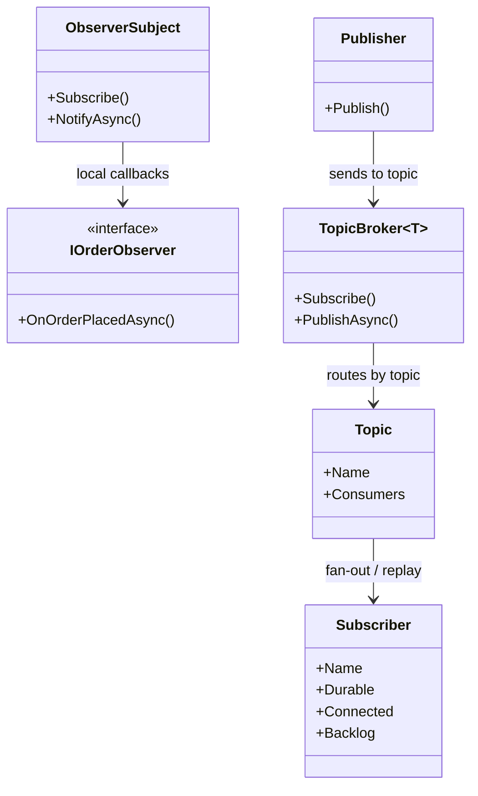
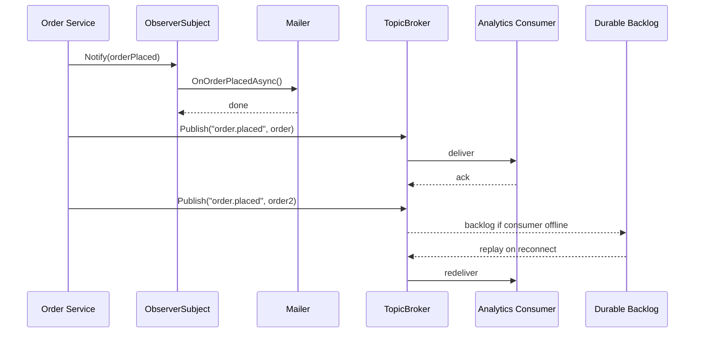

---
date: "2026-04-17"
title: "设计模式教科书｜Pub/Sub vs Observer：通知关系与消息拓扑不是一回事"
description: "Observer 适合进程内对象间的变化通知，Pub/Sub 解决的是通过主题、Broker 和消息语义进行跨进程、可持久化分发的通信问题。两者都像订阅，但边界、可靠性和拓扑完全不同。"
slug: "patterns-26-pub-sub-vs-observer"
weight: 926
tags:
  - "设计模式"
  - "Pub/Sub"
  - "Observer"
  - "消息系统"
  - "软件工程"
series: "设计模式教科书"
---

> 一句话定义：Observer 管的是进程内变化通知，Pub/Sub 管的是通过主题和 Broker 进行的跨边界消息分发。

## 历史背景

Observer 和 Pub/Sub 长得像，历史却不是一条线。Observer 先从 GUI、MVC、Smalltalk 这些对象协作系统里长出来，解决的是“一个对象变了，谁该被通知”。它关心的是同一进程里的对象关系：订阅、回调、解绑、通知顺序。它的目标很局部，但很现实。

Pub/Sub 则来自消息中间件、分布式系统和异步集成。它不是为了让对象之间的回调更优雅，而是为了让发布者和订阅者不必彼此知道对方的地址、生命周期和数量。主题、Broker、消费者组、持久化、重放、重试，这些词说明它关注的是消息拓扑，不是对象方法调用。

这两者后来都被叫成“订阅”，于是很多代码把它们混成一锅。最常见的误解有两个：一是把进程内 Observer 当成分布式消息总线；二是把 Pub/Sub 误写成“更高级的事件回调”。前者会把系统拖进伪分布式，后者会把系统拖进伪异步。真正的区别不在语法，而在边界：Observer 保护的是对象协作，Pub/Sub 保护的是消息路由和可靠性交付。

现代语言把两者的表达都简化了。委托、事件、`IObservable<T>`、消息总线 SDK、Broker API，都能让订阅这件事看起来很轻。可一旦你要回答“这条消息是否能离线保存”“会不会重复投递”“订阅者挂了以后怎么办”“Broker 是否保序”，问题就已经离开 Observer 的舒适区，进入 Pub/Sub 的领域。

## 一、先看问题

先看一个简单但常见的场景：订单支付成功后，要同时通知邮件、积分、审计和分析。很多团队一开始会直接写成硬编码调用。它短、直接、容易看懂，但也最容易长歪。

```csharp
using System;
using System.Collections.Generic;
using System.Threading.Tasks;

public sealed record OrderPlaced(string OrderId, string CustomerId, decimal Amount);

public sealed class DirectCheckoutService
{
    private readonly ReceiptMailer _mailer = new();
    private readonly LoyaltyService _loyalty = new();
    private readonly AuditService _audit = new();
    private readonly AnalyticsService _analytics = new();

    public async ValueTask PlaceOrderAsync(OrderPlaced order)
    {
        await _mailer.SendAsync(order);
        await _loyalty.AddPointsAsync(order.CustomerId, order.Amount);
        await _audit.WriteAsync(order);
        await _analytics.TrackAsync(order);
    }
}

public sealed class ReceiptMailer { public ValueTask SendAsync(OrderPlaced order) => ValueTask.CompletedTask; }
public sealed class LoyaltyService { public ValueTask AddPointsAsync(string customerId, decimal amount) => ValueTask.CompletedTask; }
public sealed class AuditService { public ValueTask WriteAsync(OrderPlaced order) => ValueTask.CompletedTask; }
public sealed class AnalyticsService { public ValueTask TrackAsync(OrderPlaced order) => ValueTask.CompletedTask; }
```

这个写法的问题不是“不能用”，而是它把协作关系写死了。发布者必须知道每一个接收者，也必须知道它们的调用顺序、异常边界和失败策略。下一次你想加一个风控订阅者，或者把分析改成异步落库，发布者就要改。于是“订单完成”这个领域动作，慢慢变成了一堆基础设施调用。

如果你用的是进程内 Observer，调用链至少还能留在同一个对象图里；如果你要跨进程、跨服务、跨节点，直接调用就会开始露馅。邮件服务挂了，订单是不是失败？分析服务慢了，支付接口要不要等待？新接收者上线后，历史消息要不要补？这些问题都不是 Observer 能自然回答的。

更微妙的是，很多团队把“发事件”写成了“同步回调集合”。表面上看起来是发布-订阅，实际上还是一串本地方法调用。它既没有 Broker，也没有 topic，更没有持久化和 delivery semantics。只要订阅者变慢，发布者还是得等；只要进程退出，消息还是会丢。名字换了，结构没换。

## 二、模式的解法

Observer 和 Pub/Sub 解决的是不同层面的耦合。

- **Observer** 处理进程内对象协作。发布者知道订阅者接口，订阅者知道主体对象或事件源。
- **Pub/Sub** 处理通过主题和 Broker 进行的消息分发。发布者只知道 topic，订阅者只表达兴趣，Broker 负责路由、缓冲和投递语义。

下面这段代码把两者放在一起。前半段是进程内 Observer，后半段是一个内存版 topic broker，带有 topic、durable 订阅者和 at-most-once / at-least-once 语义的差别。

```csharp
using System;
using System.Collections.Generic;
using System.Linq;
using System.Threading.Tasks;

public sealed record OrderPlaced(string OrderId, string CustomerId, decimal Amount);

public interface IOrderObserver
{
    ValueTask OnOrderPlacedAsync(OrderPlaced order);
}

public sealed class OrderPlacedSubject
{
    private readonly List<IOrderObserver> _observers = new();
    private readonly object _gate = new();

    public IDisposable Subscribe(IOrderObserver observer)
    {
        if (observer is null) throw new ArgumentNullException(nameof(observer));

        lock (_gate)
        {
            _observers.Add(observer);
        }

        return new DisposableAction(() =>
        {
            lock (_gate)
            {
                _observers.Remove(observer);
            }
        });
    }

    public async ValueTask NotifyAsync(OrderPlaced order)
    {
        IOrderObserver[] snapshot;
        lock (_gate)
        {
            snapshot = _observers.ToArray();
        }

        foreach (var observer in snapshot)
        {
            await observer.OnOrderPlacedAsync(order).ConfigureAwait(false);
        }
    }
}

public enum DeliverySemantics
{
    AtMostOnce,
    AtLeastOnce
}

public sealed class TopicBroker<T>
{
    private sealed class Subscriber
    {
        public required string Name { get; init; }
        public required Func<T, ValueTask> Handler { get; set; }
        public bool Durable { get; set; }
        public bool Connected { get; set; }
        public Queue<T> Backlog { get; } = new();
    }

    private readonly object _gate = new();
    private readonly Dictionary<string, Dictionary<string, Subscriber>> _topics = new();

    public IDisposable Subscribe(string topic, string consumerName, Func<T, ValueTask> handler, bool durable = true)
    {
        if (string.IsNullOrWhiteSpace(topic)) throw new ArgumentException("Topic is required.", nameof(topic));
        if (string.IsNullOrWhiteSpace(consumerName)) throw new ArgumentException("Consumer name is required.", nameof(consumerName));
        if (handler is null) throw new ArgumentNullException(nameof(handler));

        Subscriber? subscriber = null;

        lock (_gate)
        {
            if (!_topics.TryGetValue(topic, out var consumers))
            {
                consumers = new Dictionary<string, Subscriber>(StringComparer.Ordinal);
                _topics.Add(topic, consumers);
            }

            if (!consumers.TryGetValue(consumerName, out subscriber))
            {
                subscriber = new Subscriber
                {
                    Name = consumerName,
                    Durable = durable,
                    Connected = true,
                    Handler = handler
                };
                consumers.Add(consumerName, subscriber);
            }
            else
            {
                subscriber.Handler = handler;
                subscriber.Connected = true;
                subscriber.Durable = durable || subscriber.Durable;
            }
        }

        if (subscriber is { Durable: true })
        {
            var replaySubscriber = subscriber;

            _ = Task.Run(async () =>
            {
                while (true)
                {
                    T item;

                    lock (_gate)
                    {
                        if (!replaySubscriber.Connected || replaySubscriber.Backlog.Count == 0)
                        {
                            return;
                        }

                        item = replaySubscriber.Backlog.Peek();
                    }

                    try
                    {
                        await handler(item).ConfigureAwait(false);
                    }
                    catch
                    {
                        return;
                    }

                    lock (_gate)
                    {
                        if (!replaySubscriber.Connected || replaySubscriber.Backlog.Count == 0)
                        {
                            return;
                        }

                        if (EqualityComparer<T>.Default.Equals(replaySubscriber.Backlog.Peek(), item))
                        {
                            replaySubscriber.Backlog.Dequeue();
                        }
                    }
                }
            });
        }

        return new DisposableAction(() => Disconnect(topic, consumerName));
    }

    public async ValueTask PublishAsync(string topic, T message, DeliverySemantics semantics = DeliverySemantics.AtLeastOnce)
    {
        List<Subscriber> targets;
        lock (_gate)
        {
            if (!_topics.TryGetValue(topic, out var consumers))
            {
                return;
            }

            targets = consumers.Values.ToList();
        }

        foreach (var target in targets)
        {
            if (!target.Connected)
            {
                if (target.Durable && semantics == DeliverySemantics.AtLeastOnce)
                {
                    lock (_gate)
                    {
                        target.Backlog.Enqueue(message);
                    }
                }
                continue;
            }

            try
            {
                await target.Handler(message).ConfigureAwait(false);
            }
            catch
            {
                if (target.Durable && semantics == DeliverySemantics.AtLeastOnce)
                {
                    lock (_gate)
                    {
                        target.Backlog.Enqueue(message);
                    }
                }
            }
        }
    }

    private void Disconnect(string topic, string consumerName)
    {
        lock (_gate)
        {
            if (!_topics.TryGetValue(topic, out var consumers))
            {
                return;
            }

            if (!consumers.TryGetValue(consumerName, out var subscriber))
            {
                return;
            }

            if (subscriber.Durable)
            {
                subscriber.Connected = false;
            }
            else
            {
                consumers.Remove(consumerName);
            }
        }
    }
}

public sealed class DisposableAction : IDisposable
{
    private readonly Action _dispose;
    private int _disposed;

    public DisposableAction(Action dispose) => _dispose = dispose;

    public void Dispose()
    {
        if (System.Threading.Interlocked.Exchange(ref _disposed, 1) == 0)
        {
            _dispose();
        }
    }
}

public sealed class ReceiptMailer : IOrderObserver
{
    public ValueTask OnOrderPlacedAsync(OrderPlaced order) => ValueTask.CompletedTask;
}

public sealed class LoyaltyPointsObserver : IOrderObserver
{
    public ValueTask OnOrderPlacedAsync(OrderPlaced order) => ValueTask.CompletedTask;
}

public static class Demo
{
    public static async Task Main()
    {
        var subject = new OrderPlacedSubject();
        using var mailer = subject.Subscribe(new ReceiptMailer());
        using var points = subject.Subscribe(new LoyaltyPointsObserver());
        await subject.NotifyAsync(new OrderPlaced("ORD-1001", "C-18", 199m));

        var broker = new TopicBroker<OrderPlaced>();
        using var analytics = broker.Subscribe("order.placed", "analytics", order =>
        {
            Console.WriteLine($"analytics receives {order.OrderId}");
            return ValueTask.CompletedTask;
        }, durable: true);

        await broker.PublishAsync("order.placed", new OrderPlaced("ORD-1002", "C-19", 299m));
    }
}
```

这段代码故意把边界拆开了。Observer 的发布者只是本地对象，通知是一次方法遍历。Pub/Sub 的发布者只认识 topic，订阅者可以离线、可重连、可持久化。代码里 `Durable` 和 `DeliverySemantics` 说明了两个关键点：消息是否落盘，回放时是否只在成功确认后才出队，以及消息是否可能重复。失败的消息会保留在 backlog 里，等下一次重连再继续尝试。

真正的业务系统里，这两个维度不能省。你一旦把 `Publish` 理解成“把消息发出去”，很容易忽略后续问题：消息是不是会丢，订阅者是不是会重复处理，Broker 里是不是要保留重放游标，是否允许多个消费者组并行消费。同一套“订阅”词汇，背后是完全不同的责任。

## 三、结构图



这张图想强调一件事：Observer 的中心是“对象关系”，Pub/Sub 的中心是“主题和分发”。

- `ObserverSubject` 负责维护本地订阅者列表。
- `TopicBroker<T>` 负责维护 topic、消费者和投递语义。
- `Subscriber` 不只是一个回调，它还可能带着持久化状态和重放位置。

这就是为什么把 Pub/Sub 叫成“分布式 Observer”会误导人。它们共享了“订阅”这个动作，但关注的抽象层次已经完全不同。

## 四、时序图



这条时序线说明了三层语义。

- Observer 是同步或受控异步的本地通知。
- Pub/Sub 的第一层是 topic 分发。
- Durable Pub/Sub 还会把投递进度和失败恢复纳入设计。

如果你把这三层揉成一个名字，最后你会很难判断：到底是对象没通知到，还是 Broker 没送到，还是送到了但重复了。

## 五、变体与兄弟模式

Observer 和 Pub/Sub 都有很多变体，但不要把变体当成同一件事的不同外壳。

- **In-process Observer**：本地对象回调，常见于 GUI、领域事件、状态同步。
- **Event Bus**：看起来像 Observer 的广播版，但通常还带有中介层、过滤和解耦。
- **Message Broker Pub/Sub**：消息经 Broker 按 topic 路由，可能跨进程、跨节点、跨语言。
- **Reactive Stream**：把订阅变成数据流组合，强调操作符、调度和背压。
- **Actor mailbox**：每个 actor 有自己的邮箱，消息是点对点，不是对 topic 的广播。

它们容易混淆的地方在于都说“订阅”。但语义并不一样：

- Observer 关心“谁在关注我”。
- Pub/Sub 关心“谁对这个 topic 有兴趣”。
- Actor 关心“谁拥有这份状态并且按序处理消息”。

## 六、对比其他模式

| 维度 | Observer | Pub/Sub | Event Queue | Actor Model |
|---|---|---|---|---|
| 通信范围 | 进程内 | 进程内 / 跨进程 / 跨节点 | 通常异步队列 | 进程内或分布式 |
| 订阅方式 | 对象实例注册 | 对 topic 声明兴趣 | 消费者取消息 | 发给具体 actor |
| 状态归属 | 发布者对象 | Broker / Consumer | 队列或消费者 | actor 自己 |
| Delivery semantics | 通常无持久化 | at-most-once / at-least-once / 有时可追求 effectively-once | 依实现而定 | mailbox 有序，失败由监督处理 |
| 典型风险 | 内存泄漏、同步阻塞 | 重复投递、重放、顺序与幂等 | 积压、吞吐热点 | 过度抽象、邮箱膨胀 |

差异不在“谁能收到消息”，而在“谁承担消息生命周期”。

- Observer 让主体知道订阅者。
- Pub/Sub 让 Broker 承担路由和可靠性。
- Event Queue 让消息先存下来，再由消费者取走。
- Actor Model 让状态和消息处理合并在同一边界里。

如果一个系统只需要对象级变化传播，Observer 更轻。
如果一个系统需要跨边界路由、消费者组和重试，Pub/Sub 才是正解。

## 七、批判性讨论

Pub/Sub 很容易被神化。

第一，**它会把调用关系变得不透明**。发布者发出去以后，谁真正处理了消息、处理了几次、是否失败，常常不在同一条调用栈上。调试时你会发现，问题从“一个方法崩了”变成“系统某处有一条消息没处理好”。这不是坏事，但它要求你有更强的可观测性。

第二，**它会把一致性变成显式设计问题**。一旦消息跨进程，重复投递、乱序、超时、重试、回放都会出现。你必须把幂等、去重和补偿写进消费者，而不是假设 Broker 会替你变魔术。所谓“至少一次”送达，翻译成人话就是：你大概率会收到重复消息。

第三，**topic 设计一旦粗糙，就会失控**。主题太宽，订阅者全都在吃不该吃的消息；主题太细，路由规则和配置会比业务本身还复杂。topic 命名不是字符串游戏，它就是系统的边界设计。

第四，**把 Observer 包装成 Pub/Sub 并不会自动得到可靠性**。如果没有 Broker、没有持久化、没有重放游标、没有 delivery semantics，你只是给本地回调换了个名字。该丢的消息还是会丢，该阻塞的调用还是会阻塞。

所以这类模式的现代价值，不在于“分发”，而在于“分发时把可靠性和边界一起带上”。Observer 只要本地就够，Pub/Sub 只有在跨边界、跨生命周期、跨节点时才值得付出额外复杂度。

## 八、跨学科视角

从**分布式系统**看，Pub/Sub 是解耦生产者和消费者的核心结构。Broker 负责把“谁发布了消息”从“谁接收了消息”里剥离出来。NATS、Kafka、RabbitMQ、JetStream、MassTransit 都在围绕这件事做工程化。

从**数据库和日志系统**看，durable Pub/Sub 本质上在向事件日志靠近。消息不只是瞬间通知，它还可能是可重放的事实记录。只要消息被落盘，topic 就不再只是广播渠道，而是系统状态演化的一部分。

从**一致性理论**看，delivery semantics 是边界条件。at-most-once 牺牲可靠性换低开销，at-least-once 牺牲重复性换可靠到达，exactly-once 往往只是在局部闭环里成立。系统设计真正要回答的是：重复是否可接受，乱序是否可接受，丢失是否可接受。

从**函数式和响应式编程**看，Observer 是 `IObservable<T>` / `Subscribe` 的自然落点。数据流可以被组合，但它仍然不等于消息中间件。Rx.NET 的价值在于流式编程，不在于 Broker。你把 Rx 当 Kafka 用，最后只会在进程边界上撞墙。

从**Actor Model**看，actor mailbox 其实更像点对点消息传递，不是 topic 广播。actor 可以消费 Pub/Sub 的消息，但 actor 本身不是 Pub/Sub。把这两者分开，才能看清：一个负责状态边界，一个负责消息拓扑。

## 九、真实案例

### 1. NATS

NATS 官方文档把 Pub/Sub 讲得非常直接：publisher 向 subject 发送消息，active subscriber 接收消息；subject 支持通配符；通过 subject-based addressing 还能得到 location transparency。

- Pub/Sub 概览：<https://docs.nats.io/nats-concepts/core-nats/pubsub>
- Subject-based messaging：<https://docs.nats.io/nats-concepts/subjects>
- JetStream durable consumers：<https://docs.nats.io/nats-concepts/jetstream/consumers>
- 协议层 `SUB`：<https://docs.nats.io/reference/reference-protocols/nats-protocol>

NATS 把 topic、订阅和消费者组都做成了基础设施原语。尤其是 JetStream durable consumer，说明“订阅”不只是连接，还包括消费进度的持久化和确认语义。这里的 delivery semantics 不再是口头承诺，而是服务器维护的状态；只有收到确认，游标才会前移。

### 2. MassTransit

MassTransit 的定位就是 .NET 的分布式应用框架，强调 message-based、loosely-coupled、asynchronous communication。它的 publish/subscribe 和 outbox 组合非常适合展示“消息发出”与“可靠交付”之间的关系。

- GitHub 仓库：<https://github.com/MassTransit/MassTransit>
- Sample Outbox：<https://github.com/MassTransit/Sample-Outbox>
- 样例说明：`Sample-Outbox/README.md`

这个样例很重要，因为它告诉你：真正的 Pub/Sub 不只是在代码里调用 `Publish`，还要解决事务边界和消息投递边界。没有 outbox，你就很难把数据库提交和消息发布绑在一起。这个问题不是语法问题，而是可靠性问题。

### 3. Rx.NET

Rx.NET 代表的是进程内的可组合订阅模型。它把 `IObservable<T>` 和 `Subscribe` 做成了流式编程的核心抽象。

- GitHub 仓库：<https://github.com/dotnet/reactive>
- README：`dotnet/reactive/README.md`

Rx 的价值在于把事件流变成可组合查询，而不是把消息发到 Broker。它是 Observer 在语言层的现代表达，也是“订阅”一词最容易和 Pub/Sub 混淆的地方。你把它理解清楚，就能知道什么时候该用流，什么时候该用消息中间件。

## 十、常见坑

- **把 topic 当 queue 用**。topic 是广播或路由维度，queue 是竞争消费维度。两个概念不一样，混了以后你会在吞吐和语义上都吃亏。
- **默认消息一定到达**。没有 durable consumer、没有 outbox、没有重试策略，消息就可能丢。改法是先把 delivery semantics 写明白，再谈代码风格。
- **忽略幂等**。至少一次投递意味着重复很常见。改法是给消费者加业务去重键，或者让处理本身可重复执行。
- **把观察者写成隐式全局总线**。如果所有模块都往一个全局事件中心塞消息，最后谁都不知道消息来自哪儿、去了哪儿。改法是 topic 命名和边界分层。
- **在同进程里过度上 Broker**。如果只是本地对象变化，Broker 反而增加序列化和运维成本。改法是优先 Observer，只有跨边界时再升到 Pub/Sub。

## 十一、性能考量

Observer 的成本主要是本地遍历和回调。它通常是 O(n) fan-out，n 是订阅者数量。它几乎没有序列化、网络和持久化开销，所以适合短路径、低延迟、本地协作。

Pub/Sub 的成本则多得多：topic 匹配、消息序列化、Broker 路由、消费者状态、重试、持久化和回放都要花钱。durable consumer 让可靠性更好，但也会提高延迟和存储成本。at-least-once 通常意味着只有在消费者确认后消息才会从 backlog 或游标里前移，失败消息会保留并在下次重连时重试；重复投递的成本要由消费者承担。

所以不要拿“Pub/Sub 很强”当理由乱上。高频 UI 事件、同进程对象联动、单机领域事件，通常用 Observer 更划算。只有当你明确需要跨边界、跨节点、可恢复投递时，Pub/Sub 的额外成本才有意义。

## 十二、何时用 / 何时不用

适合用 Observer：

- 进程内对象联动。
- 需要简单、同步、低开销的变化通知。
- 订阅者生命周期和主体生命周期紧密相关。

适合用 Pub/Sub：

- 发布者和订阅者不该互相知道对方。
- 需要跨进程、跨服务、跨节点通信。
- 需要 topic 路由、消费者组、持久化、重放或重试。

不适合用 Pub/Sub：

- 你只是想“把回调写得更整齐”。
- 你需要强同步返回和极低延迟。
- 你没有准备好幂等、追踪和消息治理。

## 十三、相关模式

- [Observer](./patterns-07-observer.md)
- [Actor Model](./patterns-23-actor-model.md)
- [Event Queue](./patterns-35-event-queue.md)
- [Command](./patterns-06-command.md)

Observer 是 Pub/Sub 的本地祖先，Event Queue 是 Pub/Sub 的时间解耦兄弟，Actor Model 则把消息边界和状态边界绑在一起。

## 十四、在实际工程里怎么用

在真实工程里，建议先问三个问题：

1. 这个通知只在一个进程内发生吗？如果是，优先 Observer。
2. 这条消息需要离线保存、重放或跨服务吗？如果是，优先 Pub/Sub。
3. 这条消息是“通知有人变了”，还是“交给另一个系统处理”？前者偏 Observer，后者偏 Pub/Sub。

典型落地点包括：

- .NET 后端里的领域事件广播。
- 事件总线和集成事件。
- NATS、MassTransit、Kafka 这类消息系统。
- Rx.NET 这种进程内流式处理。

如果要和后续应用线衔接，可以保留占位链接：

- [Pub/Sub vs Observer 应用线占位稿](../pattern-26-pub-sub-vs-observer-application.md)
- [Actor Model 应用线占位稿](../pattern-23-actor-model-application.md)
- [Event Queue 应用线占位稿](../pattern-35-event-queue-application.md)

## 小结

Observer 解决的是本地通知，Pub/Sub 解决的是跨边界分发。两者看起来都像订阅，实际上一个是对象协作，一个是消息拓扑。

Pub/Sub 的核心价值，不是“更高级”，而是把 topic、Broker、durability 和 delivery semantics 一起带上。

只要你把这两个模型的边界分开，很多“为什么消息丢了”“为什么重复了”“为什么谁都不知道谁收到”的问题，都会少很多。


