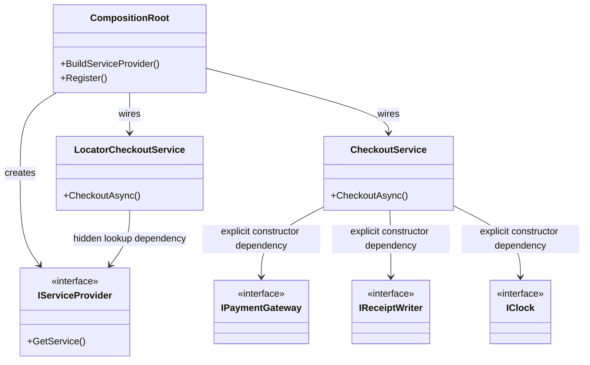
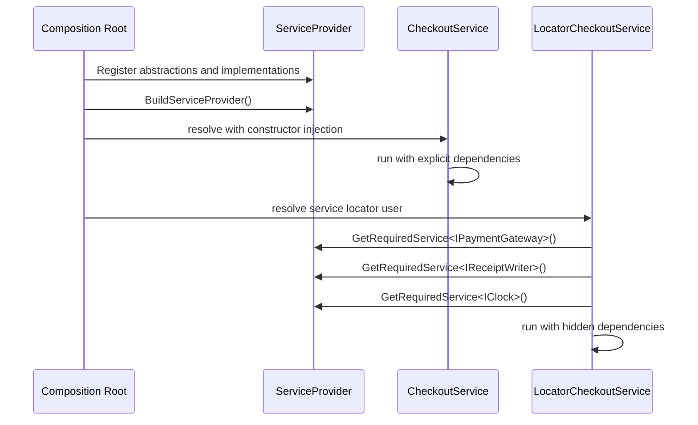

---
date: "2026-04-17"
title: "设计模式教科书｜依赖注入与 Service Locator：显式依赖和隐藏依赖的分水岭"
description: "DI 把依赖交给 composition root 显式组装，Service Locator 则把依赖查询藏进运行时调用。两者都能拿到对象，但前者利于测试、静态分析和生命周期管理，后者更像一个受限边界工具。"
slug: "patterns-27-di-vs-service-locator"
weight: 927
tags:
  - "设计模式"
  - "Dependency Injection"
  - "Service Locator"
  - "IoC"
  - "软件工程"
series: "设计模式教科书"
---

> 一句话定义：DI 把依赖当参数，Service Locator 把依赖当查询；差别不在能不能拿到对象，而在依赖关系是否显式。

## 历史背景

依赖注入不是凭空冒出来的术语，它是 IoC 演进到容器时代后的自然结果。早期框架要控制对象生命周期、回调和装配顺序，程序员发现“谁负责创建谁”比“谁调用谁”还难。Martin Fowler 在 2004 年把 Inversion of Control Containers 和 DI 的关系讲清楚后，这套思路才真正稳定下来：对象自己不再决定依赖从哪来，容器在组合根里负责把依赖塞进去。

Spring 把这件事做成了企业应用的基础设施。`ApplicationContext` 和 `BeanFactory` 让 bean 的构造、装配、生命周期、作用域都能被容器接管。后来 .NET 也把 DI 直接做进了平台，`IServiceCollection`、`IServiceProvider`、`ActivatorUtilities` 变成了标准入口。到了 Android，Dagger/Hilt 又把 DI 推向编译期生成，让依赖图不再依赖反射或运行时扫描。

Service Locator 则是另一条路。它不是让依赖显式地进入对象，而是给对象一个“去哪里找依赖”的入口。短期看，它很方便：代码少，调用快，框架也容易接。长期看，它会把依赖藏进调用体内部，让类看起来没有依赖，实际上处处依赖 locator。于是测试、静态分析、生命周期管理都会开始受伤。

这就是两者的分水岭：DI 在设计时暴露关系，Service Locator 在运行时隐藏关系。前者把图画清楚，后者把图折叠进一个查询 API。

## 一、先看问题

先看一个订单结算服务。你需要支付、发票、审计、时间戳和通知。最直觉的写法是：在方法里到处拿依赖，然后做事。这样一开始看似灵活，实际上把系统从“组合对象”变成了“到处查对象”。

```csharp
using System;
using System.Threading.Tasks;
using Microsoft.Extensions.DependencyInjection;

public interface IClock
{
    DateTime UtcNow { get; }
}

public interface IPaymentGateway
{
    ValueTask ChargeAsync(string orderId, decimal amount);
}

public interface IReceiptWriter
{
    ValueTask WriteAsync(string orderId, DateTime paidAt);
}

public sealed class SystemClock : IClock
{
    public DateTime UtcNow => DateTime.UtcNow;
}

public sealed class FakePaymentGateway : IPaymentGateway
{
    public ValueTask ChargeAsync(string orderId, decimal amount)
    {
        Console.WriteLine($"charge {orderId} amount={amount}");
        return ValueTask.CompletedTask;
    }
}

public sealed class ConsoleReceiptWriter : IReceiptWriter
{
    public ValueTask WriteAsync(string orderId, DateTime paidAt)
    {
        Console.WriteLine($"receipt {orderId} at {paidAt:o}");
        return ValueTask.CompletedTask;
    }
}

public sealed class CheckoutService
{
    private readonly IPaymentGateway _paymentGateway;
    private readonly IReceiptWriter _receiptWriter;
    private readonly IClock _clock;

    public CheckoutService(IPaymentGateway paymentGateway, IReceiptWriter receiptWriter, IClock clock)
    {
        _paymentGateway = paymentGateway ?? throw new ArgumentNullException(nameof(paymentGateway));
        _receiptWriter = receiptWriter ?? throw new ArgumentNullException(nameof(receiptWriter));
        _clock = clock ?? throw new ArgumentNullException(nameof(clock));
    }

    public async ValueTask CheckoutAsync(string orderId, decimal amount)
    {
        await _paymentGateway.ChargeAsync(orderId, amount).ConfigureAwait(false);
        await _receiptWriter.WriteAsync(orderId, _clock.UtcNow).ConfigureAwait(false);
    }
}

public sealed class LocatorCheckoutService
{
    private readonly IServiceProvider _provider;

    public LocatorCheckoutService(IServiceProvider provider)
    {
        _provider = provider ?? throw new ArgumentNullException(nameof(provider));
    }

    public async ValueTask CheckoutAsync(string orderId, decimal amount)
    {
        var paymentGateway = _provider.GetRequiredService<IPaymentGateway>();
        var receiptWriter = _provider.GetRequiredService<IReceiptWriter>();
        var clock = _provider.GetRequiredService<IClock>();

        await paymentGateway.ChargeAsync(orderId, amount).ConfigureAwait(false);
        await receiptWriter.WriteAsync(orderId, clock.UtcNow).ConfigureAwait(false);
    }
}

public static class Program
{
    public static async Task Main()
    {
        var services = new ServiceCollection();
        services.AddSingleton<IClock, SystemClock>();
        services.AddSingleton<IPaymentGateway, FakePaymentGateway>();
        services.AddSingleton<IReceiptWriter, ConsoleReceiptWriter>();
        services.AddTransient<CheckoutService>();
        services.AddTransient<LocatorCheckoutService>();

        using var provider = services.BuildServiceProvider();

        var checkout = provider.GetRequiredService<CheckoutService>();
        await checkout.CheckoutAsync("ORD-1001", 199m);

        var locatorCheckout = provider.GetRequiredService<LocatorCheckoutService>();
        await locatorCheckout.CheckoutAsync("ORD-1002", 299m);
    }
}
```

这段代码的对比点很直接。

`CheckoutService` 的依赖在构造函数里就写死了，但这不是坏事。它暴露了真实依赖，单测可以直接替换实现，容器可以在 composition root 统一组装。`LocatorCheckoutService` 看起来更自由，实际上只是把依赖关系从签名挪到了方法体里。你看不到它需要什么，只能在运行时去猜。

真正的问题不止是“难读”。更大的问题是：

- 构造函数签名不再能表达依赖图。
- 静态分析看不出对象到底依赖谁。
- 测试时要先搭一个 locator，再假设它已经注册了正确的服务。
- 生命周期错误更晚才暴露，往往在首次运行或某个冷路径上炸。

DI 不是多写几个接口，而是把对象图变成显式结构。Service Locator 则是把结构压进查询路径里，让依赖从设计时问题变成运行时问题。

## 二、模式的解法

DI 的核心不是“容器帮你 new”，而是“依赖的所有权在 composition root，使用权在对象本身”。

- 对象只声明自己需要什么。
- Composition root 负责把实现和生命周期组装好。
- 容器只负责构建图，不负责替业务逻辑做判断。
- 测试可以在组装点替换实现。

这件事可以分成三层看。

1. **构造层**：对象通过构造函数或工厂方法显式声明依赖。
2. **组装层**：容器或手写 composition root 把实现映射到抽象。
3. **运行层**：对象只用依赖，不再知道怎么找依赖。

如果你把 locator 放进领域对象里，第三层就回到了第二层。对象开始自己找服务，组合关系失去透明性。DI 最值钱的地方，恰恰就是这份透明性。

现代 C# 让 DI 的表达更轻。`record`、主构造函数、`init`、`using`、`async/await`、`ActivatorUtilities.CreateFactory`，都能减少样板。但这些只是实现便利，真正的关键仍然是 composition root。没有这个根，容器就会退化成全局查询点。

## 三、结构图



这张图的重点是两条箭头。

- `CheckoutService` 指向抽象依赖，表示关系可见。
- `LocatorCheckoutService` 指向 `IServiceProvider`，表示关系被藏起来了。

图上看起来都能拿到对象，但设计含义完全不一样。前者把依赖图摊开，后者把依赖图折叠成一次查找。

## 四、时序图



时序图里的关键差异是：

- DI 把组装放在启动阶段。
- Service Locator 把查询放到业务执行阶段。

这不仅是代码风格差异，也是故障发现时机的差异。DI 往往能在容器构建时暴露错误，Spring 默认预实例化 singleton 的原因就是这个。Service Locator 往往把错误拖到第一次调用那一刻，甚至拖到某个冷路径里。

## 五、变体与兄弟模式

DI 并不是只有一种表达。

- **Constructor Injection**：最常见，也最适合强依赖。
- **Setter Injection**：适合可选依赖和框架托管对象，但要小心半初始化对象。
- **Method Injection**：依赖只在个别方法里需要时有用。
- **Ambient Context**：像 `AsyncLocal<T>` 这样的上下文传播机制，适合请求 ID、跟踪 ID 这类横切信息，但不适合业务依赖。
- **Service Locator**：看起来像 DI 的兄弟，实际上更像“依赖查询器”。

更容易混淆的是容器和工厂。

- **工厂**解决“怎么创建一个对象”。
- **DI 容器**解决“怎么组装一整张对象图”。
- **Service Locator**解决“怎么在运行时查一个已注册对象”。

这三者可以同时存在，但职责不要互相吞。

## 六、对比其他模式

| 维度 | Constructor DI | Setter / Method DI | Service Locator | Ambient Context |
|---|---|---|---|---|
| 依赖是否显式 | 是 | 部分显式 | 否 | 否 |
| 可测试性 | 高 | 中 | 低 | 低 |
| 生命周期管理 | 容器统一管理 | 容易出现半初始化 | 容易失控 | 只适合上下文数据 |
| 静态分析 | 好做 | 还可以 | 很差 | 很差 |
| 适合的东西 | 核心业务依赖 | 可选依赖 | 框架边界、插件桥接 | Trace ID、Culture、Request Context |

再说得直接一点。

- **DI** 让依赖是输入。
- **Service Locator** 让依赖是查询。
- **Ambient Context** 让依赖像环境变量一样从上下文里冒出来。

如果你把业务服务写成 locator + ambient context 的混合体，代码会很快变得“到处都能拿到东西，但没人知道该拿什么”。这就是隐藏依赖的问题。

## 七、批判性讨论

Service Locator 为什么总被认为是反模式？因为它违背了依赖显式化的基本原则。

第一，**隐藏依赖**。对象签名不再说明自己需要什么，阅读者只能打开方法体猜。测试也一样，最难测的不是代码量，而是不知道该准备什么。

第二，**运行时失败**。服务未注册、生命周期不匹配、作用域错误，都会从编译时或装配时滑到运行时。对生产环境来说，这种错误的代价通常更高。

第三，**把容器变成全局状态**。一旦大家都从 locator 里取东西，容器就不再是 composition root，而是“万能取件柜”。这会让领域层和基础设施层的边界越来越糊。

第四，**让重构变贵**。你改一个构造函数签名，编译器和 IDE 会帮你找全局引用；你改一个 locator 查询，很多调用点都还活着，只是运行时炸。

但 Service Locator 并非永远不能用。它在下面几类受限场景里还能接受：

- **框架边界**：对象是框架创建的，你无法直接注入，只能在边界适配。
- **插件宿主**：类型在运行时才知道，只有查找机制可用。
- **遗留系统桥接**：旧代码已经按 locator 写死，先用边界封住，再逐步迁移。
- **可选能力探测**：某个能力不是主流程依赖，只有存在时才启用。
- **基础设施入口**：启动阶段、模块加载、测试装配这类地方，locator 可以短暂出现，但别扩散到业务对象里。

所以关键不是“能不能用”，而是“能不能只在边界上用”。一旦 locator 开始进入领域逻辑，它就从工具变成了结构性风险。

## 八、跨学科视角

从**编译器和链接器**看，DI 类似于把符号解析提前到构建阶段。对象之间的引用关系被显式列出来，容器像一个 linker，把抽象和实现连接起来。Service Locator 则更像运行时查表：能找到就行，找不到就爆。

从**函数式编程**看，DI 更接近显式参数传递。依赖像函数入参一样，来自上层，而不是从全局环境里捞。Service Locator 更像隐式环境，和全局变量、thread-local、ambient context 一样，都会稀释可推理性。

从**类型系统和静态分析**看，构造函数注入让依赖图更容易被检查。工具可以发现缺失注册、循环依赖和作用域错误。Service Locator 把这些问题推到运行时，静态分析几乎看不到。

从**软件架构**看，composition root 是边界，不是细节。它应该位于应用最外层：`Program.Main`、`Startup`、`HostBuilder`、`AppModule`、`main`。把这条线画清楚，业务层才不会反过来掌控基础设施层。

## 九、真实案例

### 1. .NET Dependency Injection

.NET 官方文档明确说明，DI 是 .NET 内建的一部分，通常在应用启动时把服务注册到 `IServiceCollection`，再通过 `BuildServiceProvider` 创建容器。文档还直接提到 `ActivatorUtilities` 可以创建未注册对象的工厂，这就是“编译期/运行时激活”与容器的交汇点。

- 官方文档：<https://learn.microsoft.com/en-us/dotnet/core/extensions/dependency-injection>
- 指南：<https://learn.microsoft.com/en-us/dotnet/core/extensions/dependency-injection-guidelines>
- `ActivatorUtilities.CreateFactory`：<https://learn.microsoft.com/en-us/dotnet/api/microsoft.extensions.dependencyinjection.activatorutilities.createfactory?view=net-10.0-pp>
- 源文件：`src/libraries/Microsoft.Extensions.DependencyInjection.Abstractions/src/ActivatorUtilities.cs`

.NET 这套实现非常适合说明 composition root 的价值：服务注册在外层完成，业务对象只接收抽象。`ActivatorUtilities.CreateFactory` 还进一步说明，容器不一定要反射到最后一刻，预编译工厂也可以减轻运行时激活成本。

### 2. Spring IoC Container

Spring 的官方文档把 IoC 和 DI 的关系讲得很清楚：对象通过构造参数、工厂方法参数或属性表达依赖，容器在创建 bean 时注入这些依赖。Spring 还默认预实例化 singleton bean，目的是尽早暴露配置错误。

- IoC 容器介绍：<https://docs.spring.io/spring-framework/reference/core/beans/introduction.html>
- 依赖注入章节：<https://docs.spring.io/spring-framework/reference/core/beans/dependencies/factory-collaborators.html>
- `BeanFactory` / `ApplicationContext` 说明：<https://docs.spring.io/spring-framework/reference/core/beans/definition.html>
- 源码路径：`spring-beans/src/main/java/org/springframework/beans/factory/support/DefaultListableBeanFactory.java`

Spring 的例子很适合说明“容器不是万能接口”。容器真正负责的是 bean 定义、装配、作用域和生命周期；对象内部不应该再自己去找容器。换句话说，容器是组装者，不是服务定位器。

### 3. Dagger / Hilt

Dagger 是编译期 DI 的代表，Hilt 则把它包装成 Android 更容易使用的入口。Android 官方文档明确说，Hilt 在应用里提供标准容器，并依托 Dagger 的编译期正确性和性能优势。

- Hilt 官方文档：<https://developer.android.com/training/dependency-injection/hilt-android>
- Dagger basics：<https://developer.android.com/training/dependency-injection/dagger-basics>
- GitHub 仓库：<https://github.com/google/dagger>

Dagger/Hilt 说明了一个很关键的趋势：DI 不一定要靠运行时反射。只要依赖图在编译期可知，就可以生成纯代码来组装对象。这个方向天然反对 Service Locator，因为 locator 的核心就是运行时查询，而不是编译期组装。

## 十、常见坑

- **把 `IServiceProvider` 注入到每个类里**。这只是把 locator 伪装成 DI。改法是只在 composition root 或极窄边界保留它。
- **把容器当成业务对象仓库**。业务代码里随手 `GetRequiredService`，最后依赖图就看不见了。改法是让依赖从构造函数进入。
- **混用生命周期**。单例依赖作用域服务，或者作用域对象持有短生命周期资源，会让容器设计变得危险。改法是把生命周期约束写成结构规则，而不是靠约定。
- **把 ambient context 当依赖注入的替代品**。`AsyncLocal` 适合传 trace ID，不适合传支付网关。改法是只把它用于横切上下文。
- **过早追求“容器无感”**。无感不是目标，可测试和可读才是。改法是先让对象图可见，再谈进一步抽象。

## 十一、性能考量

DI 的性能通常不是最大问题，过度抽象才是。

从复杂度看，容器构建对象图大致和图规模、依赖深度相关。第一次构建会有一定启动成本；之后如果用 singleton 或 scoped 缓存，重复解析会便宜很多。`ActivatorUtilities.CreateFactory` 这类预编译激活方法能进一步减少反射和表达式树开销。

Spring 之所以默认预实例化 singleton，就是在用启动时间换更早的错误暴露。Dagger/Hilt 之所以强调编译期生成，就是在用构建期成本换运行期性能和可分析性。

Service Locator 的解析本身未必更慢，但它让性能问题更难定位。因为依赖被藏起来，你很难看清一个调用链到底解析了多少对象、触发了多少作用域、有没有重复创建。很多“locator 很快”的错觉，最后都来自对依赖图复杂度的低估。

## 十二、何时用 / 何时不用

适合用 DI：

- 你有明确的依赖图。
- 你需要单元测试、替换实现、管理生命周期。
- 你的系统里有大量横切服务和基础设施依赖。

适合用 Service Locator 的少数场景：

- 你在框架边界，无法把依赖直接注入进去。
- 你在插件宿主或动态模块系统里，需要运行时发现能力。
- 你在遗留系统外层做过渡适配。
- 你只想探测“这个能力有没有”，而不是把它当主流程依赖。

不适合用 Service Locator：

- 领域对象、应用服务、领域服务。
- 需要高可测试性和清晰生命周期管理的代码。
- 需要在编译期尽早发现装配错误的代码。

## 十三、相关模式

- [Factory Method 与 Abstract Factory](./patterns-09-factory.md)
- [Builder](./patterns-04-builder.md)
- [Facade](./patterns-05-facade.md)
- [Adapter](./patterns-11-adapter.md)

DI 和 Factory 经常一起出现，但职责不同：Factory 负责造单个对象，DI 负责组装整张对象图。Facade 可以包住复杂基础设施，但它不该偷偷扮演 Service Locator。

## 十四、在实际工程里怎么用

实际工程里，建议把 DI 视为默认方案，把 Service Locator 视为边界工具。

- 在 ASP.NET Core、Worker Service、控制台应用里，把 composition root 放在 `Program` 或 `HostBuilder`。
- 在 Spring Boot 里，让 `ApplicationContext` 负责 bean 图，业务层只用构造注入。
- 在 Android 里，用 Hilt 管生命周期和图，减少手工装配。
- 在插件系统、脚本宿主、遗留桥接层，才考虑局部 locator。

如果后续要写应用线，可以保留占位链接：

- [DI vs Service Locator 应用线占位稿](../pattern-27-di-vs-service-locator-application.md)
- [Factory 应用线占位稿](../pattern-09-factory-application.md)
- [Facade 应用线占位稿](../pattern-05-facade-application.md)

## 小结

DI 的本质，是让依赖显式、可测试、可替换。

Service Locator 的问题，不是“不能拿对象”，而是把依赖关系隐藏进运行时查询，代价会在测试、静态分析和生命周期里慢慢显现。

最稳的做法不是让容器无处不在，而是把它关在 composition root 里，只让它负责组装，不让它替业务做决定。
