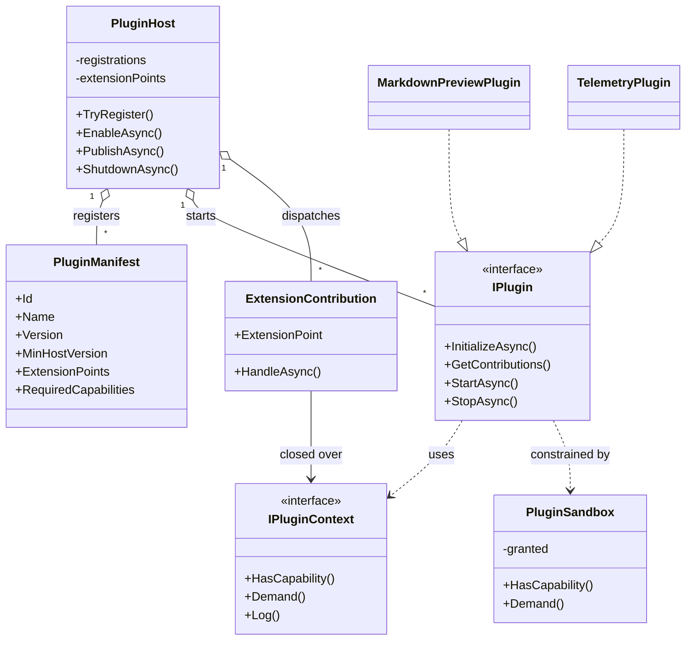
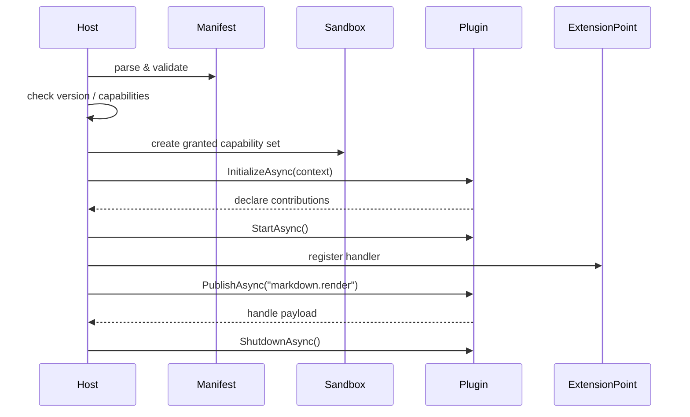

---
date: "2026-04-17"
title: "设计模式教科书｜Plugin 系统架构：把扩展边界、契约与生命周期说清楚"
description: "Plugin 系统架构解决的不是“怎么动态加载 DLL”，而是怎么把扩展边界、版本契约、发现装载、能力声明、沙箱与生命周期管理成一套可演进的系统。"
slug: "patterns-28-plugin-architecture"
weight: 928
tags:
  - "设计模式"
  - "Plugin"
  - "软件工程"
series: "设计模式教科书"
---

> 一句话定义：Plugin 系统架构，就是把“可扩展能力”收进明确的边界里，让宿主能发现、校验、装载、启用、停用和卸载外部功能，而不是把任意代码塞进进程就算扩展。

## 历史背景

插件不是新发明。早期桌面软件就已经有“扩展点”了，只是当时更多靠共享库、脚本和约定俗成的入口来完成。

到了 IDE、浏览器、服务器和构建工具时代，问题变了。宿主不再只想“支持第三方代码”，而是要同时回答四个问题：谁能接入、能接入什么、什么时候接入、坏了怎么退出。

这时，插件系统就从“动态装载”演化成“契约驱动的扩展架构”。manifest、extension point、capability、sandbox、生命周期和兼容性策略，才是它真正的骨架。

## 一、先看问题

很多团队一开始会写成这样：主程序扫一遍目录，找到 DLL 就反射创建对象，能跑就行。

问题在于，代码一旦长成这样，扩展边界就没了。宿主不知道插件要什么权限，也不知道它依赖哪个版本，更不知道它打算把行为挂到哪个点上。

坏代码通常长这样：

```csharp
using System;
using System.IO;
using System.Linq;
using System.Reflection;

var pluginFolder = Path.Combine(AppContext.BaseDirectory, "plugins");
foreach (var dll in Directory.EnumerateFiles(pluginFolder, "*.dll"))
{
    var assembly = Assembly.LoadFrom(dll);
    var type = assembly.GetTypes().FirstOrDefault(t => typeof(object).IsAssignableFrom(t) && t.IsClass && !t.IsAbstract);
    if (type is null)
        continue;

    var plugin = Activator.CreateInstance(type);
    type.GetMethod("Run")?.Invoke(plugin, Array.Empty<object>());
}
```

这段代码能“加载”，但它没有插件架构。

它没有 manifest，所以宿主无法提前知道插件版本、入口、能力和兼容性。

它没有 extension point，所以插件只能碰运气地去找宿主内部对象。

它没有 sandbox，所以插件要么和宿主同权，要么什么都干不了。

它也没有生命周期。初始化失败、半途撤销、优雅停机，这些问题最后都会回到宿主自己的异常处理里。

## 二、模式的解法

插件架构先定义边界，再谈执行。

宿主负责三件事：发现插件、校验契约、管理生命周期。

插件负责两件事：声明自己需要什么、把能力挂到哪些扩展点上。

最关键的是，宿主给插件的是“受限上下文”，不是整个世界。这个上下文通常只暴露日志、配置、少量受控服务和能力检查接口。

下面这段代码展示一个可运行的纯 C# 插件宿主。它做了四件事：解析 manifest、检查版本和能力、注册 extension point、按生命周期启停插件。

```csharp
using System;
using System.Collections.Generic;
using System.Linq;
using System.Text.Json;
using System.Text.Json.Serialization;
using System.Threading.Tasks;

public enum PluginCapability
{
    ReadWorkspace,
    WriteWorkspace,
    Network,
    Ui,
    BackgroundJobs
}

public sealed class PluginManifest
{
    public string Id { get; init; } = "";
    public string Name { get; init; } = "";
    public string Version { get; init; } = "";
    public string MinHostVersion { get; init; } = "1.0.0";
    public string[] ExtensionPoints { get; init; } = Array.Empty<string>();
    public PluginCapability[] RequiredCapabilities { get; init; } = Array.Empty<PluginCapability>();
}

public sealed record ExtensionContribution(string ExtensionPoint, Func<string, ValueTask> HandleAsync);

public interface IPluginContext
{
    string PluginId { get; }
    bool HasCapability(PluginCapability capability);
    void Demand(PluginCapability capability);
    void Log(string message);
}

public interface IPlugin
{
    ValueTask InitializeAsync(IPluginContext context);
    IEnumerable<ExtensionContribution> GetContributions();
    ValueTask StartAsync();
    ValueTask StopAsync();
}

public sealed class PluginSandbox
{
    private readonly HashSet<PluginCapability> _granted;

    public PluginSandbox(IEnumerable<PluginCapability> granted)
    {
        _granted = new HashSet<PluginCapability>(granted);
    }

    public bool HasCapability(PluginCapability capability) => _granted.Contains(capability);

    public void Demand(PluginCapability capability)
    {
        if (!HasCapability(capability))
            throw new InvalidOperationException($"Capability '{capability}' is not granted.");
    }
}

public sealed class PluginContext : IPluginContext
{
    private readonly PluginSandbox _sandbox;
    private readonly Action<string> _log;

    public PluginContext(string pluginId, PluginSandbox sandbox, Action<string> log)
    {
        PluginId = pluginId;
        _sandbox = sandbox;
        _log = log;
    }

    public string PluginId { get; }

    public bool HasCapability(PluginCapability capability) => _sandbox.HasCapability(capability);

    public void Demand(PluginCapability capability) => _sandbox.Demand(capability);

    public void Log(string message) => _log($"[{PluginId}] {message}");
}

public sealed class PluginRegistration
{
    public PluginManifest Manifest { get; }
    public Func<IPlugin> Factory { get; }

    public PluginRegistration(PluginManifest manifest, Func<IPlugin> factory)
    {
        Manifest = manifest;
        Factory = factory;
    }
}

public sealed class PluginHost
{
    private readonly Version _hostVersion;
    private readonly HashSet<PluginCapability> _hostCapabilities;
    private readonly Dictionary<string, PluginRegistration> _registrations = new();
    private readonly Dictionary<string, List<ExtensionContribution>> _extensionPoints = new();
    private readonly List<IPlugin> _startedPlugins = new();
    private readonly JsonSerializerOptions _jsonOptions = new()
    {
        PropertyNameCaseInsensitive = true,
        Converters = { new JsonStringEnumConverter() }
    };

    public PluginHost(string hostVersion, IEnumerable<PluginCapability> hostCapabilities)
    {
        _hostVersion = Version.Parse(hostVersion);
        _hostCapabilities = new HashSet<PluginCapability>(hostCapabilities);
    }

    public bool TryRegister(string manifestJson, Func<IPlugin> factory, out string reason)
    {
        reason = string.Empty;
        var manifest = JsonSerializer.Deserialize<PluginManifest>(manifestJson, _jsonOptions)
            ?? throw new InvalidOperationException("Manifest is invalid.");

        if (!Version.TryParse(manifest.MinHostVersion, out var minHostVersion))
        {
            reason = $"Plugin '{manifest.Id}' has an invalid MinHostVersion.";
            return false;
        }

        if (_hostVersion < minHostVersion)
        {
            reason = $"Plugin '{manifest.Id}' needs host >= {manifest.MinHostVersion}.";
            return false;
        }

        foreach (var capability in manifest.RequiredCapabilities)
        {
            if (!_hostCapabilities.Contains(capability))
            {
                reason = $"Plugin '{manifest.Id}' requires capability '{capability}', which the host does not expose.";
                return false;
            }
        }

        _registrations[manifest.Id] = new PluginRegistration(manifest, factory);
        return true;
    }

    public async ValueTask<bool> EnableAsync(string pluginId)
    {
        if (!_registrations.TryGetValue(pluginId, out var registration))
            return false;

        var sandbox = new PluginSandbox(registration.Manifest.RequiredCapabilities);
        var context = new PluginContext(registration.Manifest.Id, sandbox, Console.WriteLine);
        var plugin = registration.Factory();

        await plugin.InitializeAsync(context);
        await plugin.StartAsync();

        foreach (var contribution in plugin.GetContributions())
        {
            if (!registration.Manifest.ExtensionPoints.Contains(contribution.ExtensionPoint))
            {
                throw new InvalidOperationException(
                    $"Plugin '{pluginId}' registered an undeclared extension point '{contribution.ExtensionPoint}'.");
            }

            if (!_extensionPoints.TryGetValue(contribution.ExtensionPoint, out var handlers))
            {
                handlers = new List<ExtensionContribution>();
                _extensionPoints[contribution.ExtensionPoint] = handlers;
            }

            handlers.Add(contribution);
        }

        _startedPlugins.Add(plugin);
        context.Log("enabled.");
        return true;
    }

    public async ValueTask PublishAsync(string extensionPoint, string payload)
    {
        if (!_extensionPoints.TryGetValue(extensionPoint, out var handlers) || handlers.Count == 0)
        {
            Console.WriteLine($"[host] no plugin handles '{extensionPoint}'.");
            return;
        }

        foreach (var handler in handlers)
            await handler.HandleAsync(payload);
    }

    public async ValueTask ShutdownAsync()
    {
        for (var i = _startedPlugins.Count - 1; i >= 0; i--)
            await _startedPlugins[i].StopAsync();

        _startedPlugins.Clear();
    }
}

public sealed class MarkdownPreviewPlugin : IPlugin
{
    private IPluginContext? _context;

    public ValueTask InitializeAsync(IPluginContext context)
    {
        _context = context;
        context.Log("manifest accepted, preparing render contribution.");
        return ValueTask.CompletedTask;
    }

    public IEnumerable<ExtensionContribution> GetContributions()
    {
        yield return new ExtensionContribution("markdown.render", payload =>
        {
            _context!.Demand(PluginCapability.Ui);
            _context.Log($"rendering '{payload}'.");
            Console.WriteLine($"[markdown-preview] rendered: {payload.ToUpperInvariant()}");
            return ValueTask.CompletedTask;
        });
    }

    public ValueTask StartAsync()
    {
        _context?.Log("started.");
        return ValueTask.CompletedTask;
    }

    public ValueTask StopAsync()
    {
        _context?.Log("stopped.");
        return ValueTask.CompletedTask;
    }
}

public sealed class TelemetryPlugin : IPlugin
{
    private IPluginContext? _context;

    public ValueTask InitializeAsync(IPluginContext context)
    {
        _context = context;
        context.Log("initializing.");
        return ValueTask.CompletedTask;
    }

    public IEnumerable<ExtensionContribution> GetContributions()
    {
        yield return new ExtensionContribution("app.shutdown", payload =>
        {
            _context!.Demand(PluginCapability.Network);
            _context.Log($"would upload telemetry: {payload}");
            return ValueTask.CompletedTask;
        });
    }

    public ValueTask StartAsync() => ValueTask.CompletedTask;

    public ValueTask StopAsync()
    {
        _context?.Log("stopped.");
        return ValueTask.CompletedTask;
    }
}

public static class Program
{
    public static async Task Main()
    {
        var host = new PluginHost("1.4.0", new[]
        {
            PluginCapability.ReadWorkspace,
            PluginCapability.Ui,
            PluginCapability.BackgroundJobs
        });

        var markdownManifest = """
        {
          "Id": "markdown.preview",
          "Name": "Markdown Preview",
          "Version": "1.0.0",
          "MinHostVersion": "1.0.0",
          "ExtensionPoints": [ "markdown.render" ],
          "RequiredCapabilities": [ "Ui" ]
        }
        """;

        var telemetryManifest = """
        {
          "Id": "telemetry.upload",
          "Name": "Telemetry Upload",
          "Version": "1.0.0",
          "MinHostVersion": "1.0.0",
          "ExtensionPoints": [ "app.shutdown" ],
          "RequiredCapabilities": [ "Network" ]
        }
        """;

        if (!host.TryRegister(markdownManifest, () => new MarkdownPreviewPlugin(), out var reason))
            Console.WriteLine(reason);

        if (!host.TryRegister(telemetryManifest, () => new TelemetryPlugin(), out reason))
            Console.WriteLine(reason);

        await host.EnableAsync("markdown.preview");
        await host.PublishAsync("markdown.render", "# Plugin systems need contracts");
        await host.ShutdownAsync();
    }
}
```

这段代码里最重要的不是“如何反射创建对象”，而是三层边界：

宿主边界决定了插件能看到什么。

manifest 决定了插件能声明什么。

sandbox 决定了插件真正能做什么。

## 三、结构图



## 四、时序图



## 五、变体与兄弟模式

插件架构常见有三种变体。

第一种是“进程内插件”。它最轻，适合 IDE、编辑器、构建器这类需要低延迟响应的宿主。

第二种是“进程外插件”。宿主通过 RPC、HTTP、gRPC 或消息总线和插件沟通。它更重，但隔离更强，崩溃也更容易切断。

第三种是“能力型插件”。插件不是只声明名称，而是声明它要读什么、写什么、能不能联网、能不能打开 UI。这个变体在现代平台里越来越重要，因为宿主已经不愿意把整台机器交给插件。

它容易和几个模式混淆。

Adapter 负责翻译接口，不负责发现、装载和生命周期。

Facade 负责压低入口复杂度，不负责把第三方功能纳入宿主治理。

Hot Reload 负责替换运行中的实现，不负责长期的扩展契约。

DI 负责组装已知依赖，不负责在运行时发现未知扩展。

## 六、对比其他模式

| 模式 | 解决的问题 | 边界重点 | 生命周期 | 典型风险 |
|---|---|---|---|---|
| Plugin | 把第三方能力纳入宿主 | 扩展点、能力、兼容性 | 必须有 | 版本地狱、权限失控 |
| Adapter | 让接口对齐 | 类型和方法签名 | 不关心 | 只会翻译，不会治理 |
| Facade | 降低入口复杂度 | 子系统入口 | 不关心 | 误把简化入口当扩展平台 |
| Hot Reload | 替换运行中的代码 | 代码镜像和状态 | 运行时替换 | 状态迁移、热更不一致 |
| DI | 组装对象依赖 | 对象图 | 容器管理 | 只解决编排，不解决发现 |

插件架构和 Facade 最容易被混为一谈。Facade 对外只说“怎么用”，插件架构还要说“谁能进来、进来后能做什么、什么时候退出”。

它和 Adapter 的关系也很紧。很多插件内部会用 Adapter 把宿主接口和插件私有接口接起来，但 Adapter 只是局部手段，不是整个架构。

## 七、批判性讨论

插件系统最贵的地方，不是代码量，而是契约冻结成本。

一旦宿主公开了某个 extension point，它就不能轻易改名、删参数、换语义。插件不是一个内部函数调用，而是一份长期合同。合同写得越多，宿主以后越难演进。

第二个代价是安全隔离。

如果插件和宿主同进程，它们往往共享文件系统、网络、内存和异常边界。所谓 sandbox，很多时候只是“受限 API”，不是操作系统级别的安全隔离。真正需要强隔离时，进程边界比接口约束更可靠。

第三个代价是版本地狱。

宿主版本、插件版本、传递依赖版本、平台版本，任何一层变动都可能打碎兼容矩阵。现代语言和包管理器缓解了这个问题，但没有根治。SemVer 也只能约束版本号，约束不了插件对语义的误读。

所以，插件架构不是越开放越好。开放得太早，宿主会被扩展点拖住；开放得太晚，生态就长不起来。

更成熟的做法是把契约分层。核心 extension point 少而稳，边缘能力走版本化扩展；新增字段尽量向后兼容，删除能力先标记弃用，再走迁移窗口。宿主最好支持 feature flag 或 capability flag，这样插件适配的是一层稳定语义，而不是整个内部对象图。

## 八、跨学科视角

插件架构和软件包管理很像。

manifest 就像包索引，extension point 就像可链接符号，capability 就像权限声明。宿主不是单纯加载代码，而是在做一次小型的依赖解析和权限分配。

它也接近能力安全模型。

插件只拿到被授予的能力，没拿到的能力就不能碰。这和操作系统里的 capability-based security 思路一致：权限不是默认共享，而是显式下发。

再往外看，插件生态和分布式系统的服务发现也很像。

服务发现回答“谁在线”，插件发现回答“谁可用”。服务契约回答“能调用什么”，插件 manifest 回答“能贡献什么”。两者都需要兼容性、超时、降级和可观测性。

## 九、真实案例

VS Code 的插件系统很适合看扩展边界。

它的官方文档把 `package.json` 当作 extension manifest，`activationEvents` 决定插件什么时候被唤醒。源码组织文档还明确写了扩展运行在独立的 extension host 进程里，核心代码位于 `src/vs/workbench/api/common/extHostExtensionService.ts` 一带。

这套设计的关键不是“能动态加载”，而是“能延迟加载”。`onLanguage`、`onCommand`、`onStartupFinished` 这些激活事件，本质上是在做宿主级的懒激活和冷启动控制。

JetBrains IntelliJ 平台把插件契约写进 `plugin.xml`。

官方文档说明了 `plugin.xml` 会声明插件元数据、依赖和扩展注册点；模板仓库则把真实路径放在 `src/main/resources/META-INF/plugin.xml`。这里的重点也不是“找到一个 jar”，而是“插件依赖哪些模块、注册了哪些 extension points、能在哪些 IDE 产品里运行”。

这就是插件架构的判定标准：如果系统只是在运行时拼装一个对象，它还只是装配；如果它先声明 manifest、再注册 extension point、再由宿主管理启停和兼容性，它才真的进入插件架构。

NGINX 的动态模块则展示了另一种路线。

官方文档和社区博客都强调，模块不只是编译时静态拼进去的代码，也可以通过 `load_module` 动态装载。源码层面可以看 `src/core/ngx_module.h`、`src/http/ngx_http_core_module.c` 以及动态模块相关说明。它告诉你一个很现实的事实：共享进程权限的插件，必须把版本和构建兼容性管得极严。

这也解释了为什么它算插件系统，而不是普通模块调用。模块不是被宿主“new 出来”然后直接调用，而是先通过配置阶段被发现，再按生命周期挂入请求处理链；发现、装载、参与调度、退出时机都由宿主管。

## 十、常见坑

第一个坑，是把插件架构做成“目录扫描器”。

只找 DLL、不看 manifest、不校验能力，最后得到的不是生态，而是一团反射代码。修正方式很简单：先定义 manifest，再定义 extension point，最后才允许装载。

第二个坑，是把插件接口做成宿主内部 API 的镜像。

看起来很省事，实际上等于把内部实现细节直接暴露给外部。宿主一改内部结构，插件就全线崩。修正方法是把扩展点收敛成稳定语义，而不是一比一搬运内部对象。

第三个坑，是在同进程插件里假装有安全边界。

如果插件能直接访问数据库连接、网络客户端、文件系统和全局单例，那 sandbox 就是纸糊的。真正要隔离，就把插件放到独立进程，或至少用能力门禁封住敏感服务。

第四个坑，是过早冻结 API。

很多团队为了“兼容”，把旧接口永远保留，结果宿主内部背了十年的历史包袱。修正方法是做分层契约：核心 extension point 尽量少，非核心能力通过版本化的可选扩展发布。

契约演进最好写进制度，而不是写进人脑：先公告弃用周期，再给并行支持期，最后再移除。插件 API 一旦冻结太早，宿主只能围着历史行为打补丁；冻结太晚，又会让第三方永远抓不住稳定锚点。

## 十一、性能考量

插件架构的性能问题主要出现在三处。

第一处是发现阶段。扫描 manifest、解析元数据、检查版本和依赖，复杂度通常是 O(n)。n 越大，冷启动越慢。

第二处是激活阶段。很多插件不是必须启动就跑，最好按事件懒激活。这样可以把启动成本推迟到真正需要时，换取更快的首屏和更低的内存占用。

第三处是分发阶段。一个 extension point 如果挂了很多插件，每次广播都要遍历订阅者。它通常是 O(k)，k 是当前点上的插件数。这个成本本身不大，但如果你的 payload 很重、调用很频繁，分发层就会变成热路径。

所以，插件系统的性能设计不在“快不快装载一个对象”，而在“能不能把不必要的激活推迟掉”。

这也是为什么 VS Code 这类宿主强调 activation events，而不是启动时一口气把所有扩展都拉起来。

## 十二、何时用 / 何时不用

适合用插件架构的场景很明确。

你需要外部团队或第三方持续扩展能力。

你需要把宿主的稳定核心和可变边界拆开。

你需要控制兼容性、权限和生命周期，而不是只想“开放几段代码钩子”。

不适合用的场景也很明确。

如果功能只会由一个团队维护，而且没有外部扩展需求，插件架构只会增加约束和心智负担。

反过来，如果你已经明确要让外部团队接入，而且未来还要在版本上长期兼容，早点把 manifest、capability 和生命周期定下来，反而会比事后补救便宜得多。

如果你只是想把几个对象注入到一起，DI 就够了。
DI 解决的是对象图组装，不解决外部发现和权限治理。插件系统只在“对象是外部提供的，而且宿主要治理它们”时才值得上。

如果你只是想翻译一个第三方接口，Adapter 就够了。
Adapter 负责接口适配，插件架构负责生态入口；前者只改调用形状，后者还要管装载、版本和生命周期。

如果你只是想隐藏一个复杂子系统，Facade 就够了。
Facade 是缩入口，插件是开边界，两者的方向完全相反。

## 十三、相关模式

- [Adapter](./patterns-11-adapter.md)
- [Facade](./patterns-05-facade.md)
- [Hot Reload](./patterns-45-hot-reload.md)
- [依赖注入与 Service Locator](./patterns-27-di-vs-service-locator.md)

## 十四、在实际工程里怎么用

在真实工程里，插件架构最常出现在编辑器、构建系统、数据平台和后台平台。

编辑器里，它用来开放命令、视图、语言服务和工具窗。

构建系统里，它用来挂接任务、规则和产物处理器。

后台平台里，它用来让不同业务线接自己的鉴权、导入、导出或审计逻辑。

如果你要把这条思路落到应用线，可以继续看：

- `../../engine-toolchain/editor/plugin-system.md`
- `../../engine-toolchain/build-system/plugin-hooks.md`
- `../../engine-toolchain/runtime/hot-reload-bridge.md`

## 小结

- 插件架构解决的是扩展边界、契约、能力与生命周期，不是“动态加载”本身。
- 真正成熟的插件系统，一定会把 manifest、extension point 和 sandbox 设计成第一等公民。
- 能把插件做稳的宿主，通常都先承认一个事实：开放接口越多，治理成本越高。


