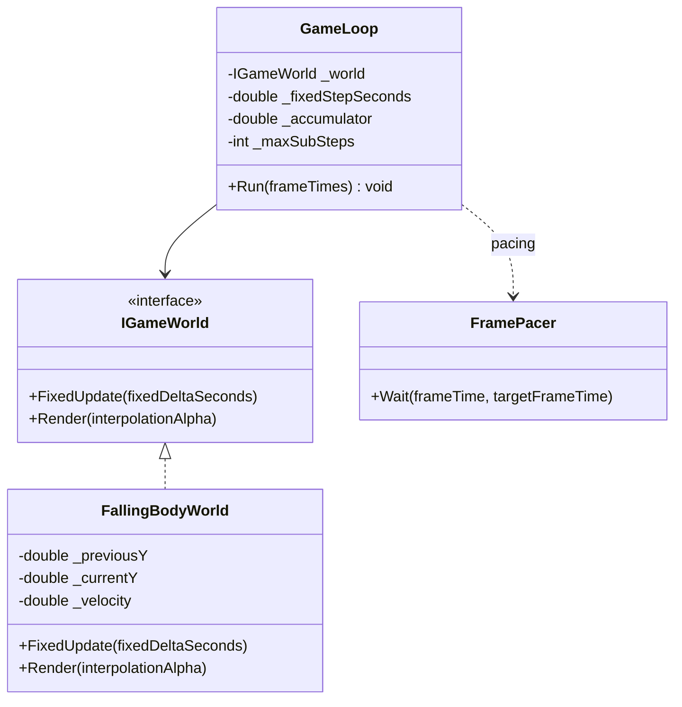

---
date: "2026-04-18"
title: "设计模式教科书｜Game Loop：把时间切成可控的帧"
description: "Game Loop 不是简单的 while(true)。它真正管理的是时间采样、模拟步长、帧 pacing、输入时序和确定性。本文把 fixed timestep、variable timestep、accumulator 和渲染插值放到同一条链路里讲清楚。"
slug: "patterns-29-game-loop"
weight: 929
tags:
  - "设计模式"
  - "Game Loop"
  - "游戏引擎"
  - "软件工程"
series: "设计模式教科书"
---

> 一句话定义：Game Loop 是游戏和实时模拟的心跳，它不断采样时间、推进世界状态、提交渲染结果，并把这三件事的顺序固定下来。

## 历史背景
游戏循环比大多数设计模式更像“工程事实”。早期街机和家用机没有现代 GUI 框架，也没有今天这么完整的调度器，程序员必须自己掌握一整帧里该先做什么、后做什么。输入要先读，仿真要推进，画面要提交，声音要刷新，最后还得把控制权交回硬件或系统，再等下一帧。

这件事后来分成了两条路线。第一条是固定步长的模拟循环，目标是可重复、可调试、可同步；第二条是变量步长的应用循环，目标是尽量跟上现实时间、减少等待、适应不同机器。真正成熟的引擎通常不会二选一，而是把它们拼起来：渲染跟着显示器节奏走，模拟跟着固定时间片走，中间再用累积器和插值补上缝。

Game Loop 所以重要，不是因为大家都在写 `while (running)`，而是因为它决定了整个程序如何看待时间。时间一旦被定义，后面的输入、物理、AI、动画、网络同步和回放，才有了统一坐标系。

## 一、先看问题
先看一个最常见的坏写法：每一帧直接拿真实时间差去推进世界，然后把所有系统都塞进同一个 `Update` 里。这个写法能跑，甚至在小项目里看不出问题；一旦有碰撞、回放、网络同步或跨机器复现，它就会开始漏水。

```csharp
using System;
using System.Collections.Generic;

public sealed class BadWorld
{
    public double Position { get; private set; }
    public double Velocity { get; private set; } = 10.0;

    public void Update(double deltaSeconds)
    {
        // 直接拿帧时间积分，结果会跟帧率和平台抖动绑定
        Position += Velocity * deltaSeconds;
        Velocity += -9.8 * deltaSeconds;
    }
}

public static class BadDemo
{
    public static void Main()
    {
        var world = new BadWorld();
        var frames = new[] { 0.016, 0.018, 0.014, 0.050, 0.010, 0.020 };

        foreach (var dt in frames)
        {
            world.Update(dt);
            Console.WriteLine($"dt={dt:F3}, pos={world.Position:F4}");
        }
    }
}
```

这段代码的问题不在数值公式，而在时间来源。帧时间不是模拟时间，显示时间也不是物理时间。你把它们混在一起，结果就会出现四个常见症状。

第一，速度和帧率绑定。高帧率机器上的角色比低帧率机器更稳，甚至更快或更慢。

第二，碰撞和积分失真。一次 50ms 的大步进，和三次 16.67ms 的小步进，不是同一个结果。

第三，回放难做。你保存输入时刻，却没法保证每次积分都走同样的轨迹。

第四，排队逻辑失控。某一帧稍慢，下一帧就背上更多工作，最后形成“越慢越追不上”的 spiral of death。

Game Loop 要解决的，就是把真实时间和模拟时间拆开。

## 二、模式的解法
Game Loop 的核心不是循环本身，而是“固定模拟、变量渲染、时间累积”。最常见的结构是：先读出这一帧过去了多少真实时间，把它累积起来；只要累积时间够一个固定步长，就推进一次模拟；模拟推进完以后，再按剩余比例做渲染插值。

这个结构至少带来三件事。

第一，模拟稳定。固定步长让物理和 AI 看到的是同一个 dt，不再随机器抖动。

第二，时间可解释。输入、网络包、动画和事件都可以挂到模拟时间点上，不必盯着每一帧的浮动时间。

第三，渲染可调速。即使模拟每秒 60 次，屏幕也可以 144Hz、240Hz 或者更低，只要渲染根据插值补位就行。

下面是一个纯 C# 的参考实现。它不依赖任何引擎，只展示 loop、accumulator、fixed step、render interpolation 和帧 pacing 的边界。

```csharp
using System;
using System.Collections.Generic;
using System.Threading;

public interface IGameWorld
{
    void FixedUpdate(double fixedDeltaSeconds);
    void Render(double interpolationAlpha);
}

public sealed class FallingBodyWorld : IGameWorld
{
    private const double Gravity = -9.8;

    private double _previousY;
    private double _currentY = 10.0;
    private double _velocity = 0.0;

    public void FixedUpdate(double fixedDeltaSeconds)
    {
        _previousY = _currentY;
        _velocity += Gravity * fixedDeltaSeconds;
        _currentY += _velocity * fixedDeltaSeconds;

        if (_currentY < 0.0)
        {
            _currentY = 0.0;
            _velocity = Math.Abs(_velocity) * 0.6;
        }
    }

    public void Render(double interpolationAlpha)
    {
        var y = _previousY + (_currentY - _previousY) * interpolationAlpha;
        Console.WriteLine($"render y={y:F3}  alpha={interpolationAlpha:F2}");
    }
}

public sealed class GameLoop
{
    private readonly IGameWorld _world;
    private readonly double _fixedStepSeconds;
    private readonly int _maxSubSteps;
    private double _accumulator;

    public GameLoop(IGameWorld world, double fixedStepSeconds = 1.0 / 60.0, int maxSubSteps = 5)
    {
        _world = world ?? throw new ArgumentNullException(nameof(world));
        if (fixedStepSeconds <= 0) throw new ArgumentOutOfRangeException(nameof(fixedStepSeconds));
        if (maxSubSteps <= 0) throw new ArgumentOutOfRangeException(nameof(maxSubSteps));

        _fixedStepSeconds = fixedStepSeconds;
        _maxSubSteps = maxSubSteps;
    }

    public void Run(IEnumerable<double> frameTimesSeconds)
    {
        foreach (var frameTime in frameTimesSeconds)
        {
            var clampedFrameTime = Math.Min(frameTime, 0.25); // 防止长暂停把 accumulator 一次性撑爆
            _accumulator += clampedFrameTime;

            var steps = 0;
            while (_accumulator >= _fixedStepSeconds && steps < _maxSubSteps)
            {
                _world.FixedUpdate(_fixedStepSeconds);
                _accumulator -= _fixedStepSeconds;
                steps++;
            }

            if (steps == _maxSubSteps && _accumulator >= _fixedStepSeconds)
            {
                // 防止 spiral of death：宁可丢一点模拟追赶，也不要无限追帧
                _accumulator = 0;
            }

            var alpha = _accumulator / _fixedStepSeconds;
            _world.Render(alpha);

            FramePacing(frameTime, _fixedStepSeconds);
        }
    }

    private static void FramePacing(double frameTimeSeconds, double targetFrameSeconds)
    {
        var sleepSeconds = targetFrameSeconds - frameTimeSeconds;
        if (sleepSeconds <= 0)
        {
            return;
        }

        var milliseconds = (int)Math.Round(sleepSeconds * 1000);
        if (milliseconds > 0)
        {
            Thread.Sleep(milliseconds);
        }
    }
}

public static class Demo
{
    public static void Main()
    {
        var world = new FallingBodyWorld();
        var loop = new GameLoop(world);

        var simulatedFrames = new[] { 0.016, 0.018, 0.014, 0.050, 0.010, 0.020, 0.017, 0.016 };
        loop.Run(simulatedFrames);
    }
}
```

这份代码刻意把四个概念分开了。

- `_fixedStepSeconds` 定义模拟节拍。
- `_accumulator` 保存真实时间和模拟时间之间的差。
- `Render(alpha)` 不推进规则，只负责把当前状态和上一状态之间的缝补平。
- `FramePacing` 负责尽量维持目标帧率，而不是拿来算游戏逻辑。

Game Loop 的关键不是“循环快一点”，而是“时间边界清楚一点”。

一旦时间边界明确，很多原本互相打架的需求就能分层处理：输入按采样点进入，模拟按固定步长推进，渲染按显示器节奏输出。你不再指望一次帧回调同时完成所有工作，而是把它拆成不同频率的任务。这个拆分本身就是稳定性的来源。

## 三、结构图


## 四、时序图
```mermaid
sequenceDiagram
    participant Input as Input/System
    participant Loop as GameLoop
    participant World as IGameWorld
    participant Render as Renderer

    Input->>Loop: 这一帧过去了 16ms
    Loop->>Loop: accumulator += frameTime
    loop accumulator >= fixedStep
        Loop->>World: FixedUpdate(1/60)
        World-->>Loop: world advanced
        Loop->>Loop: accumulator -= fixedStep
    end
    Loop->>World: Render(alpha)
    World-->>Render: interpolated snapshot
    Loop-->>Input: 等待下一帧
```

## 五、变体与兄弟模式
Game Loop 不是一个单点实现，而是一组时间策略。

- Fixed timestep：模拟永远按固定步长推进，最适合物理、锁步和回放。
- Variable timestep：每帧直接用真实 dt，简单但更容易抖动。
- Semi-fixed timestep：模拟保持固定步长，但允许少量余量跟着渲染节奏走。
- Accumulator loop：最常见的混合方案，模拟固定，渲染插值。
- Frame pacing loop：重点不是模拟，而是尽量平滑地把帧交给显示器。

它最容易混淆的兄弟是两个。

- UI event loop：它关注的是“事件来了就处理”，不是“世界每秒必须前进多少次”。
- Async scheduler：它关注的是“哪个任务现在可以继续”，不是“模拟时间应该怎么分段”。

如果把 Game Loop 误写成 UI event loop，你会在没有输入时什么都不做，结果世界停住；如果把它误写成 async scheduler，你会把等待 I/O 的思维套到实时模拟上，最后失去稳定节拍。

## 六、对比其他模式
| 维度 | Game Loop | UI Event Loop | Async Scheduler | Update Method |
|---|---|---|---|---|
| 驱动来源 | 真实时间和帧节拍 | 用户输入、消息、窗口事件 | await/任务完成/I/O | 对象自身的更新接口 |
| 时间观 | 以帧为单位管理模拟和渲染 | 以事件为单位处理消息 | 以任务完成为单位恢复 | 每个对象自己决定何时更新 |
| 确定性 | fixed timestep 时较强 | 不是重点 | 不是重点 | 取决于调度顺序与 dt |
| 典型场景 | 游戏、仿真、回放、锁步 | 桌面 UI、编辑器、OS 消息泵 | 网络、文件、RPC、后台任务 | 敌人、粒子、技能、动画 |

Game Loop 和 Update Method 经常一起出现，但关注点完全不同。Game Loop 管的是“这一帧怎么走”，Update Method 管的是“谁在这一帧里更新自己”。前者是时间框架，后者是行为接口。

## 七、批判性讨论
Game Loop 被写烂的最大原因，是很多人以为它只有一个版本。实际上，循环策略是架构约束，不是语法糖。

第一，fixed timestep 并不自动等于确定性。浮点数、平台差异、系统输入顺序、容器遍历顺序，都可能让结果偏移。它只是把不确定性压小了，不是把它消灭了。

第二，variable timestep 看起来简单，但它会把积分误差放大。一个大步长和多个小步长在很多非线性系统里根本不是一回事，尤其是碰撞、约束和快速运动。

第三，accumulator 不是免费的。它让模拟和渲染分离，但一旦机器掉帧，accumulator 会追着你跑。要是不设上限，就会出现追帧越来越慢的 spiral of death。

第四，frame pacing 常被忽视。很多人只关心逻辑是否固定，却忘了显示器节奏决定了人眼感受到的流畅度。帧率稳定比单纯“更高的平均帧率”更重要。

## 八、跨学科视角
Game Loop 的本质和控制系统很接近。它就是一个离散时间控制器：每隔固定时间采样状态、计算下一状态、输出新的系统值。

从信号处理看，fixed timestep 像采样率。采样率太低，运动会混叠；采样率太高，计算成本上升。游戏循环和滤波器一样，都在找“足够稳定又不过度昂贵”的时间步长。

从操作系统看，UI event loop 和 async scheduler 都是不同的调度策略。Game Loop 更像实时控制器：它宁愿少干一点，也要保证每一步都按规定节拍推进。这个偏好解释了为什么游戏引擎通常不会完全依赖消息泵。

从类型论或编译器角度看，loop 其实把“时间”变成了一个显式参数。你不是让对象自己想办法活下去，而是把它们放进统一时钟里，按同一个协议推进。

## 九、真实案例
Unity 的 `PlayerLoop` 把引擎的帧循环暴露成可定制结构。官方文档说明，运行时应用在连续循环中工作，系统按固定顺序执行，开发者还能插入、重排或替换系统。相关文档见 `https://docs.unity.cn/ScriptReference/LowLevel.PlayerLoop.html`，手册页见 `https://docs.unity3d.com/ja/current/Manual/player-loop-customizing.html`。这就是把 Game Loop 从“黑箱”变成“可编程时间框架”。

Unity 之所以把 PlayerLoop 暴露出来，目的不是让你每帧都手搓主循环，而是让你知道哪里是输入阶段、哪里是物理阶段、哪里是脚本阶段、哪里是渲染阶段。对于需要插入自定义系统、跨平台同步或调试帧顺序的项目，这种可见性比“有一个 Update 回调”更重要。

Godot 的 `Node._process()` 和 `Node._physics_process()` 则把变量步长和固定步长拆得很清楚。官方文档明确说，`_process()` 尽可能每帧调用，而 `_physics_process()` 以固定频率运行，默认 60 次/秒。见 `https://docs.godotengine.org/en/4.5/tutorials/scripting/idle_and_physics_processing.html`。这正是 Game Loop 在引擎层面的经典分离。

Godot 的设计也说明了同样的工程判断：`_process()` 适合跟着显示节奏走，`_physics_process()` 适合跟着固定频率走。你若把移动、碰撞、回放都塞进 `_process()`，很快就会发现帧率一抖，模拟也跟着抖。把这两条线分开，才有条件谈确定性和复现。

Unreal 的 ticking 体系也说明了同一件事。`AActor::Tick` 文档写明这个函数每帧调用，`Actor ticking` 文档进一步解释了 tick groups、最小 tick interval、组件 tick 顺序，以及 `FActorTickFunction` 和 `FActorComponentTickFunction`。见 `https://dev.epicgames.com/documentation/en-us/unreal-engine/API/Runtime/Engine/GameFramework/AActor/Tick`、`https://dev.epicgames.com/documentation/en-us/unreal-engine/actor-ticking`、`https://dev.epicgames.com/documentation/en-us/unreal-engine/API/Runtime/Engine/Engine/FActorTickFunction`。

Bevy 的固定步长示例也很典型。`bevyengine/bevy` 仓库里的 `examples/ecs/fixed_timestep.rs` 展示了如何把固定时间步和系统调度组合起来；`bevy_ecs::schedule` 文档则说明 Schedule 是按顺序和依赖关系运行系统的容器。见 `https://github.com/bevyengine/bevy/blob/main/examples/ecs/fixed_timestep.rs` 和 `https://docs.rs/bevy/latest/bevy/ecs/schedule/index.html`。Bevy 把“时间”和“系统图”分开得很干净。

实时项目里，Game Loop 还常常要承担“时间归档”的责任。你会在这里记录每帧耗时、卡顿峰值、输入采样点和回放标记。这样一来，程序不是只知道自己跑了多久，而是知道每一帧为什么慢、慢在哪、慢之前发生了什么。这个观测点对性能分析和回滚调试都很有价值。

另外，Game Loop 也是帧内一致性的担保人。只要输入、模拟和渲染共享同一个循环协议，你就能把“某一帧按下键，下一帧才移动”这种规则说清楚。很多手感问题其实不是输入慢，而是循环里阶段顺序错了。
对回放系统来说，Game Loop 还提供了另一种价值：同一组输入在同一 tick 序列下应该得到同一结果。只要这条规则成立，重放、回滚和自动化测试都能站在同一条时间线上。
再往下看一层，Game Loop 还负责控制“时间预算”而不是只控制“谁先谁后”。同一帧里，更新、物理、动画、网络收包和渲染准备都要挤进固定预算；一旦某个阶段超时，后面的阶段就会被挤压到下一帧。真正成熟的循环会把这种挤压显式暴露出来：记录每个阶段的耗时、保留足够的缓冲、在回放模式里禁掉不确定输入。这样做的目的不是追求理论上的优雅，而是让程序员知道卡顿到底是逻辑慢、IO 慢，还是帧节奏本身出了问题。
## 十、常见坑
- 用真实帧时间直接改物理状态，最后让帧率和结果绑死。
- 忘了把模拟和渲染拆开，导致画面抖而且难回放。
- 没有限制追帧步数，低帧率时直接冲进 spiral of death。
- 把渲染当模拟的一部分，结果显示器一变，逻辑也跟着变。
- 忽略输入采样时机，导致“这一帧按下的键”到底算哪一帧变得模糊。

## 十一、性能考量
Game Loop 的性能不是“单次循环快不快”，而是“能不能稳定地控制每帧预算”。

- 固定步长模拟的复杂度通常是 `O(k)`，`k` 是这一帧需要补多少个模拟步。
- 典型情况下，`k = frameTime / fixedStep`，所以掉帧会直接放大工作量。
- accumulator 加上上限，是为了把最坏情况从无限追帧压成可控回退。
- frame pacing 的目标不是把 CPU 榨干，而是让显示节奏尽量平滑，减少卡顿和撕裂感。

如果你把固定步长设成 16.67ms，那么 50ms 的一帧就会触发大约 3 次模拟。问题不在“多做了 3 次”，而在于每次 3 次都算不完时，你会继续欠债。`maxSubSteps` 就是这个债务的刹车。

很多团队在这里犯的错，是把“更高帧率”当成“更好体验”。实际上，用户能感到的往往不是平均帧率，而是帧间抖动。一个稳定的 60Hz 往往比一个 45 到 120Hz 乱跳的循环更容易调试，也更容易做回放。帧 pacing 的价值就在这里：它不追求数字好看，它追求时间感一致。

一旦把回放、锁步或网络同步纳入考虑，Game Loop 就不只是本地运行的循环，而是全局时间协议。你需要固定随机种子、记录输入时间戳、让模拟步长对齐到相同的 tick 编号。这样做以后，客户端和服务器才有机会在不同机器上算出相同的结果。

## 十二、何时用 / 何时不用
适合用：

- 有实时模拟、物理、回放、锁步、预测或插值需求。
- 你需要把输入、模拟和渲染放进统一时间框架。
- 你要在不同帧率、不同硬件上保持相近结果。

不适合用：

- 纯事件驱动 UI，没有持续世界状态。
- 后端任务主要等 I/O，不需要稳定帧节拍。
- 逻辑非常轻，手工 `Update` 就够了。

## 十三、相关模式
- [Update Method](./patterns-30-update-method.md)
- [Observer](./patterns-07-observer.md)
- [Strategy](./patterns-03-strategy.md)
- [ECS 架构](./patterns-39-ecs-architecture.md)
- [Scene Graph](./patterns-40-scene-graph.md)

## 十四、在实际工程里怎么用
在真实工程里，Game Loop 通常不直接暴露给玩法代码，而是先把它拆成几层：主循环、子调度、系统阶段、平台抽象、帧 pacing 和调试开关。玩法代码只需要知道“我在固定步里推进世界，还是在渲染步里提交视觉结果”。

教科书线讲的是循环本质；应用线才会落到 Unity PlayerLoop、Unreal Tick、Godot Process 或自定义引擎主循环。对应的应用线文章可以放在 `../../engine-core/game-loop-application.md`。

真正落地时，Game Loop 还常常承担三件额外工作：记录帧时间、控制回放种子、以及在调试模式里输出每个阶段的耗时分布。它不只是“跑起来”，还是整套实时系统的观测点。

对网络游戏来说，这一点尤其重要。客户端往往做本地预测，服务器做权威裁定，回滚和重放都要依赖相同的 tick 划分。没有稳定的 Game Loop，预测和回滚就没有共同时间轴，连“哪一帧输了”都没法说清。

所以，Game Loop 的价值并不止于单机模拟。它还是一个把多人同步、调试记录和性能分析串起来的骨架。只要你把时间切干净，很多原本互相打架的系统就能在同一节拍下协作。

对于工具链来说，这种清晰度也很重要。编辑器预览、离线回放、自动化测试和性能采样，常常都要借用同一套时间切片。如果你的 loop 没有固定节拍，测试结果就很难稳定复现；如果你的 loop 可以记录每一帧的时间和输入，就能把很多“偶现 bug”变成可回放问题。

## 小结
- Game Loop 的本质是时间主权：谁定义一帧，谁决定世界怎么前进。

这也是为什么它和 UI 事件循环不一样。UI 循环主要处理“消息来了没有”，而 Game Loop 必须回答“世界在这一帧里至少前进多少次”。前者能停，后者不能停；前者以响应为中心，后者以进度为中心。把这点说透，后面的 fixed step、accumulator 和 frame pacing 才不会变成术语堆砌。

如果把它再往外看一层，Game Loop 其实是在扮演一种调度协议：输入在什么时候采样，模拟在什么时候闭包，渲染在什么时候提交。这个协议一旦统一，调试就会容易很多，因为所有系统都共享同一个帧编号，而不是各自用各自的本地时间。
- fixed timestep、accumulator 和 interpolation 是把稳定模拟与平滑显示同时保住的关键。
- 它和 UI event loop、async scheduler 都有关，但职责不同，不能混用。

