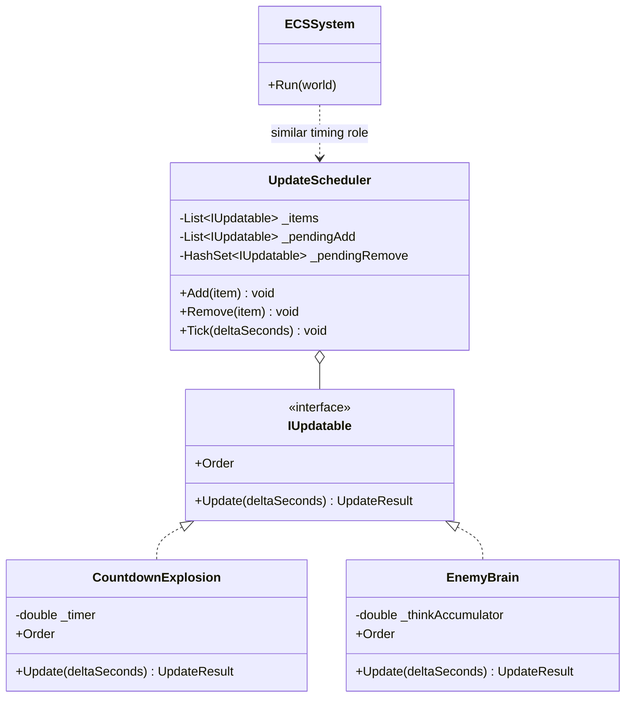

---
date: "2026-04-18"
title: "设计模式教科书｜Update Method：让对象自己在每帧里活下去"
description: "Update Method 不是把逻辑塞进每个对象的 Update 函数那么简单。它真正解决的是对象自驱动更新、调度顺序、删除时机和缓存局部性之间的平衡，并说明它为什么会被 ECS system update 逐步挤压。"
slug: "patterns-30-update-method"
weight: 930
tags:
  - "设计模式"
  - "Update Method"
  - "游戏引擎"
  - "软件工程"
series: "设计模式教科书"
---

> 一句话定义：Update Method 是把“这一帧我要怎么变”放回对象自己身上，再由统一调度器按顺序逐个推进的模式。

## 历史背景
Update Method 的历史，几乎和实时游戏的对象化一起长出来。早期引擎已经有统一的主循环，但要把“每个敌人、子弹、粒子、门、触发器各自怎么变化”写进同一套顺序里，最直接的办法就是给对象一个固定的更新入口。于是 `Update()`、`Tick()`、`Process()` 这类名字在不同引擎里反复出现。

它的本质是一种妥协：你还没有彻底转向 ECS，也没有把所有行为写成消息驱动或事件驱动，所以先让对象自己负责局部变化，再由中央调度器在每帧里调用它们。这样做的好处是直观，坏处是对象数量一大，顺序、删除、依赖和缓存都会开始发出噪音。

后来 ECS 之所以崛起，部分原因就是 Update Method 在对象数变多以后会变得太散。每个对象都在自己的方法里做判断、查组件、改状态，逻辑上虽然清楚，但数据在内存里却越来越碎。Update Method 这时就从“默认方案”变成“够用但不一定最快”的方案。

## 一、先看问题
先看一个很常见的坏实现：主循环里按类型分支，所有对象各自维护自己的计时器，但删除和排序都交给外层手工处理。

```csharp
using System;
using System.Collections.Generic;

public abstract class GameEntity
{
    public abstract bool Update(double deltaSeconds);
}

public sealed class Particle : GameEntity
{
    private double _lifeSeconds = 1.0;

    public override bool Update(double deltaSeconds)
    {
        _lifeSeconds -= deltaSeconds;
        return _lifeSeconds > 0;
    }
}

public sealed class Enemy : GameEntity
{
    private double _thinkTimer;
    private double _health = 10;

    public override bool Update(double deltaSeconds)
    {
        _thinkTimer += deltaSeconds;
        if (_thinkTimer > 0.5)
        {
            _thinkTimer = 0;
            _health -= 1;
        }

        return _health > 0;
    }
}

public static class BadLoop
{
    public static void Main()
    {
        var entities = new List<GameEntity> { new Enemy(), new Particle(), new Particle() };
        var frameTimes = new[] { 0.016, 0.016, 0.050, 0.016 };

        foreach (var dt in frameTimes)
        {
            for (int i = 0; i < entities.Count; i++)
            {
                var alive = entities[i].Update(dt);
                if (!alive)
                {
                    entities.RemoveAt(i);
                    i--;
                }
            }

            Console.WriteLine($"alive={entities.Count}");
        }
    }
}
```

这段代码能跑，但问题已经很明显了。

第一，更新顺序藏在容器里。你想让某个对象先更新、某个对象后更新，只能靠排序或者手工插队。

第二，删除时机危险。你在遍历中直接删，后一个对象会不会跳过，取决于你写得够不够小心。

第三，对象和调度强耦合。对象只知道自己该更新，但不知道何时被调度、何时被移除、何时进入下一阶段。

第四，缓存局部性差。每个对象都在堆上，虚拟调用加上散落指针，最后 CPU 读到的不是连续数据，而是一串跳转。

Update Method 的目的，就是把这套混乱收回来：对象自己负责行为，调度器负责秩序。

## 二、模式的解法
Update Method 的经典结构是：对象实现统一更新接口，调度器保存对象列表，在每帧里按稳定顺序调用它们，并且把删除延迟到本轮更新结束以后再统一处理。

它的关键不只是“调用 Update”，而是“谁来决定什么时候删、什么时候加、什么时候换序”。一旦这三件事分开，Update Method 才真正稳定。

下面是一个纯 C# 的实现。它展示了三件事：对象自驱动更新、稳定的更新顺序、以及延迟删除。

```csharp
using System;
using System.Collections.Generic;

public enum UpdateResult
{
    Keep,
    Destroy
}

public interface IUpdatable
{
    int Order { get; }
    UpdateResult Update(double deltaSeconds);
}

public sealed class UpdateScheduler
{
    private readonly List<IUpdatable> _items = new();
    private readonly List<IUpdatable> _pendingAdd = new();
    private readonly HashSet<IUpdatable> _pendingRemove = new();
    private bool _dirtyOrder = true;
    private bool _isUpdating;

    public void Add(IUpdatable item)
    {
        ArgumentNullException.ThrowIfNull(item);

        if (_isUpdating)
        {
            _pendingAdd.Add(item);
            return;
        }

        _items.Add(item);
        _dirtyOrder = true;
    }

    public void Remove(IUpdatable item)
    {
        ArgumentNullException.ThrowIfNull(item);

        if (_isUpdating)
        {
            _pendingRemove.Add(item);
            return;
        }

        _items.Remove(item);
    }

    public void Tick(double deltaSeconds)
    {
        FlushPendingAdds();

        if (_dirtyOrder)
        {
            _items.Sort((left, right) => left.Order.CompareTo(right.Order));
            _dirtyOrder = false;
        }

        _isUpdating = true;
        foreach (var item in _items)
        {
            if (_pendingRemove.Contains(item))
            {
                continue;
            }

            if (item.Update(deltaSeconds) == UpdateResult.Destroy)
            {
                _pendingRemove.Add(item);
            }
        }
        _isUpdating = false;

        if (_pendingRemove.Count > 0)
        {
            _items.RemoveAll(_pendingRemove.Contains);
            _pendingRemove.Clear();
        }
    }

    private void FlushPendingAdds()
    {
        if (_pendingAdd.Count == 0)
        {
            return;
        }

        _items.AddRange(_pendingAdd);
        _pendingAdd.Clear();
        _dirtyOrder = true;
    }
}

public sealed class CountdownExplosion : IUpdatable
{
    private double _timer = 1.0;
    public int Order { get; }

    public CountdownExplosion(int order) => Order = order;

    public UpdateResult Update(double deltaSeconds)
    {
        _timer -= deltaSeconds;
        Console.WriteLine($"explosion timer={_timer:F2}");
        return _timer <= 0 ? UpdateResult.Destroy : UpdateResult.Keep;
    }
}

public sealed class EnemyBrain : IUpdatable
{
    private double _thinkAccumulator;
    public int Order { get; }

    public EnemyBrain(int order) => Order = order;

    public UpdateResult Update(double deltaSeconds)
    {
        _thinkAccumulator += deltaSeconds;
        if (_thinkAccumulator >= 0.25)
        {
            _thinkAccumulator = 0;
            Console.WriteLine("enemy thinks");
        }

        return UpdateResult.Keep;
    }
}

public static class Demo
{
    public static void Main()
    {
        var scheduler = new UpdateScheduler();
        scheduler.Add(new EnemyBrain(order: 10));
        scheduler.Add(new CountdownExplosion(order: 20));

        var frameTimes = new[] { 0.016, 0.016, 0.050, 0.016, 0.016 };
        foreach (var dt in frameTimes)
        {
            scheduler.Tick(dt);
            Console.WriteLine("-- frame end --");
        }
    }
}
```

这份代码有意把“更新”和“调度”拆开。

- `IUpdatable.Update()` 只管对象自己怎么变。
- `UpdateScheduler` 只管顺序、添加、删除和本轮一致性。
- `UpdateResult.Destroy` 让对象可以把“我要死了”表达成返回值，而不是在迭代中自己把自己从容器里抹掉。

这就是 Update Method 的常见稳定形态。\n\n注意这里的稳定，不是“每个对象都想怎么更就怎么更”，而是“调度器让每个对象在同一时钟下更”。顺序、删除和插入都不再散落在对象内部，而是先由调度器统一收口，再把一帧的世界变化写回对象。这样做的好处是调试时能看清时间线，坏处是对象数变多以后，调度器开始承担更多管理成本。

## 三、结构图


## 四、时序图
```mermaid
sequenceDiagram
    participant Loop as Game Loop
    participant Scheduler as UpdateScheduler
    participant A as EnemyBrain
    participant B as CountdownExplosion

    Loop->>Scheduler: Tick(dt)
    Scheduler->>Scheduler: flush adds / sort
    Scheduler->>A: Update(dt)
    A-->>Scheduler: Keep
    Scheduler->>B: Update(dt)
    B-->>Scheduler: Destroy
    Scheduler->>Scheduler: remove destroyed items after iteration
    Scheduler-->>Loop: frame complete
```

## 五、变体与兄弟模式
Update Method 的变体，很多时候就是“谁来决定顺序”的不同答案。

- Plain Update List：最朴素的列表，所有对象按插入顺序每帧更新。
- Ordered Update：对象带优先级，调度器按顺序执行。
- Phase-based Update：拆成 `EarlyUpdate`、`Update`、`LateUpdate` 等阶段。
- Deferred Removal：对象先标记死亡，更新结束后统一删除。
- Nested Update：对象内部还能驱动子对象，这在场景树和 UI 树里很常见。

它最容易混淆的兄弟模式有两个。

- Game Loop 决定“帧怎么切”，Update Method 决定“对象怎么在这帧里活”。
- ECS system update 决定“系统按数据批处理”，它不是对象自驱动，而是数据驱动。

## 六、对比其他模式
| 维度 | Update Method | ECS System Update | Observer |
|---|---|---|---|
| 驱动方式 | 对象自己提供 Update | 系统批量处理一组数据 | 事件发生时通知订阅者 |
| 状态归属 | 主要放在对象里 | 主要放在组件数据里 | 状态不一定归属清晰，重点是通知 |
| 顺序控制 | 调度器按顺序调用对象 | 调度器按系统图和数据依赖运行 | 取决于订阅与分发顺序 |
| 适合规模 | 中小规模对象集合 | 大量同质对象 | 事件驱动的松耦合场景 |

Update Method 的优点是简单，ECS 的优点是数据局部性和批处理。你要的是让每个对象自己决定一点逻辑，还是让系统把同类数据一次扫完，这两个问题不一样。\n\n这也是为什么很多引擎会先走 Update Method，再慢慢把热点逻辑迁到 ECS。对象少的时候，`Update()` 比系统图更容易懂；对象很多的时候，散落的虚拟调用和指针跳转就会开始让 CPU 付费。两者不是谁打败谁，而是规模不同，成本模型就变了。

## 七、批判性讨论
Update Method 最大的批评，不是“它老”，而是“它会悄悄积累局部最优”。

第一，顺序耦合很隐蔽。A 先更新还是 B 先更新，很多时候不是文档决定，而是容器里谁先进入。到问题出现时，你才发现系统实际上依赖这个顺序。

第二，删除时机容易出 bug。对象在更新过程中死亡，但容器还在遍历它；你要么跳过，要么重复，要么把下一项漏掉。延迟删除能解决大部分问题，但也让对象“死后还活一轮”。

第三，缓存局部性差。每个对象都带着自己的状态、方法和可能的子引用，CPU 在对象之间跳来跳去。对象数量少时无所谓，数量一上万，间接调用和 cache miss 就开始变贵。

第四，它容易变成“每个类都有 Update，但没人知道谁在管谁”。一旦你把所有行为都塞进 `Update()`，调试就会变成追调用链和时间线。

## 八、跨学科视角
Update Method 可以从调度理论里理解。调度器按固定节拍轮询任务，而任务自己负责推进。它有点像协作式多任务，但不会像线程那样抢占。

从计算机体系结构看，Update Method 里的问题常常不是算术，而是内存布局。`List<IUpdatable>` 的遍历如果配上大量虚拟调用和堆对象，会比平铺数组更容易碰到 cache miss。ECS 的价值就在这里：它把数据按访问模式重排了。\n\nBevy 和 EnTT 都在用不同方式证明这件事。前者把系统和 schedule 做成可组合的运行图，后者把实体、组件和查询做成高局部性的存储结构。Update Method 负责“每个对象怎么自己动”，ECS 负责“数据怎么被一批一批地动”。\n\n在实践中，Update Method 往往会和局部批处理一起用。比如粒子对象可以按类型分组，动画对象可以按阶段调度，UI 控件可以按可见性跳过更新。你不必一下子切到 ECS，但至少可以先把“每帧都要更新”的对象和“只有条件满足才更新”的对象分开。\n\n这一步非常关键，因为它能把热点对象从冷对象里拆出来。真正吃帧的，往往不是所有实体，而是那一小批每帧都必须碰的对象。只要你愿意把它们单独放进一个列表，缓存行为和分支预测就会明显好一些。\n\n这也是很多引擎内部会维护多个更新列表的原因：摄像机一类对象、物理对象、UI 对象、特效对象，各自有不同节拍。把它们分开以后，调度器就不需要每一帧都对全部对象做同样的判断，而是只处理应该处理的那一批。

从控制系统角度看，Update 是离散控制器的一次采样。你每帧给对象一次机会改变状态，和给传感器一次采样非常像。采样频率、顺序和延迟，都会影响最终表现。

## 九、真实案例
Unreal 的 Tick 体系是 Update Method 的教科书级实例。`AActor::Tick` 文档写明它每帧调用，`Actor ticking` 文档还说明了 tick groups、最小 tick interval、以及组件 tick 的顺序。`FActorTickFunction` 和 `FActorComponentTickFunction` 则把对象和组件的更新函数拆开。相关文档分别见 `https://dev.epicgames.com/documentation/en-us/unreal-engine/API/Runtime/Engine/GameFramework/AActor/Tick`、`https://dev.epicgames.com/documentation/en-us/unreal-engine/actor-ticking`、`https://dev.epicgames.com/documentation/en-us/unreal-engine/API/Runtime/Engine/Engine/FActorTickFunction`、`https://dev.epicgames.com/documentation/en-us/unreal-engine/API/Runtime/Engine/Engine/FActorComponentTickFunction`。

Godot 的 `_process()` 和 `_physics_process()` 也很典型。官方文档直接把它们定义成每帧和固定频率的更新入口，节点可以按需开启或关闭这些回调。见 `https://docs.godotengine.org/en/4.5/tutorials/scripting/idle_and_physics_processing.html`。它说明 Update Method 在现代引擎里通常不是单一入口，而是多个阶段的回调集合。\n\nUnity 的 PlayerLoop 进一步把这件事暴露成结构化阶段，而不是单纯的 `Update()` 回调。它给开发者的启发是：真正重要的不是“有没有更新函数”，而是“更新函数属于哪一段，前后依赖是什么，能不能被插到正确的位置”。

Unity 则把主循环暴露成 `PlayerLoop`。官方 Scripting API 说明你可以获取默认更新顺序，也可以插入、重排或替换系统。见 `https://docs.unity.cn/ScriptReference/LowLevel.PlayerLoop.html` 和 `https://docs.unity3d.com/ja/current/Manual/player-loop-customizing.html`。这意味着 Unity 的 Update Method 不只是 `Update()` 回调，而是完整的可编程时间链。

Bevy 的 `examples/ecs/fixed_timestep.rs` 可以作为对照。它说明当更新对象越来越多时，系统调度会开始替代对象直更：你不再更新每个对象，而是更新满足条件的一组数据。相关调度文档见 `https://docs.rs/bevy/latest/bevy/ecs/schedule/index.html`。这正是 Update Method 走向 ECS 的分水岭。

从长期维护的角度看，Update Method 还承担着“节奏统一器”的作用。你可以把摄像机、玩家、AI、粒子和 UI 各自放进不同的更新阶段，然后让调度器保证阶段之间的先后关系。这样一来，某些对象看到的是上一阶段的结果，某些对象看到的是已经收敛的结果，时序问题就不再藏在对象内部。

它在工具链里也常被当成分界线。性能分析器可以按更新阶段统计耗时，调试器可以按对象列表定位卡帧源头，编辑器可以在暂停时只跑一部分阶段。也就是说，Update Method 不只是游戏逻辑入口，还是一个很适合插埋点、插观察器、插热重载的时间支点。

如果项目后来迁到 ECS，这些阶段也不会白费。你可以把早期的 Update 阶段直接映射成若干系统集，再把最热的阶段拆出去。这样迁移的收益，不只是性能，还有可维护性，因为原来在对象身上的隐式时序，终于有机会被系统图显式表达出来。
调度器如果做得好，还能顺便成为性能观测点。你可以在这里记录每个阶段的耗时、每类对象的更新次数、以及某些对象是否被频繁跳过。这样一来，Update Method 不只是行为入口，也成了 profiling 的天然切片。

它还能帮助你在重构时做分段迁移。先保留对象 Update，再把最热的那部分抽出去，最后只留下少量稳定的壳。这个过程不会像一次性迁 ECS 那样激烈，但它能让团队在不推翻旧代码的前提下，把最慢的路径逐步收窄。
Update Method 的边界也不只是“对象自己会更新”这么简单。真正麻烦的是移除时机：对象在 `Update()` 里请求销毁时，调度器不能立刻从遍历容器里删掉它，否则就会踩到枚举失效；更稳的做法是先标记，再在帧末统一回收。ECS 之所以常常更快，不只是因为少了虚调用，而是它把同类系统的工作变成连续扫描，顺手把“调度顺序、失效删除、批处理”都收回到同一层。Update Method 则更像过渡层：它先把行为从主循环里拆出来，再把工程慢慢推向更规整的批处理模型。
另一个常被忽略的细节，是 Update Method 也是“稳定观察点”。当对象都自己更新时，性能问题、顺序问题、竞态问题都会集中暴露在这一层：谁先执行、谁后执行、谁在本帧末尾才真正退出，都会直接影响可复现性。成熟的调度器会把这些策略显式分层，比如输入、模拟、后处理、清理各走各的阶段；这样一来，统计、调试和回放才有了统一入口。它和 ECS 的差别也在这里：ECS 把大规模批处理当主角，Update Method 更像给零散对象一条最小侵入的过渡通道，适合从面向对象逐步迁往更结构化的执行模型。
从实现层面看，Update Method 的热路径常常不是“调用次数”本身，而是对象布局。把同类更新对象放在连续内存里，往往比把它们散在各处再靠虚调用串起来更容易压中缓存；所以很多引擎最后都会把“对象驱动”保留给表达层，把“批处理”交给系统层。这个分工不是理念之争，而是 CPU 访问模式决定的。
最后，Update Method 还有一个实际价值：它能把“调度顺序”暴露成可配置策略，方便团队在原型、战斗、回放和服务器权威模拟之间切换，而不用重写对象逻辑。
这一点在联网对战和回放系统里尤其关键。
这比把逻辑硬塞进全局主循环更容易做版本隔离。
也稳。
## 十、常见坑
- 在 `foreach` 中直接删对象，导致跳过元素或抛异常。
- 把所有对象都设成同一顺序，最后才发现某些前置条件根本没保证。
- 让对象自己排序自己，结果顺序逻辑散落全局。
- 更新里做重型加载或阻塞 I/O，直接把帧预算打爆。
- 把 Update 当成万能入口，什么初始化、销毁、网络、资源加载都塞进去。

## 十一、性能考量
Update Method 的复杂度通常是 `O(n)`，`n` 是活跃对象数量。真正拉开差距的，不是这个大 O，而是数据布局。

- `List<T>` 的顺序遍历比链表更适合 CPU 预取。
- 虚拟调用会把每个对象的更新变成一次间接跳转，分支预测不一定吃得准。
- 如果更新顺序需要稳定，排序成本可能是 `O(n log n)`，但可以通过分阶段和预分组把它降下来。
- 延迟删除通常是 `O(1)` 标记加 `O(n)` 清理，换来的是遍历期间的安全性。

和 ECS 比，Update Method 的最大问题不是“慢”，而是“很难把同类数据凑在一起批处理”。如果对象数只有几十或几百，差别无所谓；如果你在一帧里要更新成千上万个同类型对象，数据局部性就会开始决定上限。

## 十二、何时用 / 何时不用
适合用：

- 对象数量不大，但行为种类多。
- 你想让对象自己控制局部状态变化。
- 团队还不准备上完整 ECS。
- 需要快速读懂和调试更新逻辑。

不适合用：

- 同质对象数非常多，性能已经卡在内存访问上。
- 你需要高度并行或批处理。
- 更新顺序复杂到必须被显式建模成系统图。

## 十三、相关模式
- [Game Loop](./patterns-29-game-loop.md)
- [Observer](./patterns-07-observer.md)
- [Strategy](./patterns-03-strategy.md)
- [ECS 架构](./patterns-39-ecs-architecture.md)
- [Scene Graph](./patterns-40-scene-graph.md)

## 十四、在实际工程里怎么用
实际工程里，Update Method 适合放在玩法对象、动画对象、UI 控件、临时特效和轻量管理器上。它特别适合让一个对象自己把“这帧要做的事”讲清楚，然后由统一调度器维护秩序。

教科书线讲的是对象自驱动更新；应用线才会落到 Unity `Update`、Unreal Tick、Godot `_process()`、或者自定义主循环中的更新阶段。对应的应用线文章可以放在 `../../engine-core/update-method-application.md`。

## 小结
- Update Method 的核心是对象自驱动，但调度顺序、删除时机和批处理仍然归调度器管。
- 它简单、直观、易调试，但规模上来后会遇到缓存局部性和顺序耦合问题。
- 它是 ECS system update 的前身和对照物，理解它才能看懂后者为什么更适合大规模数据。


