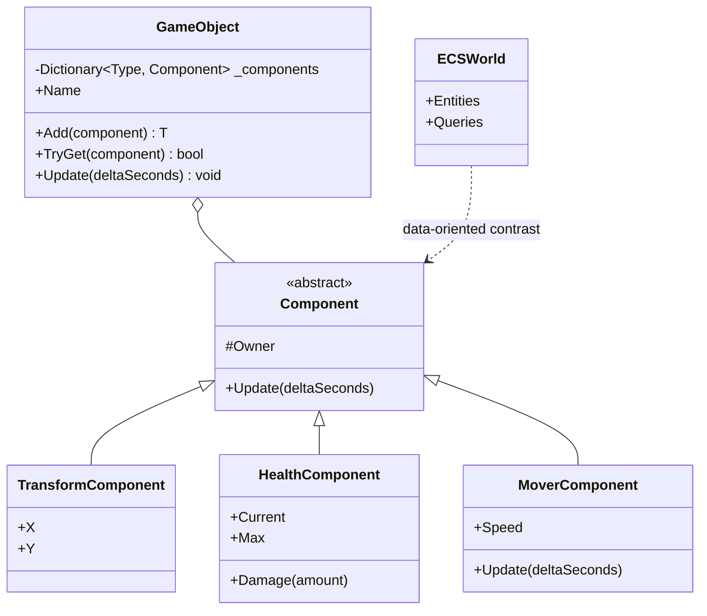

---
date: "2026-04-18"
title: "设计模式教科书｜Component：组合优于继承的真正含义"
description: "Component 不是简单的把类拆成小类。它真正解决的是功能组合、行为复用、对象装配和依赖边界的重组。本文从经典组件模型一路讲到 ECS 和 DI，说明什么时候该组合，什么时候该把数据和行为再拆开。"
slug: "patterns-31-component"
weight: 931
tags:
  - "设计模式"
  - "Component"
  - "游戏引擎"
  - "软件工程"
series: "设计模式教科书"
---

> 一句话定义：Component 是把对象的能力拆成可插拔的小块，再由容器把它们组装起来的模式。

## 历史背景
“组合优于继承”不是一句口号，它是对类层级膨胀的反击。早期面向对象设计一旦把能力写进继承树，类名就会开始像乘法：飞行敌人、爆炸敌人、可开火飞行敌人、可开火爆炸飞行敌人。你想加一个新能力，不得不在树上找一条最不坏的路径，然后在那条路径里继续堆虚函数。

Component 的重要性，恰恰来自这次反击。它不是为了让类图变得好看，而是为了把“这个对象拥有什么能力”从“这个对象继承了谁”里解耦出来。只要能力可以组合，设计空间就会大很多：你可以晚一点决定对象会不会飞，也可以在运行时决定它到底要不要渲染、碰撞、受伤或者发声。

这件事在编辑器系统里尤其明显。一个空对象本身没有很多语义，但一旦挂上 Transform、Camera、Renderer、Collider、Audio、Script 这些组件，它就能从“容器”变成“角色”。组件化设计的价值，不只是避免继承树爆炸，更是让对象的能力可以被人类直接编辑、调试和装配。

UI 和工具系统也会用同样的办法。按钮、面板、输入框、滚动条，本质上都是组件的组合。组件化让“复用”变成了装配，而不是继承一个巨大的基类以后再覆盖一堆虚函数。

这也解释了为什么很多引擎把 Transform 视作最基础的组件。位置、旋转、缩放和父子关系先被标准化以后，上层的渲染、物理和脚本才能站在同一个空间语义上说话。没有这个公共组件，很多系统都会各写一套坐标系转换。

Component 模式的出现，就是为了把这种“能力组合”从继承树里挪出来。对象不再必须通过父类共享行为，而是通过挂载组件获得能力。UI 框架、桌面组件、游戏对象、编辑器插件，都在不同时间重新发现了这件事。Unity、Unreal、Godot 以及各种现代引擎，几乎都在重复同一个经验：一个对象可以不是什么都懂，但它可以装上懂某件事的组件。

后来 ECS 把这件事推得更远。经典组件模型还保留“对象是中心”的语义，ECS 则把中心换成实体标识和数据布局。两者看起来像一条线，实际上中间有一道深沟：一个重行为复用，一个重数据组织。

## 一、先看问题
先看一段过度继承的坏代码。它看起来像经典 OO，实际上已经把功能组合锁死了。

```csharp
using System;

public abstract class EnemyBase
{
    public virtual void Move() { }
    public virtual void Attack() { }
    public virtual void Jump() { }
    public virtual void Fly() { }

    public void Update(double dt)
    {
        Move();
        Attack();
        Jump();
        Fly();
    }
}

public sealed class FlyingEnemy : EnemyBase
{
    public override void Fly() => Console.WriteLine("fly");
}

public sealed class FlyingExplodingEnemy : FlyingEnemy
{
    public override void Attack() => Console.WriteLine("explode");
}

public sealed class FlyingExplodingBossEnemy : FlyingExplodingEnemy
{
    public override void Move() => Console.WriteLine("boss move");
}
```

这段代码的问题不是“继承不好”，而是能力组合的自由度被锁死了。

第一，你为了获得飞行能力，顺手继承了攻击、移动、跳跃的默认行为。很多方法其实只是空壳。

第二，你为了加一个新能力，往往要再切一条子类路径。最后类名越来越长，组合关系越来越难看。

第三，行为和装配被绑死。你想让一个敌人既会飞又会隐身，但不会攻击，树上可能根本没有这种分支。

Component 模式的思路，是把能力拆成独立部件，然后在对象上组装。

## 二、模式的解法
经典组件模型的核心很朴素：容器对象负责身份和生命周期，组件负责能力，容器通过添加、移除、查询和更新，把这些能力拼起来。

它的好处在于，能力不再要求继承关系。飞行、移动、受伤、发声、脚本、渲染、碰撞，都可以成为独立组件。一个对象需要什么，就挂什么；不需要什么，就不挂。

下面是一个纯 C# 的经典组件模型。它不是 ECS，仍然保留“对象是中心”的语义，但已经足够说明 Component 的本质。

```csharp
using System;
using System.Collections.Generic;

public abstract class Component
{
    protected GameObject? Owner { get; private set; }

    internal void Attach(GameObject owner) => Owner = owner;
    public virtual void Update(double deltaSeconds) { }
}

public sealed class GameObject
{
    private readonly Dictionary<Type, Component> _components = new();
    public string Name { get; }

    public GameObject(string name) => Name = name;

    public T Add<T>(T component) where T : Component
    {
        ArgumentNullException.ThrowIfNull(component);
        var type = typeof(T);
        if (_components.ContainsKey(type))
        {
            throw new InvalidOperationException($"Component {type.Name} already exists on {Name}");
        }

        component.Attach(this);
        _components[type] = component;
        return component;
    }

    public bool TryGet<T>(out T? component) where T : Component
    {
        if (_components.TryGetValue(typeof(T), out var found))
        {
            component = (T)found;
            return true;
        }

        component = null;
        return false;
    }

    public void Update(double deltaSeconds)
    {
        foreach (var component in _components.Values)
        {
            component.Update(deltaSeconds);
        }
    }
}

public sealed class TransformComponent : Component
{
    public double X { get; set; }
    public double Y { get; set; }
}

public sealed class HealthComponent : Component
{
    public double Current { get; private set; }
    public double Max { get; }

    public HealthComponent(double max)
    {
        if (max <= 0) throw new ArgumentOutOfRangeException(nameof(max));
        Max = max;
        Current = max;
    }

    public void Damage(double amount)
    {
        Current = Math.Max(0, Current - amount);
        Console.WriteLine($"{Owner?.Name} health={Current:F1}");
    }
}

public sealed class MoverComponent : Component
{
    public double Speed { get; set; } = 2.0;

    public override void Update(double deltaSeconds)
    {
        if (Owner is null)
        {
            return;
        }

        if (!Owner.TryGet<TransformComponent>(out var transform) || transform is null)
        {
            return;
        }

        transform.X += Speed * deltaSeconds;
    }
}

public sealed class LifetimeComponent : Component
{
    private double _remainingSeconds;

    public LifetimeComponent(double seconds)
    {
        if (seconds < 0) throw new ArgumentOutOfRangeException(nameof(seconds));
        _remainingSeconds = seconds;
    }

    public override void Update(double deltaSeconds)
    {
        _remainingSeconds -= deltaSeconds;
        if (_remainingSeconds <= 0)
        {
            Console.WriteLine($"{Owner?.Name} expired");
        }
    }
}

public static class Demo
{
    public static void Main()
    {
        var ship = new GameObject("ScoutShip");
        ship.Add(new TransformComponent());
        ship.Add(new MoverComponent { Speed = 5.0 });
        ship.Add(new HealthComponent(100));
        ship.Add(new LifetimeComponent(1.5));

        var frameTimes = new[] { 0.016, 0.016, 0.050, 0.016 };
        foreach (var dt in frameTimes)
        {
            ship.Update(dt);
            ship.TryGet<TransformComponent>(out var transform);
            Console.WriteLine($"x={transform?.X:F2}");
        }
    }
}
```

这份代码说明了经典组件模型的三个层次。

它还有一个更现实的意义：容器负责对象身份，组件负责行为碎片，装配时机则决定对象怎么长成最终形态。对于编辑器驱动的项目，这种装配能力极其重要，因为关卡设计师往往不是在写代码，而是在拼对象。Component 的价值就在于把“拼对象”变成一等操作。

- 容器负责拥有者身份和生命周期。
- 组件负责单一能力。
- `Update()` 把能力统一调度起来。

它还保留了一个重要事实：组件之间仍然可以互相查找。经典组件模型的耦合，往往比 ECS 高，但也比纯继承树更灵活。

## 三、结构图


## 四、时序图
```mermaid
sequenceDiagram
    participant Loop as Game Loop
    participant Obj as GameObject
    participant Move as MoverComponent
    participant Xform as TransformComponent
    participant Health as HealthComponent

    Loop->>Obj: Update(dt)
    Obj->>Move: Update(dt)
    Move->>Xform: read/write position
    Move-->>Obj: done
    Obj->>Health: component owns durability
    Health-->>Obj: keep / update state
    Obj-->>Loop: frame complete
```

## 五、变体与兄弟模式
Component 这一家并不只有一种长相。

- Classic Component Model：对象是中心，组件挂在对象上，常见于 Unity、Unreal 的 Actor 体系。
- Web Component / UI Component：组件更偏可复用视图单元，能力边界与数据边界未必一致。
- Scene Graph Component：组件和层级结构一起用，常见于 Transform、节点树和父子继承。
- ECS：把组件降成纯数据，把行为提到系统里，是 Component 的数据导向极端。
- DI Container：解决对象怎么组装，不解决对象怎么表现。它和 Component 常一起出现，但职责不同。

Component 的兄弟模式也很近：

- Observer 管通知，Component 管能力；前者解决事件传播，后者解决功能组合。
- Strategy 管算法替换，Component 管能力挂载；前者更偏行为替换，后者更偏对象装配。
- Scene Graph 管层级关系，Component 管附加能力；二者经常一起出现，但不是一回事。

## 六、对比其他模式
| 维度 | 继承 | 经典组件模型 | ECS | DI |
|---|---|---|---|---|
| 关注点 | 代码复用和类型层级 | 能力拆分和对象装配 | 数据布局和批处理 | 对象构造和依赖注入 |
| 状态归属 | 放在父子类里 | 分散在组件里 | 放在组件数据里 | 不负责业务状态归属 |
| 适合场景 | 维度少、层级稳定 | 需要灵活组合能力 | 大规模同质实体 | 需要解耦构造和依赖 |
| 主要风险 | 子类爆炸、空方法 | 组件互相耦合 | 学习成本和调试门槛 | 被误当成架构总答案 |

最常见的误判，是把 DI 当成 Component 的替代品。DI 只解决“我怎么拿到这个对象”，不解决“这个对象由哪些能力拼成”。

ECS 也不是经典组件模型的同义词。经典组件模型仍然以对象为中心，ECS 则以数据和系统为中心。前者好读、好装配；后者好批处理、好并行。

## 七、批判性讨论
Component 这个模式，听起来很像“万金油”，实际上也有明确边界。

只要组件之间开始互相查找、互相调用，耦合就会重新冒出来，只是换了一个位置。你原本想拆的是能力，现在拆出来的可能只是更多间接层。Component 解决的是“如何组合能力”，不是“如何消灭所有依赖”。它仍然需要约束、校验和装配规则。

第一，组件并不自动带来解耦。只要组件之间互相查找、互相调用，耦合只是从继承树转到了运行时。

第二，容器很容易膨胀成神对象。一个对象挂了十几个组件，初始化、序列化、调试、热重载都会变得更复杂。

第三，组合不等于没有约束。某些组件只能和特定组件一起用，某些组合在运行时才发现不成立，最后你还是要靠校验和约束体系兜底。

第四，经典组件模型在性能上不一定友好。对象和组件如果都靠堆分配，缓存命中就会比 ECS 差一截。它能换来灵活性，但不能免费拿到批量效率。

## 八、跨学科视角
Component 和类型系统有天然关系。一个对象挂了哪些组件，实际上就是它拥有了哪些能力的集合。这很像类型上的交集或积类型：一个实体不靠继承层级定义自己，而靠能力组合定义自己。

在 UI 世界里，这个思想会变成“组合小部件”。一个按钮不需要知道自己是不是某个超类，只需要装上文本、点击、样式、状态和布局能力。

在函数式或模块化设计里，Component 也像可插拔的纯函数块。每个组件只做一件事，容器把它们编排起来。这和依赖注入相似，但 Component 更强调运行时能力，而 DI 更强调构造时 wiring。

## 九、真实案例
Unity 是经典组件模型最广为人知的例子。官方手册明确写道，GameObject 本身做不了多少事，它只是 Components 的容器；组件才实现真正功能。Transform 是每个 GameObject 默认持有的组件，Mesh Renderer、Box Collider、Camera 这类功能都是通过追加组件实现的。相关页面见 `https://docs.unity3d.com/ru/2019.4/Manual/GameObjects.html` 和 `https://docs.unity3d.com/cn/2020.3/Manual/UsingComponents.html`。

Unreal 的 `UActorComponent` 则说明了另一种成熟的组件模型。官方 Python/C++ 文档写明，ActorComponent 是可以附加到不同 Actor 上的可复用行为基类；如果组件带变换，则会成为 SceneComponent；如果能渲染，则会成为 PrimitiveComponent。相关文档见 `https://dev.epicgames.com/documentation/en-us/unreal-engine/python-api/class/ActorComponent?application_version=5.0`、`https://dev.epicgames.com/documentation/en-us/unreal-engine/API/Runtime/Engine/Components/UActorComponent/SetAutoActivate` 和 `https://dev.epicgames.com/documentation/en-us/unreal-engine/API/Runtime/Engine/Components/UActorComponent/SetupActorComponentTickFunction`。

EnTT 则把 Component 推向 ECS 方向。其 Wiki 的 `Entity Component System` 页面直接说明：Registry 管实体和组件，组件是任意类型，系统是普通函数或 functor；同时还介绍了 sparse set 存储和按需注册。见 `https://github.com/skypjack/entt/wiki/Entity-Component-System`。这就是从经典组件模型走向 ECS 的自然过渡。

Bevy 的 `bevy_ecs::component` 文档则把组件的含义说得很清楚：组件是存储在 `World` 里的数据类型，实体关联的是一组组件，而系统则处理这些组件。见 `https://docs.rs/bevy/latest/bevy/ecs/component/index.html`、`https://docs.rs/bevy/latest/bevy/ecs/component/trait.Component.html` 和 `https://docs.rs/bevy_ecs/latest/bevy_ecs/component/index.html`。Bevy 证明了 Component 这件事在 Rust 世界里同样可以走数据导向路线。

真正把 Component 用顺手，靠的不是‘挂上去就行’，而是把装配边界和生命周期边界一起设计好。组件什么时候创建、什么时候激活、什么时候停用、什么时候销毁，必须和实体生命周期同步，否则资源释放、事件解绑和依赖解析都会互相打架。这个点上，Component 和 DI 的分工很清楚：DI 负责把对象织进来，Component 负责把能力跑起来；而和 ECS 的分界也很清楚：ECS 关心的是批量数据怎么跑得快，经典 Component 关心的是单个实体怎么装得稳。这也是它比 DI 更贴近运行时装配的地方。

组件化在工程里还有一个常被低估的收益：它让对象可以被工具链理解。一个组件能不能被序列化、能不能被热重载、能不能在编辑器里显示默认值、能不能做版本迁移，这些都直接影响项目后期的维护成本。Component 一旦进了工具链，就不再是纯代码结构，而是内容生产流程的一部分。

这也是为什么组件化系统常常会配套校验器和装配规则。某些组件必须一起出现，某些组件不能同时出现，某些组件在父对象变化时要同步刷新。没有这些约束，组件数量一多，系统就会变成“能挂上去，但不一定跑得对”的状态。组件不是把问题消掉，而是把问题放到一个更容易被约束的位置。

从团队分工看，这种模式也很现实。程序员写组件，策划拼组件，TA 维护资源和默认值，QA 复现组合场景。Component 的真正价值，就是把原本要靠继承树和手写分支解决的问题，变成可视化、可配置、可审计的组合问题。
Component 的边界感同样重要。组件不是把任意职责切碎再贴回对象上，而是把“能独立复用、能单独测试、能被工具识别”的能力装进可组合单元。DI 解决的是对象依赖怎么装配，Component 解决的是行为和状态怎么挂载到实体上；两者都讲组合，但关注点不同。前者偏依赖图，后者偏运行时装配和编辑器可视化。组件拆得太碎，最后会把简单逻辑拆成跨文件跳转；拆得太粗，又会把复用和迁移锁死在继承树里。真正实用的分界线，往往不是抽象层级，而是团队能否稳定理解、配置和调试它。
再进一步说，Component 还牵涉到工具链。一个组件如果不能被序列化、不能被编辑器发现、不能被测试替身替换，它就只是在类层次里换了个名字，并没有真正获得组合的自由。经典组件模型靠运行时装配解决“功能可拼装”，ECS 靠数据表和系统扫描解决“规模可扩展”，DI 则把“对象怎么创建”与“对象怎么使用”切开。三者都能减少继承树压力，但落点不同：组件强调实体外观上的可组合性，ECS 强调数据局部性和批处理，DI 强调依赖生命周期。把这三者混成一锅，最容易出现的结果就是接口很多、层次很乱、谁都不好调试。
工具链也决定了 Component 能不能落地。编辑器里能否拖拽、序列化里能否重建、测试里能否单独替换，都会影响组件是否真正可维护。组件设计得好，代码和内容团队都能围着它工作；设计得差，最后就会变成“继承树上挂一堆开关”，看上去灵活，实际上没人敢改。
## 十、常见坑
- 把容器写成新的上帝对象，最后所有组件都依赖它。
- 让组件彼此直接调用，结果组件之间开始成网状耦合。
- 把组件当配置袋，什么字段都往里塞，最后失去职责边界。
- 组件数量很多，但查询和装配逻辑仍然用线性搜索，性能很快掉下去。
- 把 ECS 和经典组件模型混为一谈，调优目标和数据布局全都错位。

## 十一、性能考量
Component 的性能取决于你把它放在什么层次上。

- 经典组件模型通常是 `O(c)` 的组件查找，`c` 是挂在对象上的组件数。
- 如果容器内部用哈希表索引，查询可能接近 `O(1)`，但会付出额外内存和哈希开销。
- 如果组件之间高度交叉访问，缓存命中率会受到堆布局影响，尤其是对象数变多以后。
- ECS 之所以快，是因为它把同类组件集中存放，系统按连续内存批处理，而不是因为“有 ECS 这个名字”。

更进一步说，ECS 把组件从“对象的附属品”变成“世界中的数据单元”。Bevy 的 `Component` 文档、EnTT 的 sparse set 设计都说明了这一点：组件一旦被数据化，查询、过滤、并行和增量更新就都好做得多。但代价也明显：阅读成本、抽象成本和调试路径都会更硬。

换句话说，Component 适合灵活性优先的场景；ECS 适合吞吐优先的场景。你不应该只看 API 的外形，而要看数据到底怎么排布。

## 十二、何时用 / 何时不用
适合用：

- 你要把一个对象的能力拆成若干可选部件。
- 你希望组合优先于继承，而不是让继承树继续变深。
- 你需要运行时装配、热插拔、编辑器可视化配置。
- 对象规模中等，性能不是最紧的瓶颈。

不适合用：

- 所有行为都已经数据化，批处理更重要。
- 组件之间的关系太复杂，运行时约束很难维护。
- 你需要极高的吞吐和极强的缓存局部性。

## 十三、相关模式
- [Observer](./patterns-07-observer.md)
- [Strategy](./patterns-03-strategy.md)
- [Game Loop](./patterns-29-game-loop.md)
- [ECS 架构](./patterns-39-ecs-architecture.md)
- [Scene Graph](./patterns-40-scene-graph.md)

## 十四、在实际工程里怎么用
在实际工程里，Component 常用于角色能力、UI 行为、编辑器插件、物体属性和可热插拔功能。它给团队一个很实用的中间态：不用马上上 ECS，也不用把所有东西塞回继承树。

教科书线讲的是能力组合的原理；应用线才会落到 Unity `GameObject`、Unreal `ActorComponent`、编辑器面板、或者自定义对象容器。对应的应用线文章可以放在 `../../engine-core/component-application.md`。

在落地层面，Component 最常见的胜利，不是“类型更优雅”，而是“团队更容易协作”。设计师能拼装，程序员能写组件，策划能调参数，QA 能复现实例。只要装配边界清楚，组件化就会把大量沟通成本压回到工具和数据上，而不是压给继承树。

真正成熟的组件化项目，往往会把组件序列化、版本迁移、默认值和依赖检查都做成工具链的一部分。这样一来，组件不只是运行时代码块，还是关卡、资源和编辑器之间的共同语言。

这也是为什么“组件模式”经常和插件系统、编辑器面板、数据资产一起出现。只要你希望某个能力能被单独启停、单独配置、单独回放，组件化就会比继承树更自然。

实际项目里，Component 最有价值的地方往往不是“能挂很多东西”，而是“能把热插拔和可视化装配做成常规工作流”。一旦设计师、策划和程序都能围绕同一套组件协作，很多原本要写死在子类里的东西，就会变成配置和组合。

## 小结
- Component 把能力从继承树里抽出来，让对象通过组合获得功能。
- 它比继承灵活，比 ECS 更容易读，但在大规模数据和缓存局部性上不如 ECS。
- 真正重要的不是“能挂组件”，而是容器、约束和调度三者是否配套。


