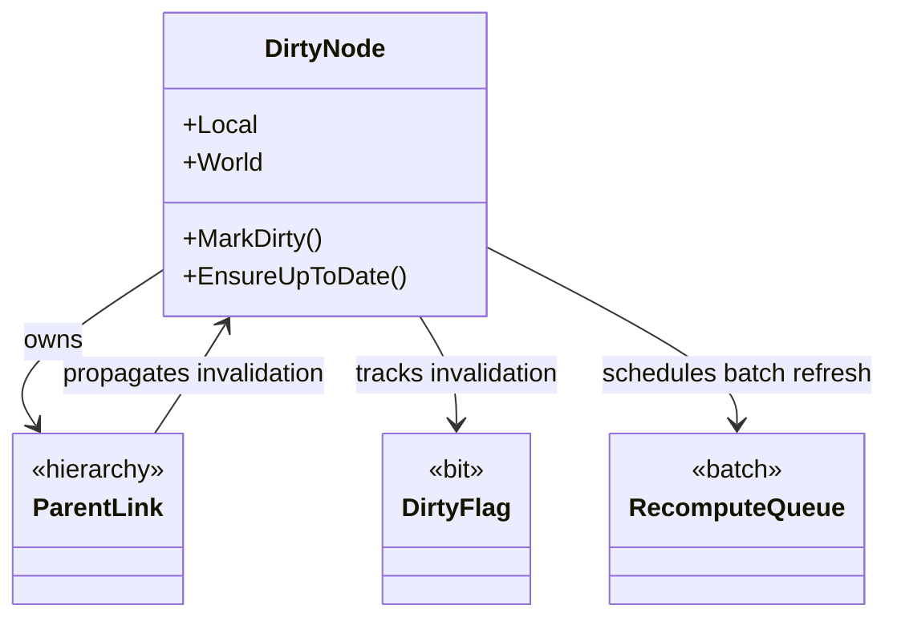
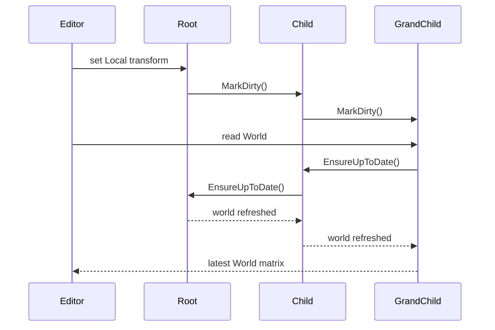

---
date: "2026-04-17"
title: "设计模式教科书｜Dirty Flag：把昂贵计算推迟到真正需要的时候"
description: "Dirty Flag 通过脏标记、失效传播和批量重算，把一连串重复更新压缩成一次按需计算。它特别适合层级变换、缓存派生值、骨骼、UI 布局和物理前置计算。"
slug: "patterns-32-dirty-flag"
weight: 932
tags:
  - "设计模式"
  - "Dirty Flag"
  - "软件工程"
  - "游戏引擎"
series: "设计模式教科书"
---

> 一句话定义：Dirty Flag 通过“先标记、后重算”把重复的派生计算压成一次集中刷新。

## 历史背景

Dirty Flag 是引擎工程里非常典型的一类模式：它不追求酷，追求省。早期游戏和图形系统里，最常见的派生值就是 transform、bounding box、骨骼矩阵、可见性结果和布局结果。只要父节点或输入变化，相关派生值就得重算；但重算这件事往往比“改一个值”贵得多。

如果每次改值都立刻把所有下游算一遍，系统会陷入重复工作。树越大，重复越多。Dirty Flag 的历史价值就在这里：它把“变化”与“计算”分开，让系统先记住哪里脏了，等真正要读结果时再统一重算。这样做并不是偷懒，而是避免在一次编辑过程中触发多次无意义更新。

它和缓存不是一回事。缓存关注“已有结果能不能复用”，Dirty Flag 关注“结果何时失效、何时重算”。它也和 memoization 不完全一样。memoization 是按函数输入记忆输出，Dirty Flag 更像对象图里的失效传播。你可以把它看成“结构化缓存失效”，但它比一般缓存更强调层级和批处理。

现代引擎、UI 框架和布局系统仍然离不开它。只要你的系统里存在“一个输入变化，多个派生值要更新”的结构，Dirty Flag 就还是最便宜也最可靠的手段之一。只是现代实现通常会更显式地分层：状态变更、脏传播、批处理刷新、读取时惰性重算，各自分开。`n`n现代实现已经把它从“树上打个脏位”扩展成“依赖图失效治理”。场景树当然还在用，但同样的机制也出现在 UI 布局、骨骼矩阵、遮挡剔除、资源绑定、增量编译和 ECS 派生缓存里。现代引擎往往不会只维护一个 dirty bool，而是维护多级脏位：本地变换脏、世界变换脏、包围盒脏、渲染状态脏、物理状态脏。不同脏位对应不同刷新阶段，这样能避免“一处变化，全系统都重算”的粗粒度失效。`n`n这也是 Dirty Flag 和事件驱动不同的地方。事件驱动强调“谁来听到变化”，Dirty Flag 强调“谁依赖这份派生值”。在引擎里，这个差别很关键：一个 transform 改了，不是所有子系统都要立刻跑，而是先把相关缓存标脏，等渲染、物理或编辑器真正要读时再按需刷新。这样做让同一次拖拽、同一次批量导入、同一次骨骼重定向中的多次小改动，可以被压缩成一次结果重建。

## 一、先看问题

看一个典型场景：场景树里每个节点都有本地变换和世界变换。父节点移动后，所有子节点的世界矩阵都变了。如果你每次改父节点都立刻递归重算所有子节点，编辑器拖动一个根节点就会非常重。

坏代码往往长这样：每次 setter 都直接往下重算。简单是简单，代价也直接写在每一次操作里。

```csharp
using System;
using System.Collections.Generic;
using System.Numerics;

public sealed class NaiveTransformNode
{
    private Matrix4x4 _local = Matrix4x4.Identity;
    private Matrix4x4 _world = Matrix4x4.Identity;

    public NaiveTransformNode? Parent { get; private set; }
    public List<NaiveTransformNode> Children { get; } = new();

    public Matrix4x4 Local
    {
        get => _local;
        set
        {
            _local = value;
            RecomputeWorldRecursive();
        }
    }

    public Matrix4x4 World => _world;

    public void SetParent(NaiveTransformNode? parent)
    {
        Parent?.Children.Remove(this);
        Parent = parent;
        Parent?.Children.Add(this);
        RecomputeWorldRecursive();
    }

    private void RecomputeWorldRecursive()
    {
        _world = Parent is null ? _local : _local * Parent._world;

        foreach (var child in Children)
        {
            child.RecomputeWorldRecursive();
        }
    }
}
```

这段代码的问题不是逻辑错，而是工作重复。你拖动一个父节点十次，每次 setter 都会把整棵子树重算十次。对小树没事，对深层层级就会变成明显的卡顿。真正糟糕的是，重算的触发点被藏在 setter 里，调用方看不见自己到底引爆了多少计算。

更复杂一点的系统会更容易爆炸。UI 布局、骨骼动画、包围盒、依赖于父节点的世界矩阵，很多都满足“改一个，牵一串”的特征。如果你不做脏标记，而是每次都立即重算，性能会随层级和编辑频率一起恶化。

## 二、模式的解法

Dirty Flag 的核心是把“状态变了”与“结果过期了”分离。

- 输入变化时，不急着重算。
- 先把当前节点标脏。
- 让脏状态沿着依赖关系传播到下游。
- 真正读取派生值时，再批量重算一次。

这套逻辑可以用在父子层级，也可以用在任何依赖图里。下面是一份完整可运行的纯 C# 示例，包含层级失效、脏传播和按需重算。

```csharp
using System;
using System.Collections.Generic;
using System.Numerics;

public sealed class DirtyTransformNode
{
    private Matrix4x4 _local = Matrix4x4.Identity;
    private Matrix4x4 _world = Matrix4x4.Identity;
    private bool _dirty = true;

    public string Name { get; }
    public DirtyTransformNode? Parent { get; private set; }
    public List<DirtyTransformNode> Children { get; } = new();

    public DirtyTransformNode(string name)
    {
        Name = name;
    }

    public Matrix4x4 Local
    {
        get => _local;
        set
        {
            _local = value;
            MarkDirty();
        }
    }

    public Matrix4x4 World
    {
        get
        {
            EnsureUpToDate();
            return _world;
        }
    }

    public void SetParent(DirtyTransformNode? parent)
    {
        if (Parent == parent)
        {
            return;
        }

        Parent?.Children.Remove(this);
        Parent = parent;
        Parent?.Children.Add(this);
        MarkDirty();
    }

    public void MarkDirty()
    {
        if (_dirty)
        {
            return;
        }

        _dirty = true;

        foreach (var child in Children)
        {
            child.MarkDirty();
        }
    }

    private void EnsureUpToDate()
    {
        if (!_dirty)
        {
            return;
        }

        if (Parent is null)
        {
            _world = _local;
        }
        else
        {
            _world = _local * Parent.World;
        }

        _dirty = false;
    }
}

public static class Demo
{
    public static void Main()
    {
        var root = new DirtyTransformNode("root");
        var child = new DirtyTransformNode("child");
        var grandChild = new DirtyTransformNode("grandChild");

        child.SetParent(root);
        grandChild.SetParent(child);

        root.Local = Matrix4x4.CreateTranslation(10, 0, 0);
        Console.WriteLine($"grandChild world = {grandChild.World.M41}");
    }
}
```

这里的关键点是：`Local` 变化不会立刻触发全树重算，`World` 在被读取时才确保是最新的。`MarkDirty()` 会沿子节点传播脏状态，但不会马上计算。这样，连续十次修改只会合并成一次真正的重算。

这就是 Dirty Flag 的本质：把频繁写、少量读的场景压缩成“写时标记，读时重算”。如果你的读远少于写，这个策略会很划算。

## 三、结构图



这张图强调三件事：

- DirtyNode 既存输入，也存派生值。
- DirtyFlag 只负责告诉系统“结果过期了”。
- RecomputeQueue 把零散重算合并成批处理。

很多人一开始会把 Dirty Flag 画成一个布尔值，但那太轻了。真正有价值的是“脏传播”和“批量刷新”两个动作。没有传播，子节点会读到旧值；没有批量刷新，标脏就失去意义。

## 四、时序图



这条时序线说明了 Dirty Flag 的两个阶段：

- 写入阶段只传播失效，不做重算。
- 读取阶段沿依赖链补齐最新结果。

如果你把它塞进编辑器里，它的收益会非常直观。拖拽、批量导入、层级调整这些操作往往是连续写，真正需要结果的时候很少。Dirty Flag 让系统把计算延后，避免每一步鼠标移动都触发全树刷新。`n`n从复杂度看，Dirty Flag 的优势不是把一次重算变成更快的重算，而是把多次重算合并成一次。假设一条深度为 `d` 的层级链，在拖拽一帧里连续修改 `k` 次父节点，如果没有脏标记，每次 setter 都可能触发 `O(d)` 的向下传播，合起来就是 `O(kd)`，更糟时接近整棵树的 `O(kN)`。加了 Dirty Flag 以后，连续写只做 `O(k)` 的标记，真正的重算只在第一次读取时发生一次 `O(d)` 或一次批量 `O(N)`。对一棵深度 50、分支 4、总节点数几千的场景树来说，拖动根节点 30 次的差异不是常数级，而是会直接体现在编辑器卡顿和帧时间抖动上。`n`n更现实一点，Dirty Flag 的收益和读写比强相关。写多读少时，它把高频变更压成低频重算；读多写少时，它的收益会变窄，因为每次读取都要先检查脏位。引擎实现通常会再配一个队列或阶段刷新窗口，把同一帧内的多次写合并到帧末统一重算，这样才能把局部最优变成系统级收益。

## 五、变体与兄弟模式

Dirty Flag 的常见变体不少。

- **Lazy Recompute**：读的时候才算。
- **Eager Invalidation**：写的时候先标记失效。
- **Batch Refresh**：统一在帧末或某个阶段集中刷新。
- **Hierarchical Dirtying**：脏状态沿树向下传播。
- **Dependency Graph Invalidation**：不只针对树，也针对任意依赖图。

容易混淆的兄弟模式也有几个。

- **Memoization**：按输入缓存函数结果，Dirty Flag 是对象图里的失效治理。
- **Cache Invalidation**：更广义的缓存失效问题，Dirty Flag 是其中一种结构化实现。
- **Event-driven recompute**：事件触发重算，适合局部联动，但不一定有明确的脏状态标记。

## 六、对比其他模式

| 维度 | Dirty Flag | Memoization | Event-driven recompute | 直接重算 |
|---|---|---|---|---|
| 核心问题 | 派生值何时失效 | 函数结果能否复用 | 谁来触发更新 | 每次都算 |
| 适合结构 | 层级、依赖图 | 纯函数 | 事件驱动协作 | 很小的局部计算 |
| 失效传播 | 显式 | 由 key 管理 | 隐式 | 没有 |
| 批处理 | 很强 | 弱 | 视实现而定 | 没有 |
| 典型风险 | 忘记标脏 | key 设计差 | 风暴式触发 | 重复计算太多 |

再说硬一点：

- **Dirty Flag** 解决的是“变了但先别算”。
- **Memoization** 解决的是“算过了就别重复算”。
- **Event-driven recompute** 解决的是“事件来了谁去算”。

它们看起来都在优化计算，实际关注点不同。Dirty Flag 最适合依赖图里的批量失效；memoization 更适合纯函数；事件驱动适合协作系统，但不一定适合层级缓存。

## 七、批判性讨论

Dirty Flag 不是免费优化。

第一，**它会让读路径变复杂**。如果很多地方都可能触发 `EnsureUpToDate()`，你就得小心重复检查、锁和重入问题。原来简单的 getter，会变成隐式工作点。

第二，**它依赖正确的失效传播**。少标一个节点，系统会静默读到旧值；多标一个节点，性能会变差但不容易发现。它的 bug 往往不是崩溃，而是“看起来能跑，结果偶尔错”。

第三，**它不适合写远少于读的场景**。如果系统每次读都很多、写几乎没有，Dirty Flag 带来的标记和检查未必比直接计算更划算。尤其在超小对象、极短链路里，额外分支本身就是成本。

第四，**它不能替代正确的依赖建模**。如果你的依赖关系本来就不清楚，先标脏只能把问题推迟。Dirty Flag 是优化，不是架构补丁。`n`n第五，**它很怕错误的失效粒度**。粒度太粗，几乎每次修改都把整棵树或整个子系统打脏，优化收益会迅速消失；粒度太细，又会让标记、检查和维护成本高到接近重新计算。真正成熟的实现通常会做分层脏位：本地值、派生值、渲染值、物理值各自管理，而不是拿一个总开关处理所有东西。

## 八、跨学科视角

从**数据库**看，Dirty Flag 很像失效索引或物化视图的重建策略。数据变了，不代表立刻把所有派生结果重算；先记下失效，等查询时或批处理窗口再统一刷新。

从**编译器**看，增量编译和语义缓存也在做类似事情。文件改了，不是把整个工程立刻重编，而是标记受影响的符号、模块和依赖，再按需重建。

从**UI 框架**看，布局和重绘也有强烈的脏标记味道。一个控件变了，不能每次都把全树重新测量一次；标脏、合并、统一布局，这是几乎所有复杂 UI 系统的共同套路。

从**排队论**看，Dirty Flag 的核心是把高频写和低频读分离。你不让每次写都触发重算，而是把重算延迟到更合适的时点，这其实是在用时间换空间，也是在用批处理换抖动。`n`n从**增量编译**看，它和源码级失效传播也很像。一个头文件或脚本变了，不会把整个项目全部重建，而是先记下受影响的边界，再按依赖顺序重算。Dirty Flag 在引擎里做的事，本质上也是把“变更”变成“失效集合”，再把失效集合转成最小重算子集。

## 九、真实案例

### 1. Godot Transform Dirtying

Godot 的场景树里，变换更新是明显的脏传播问题。官方文档和源码都能看到节点 transform 变化会触发更新路径，`Node3D`、`Transform3D`、场景树和重计算逻辑紧密相连。

- 文档：<https://docs.godotengine.org/en/stable/classes/class_node3d.html>
- 文档：<https://docs.godotengine.org/en/stable/tutorials/3d/using_transforms.html>
- 源码路径：`scene/3d/node_3d.cpp`

它的关键不是“有个矩阵缓存”，而是父子层级变化后，下游结果必须延迟刷新。这个机制和我们前面的 `MarkDirty()` / `EnsureUpToDate()` 是同一类思想。

### 2. Unreal Scene Component Update

Unreal 的 `SceneComponent`、`USceneComponent::UpdateComponentToWorld`、`MarkRenderTransformDirty` 都是 dirty propagation 的现实表达。一个组件的变换改变后，系统不会假装所有派生结果都自动可用，而是通过脏标记进入更新管线。

- 官方文档：<https://dev.epicgames.com/documentation/en-us/unreal-engine/API/Runtime/Engine/Components/USceneComponent/UpdateComponentToWorld>
- 官方文档：<https://dev.epicgames.com/documentation/en-us/unreal-engine/API/Runtime/Engine/Components/USceneComponent/MarkRenderTransformDirty>
- 源码路径：`Engine/Source/Runtime/Engine/Private/Components/SceneComponent.cpp`

Unreal 的实现提醒我们一个现实：脏标记不是纯数据结构技巧，它是引擎生命周期的一部分。变换、渲染、物理、可见性都可能依赖同一组脏状态。

### 3. Chromium Layout / Skia Dirty Paths

Chromium 的布局和绘制路径里，很多派生状态都是延迟计算和脏重算的组合。Skia 也有类似的缓存失效思路，图形路径、绘制状态和后端资源会根据变化被重新准备。

- Chromium 源码入口：<https://source.chromium.org/chromium/chromium/src>
- Skia 文档：<https://skia.org/docs/>
- Skia 源码：<https://github.com/google/skia>

这类系统未必直接叫 Dirty Flag，但思想是相同的：变化先标记，真正需要时再重建结果。`n`n在 Chromium 这类浏览器里，Dirty Flag 往往不是单一字段，而是一串失效位：布局无效、样式无效、绘制无效、命中测试无效。这样做的好处是范围更可控。你改了文字颜色，不需要把整棵文档树的几何全重算；你改了尺寸，才需要把相关布局链条打脏。Skia 侧也一样，绘制状态、路径缓存和后端资源准备都不会每次重新生成，而是等状态变化真正影响后续渲染时再刷新。

## 十、常见坑

- **把标脏和重算绑死在一起**。这样就失去延迟计算的意义。改法是把失效传播和结果刷新拆开。
- **忘记脏传播到子节点**。局部更新看起来没问题，深层读值却会错。改法是明确依赖图和传播范围。
- **在 getter 里做过重的工作**。`World` 一读就触发大量计算，读路径会变成隐式重负载。改法是把重算限定在可控的阶段。
- **脏标记粒度太粗**。一改就全图失效，会把优化吃掉。改法是按字段、按分支、按子系统分层。
- **把 Dirty Flag 当同步机制**。它不是锁，也不是事务。改法是只用它处理派生值失效，不要拿它解决并发一致性。

## 十一、性能考量

Dirty Flag 的性能收益主要来自两点：减少重复重算，和把多次写合并成一次刷新。

如果一棵树有 `N` 个节点，直接重算在一次父节点变动时可能接近 O(N)。如果你连续修改同一输入 `k` 次，朴素写法的成本可能接近 O(kN)。Dirty Flag 把它压成“每次改动 O(1) 标记 + 读取时 O(N) 一次重算”，在连续编辑场景下会非常划算。

更准确地说，如果读写比高，Dirty Flag 的收益就大；如果读写比低，收益就小。真正的关键是把“每次改动都重算”变成“只在真正读结果时重算”。这也是为什么它在编辑器、动画、布局和层级变换里特别常见。

## 十二、何时用 / 何时不用

适合用：

- 你有层级结构或依赖图。
- 输入修改频繁，派生结果读取相对少。
- 你可以接受按需重算带来的 getter 开销。
- 你想把重复刷新合并成批处理。

不适合用：

- 结果几乎每次修改后立刻就要读。
- 依赖关系极其简单，直接重算更便宜。
- 你没有清晰的失效传播路径。
- 你需要强一致的并发同步语义。

## 十三、相关模式

- [Flyweight](./patterns-17-flyweight.md)
- [Render Pipeline](./patterns-41-render-pipeline.md)
- [Command Buffer](./patterns-43-command-buffer.md)
- [Scene Graph](./patterns-40-scene-graph.md)

Dirty Flag 和 Flyweight 都在做“减少重复成本”，但前者减少的是重复计算，后者减少的是重复内存。

在后续的 Render Pipeline 和 Command Buffer 文章里，Dirty Flag 会继续出现：管线状态、资源状态、材质状态、可见性状态都经常需要先标脏，再批量刷新。

## 十四、在实际工程里怎么用

在真实工程里，Dirty Flag 最常落在这几个位置：

- 场景树 transform cache。
- 骨骼动画矩阵缓存。
- UI layout / measure / arrange。
- 物理 broad phase 前置结果。
- 渲染状态和资源状态失效。

如果你后面要把它和应用线接起来，可以预留这些占位：

- [Dirty Flag 应用线占位稿](../pattern-32-dirty-flag-application.md)
- [Scene Graph 应用线占位稿](../pattern-40-scene-graph-application.md)
- [Render Pipeline 应用线占位稿](../pattern-41-render-pipeline-application.md)

落地时记住一句话：Dirty Flag 不是让你少算，而是让你把计算放到更合适的时机。

## 小结

Dirty Flag 的价值，是把频繁变化和昂贵派生拆开。

它把重复重算压缩成一次批处理，特别适合层级和依赖图。

它的边界也很清楚：失效传播要准，读取路径要可控，别拿它去解决并发同步。

