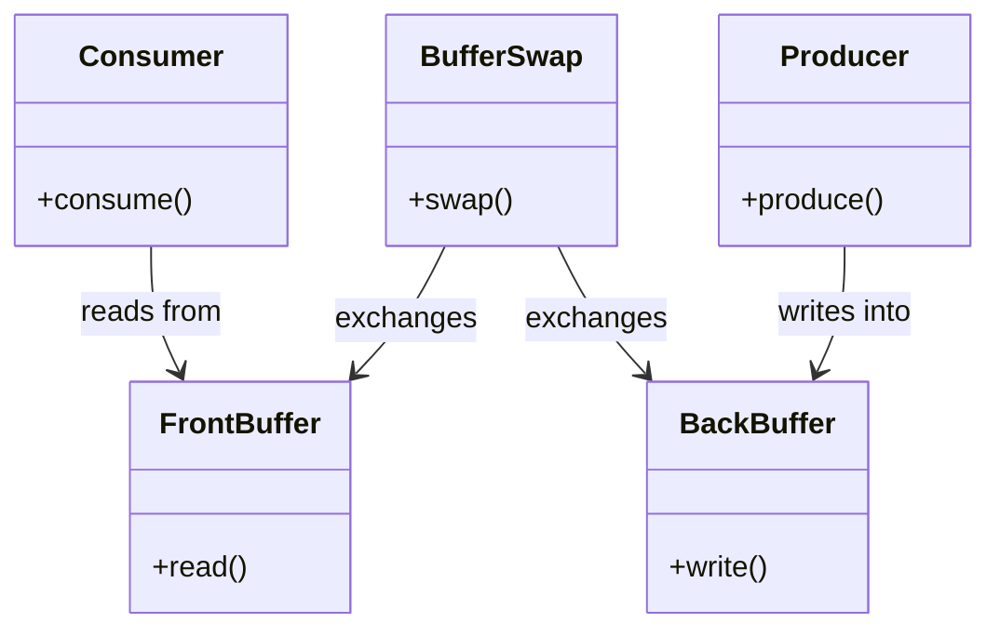
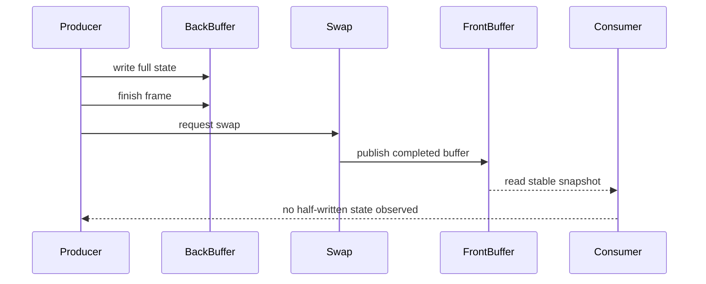

---
date: "2026-04-17"
title: "设计模式教科书｜Double Buffering：把写和读隔开，避免看到半成品"
description: "Double Buffering 通过前台与后台缓冲区把生产和消费拆开，让读者只看到稳定快照。它适合渲染帧、物理状态、音频块、网络包处理和任意需要一致性切换的流水线。"
slug: "patterns-33-double-buffering"
weight: 933
tags:
  - "设计模式"
  - "Double Buffering"
  - "软件工程"
  - "游戏引擎"
series: "设计模式教科书"
---

> 一句话定义：Double Buffering 让写入发生在后台、读取发生在前台，用一次交换保证外部只看到完整状态。

## 历史背景

Double Buffering 最早不是游戏引擎专利，而是图形显示系统和操作系统里很朴素的工程答案。显示设备一边在扫描当前帧，一边如果程序还在改同一块内存，就会看到撕裂、闪烁或半成品。解决办法非常直接：写的时候别动前台，先在后台准备完整结果，准备好再交换。

这个思想后来被渲染管线、音频缓冲、网络包处理和高吞吐消息系统广泛吸收。只要生产者和消费者的速度不一样，而且消费者不能看到中间态，双缓冲就很自然。它本质上是在用“复制一份”换“读写隔离”和“一致性切换”。

现代实现并不只停留在“前台一份、后台一份”这么简单。图形 API 里的 swapchain、播放器里的帧缓冲、音频引擎里的块缓冲、网络栈里的收发区，都是同一条思想链。很多系统甚至会进一步做三缓冲或多缓冲，目的不是更炫，而是给生产者和消费者更大的节奏缓冲，降低“我刚写完、你已经在等”的抖动。

它和锁不同。锁会让读写互斥，但不会自动给你完整快照；双缓冲则是先让写在另一份缓冲里完成，再一次性切换可见版本。你可以把它看成“用空间换时间的可见性协议”。

在现代系统里，它常常和 swapchain、命令缓冲、帧资源、状态快照一起出现。名字可能不同，但思想很统一：先在后台拼完整，再把完整版本推给前台。

## 一、先看问题

想象一个音频回放系统。播放线程正在持续消费 PCM 数据，生成线程又在不断写下一段音频。如果两边直接共享同一块数组，消费侧很容易读到写了一半的数据。渲染系统、输入系统和网络包处理也会遇到同样的问题：读写同时发生，读者看到的不是上一版，也不是下一版，而是半成品。

坏代码通常看起来很省：大家都盯着同一份缓冲区改。写起来短，问题也短时间看不出来，但一旦速度和并发上来，输出就会抖。

```csharp
using System;
using System.Threading;

public sealed class NaiveAudioBuffer
{
    private readonly float[] _samples;
    private int _writeIndex;

    public NaiveAudioBuffer(int capacity)
    {
        _samples = new float[capacity];
    }

    public void WriteSample(float sample)
    {
        _samples[_writeIndex++] = sample;
        if (_writeIndex >= _samples.Length)
        {
            _writeIndex = 0;
        }
    }

    public float ReadSample(int index) => _samples[index];
}
```

这段代码的问题不是语法，而是可见性。写线程可能还没把一整块数据准备完，读线程已经开始消费了。单线程里它看起来没事，多线程或生产者-消费者一上来，半成品就会被暴露出去。

渲染里也一样。CPU 可能还在写帧数据，GPU 已经开始读这一帧。只要你让读写共用同一块区域，不加隔离，就会出现 tearing、抖动、状态污染或难以重现的竞态。

## 二、模式的解法

Double Buffering 的核心是两份缓冲区：前台和后台。

- 前台 buffer 提供给消费者读。
- 后台 buffer 提供给生产者写。
- 写完之后执行一次交换。
- 交换要么原子，要么受控。
- 外部永远只看前台，不看正在写的那份。

下面是一份完整可运行的纯 C# 示例，演示一个双缓冲状态仓库。生产者在后台更新，消费者从前台读取，`Swap()` 是唯一切换时机。

```csharp
using System;
using System.Threading;

public sealed class DoubleBuffer<T> where T : class, new()
{
    private T _front = new();
    private T _back = new();
    private readonly object _gate = new();

    public T Read()
    {
        lock (_gate)
        {
            return _front;
        }
    }

    public T WriteBuffer()
    {
        lock (_gate)
        {
            return _back;
        }
    }

    public void Swap(Action<T, T>? copyFrontToBack = null)
    {
        lock (_gate)
        {
            (_front, _back) = (_back, _front);
            copyFrontToBack?.Invoke(_front, _back);
        }
    }
}

public sealed class FrameState
{
    public int FrameIndex { get; set; }
    public string? StatusText { get; set; }
    public float Exposure { get; set; }
}

public static class Demo
{
    public static void Main()
    {
        var buffers = new DoubleBuffer<FrameState>();

        var back = buffers.WriteBuffer();
        back.FrameIndex = 1;
        back.StatusText = "building frame";
        back.Exposure = 1.2f;
        buffers.Swap();

        var front = buffers.Read();
        Console.WriteLine($"frame={front.FrameIndex}, status={front.StatusText}, exposure={front.Exposure}");
    }
}
```

这个示例故意简化了对象拷贝，因为真实工程里双缓冲常常不是“把整个对象复制过去”，而是“把完整快照交换成可见版本”。关键是前台和后台永远不同时承担同一角色。

如果你把它放进渲染系统，前台就是当前显示帧，后台就是下一帧的构建区。等后台准备好了，交换指针或交换索引，外部瞬间看到完整新帧，而不会看到半途更改。

这也是为什么双缓冲天然适合“帧”这种边界明确的单位。帧的定义本身就意味着：这一轮生产要么完整，要么不发布。只要把发布点控制在交换那一刻，消费者就能始终看到一个自洽版本，而不是半成品拼图。

## 三、结构图



这张图最重要的是“角色分离”。

前后台一旦被混用，双缓冲就退化成“有两份数据但谁都能改”。那样看上去像减少了冲突，实际上只是增加了维护成本。真正有意义的双缓冲，不是多拿一份容器，而是把“构建中”与“可见中”拆成两个不同的生命周期。

- Producer 只写后台。
- Consumer 只读前台。
- BufferSwap 是唯一可见性切换点。

你如果把前台和后台角色写混，双缓冲就会退化成“两份数据但都能改”，那样只是多占了一份内存，并不会带来一致性。

## 四、时序图



这条时序线要强调两个时机：

先写满后台，再交换给前台。只要交换前的数据还在后台，消费者读到的就一定是旧版本；只要交换完成，消费者读到的就一定是完整新版本。这个边界清楚，调试也更清楚，因为问题不再是“读到半成品了吗”，而是“交换是否发生在正确时机”。

- 写入阶段只发生在后台。
- 对外可见性只在交换瞬间改变。

这就是为什么双缓冲特别适合帧边界、音频块边界、消息批次边界和状态快照边界。只要你的读者不能接受半成品，它就很合适。

## 五、变体与兄弟模式

双缓冲并不只有图形渲染一种写法。

在现代 GPU API 里，swapchain 本质上就是双缓冲或多缓冲的制度化表达。CPU 在后台构建命令和纹理，GPU 或显示控制器在前台消费当前图像，呈现点决定可见版本。音频系统也一样：播放线程只读一个稳定块，生成线程在另一个块里填数据，准备好后再切换。

- **Triple Buffering**：多一份缓冲，进一步缓解生产者和消费者节奏不一致的问题。
- **Ping-Pong Buffer**：在两个缓冲之间来回切换，常见于音频、SIMD 和计算管线。
- **Frame Buffer Swapchain**：图形 API 里的前后缓冲链。
- **State Snapshot Buffer**：把状态快照分成读版和写版。

容易混淆的兄弟模式主要有这些：

- **Copy-on-Write**：共享起步，写时复制；双缓冲是预先准备两份完整区域，再交换可见性。
- **Lock**：锁只保证互斥，不自动保证外部看到的是完整快照。
- **Ring Buffer**：环形缓冲更适合流式吞吐和队列语义，不一定保证“前台稳定、后台构建完成”这条边界。

## 六、对比其他模式

| 维度 | Double Buffering | Copy-on-Write | Lock | Ring Buffer |
|---|---|---|---|---|
| 核心目标 | 稳定快照切换 | 降低写复制成本 | 互斥访问 | 高吞吐流式传输 |
| 读者能否看到半成品 | 否 | 取决于实现 | 可能，若锁粒度不当 | 取决于消费节奏 |
| 内存成本 | 2 份或更多 | 按写时复制增长 | 单份 | 固定容量 |
| 交换时机 | 显式、批量 | 写时触发 | 无交换概念 | 头尾推进 |
| 适合问题 | 帧、快照、状态切换 | 读多写少对象图 | 临界区保护 | 连续数据流 |

差异说透一点：

- **Double Buffering** 解决的是“读者不能看到半成品”。
- **Copy-on-Write** 解决的是“共享对象的写复制成本”。
- **Lock** 解决的是“别同时改同一份数据”。
- **Ring Buffer** 解决的是“持续流入流出”的吞吐问题。

如果你的重点是一致性切换，双缓冲比锁更直接；如果你的重点是连续流处理，环形缓冲往往更合适；如果你的重点是共享对象图的写时复制，COW 更自然。

这也是为什么双缓冲通常不是“唯一方案”，而是“最适合固定边界快照的方案”。它不比 ring buffer 更通用，也不比 lock 更便宜，但在帧级和批次级问题里，它把一致性边界表达得最清楚。

## 七、批判性讨论

双缓冲常被说成“简单有效”，但它也有边界。

它的现代版本也比教科书里写得更讲究：交换点往往要和内存屏障、引用发布、资源生命周期绑定在一起。对单线程演示来说，`(_front, _back) = (_back, _front)` 就够了；对真实渲染和跨线程状态切换来说，交换本身只是开始，后面还有资源重用、提交队列和消费确认。

第一，**它吃内存**。两份缓冲意味着至少双份占用。对于大对象图、大贴图、大状态快照，这个成本很现实。你不能为了避免半成品就把内存翻倍而不看预算。

第二，**它要求交换点清晰**。如果生产者一直写，消费者一直读，没有明确帧边界或批次边界，双缓冲就无法自然成立。它不是“任何时候都能切换”，而是“在完整点切换”。

第三，**它不等于线程安全**。双缓冲解决的是读写分离和可见性问题，不自动解决多生产者、多消费者、跨对象一致性。你要是把一堆共享对象都塞进双缓冲里，却不管它们之间的依赖，还是会出错。

第四，**它可能掩盖过度复制**。有些系统本来可以用局部增量更新，却被双缓冲推成整块复制。结果是稳定了，但复制成本大了。

第五，**它很依赖明确的交换节拍**。如果生产者没有帧边界、消费者也没有块边界，那么“什么时候切换”就会变成一团约定而不是协议。真正可维护的实现通常会把交换时机绑定到帧结束、音频块完成、网络批次提交或渲染命令收束这些明确事件上。

## 八、跨学科视角

从**图形 API**看，swapchain 就是双缓冲思想最直接的工业化表达。CPU 构建下一帧，GPU 显示当前帧，二者通过交换点切换可见版本。Vulkan、DXGI、Metal 都有类似的交换链语义。

从**操作系统**看，双缓冲和 page flipping、后台渲染、用户态/内核态交接有同样的思想：先准备完整结果，再一次性交给消费者。

从**网络和高吞吐消息系统**看，生产者-消费者模型经常需要把处理中的状态和可消费状态分开。Netty、Disruptor 这类系统都强调缓冲和批量推进，虽然实现不一样，但都在降低读写冲突。

从**数据库**看，快照隔离和读写分离也能看到双缓冲影子。读者读的是稳定版本，写者在另一边准备新版本，提交点决定可见性。

从**编译器和 JIT**看，双缓冲也像代码生成和优化阶段的工作区：一份 IR 或 AST 作为当前稳定版本，另一份作为变换中的版本，直到优化完成再提交。很多增量图算法、脏区域重绘、甚至某些任务图调度，都在做同样的事情，只是名字不一样。

## 九、真实案例

### 1. Vulkan Swapchain

Vulkan 的 swapchain 是双缓冲思想最经典的现代实现之一。官方规范和教程都强调：图像先在后台渲染，完成后通过呈现交换给屏幕。

- Vulkan Tutorial：<https://vulkan-tutorial.com/Drawing_a_triangle/Presentation/Swap_chain>
- Vulkan Specification：<https://registry.khronos.org/vulkan/specs/1.3-extensions/html/chap44.html>
- Vulkan Guide：<https://docs.vulkan.org/guide/latest/swapchain.html>

这里的前台和后台不是比喻，而是 API 级别的交换语义。你要显示什么，不是边写边显示，而是在完成后提交到交换链。

### 2. DXGI Swap Chain

DirectX 体系里，DXGI swap chain 也是同样的思路。后台 buffer 用来渲染，前台 buffer 用来显示，`Present` 负责切换。

- 官方文档：<https://learn.microsoft.com/en-us/windows/win32/direct3ddxgi/dxgi-1-2-presentation-improvements>
- 官方概述：<https://learn.microsoft.com/en-us/windows/win32/direct3ddxgi/dxgi-swap-chains>

它告诉我们，双缓冲不是某个引擎发明的，而是图形展示的基础设施。只要你需要避免 tearing 和半成品，交换链就会出现。

更具体一点，Vulkan 的 present 语义把“准备”和“可见”分成了两个阶段：你在后台把图像写完，再把图像提交给交换链；真正显示到屏幕，是交换链完成呈现之后的事。这个边界和前台/后台缓冲的角色分离是完全一致的。

更关键的是，present 不只是“把图推上去”这么简单。它通常还意味着一次提交边界：CPU 侧把命令封口，GPU 侧开始消费，显示系统在合适的垂直同步点上接管最终可见性。只要你把这个点看清楚，就会明白双缓冲真正守住的不是“有两份数据”，而是“谁在什么时刻拥有可见权”。这也是为什么 swapchain 语义一旦失控，问题往往不是画错一帧，而是整条呈现节奏都开始抖。

从协议角度看，这个交换点最好被定义成“后台完成写入、前台尚未发布、切换瞬间原子可见”的三段式流程。简单实现里用锁包住交换就够了，跨线程和跨设备时还要配合内存屏障、提交完成通知和资源生命周期管理。也就是说，真正重要的不是 swap 这个动作本身，而是 swap 前后谁拥有读权限、谁拥有写权限、谁拥有发布权。

### 3. Netty / Disruptor

Netty 和 LMAX Disruptor 则展示了高吞吐系统里“批量可见性”和“生产者-消费者隔离”的工程味道。

- Netty 官方文档：<https://netty.io/wiki/index.html>
- LMAX Disruptor GitHub：<https://github.com/LMAX-Exchange/disruptor>

它们不一定叫双缓冲，但背后的理念一致：把写侧和读侧隔开，尽量让消费者看到稳定批次，而不是一边写一边读。

## 十、常见坑

- **把两份缓冲都暴露给外部改**。这样就失去了前后台分离。改法是严格限定写者和读者角色。
- **忘记交换点同步**。交换一半就让消费者读，会直接看到半成品。改法是让交换成为唯一可见性切换点。
- **把双缓冲当成万能锁替代**。它只解决快照一致性，不解决所有并发问题。改法是先确认需求是“稳定快照”还是“互斥修改”。
- **复制过大对象图**。每帧都完整拷贝成本会很高。改法是把可变状态切成更细的块，或者改用增量更新。
- **没有定义旧版本生命周期**。交换后旧缓冲怎么回收、怎么复用，要明确。改法是把回收策略纳入设计。

## 十一、性能考量

双缓冲的性能成本主要在内存和复制，收益主要在读写隔离和一致性。

从量化角度看，它更像是在交换“等待时间”和“复制时间”。单份缓冲时，读写互相阻塞，系统会在锁或忙等上花掉尾延迟；双缓冲时，系统通常多付一份拷贝和 2x 左右的存储占用，但换回的是更少的竞争和更稳定的可见快照。对于 16ms 帧预算的渲染循环来说，这点差异经常比绝对吞吐更重要，因为用户感知到的不是平均值，而是卡顿和撕裂。

从复杂度看，双缓冲本身不神奇地降低算法阶数。它通常仍然要付出一次完整写入和一次交换成本，但它把读写冲突从运行时动态争抢，变成了显式的交换协议。对于帧级系统来说，这个变化非常值钱，因为最贵的往往不是那次拷贝，而是半成品被消费后导致的返工、抖动和同步等待。

如果按工程感觉来估，双缓冲的代价通常是“多一份存储 + 一次切换 + 一次潜在拷贝”，回报则是“更少的锁竞争 + 更少的半成品重试 + 更稳定的尾延迟”。很多引擎选择它，不是因为平均吞吐最好，而是因为在帧预算里，它最容易把最坏情况压住。

如果每次更新都需要避免半成品，那双缓冲用一次交换把很多细碎同步成本合并掉了。它的时间复杂度通常不会神奇变小，但可见性成本和等待成本会变低。对于帧级系统来说，这种交换式一致性往往比细粒度锁更稳定。

代价也很清楚：两份缓冲至少带来 2x 的存储占用，复制过程会带来额外带宽压力。适合高一致性切换的场景，不适合超大状态和超低内存预算的场景。

如果你需要的是“局部可见、局部更新”，双缓冲会显得过重；如果你需要的是“绝不看到半成品”，那这点内存换来的稳定性通常值得。关键是先确认你的问题到底是吞吐问题，还是一致性问题。

从边界上看，ring buffer 更偏持续流，lock 更偏互斥临界区，COW 更偏写时复制。双缓冲夹在中间，最适合固定边界的快照：一帧、一块、一批、一轮状态提交。你如果想要的是“流式无界输入”，双缓冲会显得笨；你如果想要的是“整个版本切换”，ring buffer 又不够直接。

## 十二、何时用 / 何时不用

适合用：

- 你需要稳定快照，而不是实时读半成品。
- 读写节奏不同，且有明确交换点。
- 你处理的是帧、块、批次、状态快照。
- 你能接受额外内存换一致性。

不适合用：

- 状态很大，双份内存代价太高。
- 没有明确批次边界。
- 你需要的是流式吞吐而不是快照切换。
- 多方并发写入且依赖复杂，双缓冲本身不够。

## 十三、相关模式

- [Dirty Flag](./patterns-32-dirty-flag.md)
- [Flyweight](./patterns-17-flyweight.md)
- [Render Pipeline](./patterns-41-render-pipeline.md)
- [Command Buffer](./patterns-43-command-buffer.md)

Dirty Flag 和 Double Buffering 常一起出现：前者负责标脏，后者负责切换稳定版本。

在后续的 Render Pipeline 和 Command Buffer 文章里，它们会继续作为底层机制出现，尤其是在帧构建和资源提交环节。

## 十四、在实际工程里怎么用

在真实工程里，双缓冲通常落在这些地方：

- 帧缓冲和交换链。
- 音频块处理。
- 状态快照和回放。
- 网络收包 / 处理分离。
- 渲染命令构建和提交。

如果要为后续应用线留占位，可以这样接：

- [Double Buffering 应用线占位稿](../pattern-33-double-buffering-application.md)
- [Render Pipeline 应用线占位稿](../pattern-41-render-pipeline-application.md)
- [Command Buffer 应用线占位稿](../pattern-43-command-buffer-application.md)

落地时只要记住一句话：双缓冲不是为了多存一份数据，而是为了让读者永远只看到完整版本。

## 小结

Double Buffering 的价值，是把生产和消费拆开，避免外部看到半成品。

它用额外内存换稳定快照，用明确交换点换一致性。

它最适合帧级、块级、批次级的系统，不适合拿来替代所有并发控制。


