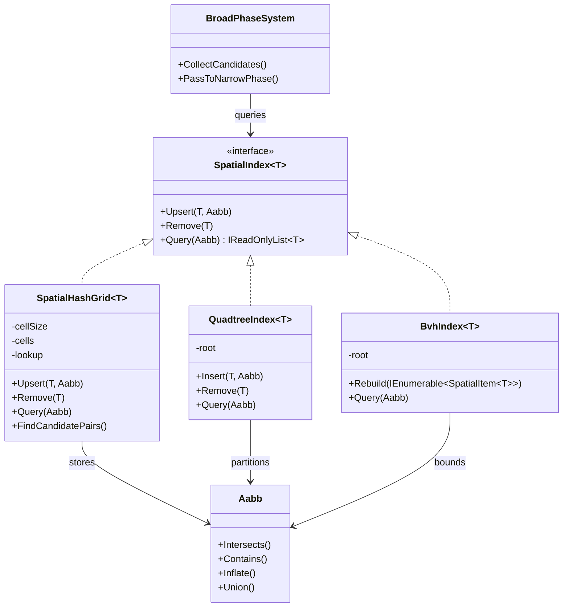
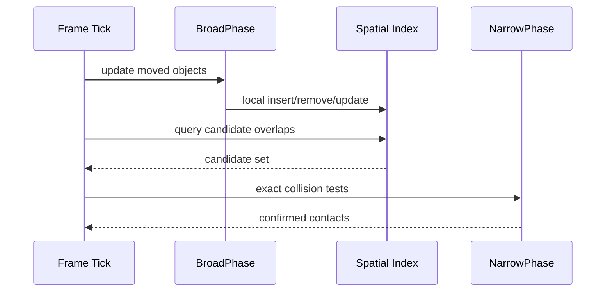

> 一句话定义：Spatial Partition 的本质，是把“谁和谁可能有关”先缩到一个很小的候选集，再把精确判断留给后面的窄阶段。

## 历史背景

空间划分最早不是为了“游戏”，而是为了把几何查询从暴力枚举里救出来。只要系统里同时存在很多物体、很多范围查询、很多射线查询，`n²` 就会迅速吞掉帧预算。

早期物理引擎和 CAD/GIS 系统一直在做同一件事：先找候选，再做精确判断。游戏引擎只是把这个问题放进了 16.6ms 或 33.3ms 的硬预算里，容错更低，压力更大。

于是就出现了几类经典结构：规则网格适合均匀世界，哈希格适合无限地图或稀疏世界，四叉树适合 2D 空间中的分层聚集，BVH / 动态 AABB 树适合大量移动对象和查询密集场景。它们不是彼此替代的“更高级版本”，而是针对不同分布特征做的不同切分。

## 一、先看问题

很多实现一开始都像这样：每一帧把所有物体两两比一遍，谁碰了谁再算精确碰撞。

```csharp
using System;
using System.Collections.Generic;

public readonly record struct Aabb(float MinX, float MinY, float MaxX, float MaxY)
{
    public bool Intersects(in Aabb other)
        => !(MaxX < other.MinX || other.MaxX < MinX || MaxY < other.MinY || other.MaxY < MinY);
}

public sealed record Body(int Id, Aabb Bounds);

public static class NaiveBroadPhase
{
    public static List<(Body A, Body B)> FindPairs(IReadOnlyList<Body> bodies)
    {
        var pairs = new List<(Body A, Body B)>();
        for (var i = 0; i < bodies.Count; i++)
        {
            for (var j = i + 1; j < bodies.Count; j++)
            {
                if (bodies[i].Bounds.Intersects(bodies[j].Bounds))
                    pairs.Add((bodies[i], bodies[j]));
            }
        }
        return pairs;
    }
}
```

它的问题不在“代码短”，而在“规模一大就失控”。

如果有 2,000 个物体，最坏情况要做接近 2,000,000 次 AABB 检查。更糟的是，世界里大多数物体根本不可能彼此接触，这些检查全是浪费。

真正麻烦的还不是碰撞。视锥裁剪、射线拾取、范围查询、邻近搜索、爆炸影响范围、AI 感知半径，全部都在问同一个问题：有哪些对象值得继续看？

没有空间划分，查询只能靠全图扫描。扫描一旦变成热路径，帧率会先抖，再卡，最后雪崩。

## 二、模式的解法

Spatial Partition 的核心不是“选一种树”，而是把系统拆成两段。

第一段叫 broad phase，目标是尽快筛出候选对象。

第二段叫 narrow phase，目标是对候选对象做精确测试。

这一步非常关键，因为 broad phase 只需要保守，不需要精确。它可以允许假阳性，但不能漏掉真正的候选。漏掉一个对象，结果就是碰撞丢失；多带几个候选，只是多做一点精确判断。

### 1. 网格：最便宜的局部化

规则网格最适合“世界本身就比较均匀”的场景。你把空间切成固定单元，每个单元维护一个对象列表。对象移动时，只在少数几个单元里更新。

它的好处很直接：插入和局部更新接近 O(1)，查询只需要看命中的格子，候选数通常和局部密度有关，而不是全局对象数。

### 2. 哈希格：把无限世界收进有限表

规则网格要求你预先知道边界。无限地图、滚动世界、程序化关卡，往往做不到这一点。哈希格把“格子坐标”映射到字典键里，世界再大也只会占用被访问到的格子。

哈希格的代价是散列开销和碰撞管理，但换来的是更灵活的边界和更好的稀疏场景适配。

### 3. 四叉树：让密度不均的区域自己分层

当对象分布很不均匀时，固定网格会在某些区域塞满对象，另一些区域几乎为空。四叉树通过递归细分，把密集区域切得更细，把稀疏区域保留得更粗。

它很适合 2D 场景，但要注意：树太深会增加递归成本，分裂/合并频繁时会产生额外抖动。四叉树不是“更高级的网格”，它只是更擅长应对密度差异。

### 4. BVH：把“几何上接近”的对象包成层次盒子

BVH / 动态 AABB 树常被物理引擎拿来做 broad phase。它把对象包在层次包围盒里，查询时先碰树节点，再逐层深入。Box2D 的动态树就是这个思路的代表。

和网格相比，BVH 不依赖固定 cell size；和四叉树相比，它不强迫你把空间切成均匀象限。它更像是在“对象之间谁更接近”这个维度上做聚类，因此在射线、传感器和较不规则的静态几何里很吃香。

BVH 的优点是查询稳定、剪枝能力强，尤其适合射线、形状投射和区域查询。缺点是维护成本更高，动态场景里需要重插入、旋转或重平衡。

Box2D 选动态树，不是因为它“更高级”，而是因为它在动态物体和高频查询之间给了更好的折中。Unity 的 broad phase pruning 也体现了同一原则：先把空间切成可控的局部，再在局部里排序或树化。

### 5. 一个可运行的纯 C# 实现

下面的代码演示一个实用的哈希格 broad phase。它支持插入、移动、删除和范围查询，并且保留了“只更新局部单元”的思路。

```csharp
using System;
using System.Collections.Generic;
using System.Linq;

public readonly record struct Aabb(float MinX, float MinY, float MaxX, float MaxY)
{
    public float Width => MaxX - MinX;
    public float Height => MaxY - MinY;

    public bool Intersects(in Aabb other)
        => !(MaxX < other.MinX || other.MaxX < MinX || MaxY < other.MinY || other.MaxY < MinY);

    public bool Contains(in Aabb other)
        => MinX <= other.MinX && MinY <= other.MinY && MaxX >= other.MaxX && MaxY >= other.MaxY;

    public Aabb Inflate(float margin)
        => new(MinX - margin, MinY - margin, MaxX + margin, MaxY + margin);

    public static Aabb Union(in Aabb a, in Aabb b)
        => new(MathF.Min(a.MinX, b.MinX), MathF.Min(a.MinY, b.MinY), MathF.Max(a.MaxX, b.MaxX), MathF.Max(a.MaxY, b.MaxY));
}

public readonly record struct SpatialItem<T>(T Value, Aabb Bounds);

public sealed class SpatialHashGrid<T>
{
    private readonly float _cellSize;
    private readonly Dictionary<long, List<SpatialItem<T>>> _cells = new();
    private readonly Dictionary<T, Aabb> _lookup = new();
    private readonly Dictionary<T, int> _stableIds = new();
    private int _nextStableId;

    public SpatialHashGrid(float cellSize)
    {
        if (cellSize <= 0) throw new ArgumentOutOfRangeException(nameof(cellSize));
        _cellSize = cellSize;
    }

    public void Upsert(T value, Aabb bounds)
    {
        Remove(value);
        _lookup[value] = bounds;
        foreach (var key in EnumerateCellKeys(bounds))
        {
            if (!_cells.TryGetValue(key, out var bucket))
            {
                bucket = new List<SpatialItem<T>>();
                _cells[key] = bucket;
            }
            bucket.Add(new SpatialItem<T>(value, bounds));
        }
    }

    public bool Remove(T value)
    {
        if (!_lookup.Remove(value, out var bounds))
            return false;

        foreach (var key in EnumerateCellKeys(bounds))
        {
            if (_cells.TryGetValue(key, out var bucket))
            {
                bucket.RemoveAll(item => EqualityComparer<T>.Default.Equals(item.Value, value));
                if (bucket.Count == 0)
                    _cells.Remove(key);
            }
        }

        return true;
    }

    public IReadOnlyList<T> Query(Aabb area)
    {
        var result = new List<T>();
        var seen = new HashSet<T>();

        foreach (var key in EnumerateCellKeys(area))
        {
            if (!_cells.TryGetValue(key, out var bucket))
                continue;

            foreach (var item in bucket)
            {
                if (seen.Add(item.Value) && item.Bounds.Intersects(area))
                    result.Add(item.Value);
            }
        }

        return result;
    }

    public IReadOnlyList<(T A, T B)> FindCandidatePairs()
    {
        var pairs = new List<(T, T)>();
        var seen = new HashSet<(int Left, int Right)>();
        foreach (var bucket in _cells.Values)
        {
            for (var i = 0; i < bucket.Count; i++)
            {
                for (var j = i + 1; j < bucket.Count; j++)
                {
                    var a = bucket[i];
                    var b = bucket[j];
                    if (!a.Bounds.Intersects(b.Bounds))
                        continue;

                    var leftId = GetStableId(a.Value);
                    var rightId = GetStableId(b.Value);
                    var pairKey = leftId <= rightId ? (leftId, rightId) : (rightId, leftId);
                    if (seen.Add(pairKey))
                        pairs.Add((a.Value, b.Value));
                }
            }
        }

        return pairs;
    }

    private int GetStableId(T value)
    {
        if (_stableIds.TryGetValue(value, out var id))
            return id;

        id = ++_nextStableId;
        _stableIds[value] = id;
        return id;
    }

    private IEnumerable<long> EnumerateCellKeys(Aabb bounds)
    {
        var minX = FloorToInt(bounds.MinX);
        var maxX = FloorToInt(bounds.MaxX);
        var minY = FloorToInt(bounds.MinY);
        var maxY = FloorToInt(bounds.MaxY);

        for (var x = minX; x <= maxX; x++)
        {
            for (var y = minY; y <= maxY; y++)
                yield return Pack(x, y);
        }
    }

    private int FloorToInt(float value) => (int)MathF.Floor(value / _cellSize);

    private static long Pack(int x, int y)
        => ((long)x << 32) ^ (uint)y;
}

public static class Program
{
    public static void Main()
    {
        var grid = new SpatialHashGrid<int>(cellSize: 10f);
        grid.Upsert(1, new Aabb(0, 0, 3, 3));
        grid.Upsert(2, new Aabb(2, 2, 5, 5));
        grid.Upsert(3, new Aabb(20, 20, 24, 24));
        grid.Upsert(4, new Aabb(22, 22, 26, 26));

        var query = grid.Query(new Aabb(1, 1, 6, 6));
        Console.WriteLine($"Query hits: {string.Join(", ", query)}");

        var pairs = grid.FindCandidatePairs();
        foreach (var (a, b) in pairs)
            Console.WriteLine($"Overlap candidate: {a} vs {b}");
    }
}
```

这个实现故意保留了最关键的 trade-off：对象移动时，只需要更新它覆盖到的格子，而不是重扫全世界。

## 三、结构图



## 四、时序图



## 五、变体与兄弟模式

空间划分不是一个结构，而是一组家族。

规则网格是最朴素的版本。它的优点是实现简单、更新便宜、缓存友好；缺点是你必须自己选 cell size，选错了就会在某些区域堆满候选。

哈希格是规则网格的稀疏版本。它更适合无限地图、开放世界和编辑器中任意坐标系的对象分桶。

四叉树更适合密度变化大的 2D 场景。它把稀疏空间保留成大块，把密集空间细分成小块。代价是树的维护和退化处理。

BVH 和动态 AABB 树更偏向物理引擎和射线密集查询。它不像网格那样依赖人为分辨率，也不像四叉树那样硬切空间，而是围绕对象的包围盒建立层级。

它容易和 `Sweep and Prune` 混淆。SAP 不是树，也不是网格，它更像在轴上维护排序后的投影。它在单轴相关性强、对象移动连续的场景里很强，但不是所有空间都适合它。

它也容易和 `Scene Graph` 混淆。Scene Graph 管的是层级和变换继承，Spatial Partition 管的是空间候选筛选。前者回答“谁挂在谁下面”，后者回答“谁可能和谁接触”。

## 六、对比其他模式

| 结构 | 更新成本 | 查询成本 | 适合场景 | 代价 |
|---|---:|---:|---|---|
| 规则网格 | 局部近似 O(1) | O(命中格子 + 候选) | 2D 平面、密度较均匀 | 需要选 cell size |
| 哈希格 | 局部近似 O(1) | O(命中格子 + 候选) | 无限世界、稀疏分布 | 哈希和冲突开销 |
| 四叉树 | 平均 O(log n) | 平均 O(log n + k) | 密度差异大的 2D | 退化与重平衡 |
| BVH / 动态树 | 平均 O(log n) | 平均 O(log n + k) | 射线、形状投射、物理 broad phase | 维护复杂 |
| 全扫描 | O(1) | O(n) 或 O(n²) | 小规模、一次性计算 | 规模一大就死 |

Spatial Partition 不是“更聪明的集合”。它本质上是在数据分布和查询类型之间做折中。

它和 `Chain of Responsibility` 不同。责任链是请求沿处理器传递，空间划分是对象先被空间索引分桶，然后再被查询命中。前者靠处理顺序，后者靠空间坐标。

它和 `Observer` 也不同。Observer 关注变化通知，空间划分关注候选缩减。Observer 可以广播给所有订阅者，Spatial Partition 恰恰是为了避免广播给所有对象。

## 七、批判性讨论

空间划分最常见的误区，是把它当成“性能魔法”。

不是。它只是把你必须做的工作更早地筛掉一部分。你如果查询本身就很随机，或者世界里几乎每个对象都可能和每个对象相关，那空间划分的收益会急剧下降。

第二个误区，是过度优化 cell size。

网格不是越细越好。格子太细，更新要穿越很多格；格子太粗，候选又会重新膨胀。最优值通常和对象平均尺度、移动速度、局部密度有关，而且会随关卡变化。

第三个误区，是把树结构当成唯一答案。

四叉树和 BVH 很强，但它们不是免费午餐。频繁移动的对象如果每帧都需要重建，理论上的 `log n` 很可能被常数项吃掉。动态场景里，很多引擎会对静态对象和动态对象采用不同的索引策略。

第四个误区，是忘了 broad phase 只管候选。

空间索引的结果不能直接当“碰撞结果”。它只是在告诉你“值得继续看”。真正的碰撞、遮挡、命中和接触信息，仍然要由 narrow phase 决定。

## 八、跨学科视角

空间划分和数据库索引很像。

规则网格像分区表，四叉树像空间索引，BVH 像层次化过滤。你在做的其实是“先用索引减小候选集，再做精确谓词判断”。

这和数据库里的 B-Tree / R-Tree 逻辑极像：索引不是结果本身，只是把后续昂贵谓词的输入压小。游戏里把这个思想做对，通常比单纯调算法参数更能救帧率。

它也像 GIS。地图服务不会把整张地图每次都全扫一遍，它们会用 tile、quadtree、R-tree 之类的结构做局部检索。

在编译器和静态分析里，也有同样的模式。你先按模块、作用域或控制流把范围切开，再做更贵的分析。空间划分本质上就是把“贵操作”延后到候选足够少的时候。

## 九、真实案例

Box2D 是 broad phase 的经典教材。

官方文档把 `b2DynamicTree` 叫做动态 AABB 树，说明它是用来组织大量几何对象、做 AABB 查询和射线查询的。Collision 文档进一步解释了 broad phase 的作用：先通过动态树减少 narrow phase 的成对检测数量。你可以直接看 Box2D 官方文档的 [group__tree.html](https://box2d.org/documentation/group__tree.html) 和 [group__collision.html](https://box2d.org/documentation/group__collision.html)，再对照主仓库 [erincatto/box2d](https://github.com/erincatto/box2d)。

Unity 的物理文档把同一类问题讲得更贴近游戏工程。

官方手册 `Select a broad phase pruning algorithm` 直接列出了 Sweep and Prune、Multibox Pruning、Automatic Box Pruning 三种策略。这里的 Multibox Pruning 和 Automatic Box Pruning 本质上就是网格化 broad phase：它们先把空间切开，再在格子里做局部排序。对应的包仓库可看 `needle-mirror/com.unity.physics`，手册入口是 `docs.unity3d.com/Packages/com.unity.physics@1.0/manual/index.html`。

Godot 也提供了低层物理服务器接口。

`PhysicsServer2D` / `PhysicsServer3D` 文档把 space、body、shape 拆得很清楚，`PhysicsServer3D` 还明确说它是所有 3D 物理对象的服务器接口。它的源码树里可以从 `servers/physics_server_2d.cpp`、`servers/physics_server_3d.cpp` 一路追到内部空间管理和查询流程。这里的关键不是“有 API”，而是 Godot 把物理世界视为一个可查询、可分区、可分层的空间服务。

这也是为什么它算空间划分案例，而不是普通几何容器：它把 body、shape、space 和查询接口拆开，允许宿主在空间层先缩候选，再把真正的接触判断交给更具体的物理流程。

## 十、常见坑

第一个坑，是 cell size 设得太大。

结果就是每个格子都塞着一堆对象，候选集回到了接近全扫。修正方式是按对象尺度和移动速度重新估算，而不是拍脑袋取整。

第二个坑，是 cell size 设得太小。

对象移动时会跨越过多格子，更新成本和内存碎片一起上来。小格子不一定更快，尤其在移动对象很多的时候。

第三个坑，是没有处理“fat AABB”。

如果对象只要轻微移动就频繁换格，树和网格都会抖。物理引擎常常会把包围盒稍微放大一点，换取局部移动不触发重插入。

第四个坑，是把静态物体和动态物体混在同一套索引里。

静态建筑、地形、墙体通常更新很少，应该用更稳定的结构；动态角色、子弹、碎片则更适合单独维护。混在一起通常会把最差情况放大。

## 十一、性能考量

如果拿一个直观例子来算：2000 个物体全扫接近 1999000 次 AABB 检查。若它们均匀散到 100 个格子里，候选对大约会降到全扫的 1/100 量级。实际值当然还会受对象大小和跨格覆盖影响，但方向不会变：局部性越强，索引越赚。

Spatial Partition 的收益可以直接写成候选集下降。

如果有 `n` 个对象，全扫成本接近 `n(n-1)/2`。当对象均匀分布到 `m` 个格子里，每格平均 `n/m` 个对象，候选对会近似变成 `m * (n/m)^2 / 2 = n^2 / (2m)`。也就是说，只要空间切分足够有效，候选集就会按格子数近似下降。

这也是为什么 broad phase 的局部更新很重要。对象每帧只跨过少数格子时，更新几乎是常数级；如果每帧都触发重建，理论复杂度再漂亮也救不了实际帧率。

四叉树和 BVH 的平均查询常常写成 `O(log n + k)`，其中 `k` 是命中的候选数。这个公式的重点不是 `log n` 有多小，而是 `k` 有多关键。查询越有空间局部性，索引的价值越大。

## 十二、何时用 / 何时不用

如果你已经知道世界是高度稀疏或高度聚簇的，空间划分几乎一定比全图扫描好；如果你完全不知道对象分布，最稳妥的做法通常是先选简单网格，再用统计数据决定是否切到四叉树或 BVH。

适合用在这些场景：

- 物体很多，且大多数对象只有局部相关性。
- 你需要做范围查询、射线查询、邻近查询、爆炸影响、可见性裁剪。
- 你的世界能被切成具有明显局部性的空间单元。

不适合用在这些场景：

- 对象数量很少，直接扫描更便宜。
- 关系是全局性的，空间坐标几乎不提供剪枝价值。
- 你的对象分布一直剧烈变化，维护结构比查询本身更贵。

## 十三、相关模式

- [Observer](./patterns-07-observer.md)
- [Pub/Sub vs Observer](./patterns-26-pub-sub-vs-observer.md)
- [Actor Model](./patterns-23-actor-model.md)
- [Scene Graph](./patterns-40-scene-graph.md)

## 十四、在实际工程里怎么用

在游戏引擎里，Spatial Partition 最常见的落点是：物理 broad phase、AI 感知、子弹命中、光源影响范围、视锥裁剪、编辑器中的对象选择。

如果你要把这条线落到应用线，可以继续看：

- `../../engine-toolchain/physics/spatial-partition-implementation.md`
- `../../engine-toolchain/rendering/visibility-culling.md`
- `../../engine-toolchain/ai/proximity-query.md`


如果再往工程里走一步，你会发现空间划分几乎总是“分工”而不是“独裁”。静态场景可以提前烘焙索引，动态对象单独维护增量结构，视锥裁剪、触发器和物理 broad phase 甚至可以用不同的索引策略。这样做的目的不是让代码看起来更高级，而是把更新频率和查询频率分开。

一个经验上更稳的判断是：如果对象移动速度相对格子尺寸很低，网格和哈希格通常很划算；如果密度分布极不均匀，四叉树更容易把局部候选压下去；如果查询以射线、扫掠和包围盒测试为主，BVH 往往更稳。真正成熟的系统，通常先记录候选数、更新次数、重建次数，再决定是否换结构。

把这个经验翻成工程语言，就是别先追求“最优结构”，先追求“候选显著变少”。只要 broad phase 把工作量从全局压回局部，后面的 narrow phase、AI 感知和可见性测试就都会跟着变轻。

如果把这个问题放到帧预算里看，空间划分还有一个隐形收益：它把“做多少次昂贵测试”变成“本帧能接受多少候选”。这个上限一旦清楚，物理、可见性和 AI 的预算分配就能一起稳定下来，而不是彼此抢时间片。

更重要的是，空间划分一旦稳定下来，就会变成多个子系统共享的预算入口。物理不需要再为每个查询做全扫，AI 不需要再为每个感知做全局遍历，渲染也不需要把不可见对象送进更贵的阶段。这个共享收益，往往比单点算法优化更值钱。

空间划分真正的分水岭，不是“用了哪棵树”，而是“你的查询是否真的局部”。如果对象密度稳定、移动幅度小，网格和哈希格通常最省心；如果密度差异极大，四叉树更容易把局部候选压下去；如果查询以射线、扫掠和 AABB 访问为主，BVH 往往更稳。反过来，如果你的查询天然全局化，比如一次性统计所有对象关系，那再好的索引也救不了查询形态本身。

更细一点看，结构选择和复杂度边界要一起读：网格更像把查询预算切到局部桶里，代价是你得接受 cell size 的调参；四叉树更像把稀疏和稠密分开，代价是重平衡；BVH 更像把对象包围盒做层次剪枝，代价是维护旋转和重插入。真正成熟的游戏引擎，通常不会只靠一种结构，而是静态几何、动态对象、编辑器查询三套索引分工。

如果再把代价算细一点，网格和哈希格的优势其实来自“更新只碰局部桶”，所以它们更怕 cell size 选错；四叉树的优势来自“把稠密和稀疏拆开”，所以它更怕分裂阈值抖动；BVH 的优势来自“层次剪枝”，所以它更怕频繁重插入。也就是说，结构选择不是在比谁更高级，而是在比谁的失败模式更符合你的场景。

Box2D 选动态 AABB 树，不是为了让 broad phase 看起来更学术，而是为了让射线和区域查询在大量动态对象里仍然保有稳定剪枝。Unity 的 broad phase pruning 也说明同样的事：先把对象归到局部候选，再决定是排序、分桶还是树化。能不能把候选压到足够小，往往比“用哪种结构”更关键。
## 小结

- Spatial Partition 的价值，不是“有树就快”，而是把全局搜索压成局部搜索。
- 网格、哈希格、四叉树和 BVH 不是同一种东西，它们分别针对不同的分布与查询形态。
- 真正成熟的 broad phase，会把更新成本、查询复杂度和候选质量一起看，而不是只盯着一个 Big-O。


