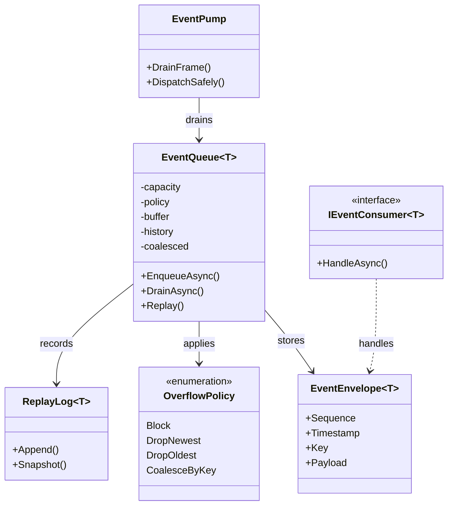
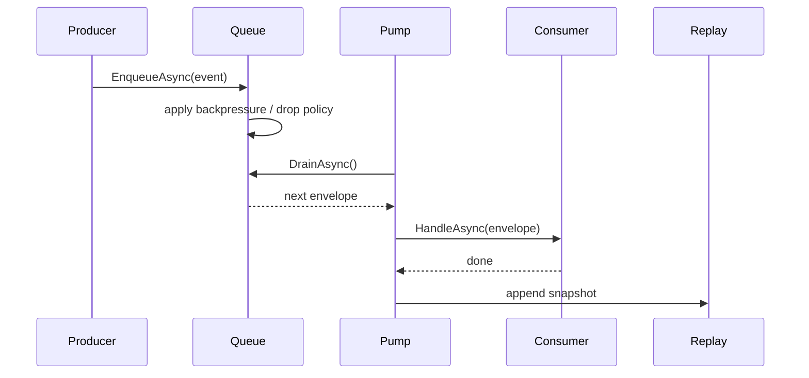

> 一句话定义：Event Queue 的本质，是把“发生了什么”和“什么时候处理”拆开，让系统能在时间上缓冲，而不是在调用栈里硬挤。

## 历史背景

事件队列的祖先出现在操作系统、窗口系统和网络协议栈里。输入事件、定时器、IO 完成、系统消息，都不能直接塞进任意业务逻辑里同步执行，否则调用链会变得又长又脆。

游戏引擎把这个问题放大了。主循环要稳定，渲染、物理、AI、音频、UI 还得各自保持节拍。任何一个系统都不能把“立刻处理”当成默认答案，不然就会出现重入、抖动、锁争用和帧尖刺。

所以，事件队列的演化方向很清晰：先把事件排队，再由受控的消费者在安全时刻统一处理。后来这个思路又扩展到了日志采集、异步任务、消息总线和事件溯源。

## 一、先看问题

很多代码一开始都长成“直接回调”。生产者刚收到变化，就立刻调用所有监听器。

```csharp
using System;
using System.Collections.Generic;

public sealed class DoorOpenSensor
{
    private readonly List<Action> _listeners = new();

    public void Subscribe(Action listener) => _listeners.Add(listener);

    public void DetectOpen()
    {
        foreach (var listener in _listeners)
            listener();
    }
}
```

这段代码看上去很直白，问题却很集中。

第一，调用时机和事件发生时机绑死了。传感器一触发，监听器就立刻执行，根本没有缓冲。

第二，监听器如果再触发别的系统，就很容易形成重入。某个监听器一旦修改了正在遍历的集合，整个流程就会进入不稳定状态。

第三，生产者和消费者的速度完全耦合。监听器慢一点，生产者就跟着慢；监听器卡住，生产者也卡住。

第四，错误传播没有边界。一个监听器抛异常，剩下的监听器可能根本没机会执行。

Event Queue 要解决的，正是这些“同步回调不该背的锅”。

## 二、模式的解法

Event Queue 先把事件包装成带时间戳、序号和可选 key 的消息，再放进受控队列。

队列的职责只有四个：接收、缓冲、排序、投递。

真正的处理发生在消费者侧，而且通常发生在一个明确的时机点：帧末、事务提交点、IO 轮询点、调度 tick，或者某个专门的 message pump。

下面这段纯 C# 代码展示了一个可运行的 bounded event queue。它支持四种背压策略：`Block`、`DropNewest`、`DropOldest` 和 `CoalesceByKey`，同时保留接受后的重放历史。

```csharp
using System;
using System.Collections.Generic;
using System.Linq;
using System.Threading;
using System.Threading.Tasks;

public enum OverflowPolicy
{
    Block,
    DropNewest,
    DropOldest,
    CoalesceByKey
}

public readonly record struct EventEnvelope<T>(long Sequence, DateTimeOffset Timestamp, string? Key, T Payload);

public sealed class EventQueue<T>
{
    private readonly int _capacity;
    private readonly OverflowPolicy _policy;
    private readonly Queue<EventEnvelope<T>> _buffer = new();
    private readonly List<EventEnvelope<T>> _history = new();
    private readonly Dictionary<string, EventEnvelope<T>> _coalesced = new();
    private readonly Queue<string> _coalescedOrder = new();
    private readonly Dictionary<string, int> _historyIndexByKey = new();
    private readonly SemaphoreSlim _space;
    private long _sequence;
    private readonly object _gate = new();

    public EventQueue(int capacity, OverflowPolicy policy)
    {
        if (capacity <= 0) throw new ArgumentOutOfRangeException(nameof(capacity));
        _capacity = capacity;
        _policy = policy;
        _space = new SemaphoreSlim(capacity, capacity);
    }

    public async ValueTask<bool> EnqueueAsync(T payload, string? key = null, CancellationToken cancellationToken = default)
    {
        var envelope = new EventEnvelope<T>(Interlocked.Increment(ref _sequence), DateTimeOffset.UtcNow, key, payload);

        if (_policy == OverflowPolicy.Block && (key is null || !_coalesced.ContainsKey(key)))
            await _space.WaitAsync(cancellationToken);

        lock (_gate)
        {
            if (_policy == OverflowPolicy.CoalesceByKey && key is not null)
            {
                if (_coalesced.TryGetValue(key, out _))
                {
                    _coalesced[key] = envelope;
                    _history[_historyIndexByKey[key]] = envelope;
                    return true;
                }

                if (_buffer.Count + _coalesced.Count >= _capacity)
                {
                    if (_policy == OverflowPolicy.DropNewest)
                        return false;

                    if (_policy == OverflowPolicy.DropOldest)
                    {
                        if (_buffer.Count > 0)
                        {
                            _buffer.Dequeue();
                        }
                        else if (_coalescedOrder.Count > 0)
                        {
                            var oldestKey = _coalescedOrder.Dequeue();
                            _coalesced.Remove(oldestKey);
                            _historyIndexByKey.Remove(oldestKey);
                        }
                    }
                    else if (_policy != OverflowPolicy.Block)
                    {
                        return false;
                    }
                }

                _coalesced[key] = envelope;
                _coalescedOrder.Enqueue(key);
                _historyIndexByKey[key] = _history.Count;
                _history.Add(envelope);
                return true;
            }

            if (_buffer.Count >= _capacity)
            {
                if (_policy == OverflowPolicy.DropNewest)
                    return false;

                if (_policy == OverflowPolicy.DropOldest)
                    _buffer.Dequeue();
                else if (_policy == OverflowPolicy.Block)
                    ;
                else
                    return false;
            }

            _buffer.Enqueue(envelope);
            _history.Add(envelope);
            return true;
        }
    }

    public IReadOnlyList<EventEnvelope<T>> Replay(int maxCount)
    {
        lock (_gate)
            return _history.TakeLast(maxCount).ToArray();
    }

    public async Task DrainAsync(Func<EventEnvelope<T>, ValueTask> handler, CancellationToken cancellationToken = default)
    {
        while (true)
        {
            EventEnvelope<T>? next = null;
            lock (_gate)
            {
                if (_policy == OverflowPolicy.CoalesceByKey && _coalescedOrder.Count > 0)
                {
                    while (_coalescedOrder.Count > 0)
                    {
                        var key = _coalescedOrder.Dequeue();
                        if (_coalesced.TryGetValue(key, out var item))
                            _buffer.Enqueue(item);
                    }

                    _coalesced.Clear();
                    _historyIndexByKey.Clear();
                }

                if (_buffer.Count > 0)
                    next = _buffer.Dequeue();
            }

            if (next is null)
                break;

            try
            {
                await handler(next.Value);
            }
            finally
            {
                if (_policy == OverflowPolicy.Block)
                    _space.Release();
            }
        }

        await Task.CompletedTask;
    }
}

public sealed class ConsoleEventConsumer
{
    public ValueTask HandleAsync(EventEnvelope<string> envelope)
    {
        Console.WriteLine($"[{envelope.Sequence}] {envelope.Timestamp:HH:mm:ss.fff} {envelope.Key ?? "-"}: {envelope.Payload}");
        return ValueTask.CompletedTask;
    }
}

public static class Program
{
    public static async Task Main()
    {
        var queue = new EventQueue<string>(capacity: 3, policy: OverflowPolicy.DropOldest);
        await queue.EnqueueAsync("player moved", "movement");
        await queue.EnqueueAsync("player jumped", "movement");
        await queue.EnqueueAsync("enemy spawned", "ai");
        await queue.EnqueueAsync("camera shake", "render");
        await queue.EnqueueAsync("ui refreshed", "ui");

        var consumer = new ConsoleEventConsumer();
        await queue.DrainAsync(e => consumer.HandleAsync(e));

        Console.WriteLine("Replay:");
        foreach (var item in queue.Replay(3))
            Console.WriteLine($"replay {item.Sequence}: {item.Payload}");
    }
}
```

这段代码想说明的不是“怎么把事件塞进一个容器”。它想说明的是：当系统有背压、重放、丢弃和延迟消费需求时，队列本身就成了架构的一部分。

## 三、结构图



## 四、时序图



## 五、变体与兄弟模式

Event Queue 很容易和几个模式混在一起。

最像的是 Observer。Observer 关注“谁订阅了变化”，Event Queue 关注“变化什么时候被处理”。Observer 通常同步触发，Event Queue 通常异步排队。

它也和 Pub/Sub 很像，但边界不同。Pub/Sub 关注的是主题分发和解耦订阅者，往往有 broker、topic、订阅过滤和跨进程传播；Event Queue 更像一个有时间顺序的待办箱，重点在缓冲和调度。

它还和 Actor mailbox 相邻。Actor mailbox 是“每个 actor 只处理自己的私有消息队列”，强调单线程化的顺序处理和状态封装；Event Queue 可以是共享基础设施，服务多个消费者，也未必有 actor 那么严格的所有权边界。

常见变体有三种。

第一种是“单消费者队列”，适合主循环、UI pump、渲染提交。

第二种是“多消费者广播队列”，适合日志、遥测、审计。

第三种是“持久化事件队列”，适合重放、恢复和事件溯源。

## 六、对比其他模式

| 模式 | 时间关系 | 交付方式 | 边界重点 | 典型用途 |
|---|---|---|---|---|
| Event Queue | 异步、可延迟 | 先排队再处理 | 背压、重放、丢弃 | 帧事件、任务调度、消息泵 |
| Observer | 同步或近同步 | 直接通知订阅者 | 谁监听了变化 | UI、领域对象联动 |
| Pub/Sub | 异步、可跨进程 | 通过主题广播 | 发布者/订阅者解耦 | 事件总线、消息系统 |
| Actor mailbox | 异步、顺序处理 | 每个 actor 私有邮箱 | 状态隔离和串行性 | 并发模型、状态机 |
| Pipeline | 阶段串联 | 数据逐段流动 | 阶段契约与吞吐 | ETL、编译器 pass |

Event Queue 和 Pipeline 的差别很重要。Pipeline 关注“一个输入怎样经过多个阶段处理”，Event Queue 关注“一个事件怎样被推迟到合适的消费时机”。前者是流，后者是缓冲。

Event Queue 和 Observer 的差别也很重要。Observer 是即时通知，不是时间缓冲。你如果只是在监听变化，别强行上队列；你如果需要背压、丢弃或重放，Observer 就不够了。

## 七、批判性讨论

Event Queue 不是“把同步变异步”这么简单。

它真正改变的是系统的时间语义。事件一旦进入队列，处理时机就不再等于发生时机。这个变化很有用，但也会带来新的问题：顺序更复杂了，错误更晚暴露了，调试链路也更长了。

第二个问题是背压设计。

很多系统最开始都假装队列是无限的，等生产速度高于消费速度时，内存才开始爆。到那时你再谈优化，往往已经晚了。队列必须和容量策略一起设计，而不是事后补一个 `List<T>`。

第三个问题是重放幻觉。

不是所有事件都适合重放。输入设备事件、网络超时事件、资源失效事件，有些只能消费一次，重放反而会产生错误状态。只有那些语义上是可重复处理、可幂等的事件，才值得认真记录。

第四个问题是把队列当成状态同步工具。

队列适合传递变化，不适合维护真相。如果你把所有状态都靠“补事件”追平，最后会发现系统难以收敛。状态应该仍然有明确的权威来源，队列只是传播和缓冲机制。

## 八、跨学科视角

Event Queue 和操作系统的 message loop 很像。

窗口系统不会要求每个输入消息立刻跑完整业务逻辑，它会先把消息入队，再在一个受控循环里分发。这就是为什么 UI 能保持响应，而不是一有点击就把整个程序拖进回调地狱。

它也像网络栈里的缓冲区。

包到了，不代表马上消费；先排队、先整形、先限流，再决定怎么处理。这和事件队列的背压思想是一致的。

再往外看，Event Queue 和事件溯源也能接上。

如果你把事件日志保留下来，队列就不只是“延迟处理”，还会变成回放历史的材料。这里要特别小心：重放是为了调试、恢复和审计，不是为了掩盖系统设计中的时序问题。

## 九、真实案例

SDL 的事件系统是最直接的参考。

官方文档里的 `SDL_PollEvent`、`SDL_PumpEvents`、`SDL_PushEvent` 明确把输入和处理分开。它的源码实现可以看 `src/events/SDL_events.c`，而公开头文件则在 `include/SDL3/SDL_events.h`。SDL 的设计告诉你：事件不是回调本身，事件是先进入队列，再由主循环取出。

Chromium 的 task queue / sequence manager 是另一个很好的案例。

官方源码树里有 `base/task/sequence_manager/README.md`，以及 `sequence_manager_impl.cc`、`work_queue.cc`、`wake_up_queue.cc` 等实现文件。它不是简单地“存任务”，而是在做分层调度、优先级、唤醒和执行序列管理。这说明队列一旦进入调度层，就不再只是容器，而是执行策略的一部分。

EnTT 的 dispatcher 也能说明边界。

它的文档和代码把 dispatcher 当作事件和信号的分发器，而不是强绑定的调用链。Dispatcher 更像一种可排队、可延迟派发的事件设施，适合在组件系统或工具链里做受控广播。它和 Actor mailbox 不同，因为它不是每个对象私有的；它和 Observer 不同，因为它允许更明显的调度和缓存语义。

## 十、常见坑

第一个坑，是无界队列。

系统跑得快的时候你看不出问题，一旦消费慢于生产，内存就会开始吞。修正方法是从一开始就写容量、写策略、写监控。

第二个坑，是把 Event Queue 当作 Pub/Sub 的替代品。

队列适合处理时间，不适合处理主题层级和订阅过滤。你如果要做跨系统广播，别用一个裸队列硬扛。

第三个坑，是在队列里塞进太多业务逻辑。

队列应该尽量薄，只做缓冲、排序和投递。真正的业务处理放在消费者侧，否则队列自己就会变成另一个隐藏系统。

第四个坑，是忽略丢弃策略。

有些事件可以丢，比如鼠标移动、摄像机抖动、连续状态刷新；有些事件不能丢，比如支付成功、资源释放、关卡完成。没有丢弃策略，就等于默认所有事件都一样重要，这通常是错的。

## 十一、性能考量

Event Queue 的单次入队和出队通常是 O(1)。真正需要关注的是积压长度和处理延迟。

如果生产速率是 `P`，消费速率是 `C`，那么当 `P > C` 时，队列的理论增长速率就是 `P - C`。例如，若生产端每秒 1000 个事件，消费端每秒 600 个事件，队列每秒会净增加 400 个事件。容量 2000 的队列，大约 5 秒就会打满。

这就是背压存在的原因。`Block` 策略能保住数据，但它把压力转回生产者；`DropNewest` 和 `DropOldest` 能保住延迟，但它们会牺牲信息完整性；`CoalesceByKey` 则适合把高频状态合并成低频快照。

重放的成本也要算进去。历史日志如果无限增长，内存和磁盘都会被拖垮，所以真实系统通常要做截断、压缩或快照。

## 十二、何时用 / 何时不用

适合用 Event Queue 的场景：

- 事件发生和事件处理必须解耦。
- 生产者和消费者速度不一致。
- 你需要背压、缓存、重放或丢弃策略。
- 你需要把处理时机固定在主循环或某个调度点。

不适合用的场景：

- 你只需要同步通知，没有时间缓冲需求。
- 你只是要做一个简单的依赖回调。
- 你需要的是主题广播系统，而不是队列。
- 你需要的是 actor 的严格私有邮箱，而不是共享事件泵。

## 十三、相关模式

- [Observer](./patterns-07-observer.md)
- [Pub/Sub vs Observer](./patterns-26-pub-sub-vs-observer.md)
- [Actor Model](./patterns-23-actor-model.md)
- [Scene Graph](./patterns-40-scene-graph.md)

## 十四、在实际工程里怎么用

在游戏引擎里，Event Queue 最常见的落点是输入系统、音频命令、动画事件、任务调度、关卡脚本、AI 消息和异步加载完成通知。

如果你要把这条线落到应用线，可以继续看：

- `../../engine-toolchain/runtime/event-pump.md`
- `../../engine-toolchain/tools/task-queue.md`
- `../../engine-toolchain/network/message-queue.md`


再往工程一点看，Event Queue 最值得被尊重的地方，其实是“处理窗口”而不是“存储容器”。事件先进入队列，意味着生产者可以在安全边界外继续前进；消费者在窗口里统一处理，意味着你能把重入、抖动和锁竞争关在外面。这个窗口可以是一帧、一次事务提交、一次消息泵轮询，也可以是一个批处理 tick。

这也是它和 Actor mailbox 的关键差别。Mailbox 是“某个 actor 私有的一条队列”，它强调的是所有权和串行状态；Event Queue 更像共享基础设施，强调的是时间缓冲和调度策略。你可以把 mailbox 看成事件队列的严格子集，但不能把所有事件队列都当成 actor。后者会把你的边界收窄，前者则允许多个消费者按各自节拍消费。

背压策略一定要和事件语义绑在一起。`Block` 适合必须不丢的控制类事件，比如资源提交、持久化通知和关键事务；`DropNewest` 适合高频、低价值的刷新事件，比如鼠标移动、摄像机抖动和连续状态预览；`DropOldest` 适合“旧消息已经过时”的场景，比如实时 telemetry 或者 UI 预览；`CoalesceByKey` 则适合把一连串状态变化合并成最终值。这里没有绝对正确，只有语义匹配。

如果你看 SDL、Chromium 和 EnTT，就会发现它们都在做同一件事：把调度权拿回宿主。SDL 的事件循环把输入变成可轮询队列，Chromium 的 sequence manager 把任务变成可排序的工作队列，EnTT 的 dispatcher 把信号变成可控的分发设施。它们名字不同，但共同点都是“别在生产现场直接干活”。

重放也要讲边界。能重放的不一定该重放。调试和审计需要历史，恢复和回放需要快照，但有些事件天然只能消费一次。比如资源释放、网络超时、一次性授权、窗口句柄销毁，这类事件如果简单照抄回放，得到的不是恢复，而是重复副作用。把 replay log 和真实执行日志混在一起，往往会埋下更难找的 bug。

最后别忘了量级。假设生产端每秒 1000 条，消费端每秒 600 条，队列每秒净增长 400 条；容量如果只有 2000，5 秒左右就会满。这个算式并不花哨，但它足够提醒你：只要你没有背压，积压就会自己找上门。Event Queue 的价值，不是把压力藏起来，而是把压力变成可控、可观测、可选择的压力。

真正把队列做稳的人，通常不会把“长度变长”当成单纯的性能问题，而是把它当成一个系统信号：上游在产出什么，消费者在多久后处理，队列里积压的到底是“值”还是“状态变化”。一旦你能回答这三个问题，事件队列才算从工具走成了架构。

如果把 SDL、Chromium 和 EnTT 放在一张图里看，你会发现它们都不是单纯“存事件”的器具。SDL 把输入和主循环拆开，Chromium 把任务和执行序列拆开，EnTT 把信号发布和立即处理拆开。它们都在做同一个设计动作：让处理者晚一点到场，但仍然按可控顺序到场。

这也是 Event Queue 最容易被高估和低估的地方。高估它的人会以为只要排队就能解决所有时序问题；低估它的人会把它当成一个普通容器。真正把它做好，需要同时回答三个问题：积压时怎么办，重放时怎么保持语义，消费者慢于生产者时谁来付账。

从监控角度看，事件队列至少要盯四个指标：当前长度、入队失败数、平均停留时间、重放窗口大小。只有这四个指标一起看，才能区分“队列真的忙”还是“消费者真的慢”。如果只看长度，你不知道是短时尖峰还是持续积压；如果只看错误数，你又看不出队列已经在默默延迟多少业务。

还有一个边界值得单独点出来：队列不是广播。广播关心的是“谁都应该收到”，队列关心的是“谁在什么时候处理”。如果你把两者混用，就会得到一种特别难调的系统：表面上像事件总线，实际却要求所有消费者按同一节拍跟着跑。那样一来，最初想要的时间解耦会重新变成隐形同步。

换句话说，Event Queue 真正守住的不是“顺序”本身，而是“调度窗口”。只要窗口固定，系统就能把输入、渲染、模拟、IO 和后台任务分开计算；只要窗口不固定，所有模块最后都会回到谁先抢到调用栈谁先跑的旧世界。队列的价值，就是把这件事改成可设计、可测量、可调参。

在实践里，最稳的落点通常不是“所有模块都发事件”，而是“少数关键边界发事件”。输入、保存、网络完成、资源加载、关卡切换，这些地方最适合排队；而局部函数内部的状态变化，往往根本不该进队列。把队列边界压在真正需要时间解耦的位置，系统才不会被事件洪水反噬。

这也是为什么好的队列设计，最后都会落到“谁决定节拍、谁承担积压、谁负责丢弃”这三个问题上。

这三个问题一旦答不清，队列就会从架构工具退化成事故放大器。

一旦这三件事都被明确，队列才算从“临时缓冲”升级成“可治理的时序边界”。

如果把机制再往下看一层，Event Queue 其实是在把“消费者何时被唤醒”设计成一等公民。SDL 的事件泵让主循环在合适的时点拉取输入，Chromium 的 sequence manager 让 task 先入序列再按优先级和唤醒状态执行，EnTT 的 dispatcher 则把信号发布和即时处理拆开。它们都不是单纯的容器，而是调度边界。

也正因为它是调度边界，背压策略才不能随便糊。`Block` 把压力回推给生产者，适合不能丢的控制事件；`DropNewest` 把新来的高频噪声挡掉，适合预览和连续刷新；`DropOldest` 让过期状态自然出队，适合 telemetry 或状态采样；`CoalesceByKey` 则把同 key 的重复状态合成最终值。这个选择不是实现细节，而是业务语义的一部分。

如果你把它和 Actor mailbox 再区分得更严格一点，差别就更清楚了：mailbox 的队列属于 actor 自己，消息顺序服务于那个 actor 的状态机；Event Queue 往往是共享泵，服务于帧、事务或调度窗口。前者强调“每个实体私有串行”，后者强调“全局时间协调”。

从机制上看，SDL、Chromium 和 EnTT 其实都在把“执行权”从生产者手里拿回来。SDL 的事件泵不是回调链，而是让主循环按固定节拍拉取；Chromium 的 sequence manager 不是裸队列，而是把优先级、唤醒和执行序列一起管理；EnTT 的 dispatcher 也不是同步广播器，而是把信号发布与消费时机拆开。它们的共同点是：先排队，再决定谁跑。

这也是 Event Queue 的复杂度边界所在。只要你还在处理少量控制事件，`Block` 的语义很直观；一旦你开始面对高频输入、连续状态刷新、后台 IO 和渲染提交，背压和丢弃策略就会从“可选项”变成“系统契约”。如果契约不提前写清楚，队列越大，积压越像 bug 的放大镜。
## 小结

- Event Queue 的关键，不是“把事件放进容器”，而是把时间解耦、背压和投递策略一并设计进去。
- 它和 Observer、Pub/Sub、Actor mailbox 相关，但边界不同，不能混写。
- 真正成熟的队列，不会假装没有容量上限，而是把丢弃、阻塞、重放和合并都当成架构选项。


