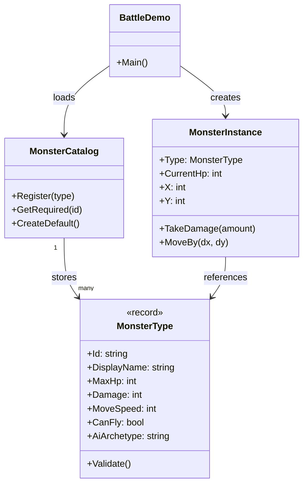
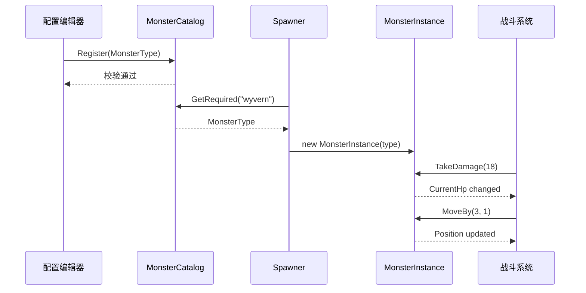

---
date: "2026-04-18"
title: "设计模式教科书｜Type Object：把类型从代码里搬到数据里"
description: "Type Object 让‘类型’不再等于‘一个子类’，而是变成可配置、可共享、可热更的数据对象。它适合装备、怪物、技能、关卡规则这类高变体系统，也最能说明数据驱动设计为什么比 class 爆炸更耐用。"
slug: "patterns-36-type-object"
weight: 936
tags:
  - 设计模式
  - Type Object
  - 软件工程
series: "设计模式教科书"
---

> 一句话定义：Type Object 把“分类信息、共享规则、默认参数”从类层次里拆出来，放进一个可复用的数据对象里，让运行期实例只关心自己这一次的状态。

## 历史背景

Type Object 不是从 GoF 书页里冒出来的，而是从“类层次开始失控”这件事里长出来的。早期 OOP 设计很容易走向一个老路：每加一个怪物、装备、法术、关卡规则，就新建一个子类。开始时这很顺手，等变体一多，编译器、策划、程序员三边都会被拖进同一个泥潭。

游戏和工具链最先撞上这个墙。怪物数值要频繁调，武器属性要按版本改，AI 行为要按关卡切换，脚本还要支持热更。把这些变化都塞进类定义里，代价不是“写法难看”，而是每次平衡调整都得改代码、跑编译、过测试、重新发布。类型一旦跟着数据一起变，系统就失去配置能力。

Game Programming Patterns 把这件事讲得很清楚：**“类型”未必应该由编译期类名表达，它也可以是运行时可读的数据。** 现代引擎和工业系统把这条线继续往前推，最后形成了资源文件、数据表、Data Asset、配置中心、ECS archetype 这些不同外壳，但底层思想几乎一致。

今天的引擎并不只是“把类改成表”这么简单。它们会把加载、校验、迁移、热更、回放一起纳入同一个类型边界：类型定义必须可读、可版本化、可合并，也必须能被工具链和运行时同时理解。这样一来，类型对象就不再是“临时的工程技巧”，而是编辑器、构建管线和运行时之间的协议。

## 一、先看问题

先看一个很典型的坏味道：每个变体都做成子类，逻辑和数据一起散开。

```csharp
using System;
using System.Collections.Generic;

public abstract class Monster
{
    public abstract string Name { get; }
    public abstract int MaxHp { get; }
    public abstract int Damage { get; }

    public virtual void Attack(string target)
    {
        Console.WriteLine($"{Name} hits {target} for {Damage} damage.");
    }
}

public sealed class Slime : Monster
{
    public override string Name => "Slime";
    public override int MaxHp => 24;
    public override int Damage => 3;
}

public sealed class FireSlime : Monster
{
    public override string Name => "Fire Slime";
    public override int MaxHp => 32;
    public override int Damage => 6;
}

public static class MonsterSpawner
{
    public static Monster Spawn(string id) => id switch
    {
        "slime" => new Slime(),
        "fire_slime" => new FireSlime(),
        _ => throw new ArgumentOutOfRangeException(nameof(id), $"Unknown monster type: {id}")
    };
}
```

这个写法的问题不在于“不能运行”，而在于它把三个不同层面的东西硬绑在一起了：

- **分类**：这是什么怪？
- **参数**：血量、攻击、速度是多少？
- **行为**：它该怎么打人、怎么移动、怎么掉落？

当变体从 2 个涨到 50 个，子类数量会膨胀，`switch` 也会膨胀。更糟的是，策划改一次 `Damage`，程序员却要跟着改代码。于是“调数值”这种低风险工作，被迫走正式发布流程。

另一种坏法更隐蔽：把所有变体塞进一个巨大 `switch`。

```csharp
public static class MonsterRules
{
    public static (int hp, int damage, int speed) GetStats(string id)
    {
        return id switch
        {
            "slime" => (24, 3, 2),
            "fire_slime" => (32, 6, 2),
            "ice_slime" => (28, 4, 3),
            _ => throw new ArgumentOutOfRangeException(nameof(id))
        };
    }
}
```

它比子类少了一点文件，却把结构压成了“代码里的表格”。只要规则开始分叉，比如火焰史莱姆会免疫燃烧、冰史莱姆会减速，就会继续向外扩散成第二层、第三层 `switch`，最后连维护者都记不住每条分支到底在表达什么。

## 二、模式的解法

Type Object 的核心不是“把类删掉”，而是把**稳定的行为**和**变化的类型数据**分开。

做法通常有三层：

1. 用一个不可变的 `Type Object` 表达共享定义。
2. 用一个运行期实例保存当前状态。
3. 用一个目录、仓库或表来管理这些类型定义。

这样，`MonsterInstance` 只保留当前血量、位置、冷却、仇恨，而 `MonsterType` 持有基础数值、掉落表、命名、AI 标签、是否可飞行等共享信息。

```csharp
using System;
using System.Collections.Generic;

public sealed record MonsterType(
    string Id,
    string DisplayName,
    int MaxHp,
    int Damage,
    int MoveSpeed,
    bool CanFly,
    string AiArchetype)
{
    public void Validate()
    {
        if (string.IsNullOrWhiteSpace(Id))
            throw new ArgumentException("Type id cannot be empty.", nameof(Id));
        if (MaxHp <= 0)
            throw new ArgumentOutOfRangeException(nameof(MaxHp), "MaxHp must be positive.");
        if (Damage < 0)
            throw new ArgumentOutOfRangeException(nameof(Damage), "Damage cannot be negative.");
        if (MoveSpeed < 0)
            throw new ArgumentOutOfRangeException(nameof(MoveSpeed), "MoveSpeed cannot be negative.");
    }
}

public sealed class MonsterInstance
{
    public MonsterType Type { get; }
    public int CurrentHp { get; private set; }
    public int X { get; private set; }
    public int Y { get; private set; }

    public MonsterInstance(MonsterType type)
    {
        Type = type ?? throw new ArgumentNullException(nameof(type));
        CurrentHp = type.MaxHp;
    }

    public bool IsAlive => CurrentHp > 0;

    public void TakeDamage(int amount)
    {
        if (amount < 0) throw new ArgumentOutOfRangeException(nameof(amount));
        CurrentHp = Math.Max(0, CurrentHp - amount);
    }

    public void MoveBy(int dx, int dy)
    {
        X += dx;
        Y += dy;
    }

    public override string ToString()
        => $"{Type.DisplayName} HP={CurrentHp}/{Type.MaxHp} Pos=({X},{Y})";
}

public sealed class MonsterCatalog
{
    private readonly Dictionary<string, MonsterType> _types = new(StringComparer.OrdinalIgnoreCase);

    public void Register(MonsterType type)
    {
        type.Validate();
        if (!_types.TryAdd(type.Id, type))
            throw new InvalidOperationException($"Duplicate monster type id: {type.Id}");
    }

    public MonsterType GetRequired(string id)
    {
        if (!_types.TryGetValue(id, out var type))
            throw new KeyNotFoundException($"Monster type not found: {id}");
        return type;
    }

    public static MonsterCatalog CreateDefault()
    {
        var catalog = new MonsterCatalog();
        catalog.Register(new MonsterType("slime", "Slime", 24, 3, 2, false, "melee"));
        catalog.Register(new MonsterType("fire_slime", "Fire Slime", 32, 6, 2, false, "melee"));
        catalog.Register(new MonsterType("wyvern", "Wyvern", 120, 18, 6, true, "ranged"));
        return catalog;
    }
}

public static class BattleDemo
{
    public static void Main()
    {
        var catalog = MonsterCatalog.CreateDefault();
        var enemies = new[]
        {
            new MonsterInstance(catalog.GetRequired("slime")),
            new MonsterInstance(catalog.GetRequired("wyvern"))
        };

        enemies[0].TakeDamage(5);
        enemies[1].MoveBy(3, 1);

        foreach (var enemy in enemies)
            Console.WriteLine(enemy);
    }
}
```

这段代码的关键点有三个。

第一，`MonsterType` 是共享定义。多个实例引用同一个 `MonsterType`，不会把“这只怪的身份”复制一遍。

第二，`MonsterInstance` 是运行期状态。血量、坐标、仇恨、冷却都在实例里，不会污染类型定义。

第三，`MonsterCatalog` 是边界。它负责校验、去重、查找，让外部不会直接碰散落的配置对象。

这就是 Type Object 的本体：**把“这类东西是什么”变成可配置的数据，把“这只东西现在是什么状态”留给实例。**

## 三、结构图



这个结构里，`Type Object` 不是“继承树的另一种写法”，而是“把继承该承载的稳定分类信息换成数据引用”。

## 四、时序图



这个运行过程很重要。类型在进入战斗前就被校验和冻结，运行期实例只做状态变化，不再承担“定义自己是谁”的职责。

## 五、变体与兄弟模式

Type Object 的常见变体有三种。

- **纯数据表**：类型定义存 CSV、JSON、Lua 表、ScriptableObject、Data Asset。
- **带方法的数据对象**：类型对象不仅存参数，也负责少量校验和派生计算。
- **层级化类型表**：基础类型加上派生覆盖，例如 `weapon_base -> sword -> fire_sword`。

它容易和下面几个模式混在一起：

- **Prototype**：Prototype 关注“复制一个原型再改局部字段”；Type Object 关注“共享一个定义，再生成多个实例”。
- **Flyweight**：Flyweight 关注的是把不可变内在状态共享到极致，解决的是海量对象的内存问题；Type Object 的重点更偏“语义分类”和“数据驱动”。
- **ECS archetype**：archetype 是组件组合与内存布局的分类，目的是让相同结构的实体排在一起；Type Object 不是布局模式，而是领域定义模式。

如果一句话概括三者：

- Type Object 解决“这是什么”。
- Prototype 解决“我要一个长得像它的副本”。
- Flyweight 解决“我能不能把重复部分合并掉”。

## 六、对比其他模式

| 对比项 | Type Object | Prototype | Flyweight |
|---|---|---|---|
| 解决问题 | 类型与数据一起爆炸 | 快速复制复杂对象 | 共享重复的内在状态 |
| 核心动作 | 读取和引用定义 | 克隆并微调 | 共享并外置变化状态 |
| 适合对象 | 怪物、装备、技能、规则 | 场景预设、复杂配置 | 大量视觉/几何/粒子单元 |
| 变体来源 | 配置表、资源文件、数据资产 | 原型实例 | 内在/外在状态拆分 |
| 常见误解 | 以为只是“把数据搬到表里” | 以为只要 `Clone()` 就行 | 以为只要缓存对象就叫 Flyweight |

再补一组容易混淆的对比：

| 对比项 | Type Object | ECS archetype |
|---|---|---|
| 关注点 | 领域语义 | 数据布局 |
| 典型对象 | 装备、怪物、法术 | Entity + Component 组合 |
| 变化方式 | 改类型定义或配置 | 改组件组合与系统逻辑 |
| 优势 | 策划友好、表达直接 | 批处理、缓存友好 |

如果你做的是“内容可配置、但每个内容仍有自己的语义”，Type Object 更像第一选择。如果你做的是“要把大量实体按组件布局高效跑起来”，那已经在靠近 ECS 了。

## 七、批判性讨论

Type Object 很强，但它不是免费午餐。

第一类批评是“它会把系统变成一堆贫血数据”。这话对一半。Type Object 确实会把字段集中到数据层，如果你不补校验、不补派生规则、不补约束，最后就是一堆谁都能写、谁都能改的配置袋。真正健康的做法，是让类型对象保持**不可变**，把复杂规则收回到验证器、编译器或工厂里。

第二类批评是“行为还是会漏回 `switch`”。这也是实话。类型对象只能承载**真正共享的行为边界**。如果某个类型差异已经大到连攻击规则、移动规则、状态机都分叉，那它不该继续留在同一个 Type Object 里。该拆出策略、状态机、脚本或组件时就要拆。

第三类批评来自版本演进。数据驱动最怕 schema 演化失控：今天加 `CanFly`，明天加 `ArmorType`，后天加 `LootTable`，再往后还要兼容旧存档。只要你把类型定义外置，就必须面对迁移、默认值和回滚。这是代价，不是缺陷；只是很多团队在追求“策划可改”时，会故意忽略它。

所以 Type Object 不是“越多越好”，而是“**把本该稳定共享的语义，集中成一个可校验的定义**”。

## 八、跨学科视角

Type Object 和数据库设计很像。

数据库里，`row` 对应实例，`schema` 或 `lookup table` 对应类型定义。你不会把“今天这个订单的状态”写成一个新表结构；你会把状态值引用到一个枚举表或字典表里。Type Object 本质上也是这件事：实例存事实，类型存语义。

它也和 AI 行为系统很像。很多行为树、有限状态机、GOAP、对话系统，最后都会把“职业、阵营、武器偏好、感知阈值”做成数据，再让一套执行器读取这些数据。这样，AI 逻辑不用为每个敌人复制一份脚本，调参也不用重新编译。

从编译器角度看，Type Object 其实像“符号表 + 常量表”。语法树负责结构，符号表负责身份，常量池负责共享值。把类型信息抽离成数据，就是把“名字”与“实例”分层管理。

## 九、真实案例

- **Godot**：`Resource` 直接把数据容器做成一等公民。官方文档说明它是资源基类，主要承担数据容器职责，并通过 `ResourceLoader` 统一加载与缓存。链接：`https://docs.godotengine.org/en/4.3/classes/class_resource.html`、`https://docs.godotengine.org/en/4.x/classes/class_resourceloader.html`
- **Unreal Engine**：`UDataAsset` 专门用来承载数据。官方 API 文档给出头文件路径 `/Engine/Source/Runtime/Engine/Classes/Engine/DataAsset.h`，实现路径 `/Engine/Source/Runtime/Engine/Private/DataAsset.cpp`。链接：`https://dev.epicgames.com/documentation/en-us/unreal-engine/API/Runtime/Engine/Engine/UDataAsset/__ctor`
- **这两个案例的共同点**：逻辑对象和数据定义分离，实例引用共享定义，编辑器或加载器负责校验与缓存。

如果你要把这个模式讲给引擎程序员听，最好直接把“资源 / 数据资产 / 实例”三层说清楚，因为他们每天都在跟这类边界打交道。

## 十、常见坑

1. **把行为也塞进类型对象**

   为什么错：类型对象一旦开始做复杂行为，就会变成“半个上帝对象”。这时你不再是在做数据驱动，而是在把继承树换成配置树。

   怎么改：只保留共享定义、校验、派生计算。真正会变的逻辑放进 Strategy、State 或脚本系统。

2. **让运行期实例修改共享定义**

   为什么错：实例改了类型对象，所有引用它的实例都会一起变，结果像多米诺骨牌。

   怎么改：类型对象做成不可变，实例单独存状态。确实要做临时覆盖，就做“实例覆盖层”，不要直接改共享定义。

3. **只存 ID，不存校验**

   为什么错：数据驱动系统最怕“能加载，但语义不合法”。这类错误通常不在编译期暴露，到了运行时才炸。

   怎么改：注册时验证、加载时验证、热更时验证。把不变量写进 `Validate()`，把依赖关系写进 `Catalog`。

4. **把所有差异都当成类型**

   为什么错：如果每个微小差异都做成一个 `Type Object`，最后只是把类爆炸换成表爆炸。

   怎么改：先问这是不是“语义差异”。只是数值不同就放到类型对象；行为不同就拆策略；生命周期不同就拆状态。

## 十一、性能考量

Type Object 的性能收益主要来自三件事。

第一，**减少重复字段**。如果 10,000 个实例都把同一组基础参数各自复制一份，内存会被白白吃掉。把共享数据放进一个类型对象后，实例只留引用和状态字段。

第二，**降低构造成本**。实例创建时不再复制一大坨配置，只需要拿一个引用，初始化路径更短。

第三，**提高缓存友好度**。定义集中后，加载器、校验器、热更器能对一组类型做批处理，而不是对每个实例做重复工作。

举一个简单的量化例子。

假设一个怪物类型包含 6 个 8 字节字段，总计约 48B。若 10,000 个实例都复制这份定义，光定义字段就要约 480KB。若改为共享一份类型对象，再给每个实例保留一个 8 字节引用，实例侧只需要约 80KB 引用开销，加上 48B 的共享定义，等于把重复定义从“每个实例一份”压成“全局一份”。这不是微优化，而是结构性节省。

复杂度也很清楚：

- 查找类型：`O(1)` 哈希查找
- 创建实例：`O(1)`
- 增加新类型：`O(1)` 注册，外加校验成本

真正要注意的不是算法复杂度，而是**配置表规模增长后的验证成本**。表越大，schema 迁移和一致性检查越重要。

## 十二、何时用 / 何时不用

适合用 Type Object 的场景通常有这几个共同点：

- 同类对象数量多，差异主要在数据。
- 需要编辑器驱动、策划驱动或配置驱动。
- 运行期实例和静态定义必须分离。
- 需要热更、版本迁移或远程配置。

不适合用的场景也很明确：

- 每个变体都有独特行为，已经不是“同一类型的不同参数”。
- 规则极其复杂，数据层无法表达约束。
- 变体极少，直接写成代码更清楚。
- 你只是在给几个常量换个马甲，根本不需要额外的抽象层。

一句话判断：**如果差异主要是“参数”，用 Type Object；如果差异主要是“算法”，用 Strategy；如果差异主要是“实例形状”，再考虑 Prototype 或 ECS。**

## 十三、相关模式

- [Template Method](./patterns-02-template-method.md)：当“流程固定、步骤变化”时，Template Method 比 Type Object 更直接。
- [Factory Method 与 Abstract Factory](./patterns-09-factory.md)：工厂负责把配置、原型或表格转成实例；Type Object 常常就是工厂喂进去的那份数据。
- [Prototype](./patterns-20-prototype.md)：如果你需要的不是“类型定义”，而是“从一个实例克隆出另一个实例”，就该看 Prototype。
- [ECS 架构](./patterns-39-ecs-architecture.md)：当类型差异开始影响布局和批处理，Type Object 往往会和 ECS 一起出现。
- [Hot Reload 架构](./patterns-45-hot-reload.md)：类型对象外置后，热更就从“改代码”变成“改数据或脚本”。

## 十四、在实际工程里怎么用

在游戏引擎里，Type Object 最常落在四个地方。

第一是**怪物、装备、技能、掉落、关卡规则**。这些东西最适合用数据表、资源文件或数据资产表达，因为它们大多是“同一套逻辑 + 多组参数”。

第二是**脚本系统**。脚本执行器负责行为，脚本元数据负责类型。比如一段 AI 行为可以引用一个 `MonsterType`，由类型数据决定它是否飞行、是否远程、是否优先追击。

第三是**AI 行为与配置驱动系统**。行为树节点、对话选项、任务模板、战斗规则都经常需要共享定义。Type Object 让这些共享定义在编辑器里可见、可查、可热更。

第四是**配置驱动场景**。场景模板、道具模板、生成表、刷怪表，本质上都在把“类型”变成数据。

更重要的是，这条流水线要把“谁改什么”说清楚：策划改的是目录数据，程序员改的是校验器和实例工厂，工具链改的是迁移器和打包器。这样一来，运行时的失败面会被压缩，定义错了就死在加载期，实例错了就死在工厂期，只有真正的行为缺陷才会活到执行期。错误暴露得越早，团队越不容易把时间耗在追线上。

再往前走一步，Type Object 还会影响你的版本策略。类型定义既然已经外置，就必须支持默认值、废弃字段、兼容映射和自动迁移。好处是这些工作都能集中在目录层完成，不必散落到每一个实例类里；坏处是你必须把 schema 演化当成一等工程问题来对待。

如果你要把这条线串成系列，最实用的链接方式是：

- 先看 [Template Method](./patterns-02-template-method.md)，理解“流程固定，变化点在哪里”。
- 再看 [Factory Method 与 Abstract Factory](./patterns-09-factory.md)，理解“谁负责把定义造出来”。
- 再看 [Prototype](./patterns-20-prototype.md)，理解“什么时候复制比引用更合适”。
- 未来如果把定义交给热更新系统，再接 [Hot Reload 架构](./patterns-45-hot-reload.md)。
- 当类型开始影响实体布局和系统批处理，再接 [ECS 架构](./patterns-39-ecs-architecture.md)。

这就是 Type Object 在真实工程里的位置：**它不是终点，而是把数据驱动、热更和批处理串起来的前置条件。**

如果把它放到工程流水线里看，最稳的做法不是让脚本直接吃散乱的 JSON，而是先把外部配置编译成一个受控的类型目录，再把这个目录发给运行时。这样设计师改的不是“某个对象的字段”，而是“这类对象的定义”；程序员守的也不是每个实例，而是定义校验器、实例工厂和迁移器。

## 小结

- 它把“类型”从子类树里拆出来，变成可校验、可共享、可热更的数据。
- 它最适合高变体、强配置、强编辑器驱动的系统，而不是每个差异都写一个子类。
- 它和 Prototype、Flyweight、ECS archetype 关系很近，但解决的问题并不相同。

一句话收束：**Type Object 的价值，不是少写几个类，而是让“谁是类型、谁是实例、谁能改参数”这三件事重新分家。**


 很稳。
