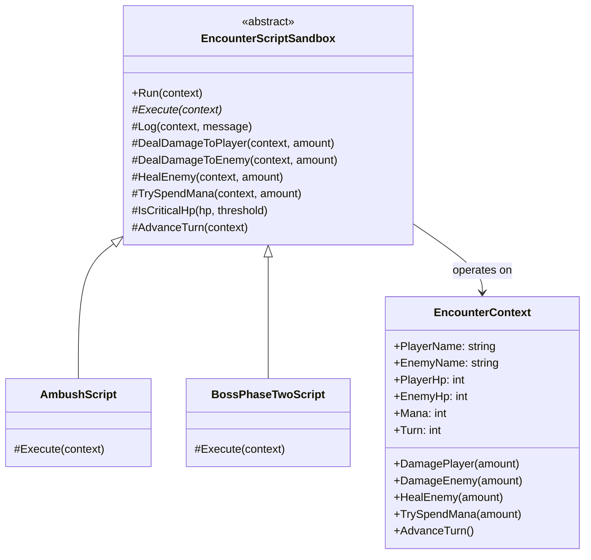
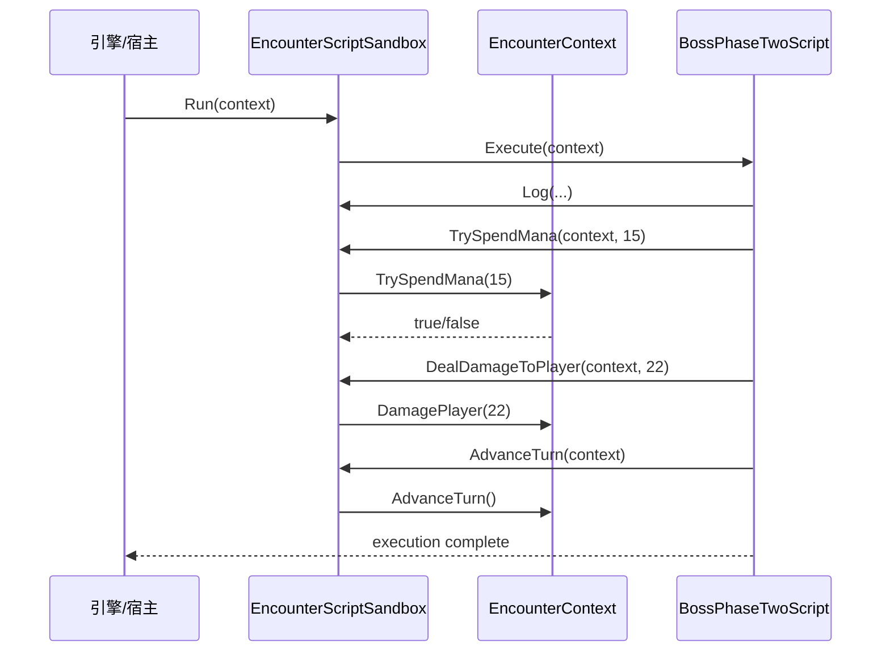

---
date: "2026-04-18"
title: "设计模式教科书｜Subclass Sandbox：父类给工具箱，子类拼行为"
description: "Subclass Sandbox 让父类只暴露受控能力，子类用这些能力自行组合行为。它比 Template Method 更松，也更危险：父类不再规定完整流程，而是用一组保护好的工具把子类的自由关进笼子里。"
slug: "patterns-37-subclass-sandbox"
weight: 937
tags:
  - 设计模式
  - Subclass Sandbox
  - 软件工程
series: "设计模式教科书"
---

> 一句话定义：Subclass Sandbox 不是让子类接管全部流程，而是让父类提供一组受控的“内部工具”，子类只能在这组工具允许的边界里拼出自己的行为。

## 历史背景

Subclass Sandbox 出现得很早，早到它几乎和框架编程、游戏引擎一起长大。Smalltalk、MFC、Qt、早期游戏引擎都在做同一件事：父类负责维护对象的不变量，子类只负责填自己的那点差异。问题在于，真正复杂的系统并不只要“一个钩子”，它要的是一整套受控能力：读状态、写状态、发事件、调参数、查资源、提交结果。

这时如果只靠 Template Method，父类就只能把整条流程写死；如果把所有内部字段都暴露给子类，父类的不变量又会被轻易打穿。Subclass Sandbox 就是在这两端之间找平衡：**父类不决定所有步骤，但父类决定哪些能力可以被子类使用，以及这些能力以什么顺序、什么约束被使用。**

在游戏引擎里，这种需求尤其强。一个 AI 行为、一个战斗脚本、一个关卡规则，往往都希望“在同一套运行时里编写不同逻辑”，但又不能让脚本随便篡改引擎状态。于是父类工具箱、受控暴露、生命周期钩子，这几个词就会一起出现。

从框架史上看，这个模式几乎是“基类驱动扩展”的自然结果。引擎先暴露最少量的生命周期入口，再把常用操作打包成 protected helper，最后让子类在这些边界里组合出自己的玩法。这样做的核心收益不是继承本身，而是把“底盘”和“扩展点”分开：底盘负责一致性，扩展点负责多样性。

## 一、先看问题

最直接的坏法，是把父类做成一坨可变状态，子类想怎么改就怎么改。

```csharp
public abstract class BadEncounterScript
{
    public int PlayerHp;
    public int EnemyHp;
    public int Mana;

    public abstract void Execute();
}

public sealed class BadBossPhase : BadEncounterScript
{
    public override void Execute()
    {
        // 子类直接改共享字段，父类根本不知道发生了什么
        Mana -= 30;
        EnemyHp += 999; // 这里甚至可以绕过任何上限约束
        PlayerHp -= 80;
    }
}
```

这类代码能跑，但它有两个致命问题。

第一，**父类的不变量形同虚设**。父类本来可能想保证“血量不能为负”“法力不能超过上限”“冷却必须递增”，但子类直接改字段，约束就被绕开了。

第二，**行为顺序完全失控**。一个子类可能先扣血再检查状态，另一个先检查再扣血，第三个又在半路发事件。后面你一旦要加护盾、免疫、插值动画、事件回放，所有子类都会被牵着一起改。

更常见的坏法，是父类只留一个大而全的方法，子类必须 override 整个流程。

```csharp
public abstract class TooRigidScript
{
    public void Run()
    {
        LoadContext();
        Validate();
        Execute();
        Commit();
    }

    protected virtual void LoadContext() { }
    protected virtual void Validate() { }
    protected abstract void Execute();
    protected virtual void Commit() { }
}
```

这比裸字段好一点，但还是太硬。子类如果只想复用 `Validate()` 里的一个小工具，或者想在 `Execute()` 中间穿插一次回滚，它还是得吞下整个父类流程。

Subclass Sandbox 要解决的，正是这两种极端。

## 二、模式的解法

Subclass Sandbox 的思路很简单：**父类不只给钩子，也给工具；子类不只填空，也能拼装。**

父类负责三件事：

1. 持有不变量。
2. 提供受保护的 helper methods。
3. 决定哪些状态可以通过 helper 访问。

子类只做一件事：在这组 helper 的边界内，组合出自己的行为。

下面是一个可运行的纯 C# 版本。它模拟的是“战斗遭遇脚本”，很像游戏引擎里常见的战斗 AI、关卡事件或任务规则。

```csharp
using System;
using System.Collections.Generic;

public sealed class EncounterContext
{
    public string PlayerName { get; }
    public string EnemyName { get; }
    public int PlayerHp { get; private set; }
    public int EnemyHp { get; private set; }
    public int Mana { get; private set; }
    public int Turn { get; private set; }
    public List<string> Log { get; } = new();

    public EncounterContext(string playerName, string enemyName, int playerHp, int enemyHp, int mana)
    {
        PlayerName = playerName ?? throw new ArgumentNullException(nameof(playerName));
        EnemyName = enemyName ?? throw new ArgumentNullException(nameof(enemyName));
        PlayerHp = Math.Max(0, playerHp);
        EnemyHp = Math.Max(0, enemyHp);
        Mana = Math.Max(0, mana);
    }

    public void DamagePlayer(int amount) => PlayerHp = Math.Max(0, PlayerHp - Math.Max(0, amount));
    public void DamageEnemy(int amount) => EnemyHp = Math.Max(0, EnemyHp - Math.Max(0, amount));
    public void HealEnemy(int amount) => EnemyHp += Math.Max(0, amount);
    public bool TrySpendMana(int amount)
    {
        if (amount < 0) throw new ArgumentOutOfRangeException(nameof(amount));
        if (Mana < amount) return false;
        Mana -= amount;
        return true;
    }
    public void AdvanceTurn() => Turn++;
}

public abstract class EncounterScriptSandbox
{
    public void Run(EncounterContext context)
    {
        if (context is null) throw new ArgumentNullException(nameof(context));
        Execute(context);
    }

    protected abstract void Execute(EncounterContext context);

    protected void Log(EncounterContext context, string message)
        => context.Log.Add($"[Turn {context.Turn}] {message}");

    protected void DealDamageToPlayer(EncounterContext context, int amount)
        => context.DamagePlayer(amount);

    protected void DealDamageToEnemy(EncounterContext context, int amount)
        => context.DamageEnemy(amount);

    protected void HealEnemy(EncounterContext context, int amount)
        => context.HealEnemy(amount);

    protected bool TrySpendMana(EncounterContext context, int amount)
        => context.TrySpendMana(amount);

    protected bool IsCriticalHp(int hp, int threshold) => hp <= threshold;

    protected void AdvanceTurn(EncounterContext context)
        => context.AdvanceTurn();
}

public sealed class AmbushScript : EncounterScriptSandbox
{
    protected override void Execute(EncounterContext context)
    {
        Log(context, $"{context.EnemyName} 从阴影里冲出来。");
        if (IsCriticalHp(context.PlayerHp, 20))
        {
            Log(context, $"{context.PlayerName} 太虚弱了，直接补刀。");
            DealDamageToPlayer(context, 28);
            AdvanceTurn(context);
            return;
        }

        DealDamageToPlayer(context, 12);
        if (TrySpendMana(context, 10))
            Log(context, "触发了第二段追击。");
        else
            Log(context, "法力不足，放弃连招。");

        AdvanceTurn(context);
    }
}

public sealed class BossPhaseTwoScript : EncounterScriptSandbox
{
    protected override void Execute(EncounterContext context)
    {
        Log(context, $"{context.EnemyName} 进入第二阶段。");
        if (IsCriticalHp(context.EnemyHp, 30))
        {
            HealEnemy(context, 25);
            Log(context, "Boss 进入狂暴回血。");
        }

        if (TrySpendMana(context, 15))
        {
            DealDamageToPlayer(context, 22);
            DealDamageToPlayer(context, 14);
            Log(context, "释放了双段冲击波。");
        }
        else
        {
            DealDamageToPlayer(context, 18);
            Log(context, "法力不足，改用普通攻击。");
        }

        AdvanceTurn(context);
    }
}

public static class Demo
{
    public static void Main()
    {
        var encounter = new EncounterContext("Hero", "Ash Warden", 64, 120, 18);
        EncounterScriptSandbox script = new BossPhaseTwoScript();
        script.Run(encounter);

        foreach (var line in encounter.Log)
            Console.WriteLine(line);

        Console.WriteLine($"PlayerHp={encounter.PlayerHp}, EnemyHp={encounter.EnemyHp}, Mana={encounter.Mana}");
    }
}
```

这段代码里，子类并没有直接摸 `PlayerHp`、`EnemyHp`、`Mana` 的内部细节。它们只能通过父类的 helper 访问受控入口。这样做的意义不是“更安全”这么简单，而是让父类保住了所有不变量的主权。

换句话说，Subclass Sandbox 的父类不再要求子类按它的步骤走，但它仍然掌握“**能做什么**”这件事。

## 三、结构图



这个类图里最关键的是 `EncounterContext`。它把真正的状态变更收拢住，父类 helper 再去操作它。这样子类虽然能组合行为，却不能随意打穿对象边界。

## 四、时序图



你会发现，运行时真正的控制权仍然在父类和上下文里。子类只是发出有限指令，而不是接管对象内部结构。

## 五、变体与兄弟模式

Subclass Sandbox 的常见变体有三种。

- **工具箱型**：父类主要提供 helper，子类自由组合。
- **钩子型**：父类在关键节点留少量 hook，子类在 hook 内部使用 helper。
- **半模板型**：父类把大框架固定下来，但留出若干局部“沙盒”让子类自行拼装。

它最容易和下面两个模式混在一起：

- **Template Method**：Template Method 规定整个流程，Subclass Sandbox 只规定可用工具。前者管顺序，后者管能力。
- **Strategy**：Strategy 用组合替代继承，把整个算法当对象替换；Subclass Sandbox 仍然走继承，只是把父类能力收紧。

这三个模式的边界如果画出来，大概是这样的：

- Template Method：父类说“先 A 再 B 再 C”。
- Subclass Sandbox：父类说“你只能用 A/B/C/D 这些工具，顺序你自己定”。
- Strategy：父类连工具都不提供，只是把“做法”当参数传进来。

## 六、对比其他模式

| 对比项 | Subclass Sandbox | Template Method | Strategy |
|---|---|---|---|
| 父类控制什么 | 能力边界 | 行为顺序 | 几乎不控制算法本体 |
| 子类/策略能做什么 | 在工具箱里自由组合 | 填补预留步骤 | 提供可替换算法 |
| 主要风险 | 保护不变量不够严，helper 过多 | 脆弱基类，流程僵硬 | 对象数量变多，配置复杂 |
| 适用场景 | 框架、引擎、脚本宿主 | 固定业务流程 | 运行时切换算法 |
| 读者误区 | 以为它就是“弱版 Template Method” | 以为它只适合 UI 框架 | 以为继承和组合没差别 |

如果你把 `Subclass Sandbox` 误写成 Template Method，就会很别扭：子类明明只想插一小段逻辑，却被迫继承整条流程。反过来，如果你把它误写成 Strategy，又会把本该由父类守住的不变量交出去，最后谁都能乱改状态。

## 七、批判性讨论

Subclass Sandbox 的最大批评，就是它把继承那套老问题带回来了。

第一，**脆弱基类风险**依然存在。父类只要改一个 helper 的语义，所有子类都可能受到影响。父类多了一个前置条件，子类可能就不再成立。这种耦合比接口耦合更隐蔽，因为它藏在 `protected` 里。

第二，**helper 很容易膨胀**。父类一开始只给三四个方法，后来业务一变，`protected` 方法越来越多，最后父类变成了一排半公开 API。到了那一步，你其实是在维护一个“只能给子类用的公共库”。

第三，**测试和替换更难**。Subclass Sandbox 让行为走继承，不走注入。你很难像 Strategy 那样把某一段算法单独替换成 fake 对象，也很难像组合那样把依赖显式传入。结果就是，越接近引擎层，越容易被“写起来顺手、测起来费劲”反噬。

还有一个更现实的风险：父类 helper 会逐渐长成“隐式 SDK”。一开始大家只用 `Log`、`Damage`、`SpendMana`，后来每个子类都在期待一个新的受保护入口。父类的公共面没有变大，`protected` 面却在悄悄变大，最后维护者必须把整个继承家族都放进脑子里，才能改动一个看起来无害的 helper。

所以这个模式适合的是**父类必须握住主权、但子类仍然需要较大自由度**的场景，而不是“我懒得拆接口”的场景。

## 八、跨学科视角

Subclass Sandbox 和编译器里的“受控扩展点”很像。

编译器前端常常有一套基类或 visitor 框架：父类管理遍历、符号表和错误收集，子类只负责某类节点的具体处理。你不能让某个子类随便改整棵 AST，但你又确实需要它在受限范围里做事情。

它和 AI 行为系统也很像。行为树节点、黑板读写、感知查询、技能触发，本质上都是一组受控原语。你不希望行为作者直接操纵引擎内部对象，而是让他们通过一套限定动作表达意图。Subclass Sandbox 就是把这套思路放进继承层里。

## 九、真实案例

- **Godot**：`Node` 文档明确列出 `_ready()`、`_process()`、`_physics_process()` 等虚方法，并说明定义后引擎会自动调用。链接：`https://docs.godotengine.org/en/4.5/classes/class_node.html`、`https://docs.godotengine.org/en/4.x/tutorials/scripting/idle_and_physics_processing.html`
- **Unreal Engine**：`AActor::BeginPlay` 和 `AActor::Tick` 都是可覆写的生命周期入口，官方文档给出了头文件 `/Engine/Source/Runtime/Engine/Classes/GameFramework/Actor.h` 和实现 `/Engine/Source/Runtime/Engine/Private/Actor.cpp`。链接：`https://dev.epicgames.com/documentation/en-us/unreal-engine/API/Runtime/Engine/GameFramework/AActor/BeginPlay`、`https://dev.epicgames.com/documentation/en-us/unreal-engine/API/Runtime/Engine/GameFramework/AActor/Tick`
- **共同点**：宿主只暴露一组受控生命周期入口，外部脚本或子类在这组入口里拼行为，而不是随意篡改底层对象。

这也是为什么很多引擎代码会把“能覆写什么”和“能调用什么”分得很细。Subclass Sandbox 的边界如果不清楚，整个对象层就会被子类写成泥。

把它放到实际工程里，你会发现它最适合“可编排但不可越权”的场景：AI 行为作者想组合移动、攻击、蓄力、广播事件，脚本宿主却不能让他们直接碰底层资源；关卡规则作者想调节节奏、掉落、波次、胜负条件，宿主也不该把全局世界对象暴露成任意写字段。此时父类工具箱就是安全带，子类自由度则是脚本系统的活性来源。

## 十、常见坑

1. **helper 太多，父类变成工具大杂烩**

   为什么错：helper 一多，子类看似自由，实际上是在和一堆隐性规则打交道。父类也会失去可维护性。

   怎么改：只保留最常用、最稳定、最能代表主权边界的工具。其余能力该下沉到协作对象就下沉。

2. **把调用顺序写成默认约定，却不写清楚**

   为什么错：子类如果不知道先后顺序，最后只能靠试错。这个问题在多人协作和热更系统里尤其危险。

   怎么改：把顺序要求写成文档、注释，或直接收进一个小型模板方法里，让约束显式化。

3. **把受控状态直接暴露给子类**

   为什么错：一旦 `protected` 字段太多，子类就不再是“用工具”，而是在“操纵底盘”。

   怎么改：尽量让状态通过方法访问，或者让状态集中在上下文对象里，再由 helper 统一变更。

4. **用它替代组合，只因为“继承写起来快”**

   为什么错：Subclass Sandbox 本来就站在继承这一侧，不能拿它来粉饰不该继承的关系。

   怎么改：如果算法只是可替换，而不是必须共享父类能力，就直接换 Strategy 或组件组合。

## 十一、性能考量

Subclass Sandbox 不是性能模式，但它确实会影响性能路径。

最直接的成本是虚调用。子类调用 helper 方法时，仍然要过一次方法分发。这个成本通常很小，远小于游戏逻辑本身的分支和数据访问成本，但它不会凭空消失。

更现实的成本是**继承层级变深之后的可优化性下降**。父类 helper 如果很碎，JIT 和编译器更难内联跨层调用；父类一旦堆出大量状态访问，局部性也会变差。对实时系统来说，这种“本来能跑直线，最后被写成迷宫”的代价比单次调用开销更重要。

所以这类模式的性能判断不该盯着“多了一次调用”这种小数点，而要盯着“调用路径是不是还能被人读懂、被编译器理解、被测试覆盖”。

## 十二、何时用 / 何时不用

适合用 Subclass Sandbox 的情况：

- 父类必须维护强不变量。
- 子类需要较大自由度，但不能碰所有内部状态。
- 你在写引擎、框架、宿主、脚本运行时。
- 行为变化主要来自“组合现有工具”，而不是“换一套完全不同的算法”。

不适合用的情况：

- 只有一两个小差异，完全可以用 Strategy。
- 行为顺序固定且简单，Template Method 更直接。
- 子类需要大量访问内部状态，说明你该重构上下文对象了。
- 团队不擅长继承约束，维护成本会迅速放大。

一句话判断：**如果父类要守边界，子类要拼行为，Subclass Sandbox 合适；如果父类还要替子类把流程全定死，那就回到 Template Method。**

## 十三、相关模式

- [Template Method](./patterns-02-template-method.md)：父类定流程，子类填细节；Subclass Sandbox 是“父类给工具，子类自己编排”。
- [Strategy](./patterns-03-strategy.md)：当你发现子类只是可替换算法时，Strategy 往往比继承更干净。
- [Type Object](./patterns-36-type-object.md)：如果你是在用继承表达“数据差异”，先看看能不能把它下沉成类型对象。
- [Prototype](./patterns-20-prototype.md)：当子类本身更像“预设模板”，Prototype 可能更直接。

## 十四、在实际工程里怎么用

在游戏引擎、脚本系统、AI 行为和配置驱动场景里，Subclass Sandbox 常常以“**基类 + 可覆写生命周期 + 受保护 helper**”的形式出现。

最常见的落点是：

- **AI 行为脚本**：父类提供感知、移动、攻击、冷却、事件广播等 helper，子类只拼逻辑。
- **战斗规则脚本**：父类保证结算顺序，子类只决定这回合用了哪几个工具。
- **关卡事件**：父类负责资源访问、日志和回放，子类负责编排。
- **配置驱动宿主**：配置决定用哪个子类，子类在有限工具里完成行为。

如果你要在系列里把这条线串起来，最顺手的链接是：

Subclass Sandbox 的常见工程形态还会带一个白名单 API 层。父类把“可调用能力”限定成几类小动作，比如移动、发事件、查询资源、请求动画、提交回放；子类只能拼装这些动作，而不能碰更底层的对象图。这样做的代价，是脚本作者少了一点自由；换来的，是引擎状态更稳定、回放更可靠、调试更可控。对 AI 行为、关卡事件、任务编排来说，这个代价通常是合算的。

不过，helper 也会跟着版本一起老化。今天还很好用的 `DealDamageToPlayer()`，明天可能要支持护盾、减伤、无敌帧、元素穿透和网络回放。只要父类 helper 的语义变了，所有子类都要重新验证一遍，这就是继承在工程上的真实成本。所以 Subclass Sandbox 适合“边界稳定、工具稳定、行为变化频繁”的系统，而不适合“规则还在快速重写”的系统。

如果你要在系列里把这条线串起来，最顺手的链接是：

- 先看 [Template Method](./patterns-02-template-method.md)，对比“流程主权”和“工具主权”的差别。
- 再看 [Factory Method 与 Abstract Factory](./patterns-09-factory.md)，理解宿主怎么把不同脚本实例化出来。
- 再看 [Prototype](./patterns-20-prototype.md)，理解预设行为或脚本模板如何复制。
- 如果你后面把脚本改成热更新字节码或脚本包，再接 [Hot Reload 架构](./patterns-45-hot-reload.md)。
- 如果这些行为最后演化成实体系统里的数据驱动执行，再接 [ECS 架构](./patterns-39-ecs-architecture.md)。

这篇的落点很明确：**引擎想要开放扩展点，但不能把底盘也一起送出去。** Subclass Sandbox 就是把这道门卡在中间。

在配置驱动的项目里，这种边界还会直接决定团队分工。脚本作者只负责写“行为”，引擎作者负责提供“原语”，工具作者负责把这些原语包成可视化、可热更、可回放的工作流。只要这三层不混在一起，脚本就不会偷偷越权，编辑器也不会变成一坨无法审计的特权接口。

## 小结

- 它让父类握住不变量，让子类在受控工具箱里拼行为。
- 它比 Template Method 更松，比纯暴露内部状态更安全，但也更容易积累脆弱基类问题。
- 它在引擎、脚本、AI 和任务系统里特别常见，因为这些系统既要扩展性，也要约束。

一句话收束：**Subclass Sandbox 的价值，不是让继承更自由，而是让自由发生在父类可控的边界里。**


在实际团队里，这类父类最好配合单元测试和契约测试一起维护。因为 helper 的语义一旦稳定，子类就会把它当成协议来用；这时改 helper 不只是改实现，而是在改继承族的默认语言。协议要想长期活着，注释、测试和版本说明必须一起跟上。
 这也是为什么它更适合被当成框架层的模式，而不是应用层的偷懒方案。
 它更像引擎基类的边界设计，而不是普通业务里随手可写的继承模板。
。
！
 就够了。

 这条边界越清楚，子类越少出事。
 它更适合框架边界，不适合随手继承。
