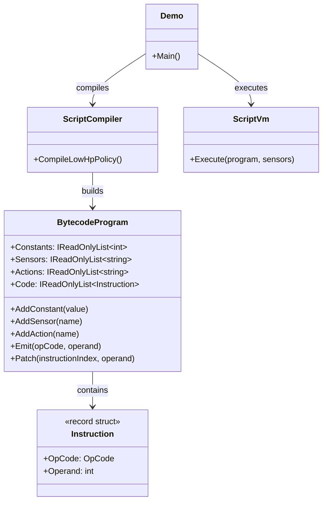
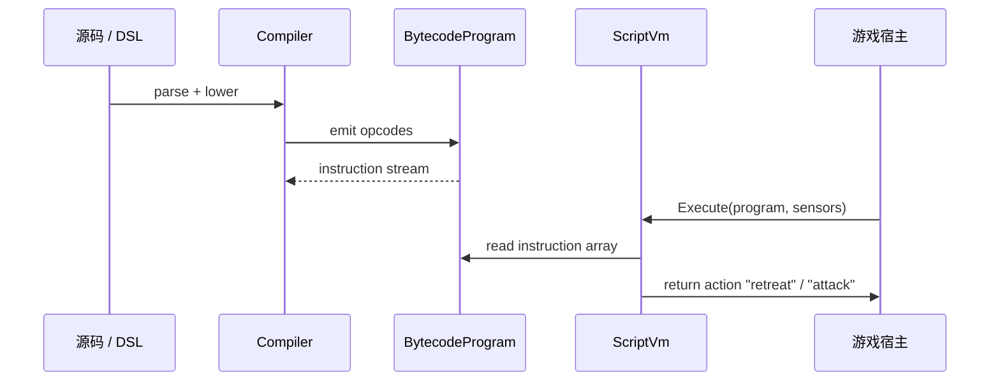

---
date: "2026-04-18"
title: "设计模式教科书｜Bytecode：把脚本变成指令流"
description: "Bytecode 把源代码先压成紧凑的指令流，再用一个小而稳定的虚拟机去执行。它比 AST 解释器更省内存、更容易做性能控制，也比 JIT 更适合把‘可热更、可嵌入、可移植’放在第一位的脚本系统。"
slug: "patterns-38-bytecode"
weight: 938
tags:
  - 设计模式
  - Bytecode
  - 软件工程
series: "设计模式教科书"
---

> 一句话定义：Bytecode 先把高层脚本翻译成一串紧凑、可跳转、可复用的指令，再交给一个小型 VM 去解释执行。

## 历史背景

Bytecode 比很多 GoF 模式都更老。Forth、Smalltalk、Lisp、Java、Lua、Wren 这些系统都在用同一条思路：如果你不想每次都重新解析源代码，也不想把每个语法节点都做成运行期对象，那就把程序压成指令流，再由一个固定解释器去跑。

它出现的时代背景很朴素：内存贵、CPU 也贵，跨平台更贵。编译到机器码不是总能做到，或者做起来太重；直接解释 AST 又太慢。Bytecode 正好站在两者之间：它比源代码更紧凑，比 AST 更规整，比 JIT 更容易嵌入主程序。对游戏脚本、插件 DSL、规则引擎、自动化流程来说，这个折中一直都很值钱。

在游戏圈，Bytecode 还解决了另一个现实问题：**脚本要能在运行时加载、修改、缓存、回放，最好还能把宿主语言和脚本语言隔离开。** 这时你需要的不是“高级语言有多花”，而是“指令流够不够稳定，VM 够不够小，热更链路够不够短”。

Bytecode 真正厉害的地方，在于它把“源代码如何表达”与“运行时如何执行”彻底拆开了。前端可以变得很花：有语法糖、有宏、有编译期折叠、有静态检查；后端却能保持很稳：一条指令一个语义、一组栈操作一个状态变更。只要 VM 的 opcode 集合不乱变，前端和后端就能长期分离，这也是为什么很多脚本语言最终都会收敛到 bytecode。

## 一、先看问题

先看最典型的 AST 解释器坏味道：每次执行都要沿着对象树走一遍。

```csharp
using System;
using System.Collections.Generic;

public interface IExpr
{
    int Evaluate(IReadOnlyDictionary<string, int> variables);
}

public sealed class ConstantExpr : IExpr
{
    private readonly int _value;
    public ConstantExpr(int value) => _value = value;
    public int Evaluate(IReadOnlyDictionary<string, int> variables) => _value;
}

public sealed class VariableExpr : IExpr
{
    private readonly string _name;
    public VariableExpr(string name) => _name = name;
    public int Evaluate(IReadOnlyDictionary<string, int> variables) => variables[_name];
}

public sealed class AddExpr : IExpr
{
    private readonly IExpr _left;
    private readonly IExpr _right;
    public AddExpr(IExpr left, IExpr right) { _left = left; _right = right; }
    public int Evaluate(IReadOnlyDictionary<string, int> variables)
        => _left.Evaluate(variables) + _right.Evaluate(variables);
}
```

这套写法直观，但它有三个开销。

第一，每个节点都是对象。对象多了，堆上就碎，缓存命中率也差。

第二，每次执行都要重新走树。哪怕脚本已经固定了，解释器还是会重复做节点分派。

第三，扩展控制流很麻烦。要加跳转、循环、短路、函数调用时，AST 节点类型会迅速膨胀，访客、环境、返回值和错误处理会一起复杂起来。

这就是 Bytecode 想摆脱的东西：**不是把“解释执行”删掉，而是把“解释执行”从对象树里搬到连续指令流里。**

## 二、模式的解法

Bytecode 的核心链路通常是三步：

1. 前端把源代码或 DSL 编译成指令流。
2. VM 读取指令并维护一个简单状态机。
3. 宿主通过少量原语和 VM 交互。

下面是一个纯 C# 的最小版。它不是玩具演算器，而是一个可以根据“血量、弹药”做动作决策的小脚本 VM。这个例子更贴近游戏 AI、技能规则和任务脚本。

```csharp
using System;
using System.Collections.Generic;

public enum OpCode
{
    LoadSensor,
    PushConst,
    LessThan,
    Equal,
    JumpIfFalse,
    Jump,
    EmitAction,
    Halt
}

public readonly record struct Instruction(OpCode OpCode, int Operand = 0);

public sealed class BytecodeProgram
{
    private readonly List<int> _constants = new();
    private readonly List<string> _sensors = new();
    private readonly List<string> _actions = new();
    private readonly List<Instruction> _code = new();

    public IReadOnlyList<int> Constants => _constants;
    public IReadOnlyList<string> Sensors => _sensors;
    public IReadOnlyList<string> Actions => _actions;
    public IReadOnlyList<Instruction> Code => _code;

    public int AddConstant(int value)
    {
        _constants.Add(value);
        return _constants.Count - 1;
    }

    public int AddSensor(string name)
    {
        if (string.IsNullOrWhiteSpace(name)) throw new ArgumentException("Sensor name cannot be empty.", nameof(name));
        _sensors.Add(name);
        return _sensors.Count - 1;
    }

    public int AddAction(string name)
    {
        if (string.IsNullOrWhiteSpace(name)) throw new ArgumentException("Action name cannot be empty.", nameof(name));
        _actions.Add(name);
        return _actions.Count - 1;
    }

    public int Emit(OpCode opCode, int operand = 0)
    {
        _code.Add(new Instruction(opCode, operand));
        return _code.Count - 1;
    }

    public void Patch(int instructionIndex, int operand)
    {
        if ((uint)instructionIndex >= (uint)_code.Count)
            throw new ArgumentOutOfRangeException(nameof(instructionIndex));

        _code[instructionIndex] = _code[instructionIndex] with { Operand = operand };
    }
}

public static class ScriptCompiler
{
    public static BytecodeProgram CompileLowHpPolicy()
    {
        var program = new BytecodeProgram();
        var hpSensor = program.AddSensor("hp");
        var ammoSensor = program.AddSensor("ammo");
        var threshold20 = program.AddConstant(20);
        var threshold0 = program.AddConstant(0);
        var retreat = program.AddAction("retreat");
        var attack = program.AddAction("attack");

        // if (hp < 20) return retreat;
        program.Emit(OpCode.LoadSensor, hpSensor);
        program.Emit(OpCode.PushConst, threshold20);
        program.Emit(OpCode.LessThan);
        var jumpToAmmoCheck = program.Emit(OpCode.JumpIfFalse, 0);
        program.Emit(OpCode.EmitAction, retreat);
        program.Emit(OpCode.Halt);

        // else if (ammo == 0) return retreat;
        var ammoCheckStart = program.Code.Count;
        program.Patch(jumpToAmmoCheck, ammoCheckStart);
        program.Emit(OpCode.LoadSensor, ammoSensor);
        program.Emit(OpCode.PushConst, threshold0);
        program.Emit(OpCode.Equal);
        var jumpToAttack = program.Emit(OpCode.JumpIfFalse, 0);
        program.Emit(OpCode.EmitAction, retreat);
        program.Emit(OpCode.Halt);

        // else return attack;
        var attackStart = program.Code.Count;
        program.Patch(jumpToAttack, attackStart);
        program.Emit(OpCode.EmitAction, attack);
        program.Emit(OpCode.Halt);

        return program;
    }
}

public sealed class ScriptVm
{
    public string Execute(BytecodeProgram program, IReadOnlyDictionary<string, int> sensors)
    {
        if (program is null) throw new ArgumentNullException(nameof(program));
        if (sensors is null) throw new ArgumentNullException(nameof(sensors));

        var stack = new Stack<int>();
        var ip = 0;

        while (ip < program.Code.Count)
        {
            var instruction = program.Code[ip];
            switch (instruction.OpCode)
            {
                case OpCode.LoadSensor:
                    stack.Push(ReadSensor(program.Sensors[instruction.Operand], sensors));
                    ip++;
                    break;
                case OpCode.PushConst:
                    stack.Push(program.Constants[instruction.Operand]);
                    ip++;
                    break;
                case OpCode.LessThan:
                {
                    var right = stack.Pop();
                    var left = stack.Pop();
                    stack.Push(left < right ? 1 : 0);
                    ip++;
                    break;
                }
                case OpCode.Equal:
                {
                    var right = stack.Pop();
                    var left = stack.Pop();
                    stack.Push(left == right ? 1 : 0);
                    ip++;
                    break;
                }
                case OpCode.JumpIfFalse:
                {
                    var condition = stack.Pop();
                    ip = condition == 0 ? instruction.Operand : ip + 1;
                    break;
                }
                case OpCode.Jump:
                    ip = instruction.Operand;
                    break;
                case OpCode.EmitAction:
                    return program.Actions[instruction.Operand];
                case OpCode.Halt:
                    return "halt";
                default:
                    throw new NotSupportedException($"Unsupported opcode: {instruction.OpCode}");
            }
        }

        return "halt";
    }

    private static int ReadSensor(string name, IReadOnlyDictionary<string, int> sensors)
    {
        if (!sensors.TryGetValue(name, out var value))
            throw new KeyNotFoundException($"Sensor not found: {name}");
        return value;
    }
}

public static class Demo
{
    public static void Main()
    {
        var program = ScriptCompiler.CompileLowHpPolicy();
        var vm = new ScriptVm();

        var action1 = vm.Execute(program, new Dictionary<string, int> { ["hp"] = 12, ["ammo"] = 3 });
        var action2 = vm.Execute(program, new Dictionary<string, int> { ["hp"] = 48, ["ammo"] = 0 });
        var action3 = vm.Execute(program, new Dictionary<string, int> { ["hp"] = 48, ["ammo"] = 8 });

        Console.WriteLine(action1);
        Console.WriteLine(action2);
        Console.WriteLine(action3);
    }
}
```

这段代码把“高层规则”压成了几条清晰的指令：加载传感器、压入常量、比较、条件跳转、输出动作。

Bytecode 的价值就在这里：**执行器不认识语法树，也不关心脚本长什么样，它只负责跑一串固定格式的操作码。** 这样，脚本前端怎么变、解析器怎么改、语法糖怎么加，都不会直接碰执行器的核心循环。

## 三、结构图



Bytecode 的类图很朴素，但它的朴素是刻意的。VM 要的是稳定、窄而清晰的接口，不是层层包装的对象树。

## 四、时序图



这个顺序值得记住：**编译只做一次，执行可以做很多次。** 这也是 Bytecode 最朴素、也最重要的收益。

## 五、变体与兄弟模式

Bytecode 的常见变体有三种。

- **栈式 VM**：像 Lua、Wren、JVM 早期解释器那样，操作码围绕栈做事，指令短，执行器简单。
- **寄存器式 VM**：指令更直接，临时值放在寄存器槽里，减少 push/pop 次数，但指令编码更复杂。
- **混合式 VM**：前端做字节码，热点路径再做快速解释或局部优化。

它容易和这些模式混淆：

- **Interpreter**：Interpreter 直接把语法树当运行结构；Bytecode 先做压缩和规整，再用固定指令执行。
- **Command**：Command 把“操作”对象化；Bytecode 把“操作序列”压成紧凑指令流。
- **Pipeline**：Pipeline 关心阶段流转；Bytecode 关心指令分发和局部状态机。

如果你看的是“可执行文本 → 运行结果”，Interpreter 和 Bytecode 都在场；如果你看的是“每次执行都要走对象树”，Bytecode 通常就是为了把这笔成本省掉。

## 六、对比其他模式

| 对比项 | Bytecode | AST Interpreter | JIT |
|---|---|---|---|
| 执行对象 | 指令流 | 语法树节点 | 机器码 |
| 解释成本 | 低，规则固定 | 高，节点多且分散 | 低，执行快 |
| 启动成本 | 低到中 | 低 | 高 |
| 嵌入难度 | 低 | 低 | 高 |
| 热更友好度 | 很高 | 高 | 中到低 |
| 适合场景 | 游戏脚本、DSL、规则引擎 | 教学、原型、语法实验 | 高频热路径、长寿命任务 |

再补一层更实用的判断：

- 你要的是“能嵌入宿主、能热更、能回放”，Bytecode 很合适。
- 你要的是“把语法讲清楚”，AST Interpreter 更直观。
- 你要的是“把极限性能榨出来”，JIT 可能更强，但代价也更高。

Bytecode 常常赢在中间地带：**够快、够小、够稳定、够好嵌。**

## 七、批判性讨论

Bytecode 也不是银弹。

第一，**opcode 很容易膨胀**。一开始你只有十几个指令，后来为了支持协程、表、闭包、异常、迭代器、调试器，又不断往 VM 里塞新操作码。到最后，执行器虽然还是短，但语义已经很重。这个时候的风险不是性能，而是可维护性。

第二，**调试成本会转移**。源代码好调，字节码不好调。没有反汇编、没有行号映射、没有栈回溯，脚本一旦跑错，排查会非常痛。很多团队在引入 Bytecode 时只看执行速度，没把调试链路一起建起来，结果最后没人敢碰 VM。

第三，**JIT 不是必要条件，但也不是敌人**。有些人一提 VM 就觉得必须上 JIT，仿佛没有 JIT 就不够高级。事实正相反。很多游戏脚本、工具脚本、规则脚本、配置执行器根本不需要 JIT；它们更需要的是可嵌入、可热更、可回放、可预测。JIT 的收益主要出现在长时间、热点明确、性能极端敏感的场景。

所以 Bytecode 的判断标准不是“能不能像浏览器那样复杂”，而是“**这套脚本运行时需不需要把编译和执行切开**”。如果答案是需要，Bytecode 就很值得。

## 八、跨学科视角

Bytecode 和编译器的关系几乎是天然的。

前端负责把语法变成中间表示，后端负责把中间表示变成目标执行形式。Bytecode 就是中间表示的一种，而且是偏执行向的中间表示。它保留了控制流、局部状态和少量元数据，但去掉了语法糖和树状噪音。

它也和虚拟机生态密切相关。JVM 的指令集规范、Lua 的 opcode、Wren 的紧凑编译器，本质上都在做同一件事：把语言的高层表达压缩成 VM 更容易跑的形状。只不过 JVM 更重，Lua 更轻，Wren 更小。

从 AI 和规则系统看，Bytecode 很像“可执行配置”。配置不是 JSON 的最终形态；当配置开始表达条件分支、循环和延迟执行，它就已经在向字节码靠拢了。

## 九、真实案例

- **Lua**：官方仓库 `lua/lua` 的虚拟机和指令定义分别在 `lvm.c` 和 `lopcodes.h`。这是最典型的轻量级栈式字节码实现之一。链接：`https://github.com/lua/lua/blob/master/lvm.c`、`https://github.com/lua/lua/blob/master/lopcodes.h`
- **Wren**：官方站点明确说明 Wren 会把源码编译成 bytecode 再执行，VM 也被设计成嵌入式库。链接：`https://wren.io/embedding`、`https://github.com/wren-lang/wren`
- **JVM**：Java Virtual Machine Specification 在指令章节直接说明一条 JVM 指令由 opcode 加操作数构成，解释器内层循环就是“取指、取操作数、执行”。链接：`https://docs.oracle.com/javase/specs/jvms/se19/html/jvms-2.html`

这三个案例很适合一起讲，因为它们分别代表了三种取舍：Lua 极简，Wren 嵌入优先，JVM 追求通用与成熟。

## 十、常见坑

1. **把 opcode 堆成第二个语言**

   为什么错：VM 一旦塞进太多业务专属 opcode，执行器会变成“难以演化的迷你内核”。

   怎么改：优先保留通用指令，把领域扩展放在宿主 API 或编译器前端，不要让 VM 自己吞下所有复杂度。

2. **只做执行器，不做调试器**

   为什么错：字节码系统一旦没人能看懂，最后就没人敢改。

   怎么改：尽早加反汇编、行号、断点、栈追踪和执行日志。调试支持不是锦上添花，是字节码系统的生命线。

3. **为了“高级”而上 JIT**

   为什么错：JIT 的编译、优化、失效和平台差异会把系统复杂度抬高一大截。

   怎么改：先问脚本是不是长期热点；如果不是，字节码解释器往往更便宜、更稳、更好维护。

4. **让宿主状态直接散进 VM**

   为什么错：VM 和宿主耦合过深后，字节码就失去可移植性。

   怎么改：通过少量原语、native call、句柄表或受控上下文和宿主交互。

## 十一、性能考量

Bytecode 的性能收益来自布局和分发方式，不来自魔法。

如果把它拆得更细，核心收益其实是三点：第一，指令数组连续，读取时更接近顺序扫描；第二，操作码短而固定，分支预测比对象树遍历更稳定；第三，公共执行路径短，宿主只需要维护少量原语接口。换句话说，Bytecode 不是“更快的语言”，而是“更可预测的执行形态”。

这也是为什么很多团队会先做反汇编器，再考虑更激进的优化。只要你能把字节码清楚地打印出来、把每条指令定位回源码行、把每次跳转和栈变化复现出来，VM 就已经足够能打。JIT 只有在这些基础工具都成熟之后，才值得被认真讨论。

和 AST Interpreter 相比，Bytecode 通常更省内存。一个 AST 节点往往至少要有类型、左右孩子、环境引用等字段，真实对象常常在 24B 以上；而一条字节码指令通常可以压成一个 opcode 加一个 operand，4B 到 8B 就够了。对一个 1,000 节点的脚本来说，这个差距能轻松从几十 KB 拉到几 KB。

和 AST Interpreter 相比，Bytecode 还更友好于缓存。解释器跑的是一段连续数组，而不是一棵分散的对象树。哪怕每条指令都要做一次 `switch`，它通常仍然比遍历对象图更可控。

和 JIT 相比，Bytecode 牺牲的是峰值速度，换来的是启动成本、跨平台成本和工程复杂度上的优势。对很多游戏脚本和工具脚本来说，JIT 的收益不够抵消它的引入成本。

一个实用的量化判断可以这样看：

- AST：1,000 个节点 × 24B 以上，至少约 24KB，再加对象头和引用开销。
- Bytecode：1,000 条指令 × 4B~8B，大约 4KB~8KB。

这还没算到缓存命中率和分支预测。**当你把“脚本要执行很多次”与“脚本本体不太大”放在一起时，Bytecode 往往就是性价比最高的折中。**

## 十二、何时用 / 何时不用

适合用 Bytecode 的场景通常有这些特征：

- 脚本要嵌入宿主程序。
- 脚本要热更、缓存、回放、序列化。
- 控制流比较复杂，AST 解释已经太重。
- 你需要一个稳定、可控、跨平台的执行层。

不适合用 Bytecode 的场景也很清楚：

- 只是几个固定配置值，JSON 或数据表就够了。
- 只需要一次性执行，解析成本根本不算问题。
- 业务逻辑变化快到 opcode 都跟不上。
- 团队没有能力维护调试、版本和兼容性链路。

一句话判断：**当“执行频率高、表达复杂、还要可嵌入”同时成立时，Bytecode 值得上；否则先别把系统复杂度抬得太高。**

## 十三、相关模式

- [Template Method](./patterns-02-template-method.md)：编译和加载流程常常需要固定骨架，Template Method 很适合描述前端管线。
- [Factory Method 与 Abstract Factory](./patterns-09-factory.md)：AST 节点、指令对象、运行时句柄往往都离不开工厂创建。
- [Prototype](./patterns-20-prototype.md)：脚本模板、预编译程序、字节码块常常需要复制和微调。
- [Hot Reload 架构](./patterns-45-hot-reload.md)：脚本改动后重编译成 bytecode，是热更链路里最自然的一步。
- [ECS 架构](./patterns-39-ecs-architecture.md)：当行为数据化、按实体批量执行时，字节码常作为 ECS 的一层行为执行器。

## 十四、在实际工程里怎么用

在游戏引擎里，Bytecode 最常落在四类系统里。

第一是**脚本系统**。Lua、Wren、GDScript 风格的脚本都在用 bytecode 把源代码压成小而稳定的执行单元。

第二是**AI 行为**。当行为树、状态机或规则表达变复杂时，把它们编译成指令流，可以比直接解释对象树更省心。

第三是**配置驱动的任务与事件**。对话、任务、关卡事件、战斗阶段、编辑器自动化脚本，都可以走这个路线。

第四是**热更和 mod 系统**。当你不想每改一次逻辑都重新发 native 包，Bytecode 往往就是宿主与脚本之间最稳的接口层。

在真正的工程链里，脚本不是直接丢给 VM 的，而是先经过编译、打包、版本签名和缓存索引。这样做的好处是，热更新只需要替换 bytecode chunk，而不用每次都重新分发整份源码；回放系统也能直接保存指令流，既稳定又省空间。对服务端规则、客户端 AI、关卡事件和 mod 内容来说，这种分层会明显减少同步成本。

但这也意味着 opcode 必须有版本意识。今天的指令集如果要兼容旧存档，就不能随便改编号；如果要新增指令，就必须保留旧 opcode 的语义，或者提供清晰的迁移层。很多 VM 真正花时间的地方不在执行，而在反汇编、兼容、序列化和调试这四件事上。

如果你把 Bytecode 放进游戏项目，它还会自然地接上内容生产流程：编辑器导出脚本，CI 编译字节码，资源包带上版本号，运行时按 chunk 加载，断点和日志再回流到编辑器。这个环路一旦建立，脚本作者看的是源码，运行时跑的是字节码，调试器看到的是映射关系，四者各司其职，工程复杂度反而更低。

如果要把系列链接串起来，这一篇最实用的落点是：

- 先看 [Template Method](./patterns-02-template-method.md)，理解编译、加载、执行的流程骨架。
- 再看 [Factory Method 与 Abstract Factory](./patterns-09-factory.md)，理解 AST 节点、指令对象和运行时句柄如何被创建。
- 再看 [Prototype](./patterns-20-prototype.md)，理解脚本模板、预编译块和预设规则如何复制。
- 未来接 [Hot Reload 架构](./patterns-45-hot-reload.md)，Bytecode 就是热更的执行层。
- 再往后接 [ECS 架构](./patterns-39-ecs-architecture.md)，字节码经常会变成 ECS 中行为执行的另一层抽象。

这就是 Bytecode 的工程位置：**它不是“为了炫技把语言编译了一遍”，而是给复杂脚本、AI 和热更新系统找一个稳定、轻量、可嵌入的执行形态。**

在一条真正的工程链里，Bytecode 往往和几个角色一起出现：编译器前端把 DSL 或脚本翻译成指令流，宿主用 Factory 创建指令对象或运行时句柄，Prototype 用来复制预编译脚本模板，Hot Reload 负责在内容变化时重建 bytecode，ECS 则可能把这些字节码挂到实体或系统上做批量执行。这样，脚本更新就不会直接穿透到 native 层，而是停在 VM 这一层完成隔离。

## 小结

- 它把源代码压成指令流，让执行器从对象树里解放出来。
- 它在脚本、AI、规则和热更系统里特别有价值，因为它兼顾嵌入性、稳定性和性能。
- 它比 AST Interpreter 更规整，比 JIT 更轻量，适合把复杂表达和可控执行放在一起。

一句话收束：**Bytecode 的本质不是“解释器的高级版”，而是“把执行边界收紧，把变化边界前移”。**


如果要把它做成可长期维护的引擎子系统，最该优先补的是调试体验和版本控制，而不是盲目追求更复杂的优化器。能不能反汇编、能不能定位源码、能不能稳定回放，决定了 VM 是工具还是黑箱。Bytecode 一旦能被看懂，它就从‘执行格式’变成了‘可治理的执行格式’。
 这也是为什么 bytecode 常常先赢在工程可控性，再赢在长期性能。
 在脚本作者眼里，它是编译后的结果；在运行时眼里，它是一段稳定的行为合同。
 如果 VM 的边界设计得足够稳，它甚至可以成为脚本、AI、热更和回放共用的一层执行底座。
 这一步通常比盲目加 JIT 更值。
 它也更适合长期存在的脚本运行时。
 它的关键不是更炫，而是更稳。
 这就是 VM 的工程价值。
 在引擎里它尤其常见。
 它也最适合被工具链反复编译和复用。
 这对回放尤其友好。
 也方便做版本回放。
 也方便做回归测试。
 这也是它的长期价值。
 很值得。
 这就是折中。
 在引擎里尤其稳。
。
 合格了。

 这条边界也越稳。
 它更适合长期运行的脚本底座。
 也便于回放。
