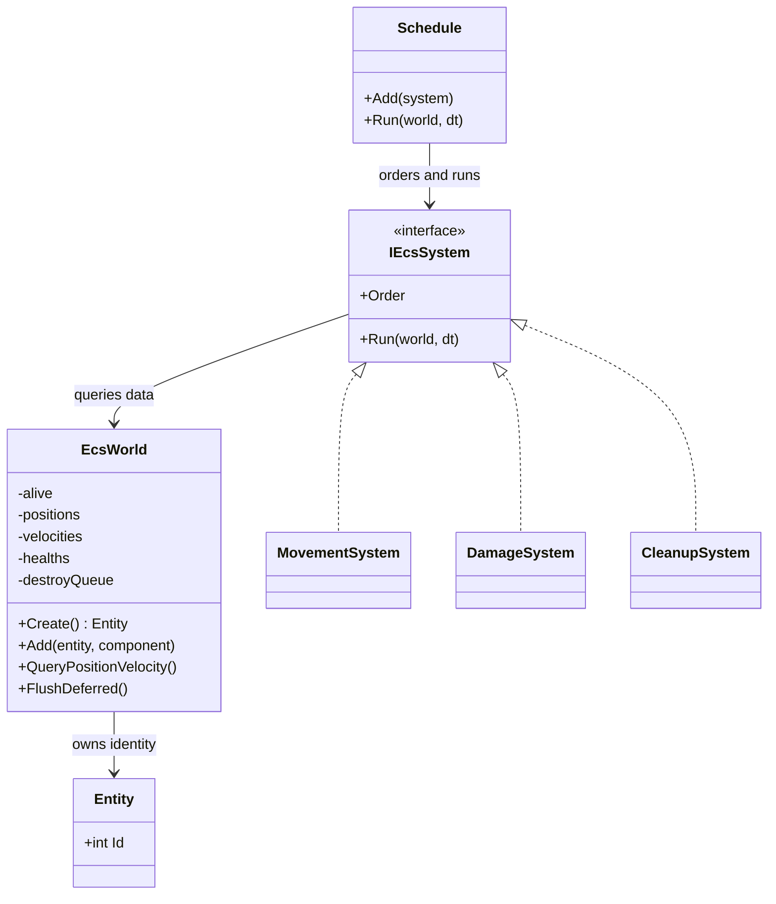
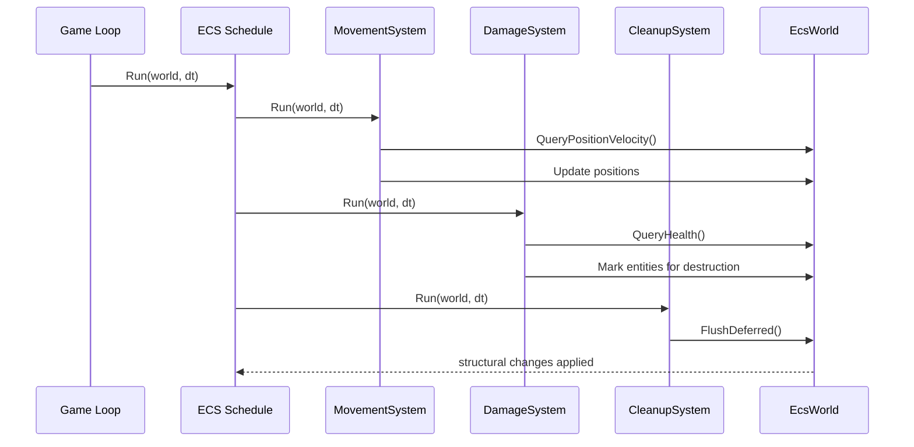

---
date: "2026-04-18"
title: "设计模式教科书｜ECS 架构：把实体、数据和系统拆开"
description: "ECS 不是把 OOP 换个名词，而是把实体标识、组件数据和系统调度拆成三条线，再用 archetype 或 sparse set 把它们重新拼起来。本文讲它的起源、收益、边界和代价。"
slug: "patterns-39-ecs-architecture"
weight: 939
tags:
  - "设计模式"
  - "ECS"
  - "软件工程"
  - "游戏引擎"
series: "设计模式教科书"
---

> 一句话定义：ECS 把“谁在场景里”和“它拥有什么数据”“谁来处理这些数据”拆成三件事，再用数据布局和调度顺序把它们重新组织起来。

## 历史背景
ECS 不是从教科书里长出来的，它先是从性能压力里长出来的。早期 3D 游戏和模拟程序很快发现，深继承树和对象满天飞的写法，能让代码看起来像面向对象，跑起来却像在缓存外面兜圈子。对象之间的虚调用、分散内存、条件分支和生命周期纠缠在一起，最后都变成 CPU 不爱吃的形状。

2000 年前后的很多引擎开始把重点从“对象如何表达世界”挪到“数据如何被批量处理”。那时的想法很直接：如果同一类行为要遍历成千上万次，不如把同类数据放在一起，把同一类逻辑集中起来。后来这条路分别长成了 sparse set ECS、archetype ECS、Job System + ECS、以及带调度图的现代引擎运行时。Unity DOTS、Bevy、Flecs、EnTT 都是在这条线上继续往前走。

ECS 的历史感很重要，因为它从来不是“比 OOP 更高级”。它只是更诚实地承认了一件事：当对象数量上来以后，业务的主要矛盾往往不再是“谁继承谁”，而是“谁和谁能连续访问、谁和谁能一起跑、谁和谁能延迟改”。

## 一、先看问题
先看一个常见坏味道：角色类越来越胖，更新逻辑却还散在各处。

```csharp
public sealed class Enemy
{
    public Vector2 Position;
    public Vector2 Velocity;
    public int Health;
    public bool IsDead;

    public void Update(float dt)
    {
        if (IsDead)
        {
            return;
        }

        Position += Velocity * dt;

        if (Health <= 0)
        {
            IsDead = true;
            DropLoot();
        }

        if (Position.Y < -20)
        {
            IsDead = true;
        }
    }

    private void DropLoot() { }
}
```

这段代码能跑，但它把三种不同的变化绑在了一起：位移、死亡、掉落。今天你想加一个“中毒状态”，明天想让掉落系统晚一帧执行，后天又要把移动交给网络预测。类会越来越胖，分支会越来越多，最后不是性能先炸，就是修改先炸。

更糟的是，这种写法让调度权完全分散。每个对象都自己 `Update()`，看上去很自由，实际上顺序、批处理、延迟删除和缓存局部性都没有统一入口。你想优化，就得从成百上千个对象里一块块拆。

## 二、模式的解法
ECS 的核心不是“把类改成表”，而是把职责拆成三层：

1. Entity 只提供身份，不承载行为。
2. Component 只保存状态，不关心谁在使用它。
3. System 只处理满足条件的数据，不把自己绑死在某个对象上。

这样以后，系统调度就能从对象内部跳出来，变成一套显式的执行计划。现实里的大规模 ECS 往往还会再往前走一步：用 archetype 或 sparse set 把同类组件聚在一起，用 schedule 把系统执行顺序写清楚，用 deferred command buffer 把结构性修改延后到安全点。

下面是一个纯 C# 的小型实现。它没有追求工业级泛型深度，而是把三件事写清楚：实体、组件存储、系统调度。真正的引擎会把组件存储换成 archetype table 或 sparse set；这个示例保留了同样的结构。

```csharp
using System;
using System.Collections.Generic;
using System.Linq;

public readonly record struct Entity(int Id);
public readonly record struct Position(float X, float Y);
public readonly record struct Velocity(float X, float Y);
public readonly record struct Health(int Value);

public sealed class EcsWorld
{
    private int _nextId = 1;
    private readonly HashSet<Entity> _alive = new();
    private readonly Dictionary<Entity, Position> _positions = new();
    private readonly Dictionary<Entity, Velocity> _velocities = new();
    private readonly Dictionary<Entity, Health> _healths = new();
    private readonly List<Entity> _destroyQueue = new();

    public Entity Create()
    {
        var entity = new Entity(_nextId++);
        _alive.Add(entity);
        return entity;
    }

    public void Add(Entity entity, Position value) => _positions[entity] = value;
    public void Add(Entity entity, Velocity value) => _velocities[entity] = value;
    public void Add(Entity entity, Health value) => _healths[entity] = value;

    public bool TryGetPosition(Entity entity, out Position value) => _positions.TryGetValue(entity, out value);
    public bool TryGetVelocity(Entity entity, out Velocity value) => _velocities.TryGetValue(entity, out value);
    public bool TryGetHealth(Entity entity, out Health value) => _healths.TryGetValue(entity, out value);

    public void SetPosition(Entity entity, Position value) => _positions[entity] = value;
    public void SetHealth(Entity entity, Health value) => _healths[entity] = value;

    public IEnumerable<Entity> QueryPositionVelocity()
    {
        foreach (var entity in _positions.Keys)
        {
            if (_velocities.ContainsKey(entity) && _alive.Contains(entity))
            {
                yield return entity;
            }
        }
    }

    public IEnumerable<Entity> QueryHealth()
    {
        foreach (var entity in _healths.Keys)
        {
            if (_alive.Contains(entity))
            {
                yield return entity;
            }
        }
    }

    public void DestroyLater(Entity entity)
    {
        if (_alive.Contains(entity))
        {
            _destroyQueue.Add(entity);
        }
    }

    public void FlushDeferred()
    {
        foreach (var entity in _destroyQueue)
        {
            _alive.Remove(entity);
            _positions.Remove(entity);
            _velocities.Remove(entity);
            _healths.Remove(entity);
        }

        _destroyQueue.Clear();
    }
}

public interface IEcsSystem
{
    int Order { get; }
    void Run(EcsWorld world, float dt);
}

public sealed class MovementSystem : IEcsSystem
{
    public int Order => 10;

    public void Run(EcsWorld world, float dt)
    {
        foreach (var entity in world.QueryPositionVelocity())
        {
            world.TryGetPosition(entity, out var position);
            world.TryGetVelocity(entity, out var velocity);
            world.SetPosition(entity, new Position(position.X + velocity.X * dt, position.Y + velocity.Y * dt));
        }
    }
}

public sealed class DamageSystem : IEcsSystem
{
    public int Order => 20;

    public void Run(EcsWorld world, float dt)
    {
        foreach (var entity in world.QueryHealth())
        {
            world.TryGetHealth(entity, out var health);
            var next = new Health(health.Value - (dt >= 1f ? 5 : 1));
            world.SetHealth(entity, next);

            if (next.Value <= 0)
            {
                world.DestroyLater(entity);
            }
        }
    }
}

public sealed class CleanupSystem : IEcsSystem
{
    public int Order => 100;
    public void Run(EcsWorld world, float dt) => world.FlushDeferred();
}

public sealed class Schedule
{
    private readonly List<IEcsSystem> _systems = new();

    public void Add(IEcsSystem system)
    {
        _systems.Add(system);
        _systems.Sort((a, b) => a.Order.CompareTo(b.Order));
    }

    public void Run(EcsWorld world, float dt)
    {
        foreach (var system in _systems)
        {
            system.Run(world, dt);
        }
    }
}

public static class Demo
{
    public static void Main()
    {
        var world = new EcsWorld();
        var schedule = new Schedule();
        schedule.Add(new MovementSystem());
        schedule.Add(new DamageSystem());
        schedule.Add(new CleanupSystem());

        var player = world.Create();
        world.Add(player, new Position(0, 0));
        world.Add(player, new Velocity(3, 0));
        world.Add(player, new Health(10));

        for (var frame = 0; frame < 4; frame++)
        {
            schedule.Run(world, 1f);
            Console.WriteLine($"Frame {frame}: player still alive = {world.TryGetHealth(player, out var health)}; hp = {(world.TryGetHealth(player, out var hp) ? hp.Value : 0)}");
        }
    }
}
```

这段代码的重点不是“写法多漂亮”，而是把调度边界放在外层。系统知道自己该处理什么，不知道世界是谁造的；组件知道自己存什么，不知道谁会读；实体只负责被标识，不负责决定业务。你一旦接受这个分工，系统顺序、结构性修改和批处理就都能变成显式策略。

## 三、结构图


## 四、时序图


## 五、变体与兄弟模式
ECS 不是一个单一实现，而是一组分歧很大的实现路线。最常见的两条线，是 sparse set ECS 和 archetype ECS。前者更擅长随机访问和灵活增删，后者更擅长批量遍历和缓存局部性。EnTT、Flecs、Bevy、Unity Entities 都在这些选择上做了不同权衡。

经典组件模型也常被拿来和 ECS 放在一起，但它们不该混成一个概念。经典组件模型强调“能力拼装”，实体仍然是对象；ECS 强调“数据批处理”，实体只是 ID。前者更像 OOP 的拆解版，后者更像 DOD 的运行时组织版。两者都能减少继承，但目标完全不同。

ECS 还常和 Reactive System、Mass Entity、Job System 放在一组里看。Reactive System 关注变化通知，Mass Entity 强调海量群体调度，Job System 强调并行执行。它们会和 ECS 叠加，但不是同一个东西。

## 六、对比其他模式
| 维度 | OOP 继承 | 经典组件模型 | ECS 架构 | DI |
|---|---|---|---|---|
| 核心抽象 | 类型层级 | 能力装配 | 数据 + 系统 + 调度 | 构造与依赖 |
| 状态位置 | 对象内部 | 组件内部 | 组件数据表 | 不负责业务状态 |
| 主要收益 | 复用派生行为 | 灵活拼装能力 | 批处理和局部性 | 解耦创建过程 |
| 主要代价 | 子类膨胀 | 组件耦合 | 学习和调试成本 | 容器滥用风险 |

ECS 和 OOP 的差别，不只是“写法不一样”。OOP 的主语是对象，ECS 的主语是查询。你先决定哪些数据放在一起，再决定谁来处理，这个方向和继承树恰好相反。

ECS 和 DI 的差别也很容易被说混。DI 解决的是“对象怎么装配”，ECS 解决的是“运行时怎么批处理”。DI 让依赖显式，ECS 让状态显式；前者偏构造期，后者偏帧内执行期。

## 七、批判性讨论
ECS 最常见的误解，是把它当成所有架构问题的答案。实际上，ECS 只特别擅长一件事：大量同质数据的批处理。它并不天然擅长复杂对象关系，也不天然擅长强封装业务。

如果你的系统主要是“少量对象、强行为、复杂协议”，ECS 可能会把简单问题拆得太碎。你会得到更多查询、更多系统和更多调试路径，但未必得到更好的代码。很多团队在这里会把“组件数量更多”误当成“设计更先进”，最后得到的是碎片化而不是清晰。

另一个常见问题是，ECS 会把依赖从对象图转移到查询图。对象之间的调用关系变少了，看起来更干净；可一旦系统之间的前后顺序、写冲突、结构变化和条件执行没设计好，隐藏复杂度会转移到调度层。复杂度没有消失，只是换了位置。

现代语言特性也会影响这件事。C# 的 `Span<T>`、`ref struct`、模式匹配和 source generator，能让 OOP 和组件化写得更轻；而线程池、任务系统和反射式装配又会让“看上去 ECS”的写法很多。ECS 不再是唯一的性能答案，但它仍然是把数据组织成稳定热路径的一把好刀。

## 八、跨学科视角
ECS 和数据库最像的地方，不在“都是表”，而在“都优先考虑扫描和分组”。archetype 像列式存储，sparse set 像带索引的映射。你先决定按什么维度聚集，再决定怎么读写，和数据库选索引、选列存、选批量写入的思路是一致的。

它和编译器的关系也很近。编译器前端把语法树拆成可分析单元，后端再把它们整理成 IR、SSA 或者机器指令。ECS 做的也是同样的事：先把语义拆成数据和行为，再把这些数据按执行阶段重新组织。系统调度就像优化 pass，负责把“能一起做的事情”合并起来。

从函数式角度看，ECS 也不是纯命令式。系统往往像一组纯函数：给定 world 的某个视图，产出一组局部变化。真正困难的不是写函数，而是控制副作用何时落地。`EntityCommandBuffer`、deferred command、事务式提交，本质上都是把副作用推迟到安全点。

## 九、真实案例
Unity 的 Entities 包明确把自己描述为现代 ECS 实现。官方手册 `com.unity.entities` 页面说明，它提供了一组面向 Unity 的基础系统和组件。更关键的是，Unity 的示例文档里直接出现了 `EntityCommandBuffer`：`EntitiesSamples/Docs/entity-command-buffers.md` 说明结构性修改要先记录、后播放，这正是 ECS 常见的延迟提交边界。参考：`https://docs.unity3d.com/cn/2023.2/Manual/com.unity.entities.html` 和 `https://github.com/Unity-Technologies/EntityComponentSystemSamples/blob/master/EntitiesSamples/Docs/entity-command-buffers.md`。

Bevy 的 ECS 则把 archetype、table 和 sparse set 讲得很清楚。`bevy::ecs::storage` 文档说明它有 `Tables` 和 `SparseSets` 两类存储；`bevy::ecs::archetype::Archetype` 文档和 `bevy_ecs/src/archetype.rs` 源码都在说明同一件事：共享同一组组件的实体会落进同一个 archetype。参考：`https://docs.rs/bevy/latest/bevy/ecs/storage/index.html`、`https://docs.rs/bevy/latest/bevy/ecs/archetype/struct.Archetype.html`、`https://docs.rs/bevy_ecs/latest/src/bevy_ecs/archetype.rs.html`。

EnTT 的 wiki 说明得更直接：registry 管实体和组件，system 只是普通函数或 functor；storage 基于 sparse set，所有组件类型都能按需使用。它是 sparse set ECS 的典型代表。参考：`https://github.com/skypjack/entt/wiki/Entity-Component-System`。

Flecs 则把 archetype 和关系系统讲成了自己的招牌。官方文档直接说它使用 cache friendly archetype/SoA storage，并支持 entity relationships、hierarchies 和 prefabs。它证明 ECS 不一定只服务于“纯战斗对象”，也能管层级、关系和元数据。参考：`https://www.flecs.dev/flecs/md_docs_2Docs.html` 和 `https://www.flecs.dev/flecs/md_docs_2EntitiesComponents.html`。

这些案例有一个共同点：它们都不把 ECS 当名词，而是当执行结构。你能在它们的文档里直接看到存储策略、调度顺序、结构性修改和查询模型，这才是“真正在用 ECS”的标志。

ECS 真正难的地方，往往不在“能不能跑”，而在“结构变化到底贵不贵”。实体一旦增删组件，archetype ECS 通常要把它迁到新的表，sparse set ECS 则要在稀疏索引和紧凑数组之间同步状态。你在 API 层看到的是 `AddComponent` 和 `RemoveComponent`，在运行时看到的却是搬移、重排、失效和缓存重新命中。这个成本不一定大，但它一定存在，所以 ECS 不能只拿查询快来讲故事。

另一个常被忽视的点，是调度图会随着团队规模变成新的知识边界。系统少的时候，大家还能记住谁先谁后；系统一多，顺序就必须被写成图、写成阶段、写成约束。Bevy 的 schedule、Unity Entities 的 system group、Flecs 的 queries and systems，都是在替你把“先更新谁、后更新谁”从口头约定变成机器可读的规则。这样做的代价是调试路径更长，收益是顺序不再靠人肉记忆。

工具链也会把 ECS 拉回现实。编辑器要知道某个组件的默认值，序列化要知道某个组件怎么迁移，热重载要知道某个系统要不要重新绑定，测试要知道某个 query 断言该怎么写。ECS 看起来像纯运行时结构，真正落地却离不开内容生产流程。只要一个组件没有被工具识别，它就只是代码里的一个类型；只有当编辑器、序列化、校验器和 profiler 都能读懂它，ECS 才会从架构口号变成工作流。

所以，ECS 最适合的不是“所有对象都统一改造”，而是把高频、同质、能批处理的那一层先独立出来。剩下那些强协议、强封装、低频改动的对象，继续留在对象模型里更稳。这个边界一旦画清楚，ECS 才不会从优化手段滑成新的教条。
## 十、常见坑
- 把 ECS 当成“把对象改名成实体”，最后只是换了术语，没换结构。
- 系统之间直接互相写数据，导致调度图混乱，顺序问题不断。
- 结构性修改散落在遍历过程中，最后被迫到处加同步点。
- 只追求极致解耦，却把一个简单功能拆成十几个系统。
- 只看 API 好不好写，不看数据布局和查询路径。

## 十一、性能考量
ECS 的性能收益，主要来自三件事：数据连续、查询聚焦、调度清晰。数据一旦按 archetype 或紧凑存储聚集，CPU 访问模式就比对象散列好得多；查询只扫描相关组件集合，避免了对无关对象的遍历；系统顺序显式后，你还可以把并行和延迟提交变成计划的一部分。

但 ECS 也有代价。结构性修改会更贵：给实体增删组件时，往往要在存储之间搬移数据。查询写得太随意，反而会把本来连续的访问打碎。系统数量太多时，调度图本身也会成为成本。

| 维度 | 经典组件模型 | Sparse Set ECS | Archetype ECS |
|---|---|---|---|
| 组件查找 | 常见是 `O(c)` 或 `O(1)` 索引 | 近似 `O(1)` 组件访问 | 近似 `O(1)` 同 archetype 查询 |
| 批量遍历 | 中等 | 中等到好 | 最好 |
| 增删组件 | 较轻 | 较轻 | 可能更重 |
| 缓存局部性 | 一般 | 好 | 非常好 |

换句话说，ECS 不是“总是更快”，而是“在正确的数据形状下更快”。如果对象很少、逻辑很复杂、系统关系很散，它可能只是更绕。只有当你的瓶颈真在批处理上，ECS 才会把收益还给你。

ECS 到底会不会和渲染系统打架，答案通常是“分层之后就不打架”。逻辑层的 ECS 负责算位置、状态、仇恨、冷却和命中，渲染层则更像结果消费方：它从 ECS 里拿到一批可见实体，再把它们整理成渲染队列、实例缓冲或命令缓冲。这样做的好处是，逻辑和渲染各自沿着自己的热路径前进，坏处是你必须接受一次额外的数据搬运。只要渲染和逻辑频率不同步，这个搬运就不可避免。

物理、网络和音频也是同样的分层思路。物理系统更关心固定步长和约束稳定性，网络系统更关心输入顺序和回放一致性，音频系统更关心时钟连续性。ECS 不该把它们硬塞成同一种系统，而应该给它们提供统一的数据入口，再允许各自按自己的节奏执行。这样你才不会把“架构统一”误解成“所有事情都在一个 schedule 里跑”。

从这个角度看，ECS 不是 Render Pipeline 的替代品，也不是 Scene Graph 的替代品。它更像是上游的数据生产层：先把实体状态整理成稳定、可查询、可并行的数据流，再把这些数据交给渲染管线、场景图或物理管线去消费。未来的 `[Render Pipeline](./patterns-41-render-pipeline.md)` 文章可以继续沿着这条线讲下去。

## 十二、何时用 / 何时不用
适合用：

- 你有大量同质实体，且每帧都要批量处理。
- 你关心缓存局部性、并行和结构化调度。
- 你想把状态、行为和顺序分开管理。
- 你需要让系统更适合工具链、回放和数据驱动内容。

不适合用：

- 你的对象数量很少，但关系和协议很复杂。
- 你更看重封装和对象语义，而不是批处理吞吐。
- 团队还没有能力维护查询、调度和结构性修改。

## 十三、相关模式
- [Component](./patterns-31-component.md)
- [Dirty Flag](./patterns-32-dirty-flag.md)
- [Spatial Partition](./patterns-34-spatial-partition.md)
- [Game Loop](./patterns-29-game-loop.md)
- [Scene Graph](./patterns-40-scene-graph.md)
- [Render Pipeline](./patterns-41-render-pipeline.md)

ECS 还有一个实用边界：它最擅长的是“规则稳定、数量很多、结构少变”的那一面。凡是需要复杂协议编排、强封装状态机、或者大量一次性逻辑的部分，继续放在对象模型里通常更省心。很多成熟项目最后都会走混合路线：对象模型保留领域语义，ECS 负责高频批处理，调度层负责把两者接起来。这样做不是折中，而是把架构责任拆开。

## 十四、在实际工程里怎么用
在真实工程里，ECS 通常不会从第一天就把所有对象都搬进去。更稳的做法是先把高频、同质、批量的那部分逻辑迁过去，例如成百上千的子弹、单位、粒子、感知体或轻量 UI 数据。保留复杂业务对象在 OOP 层，先把真正的热路径拿出来。

应用线里，这通常会落到 Unity DOTS、Bevy、Flecs、EnTT、Unreal Mass，或者你自己的任务调度层。教科书线讲的是原理；应用线才会讲怎么把它接到渲染、物理、网络和编辑器里。对应的应用线文章可以放在 `../../engine-core/ecs-architecture-application.md`。

更实际的一点是，ECS 最适合做“演化中的中间态”。当项目已经被继承树和胖对象拖慢，但又没准备好全量重构时，先把更新、碰撞、感知和群体行为从对象里拆出来，往往就能先把性能和可维护性都拉回来。

ECS 也最容易被误读成“把一切都表格化”。真正成熟的项目，通常只把高频、同质、适合批处理的那一层迁过去，把复杂协议、一次性流程和强封装对象留在对象模型里。这样，ECS 才是分工，不是信仰；它把系统边界画出来，也把后续演进的成本说清楚。

ECS 最有价值的地方，是把高频批处理从复杂对象里剥离出来，而不是把整个工程推成纯表格。只要边界画清楚，它就可以和 OOP、场景图、渲染管线并存，互相补位，而不是互相吞掉。它不是取代所有对象，而是接管最热的一段，让结构更稳。

## 小结
- ECS 的核心价值不是去对象化，而是把查询、调度和存储拉到同一层看。
- archetype / sparse set / schedule 解决的是“怎么让大量同类数据跑得快”。
- 它是强工具，但不是万能钥匙；适用边界比口号更重要。


