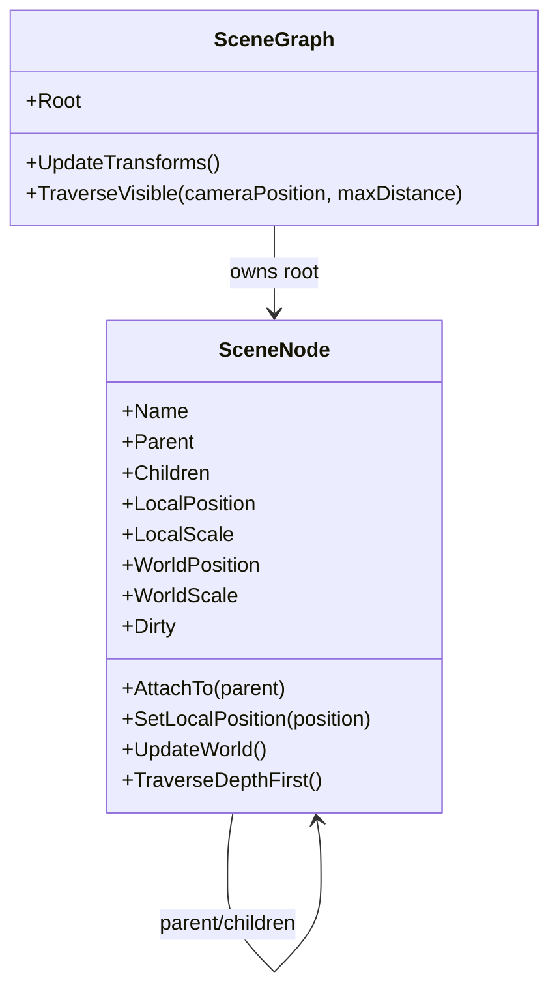
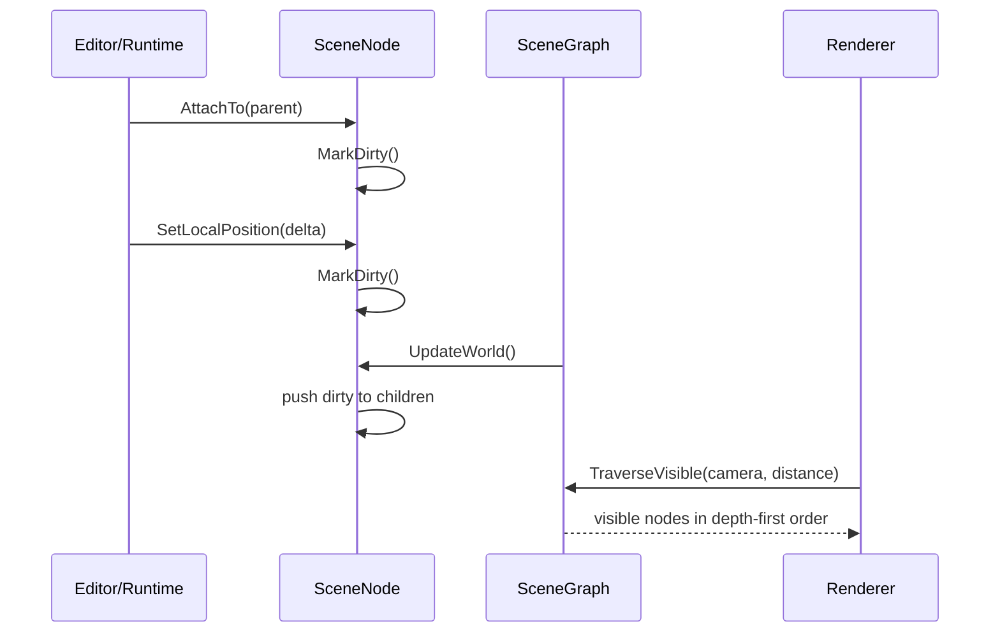

---
date: "2026-04-18"
title: "设计模式教科书｜Scene Graph：把空间关系变成树"
description: "Scene Graph 不是单纯的树，而是把局部变换、父子继承、遍历顺序、裁剪和脏传播放进同一个结构。本文讲它的收益、代价、边界和常见误解。"
slug: "patterns-40-scene-graph"
weight: 940
tags:
  - "设计模式"
  - "Scene Graph"
  - "软件工程"
  - "游戏引擎"
series: "设计模式教科书"
---

> 一句话定义：Scene Graph 把场景中的对象组织成一棵可遍历、可继承、可裁剪的树，让空间关系和父子关系同时变成运行时结构。

## 历史背景
场景图并不是“树长得像树，所以拿来表示树”这么简单。它来自早期图形系统对空间层次、局部坐标和批量遍历的共同需求。只要对象一多，手工维护世界坐标和绘制顺序就会很快失控；只要对象有父子关系，移动父节点时就会触发整片子树的连锁更新。于是引擎开始把“谁依附谁”“谁继承谁的变换”“谁先被访问”统一塞进一个层级结构里。

这个思路在 retained-mode UI、CAD、DCC 工具和实时引擎里都很自然。Godot 把它叫 `SceneTree`，Unity 把它藏在 `Transform` 层级里，Unreal 则把它拆成 `SceneComponent` 及其 attachment chain。更大的工业系统，比如 USD，也会把 composed prim 组织成可遍历的 scenegraph。它们的共识很简单：只要子对象要跟着父对象走，树比平铺列表更省心。

但 Scene Graph 的历史同样提醒我们，它不是免费午餐。树形继承解决了“父子关系”和“局部坐标”问题，却把“空间邻近”“碰撞查询”“批量裁剪”留给了别的结构。也就是说，Scene Graph 很适合表示关系，不一定适合表示所有空间问题。

## 一、先看问题
先看一个没有场景图时的常见写法：每个对象自己保存世界坐标，移动父物体时手动更新所有子物体。

```csharp
public sealed class SpriteEntity
{
    public Vector3 WorldPosition;
    public List<SpriteEntity> Children = new();

    public void Move(Vector3 delta)
    {
        WorldPosition += delta;

        foreach (var child in Children)
        {
            child.WorldPosition += delta;
            child.Move(delta);
        }
    }
}
```

这段代码看上去直白，问题却很快会出来。第一，世界坐标和局部坐标混在一起，子节点一旦单独移动，父节点的偏移就很难再追踪。第二，父节点移动时递归更新子节点，容易把一次局部操作扩散成整棵树的重算。第三，旋转和缩放一加进来，简单的向量累加立刻不够用。

再往前一步，渲染和碰撞都需要遍历这棵树，但遍历目的不一样。渲染关心可见性和顺序，物理关心碰撞层和刚体约束，编辑器关心拖拽和选择。你如果只保留一份“全局位置列表”，最后要么到处手写同步，要么在不同子系统里复制同一份树逻辑。

## 二、模式的解法
Scene Graph 的核心做法，是把“局部变换”和“世界变换”分开保存，把父子关系显式化，把脏状态向下或向上传播，再把遍历交给统一入口。这样一来，子节点只要维护自己的局部数据，世界坐标在需要时再由父链推导出来。

这不只是“树结构”这么简单，而是一种运行时协议：

1. 节点只保存局部状态。
2. 节点知道自己的父节点和子节点。
3. 节点在局部变换变动时标记脏状态。
4. 渲染、导出或调试遍历从根节点开始。

下面是一个纯 C# 的小实现。它只用平移和缩放来说明概念，避免把文章变成数学课。真实引擎会加上旋转、仿射矩阵、骨骼挂点和更复杂的裁剪逻辑，但边界是一致的。

```csharp
using System;
using System.Collections.Generic;
using System.Numerics;

public sealed class SceneNode
{
    public string Name { get; }
    public SceneNode? Parent { get; private set; }
    public List<SceneNode> Children { get; } = new();

    public Vector3 LocalPosition { get; private set; }
    public float LocalScale { get; private set; } = 1f;

    public Vector3 WorldPosition { get; private set; }
    public float WorldScale { get; private set; } = 1f;
    public bool Dirty { get; private set; } = true;

    public SceneNode(string name)
    {
        Name = name;
    }

    public void SetLocalPosition(Vector3 position)
    {
        LocalPosition = position;
        MarkDirty();
    }

    public void SetLocalScale(float scale)
    {
        LocalScale = scale;
        MarkDirty();
    }

    public void AttachTo(SceneNode? parent)
    {
        if (ReferenceEquals(Parent, parent))
        {
            return;
        }

        Parent?.Children.Remove(this);
        Parent = parent;
        Parent?.Children.Add(this);
        MarkDirty();
    }

    private void MarkDirty()
    {
        Dirty = true;
        foreach (var child in Children)
        {
            child.MarkDirty();
        }
    }

    public void UpdateWorld()
    {
        if (!Dirty)
        {
            return;
        }

        if (Parent is null)
        {
            WorldPosition = LocalPosition;
            WorldScale = LocalScale;
        }
        else
        {
            WorldScale = Parent.WorldScale * LocalScale;
            WorldPosition = Parent.WorldPosition + LocalPosition * Parent.WorldScale;
        }

        Dirty = false;

        foreach (var child in Children)
        {
            child.UpdateWorld();
        }
    }

    public IEnumerable<SceneNode> TraverseDepthFirst()
    {
        yield return this;
        foreach (var child in Children)
        {
            foreach (var descendant in child.TraverseDepthFirst())
            {
                yield return descendant;
            }
        }
    }
}

public sealed class SceneGraph
{
    public SceneNode Root { get; } = new("Root");

    public void UpdateTransforms() => Root.UpdateWorld();

    public IEnumerable<SceneNode> TraverseVisible(Vector3 cameraPosition, float maxDistance)
    {
        foreach (var node in Root.TraverseDepthFirst())
        {
            if (Vector3.Distance(node.WorldPosition, cameraPosition) <= maxDistance)
            {
                yield return node;
            }
        }
    }
}

public static class Demo
{
    public static void Main()
    {
        var graph = new SceneGraph();
        var ship = new SceneNode("Ship");
        var turret = new SceneNode("Turret");
        var barrel = new SceneNode("Barrel");

        ship.AttachTo(graph.Root);
        turret.AttachTo(ship);
        barrel.AttachTo(turret);

        ship.SetLocalPosition(new Vector3(10, 0, 0));
        turret.SetLocalPosition(new Vector3(0, 2, 0));
        barrel.SetLocalPosition(new Vector3(0, 0, 1));

        graph.UpdateTransforms();

        foreach (var node in graph.TraverseVisible(Vector3.Zero, 50f))
        {
            Console.WriteLine($"{node.Name}: {node.WorldPosition}");
        }
    }
}
```

这段代码的关键，不在于矩阵多不多，而在于“世界值是推导出来的，不是到处手写出来的”。你一旦把这个原则固定下来，父子耦合、脏传播和遍历顺序就都能用同一套规则处理。

## 三、结构图


## 四、时序图


## 五、变体与兄弟模式
Scene Graph 有几个常见变体。最老的那一类把它当“层级变换树”，重点是坐标继承；另一类把它扩展成“场景对象树”，节点不只是 transform，还承载渲染、碰撞、脚本和编辑器元数据。Godot 的 `SceneTree` 就偏后者，Unreal 的 `SceneComponent` 则更强调 attachment chain 与 transform 继承。

它最容易混淆的兄弟，是 Composite 和 Spatial Partition。Composite 解决的是“对象如何组成对象”，重点在统一接口；Scene Graph 解决的是“空间关系如何继承”，重点在局部变换和遍历。Spatial Partition 解决的是“对象离得近不近”，重点在查询效率，不在父子语义。

Scene Graph 还常和 Dirty Flag 一起出现。前者定义关系，后者减少重复计算。没有 Dirty Flag 的 Scene Graph，常常会把一次父节点移动变成整棵树的硬算；只有 Dirty Flag 没有 Scene Graph，又很难把父子层级和相对变换组织好。

## 六、对比其他模式
| 维度 | Composite | Scene Graph | Spatial Partition |
|---|---|---|---|
| 关注点 | 统一对象接口 | 空间层级与变换继承 | 近邻查询与空间检索 |
| 主收益 | 结构统一 | 局部坐标和遍历稳定 | 碰撞、可见性、邻域查询快 |
| 主要代价 | 递归和抽象 | 父子耦合、脏传播成本 | 维护索引和分裂合并成本 |
| 常见场景 | 菜单、文件系统、组件树 | Transform、节点树、骨架 | 四叉树、八叉树、BVH |

Scene Graph 和 Composite 的差别，不在“都是树”，而在树承载的语义不同。Composite 重在把“单个对象”和“对象集合”统一成一个接口；Scene Graph 重在把空间继承和层级遍历变成运行时协议。

Scene Graph 和 Spatial Partition 的差别也很关键。Spatial Partition 关心的是谁挨着谁，Scene Graph 关心的是谁跟谁有父子关系。把这两者混为一谈，会很快把树结构做得既不擅长变换，也不擅长查询。

## 七、批判性讨论
Scene Graph 的合理批评其实不少。第一，它天然制造父子耦合。子节点的世界坐标依赖父节点，父节点一改，整棵子树都可能要重算。对于深树或频繁 reparent 的场景，这种成本会很明显。

第二，它很容易被滥用成万能容器。节点一旦同时承载变换、渲染、物理、脚本和业务逻辑，Scene Graph 就会从“空间结构”变成“新上帝对象”。这时你虽然还在用树，实际却回到了旧问题：职责太多、边界太散。

第三，Scene Graph 并不天然解决空间查询。它擅长表达父子和变换，不擅长表达“哪些对象在这个区域里”“哪些对象应该碰撞”“哪些对象该合批”。所以很多引擎最终会同时保留 Scene Graph 和 Spatial Partition，而不是互相替换。

现代语言特性也让 Scene Graph 的写法轻了一些。C# 的 `record struct`、值类型、模式匹配和 source generator，可以让节点和变换写得更紧凑；但这些特性并不会消掉树的本质成本。深层重算还是深层重算，父子耦合还是父子耦合。

## 八、跨学科视角
从编译器角度看，Scene Graph 很像 AST。父节点代表组合语义，子节点代表局部片段，遍历顺序决定了后续计算顺序。对 AST 做重写、标记和求值时，很多工程判断和 Scene Graph 一样：先标脏，再按依赖顺序下推，最后统一产出结果。

从数据库角度看，Scene Graph 更像一条带层级索引的路径查询。你可以沿着父链向上查，也可以沿着子链向下查，但这种灵活性要靠额外维护。和列式存储不同，Scene Graph 优先保证关系表达，不优先保证批量扫描。

从数据导向设计看，Scene Graph 其实经常是逻辑层和渲染层之间的中间态。逻辑层未必想要树，渲染层却很想要按层次拿到变换结果。Scene Graph 提供了这种中间语义：先把层级关系算对，再把最终结果交给渲染管线。未来的 `[Render Pipeline](./patterns-41-render-pipeline.md)` 文章正好可以接这条线。

## 九、真实案例
Godot 的 `SceneTree` 是最典型的场景图案例之一。官方文档明确说，`SceneTree` 管理节点层级和场景本身，节点可以被添加、获取、移除，整棵树还支持 group 调用。它不仅是层级容器，还是 Godot 默认的 MainLoop。参考：`https://docs.godotengine.org/en/4.5/classes/class_scenetree.html` 和 `https://docs.godotengine.org/en/4.5/getting_started/step_by_step/scene_tree.html`。这说明场景图在 Godot 里不是附属功能，而是运行时的主骨架。

Unreal 的 `USceneComponent` 则把 attachment chain 说得很具体。文档写明它有 transform、支持 attachment，但本身不负责渲染或碰撞；`K2_AttachToComponent` 用来把一个组件挂到另一个组件上；`GetAttachmentRoot` 会沿 attachment chain 一路往上找根。参考：`https://dev.epicgames.com/documentation/en-us/unreal-engine/python-api/class/SceneComponent?application_version=5.7`、`https://dev.epicgames.com/documentation/en-us/unreal-engine/API/Runtime/Engine/Components/USceneComponent/K2_AttachToComponent` 和 `https://dev.epicgames.com/documentation/en-us/unreal-engine/API/Runtime/Engine/Components/USceneComponent/GetAttachmentRoot`。

Unity 的 `Transform` 则把父子继承做得非常直接。`Transform.parent` 和 `Transform.SetParent` 文档都强调：改变父节点时，世界坐标保持不变，而本地坐标和父子关系会重新调整；`hierarchyCapacity` 还说明 Unity 内部把 transform hierarchy 当成单独的数据结构来管理。参考：`https://docs.unity3d.com/cn/2018.2/ScriptReference/Transform.parent.html`、`https://docs.unity3d.com/cn/current/ScriptReference/Transform.SetParent.html` 和 `https://docs.unity3d.com/kr/2020.3/ScriptReference/Transform-hierarchyCapacity.html`。

USD 也能从另一个角度说明同一件事。`UsdStage` 的文档说它是外层容器，递归呈现 composed prims as a scenegraph；`UsdPrim` 文档则说 prim 是 stage 上唯一持久的 scenegraph 对象。参考：`https://openusd.org/release/api/class_usd_stage.html`、`https://openusd.org/dev/api/class_usd_prim.html` 和 `https://openusd.org/docs/USD-Glossary.html`。它证明场景图不只是游戏引擎里的东西，DCC 和资产管线同样依赖它。

OGRE-Next 的手册和仓库也支持这一点。官方 README 直接把它描述成 scene-oriented engine，并强调 cache friendly Entity and Node layout、threaded batch processing of Nodes 和 frustum culling。参考：`https://github.com/OGRECave/ogre-next` 和 `https://ogrecave.github.io/ogre-next/api/2.3/manual.html`。它说明场景图在工业引擎里往往会和批处理、剔除和后台准备一起出现，而不是单独存在。

这些案例共同证明：Scene Graph 不是“单纯为了好看才用树”，而是把空间继承、遍历顺序、局部到世界的转换和运行时组织统一起来。它真正服务的是一整条空间管线，而不是一个 API 名字。

Scene Graph 真正落地时，最容易被低估的是“更新频率和消费频率不是一回事”。变换树可能每帧都在变，但渲染器未必每次都要重新访问整个树，编辑器也未必每次都要重建可视列表。所以很多引擎会把 Scene Graph 当成中间层，再把可见节点、渲染命令和骨骼姿态导出到别的缓存里。这样做能把“层级表达”和“绘制吞吐”拆开。

同样重要的是，Scene Graph 不是 Render Pipeline 的替代品。它负责把空间关系组织好，Render Pipeline 才负责把这些关系转成 GPU 友好的提交顺序。前者提供语义，后者提供吞吐；前者回答谁是父谁是子，后者回答谁先画谁后画。只要这两个边界没混掉，Scene Graph 就不会被误用成一切渲染问题的答案。这也是很多引擎保留它、同时又不让它独占全局的原因。

从工具视角看，Scene Graph 还承担了“内容可视化”的责任。Godot 的树直接服务编辑器和运行时，Unreal 的 attachment chain 服务组件挂点和物理语义，USD 的 prim 则同时服务资产组合、加载策略和跨工具交换。它们都像树，但树上挂的东西不一样：有的偏运行时，有的偏内容管线，有的偏资产组合。只要这件事分清楚，Scene Graph 的边界就会清楚很多。边界清楚，代价才算得清。这样它更适合被当成空间语义层，而不是被拿来替代所有查询结构。

## 十、常见坑
- 把所有东西都塞进节点，最后 Scene Graph 成了新型上帝对象。
- 每次访问 world transform 都沿祖先链实时递归，结果把重复计算全留给运行时。
- 频繁 reparent 却没有脏标记和缓存，树越深越慢。
- 误把 Scene Graph 当成空间索引，最后在碰撞和可见性上还是要重做一套。
- 在深层父子树里混入大量跨层依赖，结果任何小改动都会沿着整棵树扩散。

## 十一、性能考量
Scene Graph 的性能瓶颈，最常见的不是“树太慢”，而是“更新太频繁”。如果每次读取 world transform 都沿父链重新算，复杂度就会变成 `O(d)`，`d` 是节点深度。深树里如果还要遍历子树、重算矩阵、做可见性判断，成本会继续往上叠。

脏标记能把这个问题缓下来。只要局部变换没变，世界变换就没必要重算；只要父节点没变，子树也没必要跟着重新求值。这样一来，很多访问从“每次都算”变成“变了才算”，这对深层层级特别有用。

但 Scene Graph 也有自己的局限。深树天然不利于并行，因为子节点依赖父节点结果；频繁 reparent 会导致缓存失效；把渲染对象和逻辑对象绑死在同一棵树里，还会拖慢遍历。OGRE-Next 之所以强调 batch processing 和 cache friendly layout，就是想把“树的表达力”和“批处理的吞吐量”同时保住。

| 维度 | 实时递归 | Dirty Flag Scene Graph | 额外 Spatial Partition |
|---|---|---|---|
| World transform 成本 | 高 | 中低 | 低 |
| 结构修改成本 | 低 | 中 | 中高 |
| 可见性查询 | 一般 | 一般 | 好 |
| 父子表达力 | 好 | 好 | 弱 |

Scene Graph 不是为了赢过所有结构，而是为了让“层级变换”和“局部坐标”这件事足够稳定。只要你的系统把它当层级语义层，而不是当全部空间问题的答案，它就很值。

## 十二、何时用 / 何时不用
适合用：

- 你需要父子关系和局部坐标继承。
- 你要让编辑器、动画、挂点和层级组织共享同一套结构。
- 你希望把遍历、剔除和变换更新统一管理。
- 你的对象树不算极深，或者你能接受脏传播的开销。

不适合用：

- 你主要问题是空间邻近查询，而不是父子继承。
- 你需要大量动态 reparent，并且深树很频繁。
- 你想把所有行为都挂在树上，最后让层级承受一切。

## 十三、相关模式
- [Composite](./patterns-16-composite.md)
- [Dirty Flag](./patterns-32-dirty-flag.md)
- [Spatial Partition](./patterns-34-spatial-partition.md)
- [Component](./patterns-31-component.md)
- [ECS 架构](./patterns-39-ecs-architecture.md)
- [Render Pipeline](./patterns-41-render-pipeline.md)

## 十四、在实际工程里怎么用
在工程里，Scene Graph 最常见的落点不是“给所有对象建一棵树”，而是给需要层级关系的那部分对象建树。角色挂点、骨骼附件、相机层级、特效跟随、UI 容器、导出管线，都是它的自然用武之地。真正成熟的团队会把它当空间语义层，而不是把它当唯一世界模型。

应用线里，这通常会落到 Unity Transform、Unreal SceneComponent、Godot SceneTree，或者 USD 这类资产和内容系统。教科书线讲的是原理；应用线才会讲怎么把它接到动画、渲染、物理和编辑器。对应的应用线文章可以放在 `../../engine-core/scene-graph-application.md`。

如果项目同时用了 ECS 和 Scene Graph，也不奇怪。ECS 负责高频状态和批处理，Scene Graph 负责空间层级和可视化装配。两者分工清楚，反而比硬把所有东西塞进一棵树里更稳。

## 小结
- Scene Graph 解决的是层级继承和遍历顺序，不是所有空间问题。
- Dirty Flag、Spatial Partition 和 Composite 都能和它互补，但不等于它。
- 它的价值在于把局部坐标、世界坐标和父子关系统一进一条运行时协议。


