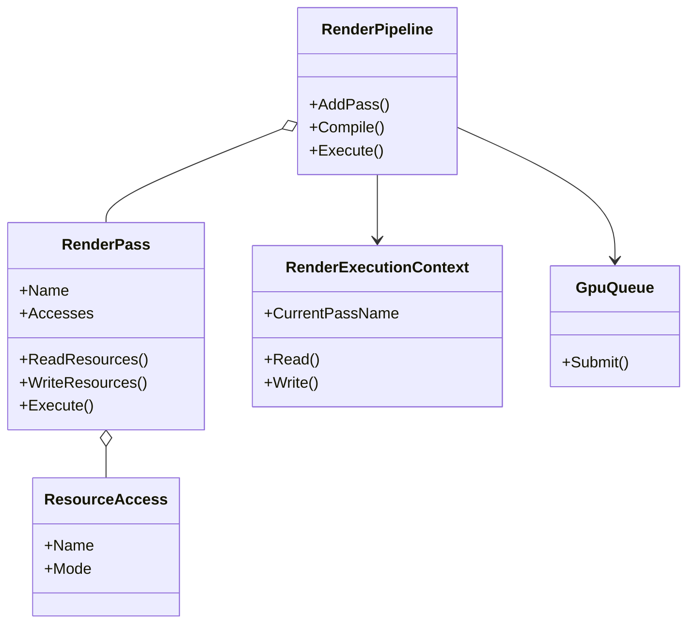
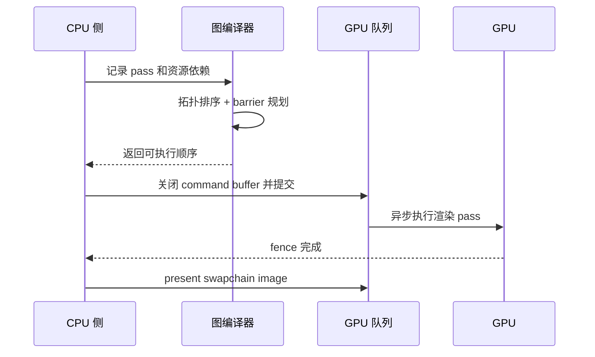

---
date: "2026-04-17"
title: "设计模式教科书｜Render Pipeline：把一帧拆成可排序、可验证的依赖图"
description: "Render Pipeline 不是单纯的阶段串联，而是把资源依赖、阶段顺序、CPU/GPU 同步和帧内调度显式化的渲染组织方式。它让一帧图像从命令堆栈变成可分析、可优化的依赖图。"
slug: "patterns-41-render-pipeline"
weight: 941
tags:
  - "设计模式"
  - "Render Pipeline"
  - "软件工程"
  - "图形学"
  - "引擎架构"
series: "设计模式教科书"
---

> 一句话定义：Render Pipeline 把渲染从“立即执行的命令序列”改成“可排序、可验证、可同步的帧级依赖图”。

## 历史背景

渲染管线最早只是图形 API 里的固定阶段：顶点进来、裁剪、光栅化、输出，顺序由硬件和驱动决定，开发者只能在缝隙里挤出一点控制权。那个年代的重点是把图像画出来，不是把一帧的资源关系讲清楚。固定管线的好处是简单，代价是表达力弱，很多渲染意图只能靠隐式状态和文档约定去传递。

可编程管线把问题往前推进了一步。着色器把“怎么算”交给程序员，渲染过程开始从黑盒变成可编排的程序。但真正把渲染从“按 API 顺手写”推进到“按帧建图”的，是现代显式 API 和 frame graph 思想。Vulkan、DirectX 12、Metal 不再替你猜同步时机；驱动把大部分调度责任还给应用，应用反过来必须说明资源怎么用、什么时候读、什么时候写、什么时候可以复用。

这就是 Render Pipeline 的现代含义。它不只是“很多 pass 按顺序跑”，而是把一帧里的几何、阴影、后处理、合成、呈现拆成一个带边的 DAG。边不是装饰，它们决定资源生命周期、barrier、aliasing、异步计算和最终的 submit/present 边界。渲染管线一旦进入这个阶段，就和一般意义上的 Pipeline 有了差别：一般 Pipeline 关心阶段衔接，Render Pipeline 还要对 CPU/GPU 并行、交换链图像和临时资源负责。

现代引擎对这件事的理解也越来越统一。Unity 从 URP 的 ScriptableRendererFeature 走到 Render Graph，Unreal 用 RDG 把整帧录成图，Filament 直接把资源和 pass 都放进 FrameGraph，Godot 则把 RenderingServer / RenderingDevice 分成高低两层。语言和框架不同，但都在做同一件事：把“这一帧该做什么”显式写出来，把“什么时候能做”交给编译后的图来决定。

## 一、先看问题

先看一个常见坏味道：渲染代码直接按函数调用串起来，所有临时资源、当前目标、同步状态都塞在同一个上下文里。这样写起来最短，但每个阶段都要记住上一个阶段留下了什么。阴影先画还是后画，GBuffer 需要的深度是不是已经准备好，后处理是不是还在读前一帧的颜色，所有这些都靠人脑维持。

```csharp
using System;
using System.Collections.Generic;

public sealed class NaiveRenderer
{
    private readonly Dictionary<string, string> _resources = new();

    public void RenderFrame()
    {
        RenderShadowMap();
        RenderGeometry();
        RenderLighting();
        ApplyPostProcess();
        Present();
    }

    private void RenderShadowMap()
    {
        _resources["ShadowMap"] = "shadow data";
    }

    private void RenderGeometry()
    {
        _resources["GBuffer"] = "geometry data";
    }

    private void RenderLighting()
    {
        if (!_resources.ContainsKey("ShadowMap"))
        {
            throw new InvalidOperationException("ShadowMap is missing.");
        }

        _resources["LitColor"] = "lit scene";
    }

    private void ApplyPostProcess()
    {
        if (!_resources.ContainsKey("LitColor"))
        {
            throw new InvalidOperationException("LitColor is missing.");
        }

        _resources["FinalColor"] = "tonemapped scene";
    }

    private void Present()
    {
        Console.WriteLine(_resources.TryGetValue("FinalColor", out var finalColor)
            ? finalColor
            : "black frame");
    }
}
```

这段代码的问题不是“没有抽象”，而是抽象的位置不对。它把“执行顺序”直接写死在函数调用里，把“资源谁能读写”藏进了共享字典，把“同步何时发生”藏在实现细节里。只要你想插入一个反射 pass、一个曝光调整、一个 GPU 粒子写回，原来那串顺序就要重排，顺序一乱，状态就开始出错。

更麻烦的是，CPU 和 GPU 并不是同一个节拍。CPU 侧记录命令，GPU 侧异步执行，真正的边界不是函数结束，而是 command buffer submit、fence 信号和 present。把这些边界都揉在一个线性方法里，代码会显得很直，调试时却很难回答“这一帧的资源到底在什么时候变成可见”。

## 二、模式的解法

Render Pipeline 的解法，是先声明再执行。先把每个阶段读什么、写什么说清楚，再让编译器样的组件去排顺序、放 barrier、决定哪些资源可以复用。你可以把它看成渲染领域的 DAG 调度器：节点是 pass，边是资源依赖，拓扑顺序是最终执行顺序，额外的同步规则决定 CPU 和 GPU 在哪里分工。

下面这份纯 C# 代码演示一个最小可运行的帧图管线。它不依赖任何引擎，但保留了核心结构：pass 声明资源访问，管线按依赖编译顺序，再在执行时模拟 barrier、提交和呈现。

```csharp
using System;
using System.Collections.Generic;
using System.Linq;

public enum AccessMode
{
    Read,
    Write
}

public sealed class ResourceAccess
{
    public ResourceAccess(string name, AccessMode mode)
    {
        Name = name ?? throw new ArgumentNullException(nameof(name));
        Mode = mode;
    }

    public string Name { get; }
    public AccessMode Mode { get; }
}

public sealed class RenderPass
{
    private readonly Action<RenderExecutionContext> _execute;

    public RenderPass(string name, IEnumerable<ResourceAccess> accesses, Action<RenderExecutionContext> execute)
    {
        Name = name ?? throw new ArgumentNullException(nameof(name));
        Accesses = accesses?.ToArray() ?? throw new ArgumentNullException(nameof(accesses));
        _execute = execute ?? throw new ArgumentNullException(nameof(execute));
    }

    public string Name { get; }
    public IReadOnlyList<ResourceAccess> Accesses { get; }

    public IEnumerable<string> ReadResources => Accesses.Where(a => a.Mode == AccessMode.Read).Select(a => a.Name);
    public IEnumerable<string> WriteResources => Accesses.Where(a => a.Mode == AccessMode.Write).Select(a => a.Name);

    public void Execute(RenderExecutionContext context) => _execute(context);
}

public sealed class RenderExecutionContext
{
    private readonly Dictionary<string, string> _resources = new();

    public string CurrentPassName { get; set; } = string.Empty;

    public void Write(string resourceName, string value)
    {
        _resources[resourceName] = value;
        Console.WriteLine($"  write {resourceName} = {value}");
    }

    public string Read(string resourceName)
    {
        if (!_resources.TryGetValue(resourceName, out var value))
        {
            throw new InvalidOperationException($"Resource '{resourceName}' was not produced yet.");
        }

        Console.WriteLine($"  read  {resourceName} = {value}");
        return value;
    }
}

public sealed class RenderPipeline
{
    private readonly List<RenderPass> _passes = new();

    public void AddPass(RenderPass pass)
    {
        if (pass is null) throw new ArgumentNullException(nameof(pass));
        _passes.Add(pass);
    }

    public IReadOnlyList<RenderPass> Compile()
    {
        var graph = new List<int>[_passes.Count];
        var indegree = new int[_passes.Count];

        for (var i = 0; i < _passes.Count; i++)
        {
            graph[i] = new List<int>();
        }

        for (var producer = 0; producer < _passes.Count; producer++)
        {
            for (var consumer = 0; consumer < _passes.Count; consumer++)
            {
                if (producer == consumer)
                {
                    continue;
                }

                var producerWrites = _passes[producer].WriteResources.ToArray();
                var consumerReads = _passes[consumer].ReadResources.ToArray();

                if (producerWrites.Any(resource => consumerReads.Contains(resource)))
                {
                    graph[producer].Add(consumer);
                    indegree[consumer]++;
                }
            }
        }

        var queue = new Queue<int>();
        for (var i = 0; i < indegree.Length; i++)
        {
            if (indegree[i] == 0)
            {
                queue.Enqueue(i);
            }
        }

        var ordered = new List<RenderPass>(_passes.Count);
        while (queue.Count > 0)
        {
            var node = queue.Dequeue();
            ordered.Add(_passes[node]);

            foreach (var next in graph[node])
            {
                indegree[next]--;
                if (indegree[next] == 0)
                {
                    queue.Enqueue(next);
                }
            }
        }

        if (ordered.Count != _passes.Count)
        {
            throw new InvalidOperationException("Render pass graph contains a cycle.");
        }

        return ordered;
    }

    public void Execute()
    {
        var ordered = Compile();
        var context = new RenderExecutionContext();
        var lastWriter = new Dictionary<string, string>();

        Console.WriteLine("CPU: record render passes");
        foreach (var pass in ordered)
        {
            Console.WriteLine($"CPU: record {pass.Name}");

            foreach (var access in pass.Accesses.Where(a => a.Mode == AccessMode.Read))
            {
                if (lastWriter.TryGetValue(access.Name, out var writer) && writer != pass.Name)
                {
                    Console.WriteLine($"  barrier {access.Name}: {writer} -> {pass.Name}");
                }
            }

            context.CurrentPassName = pass.Name;
            pass.Execute(context);

            foreach (var access in pass.Accesses.Where(a => a.Mode == AccessMode.Write))
            {
                lastWriter[access.Name] = pass.Name;
            }
        }

        Console.WriteLine("CPU: submit command buffer");
        Console.WriteLine("GPU: execute passes asynchronously");
        Console.WriteLine("GPU: signal fence, then present swapchain image");
    }
}

public static class Program
{
    public static void Main()
    {
        var pipeline = new RenderPipeline();

        pipeline.AddPass(new RenderPass(
            "ShadowMap",
            new[] { new ResourceAccess("ShadowMap", AccessMode.Write) },
            context => context.Write("ShadowMap", "shadow atlas")));

        pipeline.AddPass(new RenderPass(
            "GBuffer",
            new[]
            {
                new ResourceAccess("ShadowMap", AccessMode.Read),
                new ResourceAccess("GBuffer", AccessMode.Write)
            },
            context =>
            {
                var shadow = context.Read("ShadowMap");
                context.Write("GBuffer", $"geometry with {shadow}");
            }));

        pipeline.AddPass(new RenderPass(
            "Lighting",
            new[]
            {
                new ResourceAccess("GBuffer", AccessMode.Read),
                new ResourceAccess("LitColor", AccessMode.Write)
            },
            context =>
            {
                var gbuffer = context.Read("GBuffer");
                context.Write("LitColor", $"lit {gbuffer}");
            }));

        pipeline.AddPass(new RenderPass(
            "PostProcess",
            new[]
            {
                new ResourceAccess("LitColor", AccessMode.Read),
                new ResourceAccess("FinalColor", AccessMode.Write)
            },
            context =>
            {
                var lit = context.Read("LitColor");
                context.Write("FinalColor", $"tonemapped {lit}");
            }));

        pipeline.AddPass(new RenderPass(
            "Present",
            new[] { new ResourceAccess("FinalColor", AccessMode.Read) },
            context =>
            {
                var final = context.Read("FinalColor");
                Console.WriteLine($"  present {final}");
            }));

        pipeline.Execute();
    }
}
```

这段代码不是为了模拟真实 GPU，而是为了把渲染管线的结构关系说清楚。`AddPass` 负责声明，`Compile` 负责排序，`Execute` 负责把 CPU 记录和 GPU 执行分开。真正复杂的引擎实现会进一步加入资源 aliasing、跨帧缓存、异步计算队列和 layout transition，但这些优化都建立在同一个前提上：先把依赖说明白。

这也是 Render Pipeline 和一般 Pipeline 的分界线。一般 Pipeline 只要求阶段串联，像 ETL、编译、日志处理那样，阶段之间的边界主要是数据流；渲染管线还得面对显式同步、交换链、临时附件和 GPU 资源状态。渲染不是单纯的“输入 -> 处理 -> 输出”，而是一条既要排顺序、又要控可见性、还要和硬件握手的执行图。

## 三、结构图



这张图里，`RenderPipeline` 不是“调几个函数”的外壳，而是编译整帧依赖图的调度器。`RenderPass` 既描述意图，也描述资源边界。`RenderExecutionContext` 负责把“声明过的资源”变成可读写的运行时状态。`GpuQueue` 则把 CPU 的图编译结果送到 GPU 的执行域。

## 四、时序图



时序图里最关键的不是“谁调用谁”，而是边界。CPU 负责把图写出来并提交，GPU 负责在自己的时间线里消费这些命令。`present` 不是普通函数调用，它是交换链可见性的切换点。Render Pipeline 真正值钱的地方，就是把这些边界从隐式约定变成显式结构。

## 五、变体与兄弟模式

Render Pipeline 的常见变体，不是换个名字而已，而是把同一个思想搬到不同层级。固定管线强调硬件预设，程序员只能在少数点上配置；可编程管线把阶段逻辑交给 shader；frame graph 把一帧的依赖关系显式建模；subpass-based render pass 则把多个子阶段压进同一个 render pass 语义里，减少部分同步开销。

它的兄弟模式也很容易混。Pipeline 关注的是阶段衔接，Scene Graph 关注的是空间层级，Command Buffer 关注的是命令记录和延迟提交。前者决定“谁依赖谁”，后者决定“记录如何提交”，而场景图决定“对象在哪儿”。这三个层面常常一起出现，但职责不同，不能混成一个抽象。

Render Graph 和 Frame Graph 也常被混叫。严格说，Graph 是结构，Pipeline 是执行语义。你可以把 render graph 看成图的静态描述，把 render pipeline 看成图被编译后的运行结果。前者更接近建模，后者更接近执行。

## 六、对比其他模式

| 模式 | 关注点 | 典型边界 | 容易混淆的地方 |
|---|---|---|---|
| 一般 Pipeline | 阶段顺序和数据流转 | 任何分阶段处理 | 以为只要有顺序就是管线 |
| Render Pipeline | 帧内 pass、资源依赖、GPU 同步 | 一帧图像和交换链 | 以为只是“渲染函数列表” |
| Command Buffer | 命令延迟记录和提交 | API 调用序列 | 以为它等于渲染架构本身 |
| Frame Graph | 资源生命周期和依赖建模 | 资源-阶段图 | 以为图一建完就自动高性能 |

最重要的区别在于：一般 Pipeline 只需要回答“顺序是什么”，Render Pipeline 还要回答“资源怎么流转、什么时候可见、哪里能并行”。这就是为什么很多 ETL 或编译器里的 Pipeline 思想，搬到图形学后会突然变难。图形学不只要排队，还要和硬件同步。

## 七、批判性讨论

Render Pipeline 不是越细越好。pass 拆得太碎，图就会很大，编译器要做更多拓扑排序、barrier 合并和资源生命周期分析。理论上这是线性的，实际工程里会被常量项拖慢。很多人把“更细的 pass”理解成“更现代”，但在帧时间预算里，图编译本身也是成本。

另一个常见误区，是把声明式图当成魔法优化器。图能帮助引擎看见依赖，但它不会替你修正错误的资源语义。如果你把一个本该在 post-process 之后出现的效果插在了曝光之前，图只会忠实地编排错误。依赖写错了，优化就会把错误放大，而不是修好。

Render Pipeline 还有一个现实限制：很多老 API 和老平台仍然保留着兼容路径。即使引擎内部已经有 frame graph，外围也可能还要支持旧式 immediate rendering、兼容模式或者特殊平台后端。换句话说，Render Pipeline 的现代实现通常不是“全替换”，而是“新图层覆盖旧图层”。这会让抽象边界更厚，也更难教育团队。

## 八、跨学科视角

Render Pipeline 和编译器最像。编译器先把源代码拆成若干 pass，再做优化、消解依赖、安排顺序，最后生成目标代码。渲染管线也类似：几何、光栅、光照、后处理像一组优化 pass；资源依赖像 SSA 变量的 use-def 链；barrier 和 layout transition 像寄存器分配和内存屏障。你一旦这样看，就会明白为什么图形引擎越来越像一个专用编译器。

它也像构建系统。你不会把所有源码都按顺序重新编译，而是依赖图决定哪些目标先建、哪些缓存可复用、哪些输入变了才需要重跑。frame graph 同样是这个逻辑：某个 pass 只要写入了一个后续 pass 需要的资源，就会出边；某个资源只在局部用到，就能在图里被回收或别名复用。

数据库优化器也能给它提供类比。查询计划器不会机械照着 SQL 顺序执行，而是根据代价、依赖和可见性选择顺序。渲染管线在现代 GPU 上也是类似的代价模型：过早同步会让 GPU 空转，过晚提交会让 CPU 堵住，过细粒度又会让 barrier 太多。所谓“好的渲染管线”，本质上就是一份还算聪明的执行计划。

## 九、真实案例

Unity 的 URP 是最容易观察到 Render Pipeline 演进的案例。`ScriptableRendererFeature` 和 `ScriptableRenderPass` 给出扩展点，`UniversalRenderer.cs` 负责组织一帧中的 pass，`ScriptableRenderPass.cs` 定义单个 pass 的生命周期。到了 Render Graph 路径，Unity 进一步把资源声明和录制阶段拆开，`RenderGraph` 文档明确要求先声明要用哪些纹理，再录制命令。相关文档和源码路径包括：`https://docs.unity3d.com/kr/6000.0/Manual/urp/render-graph-introduction.html`、`https://docs.unity3d.com/kr/6000.0/Manual/urp/render-graph-write-render-pass.html`、`https://github.com/Unity-Technologies/Graphics/blob/master/Packages/com.unity.render-pipelines.universal/Runtime/UniversalRenderer.cs`、`https://github.com/Unity-Technologies/Graphics/blob/master/Packages/com.unity.render-pipelines.universal/Runtime/Passes/ScriptableRenderPass.cs`。

Unreal 的 RDG 更直接地把这个思想说透了。官方文档把 Rendering Dependency Graph 描述成“整帧优化”的图式调度系统，强调自动异步计算调度、内存别名管理和 barrier 规划。源码和 API 侧可以从 `Engine/Source/Runtime/RenderCore/Public/RenderGraphBuilder.h`、`Engine/Source/Runtime/RenderCore/Public/RenderGraphUtils.h`、`FRDGBuffer`、`AddCopyBufferPass`、`AddClearDepthStencilPass` 这些入口看到它如何在图上定义资源和 pass。文档入口是 `https://dev.epicgames.com/documentation/ru-ru/unreal-engine/rendering-dependency-graph?application_version=4.27`，相关 API 页面会把 source/header 路径写出来。

Vulkan 则提供了这条思想的底层语法。`VkRenderPass` 描述 attachments、subpasses 和它们之间的依赖，`VkSubpassDependency` 明确了子通道之间的同步关系，`vkCmdBeginRenderPass` 和 `vkCmdNextSubpass` 决定 render pass 内部的阶段边界。官方文档把这套结构写得很清楚：`https://docs.vulkan.org/spec/latest/chapters/renderpass.html`、`https://registry.khronos.org/vulkan/specs/latest/man/html/VkRenderPass.html`、`https://registry.khronos.org/vulkan/specs/latest/man/html/VkSubpassDependency.html`。Render Pipeline 在这里几乎就是硬件侧的原型：你声明 attachments，声明 subpasses，再由驱动按这些边界去安排同步和执行。

Godot 的 Renderer / RenderingDevice 体系则展示了另一种分层方式。`RenderingServer` 是可见世界的 API 后端，`RenderingDevice` 是更低层的现代图形 API 抽象，`RenderDataRD` 和 `RenderSceneDataRD` 则承接基于 `RenderingDevice` 的渲染数据。官方文档里明确说，`RenderingDevice` 适合直接工作于 Vulkan、Direct3D 12、Metal 等现代 API，`RenderingServer` 则保持完全 opaque。入口可以看 `https://docs.godotengine.org/en/latest/tutorials/rendering/renderers.html`、`https://docs.godotengine.org/en/4.1/classes/class_renderingserver.html`、`https://docs.godotengine.org/en/latest/classes/class_renderingdevice.html`。它告诉我们：渲染管线不一定长得像 Unity 或 Unreal，但只要是现代引擎，依赖、资源和同步就一定会被显式化。

## 十、常见坑

第一，把 Render Pipeline 当成“函数列表”。这样做会让团队忽略资源关系，最后 pass 顺序虽然对了，但资源状态和同步语义是错的。图形问题里，顺序对不等于可见性对。

第二，把 pass 拆得过细。每个小效果都单独一个 pass，图会变得又宽又碎，barrier 和调度成本会开始吞掉收益。很多时候，两个相邻阶段合并成一个 pass，比强行拆开更便宜。

第三，过度依赖兼容模式。旧的 immediate path 确实能跑，但一旦团队习惯了“不显式写依赖也没事”，新管线就会退化成一堆看似现代、实则靠默认状态撑着的代码。Render Pipeline 的价值就在于显式，而不是“看起来像显式”。

第四，忽略 CPU/GPU 分界。渲染不是同步函数调用，`submit` 之后 GPU 还在跑，`present` 之前可能还有 fence、layout transition 和资源回收。把这些边界写成普通方法调用，会让调试报告永远只看见“渲染函数返回了”，看不见真正的瓶颈。

## 十一、性能考量

Render Pipeline 的图编译，最常见的复杂度是 O(P + E)，P 是 pass 数量，E 是依赖边数量。单看算法，这不吓人；真正决定性能的是常量项：每个 pass 带来的状态检查、资源追踪、barrier 合并和临时内存管理。图越大，这些常量越显眼。

更值得关注的是内存和同步收益。帧图能让 disjoint lifetime 的资源别名复用，减少峰值显存；也能把 barrier 尽量往前挪，减少 pipeline stall。Unreal 文档直接把异步计算调度、内存管理和 barrier 早发作为 RDG 的价值点，这不是理论装饰，而是 GPU 帧时间里最实在的账。Render Pipeline 的优化目标不是“少写几行代码”，而是“少等几次硬件”。

因此，渲染管线真正的性能判断标准不是 pass 越少越好，而是每个 pass 是否表达了真实依赖，是否帮助编译器合并了无用同步，是否让临时资源有机会被复用。错报依赖会让管线保守，漏报依赖会让管线出错。性能和正确性在这里是同一件事的两面。

## 十二、何时用 / 何时不用

适合用 Render Pipeline 的场景，很明确：一帧里有多个阶段，阶段之间存在资源读写依赖；你需要支持可插拔后处理、阴影、TAA、镜头效果或者计算 pass；你还需要跨平台适配 DX12、Vulkan、Metal 这类显式 API。只要这些条件出现，图式渲染就比“按函数写下去”更可靠。

不适合用的场景也很明确：一个小型 2D 程序、几乎没有中间资源、单个 draw 就能画完、也没有异步计算和复杂后处理。你如果为了“架构正确”而上帧图，最后会得到一个很重的壳子，里面只有一两个 pass。那不是架构升级，是提前把复杂度透支掉。

还有一种不适合，是原型期。原型阶段最重要的是验证视觉意图，不是验证图结构。先用最短路径把效果跑通，再在边界稳定后引入 pipeline 和 graph，通常比一开始就把所有资源关系写死更稳。

## 十三、相关模式

Render Pipeline 和 [Pipeline](./patterns-24-pipeline.md) 是同源但不同层次的关系。前者是渲染领域对“阶段化处理”的特化，后者是更通用的分段处理思路。前者强调资源和同步，后者强调阶段串联。

它也和 [Command Buffer](./patterns-43-command-buffer.md) 紧密相连。渲染管线决定“应该画什么、按什么顺序画”，命令缓冲决定“把这些 API 调用如何延迟记录并提交给 GPU”。管线定结构，命令缓冲定提交。

和 [Plugin Architecture](./patterns-28-plugin-architecture.md) 的关系也很近。插件系统解决“如何让外部模块加入系统”，Render Pipeline 解决“加入之后如何参与帧级调度”。前者是扩展边界，后者是执行边界。

最后，Render Pipeline 和未来的 [Shader Variant](./patterns-46-shader-variant.md) 也会互相牵制。阶段越多、路径越分化，shader variant 的管理压力越大；shader 变体越复杂，pipeline 就越需要明确哪些 pass 真正依赖哪一组变体。

## 十四、在实际工程里怎么用

在 Unity 里，你通常从 `ScriptableRendererFeature` 或 Render Graph 的 pass 录制开始，把应用级效果挂到明确的插入点上。真正稳的写法不是在某个 MonoBehaviour 里直接 Blit，而是把效果收进可声明资源和 stage 的扩展点里。

在 Unreal 里，你会在 RDG 中把 pass 变成图节点，让资源的创建、导入、使用和释放都跟图绑定。这样做的好处是，异步 compute、aliasing 和 barrier 不再靠散落在各处的手工约定，而是靠图自身的拓扑和生命周期推导。

在自研引擎里，Render Pipeline 最值得先落地的不是“漂亮的渲染后端”，而是“可验证的资源依赖系统”。先让图编译正确，再谈更激进的并行和内存优化。很多引擎一开始追求的是画面，最后救场的却是帧图。

应用线后续可接到：[Render Pipeline 应用线占位](./patterns-41-render-pipeline-application.md)。

## 小结

Render Pipeline 的第一个价值，是把帧内阶段从隐式顺序变成显式图。只要图能看懂，资源就能跟踪，依赖就能排序，barrier 就有机会自动化。

第二个价值，是把 CPU 和 GPU 的边界说清楚。你不再只是“写了一串渲染代码”，而是在记录、提交、执行和呈现之间建立了稳定协议。

第三个价值，是让现代图形 API 的复杂度变得可管理。Render Pipeline 不是在消灭复杂度，而是在把复杂度放到该放的位置上。
