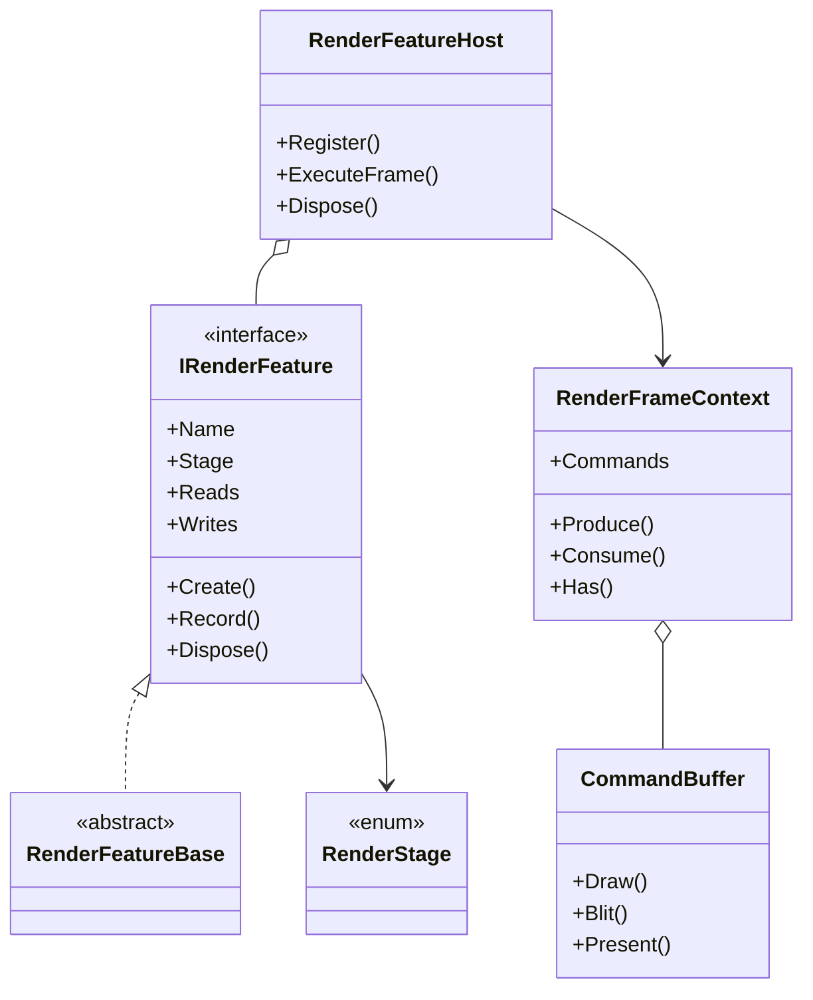
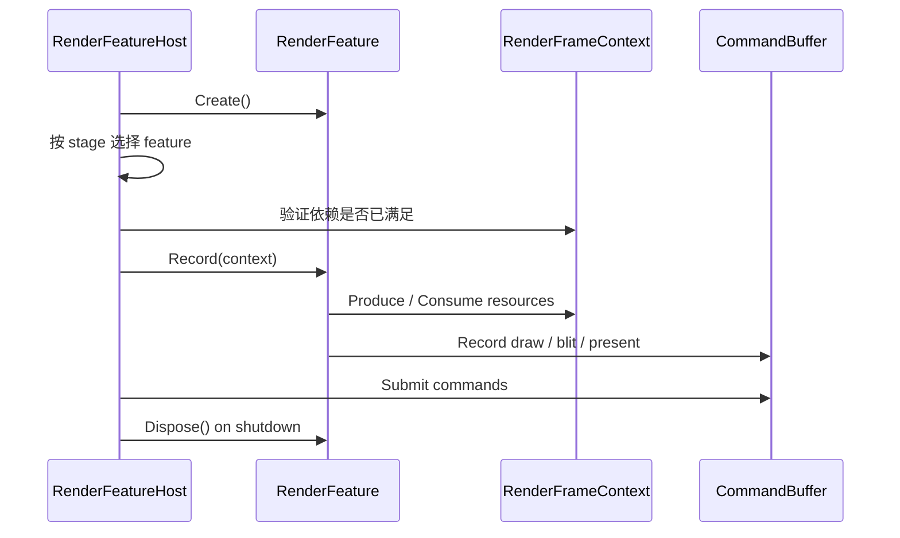

---
date: "2026-04-17"
title: "设计模式教科书｜Render Pass / Render Feature：把扩展点插进渲染管线"
description: "Render Pass / Render Feature 解决的是如何在既有渲染管线里稳定插入新阶段、声明资源依赖并控制生命周期。它不是简单回调，而是带插入点、依赖声明和回收边界的扩展机制。"
slug: "patterns-42-render-pass-feature"
weight: 942
tags:
  - "设计模式"
  - "Render Pass"
  - "Render Feature"
  - "软件工程"
  - "图形学"
  - "引擎架构"
series: "设计模式教科书"
---

> 一句话定义：Render Pass / Render Feature 把“我要插一段渲染逻辑”变成“在什么插入点、以什么依赖、在什么生命周期里插进去”。

## 历史背景

早期图形程序里的扩展方式很朴素：主渲染循环里加一个 `if (enableBloom)`，或者在某个阶段后面直接调用一个回调。这个做法短期内有效，因为管线短、阶段少、资源也少。可一旦项目增长，效果数量、平台差异、后处理顺序和临时纹理管理一起上来，扩展点就会从“顺手插一刀”变成“系统级风险”。

渲染扩展的演进，基本经历了三个阶段。第一阶段是硬编码分支，逻辑写在主循环里；第二阶段是插件式回调，外部模块可以挂进去，但依赖和生命周期还靠约定；第三阶段是图驱动扩展，扩展点不再只是一个函数，而是一个带 stage、资源声明和编译验证的 pass。Unity 的 ScriptableRendererFeature、Unreal 的 RDG 自定义 pass、Filament 的 FrameGraph pass builder，都是这条演进链上的不同表达。

这个模式真正重要的地方，不在于“支持扩展”，而在于“支持可验证的扩展”。一个 pass 插进去后，系统必须知道它在哪个插入点执行、前置资源是谁、产出的资源给谁用、释放点在哪里。没有这些信息，扩展点就会退化成一堆临时回调，最后把渲染管线搞成一个谁都不敢动的巨型函数。

现代图形 API 的显式化也把这个问题推得更尖锐。Vulkan、DirectX 12、Metal 这类 API 会把资源状态、barrier 和 submit 边界都暴露出来；引擎就必须把“什么时候插入一个 pass”变成“这个 pass 产生什么资源、消费什么资源、是否能跟别的 pass 共存”。所以 Render Pass / Render Feature 不是插件的别名，而是渲染管线中的受控扩展机制。

## 一、先看问题

看一个简单的坏味道：主渲染器里塞满开关和回调，所有新功能都从这里开分支。第一眼看很灵活，第二眼就会发现，功能之间开始互相踩顺序，谁先改颜色空间、谁后做混合、谁负责临时纹理回收，全靠记忆。

```csharp
using System;

public sealed class NaiveFeatureRenderer
{
    public bool EnableBloom { get; set; }
    public bool EnableOutline { get; set; }
    public bool EnableUiOverlay { get; set; }

    public void RenderFrame()
    {
        DrawOpaqueScene();

        if (EnableBloom)
        {
            ApplyBloom();
        }

        if (EnableOutline)
        {
            ApplyOutline();
        }

        if (EnableUiOverlay)
        {
            DrawUiOverlay();
        }

        Present();
    }

    private void DrawOpaqueScene() => Console.WriteLine("opaque scene");
    private void ApplyBloom() => Console.WriteLine("bloom");
    private void ApplyOutline() => Console.WriteLine("outline");
    private void DrawUiOverlay() => Console.WriteLine("ui overlay");
    private void Present() => Console.WriteLine("present");
}
```

这类代码的问题，不在于它能不能跑，而在于它把扩展点和主流程绑死了。新功能想插在“透明物体之后、UI 之前”，不是多写一个 `if` 就能解决的，因为它还可能依赖 SceneColor、深度纹理、历史缓冲或者临时中间图。只要依赖一多，纯回调就会开始失控。

更糟的是，扩展点越多，资源生命周期越难看清。某个 feature 可能只在两个 stage 之间临时需要一个纹理，但主循环并不知道什么时候能回收；某个 feature 可能只对某些相机生效，但它仍然被全局初始化；某个 feature 可能依赖前一个 feature 的产物，但错误的插入点会让它读到旧值或者空值。扩展点一旦没有依赖声明，就不是扩展，而是把不确定性注入到管线里。

## 二、模式的解法

Render Pass / Render Feature 的核心做法，是把“扩展逻辑”包装成有 stage、有依赖、有生命周期的对象。它不是随便塞进主循环，而是先声明自己想插入到哪里，再声明自己读什么、写什么，最后由宿主在合适的 frame stage 里调度。

下面这份纯 C# 代码演示一个最小但完整的 render feature host。它包含插入点、资源声明、命令缓冲和生命周期钩子。功能上，它更接近一套能做验证的扩展系统，而不是单纯的回调集合。

```csharp
using System;
using System.Collections.Generic;
using System.Linq;

public enum RenderStage
{
    BeginFrame,
    BeforeOpaque,
    AfterOpaque,
    BeforePostProcess,
    AfterPostProcess,
    EndFrame
}

public sealed class CommandBuffer
{
    private readonly List<string> _commands = new();

    public void Draw(string description) => _commands.Add($"draw: {description}");
    public void Blit(string description) => _commands.Add($"blit: {description}");
    public void Present(string description) => _commands.Add($"present: {description}");

    public IReadOnlyList<string> Snapshot() => _commands;
}

public sealed class RenderFrameContext
{
    private readonly Dictionary<string, string> _resources = new();

    public CommandBuffer Commands { get; } = new();

    public void Produce(string name, string value)
    {
        _resources[name] = value;
        Console.WriteLine($"  produce {name} = {value}");
    }

    public string Consume(string name)
    {
        if (!_resources.TryGetValue(name, out var value))
        {
            throw new InvalidOperationException($"Resource '{name}' is missing.");
        }

        Console.WriteLine($"  consume {name} = {value}");
        return value;
    }

    public bool Has(string name) => _resources.ContainsKey(name);
}

public interface IRenderFeature : IDisposable
{
    string Name { get; }
    RenderStage Stage { get; }
    IReadOnlyList<string> Reads { get; }
    IReadOnlyList<string> Writes { get; }
    void Create();
    void Record(RenderFrameContext context);
}

public abstract class RenderFeatureBase : IRenderFeature
{
    public abstract string Name { get; }
    public abstract RenderStage Stage { get; }
    public abstract IReadOnlyList<string> Reads { get; }
    public abstract IReadOnlyList<string> Writes { get; }

    public virtual void Create() { }
    public abstract void Record(RenderFrameContext context);
    public virtual void Dispose() { }
}

public sealed class RenderFeatureHost : IDisposable
{
    private readonly List<IRenderFeature> _features = new();

    public void Register(IRenderFeature feature)
    {
        if (feature is null) throw new ArgumentNullException(nameof(feature));
        feature.Create();
        _features.Add(feature);
    }

    public void ExecuteFrame()
    {
        var context = new RenderFrameContext();

        foreach (RenderStage stage in Enum.GetValues(typeof(RenderStage)))
        {
            Console.WriteLine($"stage: {stage}");

            foreach (var feature in _features.Where(feature => feature.Stage == stage))
            {
                ValidateDependencies(feature, context);
                Console.WriteLine($"  feature: {feature.Name}");
                feature.Record(context);
            }
        }

        Console.WriteLine("submit command buffer");
        foreach (var command in context.Commands.Snapshot())
        {
            Console.WriteLine($"  {command}");
        }
    }

    private static void ValidateDependencies(IRenderFeature feature, RenderFrameContext context)
    {
        foreach (var read in feature.Reads)
        {
            if (!context.Has(read))
            {
                throw new InvalidOperationException($"Feature '{feature.Name}' requires '{read}' before stage '{feature.Stage}'.");
            }
        }
    }

    public void Dispose()
    {
        for (var i = _features.Count - 1; i >= 0; i--)
        {
            _features[i].Dispose();
        }

        _features.Clear();
    }
}

public sealed class OpaqueSceneFeature : RenderFeatureBase
{
    public override string Name => "OpaqueScene";
    public override RenderStage Stage => RenderStage.BeforeOpaque;
    public override IReadOnlyList<string> Reads => Array.Empty<string>();
    public override IReadOnlyList<string> Writes => new[] { "SceneColor", "Depth" };

    public override void Record(RenderFrameContext context)
    {
        context.Produce("SceneColor", "opaque scene color");
        context.Produce("Depth", "opaque depth");
        context.Commands.Draw("opaque geometry");
    }
}

public sealed class BloomFeature : RenderFeatureBase
{
    public override string Name => "Bloom";
    public override RenderStage Stage => RenderStage.AfterOpaque;
    public override IReadOnlyList<string> Reads => new[] { "SceneColor" };
    public override IReadOnlyList<string> Writes => new[] { "BloomTexture" };

    public override void Record(RenderFrameContext context)
    {
        var color = context.Consume("SceneColor");
        context.Produce("BloomTexture", $"bloom from {color}");
        context.Commands.Blit("bloom pass");
    }
}

public sealed class UiOverlayFeature : RenderFeatureBase
{
    public override string Name => "UiOverlay";
    public override RenderStage Stage => RenderStage.AfterPostProcess;
    public override IReadOnlyList<string> Reads => new[] { "FinalColor" };
    public override IReadOnlyList<string> Writes => new[] { "BackBuffer" };

    public override void Record(RenderFrameContext context)
    {
        var finalColor = context.Consume("FinalColor");
        context.Produce("BackBuffer", $"ui over {finalColor}");
        context.Commands.Draw("ui overlay");
        context.Commands.Present("back buffer");
    }
}

public sealed class CompositeFeature : RenderFeatureBase
{
    public override string Name => "Composite";
    public override RenderStage Stage => RenderStage.BeforePostProcess;
    public override IReadOnlyList<string> Reads => new[] { "SceneColor", "BloomTexture" };
    public override IReadOnlyList<string> Writes => new[] { "FinalColor" };

    public override void Record(RenderFrameContext context)
    {
        var scene = context.Consume("SceneColor");
        var bloom = context.Consume("BloomTexture");
        context.Produce("FinalColor", $"{scene} + {bloom}");
        context.Commands.Blit("composite final color");
    }
}

public static class Program
{
    public static void Main()
    {
        using var host = new RenderFeatureHost();
        host.Register(new OpaqueSceneFeature());
        host.Register(new BloomFeature());
        host.Register(new CompositeFeature());
        host.Register(new UiOverlayFeature());
        host.ExecuteFrame();
    }
}
```

这份代码里，`RenderFeature` 不再是“想干什么就干什么”的钩子，它首先是一个有插入点的对象，其次是一个有资源声明的对象，最后才是一个会录制命令的对象。这样做的价值，是宿主可以在执行前验证依赖、排序 stage、管理生命周期。换句话说，扩展点不再只是“代码能插进去”，而是“代码插进去后仍然可校验”。

这也解释了为什么 Render Pass / Render Feature 和 Command Buffer 不是一回事。Command Buffer 关心的是“怎样记录一串命令并延迟提交”，Render Feature 关心的是“这段扩展逻辑在什么时候插入、依赖什么、产出什么”。前者是提交容器，后者是管线结构。

## 三、结构图



这张图的重点，是把“扩展点”画成一个受约束的对象。`IRenderFeature` 不只是回调接口，它还携带 stage 和依赖。`RenderFeatureHost` 不只是容器，它负责验证和调度。`CommandBuffer` 被保留在下面一层，说明 feature 可以录制命令，但不能代替管线编排。

## 四、时序图



时序图说明了一件事：Render Feature 的执行顺序不是由“谁先被 new 出来”决定，而是由 stage 和依赖决定。真正健康的扩展系统，会把创建、录制、提交和销毁分开。这样一来，feature 既能插进去，也不会把自己的生命周期偷偷蔓延到整个帧外。

## 五、变体与兄弟模式

Render Pass 和 Render Feature 常常成对出现，但不完全等价。Render Pass 更像一段可以被编译器和图调度器识别的阶段描述；Render Feature 更像面向用户的扩展入口，负责把一个或多个 pass 放进合适的位置。前者偏执行图，后者偏扩展边界。

它的变体通常有三种。第一种是纯回调型：在某个钩子里直接写代码，简单但脆弱。第二种是插件型：外部模块注册自己的 feature，宿主统一调度，适合大工程。第三种是图节点型：feature 不直接执行，而是把 pass 录到 render graph 里，再由图编译器决定顺序和资源生命周期。现代引擎越来越偏向第三种，因为它更容易做验证和优化。

兄弟模式里，Chain of Responsibility 最像“处理请求并决定是否传下去”，Plugin Architecture 最像“模块插入系统边界”，Command Buffer 最像“记录动作并延迟提交”。Render Feature 介于三者之间：它有插件味，但不是纯插件；它有链式插入点，但不是请求传递；它会录命令，但不负责命令语义本身。

## 六、对比其他模式

| 模式 | 重点 | 运行语义 | 边界风险 |
|---|---|---|---|
| Chain of Responsibility | 请求是否继续传递 | 逐个处理直到被消费 | 处理者顺序改变就改语义 |
| Plugin Architecture | 模块如何接入系统 | 发现、装载、注册、卸载 | 插件太自由会失去验证 |
| Command Buffer | 命令如何延迟提交 | 记录后统一执行 | 只有提交，不管插入点 |
| Render Pass / Feature | 在管线里怎么插入效果 | 按 stage + dependency 执行 | 插错 stage 会读错资源 |

这三者都像“扩展”，但问题不一样。Chain of Responsibility 解决的是“谁来处理”，Plugin 解决的是“谁能加入”，Command Buffer 解决的是“命令何时发给 GPU”。Render Pass / Feature 解决的是“扩展逻辑应该插到渲染帧的哪个位置，并且要知道它依赖什么”。

这也是为什么很多团队把 feature 写成 chain 后会走偏。链模式强调的是责任接力，渲染 feature 强调的是阶段插入。前者可以中途消费请求，后者通常不能吞掉整个帧流程；前者的上下文多半是业务对象，后者的上下文是资源和命令。边界不同，别名义上“都能插”就把它们混掉。

## 七、批判性讨论

Render Feature 的最大风险，是“扩展性”变成“碎片化”。如果每个小效果都单独做一个 feature，宿主的 stage 数会越来越多，feature 之间的依赖会越来越乱，最后大家只能靠命名和约定来维持秩序。可验证的扩展，和无边界的扩展，不是一回事。

另一个风险是错误插入点的代价。一个 bloom feature 如果插在 tone mapping 之前，颜色空间会不对；一个 UI overlay 如果插在 post-process 之前，UI 可能被后处理污染；一个依赖 SceneColor 的 feature 如果被插在它被写入之前，系统要么报错，要么补一个 fallback copy 或 clear。这里的代价不是“多跑一行代码”，而是多一次带宽、多一次同步、甚至一帧的视觉错误。

还有一种常见误解，是把 feature 当成插件万能胶。插件可以发现、注册、热插拔，但渲染 feature 还得接受帧内资源约束。它不是“什么都能插”，而是“只在规定插入点里，按规定资源协议插”。如果把两者混成一个概念，团队就会在代码和架构上都失去约束。

## 八、跨学科视角

Render Feature 很像编译器里的 pass 插桩。编译器也允许你在某个 IR 阶段前后插 pass，但前提是你得知道这一步前后有哪些数据结构、哪些分析结果能复用、哪些优化不能跨越。渲染 feature 的 stage 和 dependency，本质上就是渲染领域的 IR 约束。

它也像中间件系统。HTTP 中间件、消息处理器、任务管道都允许你在流程中插入组件，但成熟系统会把插入位置、上下文对象和生命周期写清楚。差别只在于，渲染 feature 的上下文不是请求报文，而是一帧图像的资源和命令。

再往下看，Render Feature 还带有资源编排的味道。一个 feature 可能创建 transient texture，另一个 feature 消费它，第三个 feature 在 frame 末尾释放它。这个生命周期管理和数据库连接池、任务调度器并没有本质不同：都要防止资源泄漏、错用和越界访问。

## 九、真实案例

Unity 的 URP 是 Render Feature 的代表案例。`ScriptableRendererFeature` 负责扩展入口，`ScriptableRenderPass` 负责单个 pass 的生命周期，`AddRenderPasses` 和 `EnqueuePass` 把 feature 注入 renderer 的执行队列。官方文档直接说明，`ScriptableRendererFeature` 用来向 renderer 注入 render pass；`ScriptableRenderPass` 则承载具体的渲染逻辑。相关入口包括：`https://docs.unity3d.com/kr/6000.0/Manual/urp/inject-a-render-pass.html`、`https://docs.unity3d.com/cn/Packages/com.unity.render-pipelines.universal%4012.1/api/UnityEngine.Rendering.Universal.ScriptableRendererFeature.html`、`https://github.com/Unity-Technologies/Graphics/blob/master/Packages/com.unity.render-pipelines.universal/Runtime/Passes/ScriptableRenderPass.cs`、`https://github.com/Unity-Technologies/Graphics/blob/master/Packages/com.unity.render-pipelines.universal/Runtime/UniversalRenderer.cs`。

Unity 的 Render Graph 路线把 feature 进一步收束成声明式 pass。文档里明确说，先声明这段 pass 需要哪些纹理，再录制 graphics commands。`render-graph-introduction` 和 `write-render-pass` 两篇文档把这个流程讲得很清楚：资源声明先于执行，录制先于提交。链接可看 `https://docs.unity3d.com/kr/6000.0/Manual/urp/render-graph-introduction.html`、`https://docs.unity3d.com/ja/current/Manual/urp/render-graph-write-render-pass.html`、`https://github.com/Unity-Technologies/Graphics/blob/master/Packages/com.unity.render-pipelines.core/Runtime/RenderGraph/RenderGraphUtilsBlit.cs`。

Unreal 的 RDG 给出了另一种更图式的扩展方式。它不是让你往主循环里塞回调，而是让你把 pass 录到 `FRDGBuilder` 里，并通过 `AddCopyBufferPass`、`AddClearDepthStencilPass`、`AddClearRenderTargetPass` 这类 API 声明图中的操作。官方文档把 RDG 定义成整帧优化系统，强调自动异步计算调度、内存别名管理和 barrier 管理。相关入口包括 `https://dev.epicgames.com/documentation/ru-ru/unreal-engine/rendering-dependency-graph?application_version=4.27`、`https://dev.epicgames.com/documentation/en-us/unreal-engine/API/Runtime/RenderCore/AddCopyBufferPass`、`https://dev.epicgames.com/documentation/en-us/unreal-engine/API/Runtime/RenderCore/AddClearDepthStencilPass/1`、`https://dev.epicgames.com/documentation/en-us/unreal-engine/API/Runtime/RenderCore/FRDGBuilder/SetExternalPooledRenderTargetRHI`。

Godot 的渲染体系则提供了一个更偏后端抽象的对照。`RenderingServer` 是可见世界的后端 API，内部完全 opaque；`RenderingDevice` 则是更低层的现代图形 API 抽象，可以在自己的项目里直接做 compute 或低级绘制。相关文档见 `https://docs.godotengine.org/en/latest/tutorials/rendering/renderers.html`、`https://docs.godotengine.org/en/4.1/classes/class_renderingserver.html`、`https://docs.godotengine.org/en/latest/classes/class_renderingdevice.html`。它不一定叫 feature，但它说明了同一件事：扩展渲染，不能只给回调，还得给资源和层级边界。

## 十、常见坑

第一，把 feature 做成“全局开关”。真正的 Render Feature 不是只控制开或关，它应该还能说清楚在哪个 stage 开、依赖谁、产出什么。只有开关，没有边界，最后就会变成主循环里一堆 if。

第二，把资源生命周期交给运气。临时纹理该在帧内消失，外部资源该被 import，Feature Host 该知道哪些资源是 transient、哪些是 persistent。否则内存会悄悄膨胀，或者更糟，资源会被重复释放。

第三，把插入点当成装饰语。插入点不是文案，是语义。放在 `BeforeOpaque` 和放在 `AfterPostProcess`，对应的是完全不同的颜色空间和输入集合。错一个 stage，结果可能不是“效果不对”，而是整帧都错。

第四，把命令缓冲当成 feature 本身。命令缓冲只是记录器，feature 是结构化扩展入口。前者管“怎么提交”，后者管“在哪儿插、读写什么、什么时候销毁”。一旦混淆，代码会在最初几个月看起来很顺，后面逐步失去可维护性。

## 十一、性能考量

Render Feature 的性能问题，往往不在 feature 本身，而在它让管线多出来的拷贝、清理和同步。插入一个 feature，如果只录制少量 draw call，代价很小；如果它要求额外创建临时纹理、在错误 stage 做 color space 转换、或者引入额外的 full-screen blit，成本就会迅速上升。

验证本身也有成本。宿主每次执行前都要检查资源依赖，每帧都要按 stage 分组并排序。这个开销通常比 GPU pass 本身小，但在 feature 很多的时候，编译和验证会变成真实的 CPU 时间。错误的 feature 还会放大这个成本，因为系统要么插 fallback，要么抛错，要么回退到更保守的路径。

所以，这个模式的性能判断标准，不是 feature 数量越少越好，而是每个 feature 是否明确了它的 stage 和资源边界。边界越清晰，宿主越容易做合并、复用和验证；边界越模糊，系统就越容易额外插复制、清屏和同步点。

## 十二、何时用 / 何时不用

适合用 Render Pass / Render Feature 的场景，是渲染流程已经有多个稳定阶段，而且还会继续长出新效果。你需要让新特性能插入而不重写主渲染器，还要让 feature 说清楚自己依赖哪些中间资源。只要项目进入这个阶段，feature 化就比在主循环里堆 if 更稳。

不适合用的场景，是一两个效果就能做完的小工程，或者原型期。那时候引入 stage、资源声明、生命周期和验证系统，性价比并不高。先把视觉验证出来，再考虑把它收进 feature 系统，通常更划算。

还有一种不适合，是 feature 试图接管所有架构职责。Render Feature 不是服务定位器，也不是万能插件容器。它只负责渲染帧内的受控扩展；如果你把配置、业务逻辑、资源加载和 UI 事件都往里塞，它很快就会失去“render”的边界。

## 十三、相关模式

Render Pass / Render Feature 和 [Pipeline](./patterns-24-pipeline.md) 是一对先后关系。Pipeline 负责把阶段组织起来，Feature 负责把具体效果插进去。前者定骨架，后者定插槽。

它和 [Command Buffer](./patterns-43-command-buffer.md) 的关系也很近。Feature 会录制命令，但命令缓冲只是承载，不是扩展点本身。把两者分开，才能既有扩展性，又不把提交模型搞乱。

它还和 [Plugin Architecture](./patterns-28-plugin-architecture.md) 互相呼应。插件系统解决模块装载，Render Feature 解决渲染阶段注入。一个偏系统边界，一个偏帧边界。

最后，Render Feature 也会被未来的 [Shader Variant](./patterns-46-shader-variant.md) 牵动。feature 越多，shader 变体越容易爆炸；shader 变体越复杂，feature 的 stage 和资源声明就越需要更严格地约束。

## 十四、在实际工程里怎么用

在 Unity 里，先把自定义效果放进 `ScriptableRendererFeature`，再把具体逻辑拆到 `ScriptableRenderPass`，让 URP 负责插入点和生命周期。你要做的不是直接改主循环，而是把效果注册成可验证的扩展点。

在 Unreal 里，优先把自定义操作录进 RDG，把资源声明和 pass 编排交给 `FRDGBuilder`。这样一来，生命周期、barrier 和资源 aliasing 都能跟着图走，而不是散在各个 renderer 分支里。

在自研引擎里，Render Feature 最值得先建立的，不是 UI 化的配置面板，而是“插入点 + 资源声明 + 生命周期”三件套。只要这三件事立住，后面才能谈热插拔、图优化和跨平台差异。

应用线后续可接到：[Render Pass / Render Feature 应用线占位](./patterns-42-render-pass-feature-application.md)。

## 小结

Render Pass / Render Feature 的第一个价值，是让扩展从“往主循环里加代码”变成“往管线里挂受控节点”。这会直接降低维护成本。

第二个价值，是把 stage、依赖和生命周期都显式化。资源怎么来、去哪儿、什么时候能回收，不再靠人脑记。

第三个价值，是让现代渲染架构既能长出新效果，又不至于把主渲染器拖成一锅粥。
