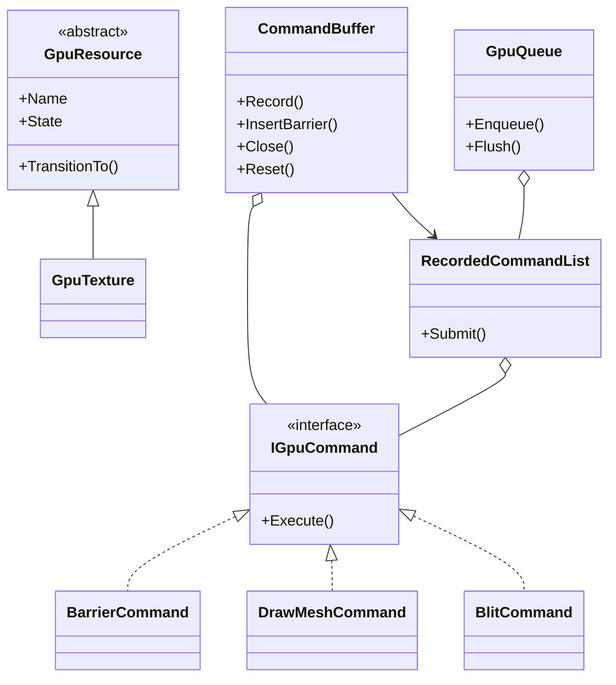
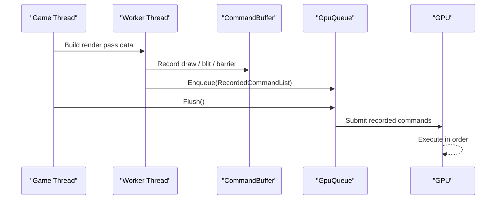

---
date: "2026-04-17"
title: "设计模式教科书｜Command Buffer：先录制，再提交，别把 GPU 当普通函数调用"
description: "Command Buffer 的核心是把渲染工作从即时调用改成可录制、可提交、可复用的命令流，并把 barrier、同步和线程边界一起纳入设计。"
slug: "patterns-43-command-buffer"
weight: 943
tags:
  - "设计模式"
  - "Command Buffer"
  - "软件工程"
series: "设计模式教科书"
---

> 一句话定义：Command Buffer 不是“把命令对象存起来”，而是把 GPU 需要的状态变更、绘制、拷贝和同步，先录成一段可提交的工作，再由队列在合适的时机执行。

## 历史背景

传统图形 API 更像“边调函数边改驱动状态”。OpenGL 和早期 Direct3D 允许应用边写边生效，驱动替你记状态、做推断、补同步。它容易上手，却把大量 CPU 成本和隐式复杂度藏在了黑盒里。

Vulkan 和 Direct3D 12 把这件事反过来：应用负责录制，驱动负责尽量少猜。命令缓冲、命令列表、显式 barrier、提交队列，这一套不是为了“写法更酷”，而是为了让多线程录制、批量提交和 GPU 并行变得可控。

这也是为什么它和 GoF 的 Command 只沾了一点边。GoF Command 关注“把一个动作对象化”，图形 API 的 Command Buffer 关注的是“把一串 GPU 工作按提交语义固化下来”。它更接近渲染日志、执行计划，甚至数据库里的批处理事务，而不是业务层的按钮命令。

## 一、先看问题

看一段典型的即时式渲染伪代码。

```csharp
using System;

public sealed class ImmediateRenderer
{
    public void DrawFrame()
    {
        SetRenderTarget("GBuffer");
        SetPipeline("Opaque");
        DrawMesh("Hero");
        DrawMesh("Crate");
        SetRenderTarget("Lighting");
        BindTexture("GBuffer");
        DrawFullscreenQuad();
        SetRenderTarget("BackBuffer");
        Present();
    }

    private void SetRenderTarget(string name) => Console.WriteLine($"RT = {name}");
    private void SetPipeline(string name) => Console.WriteLine($"Pipeline = {name}");
    private void BindTexture(string name) => Console.WriteLine($"Bind = {name}");
    private void DrawMesh(string name) => Console.WriteLine($"Draw = {name}");
    private void DrawFullscreenQuad() => Console.WriteLine("FullscreenQuad");
    private void Present() => Console.WriteLine("Present");
}
```

这段代码能跑，却有三个结构性问题。

第一，录制和执行混在一起。你没法先在工作线程准备好一批渲染步骤，再交给渲染线程统一提交。

第二，同步语义不明确。什么时候从写 GBuffer 切到读 GBuffer？什么时候需要 barrier？什么时候允许复用同一段录制结果？即时调用写法不会替你回答。

第三，重复工作太多。每帧都重复走一遍“告诉驱动我要做什么”的路径，CPU 侧的开销会随 draw call 和状态切换一起放大。

Command Buffer 解决的不是“把代码写得更漂亮”，而是把这些成本从运行时调用栈里搬到可管理的录制阶段。

## 二、模式的解法

核心思路很简单。

先录制，再提交。

录制阶段只负责把命令按顺序写进缓冲区，不立即触发 GPU 执行。提交阶段把这段缓冲区送到队列，由队列和硬件按顺序消费。只要命令之间存在读写切换，就在缓冲区里显式插入 barrier。

下面是一套纯 C# 的最小实现。它演示了录制、复用、提交和资源状态切换。

```csharp
using System;
using System.Collections.Generic;
using System.Linq;

public enum GpuResourceState
{
    Common,
    RenderTarget,
    ShaderResource,
    CopySource,
    CopyDestination,
    UnorderedAccess
}

public abstract class GpuResource
{
    public string Name { get; }
    public GpuResourceState State { get; private set; }

    protected GpuResource(string name, GpuResourceState initialState = GpuResourceState.Common)
    {
        Name = string.IsNullOrWhiteSpace(name) ? throw new ArgumentException("Name is required.", nameof(name)) : name;
        State = initialState;
    }

    public void TransitionTo(GpuResourceState nextState) => State = nextState;
}

public sealed class GpuTexture : GpuResource
{
    public int Width { get; }
    public int Height { get; }

    public GpuTexture(string name, int width, int height, GpuResourceState initialState = GpuResourceState.Common)
        : base(name, initialState)
    {
        Width = width > 0 ? width : throw new ArgumentOutOfRangeException(nameof(width));
        Height = height > 0 ? height : throw new ArgumentOutOfRangeException(nameof(height));
    }
}

public sealed class GpuContext
{
    private readonly List<string> _log = new();
    public IReadOnlyList<string> Log => _log;
    public void Write(string message) => _log.Add(message);
}

public interface IGpuCommand
{
    void Execute(GpuContext context);
}

public sealed class BarrierCommand : IGpuCommand
{
    private readonly GpuResource _resource;
    private readonly GpuResourceState _before;
    private readonly GpuResourceState _after;

    public BarrierCommand(GpuResource resource, GpuResourceState before, GpuResourceState after)
    {
        _resource = resource;
        _before = before;
        _after = after;
    }

    public void Execute(GpuContext context)
    {
        if (_resource.State != _before)
            throw new InvalidOperationException($"{_resource.Name} is {_resource.State}, not {_before}.");

        _resource.TransitionTo(_after);
        context.Write($"Barrier {_resource.Name}: {_before} -> {_after}");
    }
}

public sealed class SetRenderTargetCommand : IGpuCommand
{
    private readonly GpuTexture _target;

    public SetRenderTargetCommand(GpuTexture target) => _target = target;

    public void Execute(GpuContext context)
    {
        if (_target.State != GpuResourceState.RenderTarget)
            throw new InvalidOperationException($"{_target.Name} must be RenderTarget before binding.");

        context.Write($"SetRenderTarget {_target.Name}");
    }
}

public sealed class DrawMeshCommand : IGpuCommand
{
    private readonly string _mesh;
    private readonly GpuTexture _target;

    public DrawMeshCommand(string mesh, GpuTexture target)
    {
        _mesh = mesh;
        _target = target;
    }

    public void Execute(GpuContext context)
    {
        if (_target.State != GpuResourceState.RenderTarget)
            throw new InvalidOperationException($"{_target.Name} must stay in RenderTarget state for drawing.");

        context.Write($"DrawMesh {_mesh} -> {_target.Name}");
    }
}

public sealed class BlitCommand : IGpuCommand
{
    private readonly GpuTexture _source;
    private readonly GpuTexture _destination;

    public BlitCommand(GpuTexture source, GpuTexture destination)
    {
        _source = source;
        _destination = destination;
    }

    public void Execute(GpuContext context)
    {
        if (_source.State != GpuResourceState.ShaderResource)
            throw new InvalidOperationException($"{_source.Name} must be ShaderResource before sampling.");

        if (_destination.State != GpuResourceState.RenderTarget)
            throw new InvalidOperationException($"{_destination.Name} must be RenderTarget before blitting.");

        context.Write($"Blit {_source.Name} -> {_destination.Name}");
    }
}

public sealed class CommandBuffer
{
    private readonly List<IGpuCommand> _commands = new();
    private bool _sealed;

    public string Name { get; }

    public CommandBuffer(string name)
    {
        Name = string.IsNullOrWhiteSpace(name) ? throw new ArgumentException("Name is required.", nameof(name)) : name;
    }

    public void Record(IGpuCommand command)
    {
        if (_sealed)
            throw new InvalidOperationException("This command buffer is sealed. Call Reset() before recording again.");

        _commands.Add(command);
    }

    public void InsertBarrier(GpuResource resource, GpuResourceState before, GpuResourceState after)
        => Record(new BarrierCommand(resource, before, after));

    public void SetRenderTarget(GpuTexture target) => Record(new SetRenderTargetCommand(target));

    public void DrawMesh(string mesh, GpuTexture target) => Record(new DrawMeshCommand(mesh, target));

    public void Blit(GpuTexture source, GpuTexture destination) => Record(new BlitCommand(source, destination));

    public RecordedCommandList Close()
    {
        _sealed = true;
        return new RecordedCommandList(Name, _commands.ToArray());
    }

    public void Reset()
    {
        _commands.Clear();
        _sealed = false;
    }
}

public sealed class RecordedCommandList
{
    private readonly IGpuCommand[] _commands;
    public string Name { get; }

    public RecordedCommandList(string name, IGpuCommand[] commands)
    {
        Name = name;
        _commands = commands;
    }

    public void Submit(GpuContext context)
    {
        context.Write($"Submit {Name}");
        foreach (var command in _commands)
            command.Execute(context);
    }
}

public sealed class GpuQueue
{
    private readonly Queue<RecordedCommandList> _pending = new();

    public void Enqueue(RecordedCommandList list) => _pending.Enqueue(list);

    public void Flush(GpuContext context)
    {
        while (_pending.Count > 0)
            _pending.Dequeue().Submit(context);
    }
}

public static class Program
{
    public static void Main()
    {
        var context = new GpuContext();
        var gbuffer = new GpuTexture("GBuffer", 1920, 1080, GpuResourceState.RenderTarget);
        var backBuffer = new GpuTexture("BackBuffer", 1920, 1080, GpuResourceState.RenderTarget);

        var geometry = new CommandBuffer("GeometryPass");
        geometry.InsertBarrier(gbuffer, GpuResourceState.RenderTarget, GpuResourceState.RenderTarget);
        geometry.SetRenderTarget(gbuffer);
        geometry.DrawMesh("Hero", gbuffer);
        geometry.DrawMesh("Crate", gbuffer);
        geometry.InsertBarrier(gbuffer, GpuResourceState.RenderTarget, GpuResourceState.ShaderResource);

        var post = new CommandBuffer("PostProcess");
        post.InsertBarrier(backBuffer, GpuResourceState.RenderTarget, GpuResourceState.RenderTarget);
        post.Blit(gbuffer, backBuffer);

        var queue = new GpuQueue();
        queue.Enqueue(geometry.Close());
        queue.Enqueue(post.Close());
        queue.Flush(context);

        foreach (var line in context.Log)
            Console.WriteLine(line);
    }
}
```

这段代码的重点不是“图形 API 里也能写命令对象”，而是让录制、提交和状态转换分层。

录制只管顺序，提交只管执行，barrier 只管边界。这样你才有可能在多个线程上各自录制不同 pass，再在主线程统一提交。

## 三、结构图



## 四、时序图



## 五、变体与兄弟模式

Command Buffer 的常见变体有三种。

一种是只录一次、执行一次的命令列表。Direct3D 12 的常规 command list 就偏这个方向。

一种是可复用的二级命令缓冲或 bundle。Vulkan 的 secondary command buffer、D3D12 的 bundle 都强调“录好以后可以多次用”，适合静态或半静态 pass。

还有一种是渲染图里的 pass 节点。RenderGraph 不只是“命令堆起来”，而是把资源依赖、生命周期和执行顺序一起算进去，最后再生成命令缓冲。

它最容易和 GoF Command 混淆。GoF Command 适合把“按钮点击”“撤销操作”“任务排队”对象化；Command Buffer 适合把“GPU 该做的事”批量录制。前者面向业务语义，后者面向执行计划。

它也和 Pipeline 相近，但不是一回事。Pipeline 强调阶段之间的数据流转，Command Buffer 强调把一段工作录制下来并提交。Pipeline 可以产生命令缓冲，但命令缓冲本身不等于 Pipeline。

## 六、对比其他模式

| 模式 | 关注点 | 适合解决的问题 | 容易误解的地方 |
|---|---|---|---|
| Command | 把动作对象化 | 撤销、排队、重放 | 以为所有“命令”都能直接对应 GPU API |
| Facade | 简化复杂系统入口 | 屏蔽底层细节 | 以为它能替代执行计划 |
| Pipeline | 把阶段串起来 | 数据经过多个阶段处理 | 以为线性串联就一定是 pipeline |
| Dirty Flag | 延迟昂贵计算 | 脏状态批量刷新 | 以为它能替代显式同步 |

Command Buffer 和 Facade 很容易被放在一起讲，但它们的职责不同。Facade 解决“怎么把复杂 API 包起来”，Command Buffer 解决“怎么把执行工作推迟到正确时机”。

## 七、批判性讨论

Command Buffer 的优点很明显，但批评也同样明确。

第一，录制成本会被低估。命令不再立即执行，意味着你必须维护一套完整的状态跟踪、资源状态转换和提交顺序。对小项目来说，这层复杂度很贵。

第二，barrier 很容易写过头。显式同步让你更安全，也更容易把 GPU 卡在等待上。过度保守的 barrier 会让流水线吃不满，过度激进的 barrier 会直接制造数据竞争。

第三，命令缓冲不是免费的缓存。它能复用录制结果，但不能让所有工作都变成“录一次永久受益”。材质参数、动态实例、条件分支和资源状态都可能让重录不可避免。

第四，线程化录制不等于线程化执行。你可以多线程准备命令，但最终提交仍然会受队列、资源依赖和同步点约束。把“能多线程录制”误读成“渲染就会自动并行”，通常会得到错误预期。

## 八、跨学科视角

Command Buffer 很像编译器的中间表示。

源代码不是直接跑，而是先被翻译成 IR，再做优化，最后生成机器码。命令缓冲也是同一个思路：先把“我要画什么、怎么切状态”翻译成可执行序列，再交给 GPU。

它也像数据库的执行计划。

SQL 语句本身不是执行方式。优化器会决定走索引还是全表扫，决定 join 顺序，决定是否复用中间结果。命令缓冲同样把“描述意图”与“实际执行”分开，让提交方有机会批量优化。

## 九、真实案例

Unity 的 `CommandBuffer` 是最直白的例子。

官方 Scripting API 明确写着它是 “List of graphics commands to execute”，可以挂在 Camera 或 Light 的渲染节点上，也可以通过 `Graphics.ExecuteCommandBuffer` 直接执行。Unity Graphics 仓库里，RenderGraph 相关代码位于 `Packages/com.unity.render-pipelines.core/Runtime/RenderGraph/`，这说明 Unity 早已把“录制命令”和“调度资源”放在同一条主线上。

参考：
- [Unity CommandBuffer](https://docs.unity3d.com/ja/current/ScriptReference/Rendering.CommandBuffer.html)
- [Unity Graphics 仓库](https://github.com/Unity-Technologies/Graphics)
- `Packages/com.unity.render-pipelines.core/Runtime/RenderGraph/RenderGraphUtilsBlit.cs`

Vulkan 把这套思想说得更底层。

`VkCommandBuffer` 是记录命令的句柄，`vkBeginCommandBuffer` / `vkEndCommandBuffer` 管理录制状态，`vkQueueSubmit` 负责提交。文档还明确说明了 primary / secondary command buffer 的层次，以及 submission order、pending state、pipeline barrier 和同步责任都由应用显式承担。

参考：
- [Command Buffers](https://docs.vulkan.org/spec/latest/chapters/cmdbuffers.html)
- [Synchronization](https://docs.vulkan.org/guide/latest/synchronization.html)
- [vkBeginCommandBuffer](https://docs.vulkan.org/refpages/latest/refpages/source/vkBeginCommandBuffer.html)

Direct3D 12 也把语义写得很清楚。

`ID3D12CommandList` 表示 GPU 执行的一组有序命令；“Work submission in Direct3D 12” 说明应用要记录 command lists 再提交到 command queues。`D3D12_RESOURCE_BARRIER` 和 `ID3D12GraphicsCommandList::ResourceBarrier` 则把资源状态切换从驱动隐式逻辑变成了应用显式逻辑。

参考：
- [ID3D12CommandList](https://learn.microsoft.com/en-us/windows/win32/api/d3d12/nn-d3d12-id3d12commandlist)
- [Creating and recording command lists and bundles](https://learn.microsoft.com/en-us/windows/win32/direct3d12/recording-command-lists-and-bundles)
- [Work submission in Direct3D 12](https://learn.microsoft.com/en-us/windows/win32/direct3d12/command-queues-and-command-lists)
- [D3D12_RESOURCE_BARRIER](https://learn.microsoft.com/en-us/windows/win32/api/d3d12/ns-d3d12-d3d12_resource_barrier)

把 Unreal 和 Godot 放进来以后，这个模式的工程轮廓会更清楚。Unreal 的 `FRHISubmitCommandListsArgs` 强调的是“提交一批已经录完的 command lists”，说明引擎内部先组织、再提交；Godot 的 `RenderingDevice` 则把 barrier、encoder 和低层 API 适配放在同一个抽象里，明确要求调用方自己面对同步和录制边界。两者都说明，成熟引擎不会把 Command Buffer 当成“命令数组”，而是当成后端契约。

Unreal 的 RHI 站在同一侧，只是语言不同。

`FRHISubmitCommandListsArgs` 的文档直接写明它 “submits a batch of previously recorded/finalized command lists”。`RHICommandList.h` 和 `DynamicRHI.h` 把命令列表、提交和上下文拆开，`StreamableManager` 则是资源系统的另一条线，后文会再看。

参考：
- `/Engine/Source/Runtime/RHI/Public/RHICommandList.h`
- `/Engine/Source/Runtime/RHI/Public/DynamicRHI.h`
- [FRHISubmitCommandListsArgs](https://dev.epicgames.com/documentation/en-us/unreal-engine/API/Runtime/RHI/FDynamicRHI/FRHISubmitCommandListsArgs)

Godot 的 `RenderingDevice` 则把低层图形 API 包装成可直接操作的对象。

它支持本地 `RenderingDevice`，支持 barrier，也明确说明它面向 Vulkan、D3D12、Metal、WebGPU 这类现代低层 API。对引擎来说，这意味着渲染命令的录制和同步已经是显式设计，不再依赖传统驱动的隐式状态猜测。

参考：
- [RenderingDevice](https://docs.godotengine.org/en/4.0/classes/class_renderingdevice.html)
- `servers/rendering/rendering_device.cpp`

## 十、常见坑

第一个坑，是把录制对象当成普通业务 Command。

图形命令不是“一个对象做一件事”这么简单。它经常要依赖资源状态、提交顺序和前后 pass 的同步关系。少掉任何一项，命令就不再可执行。

第二个坑，是把 barrier 当成可有可无的装饰。

在 Vulkan 和 D3D12 里，barrier 不是优化项，是正确性的一部分。缺 barrier 不是“性能更好”，而是“偶尔对、偶尔错，错的时候很难查”。

第三个坑，是滥用复用。

并不是所有命令缓冲都适合反复提交。动态参数太多、资源状态变化太频繁时，重录可能比维护复杂缓存更便宜。

第四个坑，是把多线程录制理解成万能提速。

线程化录制能削平 CPU 侧录制成本，但如果同步点太密、提交粒度太碎，收益会被 barrier 和队列等待吃掉。

## 十一、性能考量

Command Buffer 的性能账要拆开算。

录制阶段通常是 `O(k)`，`k` 是命令数。提交阶段也是 `O(k)`，但这里的关键不是渐进复杂度，而是能不能把多次即时 API 调用合并成更少的提交批次。

更值得算的是同步成本。

每插入一次 barrier，你就给 GPU 流水线加了一次可见性约束。正确的 barrier 能防止读写冲突，过量的 barrier 会让并行度下降。换句话说，Command Buffer 真正省下来的不是“执行时间”，而是 CPU 侧调度和驱动状态追踪。

这也是为什么 D3D12 和 Vulkan 都强调“应用端显式管理”。你获得的收益是多线程录制、批量提交和更少的驱动猜测；你承担的代价是状态追踪、同步设计和调试复杂度。

如果把收益量化到帧级别，最值得盯的指标通常不是单条 draw 快了多少，而是提交批次数和主线程录制时间有没有下降。把 300 次零散提交收成 20 到 30 个批次，CPU 侧往往能少掉一大截驱动交互和状态折返；但如果 barrier 插得过密，GPU 又会在等待上把收益吞回去。Command Buffer 优化的是提交结构，不是魔法般缩短每条命令的执行时间。

另一个容易被低估的成本是调试跨度。即时 API 出错时，问题大多落在当前调用点；命令缓冲出错时，问题可能埋在录制点、资源状态点、提交点，甚至前一帧留下的生命周期边界里。它把执行延后带来的，不只是更高吞吐，还有更长的因果链。

## 十二、何时用 / 何时不用

适合用：

- 你要录制大量绘制、拷贝或 compute 工作。
- 你希望多个线程分头准备不同 pass，再统一提交。
- 你需要显式同步资源状态，尤其是跨 pass 的读写切换。
- 你希望复用一段录制结果，减少重复 CPU 开销。

不适合用：

- 你只是想把几个业务动作包成对象。
- 你的图形工作极少，直接即时调用更简单。
- 你的资源状态变化太频繁，缓存录制结果并不划算。

## 十三、相关模式

- [Command](./patterns-06-command.md)
- [Dirty Flag](./patterns-32-dirty-flag.md)
- [Pipeline](./patterns-24-pipeline.md)
- 未来可继续看 [Hot Reload](./patterns-45-hot-reload.md) 和 [Shader Variant](./patterns-46-shader-variant.md)

## 十四、在实际工程里怎么用

在 Unity 里，它常出现在自定义渲染、后处理、阴影或 SRP 扩展里。

在 Vulkan 或 D3D12 里，它就是你的基础工作单元：先录制，后提交，barrier 负责收口。

在 Unreal 里，RHI CommandList 和 StreamableManager 分别代表渲染提交和资源加载这两条线。前者管 GPU 工作，后者管资源生命周期，二者都强调“先组织，再执行”。

在 Godot 里，`RenderingDevice` 和 `ResourceLoader` 也反映了同样的架构思想：把低层工作变成可排程、可复用、可同步的显式步骤。

应用线后续可以分别展开：

- [Command Buffer 在 Unity URP/HDRP 里的落地](../pattern-43-command-buffer-application.md)
- [Render Graph 与图形命令调度](../pattern-43-command-buffer-application.md)

## 小结

Command Buffer 的第一个价值，是把 GPU 工作从“立即生效”改成“可录制、可提交、可复用”。

第二个价值，是把同步和 barrier 变成一等公民，不再藏在驱动黑箱里。

第三个价值，是把多线程录制、批量提交和执行计划统一到同一个抽象里，让渲染系统真正可扩展。
把它的收益算到帧级别时，最容易看见的不是单次执行更快，而是录制结果能跨线程生成、跨 pass 合并、跨帧复用。提交批次越稳定，驱动猜测越少，CPU 侧就越容易把时间花在场景组织上，而不是反复解释同一组状态。

再往下看一个工程现实：命令缓冲越成熟，越要和资源生命周期一起看。录制本身只是“写下将来要做什么”，而资源句柄决定“将来做的时候对象还在不在”。一旦你把这两条线分开，很多调试问题就会从玄学变成状态机问题。

从量化上看，Command Buffer 省掉的往往是驱动侧的反复状态折返，而不是 GPU 的纯计算时间。真正的收益出现在帧结构稳定时：命令批次越大，提交次数越少，主线程越不容易被碎片化 API 调用打断；反过来，过碎的录制只会把批量优势吃掉。

这也是为什么现代图形 API 会把“可复用的录制结果”当成一等资源：它们不是单次调用的替代品，而是把提交、同步、复用和线程化变成同一个闭环。

