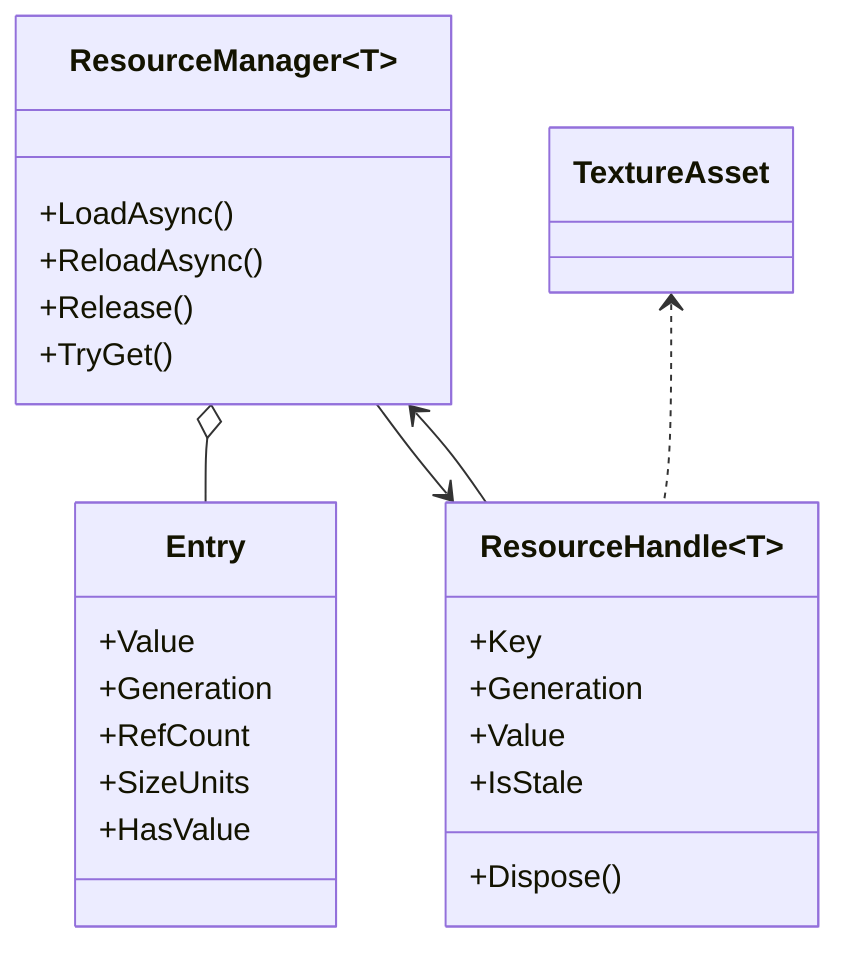
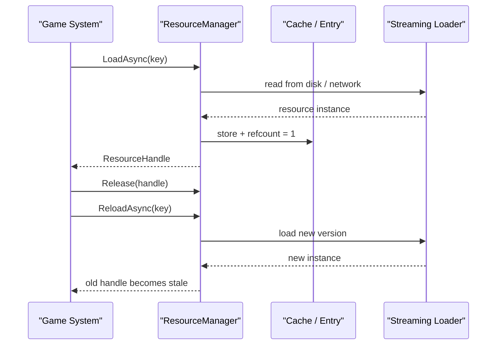

---
date: "2026-04-17"
title: "设计模式教科书｜Resource Management：句柄、引用计数和生命周期"
description: "Resource Management 不是“会不会加载资源”，而是如何用句柄、引用计数、缓存预算和生命周期规则，稳住流式加载、热重载和内存峰值。"
slug: "patterns-44-resource-management"
weight: 944
tags:
  - "设计模式"
  - "Resource Management"
  - "软件工程"
series: "设计模式教科书"
---

> 一句话定义：Resource Management 的本质，是把“对象还在不在、能不能用、什么时候释放、什么时候替换”从业务代码里抽出来，交给可追踪的句柄和生命周期系统。

## 历史背景

早期软件只关心内存能不能申请，后来引擎和编辑器开始关心更多：纹理、网格、音频、shader、场景、脚本、GPU 缓冲、网络缓存。它们不只是“内存里的对象”，还是磁盘、包体、IO、GPU 和热加载之间的桥。

单靠 GC 或 `new` / `delete` 不够。因为资源往往有三层成本：加载成本、驻留成本、切换成本。你不只要“别泄漏”，还要“别在不该加载时加载”，以及“别在切换时把峰值顶爆”。

于是引擎开始把资源拆成标识、句柄、缓存和实际对象。句柄负责引用计数和有效性检查，缓存负责复用，流式系统负责按需装载，热加载负责替换旧版本。这个思路在 Unity Addressables、Godot ResourceLoader、Unreal StreamableManager 里都很明显。

## 一、先看问题

很多程序一开始会这样写：

```csharp
using System;

public sealed class BadAssetUser
{
    public void Use()
    {
        var texture = LoadTexture("terrain/albedo");
        Render(texture);
        UnloadTexture(texture);
        Render(texture); // 这里已经悬挂了
    }

    private string LoadTexture(string key) => $"Texture<{key}>";
    private void UnloadTexture(string texture) => Console.WriteLine($"Unload {texture}");
    private void Render(string texture) => Console.WriteLine($"Render {texture}");
}
```

它的问题不是“语法太简单”，而是把生命周期交给了调用者自觉。

如果调用者忘了释放，缓存就会越堆越大。

如果调用者过早释放，后续使用就会悬挂。

如果调用者在热重载后继续拿旧对象，画面可能不会立刻崩，但会在某个看似无关的时刻出错。

如果加载走同步路径，主线程会被磁盘或网络 IO 卡住。Unreal 的 `RequestSyncLoad` 文档甚至直接提醒它可能让游戏线程卡住好几秒。

所以，Resource Management 解决的不是“加载 API 怎么写”，而是“对象怎么活、怎么死、怎么被替换”。

## 二、模式的解法

核心做法有四层。

第一层是资源标识。你不直接把业务代码绑到裸对象，而是绑到 key、路径或软引用。

第二层是句柄。句柄知道当前资源是否还有效，知道自己引用的是哪一版，也知道该在什么时候释放。

第三层是缓存。缓存决定同一个 key 是否复用已有对象，决定什么时候把零引用对象赶出内存。

第四层是流式和重载。流式系统按需把资源搬进来，热重载系统把旧版本换成新版本，同时尽量不让业务层看到半成品。

下面是一套纯 C# 的可运行实现。它演示了句柄、引用计数、缓存预算和热重载边界。

```csharp
using System;
using System.Collections.Generic;
using System.Linq;
using System.Threading;
using System.Threading.Tasks;

public sealed class ResourceHandle<T> : IDisposable
{
    private ResourceManager<T>? _manager;

    public string Key { get; }
    public int Generation { get; }
    public T Value { get; }
    public bool IsStale => _manager is null || _manager.GetGeneration(Key) != Generation;

    internal ResourceHandle(ResourceManager<T> manager, string key, T value, int generation)
    {
        _manager = manager;
        Key = key;
        Value = value;
        Generation = generation;
    }

    public void Dispose()
    {
        _manager?.Release(Key);
        _manager = null;
    }
}

public sealed class ResourceManager<T>
{
    private sealed class Entry
    {
        public T Value = default!;
        public int Generation;
        public int RefCount;
        public int SizeUnits;
        public bool HasValue;
        public DateTime LastAccessUtc;
    }

    private readonly object _gate = new();
    private readonly Dictionary<string, Entry> _entries = new(StringComparer.Ordinal);
    private readonly int _budgetUnits;
    private int _usedUnits;

    public ResourceManager(int budgetUnits)
    {
        _budgetUnits = budgetUnits > 0 ? budgetUnits : throw new ArgumentOutOfRangeException(nameof(budgetUnits));
    }

    public int GetGeneration(string key)
    {
        lock (_gate)
            return _entries.TryGetValue(key, out var entry) ? entry.Generation : 0;
    }

    public async Task<ResourceHandle<T>> LoadAsync(string key, int sizeUnits, Func<CancellationToken, Task<T>> loader, CancellationToken cancellationToken = default)
    {
        if (string.IsNullOrWhiteSpace(key)) throw new ArgumentException("Key is required.", nameof(key));
        if (loader is null) throw new ArgumentNullException(nameof(loader));

        lock (_gate)
        {
            if (_entries.TryGetValue(key, out var entry) && entry.HasValue)
            {
                entry.RefCount++;
                entry.LastAccessUtc = DateTime.UtcNow;
                return new ResourceHandle<T>(this, key, entry.Value, entry.Generation);
            }
        }

        var value = await loader(cancellationToken).ConfigureAwait(false);

        lock (_gate)
        {
            if (!_entries.TryGetValue(key, out var entry))
            {
                entry = new Entry();
                _entries[key] = entry;
            }

            if (entry.HasValue)
                _usedUnits -= entry.SizeUnits;

            entry.Generation++;
            entry.Value = value;
            entry.HasValue = true;
            entry.SizeUnits = sizeUnits;
            entry.RefCount = 1;
            entry.LastAccessUtc = DateTime.UtcNow;
            _usedUnits += sizeUnits;
            TrimLocked();
            return new ResourceHandle<T>(this, key, entry.Value, entry.Generation);
        }
    }

    public async Task ReloadAsync(string key, int sizeUnits, Func<CancellationToken, Task<T>> loader, CancellationToken cancellationToken = default)
    {
        if (string.IsNullOrWhiteSpace(key)) throw new ArgumentException("Key is required.", nameof(key));
        if (loader is null) throw new ArgumentNullException(nameof(loader));

        var value = await loader(cancellationToken).ConfigureAwait(false);

        lock (_gate)
        {
            if (!_entries.TryGetValue(key, out var entry))
            {
                entry = new Entry();
                _entries[key] = entry;
            }

            if (entry.HasValue)
                _usedUnits -= entry.SizeUnits;

            entry.Generation++;
            entry.Value = value;
            entry.HasValue = true;
            entry.SizeUnits = sizeUnits;
            entry.LastAccessUtc = DateTime.UtcNow;
            _usedUnits += sizeUnits;
            TrimLocked();
        }
    }

    public void Release(string key)
    {
        lock (_gate)
        {
            if (!_entries.TryGetValue(key, out var entry))
                return;

            if (entry.RefCount > 0)
                entry.RefCount--;

            entry.LastAccessUtc = DateTime.UtcNow;
            TrimLocked();
        }
    }

    public bool TryGet(string key, out T value)
    {
        lock (_gate)
        {
            if (_entries.TryGetValue(key, out var entry) && entry.HasValue)
            {
                entry.LastAccessUtc = DateTime.UtcNow;
                value = entry.Value;
                return true;
            }
        }

        value = default!;
        return false;
    }

    private void TrimLocked()
    {
        if (_usedUnits <= _budgetUnits)
            return;

        foreach (var pair in _entries.OrderBy(kv => kv.Value.LastAccessUtc).ToList())
        {
            if (_usedUnits <= _budgetUnits)
                break;

            if (pair.Value.RefCount != 0)
                continue;

            _usedUnits -= pair.Value.SizeUnits;
            _entries.Remove(pair.Key);
        }
    }
}

public sealed record TextureAsset(string Name, int Width, int Height);

public static class Program
{
    public static async Task Main()
    {
        var manager = new ResourceManager<TextureAsset>(budgetUnits: 512);

        var terrain = await manager.LoadAsync(
            "terrain/albedo",
            256,
            _ => Task.FromResult(new TextureAsset("terrain/albedo_v1", 2048, 2048)));

        var normal = await manager.LoadAsync(
            "terrain/normal",
            256,
            _ => Task.FromResult(new TextureAsset("terrain/normal_v1", 2048, 2048)));

        Console.WriteLine($"Loaded {terrain.Value.Name}, stale={terrain.IsStale}");
        await manager.ReloadAsync(
            "terrain/albedo",
            256,
            _ => Task.FromResult(new TextureAsset("terrain/albedo_v2", 2048, 2048)));
        Console.WriteLine($"After reload stale={terrain.IsStale}");

        terrain.Dispose();
        normal.Dispose();
    }
}
```

这段代码没有把“资源”写成普通对象。它把 key、版本、引用计数和预算拆开了。

句柄负责告诉你还能不能用，管理器负责告诉你该不该留。这样一来，热重载、流式加载和缓存驱逐就可以统一进同一个生命周期规则里。

## 三、结构图



## 四、时序图



## 五、变体与兄弟模式

Resource Management 有几种常见变体。

一种是强句柄。它维持引用计数，只要句柄还在，资源就不能被回收。Unity Addressables 的 `AsyncOperationHandle` 和 Godot 的 `RefCounted` 都很接近这个思路。

一种是软引用。它只保存路径或 key，不保证对象常驻。需要时再去解析、加载、校验版本。Unreal 的 `FSoftObjectPath` 就是典型代表。

一种是流式句柄。它把“请求发起”和“结果可用”分成两步，避免同步 IO 把主线程卡死。Unity Addressables、Unreal `FStreamableManager` 都是这个方向。

它也容易和 Flyweight 混淆。Flyweight 关心的是“共享不可变状态，省内存”；Resource Management 关心的是“资源什么时候还能继续活”。前者更像对象布局优化，后者更像资产生命期管理。

它还和 Dirty Flag 有亲缘关系。Dirty Flag 只告诉你“该不该重算”，Resource Management 还要告诉你“该不该保留、该不该替换、该不该继续引用”。

## 六、对比其他模式

| 模式 | 核心问题 | 关注点 | 容易误解的地方 |
|---|---|---|---|
| Flyweight | 共享相同状态 | 减少重复对象 | 以为共享就是生命周期管理 |
| Proxy | 控制访问 | 延迟加载、权限、远程代理 | 以为代理天然带引用计数 |
| Dirty Flag | 延迟刷新 | 只在脏时重算 | 以为它能解决资源释放 |
| Resource Management | 资源怎么活、怎么死 | 句柄、缓存、流式、热加载 | 以为只是“加载 API” |

Flyweight 和 Resource Management 最容易被一起说，但它们解决的问题不同。Flyweight 共享的是结构，Resource Management 管的是生死。

## 七、批判性讨论

Resource Management 的批评点也很现实。

第一，API 冻结成本高。一旦你把外部调用都改成句柄，后续想换 key、版本、缓存策略，就得把上层约定一起维护。越早暴露给用户的资源 API，越难改。

第二，句柄系统容易被误用成“永不释放”。如果调用者只拿句柄不放，缓存驱逐永远不会发生，峰值内存会一直上涨。引用计数本身不是回收策略，它只是让回收条件可见。

第三，循环引用会制造假安全。Godot 的 `RefCounted` 文档明确提醒，环状引用不会自动释放。只要系统里有对象互相持有，纯引用计数就可能泄漏。

第四，热加载边界会变得很脆。你如果在旧版本还活着时直接覆盖资源，渲染、脚本和编辑器状态就可能指向不同版本。正确做法不是“强制让旧引用继续当新引用用”，而是明确版本号和失效边界。

第五，缓存不等于越大越好。资源缓存会吞掉峰值预算。流式加载如果和旧资源替换重叠，内存峰值会同时保留旧版本和新版本，这在大纹理和大网格上很容易炸。

## 八、跨学科视角

Resource Management 很像数据库连接池。

连接不是越多越好，连接池也不是无限扩。你得知道谁在用、谁该归还、谁已经失效、谁要重建。资源句柄和连接句柄的语义非常接近。

它也像操作系统的文件描述符和句柄表。

应用不直接碰内核对象，而是碰句柄。句柄有效性、引用计数、回收时机、悬挂引用，这些概念在资源系统里几乎原样复现。

在编译器和前端构建里，它还像增量缓存。

你不会每次改一个文件就重建全部依赖。你要跟踪脏边界、缓存有效期和失效传播。资源管理的难点，和增量编译很像：不是“怎么加载”，而是“怎么只重算该重算的部分”。

## 九、真实案例

Unity Addressables 是最成熟的引用计数式资源系统之一。

`AsyncOperationHandle` 的官方文档直接说明它支持 reference counting 和 valid reference 检查；`InitializeAsync` 会建立 ResourceManager 和 ResourceLocators；`Acquire` / `Release` 则是显式的句柄引用管理。它不是简单的加载 API，而是一个围绕句柄、操作状态和内容目录搭起来的资源生命周期框架。

参考：
- [AsyncOperationHandle](https://docs.unity3d.com/ja/Packages/com.unity.addressables%401.20/api/UnityEngine.ResourceManagement.AsyncOperations.AsyncOperationHandle.html)
- [Addressables 操作](https://docs.unity3d.com/ja/Packages/com.unity.addressables%401.20/manual/AddressableAssetsAsyncOperationHandle.html)
- [Acquire](https://docs.unity3d.com/ja/Packages/com.unity.addressables%401.20/api/UnityEngine.ResourceManagement.ResourceManager.Acquire.html)
- [InitializeAsync](https://docs.unity3d.com/ja/Packages/com.unity.addressables%401.20/api/UnityEngine.AddressableAssets.Addressables.InitializeAsync.html)

Godot 的 `ResourceLoader` / `RefCounted` 把这条线讲得很清楚。

`ResourceLoader` 负责从文件系统加载资源，并通过注册的 `ResourceFormatLoader` 适配不同资源格式；`RefCounted` 则明确说明资源和很多辅助对象都依赖引用计数自动释放。Godot 的源码里可以追到 `core/io/resource_loader.cpp`、`core/io/resource.cpp` 和 `core/object/ref_counted.cpp`。这说明它不是“有个加载器”，而是有完整的资源生命周期框架。

参考：
- [ResourceLoader](https://docs.godotengine.org/en/4.0/classes/class_resourceloader.html)
- [RefCounted](https://docs.godotengine.org/en/4.3/classes/class_refcounted.html)
- `core/io/resource_loader.cpp`
- `core/io/resource.cpp`
- `core/object/ref_counted.cpp`

Unreal 的 `FStreamableManager` 则把“加载”和“句柄”强绑定。

它的 API 说明里，`RequestSyncLoad` 会明显警告：同步加载可能让游戏线程卡住很久；`GetActiveHandles` / `StartHandleRequests` / `GetAsyncLoadRequestIds` 则体现了句柄跟踪和异步请求管理。这里的重点不是文件读写，而是把资产加载过程本身视作一个可管理的生命周期。

参考：
- [FStreamableManager](https://dev.epicgames.com/documentation/en-us/unreal-engine/API/Runtime/Engine/Engine/FStreamableManager/__ctor)
- [GetActiveHandles](https://dev.epicgames.com/documentation/en-us/unreal-engine/API/Runtime/Engine/Engine/FStreamableManager/GetActiveHandles)
- [RequestSyncLoad](https://dev.epicgames.com/documentation/en-us/unreal-engine/API/Runtime/Engine/FStreamableManager/RequestSyncLoad)
- `/Engine/Source/Runtime/Engine/Private/StreamableManager.cpp`
- `/Engine/Source/Runtime/Engine/Classes/Engine/StreamableManager.h`

把 Unity、Godot、Unreal 放在一起看，会发现差异主要不在“有没有加载器”，而在谁掌控生命周期。Unity 倾向把句柄、目录和远端内容更新绑在 Addressables 上；Unreal 更强调软引用和流式请求的协作；Godot 则把 `ResourceLoader` 与 `RefCounted` 压成更轻的基础设施。接口风格不同，但本质都在回答同一个问题：旧版本、新版本、缓存和异步任务同时存在时，哪一份对象仍然有效。

## 十、常见坑

第一个坑，是直接把裸对象暴露给外部。

一旦外部拿到裸对象，就会绕开引用计数、缓存和版本检查。资源系统最重要的控制点会被掏空。

第二个坑，是忘记释放句柄。

句柄如果不释放，零引用驱逐永远不会触发。很多“内存泄漏”其实不是分配没有释放，而是句柄一路挂着。

第三个坑，是把热重载当成原地覆盖。

旧版本还在被用的时候，新版本已经被写进来，两个版本的状态如果没隔离开，问题就会很隐蔽。

第四个坑，是把缓存预算设成心理安慰。

预算如果没人看、没人量、没人驱逐，它就只是注释。真正的预算要能触发剔除、警告和指标上报。

## 十一、性能考量

句柄获取和释放在平均情况下是 `O(1)`。

这也是为什么大多数引擎都愿意把资源访问抽象成 handle：你可以在热路径里频繁拿放，而不用每次都做重 IO。

真正贵的是加载和重载。

同步加载会把 IO、解码、上传和依赖解析全压到当前线程。Unreal 的文档已经明确说明同步加载可能让游戏线程卡几秒。就算不是几秒，几十毫秒也足够造成掉帧。

缓存驱逐也要算。

如果你用最朴素的扫描法驱逐零引用资源，复杂度可能是 `O(n log n)` 或 `O(n)`；如果你用 LRU 链表或堆，就能把常见路径压到近似 `O(1)` 或 `O(log n)`。更重要的是，峰值内存不是“最后留下多少”，而是“旧版本和新版本是否同时活着”。对大纹理和大网格来说，这个峰值可能比单次加载更可怕。

真正该盯的往往不是平均占用，而是 95 分位和峰值。平均值只会告诉你系统平时吃了多少内存，切场景、切皮肤、热更资源包时真正把设备打爆的，通常是那一两次峰值重叠。成熟的资源系统会把预算、引用数、最近访问时间和版本状态一起纳入驱逐决策，目的就是让峰值也受控，而不是等 OOM 以后再回头找泄漏。

## 十二、何时用 / 何时不用

适合用：

- 资源昂贵，不能随意重复加载。
- 你要做异步流式加载、关卡切换或远端内容更新。
- 你要控制内存峰值，而不是只看平均内存。
- 你要支持热加载、版本替换或编辑器内刷新。

不适合用：

- 资源极少，直接持有对象更简单。
- 生命周期非常短，句柄系统只会增加心智负担。
- 你没有缓存、加载、释放三者同时存在的问题。

## 十三、相关模式

- [Flyweight](./patterns-17-flyweight.md)
- [Dirty Flag](./patterns-32-dirty-flag.md)
- [Hot Reload](./patterns-45-hot-reload.md)
- [Shader Variant](./patterns-46-shader-variant.md)

## 十四、在实际工程里怎么用

在 Unity 里，它通常落在 Addressables、AssetReference、异步加载和内容目录管理上。

在 Unreal 里，它落在 Soft Object Path、StreamableManager、AssetManager 和包体流式加载上。

在 Godot 里，它落在 ResourceLoader、RefCounted、ResourceFormatLoader 以及导入后的资源系统上。

在构建系统、后端服务和内容分发平台里，它也一样有用：把“标识、实例、缓存、版本、释放”分成不同层，才能把峰值和失效边界管住。

应用线后续可以分别展开：

- [Resource Management 在 Unity Addressables 里的落地](../pattern-44-resource-management-application.md)
- [资源句柄与内容热更新](../pattern-44-resource-management-application.md)

## 小结

Resource Management 的第一个价值，是把对象的生死从调用者手里收回来。

第二个价值，是把流式加载、缓存预算和热重载接到同一条生命周期线上。

第三个价值，是让句柄、版本和引用计数一起工作，避免悬挂引用和不可控的内存峰值。
如果把峰值拆开看，就能理解为什么很多引擎宁愿把资源切成软引用和句柄。一个关卡切换通常同时存在三份东西：旧场景里还活着的句柄、新场景正在加载的资源、以及解码和上传用的临时缓冲。只要其中任一部分被同步 IO 卡住，平均帧率也许还好看，切场景时的尖峰却会把体验打穿。

更细一点看，缓存预算本身就是设计约束，不是事后统计。你如果只按数量驱逐，而不按大小驱逐，大贴图和小脚本会被当成同一类对象，最终峰值还是失控。按大小、引用数和最近访问时间一起裁剪，才能让热数据留在内存里，冷数据尽快退场。

如果系统还要支持热更新，这种峰值会更明显：旧版本不能立刻扔掉，新版本又必须先完整准备好，编辑器和运行时都要看见一致结果。于是资源系统往往会把“加载完成”“可用”“可驱逐”“已失效”拆成不同状态，不再把单个布尔值当成全部答案。

零引用驱逐也不能只看当前帧。真正的资源系统会记住最后一次访问时间、最近是否被热重载、是否还有后台加载在飞。这样做的目的不是复杂，而是避免把“刚刚还在用的冷资源”过早踢掉，又避免把“已经过期的旧版本”错误地留成常驻。

从跨学科角度看，这也像事务系统：句柄是未提交事务的引用，缓存是物化视图，热重载则像版本切换。事务未结束前不能随意丢弃旧版本，版本切换未完成前也不能让上层看到一半新一半旧的状态。把这层边界守住，资源管理才算真的进入工程状态。

如果再往工程上落一层，资源管理和依赖图其实是一回事：谁依赖谁、谁能先释放、谁必须等别的版本完成切换，最后都会落成图上的边。把这张图画清楚以后，内存峰值、异步加载和热更新就都能被同一套规则约束，而不是每个系统自己发明一套释放逻辑。

所以，真正成熟的资源管理不是“会加载”，而是“知道什么时候该持有、什么时候该失效、什么时候该腾位子”。这三件事一起成立，系统才不会在切场景、热更新或大批量装载时把自己顶爆。

