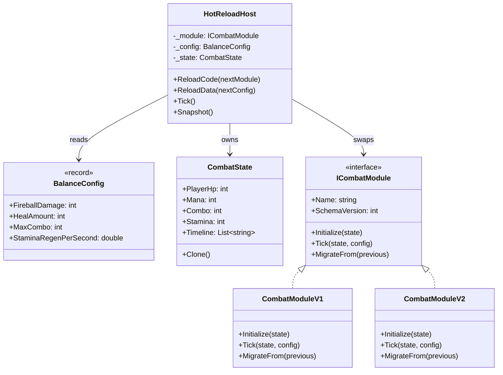
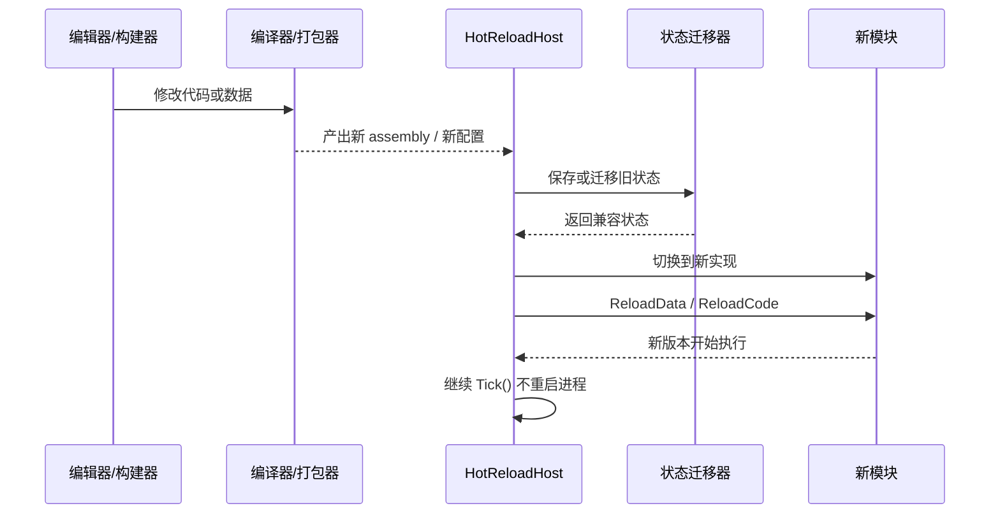

---
date: "2026-04-18"
title: "设计模式教科书｜Hot Reload：代码和数据如何不停机迭代"
description: "Hot Reload 解决的不是‘编辑器里改完立刻看到’这么窄的体验问题，而是如何在不重启进程的前提下替换代码、迁移状态、控制 ABI 风险，并把域重载、脚本虚拟机、AOT/IL 方案放进同一条工程链。"
slug: "patterns-45-hot-reload"
weight: 945
tags:
  - 设计模式
  - Hot Reload
  - 软件工程
  - 引擎架构
series: "设计模式教科书"
---

> 一句话定义：Hot Reload 是把“代码、数据或脚本实现”换成新版本，同时尽量保住进程内状态、对象引用和迭代速度的工程模式。

## 历史背景

Hot Reload 的历史比“热更新”这个中文词要长得多。软件开发一开始就有“fix and continue”的愿望：改一小处逻辑，不想等完整重启；改一个数字，不想重新走一遍初始化。早期桌面开发和服务器开发都在追这个目标，只是做法不同。桌面 IDE 倾向于断点续跑和调试器补丁，服务器倾向于进程内替换配置，游戏引擎则把问题进一步放大成“渲染、脚本、资源、物理、UI 都在一个长寿命进程里跑”。

当进程足够复杂，Hot Reload 就不再只是“省时间”。它变成了一个边界问题：哪些东西能原地换，哪些东西必须重建，哪些状态要迁移，哪些必须丢掉。因为一旦你把“重启”当默认方案，迭代速度就会被整个系统的启动成本拖慢；一旦你把“什么都不重启”当目标，稳定性又会被对象布局、原生句柄和静态状态拖垮。

现代引擎把这条线拆成了几种典型形态。Unity 通过域重载、场景重载和可配置的进入 Play Mode 来控制重置成本；Unreal 用 Live Coding 和 Object Reinstancing 处理 C++ 代码补丁；Godot 把 Script 当成 Resource，允许脚本重新加载；JVM 通过 instrumentation 做类重定义；而 HybridCLR / ILRuntime 这类 Unity 热更方案，则把 AOT 与解释执行或混合执行拼起来，绕开平台对 JIT 的限制。

## 一、先看问题

看起来最稳的做法，通常也是最慢的做法：改代码、重启、重进关卡、重新连服务器、重新加载资源、重新初始化缓存。这个流程没有错，但它把每次试错都变成了一次“全链路重建”。在小项目里还能忍，在引擎、编辑器、调试器和在线内容里就会变成固定成本。

最常见的坏味道，是把所有状态都塞进静态单例里，然后希望修改代码后“一切自动恢复”。

```csharp
using System;
using System.Collections.Generic;

public static class BadGlobalState
{
    public static int ComboCount;
    public static readonly List<string> RecentEvents = new();
    public static Dictionary<string, int> CachedDamageBySkill = new();

    public static void RecordHit(string skillId, int damage)
    {
        ComboCount++;
        RecentEvents.Add($"{skillId}:{damage}");
        CachedDamageBySkill[skillId] = damage;
    }

    public static int GetDamage(string skillId)
        => CachedDamageBySkill.TryGetValue(skillId, out var damage) ? damage : 0;
}
```

这类代码的问题不在于“静态字段不能用”，而在于它把三种生命周期混在了一起：

- **进程生命周期**：应用什么时候启动、什么时候退出。
- **编辑器生命周期**：脚本什么时候重编译、什么时候重新装载。
- **业务生命周期**：一次战斗、一局关卡、一轮调试、一个会话什么时候开始和结束。

一旦代码改动触发重载，静态字段、事件订阅、缓存、对象引用都会面临“该保留还是该重置”的问题。没有边界的状态，重载时就会变成历史包袱。

另一种坏味道更隐蔽：把代码和数据绑死在对象布局里，结果热更只能靠重启。

```csharp
public sealed class BadSkillRule
{
    public int BaseDamage { get; }
    public float CritMultiplier { get; }

    public BadSkillRule(int baseDamage, float critMultiplier)
    {
        BaseDamage = baseDamage;
        CritMultiplier = critMultiplier;
    }

    public int ComputeDamage(bool crit)
        => crit ? (int)(BaseDamage * CritMultiplier) : BaseDamage;
}
```

如果策划只想改 `CritMultiplier`，却必须重新编译、重新装配、重新验证整个类，那你得到的不是“简单”，而是“数据被代码绑架”。

Hot Reload 想解决的正是这个问题：**让能热更的那部分尽量小，让必须重建的那部分尽量清楚。**

## 二、模式的解法

Hot Reload 不是一个单点技术，而是一组边界管理策略。

它通常包含四个角色：

1. **可替换单元**：脚本、模块、规则集、数据集、材质变体。
2. **稳定宿主**：保留窗口、世界状态、调试器、资源管理器或游戏会话。
3. **迁移器**：把旧状态转成新状态，或者告诉宿主哪些状态必须丢弃。
4. **回退机制**：如果新版本不安全，就回到旧版本或重启。

下面是一个纯 C# 的可运行示例。它模拟的是“游戏战斗规则热更”：同一份会话状态可以从 V1 迁移到 V2，宿主则负责切换规则模块、保留业务状态、重建必要缓存。

```csharp
using System;
using System.Collections.Generic;

public sealed record BalanceConfig(int FireballDamage, int HealAmount, int MaxCombo, double StaminaRegenPerSecond);

public sealed class CombatState
{
    public int PlayerHp { get; set; }
    public int Mana { get; set; }
    public int Combo { get; set; }
    public int Stamina { get; set; }
    public List<string> Timeline { get; } = new();

    public CombatState Clone()
    {
        return new CombatState
        {
            PlayerHp = PlayerHp,
            Mana = Mana,
            Combo = Combo,
            Stamina = Stamina,
        };
    }
}

public interface ICombatModule
{
    string Name { get; }
    int SchemaVersion { get; }
    void Initialize(CombatState state);
    void Tick(CombatState state, BalanceConfig config);
    CombatState MigrateFrom(CombatState previous);
}

public sealed class CombatModuleV1 : ICombatModule
{
    public string Name => "CombatModuleV1";
    public int SchemaVersion => 1;

    public void Initialize(CombatState state)
    {
        state.PlayerHp = 100;
        state.Mana = 30;
        state.Combo = 0;
        state.Stamina = 100;
        state.Timeline.Add("V1 initialized");
    }

    public void Tick(CombatState state, BalanceConfig config)
    {
        state.Combo = Math.Min(config.MaxCombo, state.Combo + 1);
        state.Mana = Math.Max(0, state.Mana - 3);
        state.PlayerHp = Math.Max(0, state.PlayerHp - config.FireballDamage / 2);
        state.Timeline.Add($"V1 tick: combo={state.Combo}, mana={state.Mana}");
    }

    public CombatState MigrateFrom(CombatState previous)
    {
        return previous.Clone();
    }
}

public sealed class CombatModuleV2 : ICombatModule
{
    public string Name => "CombatModuleV2";
    public int SchemaVersion => 2;

    public void Initialize(CombatState state)
    {
        state.PlayerHp = 120;
        state.Mana = 40;
        state.Combo = 0;
        state.Stamina = 120;
        state.Timeline.Add("V2 initialized");
    }

    public void Tick(CombatState state, BalanceConfig config)
    {
        state.Combo = Math.Min(config.MaxCombo, state.Combo + 2);
        state.Mana = Math.Max(0, state.Mana - 4);
        state.Stamina = Math.Min(120, state.Stamina + (int)Math.Ceiling(config.StaminaRegenPerSecond));
        if (state.Combo >= 3)
        {
            state.PlayerHp = Math.Max(0, state.PlayerHp - config.FireballDamage);
            state.Timeline.Add("V2 burst damage applied");
        }
        state.Timeline.Add($"V2 tick: combo={state.Combo}, mana={state.Mana}, stamina={state.Stamina}");
    }

    public CombatState MigrateFrom(CombatState previous)
    {
        var next = previous.Clone();
        next.Stamina = Math.Clamp(previous.Stamina, 0, 120);
        next.Timeline.Add("Migrated to V2");
        return next;
    }
}

public sealed class HotReloadHost
{
    private ICombatModule _module;
    private BalanceConfig _config;
    private CombatState _state;

    public HotReloadHost(ICombatModule initialModule, BalanceConfig initialConfig)
    {
        _module = initialModule ?? throw new ArgumentNullException(nameof(initialModule));
        _config = initialConfig ?? throw new ArgumentNullException(nameof(initialConfig));
        _state = new CombatState();
        _module.Initialize(_state);
    }

    public void ReloadCode(ICombatModule nextModule)
    {
        if (nextModule is null) throw new ArgumentNullException(nameof(nextModule));
        _state = nextModule.MigrateFrom(_state);
        _module = nextModule;
    }

    public void ReloadData(BalanceConfig nextConfig)
    {
        _config = nextConfig ?? throw new ArgumentNullException(nameof(nextConfig));
    }

    public void Tick() => _module.Tick(_state, _config);

    public string Snapshot()
        => $"{_module.Name} v{_module.SchemaVersion}: HP={_state.PlayerHp}, Mana={_state.Mana}, Combo={_state.Combo}, Stamina={_state.Stamina}";

    public IEnumerable<string> Timeline => _state.Timeline;
}

public static class Demo
{
    public static void Main()
    {
        var host = new HotReloadHost(
            new CombatModuleV1(),
            new BalanceConfig(FireballDamage: 12, HealAmount: 8, MaxCombo: 6, StaminaRegenPerSecond: 3.0));

        host.Tick();
        host.Tick();
        Console.WriteLine(host.Snapshot());

        host.ReloadData(new BalanceConfig(FireballDamage: 18, HealAmount: 10, MaxCombo: 8, StaminaRegenPerSecond: 4.0));
        host.ReloadCode(new CombatModuleV2());

        host.Tick();
        host.Tick();
        Console.WriteLine(host.Snapshot());

        foreach (var line in host.Timeline)
            Console.WriteLine(line);
    }
}
```

这段代码刻意做了两层热更。

一层是**数据热更**：`BalanceConfig` 可以直接替换，不需要改模块逻辑。

另一层是**代码热更**：`CombatModuleV1` 可以换成 `CombatModuleV2`，但换之前必须迁移状态。

这就是 Hot Reload 的本体：**不是“换代码”，而是“换实现的同时保住会话的连续性”。**

## 三、结构图



这个图里，宿主和模块之间的关系很重要：宿主负责状态连续性，模块负责行为定义。只有把这两层分开，热更才不会把整个进程拖垮。

## 四、时序图



这张图对应的其实是一个原则：**热更阶段要尽量短，迁移阶段要尽量显式。**

## 五、变体与兄弟模式

Hot Reload 常见有四种变体。

- **代码热更**：替换函数体、类实现、脚本逻辑。
- **数据热更**：替换数值表、配置文件、资源引用。
- **对象重实例化**：保留部分对象身份，重建字段或代理。
- **进程级热补丁**：替换原生二进制或局部 DLL，而不是重新发布整个包。

它容易和下面几种模式混淆：

- **Bytecode**：Bytecode 负责“怎么执行脚本”，Hot Reload 负责“如何在运行中替换脚本实现并保留状态”。前者是执行格式，后者是切换策略。
- **Plugin Architecture**：Plugin 关注“如何装载扩展点”，Hot Reload 关注“如何在线换掉当前实现并保住现场”。
- **Strategy**：Strategy 是运行时替换算法对象；Hot Reload 替换的是代码版本或模块版本，范围更大，风险也更高。

一句话区分：

- Strategy 是“换一个算法对象”。
- Plugin 是“接入一个扩展模块”。
- Hot Reload 是“换掉正在运行的实现，同时把场面收住”。

## 六、对比其他模式

| 对比项 | Hot Reload | Plugin Architecture | Strategy | Bytecode |
|---|---|---|---|---|
| 关注点 | 在线替换实现与状态连续性 | 扩展点与模块装载 | 可替换算法 | 稳定执行格式 |
| 变化范围 | 代码、数据、对象、状态 | 模块、能力、注册点 | 算法行为 | 指令流、解释器 |
| 主要风险 | ABI、状态迁移、旧引用 | 依赖发现、版本兼容 | 策略数量膨胀 | opcode 膨胀、调试困难 |
| 典型产物 | Live Coding、域重载、热更新 | 插件、包、扩展点 | 策略对象 | 脚本 VM、规则引擎 |
| 何时更合适 | 迭代极快、重启成本高 | 能力可插拔、边界清晰 | 只需要换算法 | 脚本要可嵌入可移植 |

再补一张更直接的对比：

| 对比项 | Hot Reload | 重新启动 |
|---|---|---|
| 迭代速度 | 快 | 慢 |
| 状态连续性 | 需要设计 | 天然清空 |
| 调试效率 | 高，但复杂 | 低，但简单 |
| 复杂度 | 高 | 低 |
| 适合场景 | 编辑器、在线工具、脚本宿主 | 小工具、一次性任务 |

Hot Reload 的本质不是“比重启更高级”，而是**把重启成本变成工程可控的迁移成本**。

## 七、批判性讨论

Hot Reload 很容易被神化。

第一种误解是“既然能热更，那就不需要状态设计了”。恰好相反。Hot Reload 只有在状态边界清楚时才好用。你越是把所有字段堆在一个全局对象里，重载时就越难迁移。真正能长期活下来的系统，往往先做状态分层，再谈热更。

第二种误解是“代码能热更，就说明 ABI 没问题”。这在原生环境里尤其危险。C++ 的类布局、虚表、析构顺序、对象重实例化都可能让旧指针失效；CLR 也不是无限制地允许你改所有结构。能补丁，不代表能随便改结构。能 patch method body，不代表能安全改字段布局。

第三种误解是“热更总比重启好”。不对。某些问题的最优解就是重启：大规模结构改动、核心单例污染、内存碎片失控、调试环境漂移，这些场景里强行热更只会把错误拖长。热更的价值是**缩短无关成本**，不是替你消灭所有重建成本。

第四种误解是“只要是热更新框架，就能覆盖所有平台”。也不对。平台对 JIT、动态程序集、代码签名和执行内存都有不同限制。AOT 平台、主机平台、沙盒平台经常需要 interpreter、native patch、managed patch 的混合方案。HybridCLR 和 ILRuntime 之所以存在，就是因为“JIT 一把梭”在很多平台上根本行不通。

所以 Hot Reload 的核心判断不是“能不能重载”，而是“**哪些东西可以重载，哪些东西必须迁移，哪些东西应该直接重启**”。

## 八、跨学科视角

Hot Reload 和数据库迁移几乎是同构问题。

数据库升级时，你也不能假设线上所有记录都会跟着新 schema 自然变好。你要做的是：先兼容旧结构，再补迁移，再收敛到新结构。Hot Reload 也是一样：先让旧状态活着，再迁移，再切换实现。区别只是数据库管的是行，热更管的是对象和代码。

它也像操作系统的动态链接和进程热补丁。链接器、装载器、符号表、重定位，这些词放在一起时，你就会明白为什么 Hot Reload 很少只是“改个函数”。它本质上是在重新安排运行时里的引用关系。

从编译器角度看，Hot Reload 和增量编译是一对兄弟。一个改源码，一个改执行中的程序；一个关注依赖图的重算，一个关注状态图的连续性。它们都要求你明确依赖边界。

## 九、真实案例

- **Unity**：Configurable Enter Play Mode 会在进入 Play Mode 时决定是否执行 Domain Reload 和 Scene Reload。相关文档：`https://docs.unity3d.com/ja/current/Manual/domain-reloading.html`、`https://docs.unity3d.com/ru/2020.2/Manual/ConfigurableEnterPlayModeDetails.html`、`https://docs.unity3d.com/kr/2023.1/ScriptReference/EnterPlayModeOptions.html`
- **Unreal Engine**：Live Coding 官方文档说明它会在编辑器运行时重编译并 patch 二进制，Object Reinstancing 能替换对象实例。相关文档：`https://dev.epicgames.com/documentation/en-us/unreal-engine/using-live-coding-to-recompile-unreal-engine-applications-at-runtime?application_version=5.6`、`https://dev.epicgames.com/documentation/en-us/unreal-engine/API/Editor/Kismet/FBlueprintNamespaceRegistry/OnReloadComplete`
- **Godot**：`Script.reload(keep_state)` 允许脚本类实现重新加载；`Script` 是一种 Resource，`Object.set_script` 可以把脚本重新挂到对象上。相关文档：`https://docs.godotengine.org/en/stable/classes/class_script.html`、`https://docs.godotengine.org/en/4.5/classes/class_node.html`
- **JVM**：`java.lang.instrument` 提供 class redefinition 服务，`Instrumentation.redefineClasses(ClassDefinition...)` 允许用新 class file bytes 替换已加载类。相关文档：`https://docs.oracle.com/en/java/javase/25/docs/api/java.instrument/java/lang/instrument/Instrumentation.html`、`https://docs.oracle.com/en/java/javase/25/docs/api/java.instrument/java/lang/instrument/ClassDefinition.html`
- **HybridCLR**：README 说明它把 IL2CPP 扩成 AOT + Interpreter 的混合 runtime，并支持动态加载 assembly。相关仓库与文档：`https://github.com/focus-creative-games/hybridclr`、`https://github.com/focus-creative-games/hybridclr_unity`、`https://github.com/focus-creative-games/hybridclr_trial`、`https://github.com/focus-creative-games/hybridclr/blob/main/README.md`
- **ILRuntime**：官方文档给出其纯 C# IL 解释运行、寄存器模式、跨域继承与原理说明。相关页面：`https://ourpalm.github.io/ILRuntime/public/v1/guide/index.html`、`https://ourpalm.github.io/ILRuntime/public/v1/guide/tutorial.html`、`https://ourpalm.github.io/ILRuntime/public/v1/guide/principle.html`、`https://ourpalm.github.io/ILRuntime/public/v1/guide/register-vm.html`、`https://ourpalm.github.io/ILRuntime/public/v1/guide/cross-domain.html`

这些案例的共同点很明确：**热更不是“替换文件”这么简单，而是要把状态、边界和兼容策略一起设计进去。**

## 十、常见坑

1. **把静态状态当成无成本缓存**

   为什么错：域重载、脚本重载或进程补丁后，静态字段最容易成为旧状态残留源。

   怎么改：把静态字段当作缓存而不是事实来源，给它们提供显式 reset / rebuild 入口。

2. **把对象布局和业务状态绑死**

   为什么错：字段新增、删除、改类型时，旧对象很难安全迁移。

   怎么改：把业务状态做成可序列化 snapshot，再提供版本化 migrator。

3. **忽略旧引用与回调**

   为什么错：事件订阅、委托、native 指针、缓存句柄在热更后最容易悬挂。

   怎么改：在重载完成时统一触发失效通知，必要时重建订阅表或句柄表。

4. **把 Hot Reload 当成部署方案**

   为什么错：热更可以缩短迭代，不等于可以无限度替代发布流程。

   怎么改：把热更当作开发和在线修复手段，生产发布仍然保留完整的验证与回滚链路。

5. **只测成功路径，不测回退路径**

   为什么错：热更最常见的问题不是“新代码跑不起来”，而是“新代码跑一半，旧状态回不去了”。

   怎么改：把失败回退、版本回滚、状态迁移失败都纳入测试。

## 十一、性能考量

Hot Reload 的性能不是“越快越好”，而是“把成本从不受控变成受控”。

Unity 文档明确说过，Domain Reload 会重置 scripting state、静态字段和注册处理器，复杂项目进入 Play Mode 的时间会随脚本和场景复杂度增加。换句话说，域重载的成本和你的静态根、事件根、场景规模成正比；关闭它能省掉这部分固定成本，但代价是你要自己写 reset 逻辑。

Unreal 的 Live Coding 文档也直接点出对象重实例化的边界：小改动比较安全，大改动如果没有 Object Reinstancing，往往会不稳定甚至崩溃。这个提醒很重要，因为它说明 Hot Reload 的性能收益，来自“补丁”而不是“完整重建”；但当补丁跨过对象布局边界时，性能和稳定性就会一起下降。

在 AOT / IL 方案里，性能通常再被拆成两层：

- **AOT 路径**负责稳定、低开销、接近原生性能的常驻逻辑。
- **解释/混合路径**负责动态加载、版本切换和热更逻辑。

HybridCLR 的 README 强调它是 AOT + Interpreter 混合 runtime；ILRuntime 的文档则说明了它的纯 C# 解释器、寄存器模式和跨域继承适配。这意味着性能设计必须分层：常驻热路径留给 AOT，变化路径留给解释器或热补丁。

如果你把成本粗略拆开，Hot Reload 的总开销通常来自三部分：

- 编译或打包新版本。
- 迁移旧状态。
- 失效和重建缓存、订阅与句柄。

它们都不是零成本，但只要你把“每次都重启整个进程”换成“只重建必要的局部”，迭代效率就会明显上去。

## 十二、何时用 / 何时不用

适合用 Hot Reload 的场景很像下面几类：

- 进程启动成本高，重启一次就要几十秒甚至更久。
- 业务状态连续性强，不能轻易丢。
- 需要高频迭代，比如游戏脚本、编辑器、在线配置、调试工具。
- 有成熟的版本化、回退和验证链路。

不适合用的场景也很清楚：

- 代码结构还在剧烈震荡，迁移器会比业务代码更难维护。
- 依赖大量原生对象、句柄或不可重建资源。
- 团队没有测试回滚和兼容路径的能力。
- 你的问题本质上就是“必须重新初始化”，那就直接重启，别硬热更。

一句话判断：**如果你能清楚回答“换什么、保什么、丢什么”，Hot Reload 值得做；如果不能，先别急着追热更。**

## 十三、相关模式

- [Bytecode](./patterns-38-bytecode.md)：脚本热更、解释执行和动态加载，经常把 Hot Reload 的执行层打通。
- [Plugin Architecture](./patterns-28-plugin-architecture.md)：插件系统决定扩展边界，Hot Reload 决定边界内的版本替换方式。
- [Strategy](./patterns-03-strategy.md)：只想换算法时，Strategy 比整套热更便宜得多。
- [Factory Method 与 Abstract Factory](./patterns-09-factory.md)：新模块、配置对象和替代实现通常都要靠工厂装配。
- [Prototype](./patterns-20-prototype.md)：状态迁移和原型复制常常是一体两面。
- [ECS 架构](./patterns-39-ecs-architecture.md)：当重载对象越来越多地变成数据和系统，ECS 会把这条线继续向下推。

## 十四、在实际工程里怎么用

在真实工程里，Hot Reload 常常落在四条链路上。

第一条是**脚本与逻辑热更**。Unity 生态里常见的是 Mono 域重载、ILRuntime、HybridCLR 这种路线；它们的共同目标都是让逻辑代码尽量不用完整发包。

第二条是**配置与数值热更**。怪物数值、技能参数、任务表、经济表、运营开关都应该优先走数据热更，而不是硬把这些值写进代码。

第三条是**编辑器与工具链热更**。渲染工具、关卡编辑器、内容平台、调试插件如果每次都要重启，效率会非常低。这里最重要的是保住窗口、缓存和上下文。

第四条是**渲染与资源管线热更**。后面如果系列继续写 `Render Pipeline`、`Render Pass / Render Feature`、`Command Buffer`，你会看到 Hot Reload 和这些系统天然相连：材质、Shader、Pass、Pipeline State 的重新编译与缓存更新，本质上也是“改实现、保连续性”的问题。

如果你要把它串进系列，最实用的链接方式是：

- 先看 [Bytecode](./patterns-38-bytecode.md)，理解脚本为什么更适合先编译成可执行中间表示。
- 再看 [Plugin Architecture](./patterns-28-plugin-architecture.md)，理解扩展点和装载边界如何设计。
- 再看 [Strategy](./patterns-03-strategy.md)，理解当你只需要替换算法时，别把问题扩大成整套热更。
- 当系统长到要管理实体与系统边界时，再看 [ECS 架构](./patterns-39-ecs-architecture.md)。
- 未来等渲染篇写出来后，再连到 [Render Pipeline](./patterns-41-render-pipeline.md) 和 [Render Pass / Render Feature](./patterns-42-render-pass-feature.md)。

这就是 Hot Reload 在工程里的位置：**它不是部署的替代品，而是把“本该重启才能看见的变化”压缩到可控边界里。**

## 小结

- Hot Reload 的核心不是“快”，而是“在不重启的前提下，把代码、数据和状态的边界重新划清”。
- 它一旦落到真实工程，就必须面对 ABI、状态迁移、对象重实例化和回退策略。
- 它最适合脚本、编辑器、内容管线和在线修复，不适合拿来掩盖结构失控。

一句话收束：**Hot Reload 的价值，不在于永远不停，而在于每次只重建必须重建的那一小块。**
