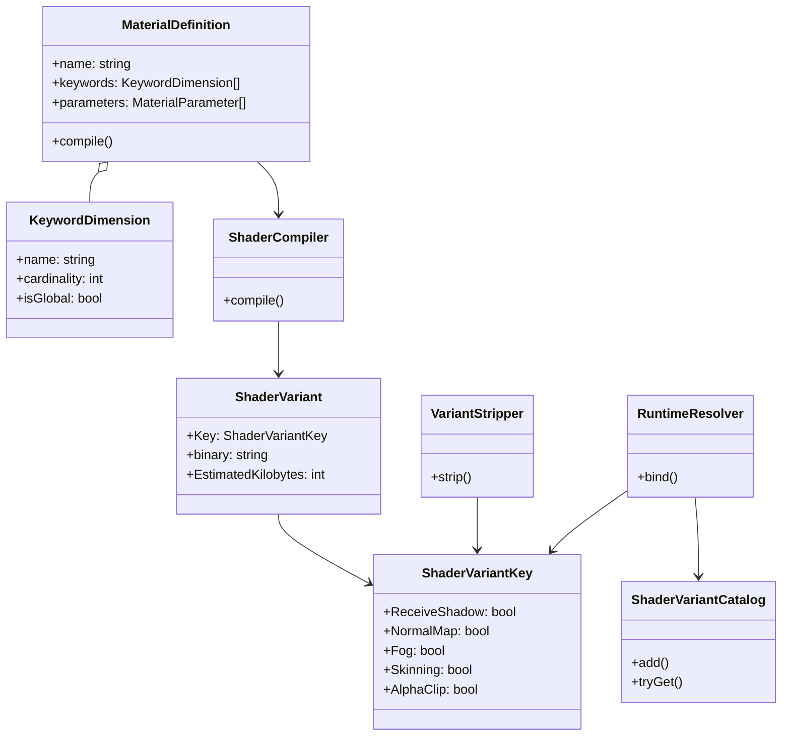
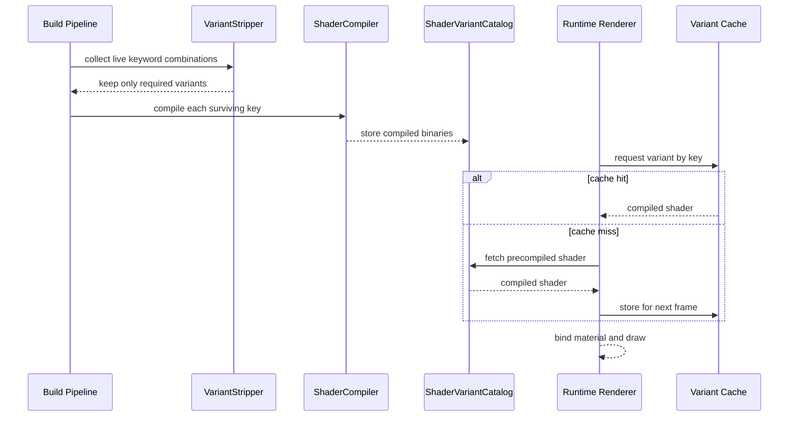

---
date: "2026-04-18"
title: "设计模式教科书｜Shader Variant：把渲染分支前置到编译期"
description: "Shader Variant 把有限的渲染条件拆成多个预编译版本，让运行时只负责选择，不再承担大分支和临时编译的代价。它处理的是性能、包体和构建复杂度之间的交换。"
slug: "patterns-46-shader-variant"
weight: 946
tags:
  - 设计模式
  - Shader
  - 软件工程
series: "设计模式教科书"
---

> 一句话定义：把原本会在运行时反复判断的渲染条件，提前展开成一组有限的专用版本，让系统在执行阶段只做选择，不做猜测。

## 历史背景

Shader Variant 不是先有“模式”再有引擎，而是先有 GPU 的约束，再有引擎对约束的工程化回答。早期可编程着色器刚进入主流时，硬件最怕两件事：大分支和频繁切换。前者会把同一批像素拖进不同路径，后者会把编译和装配成本推到运行时。于是引擎开始把“是否接收阴影、是否用法线贴图、是否启用皮肤动画、是否走某个平台路径”这些有限条件提前枚举出来，编译成多个版本，运行时按需选择。

这个思路在 2000 年代中后期逐渐成熟。Unity 用 keyword 和 variant 把材质差异从运行时条件拆到编译期；Unreal 用 permutation domain 和 `ShouldCompilePermutation` 把“该不该编译”变成显式决策；Filament 用 `matc` 把 material 定义编译成适配不同后端的包；bgfx 则把 shaderc 当成跨后端资产流水线的一部分。它们解决的不是同一个表面问题，但底层逻辑一致：把“有限且可枚举的差异”前置成编译资产，把“运行时要不要猜”这件事拿掉。

这也是 Shader Variant 和普通条件分支的分水岭。普通分支回答的是“这次执行走哪条路”；Variant 回答的是“先把哪几条路做出来”。前者偏解释，后者偏专门化。到了今天，现代 GPU、专门的材质编译器、平台级缓存和构建剔除策略，让这个选择更像一个编译器问题，而不只是图形 API 的用法。

## 一、先看问题

想象一个渲染团队在做通用材质系统。产品一开始只有三项开关：是否接收阴影、是否使用法线贴图、是否启用透明裁剪。后来又加了平台后缀、皮肤动画、雾效、环境反射、双面渲染。每加一个开关，代码里就多一层判断，材质编辑器里就多一个字段，构建管线里就多一批要确认的组合。

如果直接把所有判断塞进一个“大一统”着色器，问题会立刻变成三类。第一类是性能问题：GPU 的动态分支并不等于免费，尤其在像素着色阶段，分支不一致会让同一波前上的线程走不同路径。第二类是工程问题：代码能写出来，不代表组合能管住；今天能跑，明天就可能因为某个组合没测到而出错。第三类是资产问题：编译时间、包体、预热时间和运行时内存都跟着上涨，最后没人敢说“这个改动只是多了一个布尔值”。

下面这段坏代码模拟的是同一种思维：把所有差异都留到运行时再说。问题不是代码写得不对，而是它把“有限枚举”伪装成“无限灵活”。

```csharp
using System;

public readonly record struct SurfaceFlags(
    bool ReceiveShadow,
    bool NormalMap,
    bool Fog,
    bool Skinning,
    bool AlphaClip,
    bool ClearCoat);

public sealed class NaiveSurfaceShader
{
    public string Shade(SurfaceFlags flags)
    {
        var shader = "base";

        if (flags.ReceiveShadow)
            shader += " + shadow";

        if (flags.NormalMap)
            shader += " + normal";

        if (flags.Fog)
            shader += " + fog";

        if (flags.Skinning)
            shader += " + skinning";

        if (flags.AlphaClip)
            shader += " + alphaClip";

        if (flags.ClearCoat)
            shader += " + clearCoat";

        return shader;
    }
}

public static class Demo
{
    public static void Main()
    {
        var shader = new NaiveSurfaceShader();
        Console.WriteLine(shader.Shade(new SurfaceFlags(true, true, false, false, true, false)));
    }
}
```

这段代码能跑，但它暴露了三个更大的事实。第一，布尔位越多，组合数越快膨胀，`6` 个布尔位就是 `2^6 = 64` 个版本。第二，所有判断都挤在一个入口里，后面谁也不知道某个组合是不是被测过。第三，随着平台和质量档位继续加维度，代码会从“一个函数”退化成“一个非常难维护的决策树”。

Shader Variant 要解决的正是这类问题：把可枚举差异从运行时条件变成编译期版本，然后再把不可枚举差异留在参数和数据里。

## 二、模式的解法

这个模式的关键不是“多写几份着色器”，而是把差异分层。底层是固定的材质模型，上面是有限的 keyword 维度，再上面是由这些维度组成的 variant key。编译阶段负责展开组合，剔除阶段负责砍掉从未出现过的组合，运行阶段只做查表和绑定。

换句话说，Shader Variant 是一套专门化管线，而不是单个技巧。它要求你先回答三个问题：哪些差异真的影响代码路径，哪些只是参数值，哪些组合永远不会出现。只要这三个问题没答清楚，variant 就会从优化工具变成包袱。

下面的 C# 示例模拟了一个简化的材质编译流程。它不依赖任何引擎，但保留了模式本身最重要的结构：关键词维度、变体键、剔除策略、编译缓存和运行时查表。

```csharp
using System;
using System.Collections.Generic;
using System.Linq;

public readonly record struct ShaderVariantKey(
    bool ReceiveShadow,
    bool NormalMap,
    bool Fog,
    bool Skinning,
    bool AlphaClip)
{
    public override string ToString()
        => $"shadow={ReceiveShadow},normal={NormalMap},fog={Fog},skin={Skinning},alpha={AlphaClip}";
}

public sealed record CompiledShader(ShaderVariantKey Key, string Binary, int EstimatedKilobytes);

public sealed class ShaderVariantCatalog
{
    private readonly Dictionary<ShaderVariantKey, CompiledShader> _variants = new();

    public void Add(CompiledShader shader) => _variants[shader.Key] = shader;

    public bool TryGet(ShaderVariantKey key, out CompiledShader? shader)
        => _variants.TryGetValue(key, out shader);

    public IReadOnlyCollection<CompiledShader> All() => _variants.Values.ToArray();
}

public sealed class ShaderUsageDatabase
{
    private readonly HashSet<ShaderVariantKey> _liveKeys = new();

    public void Register(ShaderVariantKey key) => _liveKeys.Add(key);

    public bool IsLive(ShaderVariantKey key) => _liveKeys.Contains(key);

    public IEnumerable<ShaderVariantKey> LiveKeys => _liveKeys;
}

public sealed class ShaderVariantStripper
{
    public IEnumerable<ShaderVariantKey> Strip(IEnumerable<ShaderVariantKey> all, ShaderUsageDatabase usage)
    {
        foreach (var key in all)
        {
            if (usage.IsLive(key))
                yield return key;
        }
    }
}

public sealed class ShaderCompiler
{
    public CompiledShader Compile(ShaderVariantKey key)
    {
        var complexity = 16;
        if (key.ReceiveShadow) complexity += 3;
        if (key.NormalMap) complexity += 4;
        if (key.Fog) complexity += 2;
        if (key.Skinning) complexity += 5;
        if (key.AlphaClip) complexity += 2;

        var binary = $"shader[{key}]";
        return new CompiledShader(key, binary, complexity);
    }
}

public sealed class ShaderVariantRuntime
{
    private readonly ShaderVariantCatalog _catalog;

    public ShaderVariantRuntime(ShaderVariantCatalog catalog) => _catalog = catalog;

    public CompiledShader Bind(ShaderVariantKey key)
    {
        if (_catalog.TryGet(key, out var shader) && shader is not null)
            return shader;

        var fallback = _catalog.All().OrderBy(s => Math.Abs(s.EstimatedKilobytes - 16)).FirstOrDefault();
        return fallback ?? throw new InvalidOperationException($"Missing shader variant: {key}");
    }
}

public static class ShaderVariantDemo
{
    public static void Main()
    {
        var all = EnumerateAll();
        var usage = new ShaderUsageDatabase();
        usage.Register(new ShaderVariantKey(true, true, false, false, false));
        usage.Register(new ShaderVariantKey(true, true, false, false, true));
        usage.Register(new ShaderVariantKey(false, false, false, false, false));

        var stripper = new ShaderVariantStripper();
        var compiler = new ShaderCompiler();
        var catalog = new ShaderVariantCatalog();

        foreach (var key in stripper.Strip(all, usage))
            catalog.Add(compiler.Compile(key));

        var runtime = new ShaderVariantRuntime(catalog);
        var selected = runtime.Bind(new ShaderVariantKey(true, true, false, false, true));

        Console.WriteLine($"compiled={catalog.All().Count}, selected={selected.Binary}, size={selected.EstimatedKilobytes}KB");
    }

    private static IEnumerable<ShaderVariantKey> EnumerateAll()
    {
        foreach (var shadow in new[] { false, true })
        foreach (var normal in new[] { false, true })
        foreach (var fog in new[] { false, true })
        foreach (var skin in new[] { false, true })
        foreach (var alpha in new[] { false, true })
            yield return new ShaderVariantKey(shadow, normal, fog, skin, alpha);
    }
}
```

这段代码的核心价值在于它把“组合”明确化了。编译器不再面对一个无穷大的状态空间，而是面对一个可遍历、可剔除、可缓存的集合。运行时不再猜“这次该走哪条路”，而是基于一个稳定的键去找已经准备好的版本。工程上的差别就在这里：一个系统如果能把问题压缩成有限键空间，它就能被构建、测试和缓存。

## 三、结构图



这个结构图想表达的是：Variant 不是单点优化，而是贯穿资产、编译和运行的链条。`MaterialDefinition` 决定可以有哪些维度，`VariantStripper` 决定保留哪些组合，`ShaderCompiler` 决定如何生成专用版本，`RuntimeResolver` 决定如何按键绑定。只要其中一环失控，变体系统就会从“压缩差异”退化成“放大复杂度”。

## 四、时序图



这条时序线把构建和运行分开了。构建期负责把组合空间压缩成资产，运行期负责把资产变成稳定选择。真正高质量的引擎，不会让运行时去承担“枚举所有可能性”的责任，它只会让运行时承担“按规则选对版本”的责任。

## 五、变体与兄弟模式

Shader Variant 里常见的变体不是“写法不同”，而是“维度不同”。最常见的是二元 keyword，例如有无阴影、有无法线贴图；更复杂一点会出现枚举型维度，例如光照模型是 `lit`、`unlit` 还是 `clear coat`；再往上会遇到平台维度，例如桌面端和移动端走不同后端。只要维度能被有限枚举，就适合进入 variant 空间。

它的兄弟模式里，最容易混淆的是 Strategy、Bytecode 和 Plugin Architecture。Strategy 解决的是“同一时刻换算法”，Bytecode 解决的是“把行为压成指令流”，Plugin Architecture 解决的是“运行时扩展能力边界”。Shader Variant 看起来也像在“换行为”，但它更像编译器做的 specialization：不是换对象，也不是装插件，而是把同一个渲染意图提前拆成多个专用实现。

另一个常见误区是把 Variant 误读成“每个开关都该有一个独立着色器文件”。不对。Variant 的价值不在文件数，而在组合空间被统一管理。你可以只有一个材质定义文件，却在背后生成几十个版本；也可以有多份源码，却共享同一组维度和剔除策略。模式关注的是“版本管理规则”，不是“源码长什么样”。

## 六、对比其他模式

| 对比项 | Shader Variant | Strategy | Bytecode | Plugin Architecture |
|---|---|---|---|---|
| 核心目的 | 把有限渲染差异前置到编译期 | 运行时替换算法 | 用紧凑指令流表达行为 | 运行时扩展系统能力 |
| 选择时机 | 构建时或加载前 | 运行时 | 运行时解释 | 运行时装载 |
| 适合的差异 | 有限、可枚举、影响性能 | 变化频繁、逻辑独立 | 结构化控制流 | 边界清晰的功能包 |
| 代价 | 组合爆炸、包体增长 | 分发和间接调用成本 | 解释器开销 | 依赖管理和兼容性 |
| 典型错用 | 把所有开关都做成 keyword | 把渲染专用 specialization 误当策略 | 把高频热路径都放进解释器 | 把微小差异做成插件 |

Shader Variant 和 Strategy 最像，也最容易混。两者都在处理“同一问题有多种实现”，但 Strategy 假定运行时决策是常态，Shader Variant 假定差异是有限且稳定的。前者强调可替换，后者强调可预编译。用错方向，系统就会在灵活性和性能之间摇摆。

Shader Variant 和 Bytecode 也常被放在一起讨论。Bytecode 像是把行为变成可解释的中间表示，Shader Variant 像是把行为变成已经专门化的成品。一个把选择交给解释器，一个把选择交给查表。你想要的是动态性还是确定性，答案会直接决定你该选哪一个。

## 七、批判性讨论

Shader Variant 的批评很多，而且这些批评都合理。最常见的一条是：它会制造组合爆炸。这个批评不是理论风险，而是实打实的生产事故来源。`5` 个二元维度只有 `32` 个版本，`10` 个二元维度就是 `1024` 个版本。你一旦再加一个三元维度，组合数马上变成 `3 * 2^10 = 3072`。如果每个变体平均占 `18KB`，光数据就接近 `54MB`。这还是没算编译时间、热身时间和索引表。

第二条批评是：它会把内容团队绑到代码团队的决策上。关键词系统一旦散落在多个材质、多个脚本、多个平台配置里，谁都能加一个维度，最后谁都说不清一个变体为什么存在。这个问题在大团队里尤其明显，因为“能编译”不等于“该保留”。如果没有严格的剔除规则，variant 数会自己长大。

第三条批评是：并不是所有分支都值得静态化。现代 GPU 对某些分支已经比过去更宽容，尤其当分支条件在同一批次里高度一致时，动态分支未必比多版本更差。也就是说，Shader Variant 并不是“越多越好”，它只是“把最贵的差异提前处理”。如果某个开关只影响一个很小的数值计算，做成 variant 很可能是在浪费构建预算。

还有一个更现实的边界：热修和在线内容迭代。Variant 越重，越依赖完整构建链条；一旦你想在不停机环境里小步试错，就会发现 shader 变体更像离线资产，而不是灵活动态模块。这也是为什么很多团队最后会把它和 `Hot Reload`、材质预览、局部编译结合起来，而不是把它当成独立答案。

## 八、跨学科视角

Shader Variant 最接近的跨学科概念，不是“图形学技巧”，而是编译器里的 partial evaluation 和 specialization。如果一个条件在构建时就已知，把它留到运行时判断就等于故意放弃优化机会；如果一个条件会在大量实例中重复出现，把它前置成特化版本，编译器就能做死代码消除、常量折叠和路径裁剪。Shader Variant 本质上就是把这套思想落到 GPU 代码和材质资产上。

这也是为什么材质编译器像 Filament 的 `matc` 会显得像一个小型编译器前端。它不只是“把文本变成二进制”，而是在做语义约束、维度筛选和后端适配。你把这个过程放到更大的软件工程里看，会发现它和数据库的查询计划生成很像：都在已知约束下把“运行时决策”变成“编译期选择”。区别只是，一个输出的是执行计划，另一个输出的是着色器版本。

## 九、真实案例

Unity 把 shader variants、keywords、stripping 和预热放在一条完整链路里讲清楚了。可直接参考这些官方页面：`https://docs.unity3d.com/cn/2023.1/Manual/shader-variants.html`、`https://docs.unity3d.com/cn/2022.3/Manual/shader-keywords.html`、`https://docs.unity3d.com/cn/2021.3/Manual/shader-variant-stripping.html`、`https://docs.unity3d.com/es/530/ScriptReference/ShaderVariantCollection.html`。这里最有价值的不是某个 API，而是 Unity 把“变体增长、剔除、预热”全部当成一条流水线问题来处理。

Unreal 把 permutation 当成引擎级概念，而不是脚本层小技巧。可直接看这些 API 页面：`https://dev.epicgames.com/documentation/en-us/unreal-engine/API/Runtime/RenderCore/FShaderType/ShouldCompilePermutation`、`https://dev.epicgames.com/documentation/en-us/unreal-engine/API/Runtime/RenderCore/TShaderPermutationDomain/PermutationCount`、`https://dev.epicgames.com/documentation/en-us/unreal-engine/API/Runtime/RenderCore/FShaderPermutationBool/PermutationCount`。它们给出的信号很明确：能不能编译，先由 permutation domain 说了算；组合数多少，也要先算出来再决定要不要保留。

Filament 把材质系统写成了一个清晰的编译型资产管线。材料文档在 `https://google.github.io/filament/main/materials.html`，仓库结构在 `https://github.com/google/filament`，相关工具路径可以直接看 `tools/matc` 和 `libs/filamat`。它最能说明的一点是：shader variant 不一定只服务图形 API 差异，也可以服务材质模型与后端能力差异。

bgfx 则给了一个更偏工具链的视角。仓库在 `https://github.com/bkaradzic/bgfx`，shader 工具路径可看 `bgfx/tools/shaderc/shaderc.cpp`，着色器脚本入口可看 `bgfx/src/bgfx_shader.sh`。它提醒我们：shader variant 最终不是某个语言的特权，而是跨平台渲染资产管理的一部分。

## 十、常见坑

第一个坑是把每个 if 都变成 keyword。这样做看上去很工程化，实际上是在把问题从代码复杂度搬到组合复杂度。只有那些会改变代码路径、会显著影响性能、且能被有限枚举的差异，才值得进入 variant 空间。把数值调节、颜色参数、强度曲线也做成 keyword，纯属自找麻烦。

第二个坑是没有剔除策略。很多项目前期都能接受“先把所有组合编出来再说”，等到材质数量和平台数量上来，构建时间和包体就会一起失控。更糟的是，没人知道哪个组合真的被用到了。`shader_feature`、平台过滤、材质统计和预热清单，本质上是在把“可能存在”改写成“确实存在”。

第三个坑是把运行时开关当成编辑器开关。前者是给玩家和环境做决策，后者是给内容制作做筛选。两者的语义不同，生命周期也不同。如果你把编辑器预览开关直接当运行时 keyword，用不了多久就会遇到“编辑器里没问题，打包后缺 variant”的事故。

第四个坑是 keyword 命名失控。全局 keyword 名字一旦没有前缀和约束，多个包、多个团队、多个管线会互相踩踏。最后你看到的不是“材质系统很复杂”，而是“关键词空间已经被污染”。这类问题最难排查，因为它们通常不是编译错误，而是视觉缺陷。

## 十一、性能考量

Shader Variant 的性能账要分三本算。第一本是组合数。若每个维度都是二元开关，总组合数就是 `2^n`；若维度是多值，组合数就是各维度基数的乘积。第二本是编译成本。每一个 variant 都要经历解析、优化、后端生成和缓存写入。第三本是运行成本。运行时虽然不再猜分支，但要付出查表、绑定和预热的成本。

一个常见的估算方式是直接用组合数学看规模。`4` 个二元 keyword 只有 `16` 个版本，`8` 个二元 keyword 变成 `256` 个版本，`12` 个二元 keyword 则是 `4096` 个版本。如果单个变体平均占 `18KB`，那么 `256` 个版本约 `4.5MB`，`4096` 个版本约 `72MB`。这不是实测值，而是工程上用来判断要不要继续加维度的底线算法。

构建时剔除的意义就在这里。它不是为了让数字好看，而是为了把“理论空间”压回“真实使用空间”。Unity 的 shader variant stripping、`ShaderVariantCollection` warmup，Unreal 的 `ShouldCompilePermutation`，Filament `matc` 的 `variant-filter`，本质都在做一件事：不让你为从未出现过的组合付税。

## 十二、何时用 / 何时不用

适合用 Shader Variant 的场景有一个共同点：差异有限，且差异真的会改变执行路径。比如阴影接收、法线贴图、皮肤动画、透明裁剪、平台后端差异、是否启用某种光照模型。这些差异如果放到运行时分支里，代价很容易累积到 GPU 端，变体化反而更稳。

不适合用的场景也很明确。只影响一个很小的参数值时，不要做 variant；依赖外部数据且变化频繁时，不要做 variant；组合空间不可控、且团队没有剔除和预热能力时，也不要做 variant。换句话说，Shader Variant 适合有限、可枚举、能预算的问题，不适合开放、频繁、难预测的问题。

如果你在做原型，先用动态分支把效果做出来，再看热点路径再特化。这个顺序很重要。很多团队一开始就把所有差异静态化，结果连需求都没稳定，就已经在维护一套庞大的 keyword 矩阵。那不是架构成熟，那是把未来的技术债提前记账。

## 十三、相关模式

- [Bytecode](./patterns-38-bytecode.md)
  Shader Variant 和 Bytecode 都在做把行为结构化。区别在于，Bytecode 把行为压成可解释指令流，Variant 把行为压成已特化版本。
- [Plugin Architecture](./patterns-28-plugin-architecture.md)
  Plugin 解决的是如何扩展系统边界，Variant 解决的是如何在边界内展开有限组合。
- [Strategy](./patterns-03-strategy.md)
  Strategy 是运行时替换行为，Variant 是编译期专门化行为。
- [Render Pipeline](./patterns-41-render-pipeline.md)
  渲染管线决定变体从哪里生成、在哪一级被过滤。
- [Render Pass / Render Feature](./patterns-42-render-pass-feature.md)
  渲染通道和特性通常是 keyword 维度的来源。
- [Command Buffer](./patterns-43-command-buffer.md)
  命令缓冲负责提交顺序，Variant 负责提交前的专门化选择。

## 十四、在实际工程里怎么用

在游戏引擎里，Shader Variant 通常落在材质系统、渲染管线和平台构建这三层。材质系统定义有哪些可切换维度，渲染管线决定哪些维度在某个 pass 里有效，平台构建决定哪些组合能进入包体。真正成熟的流程不会把 variant 写成一堆散落的宏，而是把它收进一套可统计、可剔除、可预热的资产规则里。

把这个思路往外延伸，它还能帮助你理解脚本系统和 AI 系统里的预特化思想。脚本系统里，Bytecode 负责把动态行为压缩成可解释格式；Variant 负责把有限条件压缩成可选择格式。AI 行为里，行为树和状态机常常也会做类似的裁剪：把不会出现的分支从编译或配置阶段剪掉。配置驱动系统更是如此，平台档位、渲染质量档位、设备能力档位，最后都会收束成一个有限的版本矩阵。

如果后续文章继续写渲染系列，Shader Variant 会自然落到这些位置：

- [Render Pipeline](./patterns-41-render-pipeline.md)：决定变体生成的入口和范围。
- [Render Pass / Render Feature](./patterns-42-render-pass-feature.md)：决定哪些渲染功能是可切换维度。
- [Command Buffer](./patterns-43-command-buffer.md)：决定在提交 GPU 命令前如何固定最终路径。

这就是这个模式在工程里的真实用途：不是让你记住更多宏，而是让你把渲染差异管理成一套可治理的系统。

## 小结

Shader Variant 的第一价值，是把有限差异前置成稳定资产，减少运行时猜测。

Shader Variant 的第二价值，是把组合空间变成可统计、可剔除、可缓存的问题。

Shader Variant 的第三价值，是把渲染优化从零散 ifdef 提升成可治理的编译管线。

一句话收束：当差异能被枚举，别让运行时承担选择的全部代价。
