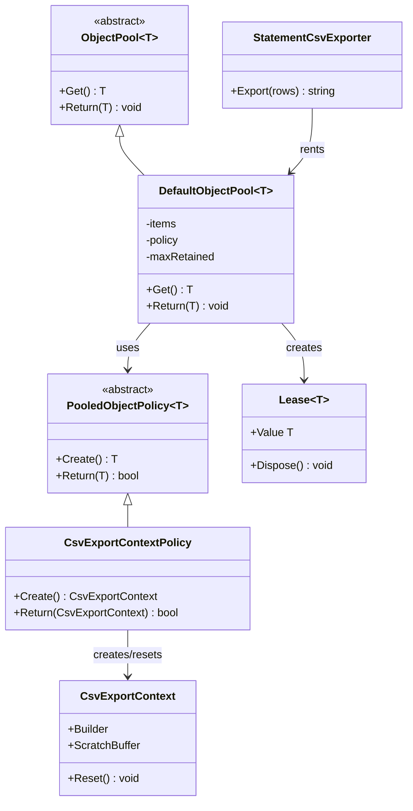
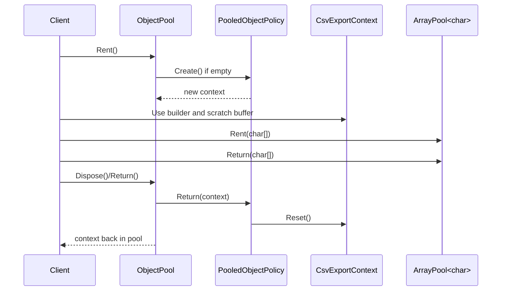

---
date: "2026-04-18"
title: "设计模式教科书｜Object Pool：对象池化通用原理"
description: "对象池不是缓存的同义词，而是一种用租用/归还协议控制短生命周期对象和大块缓冲区的办法。本文讲它如何降低 GC 压力、控制峰值、避免碎片，以及它为什么不是万灵药。"
slug: "patterns-47-object-pool"
weight: 947
tags:
  - "设计模式"
  - "Object Pool"
  - "软件工程"
series: "设计模式教科书"
---

> 一句话定义：Object Pool 通过“先借后还”的协议复用对象或缓冲区，把频繁创建和销毁的成本从运行时搬到可控的池边界上。

## 历史背景
对象池来自很朴素的工程压力：对象太多，分配太快，回收太频繁。早期网络服务器、图形引擎和消息处理系统都遇到过同一个问题：业务逻辑本身不一定复杂，麻烦的是每秒要创建成千上万次同一种短命对象。对象一多，GC、碎片、峰值和缓存失效就会一起上来。

连接池是这条思路最广为人知的前身。数据库连接创建贵、销毁贵、握手贵，所以先借后还；对象池只是把同一种协议搬到普通对象、数组、字符串构建器和工作项上。后来 .NET 的 `ArrayPool<T>`、ASP.NET Core 的 `ObjectPool<T>`、Netty 的 `Recycler`，都把这件事做成了通用基础设施。

但对象池的历史也提醒我们：它不是“更高级的 new”。它更像一笔借贷。你借走一个对象，就要负责把它恢复成可复用状态，再按约定还回去。只要状态恢复失败，池就会把旧状态一并借给下一次调用。

## 一、先看问题
先看一个常见坏写法：每次请求都创建新的临时对象和临时缓冲区。

```csharp
public sealed class ReportService
{
    public string BuildReport(IReadOnlyList<string> lines)
    {
        var builder = new StringBuilder();
        var scratch = new char[4096];

        foreach (var line in lines)
        {
            var upper = line.ToUpperInvariant();
            upper.AsSpan().CopyTo(scratch);
            builder.Append(scratch, 0, upper.Length);
            builder.AppendLine();
        }

        return builder.ToString();
    }
}
```

这段代码看上去很直接，问题却都在“频繁”两个字上。`StringBuilder` 会反复扩容，`char[]` 会反复分配，短命对象会反复进入 GC 代管。请求少的时候看不出问题，请求一多，分配速率就会把 GC 压力推高，抖动也会跟着上来。

更麻烦的是，大对象还会带来峰值和碎片。你也许不是一直都在处理 4 KB 或 64 KB 的缓冲区，但只要高峰来了，所有请求就会一起向堆要空间。低谷时这些对象又很快死掉，堆上留下的空洞不一定能马上重用。

如果这类对象每秒都要创建上千次，单次 `new` 虽然看起来便宜，累计起来却会变成持续的运行时税。

## 二、模式的解法
对象池的核心，不是“存一堆对象”，而是“定义一条借用协议”。协议里至少有三件事：如何创建、如何重置、如何归还。池不关心对象怎么被使用，只关心它什么时候能再次安全地被借出去。

通用对象池通常包含三个角色：

1. `ObjectPool<T>`：负责借出和回收。
2. `PooledObjectPolicy<T>`：负责创建和复位规则。
3. `Lease<T>`：把“借来就要还”变成 `using` 风格的约束。

下面是一个纯 C# 的可运行示例。它同时演示了对象池和数组池：`CsvExportContext` 通过对象池复用，内部的 `char[]` 则通过 `ArrayPool<char>` 复用。

```csharp
using System;
using System.Buffers;
using System.Collections.Generic;
using System.Text;

public abstract class PooledObjectPolicy<T> where T : class
{
    public abstract T Create();
    public abstract bool Return(T obj);
}

public sealed class DefaultObjectPool<T> where T : class
{
    private readonly Stack<T> _items = new();
    private readonly object _gate = new();
    private readonly PooledObjectPolicy<T> _policy;
    private readonly int _maxRetained;

    public DefaultObjectPool(PooledObjectPolicy<T> policy, int maxRetained = 32)
    {
        _policy = policy ?? throw new ArgumentNullException(nameof(policy));
        _maxRetained = Math.Max(0, maxRetained);
    }

    public T Get()
    {
        lock (_gate)
        {
            if (_items.Count > 0)
            {
                return _items.Pop();
            }
        }

        return _policy.Create();
    }

    public void Return(T item)
    {
        if (!_policy.Return(item))
        {
            return;
        }

        lock (_gate)
        {
            if (_items.Count < _maxRetained)
            {
                _items.Push(item);
            }
        }
    }

    public Lease<T> Rent() => new(this, Get());
}

public readonly struct Lease<T> : IDisposable where T : class
{
    private readonly DefaultObjectPool<T>? _pool;
    public T Value { get; }

    public Lease(DefaultObjectPool<T> pool, T value)
    {
        _pool = pool;
        Value = value;
    }

    public void Dispose() => _pool?.Return(Value);
}

public sealed class CsvExportContext
{
    public StringBuilder Builder { get; } = new();
    public char[]? ScratchBuffer { get; set; }

    public void Reset()
    {
        Builder.Clear();

        if (ScratchBuffer is not null)
        {
            ArrayPool<char>.Shared.Return(ScratchBuffer, clearArray: false);
            ScratchBuffer = null;
        }
    }
}

public sealed class CsvExportContextPolicy : PooledObjectPolicy<CsvExportContext>
{
    public override CsvExportContext Create() => new();
    public override bool Return(CsvExportContext obj)
    {
        obj.Reset();
        return true;
    }
}

public sealed record StatementRow(DateOnly Date, string Account, decimal Amount);

public sealed class StatementCsvExporter
{
    private readonly DefaultObjectPool<CsvExportContext> _pool = new(new CsvExportContextPolicy(), 8);

    public string Export(IReadOnlyList<StatementRow> rows)
    {
        using var lease = _pool.Rent();
        var ctx = lease.Value;
        ctx.ScratchBuffer ??= ArrayPool<char>.Shared.Rent(256);

        ctx.Builder.AppendLine("Date,Account,Amount");

        foreach (var row in rows)
        {
            var account = row.Account.AsSpan();
            if (ctx.ScratchBuffer.Length < account.Length)
            {
                ArrayPool<char>.Shared.Return(ctx.ScratchBuffer, clearArray: false);
                ctx.ScratchBuffer = ArrayPool<char>.Shared.Rent(account.Length);
            }

            account.CopyTo(ctx.ScratchBuffer);

            ctx.Builder.Append(row.Date.ToString("yyyy-MM-dd"));
            ctx.Builder.Append(',');
            ctx.Builder.Append(ctx.ScratchBuffer, 0, account.Length);
            ctx.Builder.Append(',');
            ctx.Builder.Append(row.Amount);
            ctx.Builder.AppendLine();
        }

        return ctx.Builder.ToString();
    }
}

public static class Demo
{
    public static void Main()
    {
        var exporter = new StatementCsvExporter();
        var rows = new List<StatementRow>
        {
            new(new DateOnly(2026, 4, 18), "billing", 128.50m),
            new(new DateOnly(2026, 4, 18), "support", 42.00m),
            new(new DateOnly(2026, 4, 18), "platform", 301.25m)
        };

        Console.WriteLine(exporter.Export(rows));
    }
}
```

这段代码体现的不是“少写 new”，而是把对象生命周期做成显式协议。只要 `Dispose` 触发，`Lease<T>` 就会把对象还回池里；只要 `Return` 触发，policy 就会把状态清掉。池不是魔法，池只是把复用这件事从隐式变成显式。

## 三、结构图


## 四、时序图


## 五、变体与兄弟模式
对象池有几个常见变体。最简单的是固定容量池：池里有多少就收多少，超出的直接让 GC 处理。更激进一点的是线程局部池，Netty 的 `Recycler` 就是典型例子，它把对象暂时留在当前线程的栈上，减少跨线程争用。还有一种是带清理策略的池，也就是对象回收时不仅归还，还会检查状态、关闭句柄或截断容量。

它最容易混淆的兄弟，是缓存和 Flyweight。缓存关心的是“值是否可以重用”，对象池关心的是“对象实例是否可以重新借出去”。Flyweight 关注共享内在状态，池更关注生命周期和复位。缓存未必要求归还，池一定要求归还。

对象池还常和 Prototype 搭配。Prototype 是复制，Object Pool 是借用。前者更适合初始化成本高但状态隔离要求强的对象，后者更适合初始化贵、复位明确、复用频繁的对象。

## 六、对比其他模式
| 维度 | Object Pool | ArrayPool | Flyweight | Prototype |
|---|---|---|---|---|
| 目标 | 复用实例生命周期 | 复用数组缓冲区 | 共享内在状态 | 复制现有对象 |
| 状态处理 | 必须 Reset | 可选择清空 | 状态外提 | 克隆后独立 |
| 典型收益 | 降低分配和回收压力 | 降低大块缓冲分配 | 省内存 | 省构造成本 |
| 主要代价 | 复位和泄漏风险 | 需要手动归还 | 设计复杂 | 深拷贝成本 |

Object Pool 和 ArrayPool 的差别很关键。ArrayPool 专门管数组这类缓冲区，Object Pool 管的是任意引用类型。前者更接近内存管理器，后者更接近生命周期调度器。

Object Pool 和 Flyweight 也别混。Flyweight 更像“把不变的东西共享出去”，Object Pool 更像“把会变的东西借出去再擦干净”。如果你要共享的是业务状态，Flyweight 往往更合适；如果你要重复使用的是短命工作对象，Object Pool 更合适。

## 七、批判性讨论
对象池不是万灵药。最常见的误用，是看到 `new` 就觉得浪费，于是把所有对象都塞进池里。实际上，很多对象创建很便宜，重置反而更贵。对于这类对象，池不仅不一定快，还会增加维护复杂度。

第二个问题是状态污染。对象一旦没有彻底 reset，下一个借用者就会接到上一个请求留下来的脏数据。这种 bug 往往比普通空指针更难查，因为它不是立即失败，而是“偶尔算错”。所以池里对象的设计，第一原则不是可复用，而是可复位。

第三个问题是错误复用。对象还没还回去就被别的代码继续持有，或者同一个对象被重复归还，都会让池的所有权协议失效。连接池里最怕泄漏连接，对象池里最怕泄漏借用。协议一旦松掉，池就会从优化器变成事故源。

现代语言特性让池也变轻了。`ArrayPool<T>`、`using`、`IAsyncDisposable`、`record`、`Span<T>` 和 `stackalloc` 都在帮我们减少不必要的托管分配。很多旧时代会写池的地方，今天可以先试试局部栈、值类型、分片缓冲或内存池。池仍然有价值，但它不再是唯一答案。

## 八、跨学科视角
对象池和连接池的哲学几乎一样：贵的不是对象本身，而是创建和摧毁过程。数据库连接要握手、认证、初始化会话；网络工作项要分配、绑定、注册回调；大数组要申请连续空间、触发 GC、等待回收。池把这类昂贵步骤从热路径里拿掉，换成稳定的租借协议。

从 GC 角度看，对象池是在减少分配速率，而不是消灭分配。你把高频短命分配换成低频长命保留，GC 压力就会从“频繁清扫”转成“少量保留”。这对峰值特别有帮助，因为最难顶住的往往不是平均负载，而是高峰那一下。

从内存管理角度看，池和 slab allocator、arena allocator 的思路也接近。先准备一块可复用区域，再把重复申请的东西从这里切出去。对象池不是系统内存分配器，但它在应用层做的事情很像：控制布局、控制保留、控制回收时机。

## 九、真实案例
.NET 的 `ArrayPool<T>` 是最直接的官方案例。Microsoft Learn 说明，`ArrayPool<T>` 提供可重用的 `T[]`，在数组频繁创建和销毁时能减少 GC 压力；`Shared` 会返回一个共享池，`Rent` 拿缓冲，`Return` 还回去。参考：`https://learn.microsoft.com/en-us/dotnet/api/system.buffers.arraypool-1?view=net-6.0` 和 `https://learn.microsoft.com/en-us/dotnet/api/system.buffers.arraypool-1.shared?view=net-8.0`。它对应的源码页在文档里标成 `ArrayPool.cs`，源码实现位于 `dotnet/runtime`。

ASP.NET Core 的对象池则把“借用协议”讲得更完整。官方文章 `Object reuse with ObjectPool in ASP.NET Core` 说明，ObjectPool 适合被稳定且频繁使用的对象；示例里用到了 `StringBuilder`，并强调 `ObjectPool` 限制的是保留数量，不是总分配数量。`StringBuilderPooledObjectPolicy` 文档进一步说明了 `InitialCapacity`、`MaximumRetainedCapacity` 和 `Return` 的行为。参考：`https://learn.microsoft.com/en-us/aspnet/core/performance/objectpool?view=aspnetcore-10.0`、`https://learn.microsoft.com/en-us/dotnet/api/microsoft.extensions.objectpool.stringbuilderpooledobjectpolicy?view=net-10.0-pp` 和 `https://learn.microsoft.com/en-us/dotnet/api/microsoft.extensions.objectpool.defaultobjectpool-1?view=netframework-4.8-pp`。

Netty 的 `Recycler` 则展示了线程局部池的另一种路线。官方 Javadocs 直接把它描述成“基于 thread-local stack 的轻量对象池”，xref 里还能看到默认每线程容量、分段回收和 `newObject(Handle)` 的协作方式。参考：`https://netty.io/4.1/api/io/netty/util/Recycler.html`、`https://netty.io/4.1/xref/io/netty/util/Recycler.html` 和 `https://netty.io/wiki/using-as-a-generic-library.html`。Netty 还把引用计数和池结合起来，让 `ByteBuf` 可以尽早归还资源，而不是等 GC 慢慢回收。

这三类案例有一个共同点：它们都没有把池当成“装对象的桶”，而是当成“约束对象生命周期的协议”。`ArrayPool<T>` 管数组，ASP.NET Core 的 `ObjectPool<T>` 管可复位对象，Netty 的 `Recycler` 管高频工作对象和缓冲区。名字不同，关键都在于归还规则。

## 十、常见坑
- 把池当缓存，用完不归还，最后所有对象都变成隐形泄漏。
- Return 之前没有 Reset，下一次借用直接拿到脏状态。
- 对特别小、特别便宜的对象也上池，收益还没复杂度高。
- 池容量开得过大，峰值被压住了，常驻内存却上去了。
- 把大数组长期留在池里，结果把 LOH 和碎片问题拖成新的稳定负担。

## 十一、性能考量
对象池最常见的收益，是把高频分配从“每次都向堆要”变成“先从池里拿”。这会直接影响 GC 压力、峰值和碎片。复杂度上，`Get` / `Return` 往往是 `O(1)`，但 `Reset` 的成本取决于对象大小和清理逻辑，可能是 `O(1)`，也可能是 `O(n)`。

一个简单的数量级例子：如果某个服务每分钟处理 10 万个请求，每个请求都临时分配一个 8 KB 的缓冲区，那么仅这一个缓冲区就会产生约 800 MB / 分钟 的短命分配。把这类缓冲改成池化后，稳态下的保留内存可能只需要 128 个缓冲，也就是大约 1 MB 左右，再加少量对象头和管理开销。平均分配率会从“每请求都分配”变成“冷启动后几乎不分配”。

| 场景 | 不用池 | 用池 |
|---|---|---|
| 8 KB 缓冲 × 100000 次 / 分钟 | 约 800 MB 短命分配 | 稳态可控制在约 1 MB 级保留 |
| 16 个工作项 × 频繁复用 | 频繁 new / GC | 复位后重复借用 |
| 大对象峰值 | 容易集中冲高 | 可以限制保留上限 |

但池也会抬高常驻内存。如果你的对象本来就很小，或者生命周期很短，池化可能把平均性能变好了一点，却把峰值内存变差了。尤其是大数组和大容量 `StringBuilder`，如果不设上限，池会把曾经的高峰记一辈子。

## 十二、何时用 / 何时不用
适合用：

- 对象或缓冲区创建频繁，且分配/回收能在 профiled 热路径里看到。
- 对象复位规则清楚，状态边界明确。
- 你要控制 GC 压力、峰值内存或碎片。
- 目标对象数量多，且生命周期呈明显短峰。

不适合用：

- 对象本来就很轻，分配成本不高。
- 对象状态复杂，复位容易出错。
- 对象需要强隔离，不能容忍残留状态。
- 你没有真实性能数据，只是看到“new 太多”就想池化。

## 十三、相关模式
- [Flyweight](./patterns-17-flyweight.md)
- [Prototype](./patterns-20-prototype.md)
- [Strategy](./patterns-03-strategy.md)
- [Dirty Flag](./patterns-32-dirty-flag.md)
- [ArrayPool<T>](https://learn.microsoft.com/en-us/dotnet/api/system.buffers.arraypool-1?view=net-6.0)

## 十四、在实际工程里怎么用
在实际工程里，对象池最常见的落点是：连接、缓冲区、工作项、命令对象和字符串构建器。你不需要先把整个系统池化，只需要把最热、最短命、最可复位的那一层拿出来。这样做往往就足够把 GC 压力和高峰抖动压下去。

教科书线讲的是对象池的通用原理；应用版讲的是 Unity 里怎么把它接进具体业务。对应的应用线文章可以放在 `[Object Pool 应用版](../pattern-04-object-pool.md)`。这两篇的关系很明确：教科书讲“为什么池化成立、为什么会失败、何时不该用”；应用版讲 Unity 里对象、特效、子弹和 UI 列表怎么池化。

如果你在 .NET 服务里做池化，优先从 `ArrayPool<T>`、`StringBuilder`、协议帧缓冲和短命工作项开始。只有当池化真的压住了 GC、峰值和碎片，再考虑把它推广到更多对象。对象池的价值，在于把复用变成有边界的协议，而不是把所有 new 都打成敌人。

## 小结
- Object Pool 解决的是短生命周期对象的反复创建和销毁成本。
- 它能降低 GC 压力、峰值和碎片，但前提是对象能被正确复位。
- 池不是缓存，也不是万灵药；最重要的是归还协议和边界控制。

