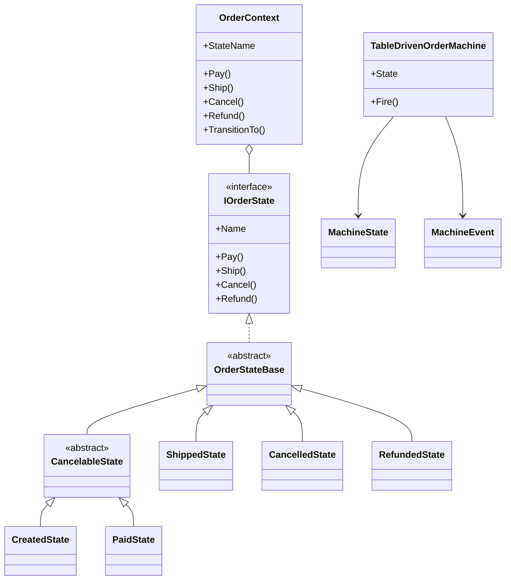
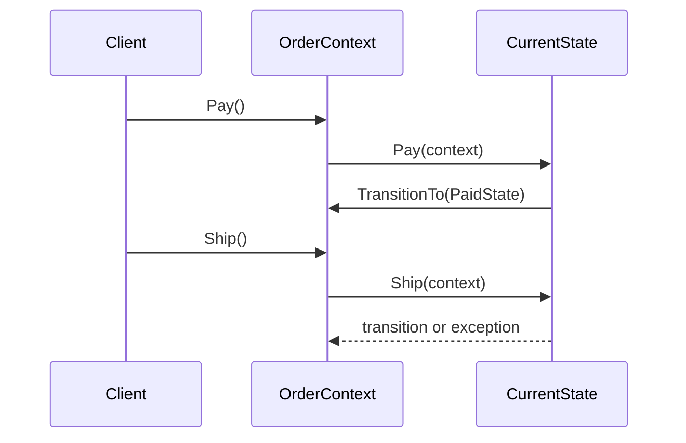

---
date: "2026-04-17"
title: "设计模式教科书｜State：状态模式与状态机：让行为跟着状态切换"
description: "State 讲的是把状态相关行为放进状态对象，让上下文按当前状态切换响应。显式状态机、表驱动状态机和层级状态机则把这种思想推进到可验证、可枚举、可自动化的流程控制。"
slug: "patterns-48-state"
weight: 948
tags:
  - "设计模式"
  - "State"
  - "State Machine"
  - "软件工程"
series: "设计模式教科书"
---

> 一句话定义：State 把“对象在不同状态下的不同反应”从条件分支里拆出来，变成一组可切换的状态。

## 历史背景

状态机比设计模式更早。控制理论、协议栈和编译器早就把“状态 + 事件 -> 动作 + 新状态”当成基础模型。GoF 把 State 收进设计模式目录，解决的是代码里 `switch` 和 `if/else` 嵌套后，业务规则越来越难维护的问题。

对象化 State 的价值在于，把“当前状态决定行为”变成多态。后来的显式状态机、表驱动 FSM 和层级状态机，则是在同一个思想上继续分化：前者强调可验证，后者强调可枚举，层级 FSM 强调复用共享转移。现代语言让写法更轻，但没有改变本质：状态必须成为一等结构。

## 一、先看问题

订单流转最容易暴露状态问题。新订单能支付，已支付订单能发货，已发货订单能退款，已取消订单什么都不能做。状态少时，`switch` 看起来直白；状态一多，规则就会被切成许多局部判断，重复、漏分支和非法转移都会冒出来。

```csharp
using System;

public enum OrderState { Created, Paid, Shipped, Cancelled }

public sealed class NaiveOrder
{
    public OrderState State { get; private set; } = OrderState.Created;
    public void Pay() => State = State == OrderState.Created ? OrderState.Paid : throw new InvalidOperationException();
    public void Ship() => State = State == OrderState.Paid ? OrderState.Shipped : throw new InvalidOperationException();
    public void Cancel() => State is OrderState.Created or OrderState.Paid ? OrderState.Cancelled : throw new InvalidOperationException();
}
```

问题不在“能不能跑”，而在“规则在哪儿”。一旦支付失败、库存冻结、风控拦截、超时取消这些条件进来，状态和事件就开始交叉。你可以继续堆判断，也可以把状态抽成对象或转成表；前者短期快，后者长期稳。

## 二、模式的解法

State 模式把行为放进状态对象，上下文只保存当前状态并转发事件。对象化后，状态可以自己决定是否转移、执行什么动作、切到哪个状态。显式状态机再往前走一步：把状态、事件、转移和动作都写成可枚举的规则。

下面的代码同时展示了对象化 State 和表驱动 FSM：前者适合行为差异明显的状态，后者适合做验证、导图和测试覆盖。

```csharp
using System;
using System.Collections.Generic;

public sealed class OrderContext
{
    private IOrderState _state = new CreatedState();
    public string StateName => _state.Name;
    public void Pay() => _state.Pay(this);
    public void Ship() => _state.Ship(this);
    public void Cancel() => _state.Cancel(this);
    public void Refund() => _state.Refund(this);
    internal void TransitionTo(IOrderState next) { Console.WriteLine($"{_state.Name} -> {next.Name}"); _state = next; }
}

public interface IOrderState { string Name { get; } void Pay(OrderContext c); void Ship(OrderContext c); void Cancel(OrderContext c); void Refund(OrderContext c); }
public abstract class OrderStateBase : IOrderState
{
    public abstract string Name { get; }
    public virtual void Pay(OrderContext c) => Invalid("pay");
    public virtual void Ship(OrderContext c) => Invalid("ship");
    public virtual void Cancel(OrderContext c) => Invalid("cancel");
    public virtual void Refund(OrderContext c) => Invalid("refund");
    protected static void Invalid(string action) => throw new InvalidOperationException($"Cannot {action} in current state.");
}
public abstract class CancelableState : OrderStateBase { public override void Cancel(OrderContext c) => c.TransitionTo(new CancelledState()); }
public sealed class CreatedState : CancelableState { public override string Name => "Created"; public override void Pay(OrderContext c) => c.TransitionTo(new PaidState()); }
public sealed class PaidState : CancelableState { public override string Name => "Paid"; public override void Ship(OrderContext c) => c.TransitionTo(new ShippedState()); public override void Refund(OrderContext c) => c.TransitionTo(new RefundedState()); }
public sealed class ShippedState : OrderStateBase { public override string Name => "Shipped"; public override void Refund(OrderContext c) => c.TransitionTo(new RefundedState()); }
public sealed class CancelledState : OrderStateBase { public override string Name => "Cancelled"; }
public sealed class RefundedState : OrderStateBase { public override string Name => "Refunded"; }

public enum MachineState { Created, Paid, Shipped, Cancelled, Refunded }
public enum MachineEvent { Pay, Ship, Cancel, Refund }
public sealed class TableDrivenOrderMachine
{
    private readonly Dictionary<(MachineState, MachineEvent), (MachineState Next, Action Effect)> _table = new();
    public MachineState State { get; private set; } = MachineState.Created;
    public TableDrivenOrderMachine()
    {
        Add(MachineState.Created, MachineEvent.Pay, MachineState.Paid, () => Console.WriteLine("record payment"));
        Add(MachineState.Created, MachineEvent.Cancel, MachineState.Cancelled, () => Console.WriteLine("cancel before pay"));
        Add(MachineState.Paid, MachineEvent.Ship, MachineState.Shipped, () => Console.WriteLine("reserve courier"));
        Add(MachineState.Paid, MachineEvent.Cancel, MachineState.Cancelled, () => Console.WriteLine("cancel paid order"));
        Add(MachineState.Paid, MachineEvent.Refund, MachineState.Refunded, () => Console.WriteLine("refund payment"));
        Add(MachineState.Shipped, MachineEvent.Refund, MachineState.Refunded, () => Console.WriteLine("refund after ship"));
    }
    public void Fire(MachineEvent ev)
    {
        if (!_table.TryGetValue((State, ev), out var tr)) throw new InvalidOperationException($"No transition from {State} on {ev}.");
        tr.Effect(); Console.WriteLine($"{State} -> {tr.Next}"); State = tr.Next;
    }
    private void Add(MachineState s, MachineEvent e, MachineState n, Action effect) => _table[(s, e)] = (n, effect);
}

public static class Program
{
    public static void Main()
    {
        var order = new OrderContext();
        order.Pay();
        order.Ship();
        Console.WriteLine(order.StateName);

        var machine = new TableDrivenOrderMachine();
        machine.Fire(MachineEvent.Pay);
        machine.Fire(MachineEvent.Ship);
        Console.WriteLine(machine.State);
    }
}
```


## 三、结构图



`OrderContext` 只负责保存当前状态；规则在状态对象里，或者在转移表里。`CancelableState` 说明层级状态机的意义：把共享转移提到父状态，避免每个子状态重复写一遍。

## 四、时序图



State 的运行语义很简单：客户端只面对上下文，状态自己决定如何响应。显式 FSM 只是把这层转移关系进一步数据化，让规则能被枚举、导出和校验。

## 五、变体与兄弟模式

State 的常见变体是显式 FSM、表驱动 FSM 和层级 FSM。显式 FSM 适合调试和验证；表驱动 FSM 适合做完整性检查

显式 FSM 把状态和事件都列出来，适合人工审查；表驱动 FSM 把转移压成数据，适合穷举测试；层级 FSM 把共同入口和退出上提，适合抑制状态爆炸。它们不是同一个抽象的三种“口味”，而是面对不同风险的三种约束方式。显式 FSM 更像一本规章，读者是人；表驱动 FSM 更像一张规则表，读者既可以是人，也可以是工具；层级 FSM 则像把重复条目整理到目录里，减少维护时的噪音。

如果状态很少、行为差异也不明显，层级和表驱动都没有必要，直接枚举加少量分支就够了。可一旦状态开始共享入口动作、共享退出动作，或者同一批父状态要吸收一串子状态的默认行为，继续硬写 `switch` 就会把共同规则打散。这个时候，选择哪种 FSM 结构，关键不是“哪种更高级”，而是“哪种最接近你要管理的规则形态”。
显式 FSM 把状态和事件都列出来，适合人工审查；表驱动 FSM 把转移压成数据，适合穷举测试；层级 FSM 把共同入口和退出上提，适合抑制状态爆炸。它们不是同一个抽象的三种“口味”，而是面对不同风险的三种约束方式。显式 FSM 更像一本规章，读者是人；表驱动 FSM 更像一张规则表，读者既可以是人，也可以是工具；层级 FSM 则像把重复条目整理到目录里，减少维护时的噪音。

如果状态很少、行为差异也不明显，层级和表驱动都没有必要，直接枚举加少量分支就够了。可一旦状态开始共享入口动作、共享退出动作，或者同一批父状态要吸收一串子状态的默认行为，继续硬写 `switch` 就会把共同规则打散。这个时候，选择哪种 FSM 结构，关键不是“哪种更高级”，而是“哪种最接近你要管理的规则形态”。

如果再往工程里走一步，还会发现层级 FSM 的价值不只是“少写几次重复代码”。它真正节省的是认知开销：当父状态已经说明了“进入这一族状态前后必须做什么”，子状态就只需要描述自己的局部差异。这样写出来的状态图更接近业务术语，也更方便后来的人把代码和流程图互相对照。很多团队在这里会误判，以为层级只是在继承行为，其实它是在继承“上下文”。

表驱动 FSM 的意义也不止是“把转移放到数据里”。一旦转移表足够清楚，它就能成为接口契约、测试矩阵和审计依据。比如审批流、订单流和连接流都很适合把合法转移列成表，因为业务最怕的不是状态多，而是状态多却没有一份总表。总表一旦存在，团队就能直接回答“哪些事件被允许”“哪些状态是终态”“哪些事件必须带守卫条件”。


State 还经常被拿来和 Event Queue 比较，因为它们都在处理事件，但 Event Queue 只负责把事件延后、排队和批量处理，它不决定当前对象该进入什么状态。换句话说，Event Queue 解决的是时间解耦，State 解决的是行为分歧。

这个边界很重要。很多系统一开始会先引入事件队列，把同步调用改成异步投递，然后发现业务规则仍然散落在各处，因为队列只改变了“什么时候执行”，没有改变“执行以后该怎么反应”。State 则正好相反，它把“该怎么反应”收拢起来，但不会替你解决事件何时到达、是否重放、是否持久化这些问题。两者可以一起用，但不能互相替代。

Coroutine 也常常被放进同一张对比表里，但它解决的问题还是不同。Coroutine 适合把一个长流程拆成几个等待点，比如“发起请求、等待结果、继续处理”。State 适合把一组离散事件组织成明确分支，比如“收到支付成功、收到支付失败、收到取消”。如果流程本身需要暂停恢复，Coroutine 更顺；如果流程本身要响应状态变化，State 更稳。把两者混用没有问题，但不要把暂停点误认为状态图。

## 六、对比其他模式
State 还经常被拿来和 Event Queue 比较，因为它们都在处理事件，但 Event Queue 只负责把事件延后、排队和批量处理，它不决定当前对象该进入什么状态。换句话说，Event Queue 解决的是时间解耦，State 解决的是行为分歧。

这个边界很重要。很多系统一开始会先引入事件队列，把同步调用改成异步投递，然后发现业务规则仍然散落在各处，因为队列只改变了“什么时候执行”，没有改变“执行以后该怎么反应”。State 则正好相反，它把“该怎么反应”收拢起来，但不会替你解决事件何时到达、是否重放、是否持久化这些问题。两者可以一起用，但不能互相替代。


Strategy 负责“选哪种算法”，State 负责“当前状态该怎么响应”，Coroutine 负责“长流程如何暂停恢复”。三者都可能长得像一组可替换对象，但变化来源不同：外部选择、内部演化、时间推进。


## 七、批判性讨论

State 最常见的问题是状态爆炸。状态一多，类和转移就会迅速膨胀；但这往往说明业务本身已经是状态机问题，不是 State 把问题变大了。真正该做的是压缩层级、提取共享转移，而不是假装没有状态。表驱动的优势就在这里：当状态主要变化在转移而不是动作时，表能先把规则收拢，再决定是否值得拆成对象。

这里最能说明 State/FSM 价值的，不是那些状态名字本身，而是它们把网络协议里最重要的几类问题全部暴露出来：合法事件、非法事件、超时重试、连接关闭和半开连接处理。也就是说，TCP 的状态图不是附录，它就是协议如何活下去的说明书。

TCP 的案例之所以重要，不是因为它“有状态”，而是因为它把状态当成协议的正式部分。你只要看它对 TIME-WAIT、FIN-WAIT 和重复关闭的处理，就会发现状态机并不是抽象装饰，而是可靠性交付的一部分。TCP 说明了一个事实：一旦系统必须面对乱序、超时和重放，状态图就不再是文档插图，而是行为契约。

Stateless 则说明了另一件事：把状态机做成库，并不会削弱它的表达力，反而能把那些本来要靠团队约定维持的规则，变成代码能检查的规则。它为什么像 State/FSM？因为它把状态、事件、守卫条件和层级继承都显式化了；它为什么又不只是 State？因为它还允许你导出图、做外部状态存储，并把状态机变成可测试的规则对象。

Akka FSM 的意义在于，它把状态机和消息模型绑得很紧。actor 里没有共享可变状态，因此状态机不再需要防御多线程互斥；它只要保证同一时刻只处理一条消息，就能把“消息来了以后状态怎么变”说清楚。这个例子很适合说明，FSM 不一定依附于某个业务对象，它也可以成为并发系统里的行为控制层。

从工程角度看，Stateless 的图导出、入口动作和守卫条件也正是它能被长期维护的原因。它不是把对象模式做得更花哨，而是把原来靠手写注释维护的转移规则，变成了代码和图可以同时表达的东西。这种表达方式很适合团队协作：产品能看图，测试能写覆盖，开发能查实现，大家围绕同一份状态模型说话。

Stateless 的价值也不只是“可以写状态机”。它把 `PermitIf`、`OnEntry`、`OnExit` 和层级状态一起提供出来，说明一个真实工程里的状态机，通常不只是在状态之间跳来跳去，还要处理入口动作、出口动作、守卫条件和状态共享。`OnEntry` 和 `OnExit` 让副作用从转移逻辑里分离出来，`PermitIf` 让守卫条件变成可读规则，`SubstateOf` 则把共享路径提到上层，这些都正好对应状态模式和 FSM 在工程里的真实分工。

Akka FSM 则更能说明状态机和并发模型不是对立的。actor 本身已经把消息串行化了，而 FSM 只是把“收到消息以后该如何切换状态”建模得更清楚。它适合那些状态依赖消息顺序、又必须保持局部隔离的系统，比如会话、工作流或连接管理。也正因为 actor 把共享可变状态隔离掉了，FSM 在这里会比在普通对象里更自然：状态不是一个全局变量，而是消息语义下的局部事实。

第二个问题是过度对象化。状态只有两三种、差异很小的时候，硬拆成很多类，只会增加跳转成本。对象化 State 适合行为差异明显的状态；差异不大的状态，用枚举 + 表驱动更合适。
TCP 的案例之所以重要，不是因为它“有状态”，而是因为它把状态当成协议的正式部分。你只要看它对 TIME-WAIT、FIN-WAIT 和重复关闭的处理，就会发现状态机并不是抽象装饰，而是可靠性交付的一部分。TCP 说明了一个事实：一旦系统必须面对乱序、超时和重放，状态图就不再是文档插图，而是行为契约。

Stateless 则说明了另一件事：把状态机做成库，并不会削弱它的表达力，反而能把那些本来要靠团队约定维持的规则，变成代码能检查的规则。它为什么像 State/FSM？因为它把状态、事件、守卫条件和层级继承都显式化了；它为什么又不只是 State？因为它还允许你导出图、做外部状态存储，并把状态机变成可测试的规则对象。

Akka FSM 的意义在于，它把状态机和消息模型绑得很紧。actor 里没有共享可变状态，因此状态机不再需要防御多线程互斥；它只要保证同一时刻只处理一条消息，就能把“消息来了以后状态怎么变”说清楚。这个例子很适合说明，FSM 不一定依附于某个业务对象，它也可以成为并发系统里的行为控制层。


这篇教科书版 State 对应的应用版是：[State：Unity 落地版](../pattern-06-state-fsm-behavior-tree.md)。这里讲的是通用原理、状态图和 FSM 边界；应用版讲 Unity 里怎么接动画、输入和行为树。两篇不是重复，而是把“是什么、为什么”和“Unity 里怎么做”拆开。教科书版先把状态机的骨架讲清楚，应用版再把这套骨架落到动画过渡、角色行为和输入响应上，这样读者不会把“模式本身”误认成“某个引擎里的实现技巧”。

再往前看一层，教科书版和应用版的关系其实是一条桥，而不是两篇孤立文章。教科书版负责回答“状态机为什么存在、它和 Strategy、Coroutine、Event Queue 的边界在哪里”；应用版负责回答“在 Unity 里，状态该挂到角色、动画还是行为树上”。这条桥要先通，读者才不会把“状态切换”理解成某个框架独有的写法，也不会把引擎里的落地经验误当成状态模式的全部。

如果读者已经在项目里用过动画状态机、角色行为树或者 UI 流程切换，这篇的目标不是推翻这些经验，而是帮你把经验归类。你会更容易看见哪些地方是 State/FSM，哪些地方其实是 Event Queue，哪些地方更像 Coroutine 或 Strategy。分清之后，状态图就不再是抽象术语，而是一个能帮你压住复杂度的工具。

真正做工程判断时，还要问一句：这个问题是不是已经有明确状态图，只是代码还没承认。如果答案是肯定的，那继续在 `switch` 里加条件，最终只会把状态图藏得更深；如果答案是否定的，那也别急着上对象化 State，先把状态、事件和非法转移列出来，再看是否值得用 FSM 结构表达。模式不是为了让代码更像设计模式，它是为了让团队更快判断“这个事件现在该不该发生”。

什么时候宁愿不用 State？当状态只是一个临时标签，后续行为几乎不受它影响的时候，就别把它升格成模式；当行为变化主要来自配置或策略，而不是来自状态本身的时候，也别硬往 State 上套。还有一种情况更常见：团队只是想把代码拆得更“高级”，但业务本身没有稳定的状态边界。这个时候，先写出几轮真实流程，再判断是不是已经形成了稳定状态图，通常比一开始就做对象化 State 更靠谱。

第三个问题是表驱动的误解。表不是“更冷”，而是“更显式”。它的优势是完整、可导出、可测试；它的代价是复杂动作不如对象自然。对协议、审批、订单和解析器，这个代价通常是值得的。

## 八、跨学科视角

TCP 是最典型的状态机案例。RFC 793 直接把连接写成 LISTEN、ESTABLISHED、TIME-WAIT 等状态，并要求它们随事件和超时切换；协议本身就是控制平面，不是“顺便画了个图”。


## 九、真实案例

TCP 来自 RFC 793。它把连接、事件和超时直接写成状态图和状态处理说明，说明状态机不是“好看的图”，而是协议规格本身。来源：`https://www.ietf.org/rfc/rfc793.html`、`https://datatracker.ietf.org/doc/rfc793/`。

Stateless 是 C# 生态里最清楚的状态机库之一。它支持 `SubstateOf`、`PermitIf`、`OnEntry`、`OnExit`，说明层级状态机和可视化 FSM 都能落地。来源：`https://github.com/dotnet-state-machine/stateless`。

## 十、常见坑

第一，状态对象继续堆业务分支。那只是把 `switch` 换个地方放，没减复杂度。

第二，状态粒度太碎。一个状态只管一两个极小差异，类数会爆，阅读成本会比分支更高。

第三，只写正常路径，不写非法事件和超时。真实系统里，状态机最需要处理的恰恰是这些边界。
这个判断不是风格偏好，而是成本选择：如果团队更关心“某个状态下到底该做什么”，对象化 State 更能把行为收拢；如果团队更关心“哪些事件允许从哪里跳到哪里”，表驱动 FSM 更容易做审查和自动化测试。教科书版 State 在这里要先把原理讲清楚，应用版再把它接到 Unity 的动画、输入和行为树上。两篇不是重复，而是把“是什么、为什么”和“Unity 里怎么做”拆开。教科书版先把状态机的骨架讲清楚，应用版再把这套骨架落到动画过渡、角色行为和输入响应上，这样读者不会把“模式本身”误认成“某个引擎里的实现技巧”。


## 十一、性能考量
真正做工程判断时，还要问一句：这个问题是不是已经有明确状态图，只是代码还没承认。如果答案是肯定的，那继续在 `switch` 里加条件，最终只会把状态图藏得更深；如果答案是否定的，那也别急着上对象化 State，先把状态、事件和非法转移列出来，再看是否值得用 FSM 结构表达。模式不是为了让代码更像设计模式，它是为了让团队更快判断“这个事件现在该不该发生”。


State 模式的事件分发通常是一次虚调用，近似 O(1)。表驱动 FSM 如果用哈希表或小枚举数组，也基本是 O(1)。真正的差异不在算法，而在常量项：对象化 State 付出的是类数量和对象切换，表驱动付出的是转移表和动作表的存储。

## 十二、何时用 / 何时不用

适合用 State 的场景，是行为随着状态明显变化，而且转移本身就是业务规则。订单、连接、审批、风控、协议和工作流，都很适合。状态少、分支轻、变化也不多的小函数，或者纯算法选择问题，都不适合硬上 State。

## 十三、相关模式

State 和 [Strategy](./patterns-03-strategy.md) 是近亲，一个管状态驱动，一个管算法驱动。


这篇教科书版 State 对应的应用版是：[State：Unity 落地版](../pattern-06-state-fsm-behavior-tree.md)。这里讲通用原理、状态图和 FSM 边界；应用版讲 Unity 里怎么接动画、输入和行为树。两篇不是重复，而是把“是什么、为什么”和“Unity 里怎么做”拆开。

## 十四、在实际工程里怎么用

工程里最稳的起点，通常是先列状态、事件和合法转移，再决定用对象化 State 还是表驱动 FSM。状态少、动作重，优先对象化；转移规则多、需要导图和测试，优先表驱动；共享规则很多时，再考虑层级状态机。

## 小结

State 的第一个价值，是把状态相关分支从上下文里移出去。

第二个价值，是让转移规则显式化、可测试、可验证。

第三个价值，是让复杂流程变成一张能讨论、能导出、能维护的图。


