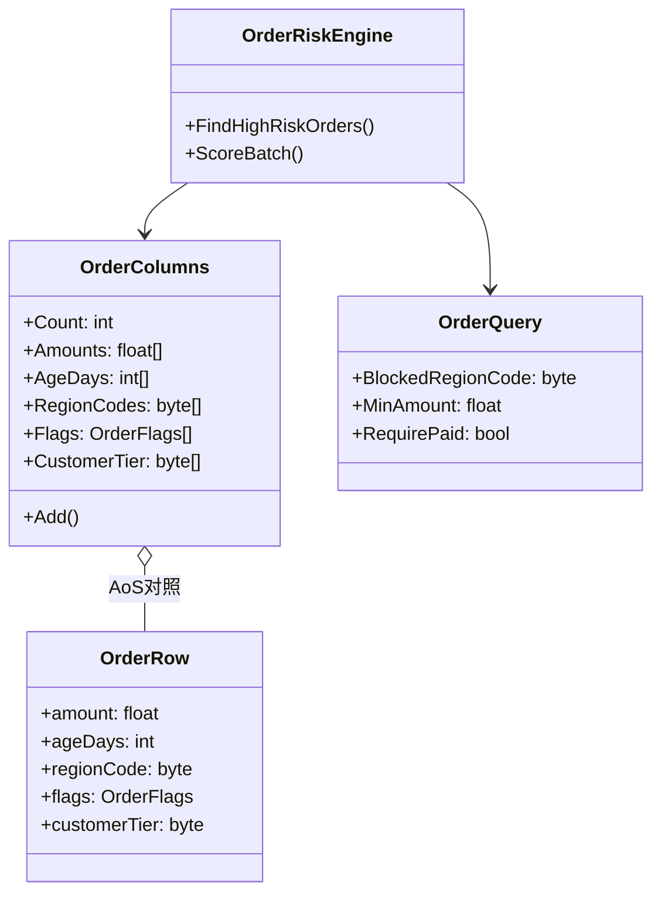
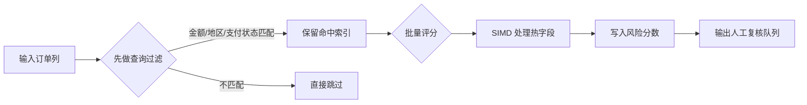

---
date: "2026-04-18"
title: "设计模式教科书｜数据导向设计（DOD）：从 OOP 到 DOP"
description: "DOD 不是把对象砍掉，而是把数据布局、访问模式和批处理放到设计中心。它让 CPU 更容易顺着缓存线工作，也让高频计算从对象游走变成连续扫描。"
slug: "patterns-49-data-oriented-design"
weight: 949
tags:
  - 设计模式
  - DOD
  - 软件工程
series: "设计模式教科书"
---

> 一句话定义：把系统先当成一组会被反复扫描和批处理的数据，再把行为围绕这组数据来组织，而不是先围绕对象层级来组织。

## 历史背景

DOD 不是从游戏行业突然长出来的，它是 CPU 微架构把软件工程逼出来的。早期面向对象设计强调的是封装、继承和消息传递，这在小规模系统里非常自然；可一旦数据量上去，真正拖慢程序的往往不是“算得多”，而是“等内存”。CPU 的运算速度和内存访问速度差了好几个数量级，cache line、分支预测、预取器、TLB 这些词开始直接决定程序的上限。

数据导向设计在这个背景下逐渐成形。它的核心不是“反对对象”，而是承认一个事实：如果系统要反复处理同一批数据，最值钱的资产不是对象之间的关系，而是数据是否连续、是否紧凑、是否能被顺序访问。Mike Acton 在游戏开发社区里把这件事讲得很直白，后来的 Unity DOTS、Flecs、EnTT、Apache Arrow 之类系统，只是把这套思想换成了不同领域的工程语言。

今天回头看，DOD 的意义更像一条边界线：当系统进入批处理、查询密集、数值密集、并行友好的阶段，OOP 的默认布局就不再是自然选择。它没有让 OOP 失效，只是提醒我们，抽象的方向要跟硬件的方向对齐。

## 一、先看问题

先看一个很常见的业务场景：订单风控评分。订单对象里有客户、地址、商品明细、支付状态、地区、历史行为，规则引擎要对每个订单打分，再把高风险订单送去人工复核。很多团队会顺手把它写成一组对象和服务：订单对象负责自己的状态，风控规则对象负责自己的判断，编排层逐个调用这些对象。

这种写法在功能上没毛病，问题出在数据规模一上来就开始吃亏。风控流程真正高频使用的字段，往往只是金额、地区、是否已支付、历史拒付次数、下单时间、客户等级。可对象里挂着的其他字段——收货地址、商品标题、客服备注、富文本扩展字段——在这个路径上全是冷数据。CPU 每次拿到一个订单对象，等于把一整块不必要的数据一起搬进 cache line。

下面这段坏代码是典型的对象优先写法。它看上去很 OOP，也很“业务对象”，但它把数据访问顺序交给了对象图，而不是交给计算本身。

```csharp
using System;
using System.Collections.Generic;

public sealed class Order
{
    public decimal Amount { get; init; }
    public string Region { get; init; } = string.Empty;
    public bool IsPaid { get; init; }
    public int ChargebackCount { get; init; }
    public int CustomerTier { get; init; }
    public DateTime CreatedAtUtc { get; init; }
    public List<OrderLine> Lines { get; init; } = new();

    public float CalculateRiskScore()
    {
        float score = 0;
        if (!IsPaid) score += 4;
        if (Amount > 5000m) score += 2;
        if (Region is "high-risk") score += 3;
        score += ChargebackCount * 1.5f;
        score += Math.Max(0, 3 - CustomerTier);
        score += Lines.Count > 8 ? 1 : 0;
        return score;
    }
}

public sealed class OrderLine
{
    public string Sku { get; init; } = string.Empty;
    public int Quantity { get; init; }
    public decimal UnitPrice { get; init; }
}

public static class BadRiskEngine
{
    public static List<Order> FilterHighRiskOrders(IEnumerable<Order> orders, float threshold)
    {
        var result = new List<Order>();
        foreach (var order in orders)
        {
            if (order.CalculateRiskScore() >= threshold)
            {
                result.Add(order);
            }
        }
        return result;
    }
}
```

这段代码的问题不是“对象不好”，而是它默认每个对象都值得被完整取用。实际风控路径只想扫一组热字段，却被迫穿过一堆冷字段和嵌套引用。数据量小的时候，这只是浪费；数据量大到一百万行时，这就是内存带宽和 cache miss 的直接损耗。

## 二、模式的解法

DOD 的做法不是“别用对象”，而是把热数据和冷数据分开，把按行访问改成按列访问，把一次只看一条记录改成一次处理一批记录。对象图让“一个业务实体的全部内容”靠得很近；DOD 让“一个计算步骤需要的数据”靠得很近。

这里最关键的是 SoA，而不是 AoS。AoS（Array of Structures）把一条记录塞成一个结构体或对象数组；SoA（Structure of Arrays）把同一字段放进连续数组。前者适合围绕单个实体做大量业务操作，后者适合围绕某个计算步骤扫很多实体。DOD 的重点通常在后者，因为 CPU 最擅长的不是到处跳，而是顺着内存往前走。

下面这段代码用纯 C# 做了一个简化的订单列存储。它把风控需要的热字段拆成列，查询时按列扫描，评分时按批处理；金额和年龄这类数值列还能直接走 `Vector<T>`，让运行时在支持 SIMD 的平台上自动向量化。

```csharp
using System;
using System.Collections.Generic;
using System.Numerics;

[Flags]
public enum OrderFlags : byte
{
    None = 0,
    Paid = 1 << 0,
    Vip = 1 << 1,
    Chargeback = 1 << 2,
    Expedited = 1 << 3
}

public sealed class OrderColumns
{
    private int _count;

    public int Count => _count;
    public float[] Amounts = Array.Empty<float>();
    public int[] AgeDays = Array.Empty<int>();
    public byte[] RegionCodes = Array.Empty<byte>();
    public OrderFlags[] Flags = Array.Empty<OrderFlags>();
    public byte[] CustomerTier = Array.Empty<byte>();

    public void Add(float amount, int ageDays, byte regionCode, OrderFlags flags, byte customerTier)
    {
        EnsureCapacity(_count + 1);
        Amounts[_count] = amount;
        AgeDays[_count] = ageDays;
        RegionCodes[_count] = regionCode;
        Flags[_count] = flags;
        CustomerTier[_count] = customerTier;
        _count++;
    }

    private void EnsureCapacity(int required)
    {
        if (Amounts.Length >= required)
            return;

        var newSize = Math.Max(required, Math.Max(8, Amounts.Length * 2));
        Array.Resize(ref Amounts, newSize);
        Array.Resize(ref AgeDays, newSize);
        Array.Resize(ref RegionCodes, newSize);
        Array.Resize(ref Flags, newSize);
        Array.Resize(ref CustomerTier, newSize);
    }
}

public readonly record struct OrderQuery(byte BlockedRegionCode, float MinAmount, bool RequirePaid);

public sealed class OrderRiskEngine
{
    public List<int> FindHighRiskOrders(OrderColumns columns, OrderQuery query, float threshold)
    {
        var matches = new List<int>();
        for (int i = 0; i < columns.Count; i++)
        {
            if (!IsCandidate(columns, i, query))
                continue;

            if (Score(columns, i) >= threshold)
                matches.Add(i);
        }
        return matches;
    }

    public void ScoreBatch(OrderColumns columns, Span<float> output)
    {
        if (output.Length < columns.Count)
            throw new ArgumentException("output length is smaller than the number of rows.");

        var width = Vector<float>.Count;
        var laneBuffer = new float[width];
        var ageBuffer = new float[width];
        var i = 0;

        for (; i + width <= columns.Count; i += width)
        {
            var amount = new Vector<float>(columns.Amounts, i);
            for (int lane = 0; lane < width; lane++)
                ageBuffer[lane] = columns.AgeDays[i + lane];

            var age = new Vector<float>(ageBuffer);
            var risk = amount * new Vector<float>(0.0004f)
                     + age * new Vector<float>(0.15f)
                     + new Vector<float>(1.0f);

            risk.CopyTo(laneBuffer);
            for (int lane = 0; lane < width; lane++)
            {
                var index = i + lane;
                var value = laneBuffer[lane];
                if ((columns.Flags[index] & OrderFlags.Paid) == 0)
                    value += 4;
                if ((columns.Flags[index] & OrderFlags.Chargeback) != 0)
                    value += 3;
                if (columns.CustomerTier[index] <= 1)
                    value += 2;
                laneBuffer[lane] = value;
            }

            laneBuffer.AsSpan().CopyTo(output.Slice(i, width));
        }

        for (; i < columns.Count; i++)
            output[i] = Score(columns, i);
    }

    private static bool IsCandidate(OrderColumns columns, int index, OrderQuery query)
    {
        if (query.RequirePaid && (columns.Flags[index] & OrderFlags.Paid) == 0)
            return false;

        if (columns.Amounts[index] < query.MinAmount)
            return false;

        return columns.RegionCodes[index] != query.BlockedRegionCode;
    }

    private static float Score(OrderColumns columns, int index)
    {
        float score = 1.0f;
        score += columns.Amounts[index] * 0.0004f;
        score += columns.AgeDays[index] * 0.15f;
        score += columns.CustomerTier[index] <= 1 ? 2 : 0;
        score += (columns.Flags[index] & OrderFlags.Paid) == 0 ? 4 : 0;
        score += (columns.Flags[index] & OrderFlags.Chargeback) != 0 ? 3 : 0;
        return score;
    }
}

public static class Demo
{
    public static void Main()
    {
        var columns = new OrderColumns();
        columns.Add(120f, 2, 1, OrderFlags.Paid, 3);
        columns.Add(9800f, 7, 2, OrderFlags.None, 1);
        columns.Add(2600f, 1, 1, OrderFlags.Paid | OrderFlags.Vip, 2);
        columns.Add(15000f, 12, 9, OrderFlags.Paid | OrderFlags.Chargeback, 1);

        var engine = new OrderRiskEngine();
        var query = new OrderQuery(BlockedRegionCode: 9, MinAmount: 1000f, RequirePaid: true);
        var matches = engine.FindHighRiskOrders(columns, query, threshold: 6.5f);

        var scores = new float[columns.Count];
        engine.ScoreBatch(columns, scores);

        Console.WriteLine($"matches={matches.Count}, topScore={Max(scores):0.00}");
    }

    private static float Max(float[] values)
    {
        var max = float.MinValue;
        foreach (var value in values)
            if (value > max) max = value;
        return max;
    }
}
```

这段代码体现了 DOD 的三个核心动作。第一，它把热字段拆成连续列，避免无关字段跟着一起进入 cache line。第二，它把查询写成“先筛选，再评分”的批处理流程，而不是每个对象单独走一遍完整逻辑。第三，它把数值计算放到了可以被 SIMD 利用的形态里，让 JIT 有机会把批量运算落到硬件向量指令上。

## 三、结构图



这个结构图刻意把 `OrderRow` 放成对照项。它不是 DOD 的目标结构，它只是帮助你看清楚：当业务对象和计算热点绑在一起时，设计重心会偏向“单个实体好不好看”；当列存储和查询布局分开时，设计重心就会偏向“这次计算到底要哪些列”。这就是 DOD 和对象优先最本质的分歧。

## 四、时序图



这张流程图展示的是 DOD 的真实执行方式：先让查询把不相关的数据排除，再对剩下的热数据批处理。它和面向对象里那种“每个对象自己完成自己的工作”很不一样。DOD 先问“哪些数据值得碰”，再问“怎么以最低的内存代价碰它们”。

## 五、变体与兄弟模式

DOD 不是一种单一布局，而是一组互相关联的布局策略。最常见的变体是 `AoS` 和 `SoA`，再往前一步会出现 hot/cold split，把频繁访问的热字段和偶尔访问的冷字段拆开；再往后一步会出现 chunked storage，把同一类数据按块组织起来，方便批处理和预取。还有一种常见变体是 query-first layout：先围绕查询模式组织数据，再围绕对象身份组织引用。

它的兄弟模式里，ECS 最容易被误解。ECS 常常采用 DOD，但 DOD 并不要求 ECS。换句话说，ECS 是一种组织实体、组件和系统的架构风格；DOD 是一种围绕数据布局和访问模式的设计方法。一个系统可以是 OOP 的外壳、DOD 的内核；也可以是 ECS 的框架、DOD 的存储。两者有交集，但不能互相替代。

另一个容易混的兄弟是 columnar storage。列存数据库和 DOD 的目标很像，都是为扫描和聚合服务；只是数据库还要考虑事务、索引、并发、持久化和压缩。你把它们看成同一条思想链上的不同实现就够了，不必把 DOD 简化成数据库搬运。

## 六、对比其他模式

| 维度 | OOP | DOD | ECS |
|---|---|---|---|
| 设计中心 | 对象与职责 | 数据布局与访问模式 | 实体、组件、系统的组织方式 |
| 典型优势 | 表达自然、封装清晰 | 缓存友好、批处理友好 | 组合灵活、扩展方便 |
| 典型代价 | 指针追逐、冷数据浪费 | 抽象泄漏、代码不直观 | 学习成本、查询复杂度 |
| 适合场景 | 交互密集、对象少 | 计算密集、批量多 | 大量同类实体、系统驱动 |
| 关系 | 最熟悉的默认起点 | 可以嵌进 OOP 或 ECS | 常常把 DOD 落地到存储层 |

DOD 和 OOP 的差别，不在于“有没有对象”，而在于“对象是不是设计的中心”。OOP 先问一个东西是谁；DOD 先问一批数据要怎么过 CPU。前者天然适合表达行为边界，后者天然适合表达处理边界。

DOD 和 ECS 的差别，常常被讲得太绝对。ECS 不是 DOD 的对立面，反而经常是 DOD 的载体。把 ECS 讲成 DOD 的全部，会把重点从“布局和访问”滑到“实体和组件”的命名游戏里。那样写出来的系统也许更整齐，但不一定更快。

## 七、批判性讨论

DOD 最大的合理批评，是它会牺牲一部分直观性。对象模型像故事，DOD 像表格。故事适合读，表格适合算。你如果让所有系统都追求表格化，最后可能得到一个性能不错但难以维护的代码库。尤其是业务规则复杂、状态分支很多、领域语言很重的系统，过早 DOD 化会把原本很清楚的对象意图切碎成一堆数组和标志位。

第二个批评是抽象泄漏。DOD 会强迫你正视数据布局、对齐、批大小和查询顺序，这本来是优点；可一旦这些细节一路传到业务层，开发者就会开始围着 cache line 写业务。那时候系统很可能已经偏过头了。好的 DOD 应该把布局复杂性关在少数基础设施层里，而不是让每个领域对象都变成“列名拼装机”。

第三个批评是并不是所有系统都值得数据导向化。一个用户资料编辑页、一个低频审批流、一个以外部 IO 为主的接口聚合层，瓶颈往往不在 CPU 缓存，而在数据库、网络或外部服务。你把这些系统硬改成 SoA，只会让代码更难懂，却得不到可观回报。DOD 应该优先用在热路径、批处理和数值核心，不该先用在所有东西上。

第四个批评是 DOD 也有自己的复杂性税。布局一旦按列组织，插入、删除、重排、局部更新、稀疏访问都会变得更麻烦。换句话说，DOD 是用更好的扫描效率，换来了更重的写入和维护成本。这个交换不是免费的，所以它不该被包装成“永远更先进”的答案。

## 八、跨学科视角

DOD 和列式数据库几乎是同一种思想在不同场景的投影。Apache Arrow 的 Columnar Format 明确强调了顺序扫描、`SIMD` 友好和零拷贝访问，这和 DOD 的目标完全一致：把同类值放在一起，减少随机跳转，让硬件顺着数据走。Arrow 文档里讲的 record batch、buffer、schema，本质上就是把“数据形状”和“访问路径”拆开处理。

同样的思想也出现在 NumPy 这样的数组计算库里。数组不是对象图，而是带形状和步长的连续内存；向量化不是语法糖，而是把循环交给底层硬件。DOD 只是把这种思维从科学计算搬到了业务系统、游戏引擎和实时服务里。你会发现，计算机科学里很多看似不同的东西，最后都绕回了“内存怎么摆”这件事。

## 九、真实案例

Unity 的 Entities 包是一个很好的落地例子。官方文档把它描述成 Unity 的现代 ECS 实现，2022.3 版本的入口在 `https://docs.unity3d.com/cn/2022.3/Manual/com.unity.entities.html`。这类文档最能说明的不是“ECS 多酷”，而是 Unity 选择把大量同类实体的处理，导向更适合批量访问的存储和查询方式。

Apache Arrow 的 Columnar Format 是另一个直接例子。官方文档在 `https://arrow.apache.org/docs/format/Columnar.html`，它明确写出了数据邻接、`O(1)` 随机访问、`SIMD and vectorization-friendly`、以及零拷贝访问这些特性。这里的关键词几乎可以直接翻译成 DOD 的设计清单：连续、紧凑、可扫描、可向量化。

EnTT 也非常适合拿来对照。仓库在 `https://github.com/skypjack/entt`，README 中直接给出了 `#include <entt/entity/registry.hpp>` 的用法。它是一个头文件库，但它真正展示的不是“怎么写 ECS”，而是如何把 `registry.view<const position, velocity>()` 这种查询变成一等能力。`src/entt/entity/registry.hpp` 这类路径背后的重点，不是命名，而是它把数据查询作为核心接口。

Flecs 则把 DOD/ECS 的工程化做得很完整。仓库在 `https://github.com/SanderMertens/flecs`，README 里强调了 cache-friendly archetype/SoA storage、查询语言、以及百万实体每帧处理能力。它把“数据结构是否适合缓存”直接写进了项目介绍里，这比空谈抽象要诚实得多。

## 十、常见坑

第一个坑是把 DOD 当成纯优化技巧，只在最后才想起来。这样做通常会把布局改造压缩到最难改的阶段：系统已经成形，接口已经散开，数据已经互相引用，最后只能靠临时适配层打补丁。DOD 应该尽早影响数据模型，而不是等代码写完再用刀修。

第二个坑是把热数据和冷数据混在一起。很多团队口头上说“我们已经列存了”，实际上只是把一堆字段从类里挪到了一个 struct 里，冷字段照样跟热字段绑在一起。真正的 DOD 不是字段重排，而是访问分层。没分热冷，就别急着说自己做了数据导向。

第三个坑是把查询写得太碎。DOD 的优势在批处理和连续扫描，不在一堆小查询互相调用。你如果把一个原本可线性扫描的问题拆成十几个微查询，循环次数会增加，分支会增加，缓存命中也未必更好。布局优化不等于把控制流拆碎。

第四个坑是忽略写入成本。列存适合读密集，未必适合写密集。一个需要频繁插入、删除、局部更新的系统，如果没有做好重排和 tombstone 管理，SoA 很快会把维护成本反弹回来。DOD 不是不要写入成本，而是要你先知道自己在拿什么换什么。

## 十一、性能考量

DOD 的性能收益，核心来自四件事：cache line、顺序访问、SIMD 和批处理。CPU 一次不是只读一个字节，而是按 cache line 把数据成批搬进来。若某个热路径每次只需要 16 字节热字段，却每次都通过对象指针碰到一个 96 字节甚至更大的对象，内存系统就会反复搬运很多无关数据。换成 SoA 后，同类字段连续排列，cache line 的利用率会明显变高。

一个粗略但有用的估算是：如果一条订单对象大约 96 字节，其中风控热字段只有 16 字节，那么扫描 100 万条订单时，AoS 可能会让内存系统搬运接近 96MB 的行体；SoA 只需要顺序读取热列，大约是 16MB 级别，再加上少量辅助列。这个数字不是固定基准，却足够说明为什么“布局”能比“算法微调”更有价值。

SIMD 的价值在于它让同一条指令同时处理多个元素。`System.Numerics.Vector<T>` 在 .NET 里会根据运行平台选择合适宽度，常见 x64 平台会一次处理多个 `float`。这意味着批量评分不必一个订单一个订单地算，而可以一次算一组。DOD 的批处理正是为这类向量化腾地方。

但性能不是免费午餐。列存的插入和删除更贵，稀疏访问更难看，局部修改也不如对象式直观。真正成熟的 DOD 不是把所有路径都强行列化，而是把最热的那部分提出来单独优化，再接受其他路径维持原样。性能工程讲究的是热点优先，不是全面重写。

## 十二、何时用 / 何时不用

适合用 DOD 的场景很明确：大量同类数据、固定或近似固定的查询模式、明显的热路径、可以批处理的计算、对吞吐和帧稳定性敏感的系统。订单风控、日志聚合、指标计算、物理模拟、批量渲染准备、路径搜索前的过滤，都很适合把数据导向放到设计中心。

不适合用 DOD 的场景也同样明确：对象数量很少、行为差异很大、规则频繁变化、控制流高度不规则、写入和随机更新占主导、系统主要瓶颈在 IO 或外部调用。你如果把 DOD 用在一个以交互和叙事为主的业务系统里，收益往往抵不过维护成本。

最稳妥的做法，是把 DOD 当成一把刀，而不是信仰。先找热路径，再看是否能批处理，再看是否能拆热冷，再看是否能列化。只要这个顺序反过来，系统就会开始围着布局转，而不是围着问题转。

## 十三、相关模式

- [Object Pool](./patterns-47-object-pool.md)  
  对象池解决的是复用和分配成本，DOD 解决的是布局和访问成本。两者都面向性能，但关注的瓶颈不同。
- [Type Object](./patterns-36-type-object.md)  
  Type Object 适合把数据驱动的类型和实例分离，DOD 则进一步关心这些数据该怎么摆。
- [Prototype](./patterns-20-prototype.md)  
  Prototype 关注复制和初始化，DOD 关注批量访问和内存局部性。
- [ECS Architecture](./patterns-39-ecs-architecture.md)  
  ECS 常常承载 DOD，但两者不是同义词。
- [Bytecode](./patterns-38-bytecode.md)  
  当行为需要被解释或调度时，Bytecode 更合适；当数据需要被连续扫描时，DOD 更合适。

## 十四、在实际工程里怎么用

在实际工程里，DOD 最常落地的地方不是“某个 UI 层”，而是高频批处理层：游戏引擎的实体更新、风控/推荐系统的特征计算、日志分析管线、ETL 转换、动画姿态更新、碰撞预筛选、渲染前的可见性整理。它的价值不是把整个系统改成列存，而是把最热、最密、最重复的那部分数据单独抽出来，让 CPU 顺着缓存工作。

如果你要对照 Unity 里的实践，可以直接看应用版文章：[数据导向设计（Unity 落地）](../pattern-07-data-oriented-design.md)。那一篇讲的是 Unity 里怎么把这个思想落到实体、组件和具体工作流里；这一篇讲的是更通用的原理、硬件原因和布局方法。换句话说，教科书版讲“为什么这样摆数据”，应用版讲“在 Unity 里怎么把它做出来”。

继续往后看，DOD 也会自然影响未来的引擎架构文章：`ECS Architecture` 会讨论实体与系统如何承载批处理，`Hot Reload` 会讨论数据和代码如何在不停机时更新，`Shader Variant` 会讨论如何把有限组合前置成可编译资产。它们都不是同一个模式，但都在回答同一件事：如何让系统更接近它真正的热路径。

## 小结

DOD 的第一价值，是把热数据从对象图里拎出来，让 cache line 不再被冷字段拖累。

DOD 的第二价值，是把单条对象处理改成批处理和查询布局，让 SIMD 和顺序扫描真正发挥作用。

DOD 的第三价值，是把性能优化从“调函数”提升到“调布局”，但又不把它误写成 ECS 宣言。

一句话收束：DOD 不是取消对象，而是让数据站到设计中心。
