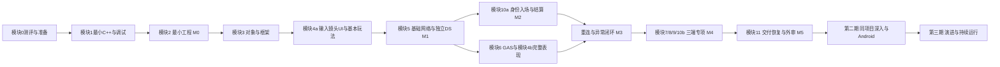

# UE 全栈工程师成长路线：从入门到专家的内容建设与实践计划

> 版本：2026-09-20 / 第一版。状态：**规划已建立；新增内容待写；工程、源码与个人能力尚未验证**。
> 本文件只对四领域的贯通路径和新增桥梁内容建立权威目录。现有专题继续维护自己的原路径、原编号和发布状态。
> 盘点依据：[UE 全栈内容盘点快照](ue-fullstack-content-audit.md)；站点入口：[doc-plan.md](../doc-plan.md)。

## 1. 定位：用一个可交付项目建立四种责任能力

读者已有多年 Unity/C#、客户端架构、资产管线、构建发布、跨平台与性能排查经验，从 UE 入门，但不从编程入门。可迁移的是分层、资源生命周期、调试、测量和交付习惯；不能默认已经掌握 C++ 所有权、UE 对象/网络生命周期、Linux 运行治理、数据库事务或分布式故障语义。

路线的第一条实践主线是小型房间制实时联网游戏 **TwinArena**。先让客户端、权威战斗服、业务后端、交付流程完整运转，再沿同一工程增加机制深度。大型 MMO、超大规模同屏、跨区域无缝世界、分布式世界分区属于后续分支，不进入第一版范围。

| 责任领域 | 应能独立负责的结果 | 不能拿来替代它的证据 |
| --- | --- | --- |
| A UE 客户端 | 输入、镜头、UI、动画、碰撞/移动、AI/寻路、音频特效、资源、渲染、性能、平台适配形成可维护体验 | 蓝图 Demo 能播放、仅熟悉网络名词 |
| B UE 权威战斗服 | 权威规则、移动/战斗同步、技能状态、对局生命周期、弱网、负载与容量有边界和验证 | PIE 多窗口成功、仅能启动 DS |
| C 业务后端 | 身份/会话、匹配/分配、档案/背包/奖励/排行榜、持久化、接口安全和数据一致性可靠 | DS 里写了一个登录 RPC、接口返回 200 |
| D 交付与运行治理 | 可构建、测试、部署、观测、匹配版本、排空回滚、恢复、解释容量与成本 | CI 绿灯或容器启动成功 |

这里的“专家”是需要持续接受审查的能力目标：解释机制、独立实现、定位陌生问题、比较方案、验证正确性与性能、承担交付和演进责任。读完文章不等于专家；TwinArena 的结果应标为学习项目/受控演练，不包装成商业生产经验。

本次只编辑规划与审计，不编写正文、不建外部仓库、不实现游戏/后端、不安装大型环境、不生成空文章或逐篇详细工单，也不自动 commit/push。

## 2. 原专题归属与阅读路由

本路线的增量是“现有知识如何接成一个工程、在哪里验收”。原理已讲清的部分直接借用；接口、版本和实验缺口才新增桥梁。审计 A 编号是快照证据索引，不是新文章编号。

| 上游/交叉专题 | 本路线的阅读用法 | 长期归属 |
| --- | --- | --- |
| [引擎架构地图 plan](game-engine-architecture-series-plan.md) | 先读 [02 世界模型](../content/system-design/game-engine-architecture-02-gameobject-vs-actor.md) 的职责边界；其他层带问题回查 | 架构地图继续维护，证据 A01 |
| [UE 原导读](../content/system-design/unreal-engine-series-index.md) | 对象/模块用于入门；基础网络提前；渲染内核与 GAS 预测按项目触发 | Unreal 原专题，不在这里复制全目录，A03–A14 |
| [技能系统 plan](skill-system-series-plan.md) | [09 表现边界](../content/system-design/skill-system-09-animation-and-presentation-decoupling.md)、[13 回归](../content/system-design/skill-system-13-testing-and-regression.md) 可先借用；GAS 深文到 M3 再读 | 技能系统及原 GAS 专题，A09/A10 |
| [游戏服务端总图](game-server-topic-plan.md) | 会话、DS、匹配、数据、恢复按 M1/M2/M3 路由；不按框架数量推进 | 服务端专题，A07/A18–A24 |
| [服务端 ECS plan](game-server-ecs-high-performance-series-plan.md) | Tick/I/O/持久化作为第二期机制对照；先核查版本和旧规划状态 | ECS 专项，A16/A17；不替换 UE 权威服 |
| [ET plan](et-framework-series-plan.md)、[ET 前置 plan](et-framework-prerequisites-series-plan.md) | [ET-Pre-05 会话与超时](../content/et-framework-prerequisites/et-pre-05-session-request-response-timeout-and-heartbeat.md) 借用概念；完整 ET 后置 | ET 原专题，A23；第一版不依赖 ET |
| [渲染栈 plan](game-engine-rendering-stack-series-plan.md)、[性能方法论 plan](game-performance-series-plan.md) | 普通客户端先会分 CPU/GPU/I/O/等待；有渲染专项需要时再入 RDG/RHI、Nanite/Lumen | 原渲染/性能专题，A11–A13 |
| [交付工程 plan](delivery-engineering-column-plan.md) | 契约、测试、版本、备份和符号方法按 M0/M5 使用 | 交付专题，A24–A26 |
| [Unity 资产 plan](unity-asset-system-and-serialization-series-plan.md)、[加载流式 plan](unity-packaging-loading-streaming-series-plan.md) | 只作资产身份/依赖/持有/发布模型的对照入口；本次未审计全系列正文 | Unity 原专题，不能把 Addressables 句柄直接映射为 UE 对象 |

现 UE 导读的“架构 → GAS → 网络”适合已有 UE 实践、按内部机制系统阅读的人。对本读者，学习默认顺序改为“最小工程/对象职责 → 客户端基础切片 → 基础网络/独立 DS → 业务贯通 → GAS 预测与深入”。后续可在原导读增加读者分流提示；本次不改原文、篇号或系列结构。

站点原有技术底座优先级仍保留。本路线的内容建设队列只调度本路线，不自动覆盖全站排期。

## 3. 三类状态与证据制度

| 维度 | 允许的状态 | 更新条件 |
| --- | --- | --- |
| 内容状态 | 已有正文 / 仅有规划 / 待写 / 待修订 | 原专题作者核对实际文件后更新原 plan；本文件只维护 UFS 新增单元 |
| 技术证据 | 文档依据 / 源码核查 / 实验验证 / 尚未验证 | 记录版本、链接或源码 revision、复现步骤、原始产物；允许同一问题同时有多类证据 |
| 个人能力 | 已阅读 / 可独立实现 / 可独立诊断 / 外部验收 | 本人完成解释、实现、陌生问题定位或他人复验后更新；本次全部待测 |

技术结论逐条标为 **官方事实、源码事实、实验观测、工程建议、待验证假设**。官方资料只支持文档事实，不能替代本机实测；看过源码不能替代性能实验。

每个里程碑保留同一份证据清单：项目 revision、引擎/插件/编译器/OS/驱动、客户端与 DS 构建 ID、资源/协议/Schema 版本、命令和脱敏配置、测试账号/种子、场景与负载、开始结束时间、原始日志/Trace/数据库断言、期望与实际、已知限制、复验者。失败尝试也要保留，不能只留成功截图。

[源码登记](engine-source-roots.md) 当前不是 READY。后续先取得合法访问条件，再在选定 revision 定位调用路径，公开侧以行为、函数/路径指引、自有实验为主；不复制 Unity 私有 C++、商业数据或未经许可的 UE 源码片段。是否能访问源码与是否允许公开内容分别判断。

AI 可协助检索、起草、实现和审查。最终验收必须包括本人不依赖预生成答案的解释，以及新故障的独立定位。AI 生成代码并能编译不作为掌握标准。

## 4. 学习顺序与能力闸门

模块是问题域，里程碑是结果，两者不要求一一对应，也不按编号读完整套百科。模块 4、8、9、10、11 都分“进入主线的最小部分”和“项目驱动的深入部分”，避免前置过重。



模块 11 的日志/符号从 M0 就开始，鉴权从 M2 开始，不能等到 M5 才补安全；模块 12 的复现方法从第一次失败开始使用，深度成果在 M4/M5 收束。图中的返工不是前置循环：未通过只回到所需能力补课，再重新验收同一关卡。

### 模块 0｜背景地图与能力测评

- **主问题/目标**：我能迁移哪些经验，哪些责任还没有能力证据？画出四领域、关键状态权威和请求边界。
- **必须前置**：会编程及基本版本管理；不预设 C++/网络/DB 熟练。
- **已有材料**：A01 世界模型、A21 会话状态机、A23 会话基础；宏观路由见第 2 节。
- **缺口**：UFS-01 的四领域能力测评与准备清单，不能用读文章数代替。
- **最小实践**：对登录、移动、扣血、发奖、存档分别回答谁决定、谁保存、谁可重试；做 C++、网络、Linux、SQL、调试的小题。
- **常见故障**：GameObject=AActor、AActor=并发 Actor、DS=所有后端、Unity 经验=UE 全栈熟练。
- **通过标准**：每个关键状态都有唯一权威/持久化位置；解释未知项，列出补课动作和可验证出口。
- **连接**：通过后进入模块 1；数学、数据库、Linux 按首次用到的关卡补，不先重读完整通识。

### 模块 1｜C++ 与工程底座

- **主问题/目标**：离开 C# 托管假设后，怎样负责对象和资源生命周期，并读懂构建/崩溃信息？
- **必须前置**：模块 0；向量/变换、进程/线程基本概念按需补。
- **已有材料**：A02 原生编译与符号对照；A03 是 UE 所有权的相邻入口，不当作通用 C++ 课。
- **缺口**：UFS-02 补 RAII、所有权、指针/引用、容器失效、移动语义与模板阅读；UFS-03 接编译/链接/模块/符号。并发的任务与线程、数据竞争、同步、内存/缓存到模块 8/9 再深化。
- **最小实践**：小程序含作用域资源、独占所有者、借用引用、容器变化、一次 move；有意制造链接缺符号、悬空访问和数据竞争并解释原因。
- **常见故障**：拿 GC 习惯管理原生资源、捕获失效对象、误认 move 自动移动、把任务数当线程数。
- **通过标准**：独立画出对象销毁顺序，修复一次内存生命周期问题和链接问题；进入并发模块前能解释竞态和同步点。
- **连接**：最小所有权/编译调试通过即可到 M0；不要求模板元编程和无锁算法先毕业。

### 模块 2｜第一个可交付 UE 工程

- **主问题/目标**：怎样让另一台约定环境从说明获得同一份可打包、可调试工程？
- **必须前置**：模块 1 最小部分，版本/工具链/访问条件确认。
- **已有材料**：A04 UBT/模块，A07 Target/Cook，A26 符号匹配原则。
- **缺口**：UFS-03 的空工程基线：目录、模块、配置、C++/蓝图分工、日志、构建 ID、符号和包。
- **最小实践**：一张合法简单地图、一个 C++ 行为和蓝图配置；构建 Windows 包，脱离编辑器启动；捕获一次可定位故障。
- **常见故障**：Editor 模块泄漏进运行时、配置只在本机生效、Cook 漏图、二进制和符号不匹配、Live Coding 结果掩盖完整构建失败。
- **通过标准**：M0 回执可重跑；新进程能运行；匹配符号定位到自有代码；记录准确版本与命令，不使用开发期热编译作为发布证明。
- **连接**：到模块 3/4；Server/Linux 构建可在 M1 增量补，源码获取条件在 M0 前就确认。

### 模块 3｜对象、世界与 Gameplay Framework

- **主问题/目标**：状态应放在哪个对象，何时创建、接管、复制和销毁？
- **必须前置**：M0、所有权；先理解单机生命周期，再在 M1 扩为多进程。
- **已有材料**：A01、A03、A05；UObject/反射/序列化/GC 的其余正文只定位到文件，使用前进一步核查。
- **缺口**：UFS-04 补 World/Level/Actor/Component、GameInstance/Subsystem、GameMode/GameState、PlayerController/PlayerState/Pawn/Character 的生命周期实证；修订原文风险归原专题。
- **最小实践**：出生、Possess、死亡重生、切图、断连时记录实例/进程/World ID；列 UObject 持有边与序列化边界。
- **常见故障**：把持久数据放在会销毁的 Pawn，把 UI 放 DS，把 Outer 当成无条件保活保证，把本地 GameInstance 当共享会话。
- **通过标准**：每个对象在哪些进程存在、谁可修改、谁持有可解释；Travel 前后无旧委托/引用残留；结论绑定选定版本与实验。
- **连接**：为模块 4/5 建对象地图，M2 再把进程外的业务会话接入。

### 模块 4｜客户端基础系统

- **主问题/目标**：怎样把玩法做成能操作、能理解、能维护的客户端，而非只会联网和看性能？
- **必须前置**：M0、模块 3；动画/碰撞数学与数据驱动基础按用例补。
- **已有材料**：A01 框架、A10 逻辑与表现边界及回归；泛 UI/AI/动画专题尚未逐篇核查，不声称可直接代替 UE 入门。
- **缺口**：UFS-05 的客户端可玩切片；UFS-20 的表现清理与协作契约。输入/镜头、UMG 数据更新、动画状态、碰撞移动、AI 寻路、SFX/VFX、设置/存档/错误提示/加载体验都列入验收。
- **最小实践**：4a 在 M1 前做移动、视角、攻击输入、血条/重生提示、基础动画与碰撞；4b 在 M3 前补简单 AI、导航、音频特效、暂停/设置保存、加载和失败反馈。
- **常见故障**：UI 抢输入、重复绑定、重生后视角错误、动画通知直接改最终伤害、取消后特效不释放、寻路只在编辑器有效。
- **通过标准**：键鼠输入到镜头/角色/状态/UI 的链路清晰；数据变化驱动 UI；取消/死亡/切图回归无残留；素材可替换且规则不变；存档只保存允许的本地设置，不替代服务端奖励账本。
- **连接**：4a→模块 5，4b 与 GAS 并进；复杂行为树、动画专项、MetaSounds/Niagara 内核后置。

### 模块 5｜基础网络与最小 Dedicated Server

- **主问题/目标**：三个独立进程如何对同一局的移动、攻击、血量和重生达成权威状态？
- **必须前置**：模块 3/4a；能解释 UDP/TCP、延迟/抖动/丢包、连接/超时、序列化与状态/事件。
- **已有材料**：A06/A07/A08/A05；基础材料按已查范围使用，API 片段必须核当前版本。
- **缺口**：UFS-06 的三进程实践，权威/所有权/网络角色/相关性与 RPC/属性复制的解释桥梁。
- **最小实践**：两个打包 Windows 客户端＋独立 Linux DS；服务器判攻击并扣血，客户端展示；覆盖加入、退出、一次 Travel、基础断线提示。M1 可先使用简单攻击实现，不依赖完整 GAS。
- **常见故障**：RPC 所有者不匹配、只在本机扣血、把瞬时 Multicast 当持久状态、角色与进程身份混用、端口/版本/Cook 不一致。
- **通过标准**：M1 的两客户端与 DS 日志/状态相符；恶意或非法攻击输入被拒；退出后重入可看到当前血量。PIE 只用于迭代，不能提交为独立部署证据。
- **连接**：M1 后直接进入模块 10a 做 M2；同时可开始模块 6，不等内部渲染、Mass 或全套网络内核。

### 模块 6｜战斗系统与 GAS

- **主问题/目标**：一次技能从输入、校验到命中结算，怎样在拒绝、取消和死亡时正确收束？
- **必须前置**：M1；能力/属性/效果/标签的职责；预测章节必须先过模块 5 的权威、所有权、RPC/复制闸门。
- **已有材料**：A09 的 GAS 入口/深入边界，A10 的表现和测试；GAS-01–07 先按需求核正文后补读，不把整个系列阅读量设为闸门。
- **缺口**：UFS-10 的失败路径实践；UFS-20 接表现资源。预测细节修订回原 GAS/技能系列。
- **最小实践**：一项瞬发和一项可取消技能，连起 Ability/Attribute/Effect/Tag/Task 与表现；成功、预测被拒、死亡中断、目标消失、重复请求分别留时间线。
- **常见故障**：错误 ASC 初始化时机、Task/委托未结束、重复 Cue、把表现回滚当作权威业务回滚、混淆 GAS/移动预测/世界回滚。
- **通过标准**：取消后技能、Tag、资源占用、动画/特效都可解释；服务器拒绝不会发奖或重复扣费；两客户端最终状态与 DS 一致，失败有可读反馈。
- **连接**：与已贯通 M2 的业务链整合为 M3；随后深入资源、三端性能和可靠性。

### 模块 7｜资源与内容交付

- **主问题/目标**：一个资源何时被发现、加载、持有、释放并进入正确的发布包？
- **必须前置**：模块 3/4，M0 构建；补依赖图/异步完成时序。
- **已有材料**：A13 已讲软引用、异步加载、Streaming、PSO；A07 有 Cook；Unity 资产专题只作模型对照。
- **缺口**：UFS-11 的资源生命周期与缺包实验，内容分块/补丁/版本兼容到 UFS-15 连接，避免重写已有软引用说明。
- **最小实践**：同一角色在大厅/战斗地图加载卸载，记录硬/软引用、Asset Manager/加载句柄持有；故意漏 Cook 一项并诊断；首次技能分别测冷启动、暖缓存。
- **常见故障**：软引用被别处硬引用保活、异步回调遇到旧 World、切图内存持续增长、Editor 有资产而包里没有、Shader/PSO 首用卡顿误判为网络。
- **通过标准**：可解释每条持有边和释放时机；重复切图后占用趋势有测量和解释；客户端与 DS 资产清单符合各自需要，缺失有诊断记录。
- **连接**：给模块 8 提供稳定内容基线，给模块 11 提供内容版本契约；资源更新不等于代码热更新。

### 模块 8｜客户端运行时、渲染与性能

- **主问题/目标**：一次卡顿究竟由 CPU、GPU、I/O、内存还是同步等待主导？
- **必须前置**：模块 7、基本并发/内存与缓存；已能生成包和匹配符号。
- **已有材料**：A11 线程/渲染地图、A12 工具入口、A13 加载/PSO，以及渲染栈上游。
- **缺口**：UFS-12 的实测诊断；UFS-17 的 Android 实机平台关卡。采集命令先回到官方资料和所选版验证。
- **最小实践**：沿同一地图分别触发 CPU 工作、GPU 特效和首次加载，用 Game/Render/RHI/Worker/GPU/加载轨迹比较；选择一项修复并回归画质与玩法。
- **常见故障**：只看平均 FPS、把等待当计算、Editor 数据替代包、暖缓存掩盖首开、把 PC 降分辨率当 Android 验证。
- **通过标准**：M4 客户端专项有原始 Trace、设备/版本/内容/采样窗口、分位数与前后对照；本人能解释优化的代价和失效条件。
- **连接**：普通客户端负责人到“能定位并调整预算/画质档位”；渲染专项深度才要求材质/可见性→Pass→RDG 资源依赖→RHI/驱动→GPU 机制。Nanite/Lumen 是后续具体案例，不成为 M1 前置。

### 模块 9｜权威战斗服深入

- **主问题/目标**：真实战斗负载下，怎样同时守住权威正确性、Tick 时间和带宽？
- **必须前置**：M1/M3、并发/缓存/网络测量；不要求 ECS/Mass。
- **已有材料**：A08 移动、A14 复制、A16 I/O 接缝、A17 持久化边界。只把 ECS 文章当对照，不搬成 UE 架构。
- **缺口**：UFS-13 的 DS 负载实验；移动扩展、插值/修正、命中验证/延迟补偿在原网络/技能专题按实际问题追加。
- **最小实践**：记录收输入、排队、仿真、广播和异步 I/O 返回的时序；改变玩家/AI/投射物/技能频率，比较相关性/休眠前后的复制成本。
- **常见故障**：阻塞 I/O 卡住游戏线程、无界排队、只统计空连接、远距离无关对象仍广播、延迟补偿接受任意客户端时间、仿真重播被误称全部世界确定性。
- **通过标准**：M4 DS 专项报告 Tick 分布/超预算率、队列、单连接带宽/复制对象、修正/命中错误，超过预算有拒绝/限流/降级策略；不只报告容器 CPU。
- **连接**：单局/单进程先测，再测多进程/单机干扰及多机分配；常规复制、Replication Graph、Iris 在同一版本与负载上选型。Mass/ECS 只有密度与热点证据成立时进入分支。

### 模块 10｜业务后端与数据正确性

- **主问题/目标**：怎样让入场有授权、结果可信、奖励在并发/重试/崩溃后保持正确？
- **必须前置**：M1、HTTP/身份与会话、Linux 最小运维；关系型 DB 的事务、唯一约束、索引、隔离与并发更新先做练习，不因会 C# 而跳过。
- **已有材料**：A18 事务、A19 奖励、A20 匹配、A21 会话、A22 重连、A23 超时/缓存。
- **缺口**：UFS-07 入场链、UFS-08 结果落库、UFS-14 并发与故障证据。不是重新写“数据库是什么”或通用鉴权教材。
- **最小实践**：10a 在 M2 接通身份、简单匹配、DS 分配/就绪、入场凭证、结果提交与查询；10b 在 M4 加档案/背包/排行榜、并发结算和恢复测试。
- **常见故障**：客户端可伪造结算、登录 token 被当万能凭证、同键异结果被静默吞掉、只在内存去重、超时重试重复发奖、缓存成为唯一账本、MySQL 语义原样迁移到 PostgreSQL。
- **通过标准**：授权 DS 与所属对局绑定；结算身份/结果/奖励流水/资产写入的事务与唯一性可审查；重复、并发、响应丢失、同键冲突均有数据库断言和重启后结果。
- **连接**：第一版模块化单体＋一个关系库；Redis 只在测出需求后加入，并写清可丢失/可重建边界；拆服务须先证明单体瓶颈与一致性代价。

### 模块 11｜上线交付、安全与持续运行

- **主问题/目标**：怎样让这一局可发布、可观测、可安全退场、出故障可恢复？
- **必须前置**：日志/符号从 M0，鉴权/校验从 M2；完整关卡需要 M3、三端专项与 Linux 进程/权限/网络/存储知识。
- **已有材料**：A24 长跑弱网/压测，A25 协议/备份/迁移，A26 符号。
- **缺口**：UFS-09 联合证据规范，UFS-15 版本部署/排空，UFS-16 故障恢复。UE 客户端/DS 构建和 Linux 后端均进入交付清单。
- **最小实践**：自动构建与制品身份；单元/契约/三进程端到端/弱网/长跑/负载分层；日志指标追踪关联一局；注入进程退出、DB 暂停和恢复；完整备份恢复验证。
- **常见故障**：就绪等于端口开、排空仍接新局、版本交叉混服、符号丢失、密钥进包/日志、接口无限重试、只备份不还原、回滚二进制却忽视 Schema。
- **通过标准**：M5 契约和运行手册可交给他人；权限/凭证/限流/输入校验/关键操作审计有负向用例；兼容矩阵与恢复目标经过演练，三端容量和成本有条件口径。
- **连接**：容器在第一期后段用于环境一致性，先单机多进程；多机 DS 池、Kubernetes/Agones 到第二/三期有明确分配和容量需要时再评估。

### 模块 12｜源码研究、架构演进与专家证据

- **主问题/目标**：面对没有准备答案的新问题，怎样形成可反驳的解释并推动工程演进？
- **必须前置**：能复现和采集；源码研究另需合法访问、准确 revision；架构演进需已有可交付工程。
- **已有材料**：A01 的证据边界写法、A10 回归、A12/A24 的诊断入口；其他源码研究专题仅作后续检索入口。
- **缺口**：UFS-18 的现象→假设→调用路径→实验→结论案例；UFS-19 的需求变化与交接评审。
- **最小实践**：从 M4 一个具体问题进入源码，给反例和方案对比；后续实施跨线程/进程/版本变化，记录 ADR、回归和失败尝试。
- **常见故障**：按目录通读却无问题、把文档当源码事实、只比较平均值、AI 替本人完成解释、演示项目冒充线上治理经验。
- **通过标准**：第一期至少一项源码与实验共同支持的深入成果；盲测故障能独立缩小范围；外部评审能按说明重跑并提出问题；未通过项如实保留。
- **连接**：方法贯穿全部模块；第三期以真实协作/运行周期继续验证，不用完成一次练习授予“专家”称号。

## 5. TwinArena 范围、架构假设与关键契约

### 5.1 第一版决策

| 决策 | 规划假设与理由 | 代价 / 改变它的触发条件 |
| --- | --- | --- |
| 玩法 | 一张小地图、2 人起步、简单攻击/扣血/重生、固定结束条件；简单 AI 到 M3 | 不验证 MMO/复杂经济；玩法有实质需求才扩内容 |
| 客户端/战斗服 | UE/C++；蓝图用于配置与表现；Windows 客户端＋Linux DS | 增加 C++、UE 构建与跨 OS 前置；不让 C# 后端另造战斗仿真 |
| 后端 | C# / ASP.NET Core 模块化单体；身份、匹配/分配、玩家数据、结算逻辑分模块 | 复用语言经验，仍要学 Web 安全、持久化、并发；测得边界/容量问题再拆服务 |
| 持久化 | PostgreSQL 单库；初版查询/排行榜也可从库中生成 | SQL/事务/索引必须补课；Redis 不前置，缓存加入时必须可重建且不替代奖励账本 |
| 运行模型 | 一局一个 DS 进程；少量固定槽位和简单分配器，检查就绪再发凭证 | 有冷启动/进程资源成本；先记录启动时长和容量，再决定预热池规模 |
| 环境 | 初期 Linux 主机/VM 与受控测试网络；容器在 M5 固化环境 | 不先上 Kubernetes/Agones、多地域、消息中间件；没有资源时缩小并发，保留验收边界 |
| 可选路线 | ET/Mass/ECS/Replication Graph/Iris 是机制或选型分支 | 不增加语言栈；不把热门框架当成默认答案 |
| 多端 | Android 实机是第二期明确关卡 | 无设备时该关卡保持未通过；模拟器/PC 降画质可预检，不能代替实机 |

### 5.2 目标链路与状态权威

```text
客户端登录 → 后端身份/会话 → 简单匹配 → 分配并等待 DS 就绪
→ 签发绑定玩家/对局/DS/版本的短期入场凭证 → DS 验证入场
→ 客户端输入 → DS 权威移动/战斗/结束判定
→ DS 鉴权提交结果 → 后端持久化结算 → 客户端查询结果/背包/排行榜
```

- 客户端拥有本地输入与展示，不拥有最终命中、奖励或持久玩家资产。
- DS 拥有本局仿真真值和结束结果；业务后端拥有账户、分配记录、入场授权和结算账本。DS 不直接接受客户端提交的奖励数量，不把数据库操作塞进每个 Tick。
- 业务会话与 UE 网络连接分开：一个人可断开连接，但对局/结算记录继续存在；对局 ID、分配实例 ID、玩家 ID、请求 ID 和结果版本分别命名。
- 入场凭证需校验身份、目标对局/DS、有效期与版本；会话状态限制新加入/重连。凭证重放策略、连接替换和失效方式在 UFS-07 中验证，不以“签名有效”证明请求适用于当前局。凭证不得进入公开日志。
- 分配器区分“进程启动”“地图/监听就绪”“已分配”“排空”“回收”；启动失败/超时释放槽位并返回可读错误，不把尚未就绪的地址交给客户端。

### 5.3 结算正确性：先写不变量，再写接口

这是待实现设计，不是已验证保证。UFS-08 的验收必须证明：

1. 只有绑定该对局的授权 DS 实例能提交结果；重复/迟到实例不可覆盖当前权威结果，客户端直接提交应被拒绝。
2. 一个对局的规范结果 ID 及玩家奖励业务键唯一；结果记录、发奖流水、资产变化在明确的数据库事务边界内提交。采用同一业务键重试，不随机换键。
3. 同键同内容重试返回既有结果；同键不同内容进入冲突拒绝与审计，不能因为“已处理”就默默返回成功；规范化内容摘要和规则版本可核对。
4. 唯一约束是持久化防线；先 SELECT 或进程内锁不能替代跨实例并发约束。授权、状态检查、约束冲突与事务回滚都要覆盖。
5. “已提交但响应丢失”时，客户端/DS 通过同键查询或重试发现已提交结果，奖励不增加第二次；结算尚未完成则明确显示 pending，而非超时即失败/成功。
6. 故障恢复任务有次数/退避/截止与人工检查出口，不能无限重试。持久化接受结果之后的处理可恢复；接受之前 DS 丢失且没有可信结果时不能编造胜负。

### 5.4 两种恢复不能混写

| 故障 | 第一版策略假设 | 必须验证的证据 |
| --- | --- | --- |
| 客户端断线，DS 存活 | 在约定宽限期内重新鉴权、替换旧连接并恢复当前状态；过期则返回大厅/结果页 | 旧连接不能继续控制；状态/表现无重复；宽限期可配置且测试 |
| DS 在结果持久化前崩溃 | 第一版允许中止该局、记录 aborted 并返回匹配；不承诺继续仿真；补偿若需要须另立可幂等规则 | 不无限重连、不误发胜利奖励；槽位回收，旧凭证失效 |
| 结果已持久化后 DS/后端故障 | 从后端账本查询，恢复未完成处理；DS 存活与否不改变已确定结果 | 重启后结果不丢且不重复发奖；提交前/后注入分别留证 |
| 后续要求恢复进行中对局 | 第二期评估快照/事件日志、外部持久化、恢复时延及成本；不是初版默认能力 | 明确哪些瞬态状态能恢复，恢复前后正确性与预算对比 |

进程重启只是执行体恢复，不等于对局恢复；数据库备份恢复也不等于实时仿真回滚。

## 6. 里程碑、三期目标与补课路径

### 6.1 M0–M5：第一期的工程关卡

所有里程碑当前均为**未执行、未验收**。日期按准备条件确定，不给未经验证的学时承诺。能使用官方资料和 AI 辅助建设，但验收需本人解释和他人可复验。

| 关卡 | 必做产物 | 通过证据 | 失败时补课 |
| --- | --- | --- | --- |
| M0 最小工程 | 版本清单、简单地图、C++/蓝图协作、Windows 包、构建/运行说明、日志/符号 | 脱离编辑器启动；完整构建可重跑；一次自有代码故障能符号化/断点定位 | 模块 1 编译链接/所有权、模块 2 配置与模块依赖 |
| M1 最小权威联机 | 两个独立客户端＋一个独立 Linux DS，移动、攻击、扣血、重生、加入退出 | 三进程身份与日志；两端观察同一 DS 判定；非法请求不改权威状态；包和网络版本一致 | 模块 3 对象归属、4a 输入反馈、5 所有权/复制；Linux 端口/Cook |
| M2 业务贯通 | 测试身份、简单匹配/分配、入场凭证、鉴权结果提交、持久化结算、查询 | 登录→查询完整时序；无效凭证被拒；重复/并发/响应丢失发奖一次，DB 断言可重跑 | 模块 10 SQL/唯一性/事务，UFS-07/08 接口；不先扩 GAS |
| M3 完整玩法与失败流程 | GAS 能力/表现、简单 AI、设置/存档/加载错误反馈、弱网/重连 | 预测成功/拒绝、取消/死亡、重复请求、断线重连均有三端对账；资产/委托不残留 | 模块 4b/6 生命周期、模块 5 网络；区别 DS 存活与死亡 |
| M4 三端专项 | 客户端、DS、业务后端各一项性能或可靠性改进；共同证据格式 | 三份各自的基线/方案对比/原始记录/回归；至少一个方向进入源码核查并做最小实验 | 模块 7–10；未能定位瓶颈先修采集，不能凭猜测优化 |
| M5 交付与外部验收 | 自动构建部署、版本匹配、契约/E2E、长跑、故障/备份恢复、运行手册、作品集 | 他人按文档重跑全链；排空/回滚/恢复演练；本人诊断一项未提前见过的问题；评审意见有处理记录 | 模块 11/12；缺真实复验者时外部验收明确待完成 |

M1 不等读完 UE 内部机制；M2 不等完整 GAS。第一期“完整闭环”要求走到 M5，但规模仍是小房间受控环境。M4 可选择复制开销诊断作为第一项源码深入方向，最终根据实际问题决定；没有源码访问/实验时，第一期源码深度目标保持未通过。

### 6.2 三期目标

| 项目 | 第一期：贯通与一项深入 | 第二期：同项目的专业深度 | 第三期：演进与技术负责人验证 |
| --- | --- | --- | --- |
| 入口要求 | Unity/C# 背景；模块 0 测评与环境条件可满足；弱项允许补课 | M0–M5 证据完整，主要已知故障可重跑 | 第二期关键能力通过，有稳定项目、协作者与可约定运行窗口 |
| 必做内容 | M0–M5；四领域最小闭环；三端基线；一个源码＋实验专题；可审查作品集 | 运行时/渲染问题链、网络修正与带宽、PostgreSQL 并发/恢复、Android 实机、单机多进程干扰和有限多机 DS 分配实验 | 需求变更、一次受控引擎/协议/Schema 升级、故障处理、任务分工、技术评审、连续运行观察和交接 |
| 可延后内容 | Mass/ECS、Iris/Graph 切换、复杂匹配算法、Redis、微服务、集群、MMO、Android | 大型无缝世界、跨区仿真、多数据库；没有瓶颈的框架替换 | 没有产品需要的全球规模/组织管理结论；学习项目无法替代真实商业责任 |
| 实践产物 | 版本化工程、三进程与业务链、测试/故障数据、深入研究、公开脱敏作品集 | 同项目升级分支与 ADR，Android 真机记录，规模/成本曲线，两个方案的证据对比 | 变更设计/回归、演练和真实问题记录、评审/协作反馈、运行报告、维护与交接文档 |
| 验收关卡 | 他人可运行，状态权威清楚，数据不变量成立；陌生故障定位；深度证据可质疑 | 选型有相同输入条件，优化不破正确性；多端差异解释清楚；扩容有实测和余量 | 变更影响可控制；升级/回滚/迁移有边界；他人能维护扩展；反馈推动可见改进 |
| 未达补课 | 按 M 表回到最低失败节点；只会读时补独立实现，只会实现时补故障练习 | 性能返回采集/负载模型；网络返回权威/所有权；数据返回事务/约束；实机缺失就补设备条件 | 协作失败补契约和交接；判断失误补反证和 ADR；运行样本不足延长实际观察，不能靠文章补成 |

作品集每项都注明“学习工程/模拟故障/实际运行”身份，附本人职责、限制和反例。第三期仍需真实团队协作、需求取舍、线上责任与持续维护积累；受控实验不能证明商业规模、长期可靠性或领导真实团队的全部能力。

### 6.3 性能、可靠性与容量预算怎么定

先固定设备、软件版本、构建类型、地图/资源/画质、Tick 目标、玩家/机器人行为、网络条件、数据库初始规模、采集窗口和重复次数，再测量。文中数字若用于测试输入必须标“拟定参数”；不借用旧文章示例或其他项目数据作为 TwinArena 结果。

| 对象 | 代表实际工作的负载 | 最低测量与判断 |
| --- | --- | --- |
| 客户端 | 移动/转镜头、近战/投射物、AI、UI 更新、首进场景和反复切图；冷暖缓存分开 | CPU/GPU/等待/I/O、帧时 P50/P95/P99、卡顿次数、内存峰值与增长；Android 另记温度/持续运行/前后台 |
| DS | 真实移动输入、碰撞、技能/效果、复制/相关性、加入退出、重连；记录每类实体和消息频率 | Tick P50/P95/P99、超预算率、CPU/内存、队列长度、每连接带宽/复制量、修正与命中异常 |
| 业务后端/DB | 登录/匹配/入场/结算/查询的阶段分布；并发结束一局的突发、重试与冲突，不只空 HTTP 请求 | 请求延迟/错误/吞吐、连接池/锁等待/死锁/重试、DB CPU/I/O、发奖唯一性；压测后校验最终状态 |
| 运行与成本 | 同机 DS 多进程相互干扰、启动/回收、备份恢复和故障注入 | 满足预算的并发局数、预留容量、启动分布、存储/带宽/日志成本；区分本地测量和云价假设 |

预算制定：由玩法体验提出目标帧率/Tick/入场等待/结果可见时间，再换算时间预算（例如 `1000 / 目标频率` 毫秒）并保留明确余量；基线发现不可达时调整内容/范围或资源，不事后篡改通过标准。分位数必须写样本数、窗口、冷暖和异常样本处理；不以一条日志代表 P95。

容量用满足全部正确性和延迟预算的最高实测负载减去约定安全余量确定。不能只用空连接数、单请求 QPS 或线性乘法推全国容量；负载机、DB、网卡/带宽和同机争抢也要检查。RPO/RTO、长跑时长和故障恢复时限先由可接受损失/停顿制定，再用实测验证；没有窗口/设备的项目记录为待确认。

## 7. 新增内容单元的权威目录

下列 UFS 编号只管理贯通和桥梁内容，**全部待写、尚无文章文件**。不把暂定标题做成假链接；开写时再选栏目、slug、weight 与 outline。下表是提纲级规划，不是逐篇详细工单或立即写正文的授权。

类型：索引/桥梁/实践/诊断案例/源码研究。通用原理文优先复用；原专题的修订只记为依赖，不复制编号或另建状态目录。P0 阻塞 M0–M2；P1 支撑第一期 M3–M5；P2 为第二/三期。

### 7.1 主问题、前置与学习位置

“前置单元”指需要先获得其能力/产物，不强制等待文章出版；可由官方资料和自主实践补齐。同一行多个编号按 AND 理解，闸门不含反向依赖。

| 编号 / 类型 | 暂定标题与唯一主问题 | 前置单元 | 学习位置 / 优先级 |
| --- | --- | --- | --- |
| UFS-01 / 索引桥梁 | Unity 开发者接手 UE 联网项目，先证明哪些能力？——识别迁移能力与四领域缺口 | 无 | 模块 0，一期 / P0 |
| UFS-02 / 桥梁实践 | 离开 GC 保护后，谁负责释放这个对象？——建立原生所有权与借用边界 | UFS-01 | 模块 1，一期 / P0 |
| UFS-03 / 实践 | 空 UE 工程怎样成为别人能运行和调试的包？——建立可复现构建身份 | UFS-02 | 模块 2，M0 / P0 |
| UFS-04 / 桥梁实践 | 重生和切图后，哪些对象应该留下？——用生命周期决定状态归属 | UFS-03 | 模块 3，M1 前 / P0 |
| UFS-05 / 实践 | 一个角色怎样成为可操作、可读懂的客户端切片？——接通输入、镜头、状态与基础反馈 | UFS-04 | 模块 4a，M1 前 / P0 |
| UFS-06 / 实践 | 两个打包客户端怎样服从同一个 DS 判定？——建立独立进程权威闭环 | UFS-05 | 模块 5，M1 / P0 |
| UFS-07 / 桥梁实践 | 登录成功后，凭什么允许玩家进入这一局？——接通身份、匹配分配与入场授权 | UFS-06 | 模块 10a，M2 / P0 |
| UFS-08 / 实践 | 结算已提交却没收到响应，怎样保证奖励不多发？——建立可查询的持久结果 | UFS-07 | 模块 10a，M2 / P0 |
| UFS-09 / 桥梁实践 | 怎样证明日志、包、Trace 和数据库记录来自同一次实验？——建立联合证据清单 | UFS-03 | M0 建规则，M1/M2 扩用 / P0 |
| UFS-10 / 实践 | 预测被拒或角色死亡时，技能怎样完整结束？——验证 GAS 失败路径 | UFS-06 | 模块 6，M3 / P1 |
| UFS-11 / 诊断实践 | 切图后资源为什么还留在内存？——沿引用与加载句柄找持有者 | UFS-05 | 模块 7，M3/M4 / P1 |
| UFS-12 / 诊断案例 | 这次卡顿究竟卡在哪条执行链？——区分计算、I/O 与等待 | UFS-09、UFS-11 | 模块 8，M4 / P1 |
| UFS-13 / 实践 | 一局真实战斗的 DS 容量由什么限制？——测 Tick、复制和带宽预算 | UFS-06、UFS-09 | 模块 9，M4 / P1 |
| UFS-14 / 实践 | 并发结算遇到数据库故障时，不变量还成立吗？——验证多实例持久化与恢复 | UFS-08、UFS-09 | 模块 10b，M4 / P1 |
| UFS-15 / 实践 | 新版本怎样接新局而不破坏旧局？——版本匹配、排空和发布回退 | UFS-08、UFS-09 | 模块 11，M5 / P1 |
| UFS-16 / 诊断实践 | 掉线和 DS 崩溃为何必须走不同恢复路径？——验证失败语义和可恢复边界 | UFS-08 | M3 契约，M5 完整演练 / P1 |
| UFS-17 / 实践 | PC 上通过的客户端怎样在 Android 实机过关？——用平台约束重定预算 | UFS-12、UFS-15 | 模块 8/11，二期 / P2 |
| UFS-18 / 源码研究 | 怎样用一条复制热点验证源码解释？——从现象追调用路径并设计反证 | UFS-13 | 模块 12，M4/M5 / P1 |
| UFS-19 / 案例评审 | 一次需求或版本变化后，他人还能维护这个工程吗？——用演进验证架构与交接 | UFS-15、UFS-16、UFS-17、UFS-18 | 模块 12，三期 / P2 |
| UFS-20 / 实践 | 取消、重生、切图后，表现系统如何不留下旧状态？——建立动画/音频/特效/UI 的清理契约 | UFS-05、UFS-10 | 模块 4b/6，M3 / P1 |

### 7.2 提纲锚点、产物与验收证据

| 编号 | 最小提纲（问题→模型→落地） | 实践产物 | 验收证据 |
| --- | --- | --- | --- |
| UFS-01 | 能力迁移误区→四领域责任→测评与准备 | 责任图、能力缺口和补课表 | 每项能力有本人解释和待测/通过证据 |
| UFS-02 | 生命周期失败→拥有/借用/转移→RAII 与容器练习 | 小型 C++ 练习、故障复现 | 销毁顺序、失效原因、修复前后诊断；模板只到能阅读 |
| UFS-03 | 编辑器能跑但不能交付→输入/产物/身份→打包调试 | 空项目说明、包、符号、日志 | 完整构建与新进程启动，匹配符号定位，版本可读回 |
| UFS-04 | 切图后状态丢失/残留→对象职责与持有→生命周期观察 | 单机→三进程对象矩阵 | 创建/接管/销毁/Travel 日志；状态去向与清理断言 |
| UFS-05 | 能移动却不能正确交互→输入/状态/反馈边界→可玩切片 | 输入映射、镜头、血条/提示、动画碰撞；设置/加载流程有最小可用行为 | 重生/切 UI 焦点正确；状态驱动反馈，配置变化无需改规则 |
| UFS-06 | PIE 成功但包不通→权威/所有权/状态与事件→独立 DS | 两客户端＋Linux DS、攻击/重生脚本 | 三进程回执、非法输入测试、状态一致与失败定位 |
| UFS-07 | 有身份却入错局→会话/分配/凭证→后端到 DS 契约 | 后端最小模块、协议与错误样例、就绪/超时状态机 | 过期/错误房间/错误玩家/重复入场/DS 未就绪矩阵 |
| UFS-08 | 超时后多发奖→结果身份/事务/唯一性→提交查询 | 结果/奖励/背包模型、并发夹具 | 重复/并发/响应丢失/同键异结果/未授权均可重跑并查库 |
| UFS-09 | 截图无法归因→证据身份和关联→最小观测 | 构建 manifest、实验清单、关联 ID 规则 | 从一个对局 ID 找到三端日志与 DB 结果，缺证据明确失败 |
| UFS-10 | 预测失败残留→技能生命周期→确认/拒绝/取消 | 两技能及时间线矩阵 | 状态/Tag/Task/资源清理，权威结算不受表现回滚影响 |
| UFS-11 | 内存上涨/包缺资源→持有与 Cook 边界→切图实验 | 引用图、加载/释放记录、缺包案例 | 冷暖/循环测量、引用解释，资产清单一致 |
| UFS-12 | 卡顿误归因→分层等待与执行→Trace 假设验证 | 客户端基线和一项修复 | 同条件分布/原始 Trace、正确性与画质回归 |
| UFS-13 | 空连接高并发误导→真实战斗负载→预算阶梯 | 行为机器人/输入脚本、DS 容量曲线 | Tick/队列/复制/带宽与超预算行为；负载机无瓶颈说明 |
| UFS-14 | DB 延迟传染/重试放大→不变量/事务边界→故障注入 | ASP.NET Core＋PostgreSQL 并发与恢复夹具 | 锁/延迟/错误与最终数据，重启后去重仍成立 |
| UFS-15 | 新旧版本混局→兼容矩阵/排空→流水线与发布演练 | 制品、兼容表、灰度/排空/回退手册 | 新局路由、旧局完成、Schema 演进与不兼容拒绝 |
| UFS-16 | 无限重连→存活/死亡/已结算三分→故障恢复 | 进程退出/网络隔离/恢复演练 | 不误发奖、不误报对局恢复、回收和重新匹配可验证；备份实际还原 |
| UFS-17 | PC 预算不成立→设备/热/图形特性→实机分档 | Android 包、触屏输入/生命周期、分档报告 | 真机冷启动/热稳态/弱网/前后台、低内存/存储失败 |
| UFS-18 | 凭猜测解释热点→源码路径与可反驳假设→最小改变量 | 精确 revision、调用路径、替代解释、复现实验 | 源码事实和实验观测分开；至少一条反例；外部技术答辩 |
| UFS-19 | 只有作者能改→契约/ADR/回归边界→协作演进 | 变更方案、分工、回归、交接和运行报告 | 他人实现一项扩展/运行诊断，评审问题闭环；学习证据不冒充生产 |
| UFS-20 | 动画/VFX/SFX 与规则相互污染→表现事件和资源所有者→清理契约 | 简单 AI/寻路驱动、可替换表现资源、事件契约 | 取消/死亡/重生/切图无旧表现；素材更换不改变 DS 规则 |

这里没有新增通用 GAS、ECS 或数据库百科。UFS-18 的具体源码问题可因真实瓶颈调整，但必须保持一个可验证主问题；UFS-19 也必须在获得实际变更材料后才能写成案例。

### 7.3 内容建设顺序与学习顺序的区别

- **先建设证据底座**：UFS-01/02 → UFS-03 → UFS-09。读者完整联机还没开始，作者先把版本/符号/实验记录规则定下来，后面不会只剩截图。
- **再补最小联机阻塞**：UFS-04 → UFS-05 → UFS-06；同时对原 UE 网络 04、DS 文的版本/职责风险做定点修订。
- **随后尽早贯通业务**：UFS-07 → UFS-08；复用已有事务、会话、幂等章节，不等全部 GAS 正文重审完成。
- **完成第一期深度和交付**：UFS-10/20、11 → 12/13/14 → 18 → 15/16；其中 UFS-16 的失败语义应在 M2/M3 设计时先明确，完整演练文章到 M5 收束。
- **第二/三期再建设**：UFS-17、19；Graph/Iris、Mass、跨区等专题按实际诊断需要回原专题申请增补。

学习者按第 4 节能力依赖推进，可以并行补 Linux/SQL，不需要等待全部文章写完。作者按阻塞程度补桥，不能把未完成实验包装成已交付实践文章。

## 8. 准备清单：最低条件、验证方式与替代路径

“已有”只指此次查到的材料或用户给定背景；未盘点本机环境，不能由 Windows 工作区推断已安装 UE、数据库或拥有足够构建资源。下表按种类拆分，每行均保留用途、最低条件、时点、状态、验证和替代方案。

### 8.1 知识准备

| 准备项 / 用途 | 最低可用条件 | 何时 / 已有或待确认 | 验证方式 | 可替代方案 |
| --- | --- | --- | --- | --- |
| C++ 生命周期 / 防悬空和泄漏 | 能解释 RAII、拥有/借用、指针/引用、容器失效、move；能读普通模板 | M0 前 / C# 背景已知，C++ 待测 | UFS-02 小程序＋故障修复，口头解释销毁顺序 | 官方指南＋小练习；无需先完整读标准或高级模板书 |
| 编译/链接/调试 / 定位工程失败 | 能区分编译报错、链接缺符号、运行崩溃；看栈和符号身份 | M0 前 / A02 可借用，个人能力待测 | 自造一个链接错误及一次崩溃并定位 | 先原生小工程，再放回 UBT，不要求先造构建工具 |
| 数学 / 镜头移动和命中 | 向量/点积、坐标空间、变换、插值、时间步；四元数按旋转需求补 | 模块 4/5 前 / 待测 | 解释局部→世界方向、射线命中和时间步变化 | 少量可视小题；不前置完整高数/图形学 |
| 网络 / 权威与失败语义 | UDP/TCP、RTT/抖动/丢包、序列化、状态/事件、超时不等于未执行 | M1 前 / A06/A23 可借用，基础待测 | 三进程消息时序、丢包/重复/超时问答与观察 | 本地受控网络；不先实现传输协议 |
| Linux / 运行与诊断 | 文件/权限、进程/信号、端口/防火墙、日志/磁盘、服务重启 | M1 前 / 待确认 | 启停测试进程、看监听和日志、解释退出码 | 可用 Linux VM/测试主机；Windows DS 先排构建问题，但不替代 M1 Linux 验收 |
| 数据库 / 结算正确性 | SQL、事务、唯一/外键约束、隔离、索引、锁和并发更新 | M2 前 / A18/A19 材料已有，能力待测 | 两个连接并发更新、冲突/回滚/提交响应丢失练习 | 先 SQL 小夹具再用 ORM；不能用内存仓库替代持久化验收 |
| 并发与内存 / 三端性能 | 线程/任务、数据竞争、同步、队列、缓存/局部性基本模型 | M0 认识，M4 深化 / 待测 | 最小竞态定位、时序图、Trace 中辨认等待 | 串行实现先建立正确性；不以无锁结构作为入门条件 |

### 8.2 环境、工程与素材准备

| 准备项 / 用途 | 最低可用条件 | 何时 / 已有或待确认 | 验证方式 | 可替代方案 |
| --- | --- | --- | --- | --- |
| UE 版本 / 可复现 | 选定 minor、patch、源码 revision 和插件清单；暂定 5.7.x 见第 9 节 | M0 前 / 本机版本与 patch 待确认 | 记录版本文件、构建标识和实际日志 | 已有合适版本可调整整套基线，重新查兼容；不滚动追“最新” |
| 源码访问 / DS 与研究 | 合法 Epic/GitHub 等访问条件，源码可定位到 revision；公开边界清楚 | M0 前确认、M1 构建、M4 研究 / 登记仍 TODO | 由本人确认权限并在后续最小编译中验证，不公开凭证 | 合规团队构建产物可用于部分练习；源码深度关卡不能据此直接通过 |
| IDE/Windows 工具链 / 编译调试 | 与选定 UE 匹配的 VS/MSVC/SDK 或经验证 IDE；能保留符号 | M0 前 / 未盘点 | 编译＋符号断点验证，不只看“已安装” | VS 与 Rider 按授权/习惯择一；底层编译工具链仍需一致 |
| Linux 编译和运行 / DS | 版本匹配的交叉编译或原生工具链；可运行目标 Linux、开放所需端口 | M1 前 / 待确认 | Server Target 编译、Cook、目标机启动/地图就绪 | 先 Linux VM，或独立测试机；宿主路径成功不证明 Linux 可运行 |
| 磁盘/CPU/内存/构建时间 / 可持续迭代 | 能容纳源码、依赖、中间产物、DDC、客户端/DS/符号与留证空间 | M0 前 / 全部待确认，不编造用户配置 | 实测空工程与首次完整构建占用/峰值/耗时，保留余量 | 限并行/减素材、使用已有合规构建机；本次不购置/租用 |
| 后端 SDK/数据库 / 业务闭环 | 锁定 .NET/ASP.NET Core、驱动/ORM、PostgreSQL patch；Linux 可运行并有持久卷 | M2 前 / 待确认；资料以 .NET 10 / PG18 页面为入口 | 健康请求、迁移、事务回滚、重启后查库 | 本机服务或单机容器二选一；不同时引入第二种 DB |
| 地图/角色/动画 / 减美术依赖 | 简单几何地图、基础角色和少量动作，来源及使用/分发许可明确 | M0/M1 / 待准备 | 在包中验证碰撞、动画与 DS Cook，保存素材来源表 | 自制几何/简单动画；官方样例按其许可使用，不直接搬整个大项目 |
| 工程目标/配置 / 多进程 | 客户端和 Server Target、地图配置、端口、日志/符号策略，脱敏配置样例 | M0→M1 / 待准备 | 从同 revision 构建两类包，独立启动 | 单工作工程内分目标；本次不决定或新建外部工程仓库 |
| 账号/协议/测试数据 / 接线 | 隔离测试身份、角色/对局 ID、入场/结果 DTO、错误码和版本；DB 初始夹具 | M2 前 / 待准备 | 契约测试＋假凭证/错误版本/重复结果负向样例 | 本地测试身份发行器，标明非商业身份系统；不保存真实玩家数据 |
| Android / 平台关卡 | 一台可调试合法设备、USB/网络、匹配 SDK/NDK/JDK 与设备版本记录 | 二期前 / 型号、容量和权限待确认 | 安装包、触屏/前后台/热稳态/日志采集 | 模拟器仅预检，缺实机时平台关卡保持未验收 |

### 8.3 官方资料与测试条件准备

| 准备项 / 用途 | 最低可用条件 | 何时 / 已有或待确认 | 验证方式 | 可替代方案 |
| --- | --- | --- | --- | --- |
| 分阶段官方资料 / 版本依据 | 第 9 节入口可访问，具体 API 切到项目版本；记核查日与限定 | 各阶段前 / 本次已核查所列入口，后续变化待复核 | 保存链接、版本、支持的结论；与编译/实验相互检查 | 无网络时已有文档只作线索，当前功能状态标待核查 |
| 官方样例 / 机制参照 | Lyra 版本与引擎匹配，能只读定位相关功能且许可明确 | M1 参考、M3/M4 按需 / 未下载运行 | 独立记录样例 revision、问题和 TwinArena 差异 | 从空项目实现最小片段；City Sample 等大样例非前置 |
| 独立客户端 / M1 证据 | 两个打包客户端进程和独立 Linux DS，有不同身份和日志 | M1 / 待准备 | 进程清单、包 ID、DS 就绪、双方状态 | 一台 Windows 跑两客户端＋Linux VM；不能用 PIE 代替 |
| 网络模拟 / 失败覆盖 | 能对游戏 UDP 和业务 HTTP 分别注入延迟/抖动/丢包/断连 | M1 开始、M3 完整 / 待准备 | 记录实际生效条件和恢复，分别验证两类链路 | UE 网络模拟或 Linux tc；HTTP 代理不能代替 UDP 丢包测试 |
| 负载生成 / 容量 | 可重放移动/攻击/实体与结算行为，记录种子/频率、负载机性能 | M4 / 待准备 | 空载与真实战斗对比，验证生成器未先饱和 | 小规模真实客户端＋输入回放；不把纯空连接报告为可承载玩家 |
| 数据校验 / 不变量 | 能直接查测试库、比较结果/奖励/背包、并发执行同键与冲突请求 | M2 / 待准备 | 提交前后/重启后独立 SQL 断言 | 先手工两连接验证再自动化；不能只检查 API 状态码 |
| 进程退出/长跑 / 恢复 | 隔离可恢复环境、测试数据、退出/暂停/断网注入点及清理说明 | M3/M5 / 待准备 | 提交前/后故障分别留证，长跑窗口和资源曲线完整 | 单机小负载演练先行；无法运行长窗口时标未完成 |
| 备份恢复 / 数据责任 | 备份可读、隔离恢复目标、校验查询和恢复目标 | M5 / 待准备 | 真正还原、核对不变量和耗时，保留原数据 | 小规模库练习；只生成备份文件不算完成 |

### 8.4 证据与协作准备

| 准备项 / 用途 | 最低可用条件 | 何时 / 已有或待确认 | 验证方式 | 可替代方案 |
| --- | --- | --- | --- | --- |
| 日志/Trace/性能记录 / 可追溯 | 三端标识、UTC 时间/单调耗时、版本、场景、原始文件路径与说明；不写 token | 从 M0 / 材料方法已有，工程待准备 | 按 UFS-09 对一局追踪并确认包/符号匹配 | 小规模文件日志与本地 Trace 即可，不前置大型观测集群 |
| 问题单/ADR / 决策依据 | 症状、假设、反证、方案代价、变更范围、回归与未决项 | 从首次故障 / 待建立工程记录 | 第三人能按记录复现并解释舍弃方案 | 普通 Markdown 即可，无需引入外部任务系统 |
| 外部评审 / 独立验证 | 一位愿意运行/评审的同行，清楚验收范围与反馈记录方式 | M5 前 / 人员和时间待确认 | 对方独立运行、提问、植入新问题或扩展任务 | 可先自检/录屏帮助准备，但不能将其标为外部验收 |
| 交接与作品集 / 可维护性 | 构建/运行/测试/排障/恢复入口、素材许可、限制、本人职责 | M5/三期 / 待准备 | 新环境/协作者复跑与扩展；公开版脱敏 | 受控分享包或文档；不必新建外部仓库或提前发布 |

## 9. 版本基线与官方资料

### 9.1 已核查的版本事实与规划假设

核查日期 **2026-09-20**。本次未确定“最新 UE”，也未盘点本机版本。为让第一版可执行，**暂以 UE 5.7.x 为候选基线**，patch/source revision 待 M0 锁定；若已有环境或素材更适合其他版本，整套工具链与证据一起重核，不只改标题。选择 5.7 是本路线的可调整规划假设，不是长期支持或最优成熟度声明。

| 项目 | 本次在线核查的官方事实 | 本路线如何使用 / 仍待确认 |
| --- | --- | --- |
| Windows C++ 工具链 | UE 5.7 的 [VS 兼容页](https://dev.epicgames.com/documentation/en-us/unreal-engine/setting-up-visual-studio-development-environment-for-cplusplus-projects-in-unreal-engine?application_version=5.7) 列 VS2022 17.8+、推荐 17.14；MSVC 14.44.35214；SDK 最低 10.0.19041.0、推荐 10.0.22621.0+ | 先用推荐组合做构建验证；该表描述二进制引擎集成，实际源码 revision 的要求仍须核对 |
| Linux 工具链 | UE 5.7 的 [Linux 要求页](https://dev.epicgames.com/documentation/en-us/unreal-engine/linux-development-requirements-for-unreal-engine?application_version=5.7) 版本表列 clang 20.1.8、v26；支持从 Windows 面向 Linux 交叉编译 | 不把系统任意 clang 当作匹配工具链；目标 Linux 与运行依赖在 M1 验证，本次不照搬编辑器硬件表为 DS 容量 |
| DS 起步条件 | 官方 [DS 教程 5.7](https://dev.epicgames.com/documentation/en-us/unreal-engine/setting-up-dedicated-servers-in-unreal-engine?application_version=5.7) 以 Lyra 为样例，要求源码构建与支持 C/S 的 C++ 工程 | 对官方这条教学路径明确准备源码；本次没有构建，不将教程的本地 Windows 测试当作 Linux 部署回执 |
| 复制系统状态 | [Iris 5.7 页面](https://dev.epicgames.com/documentation/en-us/unreal-engine/iris-replication-system-in-unreal-engine?application_version=5.7) 标 Experimental 和 opt-in | 第一版先以常规复制建立基线；Graph/Iris 按需求试验，不能把此状态外推所有后续版本 |
| 后端/数据库资料 | 已访问 [ASP.NET Core 鉴权入口](https://learn.microsoft.com/en-us/aspnet/core/security/authentication/?view=aspnetcore-10.0)、[PostgreSQL 18 事务隔离](https://www.postgresql.org/docs/18/transaction-iso.html) 和 [约束](https://www.postgresql.org/docs/18/ddl-constraints.html) | .NET 10 / PG18 为资料候选；精确 SDK/patch、Linux 包、驱动/ORM 组合及支持周期在 M2 前确认，不宣称当前已装或已验证 |

### 9.2 各阶段只准备会用到的资料

下列入口已于核查日访问；未指定版本的 Epic 页面当时显示 5.8，属于资料导航，不能直接作为候选 5.7 的 API 保证。开写具体实现前切到项目版本并留下证据。源码入口只能在有权限和 revision 后补，当前不伪造文件/函数验证记录。

| 阶段 | 官方资料 / 样例 | 具体用途与阅读止点 |
| --- | --- | --- |
| 测评/M0 | [C++ Core Guidelines](https://isocpp.github.io/CppCoreGuidelines/CppCoreGuidelines) | 只先读资源管理、生命周期/所有权与并发相关规则；用最小程序验证，不把整份指南列为前置课时 |
| M0/M1 | 上述 VS/Linux/DS 页面；[Gameplay Framework](https://dev.epicgames.com/documentation/en-us/unreal-engine/gameplay-framework-in-unreal-engine) | 确认构建条件与框架对象职责；只为创建、接管、切图和三进程观察准备 |
| M1/M3 客户端 | [Enhanced Input](https://dev.epicgames.com/documentation/en-us/unreal-engine/enhanced-input-in-unreal-engine)、[Lyra](https://dev.epicgames.com/documentation/en-us/unreal-engine/lyra-sample-game-in-unreal-engine) | 输入映射/上下文；Lyra 只读所需的网络与 Gameplay 实现，样例运行/源码/素材许可另核，不先读完整项目 |
| M2 数据与安全 | 上述 ASP.NET Core Authentication、PostgreSQL Isolation/Constraints | 认证与授权边界、事务/约束支持的保证；同时查实现所用认证方案与数据库驱动文档，不能凭教程概述自创安全协议 |
| M3 战斗 | [GAS 官方入口](https://dev.epicgames.com/documentation/en-us/unreal-engine/gameplay-ability-system-for-unreal-engine) | 查 Ability/Effect/Task 的机制入口，对照成功/拒绝/取消；具体预测限制需要继续核源码/文档与实验 |
| M3/M4 资源 | [Asset Management](https://dev.epicgames.com/documentation/en-us/unreal-engine/asset-management-in-unreal-engine) | Primary/Secondary Asset、加载句柄、Cook/Chunk 的接缝；不把文章中的单一软指针示例当整个资源管理方案 |
| M4 采集 | [Unreal Insights](https://dev.epicgames.com/documentation/en-us/unreal-engine/unreal-insights-in-unreal-engine) | 查 Trace、Timing、Memory、Networking、Asset Loading 的对应入口；必须得到能打开的原始记录 |
| M5 测试 | [网络测试与调试](https://dev.epicgames.com/documentation/en-us/unreal-engine/testing-and-debugging-networked-games-in-unreal-engine) | 查看网络模拟/分析及 Gauntlet 等测试组织入口；以外部编排驱动三进程，不假定单个 Functional Test 自动跨客户端/DS |
| 二期 Android | [Android Development Requirements](https://dev.epicgames.com/documentation/en-us/unreal-engine/android-development-requirements-for-unreal-engine) | 在进入实机关卡时锁 UE 对应 SDK/NDK/JDK/系统要求；本次不固定将来安装版本，不声称商店发布已获批准 |
| 三期升级/研究 | 选定引擎版本的发布说明、迁移文档和合法源码 revision（具体条目待选版本后补） | 针对实际变更建立风险、回归和许可清单，不泛读所有历史版本 |

## 10. 后续维护与验收约束

- 新单元开写先按具体问题查重，能在原文完整章节解决的就复用或局部修订；本次目录允许合并、取消，不为守住篇数造内容。
- 新文章发布后在本文件更新 UFS 单元的内容状态与真实路径；技术证据、个人能力分别在工程证据/测评记录更新，不合成一个“完成率”。
- 原 UE/GAS/服务端/渲染文章更新各自 canonical plan；本审计是固定快照，不同步维护全部旧文状态。
- 根索引只保留本路线系列级路由和关联关系。原 Unreal 历史主题仍待独立梳理，本计划不取代其完整目录。
- 后续实际代码/环境准备须另立具体执行任务；当前没有文章正文、项目实现、外部发布或 commit/push 授权。
- 第一版的未决项：个人测评、硬件/磁盘、UE patch/source revision 与许可、Linux 环境、后端/DB 版本、Android 设备、预算/运行窗口、外部复验者。它们不阻塞本规划成稿，但会阻塞对应工程关卡通过。

## 11. 首批优先准备的 9 个内容建设单元

以下是**内容建设任务**，不是立即编写正文或实现项目的授权。先把能否验收设计清楚，再进入文章生产流程。顺序是建设顺序，UFS-09 提前准备证据标准，不改变学习依赖。

### 1. UFS-01：能力测评与四领域地图

- **为什么先做**：确认迁移优势及 C++/网络/Linux/DB 的最低缺口，防止依赖默认掌握。
- **复用/新增**：复用 A01 世界模型和 A21 会话，新增责任/权威矩阵、测评和补课出口。
- **准备**：本人背景样例、四领域典型失败题、合法工具/资料访问条件；无需安装 UE。
- **推动/验收**：为 M0/M1 定入口；每项弱项都能指向具体练习，未测项不算掌握。

### 2. UFS-02：原生生命周期的最小桥梁

- **为什么先做**：所有权和悬空引用会贯穿 UE 调试，不能被 API 记忆掩盖。
- **复用/新增**：复用 A02 的 C++/C# 编译调试差异，新增 RAII/借用/容器失效/move 小练习；不重写整套 C++ 教材。
- **准备**：小型原生代码、编译器/调试器、故意失败的生命周期场景、C++ 指南相关段落。
- **推动/验收**：进入 M0；本人能解释销毁顺序并定位一处未预告的生命周期问题。

### 3. UFS-03：从空工程到可调试包

- **为什么先做**：后面所有实验都需要可信的工程/版本/符号基线。
- **复用/新增**：复用 A04/A07 的模块和构建概念、A26 的符号匹配；新增准确版本下的最小工程回执，对原 DS 文的条件/命令做修订建议。
- **准备**：UE/source 访问确认、匹配工具链、磁盘预算、简单地图/角色、构建目标与脱敏配置；先记录条件再开展后续执行。
- **推动/验收**：M0；打包脱离编辑器运行，构建 ID/符号一致，别人能重跑并定位自有故障。

### 4. UFS-09：联合证据规范

- **为什么先做**：若等到全链完成才记版本和原始文件，早期实验无法复查。
- **复用/新增**：复用 A10 回归层次、A24 负载方法和 A26 符号；新增 manifest、关联 ID、测量口径及缺证据判定，不重复性能百科。
- **准备**：示例构建日志/Trace/DB 结果结构、脱敏规则、假设与期望清单；没有真实数据时样例明确标示。
- **推动/验收**：覆盖 M0–M5；从一项结果反查对应包/版本/场景，数据缺失会被识别而非被成功截图掩盖。

### 5. UFS-04：生命周期与状态归属

- **为什么先做**：网络问题经常始于对象放错位置或清理时机错误。
- **复用/新增**：复用 A01/A03/A05；新增出生/Possess/死亡/Travel 的日志实验；将 PlayerController 和 Outer 风险送回原文修订。
- **准备**：最小框架类、两张简单地图、实例/World/进程标识、生命周期日志；官方 Gameplay Framework 文档。
- **推动/验收**：M1 前置；对象矩阵能解释切图前后去向，旧绑定和引用有清理证据。

### 6. UFS-05：客户端可玩切片

- **为什么先做**：让输入和反馈问题在联机前被看见，客户端能力不缩减为网络＋性能。
- **复用/新增**：复用 A10 的表现边界；新增 UE 输入/镜头/状态/UI、基础动画碰撞实践，设置/错误/加载流程先有最小可用行为。
- **准备**：简单角色/动作、输入映射、血条与重生提示、碰撞测试地图、素材来源与配置样例。
- **推动/验收**：M1 可操作，M3 扩表现；重生/切 UI 后焦点和视角正确，UI 显示状态且不篡改规则。

### 7. UFS-06：独立 DS 的最小权威战斗

- **为什么先做**：把基础权威/所有权/复制放到 GAS 预测之前，也验证平台构建的真实边界。
- **复用/新增**：复用 A05–A08；新增三进程验收、攻击/重生/非法请求对账；不改旧文篇号。
- **准备**：两份客户端运行实例、Linux Server Target 包、端口与地图配置、独立日志、权威状态断言。
- **推动/验收**：M1；攻击只在 DS 得到最终判定、两客户端一致，PIE 不能替代包和 Linux 进程证据。

### 8. UFS-07：身份到入场的业务桥梁

- **为什么先做**：仅能直连 DS 还没有业务链，且不能靠房间号实现授权。
- **复用/新增**：复用 A20 匹配职责、A21 会话、A23 超时；新增模块化单体＋简单分配器到 UE 入场的契约，不引入 Agones。
- **准备**：ASP.NET Core 工程方案、测试身份、会话/入场协议、DS 就绪/失败样例、合法凭证与负向输入、官方鉴权资料。
- **推动/验收**：M2 前半；错误玩家/房间/版本/过期/重复入场均有明确结果，DS 未就绪不会误发可入场地址。

### 9. UFS-08：可靠结算和结果查询

- **为什么先做**：最小业务链必须在重复和失败后仍正确，不能把奖品数据风险拖到优化阶段。
- **复用/新增**：复用 A18 事务思路、A19 现有唯一键/同事务章节；新增授权 DS、规范结果身份、同键冲突和响应丢失实验。
- **准备**：PostgreSQL 测试库/迁移、结果/流水/背包模型、两并发调用端、提交前后故障注入、独立 SQL 校验；无需 Redis。
- **推动/验收**：M2 全链；登录→匹配→DS→战斗→提交→持久结算→客户端查询可追踪；同局奖励不会因重复、并发或响应丢失增加第二次，冲突和未知状态被明确处理。
